(注1:我看了自己写的有关Git和Github的博文，加上这篇竟然写了有4篇，按照时间顺序分别为《Github从入门到熟悉》、《Git从入门到熟悉》、《Git入门》、《Git学习网站入门》，然而我到今天还是没有学会Git和Github,关于原因我想主要是自己用的很少，知识点也是零零散散的没有成个系统，对其关注度也不够。)

(注2：我的前2篇博文是2019年写的，现在看写的是乱七八糟的，决定废弃不写了，现在学习Git和Github的话只写后2篇博文了吧，一个是系统知识，一个在网站上实操。并且也不再写关于Git和Github的其他博文了，好好的把这两篇博文丰富起来，估计平时使用应该也查不到了吧。)

(注3：这个是学习网址[Learn Git Branching](https://learngitbranching.js.org/?locale=zh_CN),算是很不错的网站了)

(注4：跟着这个网站学还是感觉很空，还是感觉有点不懂啊，还是再学学看吧)

(注5：不行，我看不下去了，先暂停吧。我觉得要想学好Git还是要用实际项目练手，不然总感觉很空啊)

这个是网站首页，现在让我们开始学习吧！

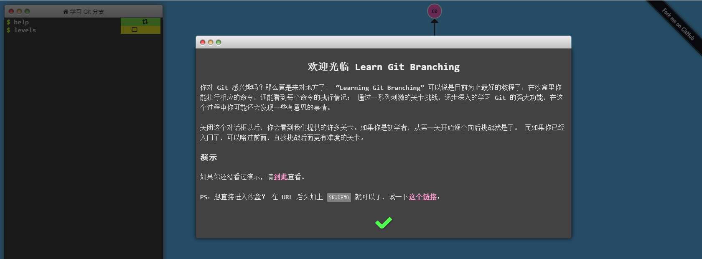

# 基础篇

## Git Commit

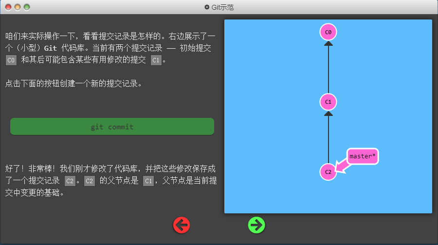

## Git Branch

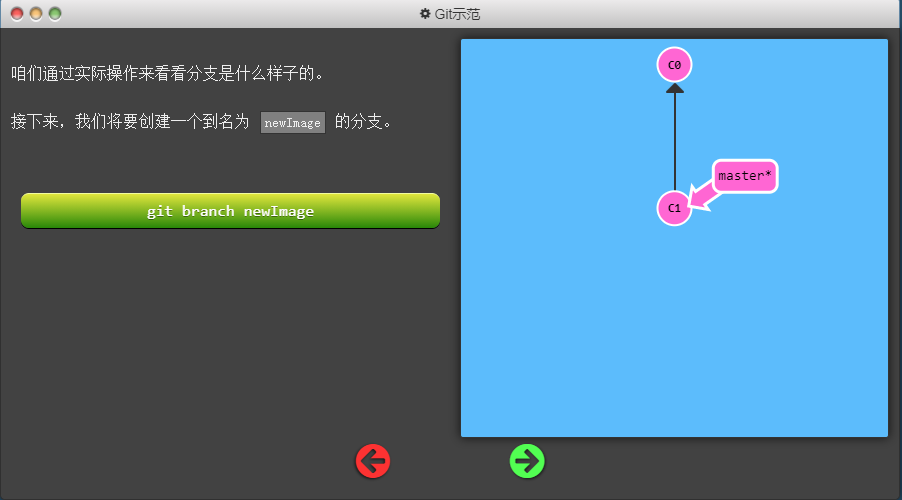

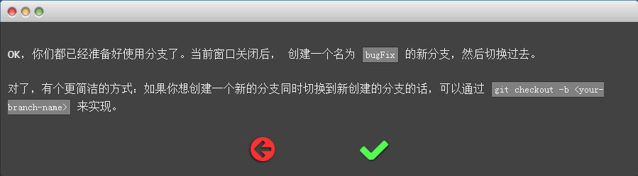

## Git Merge

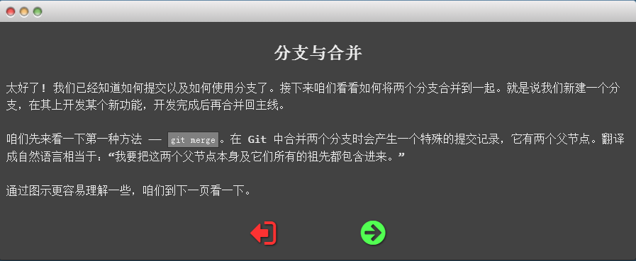

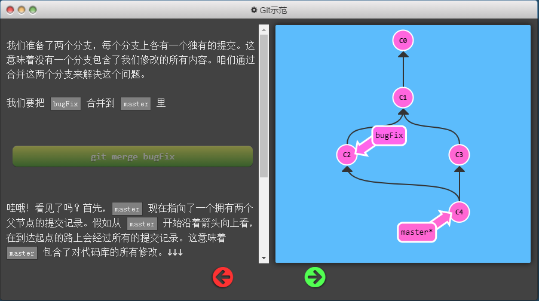

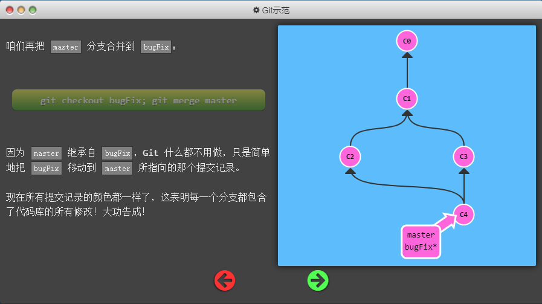

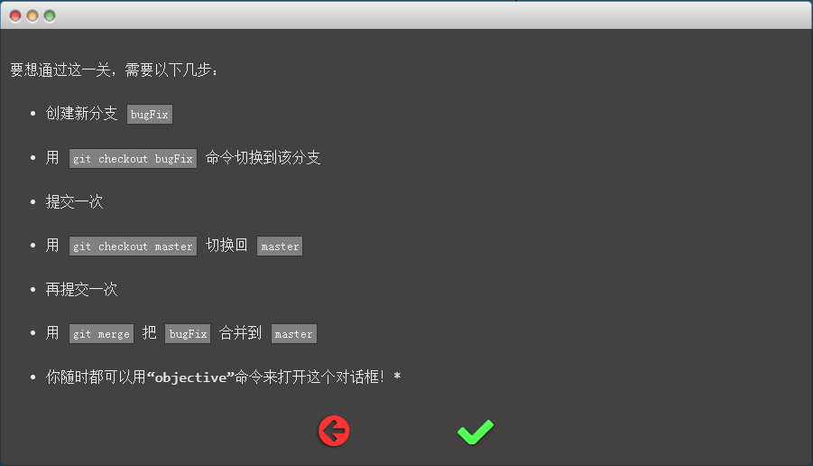

## Git Rebase

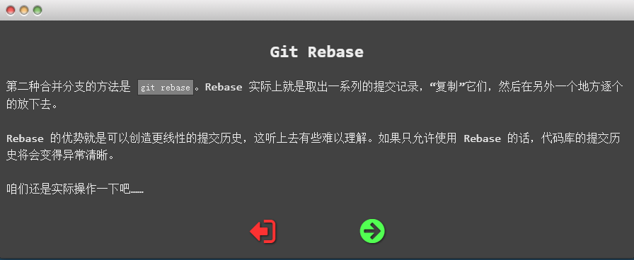

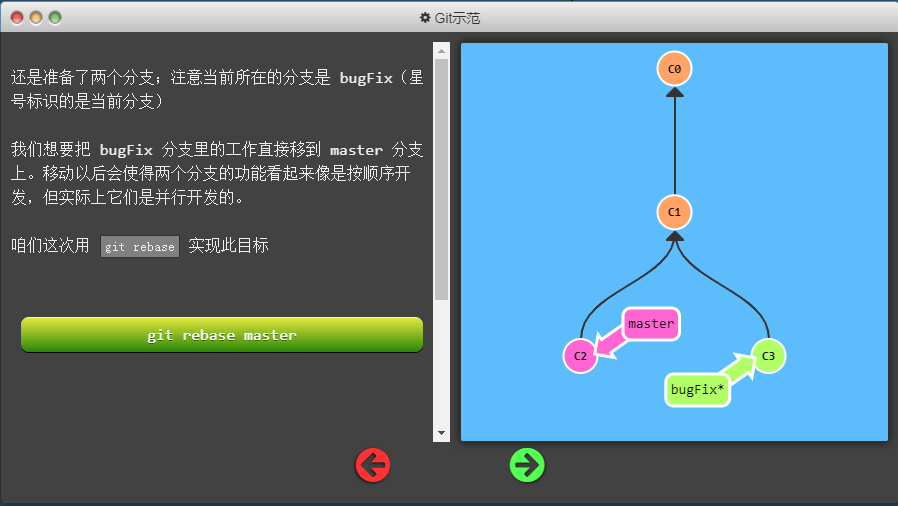

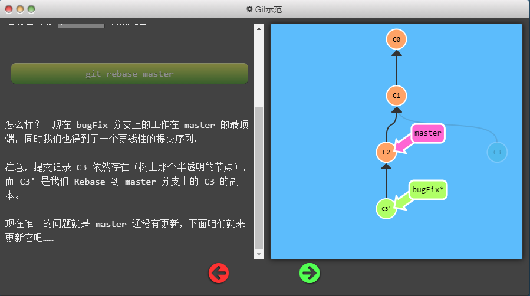

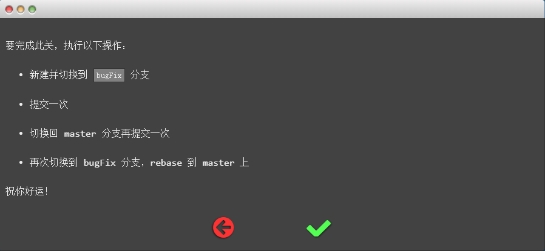

## 在提交树上移动

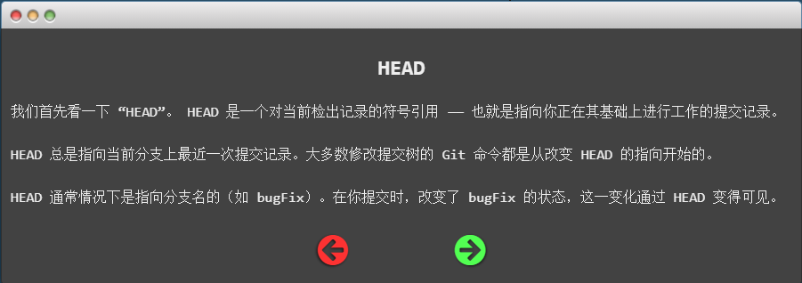

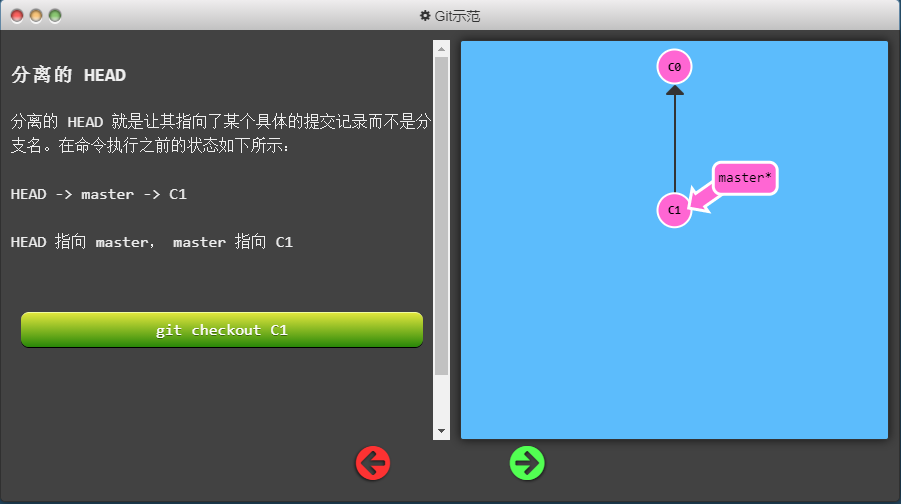

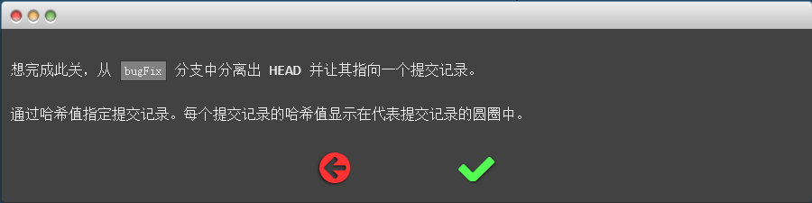

