(注1：不是我耐不住性子，现在主要肯定是重新温习静态页面，写CSS,复习DOM，写些简单的特效出来。但是前后端数据交互AJAX啊，服务器语言PHP，还有以后要学的Node.js啊，这些也是必不可少的，否则后端给你一个数据你都不知道如何导出来，没办法前后端沟通。PHP现在2020年好像很多人唱衰了，就和JQuery一样，但是，还是脚踏实地一点，不要过于功利主义的去学习，对于一个新手来说，学些这些东西是没有什么坏处的。)

(注2：肯定现在的精力不能放在这上面，毕竟前端还有好多知识还没复习完，后面还有Vue这些框架等着呢。这些就当做是调剂品吧，现阶段主要以看视频为主，而且是DOM复习累了才考虑看这些视频。)

(注3：看的是黑马程序员的视频，老师是谁讲义里没找到，笔记就是照抄的课件)

(注4：这PHP语法基础和其他语言几乎都一样，我C语言基础语法学了一遍，JS基础语法学了一遍，现在又要学一遍，都没耐心学了。)

(注5：我在想着要不然先学Node.js吧，PHP就先不学了，但是后来又查了一些资料，权衡了一下，还是先把PHP学完吧，作为一个跳板再来学Node.js，基础语法就算以前学过类似的，咬咬牙再学一遍吧，反正也没有太多，后面要学的东西就不一样了)

(注6：现在是2020年7月26日，学的有点慢，现在才学到PHP基础第3天。基础还有3天，之后是MySQL5天，PHP核心技术5天)

(注7：现在是2020年8月4日，PHP基础终于学完了，也只是大体了解了下，学了点皮毛。后面的MySQL和PHP核心技术想了一下先不学了，转头开始学AJAX。以后有机会的话在适当的时候再去学MySQL这些吧。)

(注8：现在是2020年8月10日，视频虽然已经看完了，但是仍旧感觉学的并不扎实，我想，等以后自己安稳下来了，一定要重新好好的学一遍Java，但是现在情况显然不可能，我决定先用PHP作为后端的敲门砖，然后接下来学Node.js,遥远的未来学Java。我去[PHP中文网](<https://www.php.cn/code/4801.html>)找一些图文教程，再回过头来重新学一遍，查漏补缺，顺便再把这篇博文给完善一下。我最近租了个腾讯云的服务器，也正好需要PHP这方面的知识，服务器这件事也促使我不得不重视PHP了。)

# PHP简介

## 什么是PHP

PHP定义：一种**服务器端**的 HTML **脚本/编程语言**,是一种简单的、面向对象的、解释型的、健壮的、安全的、性能非常之高的、独立于架构的、可移植的、动态的**脚本语言**。是一种广泛用于 Open Source（开放源代码）的尤其适合 Web 开发并可以嵌入 HTML 的多用途脚本语言。它的语法接近 C，Java 和 Perl，而且容易学习。该语言让 **Web 开发人员**快速的书写**动态生成的网页**。

PHP前身：Personal HomePage，个人主页，使用Perl语言开发的一种写个人主页的语言。

PHP：**PHP Hypertext Preprosessor**，中文名是**PHP超文本预处理器**，底层使用**C语言**。

用PHP做出的动态页面与其他的编程语言相比，PHP是将程序嵌入到HTML（标准通用标记语言下的一个应用）文档中去执行，执行效率比完全生成HTML标记的CGI要高许多；PHP还可以执行编译后代码，编译可以达到加密和优化代码运行，使代码运行更快。

## PHP发展史

Rasmus Lerdorf ：创建者

1994：1.0，个人perl，非常简单（简陋）

1996：2.0，C底层，变的相对比较强大

1998：3.0，zendEngine，联合zend公司共同管理和维护PHP，zendEngine（zend引擎）用户高效的解析php代码

2000：4.0，session+输出缓冲等，session技术（会话技术），

2004：5.0，zend引擎2代，增加新技术（面向对象更新，命名空间，异常）

2015：7.0，新版的ZendEngine引擎，性能提升，新特性（异常）

 

平台支持（window，Linux，UNIX）

数据库支持（Sqlserver，mysql，Oracle，Access）

## 静态网站与动态网站的区别

静态网站：web1.0时代

动态网站：web2.0时代

### 网站

Website的中文名称是网站，是指在互联网上，根据一定的规则，使用HTML、PHP等代码语言制作的用于展示特定内容的相关网页的集合，有可供管理人员操作的后台及用户使用的前台。简单地说，Website是一种通讯工具，就像布告栏一样，人们可以通过Website来发布自己想要公开的资讯，或者利用Website来提供相关的网络服务。人们可以通过网页浏览器来访问Website，获取自己需要的资讯或者享受网络服务。

### 静态网站特点

 1.网页内容一经发布到网站服务器上，无论是否有用户访问，每个静态网页的内容都是保存在网站服务器上的，也就是说，静态网页是实实在在保存在服务器上的文件，每个网页都是一个独立的文件； 

 2.静态网页的内容相对稳定，因此容易被**搜索引擎检索**；

 3.**静态网页没有数据库的支持**，在网站制作和维护方面工作量较大，因此当网站信息量很大时完全依靠静态网页制作方式比较困难；  

 4.静态网页的**交互性较差**，在功能方面有较大的限制。

### 动态网站特点

1.交互性：**网页会根据用户的要求和选择而动态地改变和响应**，浏览器作为客户端，成为一个动态交流的桥梁，动态网页的交互性也是今后Web发展的潮流。

 2.自动更新：即无须手动更新HTML文档，便会自动生成新页面，可以大大节省工作量。

 3.因时因人而变：即当不同时间、不同用户访问同一网址时会出现不同页面。

 4.此外动态网页是与静态网页相对应的，也就是说，网页URL的后缀不是.htm、.html、.shtml、.xml等静态网页的常见形式，而是以.asp、.jsp、.php、.perl、.cgi等形式为后缀。在动态网页网址中有一个标志性的符号——“?”

# 网站基本概念

## 服务器概念

服务器（server），也称伺服器，是提供计算服务的设备。由于服务器需要**响应服务请求**，并**进行处理**，因此一般来说服务器应具备**承担服务并且保障服务的能力**。

服务器的构成包括处理器、硬盘、内存、系统总线等，和通用的计算机架构类似，但是由于需要提供高可靠的服务，因此在处理能力、稳定性、可靠性、安全性、可扩展性、可管理性等方面要求较高。

在网络环境下，根据服务器提供的服务类型不同，分为**文件服务器**，**数据库服务器**，**应用程序服务器**，**WEB服务器**等。

服务器：**能够提供服务的机器，取决于机器上所安装的软件（服务软件）**。

Web服务器：提供web服务（网站访问），就需要安装web服务软件，Apache，tomcat，IIS等。

> 所谓服务器：不要把它想的太过于高深，不过就是提供一项特殊功能（服务）的电脑而已。
>
> 显示网页的叫网页(web)服务器（server）。
>
> 帮我们代为收发电子邮件(Email)的服务器叫邮件服务器。
>
> 帮我们把各个游戏玩家连接在一起的叫游戏服务器。
>
> 帮我们存储数据的叫数据库服务器
>
> ... ...等等

## IP的概念

IP：Internet
Protocol，网络之间互联协议。网络之间互连的协议也就是为**计算机网络相互连接进行通信而设计的协议**。在因特网中，它是能使连接到网上的所有计算机网络实现相互通信的一套规则，规定了计算机在因特网上进行通信时应当遵守的规则。任何厂家生产的计算机系统，只要遵守IP协议就可以与因特网互连互通。**IP地址具有唯一性**。（每台电脑都有一个唯一的IP地址）。

## 域名

域名（Domain Name），是由一串用点分隔的名字组成（www.itcast.cn）的Internet上某一台计算机或计算机组的名称，用于在数据传输时标识计算机的电子方位（有时也指地理位置，地理上的域名，指代有行政自主权的一个地方区域）。域名是一个IP地址上有“面具” 。一个域名的目的是便于记忆和沟通的一组服务器的地址（网站，电子邮件，FTP等）。域名作为力所能及难忘的互联网参与者的名称。

特殊IP：127.0.0.1，代表本机

特殊域名：localhost

## DNS

DNS（Domain Name System，域名系统），因特网上作为域名和IP地址相互映射的一个分布式数据库，能够使用户更方便的访问互联网，而不用去记住能够被机器直接读取的IP数串。通过主机名，最终得到该主机名对应的IP地址的过程叫做域名解析（或主机名解析）。

用户输入域名localhost—》DNS（localhost 127.0.0.1）--》服务器电脑

## 端口

端口（Port），可以认为是设备与外界通讯交流的出口。端口可分为虚拟端口和物理端口，其中虚拟端口指计算机内部或交换机路由器内的端口，不可见。例如计算机中的80端口、21端口、23端口等。物理端口又称为接口，是可见端口，计算机背板的RJ45网口，交换机路由器集线器等RJ45端口。

用户输入域名localhost:端口—》DNS（localhost 127.0.0.1）--》服务器电脑—》软件（服务）

# Web程序的访问流程

Web分为两类：静态网站和动态网站

浏览器发起访问—》DNS解析域名—》服务器电脑---》服务软件

## 静态网站访问

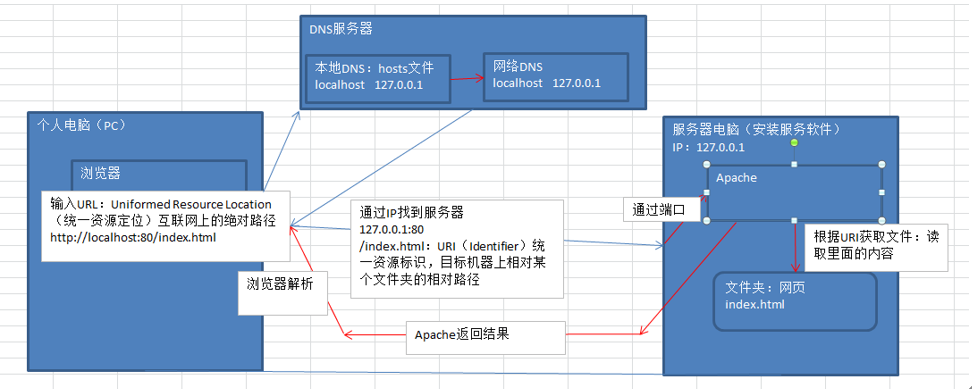

## 动态网站访问

动态网站访问流程与静态差不多，但是会多出几个内容：服务器端解析、数据库

> 如何安装并配置Apache服务器，安装MySQL等略。

# PHP语法初步

PHP是一种运行在服务器端的脚本语言，可以嵌入到HTML中。

## PHP代码标记

在PHP历史发展中，可以使用多种标记来区分PHP脚本

**ASP标记**：< % php代码 %>

**短标记**：< ? Php代码 ?>，以上两种基本弃用，如果要使用那么需要在配置文件中开启

**脚本标记**：< script language="php">php代码< /script>

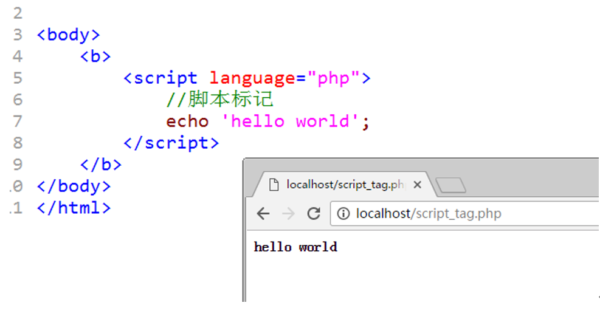

**标准标记（常用）**：< ?php php代码?>

## PHP注释

习惯：所有的代码在写的过程中都必须进行注释，对于初学者而言，注释就是个人学习和写代码的一个思路说明

PHP中注释分为两种：行注释和块注释

**行注释**：一次注释一行

   ~~~
//:后面跟的所有内容都是注释
 #: 与//一样
   ~~~

**块注释**：一次注释多行

      ~~~
/*:中间直到*/出现之前，全部都是注释
*/
​      ~~~

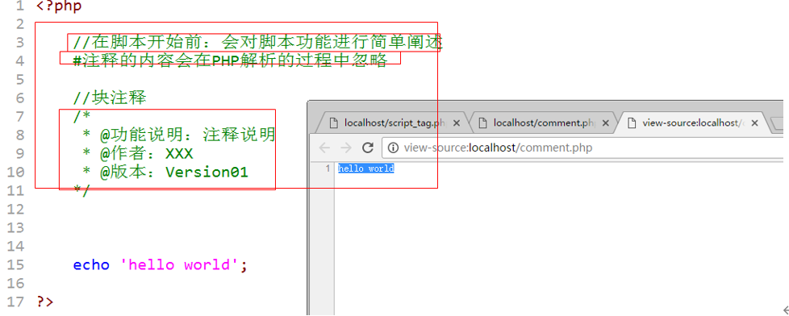

## PHP语句分隔符

语句分隔符：在PHP中，代码是以行为单位，系统需要通过判断行的结束，该结束通常都是一个符号：**分号**“;”（英文状态下的分号）

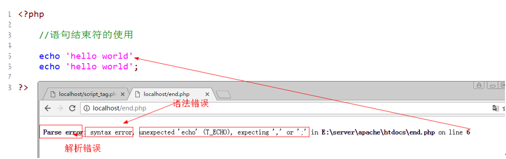

特殊说明：

1.PHP中标记结束符?>有自带语句结束符的效果，最后一行PHP代码**可以**没有语句结束符“;”（但是不建议省略分号）。

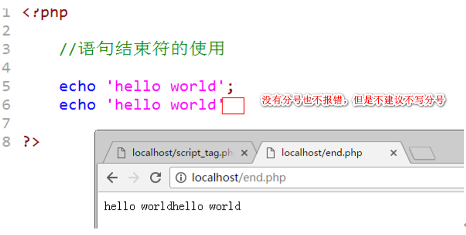

2.PHP中其实很多代码的书写并不是嵌入到HTML中，而是单独存在，通常书写习惯中就**不建议使用标记结束符?>**，PHP会自动从开始到最后全部认为是PHP代码，从而解析。

# 变量

PHP是一种动态网站开发的脚本语言，动态语言特点是**交互性**，会有**数据的传递**，而PHP作为“中间人”，需要进行**数据的传递**，传递的前提就是PHP能自己存储数据（临时存储）。

## 变量基本概念

变量来源于数学，是计算机语言中能**储存计算结果**或能表示值抽象概念。**变量可以通过变量名访问**。在指令式语言中，**变量通常是可变的**。

1、 变量是用来存储数据的；

2、 变量是存在名字的；

3、 变量是通过名字来访问的：访问的内容是数据

4、 变量是可以改变的：改变的内容是数据。

> 杯子本身是一个变量，杯子里可以放水，也可以将水倒掉放糖。

## 变量的使用

PHP中的**所有变量都必须使用“$”符号**

1、  定义：在系统中增加对应的变量名字（内存）

2、  赋值：可以将数据赋值给变量名（可以在定义的同时完成）

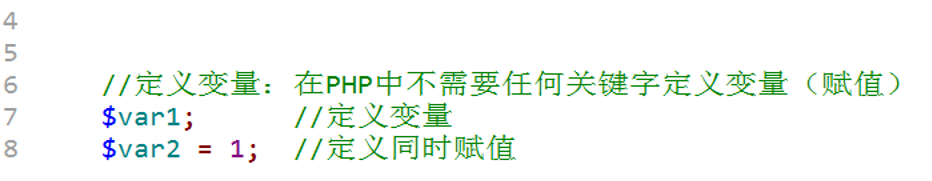

3、  可以通过变量名访问存储的数据

> 输出的不是变量名var2,而是变量的内容2。

4、  可以将变量从内存中删除(释放内存，使用unset关键字)

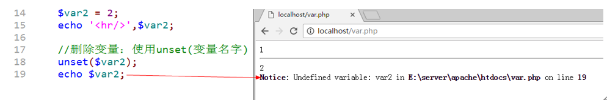

## 变量命名规则

1、  在PHP中变量名字必须以“$”符号开始；

2、  名字由字母、数字和下划线“_”构成，但是不能以数字开头；

3、  在PHP中本身还允许中文变量（不建议）。

## 预定义变量

预定义变量：提前定义的变量，系统定义的变量，存储许多需要用到的数据（预定义变量都是数组）

**$_GET**：获取所有表单**以get方式提交的数据**

**$_POST**：POST提交的数据都会保存在此

**$_REQUEST**：GET和POST提交的都会保存

**$GLOBALS**：PHP中**所有的全局变量**

**$_SERVER**：服务器信息

**$_SESSION**：session会话数据

**$_COOKIE**：cookie会话数据

$_ENV：环境信息

$_FILES：用户上传的文件信息

## 可变变量

可变变量：如果一个变量保存的值刚好是另外一个变量的名字，那么可以直接通过访问一个变量得到另外一个变量的值：在变量前面再多加一个$符号。

~~~
$a = ‘b’;
$b = ‘bb’;
则：
$$a -> bb
~~~

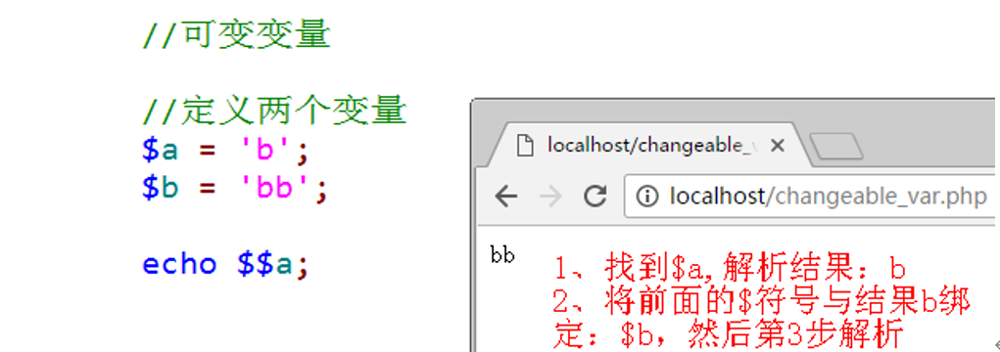

## 变量传值

将一个变量赋值给另外一个变量：变量传值

变量传值一共有两种方式：**值传递**，**引用传递**

**值传递**：将变量保存的值复制一份，然后将新的值给另外一个变量保存（两个变量没有关系）

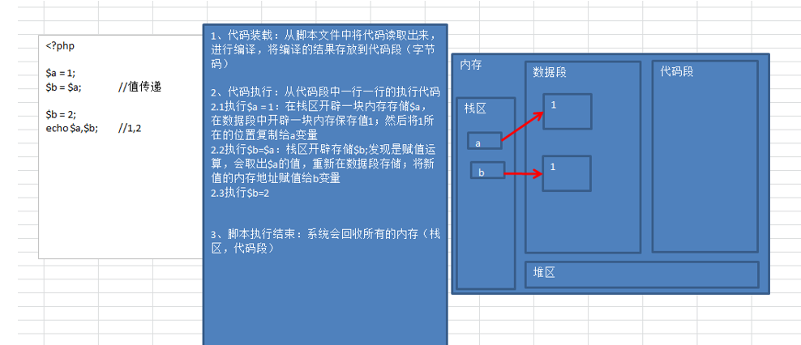

**引用传递**：将变量保存的值所在的内存地址，传递给另外一个变量：两个变量指向同一块内存空间（两个变量是同一个值）

~~~
$新变量  = &$老变量;
(&表示地址符号)
~~~

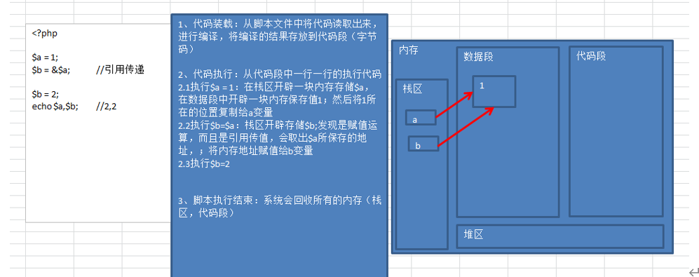

在内存中，通常有以下几个分区

栈区：程序可以操作的内存部分（不存数据，运行程序代码），少但是快

代码段：存储程序的内存部分（不执行）

数据段：存储普通数据（全局区和静态区）

堆区：存储复杂数据，大但是效率低

代码实现：

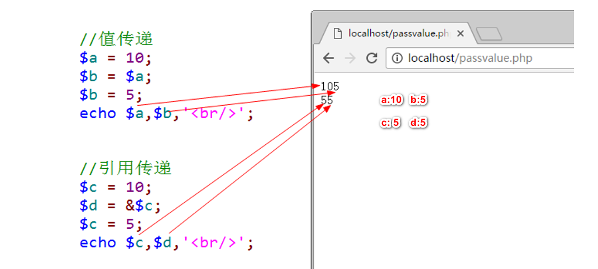

# 常量

常量与变量一样，都是用来保存数据的。

## 常量基本概念

常量：const/constant，是一种在程序运行当中，不可改变的量（数据）

常量一旦定义，通常数据不可改变（用户级别）

## 常量定义形式

在PHP中常量有两种定义方式（5.3之后才有两种）

1、  使用定义常量的**函数**：**define(‘常量名’,常量值);**

2、  5.3之后才有的：**const 常量名 = 值;**

常量名字的命名规则

1.**常量不需要使用“$”符号**，一旦使用系统就会认为是变量；

2.常量的名字组成由字母、数字和下划线组成，不能以数字开头；

3.常量的名字通常是以**大写字母**为主（与变量以示区别）；

4.常量命名的规则比变量要松散，可以使用一些特殊字符，该方式只能使用**define**定义；

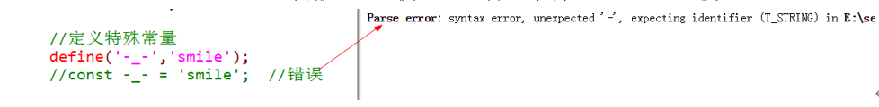

注意细节：

1、  Define和const定义的常量是有区别：在于**访问权限区别**(以后学)

2、  定义常量通常不区分大小写，但是可以区分，可以参照define函数的第三个参数

## 常量使用形式

常量的使用与变量一样：不可改变数值（在定义的时候必须赋值---第一次不赋值，以后就没有赋值的机会了）

有的时候还需要使用另外一种形式来访问（针对的是特殊名字的常量），需要用到另外一个访问常量的**函数**：constant(‘常量名’)

> -_-和smile都要加引号！！！！！！！！！！！！！！

说明：常量和变量的使用

1、  凡是数据会可能变化的，那么肯定是用变量

2、  数据不一定会变的，可以使用常量或者变量（变量居多）

3、  数据不允许被修改的，一定用常量

## 系统常量

常用的几个系统常量

PHP_VERSION：PHP版本号

PHP_INT_SIZE：整形大小

PHP_INT_MAX：整形能表示的最大值（PHP中整形是允许出现负数：带符号）

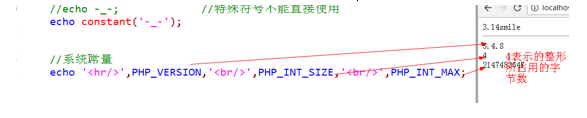

在PHP中还有一些特殊的**常量**，他们由**双下划线开始+常量名+双下划线结束**，这种常量称之为**系统魔术常量**：魔术**常量的值通常会跟着环境变化，但是用户改变不了**。(不受用户控制)

__ DIR __：当前被执行的脚本所在电脑的绝对路径

__ FILE __：当前被执行的脚本所在的电脑的绝对路径（带自己文件的名字）

__ LINE __：当前所属的行数

__ NAMESPACE __：当前所属的命名空间

__ CLASS __：当前所属的类

__ METHOD __：当前所属的方法

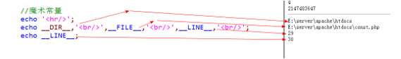

# 数据类型

数据类型：data type，在PHP中指的是**存储的数据本身的类型**，而**不是变量的类型**。PHP是一种弱类型语言，**变量本身没有数据类型**。

(一个箱子，规定只能放洗发水，其他不能放，那变量也有数据类型。而一个箱子，洗发水，手机什么的都可以放，那变量本身也就没有数据类型的概念了，也就是弱类型语言了)

## PHP的八种数据类型

在PHP中将数据分为**三大类八小类**：

> **简单（基本）数据类型**：4个小类
>
> 整型：int/integer，系统分配**4个字节**存储，表示整数类型（有前提--存得下）
>
> 浮点型：float/double(PHP中是一个概念)，系统分配**8个字节**存储，表示**小数**或者**整型存不下的整数**
>
> 字符串型：string，系统根据**实际长度**分配，表示字符串（**引号**）
>
> 布尔类型：bool/boolean，表示布尔类型，只有两个值：true和false
>
>  
>
> **复合数据类型**：2个小类
>
> 对象类型：object，存放对象（学完面向对象才能了解）
>
> 数组类型：array，存储多个数据（一次性）
>
>  
>
> **特殊数据类型**：2个小类
>
> 资源类型：resource，存放资源数据（PHP外部数据，如数据库、文件）
>
> 空类型：NULL，只有一个值就是NULL（不能运算）

## 类型转换(重点)

类型转换：在很多的条件下，需要**指定的数据类型**，需要外部数据（当前PHP取得的数据），转换成目标数据类型

在PHP中有两种类型转换方式：

1、 **自动转换**：系统根据需求自己判定，自己转换（用的比较多，**效率偏低**）--虽然不是自己转换，很省事，但是系统转换很慢。

2、 **强制（手动）转换**：认为根据需要的目标类型转换

强制转换规则：在**变量之前增加一个括号()**，然后**在里面写上对应类型**：int/integer….其中**NULL类型用到unset()**

在转换过程中，用的比较多的就是**转布尔类型（判断）**和**转数值类型（算术运算）**

其他类型转布尔类型：true或者false，在PHP中比较少类型换变成false(基本上都以true为多)

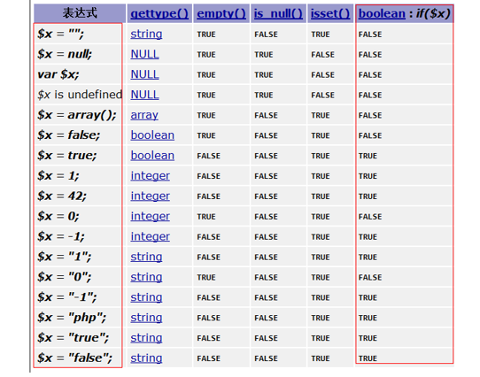

其他类型转数值的说明

1、 布尔true为1，false为0；

2、 字符串转数值有自己的规则

2.1  **以字母开头的字符串，永远为0**；

2.2  **以数字开头的字符串**，取到**碰到字符串为止**（不会同时包含两个小数点）

## 类型判断(重点)

通过一组类型判断函数，来判断变量，最终返回这个变量所保存数据的数据类型（相同结果为true，失败为false）：是**一组以is_开头后面跟类型名字的函数：is_XXX(变量名)**

Bool类型不能用echo来查看，可以使用**var_dump**结构查看(因为它给你一个true，你怎么知道是字符串的true还是数字的true呢？？)

Var_dump(变量1,变量2…)

> var_dump()方法，判断一个变量的类型与长度，并输出变量的数值，如果变量有值，则输出是变量的值，并返回数据类型。

还有**一组函数**可以用来**获取以及设定数据（变量）的类型**

**Gettype(变量名)**：**获取**类型，得到的是该类型对应的字符串

**Settype(变量名,类型)**：**设定**数据类型：与强制转换不同

1、 强制转换(类型)变量名，是对数据值**复制的内容进行处理**（不会处理**实际存储**的内容）

2、 settype会**直接改变数据本身**

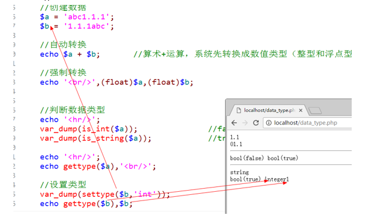

# 整数类型

整数类型：保存整数数值（范围限制），4个字节存储数据，最大就是32位：42亿多。但是在PHP中默认是**有符号类型（区分正负数）**(要把一半变成负数，所以是-21亿到+21亿之间)

在PHP中提供了四种整型的定义方式：十进制定义，二进制定义，八进制定义和十六进制定义

~~~php
$a = 120;     //10进制
$a=0b110;    //2进制
$a=0120;     //8进制
$a=0x120;    //16进制
~~~

> 注意是数字0不是英文字母o！！！！

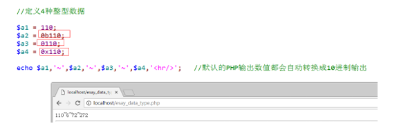

 

十进制：逢10进1，能够出现的数字是0-9

二进制：逢2进1，能够出现的数字是0-1

八进制：逢8进1，能够出现的数字是0-7

十六进制：逢16进1，能够出现的数字是0-9以及a-f，a表示10，依此类推

 

进制转换：手动转换

10进制转二进制：除2倒取余法

不管得到的结果如何，需要补足32位：前面补0：00000000 00000000 00000000 00001010

10进制转二进制：取出最大的2的N次方，直到结果为0

二进制到十进制之间的转换：从右侧开始，将对应的第几位作为2的指数，然后将所有的结果相加

PHP中不需要用户这么复杂的去计算，提供了很多的函数进行转换

**Decbin()**：十进制转二进制

**Decoct()**：十进制转八进制

**Dechex()**：十进制转十六进制

**Bindec()**：二进制转十进制

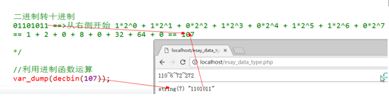

# 浮点类型

浮点型：**小数类型**以及**超过整型所能存储范围的整数（不保证精度）**，精度范围大概在15个有效数字左右

浮点型定义有两种方式：

$f = 1.23;

$f = 1.23e10;  //科学计数法，其中e表示底10

# 布尔类型

# 运算符

运算符：operator，是一种将数据进行运算的特殊符号，在PHP中一共有十种运算符之多。

## 赋值运算符

赋值运算：符号是“=”，表示将右边的结果（可以是变量、数据、常量和其它运算出来的结果），保存到内存的某个位置，然后将**位置的内存地址**赋值给左侧的变量（常量）。

## 算术运算符

算术运算：基本算术操作

+：执行数据累加

-：数据相减

\*：键盘上没有乘法符号，使用*代替，两个数相乘

/：**正斜杠**代替，表示两个数相除（注意是正斜杠）

%：取余（模）运算，两个数（整数）相除，保留余数

> 在进行除法运算或者取余运算的时候，对应的除数（第二个数）不能为0

## 比较运算符

比较运算：比较两个数据的大小，或者两个5185容是否相同，返回的结果都是布尔类型：满足返回true，不满足返回false

\>：左边大于右边，返回结果true

\>=：左边大于等于右边

<：左边小于右边

<=：左边小于或者等于右边

**：左边的与右边的相同（**大小**相同）

!=：左边的与右边的不同（大小不同）

**=：全等于，左边与右边相同：**大小以及数据的类型**都要相同

!**：不全等于，只有大小或者类型不同

## 逻辑运算符

逻辑运算：针对不同的结果进行匹配。满足条件返回true，不满足返回false

&&：逻辑与，左边的条件与右边的条件同时成立（两边结果都为true）

||：逻辑或，左边的条件或者右边的条件只要有一个满足即可

！：逻辑非，对已有条件进行取反，本身为true，取反结果就是false

逻辑与和逻辑或又称之为短路运算：如果第一个表达式结果已经满足条件了，那么就不会运行逻辑运算符后面的表达式：在书写代码的时候，尽量将**出现概率最高的（能够直接判断出结果）的表达式放到第一位**。

## 连接运算符（PHP独有的小点点表示连接）

连接运算：是PHP中将多个字符串拼接的一种符号(在JS中用的是+号)

. ：将两个**字符串**连接到一起

.= ： 复合运算，将左边的内容与右边的内容连接起来，然后重新赋值给左边变量

A .= b 等价于A = A . b

## 错误抑制符

在PHP中**有一些错误可以提前预知**，但是这些错误可能无法避免，但是又不希望报错给用户看，可以使用错误抑制符处理。

@：在可能出错的表达式前面使用@符号即可

错误抑制符通常在**生产环境（上线）**会用到，在**开发**的时候不会用：我们要保证系统本身最好没有任何错误。

## 三目运算符

三目运算：有三个表达式参与的运算（简单的的**分支结构**缩写）

语法格式：

~~~
表达式1 ? 表达式2 ：表达式3；
~~~

运算：**如果表达式1成立，那么执行表达式2，否则执行表达式3；**

注意：如果表达式本身比较**复杂**，建议**使用括号**包起来。

三目运算可以进行复合三目运算：三目运算中的表达式2和3都是可以是另外一个三目运算。

~~~
表达式1 ？ (表达式2 ? 表达式4 : 表达式5) : (表达式3 ? 表达式5 : 表达式6);
~~~

> 三目运算符里还可以套三目运算符

## 自操作运算符

自操作：**自己操作自己**的运算符

++：在原来的值上+1

--：在原来的值上-1

~~~php
$a = 1;
$a++; // 等价于$a = $a + 1;
~~~

在PHP中自操作符是可以放到**变量前或者后**：**前置自操作和后置自操作**

~~~php
$a = 1;
$a++;
++$a;   
~~~

 前置或者后置如果**本身只有自操作**，不参与其他运算（自操作同时），那么**效果是一样的**。但是如果自操作同时还参与别的运算，那么效果就不一样

~~~php
$a = 1;
$b = $a++;		//$a++会导致$a = $a + 1; $a = 2; $b = 1
$c =++$a;			//++$a会导致$a = $a + 1; $a = 2; $c = 2;
~~~

后置自操作(高老头，自私)：先把自己所保存的值留下来，然后改变自己，自己给别人的值是原来的值；

前置自操作(雷锋，无私)：**先把自己改变，然后把改变后的值给别人**。

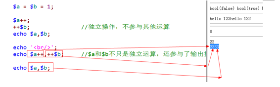

**衍生符号：类似自操作**

+=：左边的结果与右边结果相加，然后赋值给左边

-=：左边的减去右边的结果，然后赋值给左边

*=：乘法操作

/=：除法操作

%=：模操作

~~~php
注意：右边是一个整体 $a -= $b - 1; => $a = $a - ($b - 1);
~~~

如果进行**除法或者取余运算**，那么要**考虑右边表达式的结果是否为0**（为0出错）。

## 计算机码

计算机码：计算机在**实际存储数据**的时候，采用的**编码规则**（二进制规则）

计算机码：**原码、反码和补码**，数值本身最左边一位是用来充当符号位：正数为0，负数为1

原码：数据本身**从十进制转换成二进制得到的结果**

​     正数：**左边符号位为0**（正数的原码、反码和补码就是原码本身,所以不需要我们做任何的改变）

​     负数：**左边符号位为1**

反码：**针对负数**(正数的反码还是它自己)，**符号位不变，其他位取反**

补码：**针对负数**(正数的补码还是它自己)，**反码+1**

> 在计算机系统中，数值一律用**补码**来表示（存储）。
>
> 主要原因：**使用补码，可以将符号位和其它位统一处理**；同时，**减法也可按加法来处理**。另外，两个用补 码表示的数相加时，如果最高位（符号位）有进位，则进位被舍弃。
>
>  补码与原码的转换过程几乎是相同的。

系统中存在两个0：**+0和-0**(但是本质都是一样的，都是0)为了解决00000000和10000000本质是一样的问题，所以才有了反码和补码

[我们为什么需要反码和补码？](<https://www.jianshu.com/p/a1b385b24189>)

~~~
+0： 00000000

-0： 10000000    原码

取反 11111111

补码(反码+1) 00000000
~~~

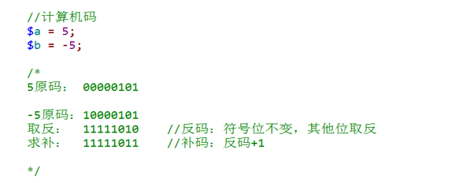

## 位运算符

位运算：取出**计算机中最小的单位（位bit）**进行运算

&：**按位与**，两个位都为1，结果为1，否则为0

|：**按位或**，两个有一个为1，结果为1

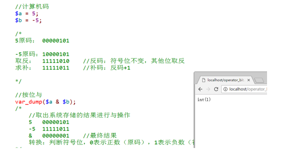

注意：

1、 系统进行任何**位运算**的时候都是使用的**补码**

2、 运算结束之后都必须**转换成原码**才是最终要显示的数据

> 计算转换成补码计算，展示转换成原码展示

~：**按位非**，一个位如果为1则变成0，否则反之。

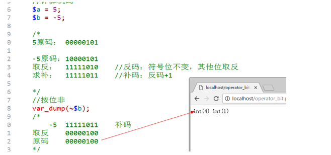

^：**按位异或**，**两个相同则为0，不同则为1**

<<：**按位左移**，整个位（通常整数是32位），**向左移动一位**，右边补0(左边被挤出去了，右边补0)

\>>：**按位右移**，整个位向右移动一位，**左边补符号位对应内容**（正数补0，负数补1）

按位左移：乘以2的操作

按位右移：除以2的操作（**不完全正确**）：整数除2会出现小数

## 运算符优先级

运算符优先级：在多种运算符同时存在的时候，如何结合运算。

> 逻辑运算符和位运算符的区别：
>
> 逻辑运算符只能对boolean类型进行逻辑运算，而位运算还可以对数值进行运算；
>
> 逻辑运算符有短路情况，即前面的表达式可以得到最终结果时，后面的表达式将不被执行。

# 流程控制

流程控制：**代码执行的方向**

## 控制分类

**顺序结构**：代码从上往下，顺序执行。（代码执行的最基本结构）

**分支结构**：给定一个条件，同时有多种可执行代码（块），然后会根据条件执行某一段代码

**循环结构**：在某个条件控制范围内，指定的代码（块）可以重复执行

## 顺序结构

顺序结构：最基本结构，所有代码默认都是从上往下依次执行

## 分支结构

在PHP中，分支结构主要有两种：**if分支和switch分支**

If：如果的意思，给定一个条件，同时为该条件设置多种（两种）情况，然后通过条件判断来实现具体的执行段

基本语法：if分支PHP也提供多种方式来实现

**最简if结构**：只有一段代码，但是可以选择是否执行

~~~php
If(条件表达式){
	//满足条件所要执行的内容; //里面也是顺序结构
}
~~~

**基础if结构**：有两面性，满足条件或者不满足条件都有对应的执行代码

~~~php
If(条件表达式){
	//满足条件后执行的代码段;
}else{
	//不满足条件执行的代码段;
}
~~~

**复杂if结构**：在判断条件之后，通常就有两种结果：满足或者不满足，在**不满足之后还可以再次进行条件判断**

~~~php
If(条件表达式1){
		//满足条件表达式1的代码段;
}elseif(条件表达式2){
		//不满足表达式1条件，但是满足表达式2的代码;
}…	//可以使用多个elseif来进行再次条件筛选
 else{
	//全部不满足要执行的代码;
}
~~~

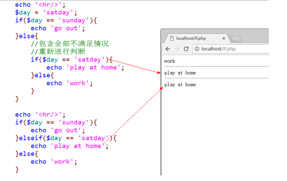

注意：如果条件特别多才会采用复合if形式

1、 如果条件比较单一（同一个条件），会采用elseif复合方式

~~~php
if($day == 'sunday'){
		echo 'go out play';
	}else if($day == 'saturday'){
		echo 'play at home';
	}else{
		echo 'work';
	}
~~~

2、 如果判断条件不一致，建议使用**嵌套语法**（不宜有太多层嵌套：影响代码美观）

~~~php
if($day == 'sunday'){
		echo 'go out play';
	}else{
		//包含全部不满足情况
		//重新进行判断
		if($day == 'saturday'){
			echo 'play at home';
		}else{
			echo 'work';
		}
	}
~~~

> if分支，适用于所有的条件判断（分支结构）

### Switch分支

Switch分支：有一组情形存在,通过一个条件，而这个条件通常有多个值，但是**每一个值都会有对应不同的代码要执行。**

> switch能做的事情If都能做

Switch判断方式：是**将条件放到分支结构内部判断**

Switch基本语法：

~~~php
Switch(条件表达式){
	//所有条件判断：逐个进行
	Case 值1:					//当前条件表达式的结果与值1相等（**）
		要执行的代码段;
		Break;					
    	//在switch中，如果条件匹配成功，那么系统就不会再次匹配条件，会自动顺序执行向下的所有代码（case	         代码除外），需要中断执行：break表示中断switch（结束）。
	Case 值2:
		要执行的代码段;
		break;
	  ...
    //可以使用类似else的语法：都不匹配
    Default:
	//匹配失败的代码;
		break;
}
~~~

~~~php
<?php

	//分支结构：switch结构

	//根据日期做不同的事情
	
	$day = 1;

	//从1到7做不同的事情
	// if($day == 1){
	// 	echo '1';
	// }else if($day == 2){
	// 	echo '2';
	// }...
	//这种太麻烦了，用switch做简单一些

	switch ($day) {
		//$day条件一定是一个具体的值
		case 1:		//这个表示$day = 1
			echo '1';
			break;
		case 2:		//这个表示$day = 2
			echo '2';
			break;
		case 3:		//这个表示$day = 3
			echo '3';
			break;

		case 4:		//这个表示$day = 4
			echo '4';
			break;

		case 5:		//这个表示$day = 5
			echo '5';
			break;

		case 6:		//这个表示$day = 6
			echo '6';
			break;

		case 7:		//这个表示$day = 7
			echo '7';
			break;

		default:
			echo 'error';
			break;
	}
~~~

If和switch的选择

1、 if能做**所有的**分支结构事情

2、 switch处理的是**条件比较多，同时比较单一，而且是固定值匹配的分支结构**

## 循环结构

循环结构：代码段在一定的控制下，可以多次执行

在PHP中循环结构有以下几种：

**For循环**：通过条件、起始和终止判断执行

**While循环**：通过判断条件终止

**Do-while循环**：跟while差不多

**Foreach循环**：**专门针对数组**

### for循环

1.for循环基本语法

~~~php
for(条件表达式1;条件表达式2;条件表达式3){
	//条件表达式1：定义初始化条件，可以有多种赋值语句存在，使用逗号分隔即可
	//条件表达式2：边界判定，限定循环执行的次数
	//条件表达式3：用来执行条件变化（自操作）
	//循环体
}
~~~

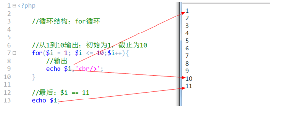

For循环执行原理：

~~~
1、 执行条件表达式1：定义初始化条件（执行一次）
2、 执行条件表达式2：判断条件（N次）
   2.1 满足条件：执行循环体
   2.2 不满足条件：循环结束
3、 执行循环体：（N次）
4、 执行条件表达式3：循环变量变化（N次）
5、 执行条件表达式2：判断条件（N次）
6、 重复执行3-4-2步骤：直到第2步不满足条件结束循环
~~~

2.for循环中条件表达式1的**多变量定义**

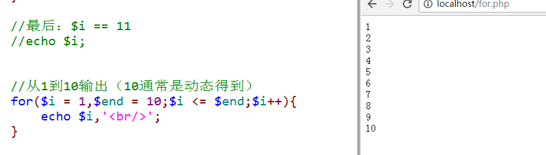

3.For循环特殊使用：for循环中对应的括号（条件）可以一个都没有（死循环）：一定要避免出现

~~~php
For(;;){
	//循环体
}
~~~

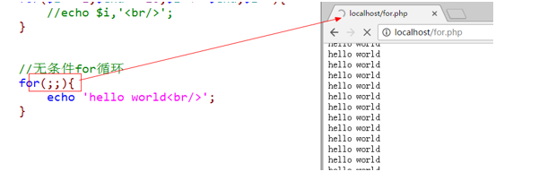

### while循环

while循环基本语法：

~~~php
条件初始化; (这个是在外面初始化的)
while(条件表达式){
	//条件表达式就是判断边界条件
	循环体;	//循环条件的变化
}
~~~

for与while的选择

1、 如果是基于**固定已知条件**（数值而且是有规律的变化），使用for循环

2、 while可以做**灵活的条件判定**（**while使用的比较多**）

### do-while循环

do-while：看着很像while，**while首先进行条件判定然后执行循环体，有可能出现第一次就条件不满足，那么就会直接失败（循环体一次都不执行**）。do-while就是先干了再说（执行循环体），后判断条件。（**至少会执行一次循环体**）

do-while基本语法：

~~~php
do{
	//循环体
}while(条件表达式);
~~~

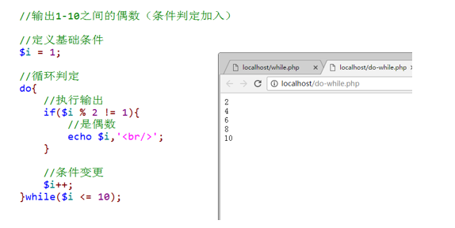

### 循环控制

循环控制：在**循环内部对循环本身进行控制**

**1.中断控制**：重新开始循环，循环体中还有其他内容，也再执行

**Continue 层级**;    //默认是1（循环可以多层嵌套）

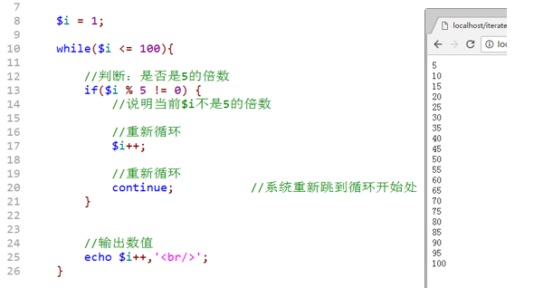

> 这个代码我发现我居然都看不懂了。。。为什么要输出$i++啊？？

**2.终止控制**：循环直接结束

**Break 层级**;       //默认是1

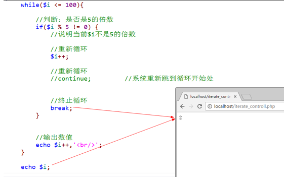

因为循环经常性会碰到**嵌套**（循环中间包含循环），如果在循环内部有些条件下，明确可以知道当前循环（或者说外部循环）不需要继续执行了，那么就是可以使用循环控制来实现：其中内部循环也可以控制到外部，就是通过使用层级参数。

Continue 2;   //当前自己循环后面内容不再执行，同时外部循环如果还有循环体也不再执行，重新来过；

Break 2;       //当前自己循环结束，同时外部也结束（如果还有外部不受影响，继续执行）

## 流程控制替代语法（不熟）

流程控制替代语法：**分支和循环结构的替代语法**

PHP本身是嵌入到HTML中的脚本语言，需要在HTML中书写一些关于判断或者循环的结构语法，必须符合PHP标签规范，需要HTML与PHP进行混搭，如果使用原始的PHP代码那么会非常不美观。

需求：打印一个九九乘法表，使用表格来展示

~~~php
<table border=1>
	<?php for($i = 1;$i < 10;$i++){?>
		<tr>
			<?php for($j = 1;$j <= $i;$j++){?>
				<td>
					<?php echo $i . ' * ' . $j . ' = ' . $i * $j;?>
				</td>
			<?php }?>
		</tr>
	<?php }?>
</table>

<table border=1>
	<?php for($i = 1;$i < 10;$i++):?>
		<tr>
			<?php for($j = 1;$j <= $i;$j++):?>
				<td>
					<?php echo $i . ' * ' . $j . ' = ' . $i * $j;?>
				</td>
			<?php endfor;?>
		</tr>
	<?php endfor;?>
</table>
~~~

PHP中具体有哪些替代语法呢？PHP应该在HTML中只做数据输出，输出通常伴有条件判断和循环操作，因此PHP提供了对应分支结构和循环结构的替代语法：全部都是对应的一个模式：

**左大括号{使用冒号替代：**

**右大括号}使用end+对应的起始标记替代**

~~~php
If：if():    endif;
Switch：switch():   endswitch;
For
While
foreach
~~~

# 文件包含

文件包含：在一个PHP脚本中，去将另外一个文件（PHP）包含进来，去合作完成一件事情。

## 文件包含的作用

文件包含的意义：

1、要么使用被包含文件中的内容，实现代码的共享（重用）：**向上包含**（向上**索要——乞讨**）

向上包含：在当前脚本要用某个代码之前包含别的文件

2、要么**自己有东西**可以给别的文件使用，实现代码的共享（重用）：**向下包含**（向下**给予——施舍**）

向下包含：在自己有某个东西的时候，需要别的脚本来显示（自己代码写完之后包含其他文件）

最大的作用：**分工协作**，每个脚本做的事情不一样，因此可以使用协作方式，让多个脚本共同完成一件事情。

## 文件包含四种形式

在PHP中文件的包含有四种形式（两种大形式）

~~~
Include：包含文件
~~~

~~~
Include_once：系统会自动判断文件包含过程中，是否已经包含过（一个文件最多被包含一次）
~~~

~~~
Require：与include相同
~~~

~~~
Require_once：以include_once相同
~~~

包含基本语法

~~~
语法1：Include ‘文件名字’;

语法2：Include(‘文件名字’);       //文件名字：路径问题
~~~

向上包含(以上方式)：是先包含文件，后使用文件中的内容

向下包含(以下方式)：先准备内容，然后包含另外的文件，在另外的文件中，使用当前的内容

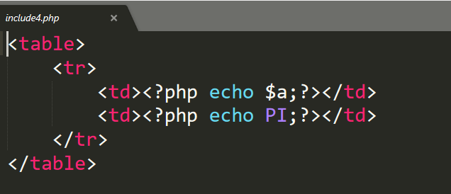

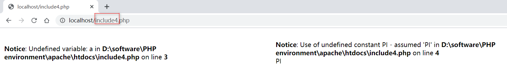

## 文件加载原理

PHP代码的执行流程

1、  读取代码文件（PHP程序）

2、  编译：将PHP代码转换成字节码（生成opcode）

3、  zendengine来解析opcode，按照字节码去进行逻辑运算

4、  转换成对应的HTML代码

文件加载原理：

1、  在文件加载（include或者require）的时候，系统会自动的将被包含文件中的代码相当于嵌入到当前文件中

2、  加载位置：在哪加载，对应的文件中的代码嵌入的位置就是对应的include位置

3、  在PHP中被包含的文件是单独进行编译的

PHP文件在**编译的过程中**如果出现了语法错误，那么会**失败**（**不会执行**）；但是如果**被包含文件**有错误的时候，系统会在执行到**包含include这条语句的时候才会报错**。

## Include和require区别

Include和include_once的区别：

> Include：系统会碰到一次，执行一次；如果对统一个文件进行多次加载，那么系统会执行多次；

> Include_once：系统碰到多次，也只会执行一次。

Require和include的区别：本质都是包含文件，唯一的区别在于包含不到文件的时候，报错的形式不一样

Include的错误级别比较轻：不会阻止代码执行

Require要求较高：如果包含出错代码不再执行（require后面的代码）

> require过于严格，不留情面，只要错误，后面的正确代码也不会执行。而include就比较宽容了，错了也只会报个警告，后面的正确代码还是会照常执行的。

# 文件加载路径

文件在加载的时候需要指定文件路径才能保证PHP正确的找到对应的文件。

文件的加载路径包含两大类：

1、  **绝对路径**

从**磁盘的根目录**开始（本地绝对路径）

~~~
Windows：盘符C:/路径/PHP文件

Linux：/路径/PHP文件
~~~

从**网站根目录**开始（网络绝对路径）

/：相对于网站主机名字对应的路径

~~~
Localhost/index.php -> E:/server/apache/htdocs/index.php
~~~

2、**相对路径**：从当前文件所在目录开始的路径

~~~
.或者./（点或者点杠）:表示当前文件夹

../:上级目录（当前文件夹的上一层文件夹）
~~~

绝对路径和相对路径的加载区别

1、  绝对路径相对效率偏低，但是相对安全（路径不会出问题）

2、  相对路径相对效率高些，但是容易出错（相对路径会发生改变）

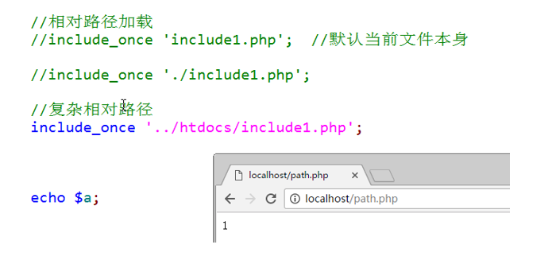

# 文件嵌套包含

文件嵌套包含：一个文件包含另外一个文件，同时被包含的文件又包含了另外一个文件。

嵌套包含的时候就**很容易出现相对路径出错的问题**：相对路径会因为文件的包含而改变（./和../）：windows下面，每一个文件夹下都有.和..的文件夹。

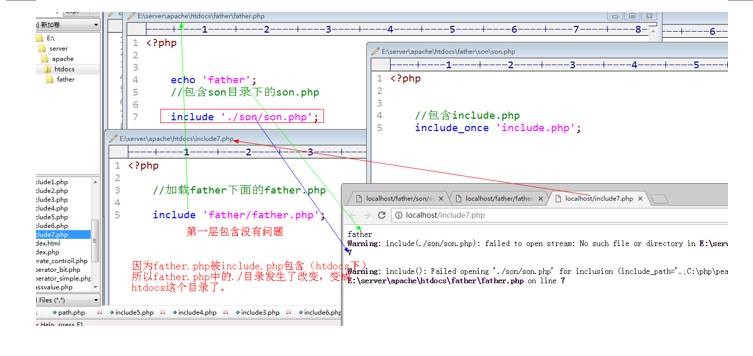

举例解释：张三左边是李四，李四左边是王五

张三把李四叫到自己的位置：李四与王五之间有两个位置，李四如果还按照左边伸手找王五就找不到

# 函数

## 函数的基本概念

函数：function，是一种**语法结构**，将实现**某一个功能的代码块**（多行代码）**封装**到一个**结构**中，从而实现代码的**重复利用（复用）**。

## 函数定义语法

函数有几个对应的关键点：**function关键字**、**函数名**、**参数（形参和实参）**、**函数体和返回值**

基本语法如下：

~~~javascript
Function 函数名([参数]){
	//函数体
	//返回值：return 结果;
}
~~~

定义函数的目的：是为了实现代码的重复利用，**一个功能一个函数**（简单明了）

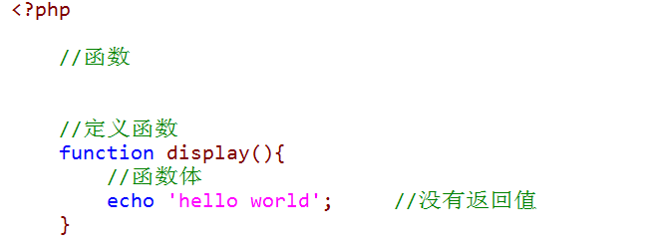

函数的使用：通过访问**函数的名字+()**；   

>  如果函数在定义的过程中有**参数**，那么在调用的时候就必须**传入对应的参数**：函数是一种结构**不会自动运行**，必须通过调用才会执行

函数是在**代码执行阶段**，碰到函数名字的时候才会**调用**，**不是在编译阶段**。

函数的调用特点：只要系统在内存中能够找到对应的函数，就可以执行（函数的**调用**可以在函数**定义之前**）

函数执行的**内存分析**：

> 1.读取代码进入到代码段（编译：将代码变成字节码存储到内存）
>
> 2.根据代码逐行执行

以上原因：编译和执行是分开的（先编译后执行）

## 函数命名规范

命名规范：**由字母、数字和下划线组成，但是不能以数字开头**

函数作为一种常用的结构，一般遵循以下规则：函数通常名字代表着函数的**功能**，而有些功能会比较复杂，可能一个单词不足以表达，需要多个组合。

> 1.驼峰法：除了左边第一个单词外，后面所有的单词首字母都大写：showParentInfo()
>
> 2.下划线法：单词之间通过下划线连接，单词都是小写：show_parent_info()

函数名字：在一个**脚本周期**中，**不允许出现同名函数**（通常在一个系统开发中都不会使用同名函数）

## 参数详解

函数的参数分为两种：**形参和实参**

### 形参

形参：形式参数，**不具有实际意义**的参数，是在**函数定义**时使用的参数

### 实参

实参：实际参数，具有**实际数据意义**的参数，是在**函数调用**时使用的参数

**形参是实参的载体**：**实参**在调用时通常是需要**传入到函数内部**参与计算（运算），那么需要在函数内部去找到实际数据所在的位置才能找到数据本身：需要**实际调用**的时候，**将数据以实参的形式传递给形参**：给形参赋值，从而使得**函数内部可以用到外部数据**。

注意：

> 1.在PHP中允许实参多余形参（个数）：只是多余的实参函数内部不用而已
>
> 2.在PHP中理论上形参个数没有限制（实际开发不会太多）
>
> 3.实参不能少于形参个数

### 默认值

默认值：**default value**，指的是形参的默认值，在函数定义的时候，就给**形参**进行一个**初始赋值**：如果实际调用传入的参数（**实参**）没有提供，那么**形参**就会使用**定义时的值**来进入函数内部参与**运算**。

通常默认值是用在一些一定会有某个数据参与，但是可能通常是某个我们知道的值。

注意事项：

1.默认值的定义是放在最右边的（多个），不能左边形参有默认值，但是右边没有

2.**函数外部**定义的变量名字与**函数内部**定义的形参名字冲突（同名）是没有任何关联关系的；如果**多个函数使用同样的形参名字也不冲突**。

## 引用传递

实参在调用时会将值赋值给形参，那么实际上使用的方式就是一种简单的值传递：将实参（如果是变量或者常量或者其他表达式）的结果（值）取出来赋值给形参：**形参**与外部实际传入的参数(**实参**)本身**没有任何关联关系**：只是**结果一样**。

有的时候，希望在**函数内部拿到的外部数据**，能够在**函数内部改变**，那么就需要明确告知函数（**定义时**），函数才会在**调用**的时候去主动获取**外部数据的内存地址**。以上这种定义形式参数的方式叫作**引用传值**。

基本定义语法：

~~~javascript
Function 函数名(形参1,&形参2){
	//函数体
}
~~~

在**调用**的时候，必须给引用传值的参数位置传入**实际参数**，而且**参数本身必须是变量**。（变量才有指向的数据的内存地址）

> 引用传值注意事项：在传入**实参**的时候，必须传入**变量**

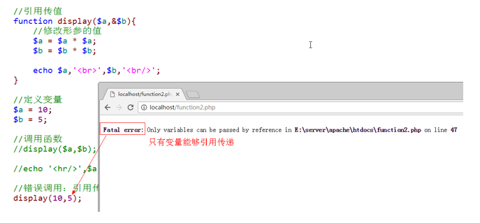

## 函数体

函数体：函数内部（**大括号{}里面**）的所有代码都称之为**函数体**

函数体：基本上所有的代码都可以实现

> 1.定义变量
>
> 2.定义常量
>
> 3.使用流程控制（分支、循环）
>
> 4.可以调用函数

## 函数返回值

返回值：return，指的是将函数实现的结果，通过**return**关键字，返回给**函数外部**（**函数调用处**）：在PHP中**所有的函数都有返回值**。（如果没有明确return使用，那么系统默认返回**NULL**）

返回值作用：将**计算结果返回给调用处**

注意：函数的**返回值可以是任意数据类型**

return关键字：

>  1.return在函数内部存在的价值：返回当前函数的结果（**当前函数运行结束**）

>  2.return还可以**在文件中直接使用**（**不在函数里面**）：代表文件将结果return后面跟的内容，转交给包含当前文件的位置。（通常在系统配置文件中使用较多），在文件中也代表中终止文件后面的代码：**return之后的内容不会执行。**

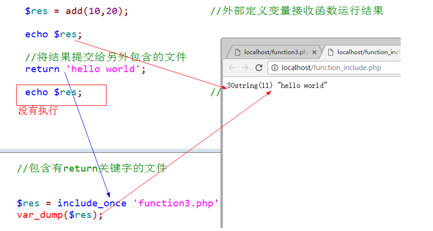

# 作用域

作用域：变量（常量）能够**被访问的区域**

> 1.变量可以在普通代码中定义
>
> 2.变量也可以在函数内部定义

在PHP中作用域严格来说分为两种：但是**PHP内部**还定义一些在严格意义之外的一种，所以**总共算三种**：

~~~
1.全局变量：就是用户普通定义的变量（函数外部定义）
~~~

所属**全局空间**：在PHP中只允许在**全局空间**使用：理论上**函数内部不可访问**

> 和JS不一样，JS在函数内部也可以访问全局变量的

 **脚本周期**：直到脚本运行结束（**最后一行代码执行完**）

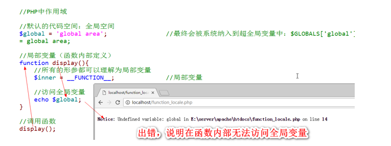

~~~
2.局部变量：就是在函数内部定义的变量
~~~

所属**当前函数空间**：在PHP中只允许在**当前函数自己内部使用**

> 所有的形参都可以理解为局部变量

> 综上所述：函数内部和外部的变量互相不交流融通，互相都访问不了，老死不相往来。

**函数周期**：**函数执行结束**（**函数**是在栈区中**开辟独立内存空间**运行）

~~~
3.超全局变量：系统定义的变量（预定义变量：$_SERVER、$_POST等）
~~~

所属**超全局空间**：**没有访问限制**（函数内外都可以访问）。超全局变量会将**全局变量**自动纳入到\$GLOBALS里面，而$GLOBALS没有作用域限制，所以能够帮助局部去访问全局变量：但是必须使用**数组方式**。

如果想**函数内部使用外部变量**：除了$GLOBALS之外，通过**参数传值**（如果要统一战线[里面修改和外面修改一样]还可以使用**引用传值**）。

在PHP中，其实还有一种方式，能够**实现全局访问局部，同时局部也可以访问全局**：**global关键字**

global关键字：是一种在**函数里面定义变量**的一种**方式**

> 1.如果**使用global定义的变量名**在**外部存在**（全局变量），那么系统在**函数内部**定义的变量直接指向外部全局变量所指向的内存空间（同一个变量）
>
> 2.如果使用global定义的变量名在**外部不存在**（全局变量），系统会自动在全局空间（外部）定义一个与局部变量同名的全局变量

本质的形式：在函数的内部和外部，对一个**同名变量**（全局和局部）**使用同一块内存地址保存数据，从而实现共同拥有。**

基本语法：

~~~
global 变量名;		//不能赋值（只能先定义，不能同时赋值）
变量名 = 值;		//修改
~~~

虽然以上方式可以实现局部与全局的互访，但是通常不会这么用。一般如果会存在特殊使用，也会使用参数的形式来访问。（还可以使用常量：define定义的）

# 静态变量(static)

静态变量：**static**，是在**函数内部**定义的变量，使用static关键字修饰，用来实现**跨函数共享数据**的变量：**函数运行结束所有局部变量都会清空**，如果重新运行一下函数，所有的局部变量又会**重新初始化**。

基本语法：

~~~javascript
Function 函数名(){
	//定义变量
	Static $变量名 = 值;		//通常会在定义的时候就直接赋值
}
~~~

静态变量的作用是为了跨函数共享数据（**同一个函数被多次调用**）

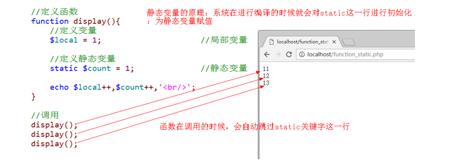

静态变量的使用：

> 1.为了统计**当前函数被调用的次数**（有没有替代方法？）
>
> 2.为了统筹**函数多次调用得到的不同结果**（递归思想）

# 可变函数

可变函数：当前有一个**变量所保存到值**，**刚好是一个函数的名字**，那么就可以使用**变量+()**来**充当函数名**使用。

~~~javascript
$变量 = ‘display’;
function display(){
}

//可变函数
$变量();
~~~

可变函数在系统使用的过程中还是比较多的，尤其是使用很多系统函数的时候：需要用户在外部定义一个自定义函数，但是是需要传入到系统函数内部使用。

# 匿名函数

匿名函数：**没有名字的函数**

基本语法：

~~~javascript
变量名 = function(){
	函数体
};		
//函数要调用才能运行，如果只是定义这样的一个结构是没有办法去运行的，所以通常要定义个变量来保存这个函数
//变量本身是一种赋值，赋值的话基本语法要用一个分号作为结束
~~~

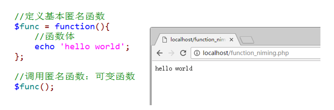

变量保存匿名函数，本质得到的是一个**对象**（Closure——object(Closure)#1 (0) { }）

# 闭包(没怎么懂)

闭包：closure， 一词来源于以下两者的**结合**：要**执行的代码块**（由于自由变量被包含在代码块中，这些自由变量以及它们引用的对象没有被释放）**和**为**自由变量提供绑定的计算环境（作用域）**

简单理解：函数内部有一些**局部变量**（要执行的代码块）在函数执行之后**没有被释放**，是因为在函数内部还有对应的函数在**引用**（**函数的内部函数：匿名函数**）

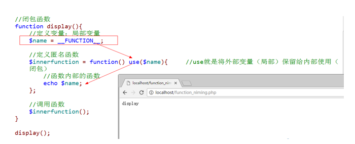

证明：函数的局部变量在函数使用完之后没有被释放？

> 1.使用内部匿名函数；
>
> 2.匿名函数使用句变量：use；
>
> 3.匿名函数被返回给外部使用；

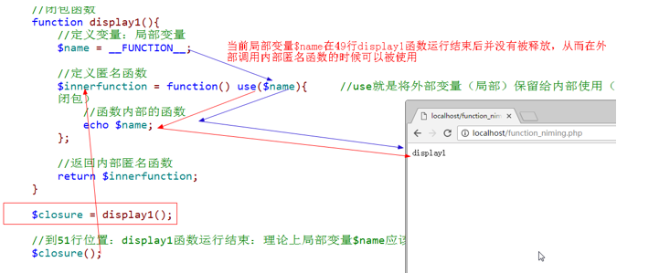

> 闭包在JS中也是一个重要的概念，听说面试的时候特别喜欢问，所以这个问题一定要花时间给弄懂。

# 伪类型

伪类型：假类型，实际上在PHP中不存在的类型。但是通过伪类型可以帮助程序员去**更好的查看操作手册**从而更方便学习。

伪类型主要有两种：在**三大类八小类之外**

Mixed：混合的，可以是多种PHP中的数据类型

Number：数值的，可以是任意数值类型（整形和浮点型）

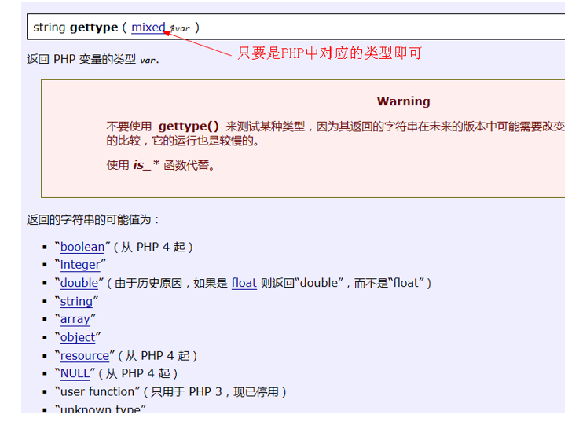

# 常用系统函数

## 有关输出的函数

①**print()**：**类似于echo输出提供的内容**，本质是一种**结构**（**不是函数**），**返回1**，**可以**不需要使用括号

②**print_r()**：**类似于var_dump**，但是比var_dump简单，不会输出数据的类型，只会输出值（数组打印使用比较多）

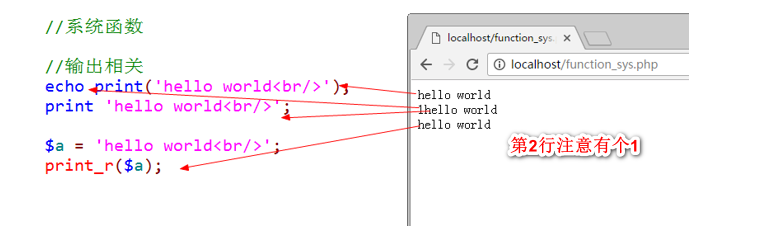

## 有关时间的函数

①**date()**：按照指定格式对应的时间戳（从**1970年格林威治时间**开始计算的**秒数**），如果没有指定特定的时间戳，那么就是**默认解释当前时间戳**。

②**time()**：获取当前时间对应的时间戳

③**microtime()**：获取**微秒级别**的时间——用于进行压力测试

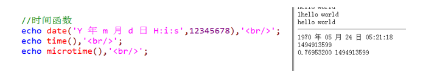

④**strtotime()**：按照规定格式的字符串转换成时间戳

## 有关数学的函数

~~~
max()：指定参数中最大的值

min()：比较两个数中较小的值

rand()：得到一个随机数，指定区间的随机整数

mt_rand()：与rand一样，只是底层结构不一样，效率比rand高（建议使用）

round()：四舍五入

ceil()：向上取整——向上得到一个比当前整数大的最小整数

floor()：向下取整——向下得到一个比当前整数小的最小整数

pow()：求指定数字的指定指数次结果：pow(2,8) == 2^8 == 256

abs()：绝对值

sqrt()：求平方根
~~~

## 有关函数的函数

①**function_exists()**：判断指定的**函数名字是否在内存中存在**（帮助用户不去使用一个不存在的函数，让代码安全性更高）

②**func_get_arg()**：在自定义函数中去**获取指定数值对应的参数**

③**func_get_args()**：在自定义函数中**获取所有的参数（数组）**

④**func_num_args()**：获取当前自定义函数的**参数数量**

# 错误处理

错误处理：指的是**系统（或者用户）**在对某些代码进行执行的时候，发现有错误，就会通过**错误处理的形式**告知程序员。

## 错误分类

1）**语法错误**：用户书写的**代码不符合PHP的语法规范**，语法错误会导致代码在**编译过程中不通过**，所以**代码不会执行（Parse error）**

2）**运行时错误**：代码**编译通过**，但是代码在执行的过程中会出现一些条件不满足导致的错误（runtime error）

3）**逻辑错误**：程序员在写代码的时候不够规范**，出现了一些**逻辑性的错误**，导致代码正常执行，但是得不到想要的结果

~~~javascript
$a = 10;
If($a = 1){		//最常见把比较符号写成赋值符号
	//执行代码	
}
~~~

## 错误代号

所有看到的**错误代号**在PHP中**都被定义成了系统常量（可以直接使用）**

1）**系统错误**：

**E_PARSE**：编译错误，代码不会执行

**E_ERROR**：fatal error，致命错误，会导致代码不能正确继续执行（出错的位置断掉）

**E_WARNING**：warning，警告错误，不会影响代码执行，但是可能得到意想不到的结果

**E_NOTICE**：notice，通知错误，不会影响代码执行

2）**用户错误**：**E_USER_ERROR, E_USER_WARNING, E_USER_NOTICE**

用户在使用自定义错误触发的时候，会使用到的错误代号（**系统不会用到**）

3）**其他**：**E_ALL**，代表着所有从错误（通常在**进行错误控制的时候使用比较多**），建议在开发过程中（开发环境）使用所有以E开头的错误常量（代号）其实都是由一个字节存储，然后每一种错误占据一个对应的位，如果想进行一些错误的控制，可以使用**位运算进行操作**

**排除通知级别**notice：**E_ALL** &  **~E_NOTICE**（~E_NOTICE表示取反，也叫按位非）

**只要警告和通知**：E_WARNING | E_NOTICE

## 错误触发

**程序运行时触发**：系统自动根据错误发生后，对比对应的错误信息，输出给用户：**主要针对代码的语法错误和运行时错误**。

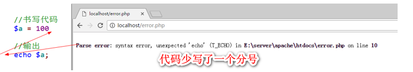

**人为触发**：知道某些逻辑可能会出错，从而使用对应的判断代码来触发响应的错误提示

**trigger_error(错误提示)**：

可以通过第二个参数进行严格性控制:

# 错误显示设置

错误显示设置：哪些错误该显示，以及该如何显示

在PHP中，其实有两种方式来设置当前脚本的错误处理

**1.PHP的配置文件**：全局配置——php.ini文件

~~~php
Display_errors：是否显示错误
Error_reporting：显示什么级别的错误
~~~

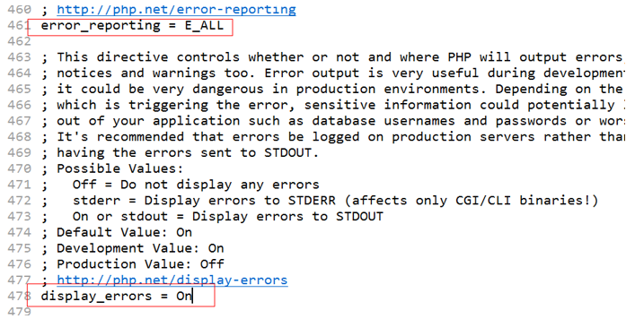

**2.可以在运行的PHP脚本中去设置**：在**脚本中**定义的配置项**级别**比配置文件**高**（通常在开发当中都会在代码中去进行控制和配置）

~~~
Error_reporting()：设置对应的错误显示级别
Ini_set(‘配置文件中的配置项’,配置值)
Ini_set(‘error_reporting’,E_ALL);
Ini_set(‘display_errors’,1);
~~~

# 错误日志设置

在实际生产环境中，不会直接让错误赤裸裸的展示给用户：

~~~
1.不友好
2.不安全：错误会暴露网站很多信息（路径、文件名）
~~~

所以在**生产环境**中，一般不显示错误（错误也比较少），但是不可能避免会出现错误（**测试**的时候不会发现所有的问题），这个时候不希望看到，但是又希望**捕捉**到可以让后台程序员去修改：需要保存到**日志文件**中，需要在PHP**配置文件中**或者**代码中（ini_set）**设置**对应error_log配置项**

**1.开启日志功能**

 **2.指定路径**

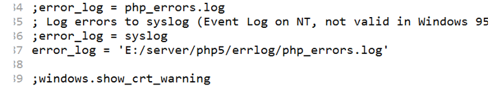

# 自定义错误处理

最简单的错误处理：trigger_errors()函数，但是该函数**不会阻止系统报错。**

PHP系统提供了一种用户处理错误的机制：用户**自定义错误处理函数**，然后将该函数增加操系统错误处理的**句柄**中，然后**系统**会在碰到错误之后，**使用用户定义的错误函数**。

**1.如何将用户自定义的函数放到系统中？**——**set_error_handler()**

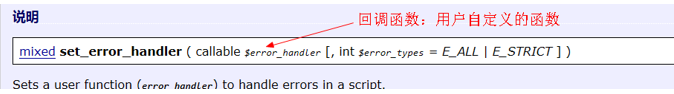

**2.自定义错误处理函数，系统有要求**

代码实现：

**1.自定义错误处理函数：注意参数**

**2.注册自定义函数：修改错误处理机制**

当前属于简单自定义模式，如果要复杂，可以在某些影响代码功能的错误发生后，让用户**跳转到某个指定界面**。

# 字符串类型

## 字符串定义语法

1）**单引号**字符串：使用单引号包裹

2）**双引号**字符串：使用双引号包裹

**引号方式**：比较适合定义那些**比较短**（不超过一行）或者**没有结构要求**的字符串。

如果有结构要求，或者内容超过一行，可以使用以下两种结构定义：

3）**nowdoc**字符串：**没有单引号**的单引号字符串

~~~php
$str = <<<'边界符'
	字符串内容
边界符;
~~~

> 这个边界符有单引号在上面

4）**heredoc**字符串：**没有双引号**的双引号字符串

~~~php
$str = <<<边界符
	字符串内容
边界符;
~~~

> 这个边界符没有单引号在上面

heredoc和nowdoc比引号还是要区别多一点:

## 字符串转义

转义的含义：在计算机通用协议中，有一些特定的方式定义的字母，系统会特定处理：通常这种方式都是使用**反斜杠+字母（单词）**的特性：

~~~
\r\n：回车换行
~~~

PHP在识别转义字符的时候也是使用同样的模式：**反斜杠+字母**

 在PHP中系统常用的转义符号：

~~~php+HTML
\’：在单引号字符串中显示单引号
\”：在双引号字符串中显示双引号
\r：代表回车（理论上是回到当前行的首位置）
\n：代表新一行
\t：类似tab键，输出4个空格
\$：在PHP中使用$符号作为变量符号，因此需要特定识别
~~~

**单引号和双引号的区别**：

1.其中**单引号中能够识别\’**，而**双引号中就不能识别\'**（下图浏览器查看的是页面源代码）

> 在JavaScript中单引号和双引号就没有任何区别，PHP就是破事多
>
> 一个是只能识别单引号，一个是除了单引号其他都能识别

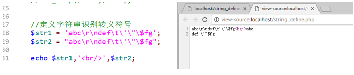

2.双引号中因为能够**识别$符号**，所以**双引号中可以解析变量**，而**单引号不可以**

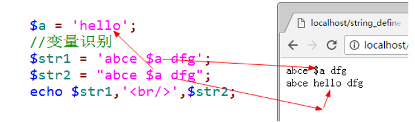

**双引号**中**变量识别**的规则

1）变量本身系统能够与后面的内容区分：应该**保证变量的独立性**，不要让系统难以区分

2）使用变量专业标识符（区分），**给变量加上一组大括号{}**

> 加空格的话会有一些额外的输出，浪费资源

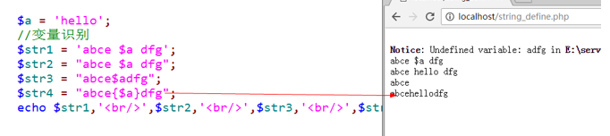

 **结构化定义字符串变量**的规则：

1.结构化定义字符串对应的边界符有条件：

* **上边界符**后面**不能跟任何内容**；

* **下边界符**必须**顶格**：**最左边**；(不能为了格式好看而空格！！！)

* 下边界符同样**后面只能跟分号，不能跟任何内容**；

2.结构化定义字符串的内部（**边界符之间**）的**所有内容都是字符串本身**

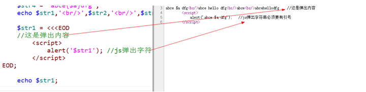

# 字符串长度问题

1）基本函数strlen()：得到字符串的长度（**字节为单位**）

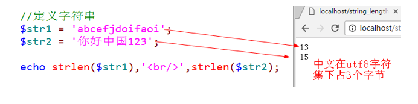

2）多字节字符串的长度问题：包含中文的长度

3）多字节字符串扩展模块：mbstring扩展（mb：Multi Bytes）

首先需要加载PHP的mbstring扩展

可以使用**mb扩展**带来很多函数

Mbstring扩展针对的是一些关于字符统计：strlen只是针对标准交换码ASCII，mtstring会针对不同的字符集。

# 字符串相关函数

1）**转换函数**：**implode()，explode()， str_split()**

* implode(连接方式,数组)：将数组中的元素按照**某个规则**连接成一个字符串

* explode(分割字符,目标字符串)：将字符串按照某个格式进行分割，变成数组

~~~javascript
中国|北京|顺义 == array(‘中国’,‘北京’,’顺义’);
~~~

* str_split(字符串,字符长度)：按照指定长度拆分字符串得到数组

2）**截取函数**：**trim()， ltrim()， rtrim()**

* trim(字符串[,指定字符])：本身默认是用来去除字符串两边的空格（**中间不行**），但是也可以指定要去除的内容，是按照指定的内容循环去除两边有的内容：直到碰到一个不是目标字符为止

* ltrim()：去除左边的

* rtrim()：去除右边的

3）**截取函数**：**substr()，strstr()**

* substr(字符串,起始位置从0开始[,长度])：指定位置开始截取字符串，可以截取指定长度（不指定到最后）

* strstr(字符串,匹配字符)：从指定位置开始，截取到最后（可以用来取文件后缀名）

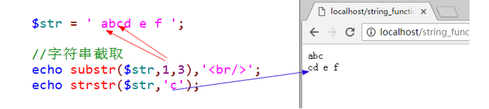

4）**大小转换函数**：**strtolower()，strtoupper()，ucfirst()**

* strtolower：全部小写

* strtoupper：全部大写

* ucfirst：首字母大写

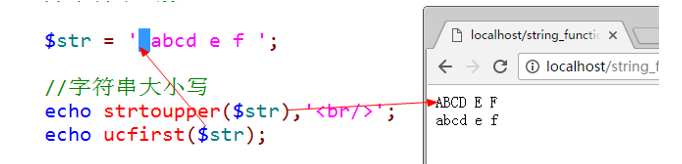

5）**查找函数**：**strpos()，strrpos()**

* strpos(字符串，匹配字符)：判断字符在目标字符串中**首次**出现的位置

* strrpos(字符串，匹配字符)：判断字符在目标字符串中**最后**出现的位置

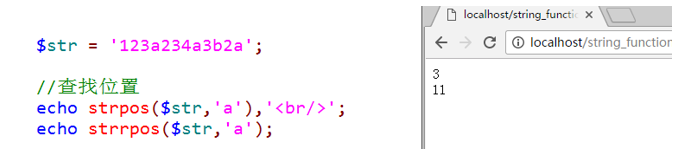

6）**替换函数**：**str_replace()**

* str_replace(匹配目标,替换的内容,字符串本身)：将目标字符串中部分字符串进行替换

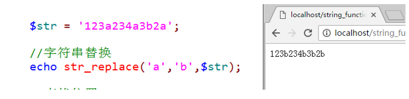

7）**格式化函数**：**printf()， sprintf()**

printf/sprintf(输出字符串有占位符,顺序占位内容...)：格式化输出数据

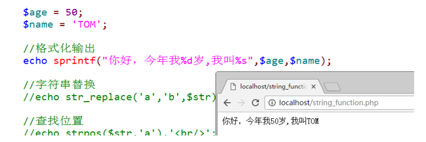

8）**其他**：**str_repeat()，str_shuffle()**

* str_repeat()：重复某个字符串N次

* str_shuffle()：随机打乱字符串(可以做验证码)

# 数组的概念

数组：array，数据的组合，指将一组数据（多个）存储到一个指定的容器中，用变量指向该容器，然后可以通过变量**一次性**得到该容器中的所有数据。

# 数组定义语法

在PHP中系统提供多种定义数组的方式：

1.使用**array关键字**：最常用

~~~php
$变量 = array(元素1,元素2,元素3..);
~~~

2.可以使用**中括号**来包裹数据：

~~~php
$变量 = [元素1,元素2…];
~~~

3.**隐形**定义数组：给变量增加一个中括号，系统自动变成数组

~~~php
$变量[] = 值;     //如果不提供下标也可以，系统自动生成（数字：从0开始）
$变量[下标] = 值;  //中括号里面内容称为下标key，该下标可以是字母（单词）或者数字，与变量命名的规则相似
~~~

> 除了数字可以做下标以外，字符串也是可以做下标的！！！

# PHP数组特点

1)可以整数下标或者字符串下标

* 如果数组下标都为整数：索引数组

* 如果数组下标都为字符串：关联数组

2)不同下标可以混合存在：混合数组

3) 数组元素的顺序**以放入顺序为准**，**跟下标无关**

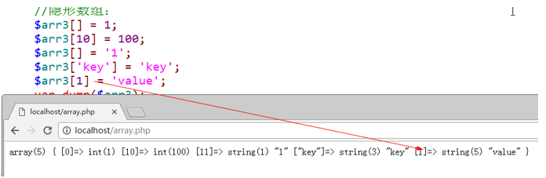

4)数字下标的自增长特性：从0开始自动增长，如果中间手动出现较大的，那么**后面的自增长元素从最大的值+1开始**

5)特殊值下标的自动转换

~~~php
布尔值：true和false
空：NULL
~~~

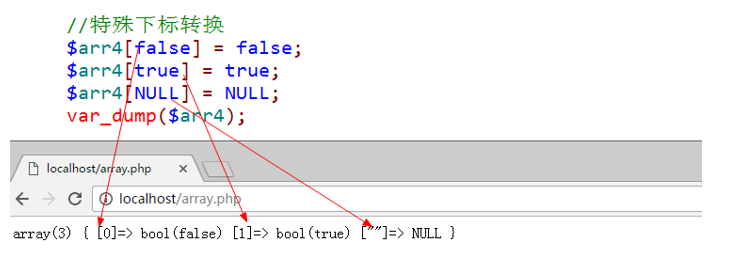

6)PHP中数组元素没有类型限制

7)PHP中数组元素没有长度限制

>  补充：PHP中的数组是很大的数据，所以存储位置是**堆区**，为当前数组分配一块**连续的内存**。(本身效率就不高，你再把它分开，找起来就更麻烦了)

# 多维数组

多维数组：数组里面的元素又是数组。

## 二维数组

二维数组：数组中所有的元素都是一维数组。

## 多维数组

在第二维的数组元素中可以继续是数组，在PHP中**没有维度限制**（PHP本质并没有二维数组）

>  但是，不建议使用超过三维以上的数组，会增加访问的复杂度，降低访问效率。

## 异形数组（不规则数组）

异形数组：数组中的元素不规则，有普通基本变量也有数组。

>  在实际开发中，并不常用，尽量让数组元素规则化（便于进行访问）

# 数组遍历

## 遍历的基本含义

数组遍历：普通数组数据的访问都是通过数组元素的**下标**来实现访问，如果说数组中所有的数据都需要依次输出出来，就需要我们使用到一些简化的规则来实现自动获取下标以及输出数组元素。

~~~php
$arr = array(0=>array(‘name’ => ‘Tom’),1=>array(‘name’ => ‘Jim’));	//二维数组
~~~

* 访问一维元素：**$arr[一维下标]**

~~~php
$arr[0];    //结果：array(‘name’ => ‘Tom’);
~~~

* 访问二维元素：$arr\[一维下标][二维下标]

~~~php
$arr[1][‘name’];	//Jim
~~~

## foreach遍历语法

基本语法如下：

~~~php
Foreach($数组变量 as [$下标 =>] $值){
	//通过$下标访问元素的下标；通过$值访问元素的值
}
~~~

通常：如果是关联数组（字母下标），就需要下标，如果是数字下标就直接访问值。

获取下标的方式：

在进行数据存储定义的时候，通常二维数组不会两个维度的key下标都为数字，一般是一维为数字（无意义），二维为字符串（数据库表字段），所以在进行遍历的时候，通常是只需要针对一维进行遍历，取得二维数组元素，然后二维数组元素通过下标去访问。

## foreach遍历原理

foreach遍历的原理：本质是数组的内部有一颗指针，默认是指向数组元素的第一个元素，foreach就是利用指针去获取数据，同时移动指针。

~~~php
foreach($arr as $k => $v){
	//循环体
}
~~~

1.foreach会重置指针：让指针指向第一个元素；

2.进入foreach循环：通过指针取得当前第一个元素，然后将下标取出放到对应的下标变量\$k中（如果存在），将值取出来放到对应的值变量$v中；（指针下移）

3.进入到循环内部（循环体），开始执行；

4.重复2和3，直到在2的时候遇到指针取不到内容（指针指向数组最后）

## for循环遍历数组

for循环：基于已知边界条件（起始和结束）然后有条件的变化（规律）

因此：for循环遍历数组有对应条件

1.获取数组长度：count(数组)得到数组元素的长度

2.要求数组元素的下标是规律的数字

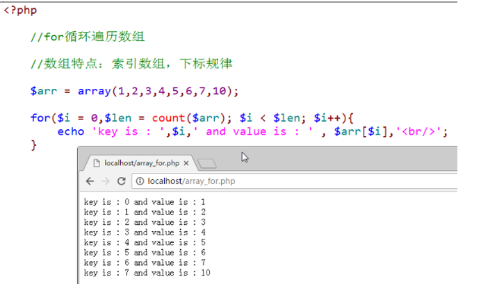

## while配合each和list遍历数组(没看懂)

1.while是在外部定义边界条件，如果要实现可以和for循环一样。(自己试着写一下，老师不讲了)

2.each函数使用：each能够从一个数组中获取当前数组指针所指向的元素的下标和值，拿到之后将数组指针下移，同时将拿到的元素下标和值以一个**四个元素的数组返回**：

~~~php
0下标 ——>取元素的下标值
1下标 ——> 取得元素的值
key下标 ——>取得元素的下标值
value下标 ——>取得元素的值
~~~

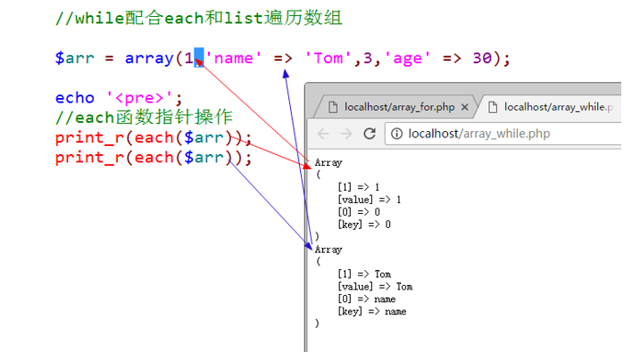

如果each取不到结果（数组指针移动到最后），返回false。

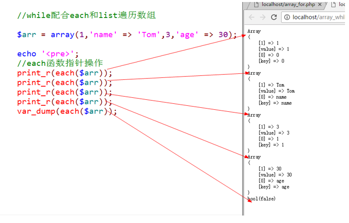

3.list函数使用：**list是一种结构，不是一种函数（没有返回值）**，是list提供一堆变量去从一个数组中取得元素值，然后依次存放到对应的变量当中（批量为变量赋值：值来源于数组）：**list必须从索引数组中去获取数据，而且必须从0开始。**

正确操作：

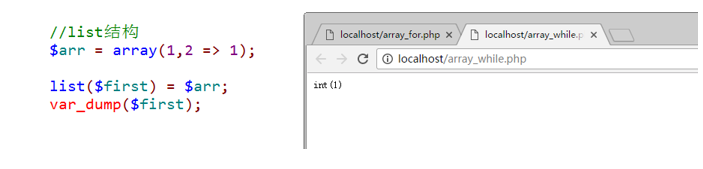

错误操作：变量多于数组元素，没有指定从0到指定变量的下标的数组元素。因为$second变量对应的下标是1，但是数组中没有下标是1。

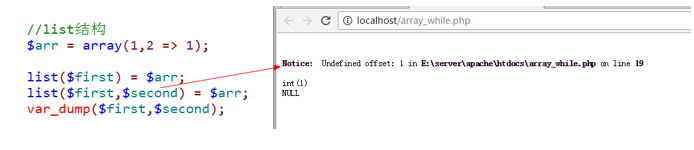

**list与each配合特别好：each一定有两个元素就是0和1下标元素**

~~~php
list(变量1,变量2) = each(数组);            
//是一种赋值运算，但是可以得到false结果（each取不到正确的结果），整个表达式为false
~~~

# 数组的相关函数

1）**排序函数**：对数组元素进行排序，都是按照ASCII码进行比较，可以进行英文比较

~~~javascript
sort()：顺序排序（下标重排）
rsort()：逆序排序
~~~

~~~
asort()：顺序排序（下标保留）
arsort()：逆序排序(下标不保留)
~~~

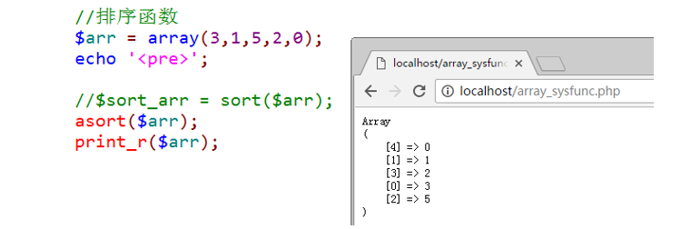

~~~
ksort()：顺序排序：按照键名（下标）
krsort()：逆序排序
~~~

~~~javascript
shuffle()：随机打乱数组元素，数组下标会重排
~~~

2）**指针函数**

~~~
reset()：重置指针，将数组指针回到首位
end()：重置指针，将数组指针指到最后一个元素
~~~

~~~
next()：指针下移，取得下一个元素的值
prev()：指针上移，取得上一个元素的值
~~~

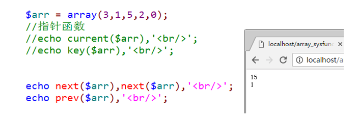

~~~
current()：获取当前指针对应的元素值
key()：获取当前指针对应的下标值
~~~

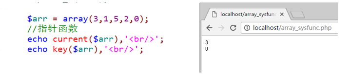

注意事项：next和prev会移动指针，有可能导致指针移动到最前或者最后（离开数组），导致数组不能使用，通过next和prev不能回到真确的指针位置。只能通过end或者reset进行指针重置。

3）**其他函数**

~~~
count()：统计数组中元素的数量
array_push()：往数组中加入一个元素（数组后面）
array_pop()：从数组中取出一个元素（数组后面）
array_unshift()：从数组中加入一个元素（数组前面）
array_shift()：从数组中取出一个元素（数组前面）
~~~

PHP模拟数据结构：

栈（杯子）：压栈，先进去后出来（FILO）

队列（隧道）：排队，先进去的先出去（FIFO）

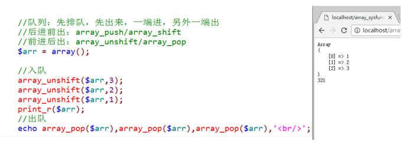

~~~
array_reverse()：数组元素反过来
~~~

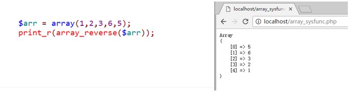

~~~
in_array()：判断一个元素在数组中是否存在
~~~

~~~
array_keys()：获取一个数组的所有下标，返回一个索引数组
array_values()：获取一个数组的所有值，返回一个索引数组
~~~

# 编程思想

> 这后面的就看不懂了。

编程思想：如何利用数学模式，来解决对应的需求问题；然后利用代码实现对应的数据模型（逻辑）。

 算法：使用代码实现对应的数学模型，从而解决对应的业务问题。

## 递推算法

递推算法是一种简单的算法，即通过已知条件，利用特定关系得出中间推论，直至得到结果的算法。递推算法分为**顺推和逆推**两种。

* 顺推：通过最简单的条件（已知），然后逐步推演结果(主要用这个)

* 逆推：通过结果找到规律，然后推到已知条件

~~~
斐波那契数列：1 1 2 3 5 8 13 …，通常需求：请求得指定位置N所对应的值是多少
 找规律：

1.第一个数是1
2.第二个数也是1
3.从第三位开始：属于前两个数的和

代码解决思路：
1.如果数字位置为1和2，结果都是1
2.从第三个开始，想办法得到前两个的结果，就可以得到

终极解决办法：想办法把要求的位置之前的所有的值都列出来，那么要求的数就可以通过前两个之和计算出来：使用数组存储所有结果即可。
~~~

递推算法求斐波那契数列：

# 编程思想

## 递归算法

递归算法是把问题转化为规模缩小了的同类问题的子问题。然后递归调用函数（或过程）来表示问题的解。

1.简化问题：找到最优子问题（不能再小）

2.函数自己调用自己

~~~javascript
斐波那契数列：1 1 2 3 5 8 13 …

需求：求指定位置的数列的值
规律：第一个和第二个为1，从第三个开始为前两个之后

F(N) = F(N-1) + F(N-2);
F(N-1) = F(N-2) + F(N - 3);
...
F(2) = F(1) = 1;
~~~

递归思想中：有两个非常重要的点：

* 递归点：发现当前问题可以有解决当期问题的函数，去解决规模比当前小一点的问题来解决
   F(N) = F(N - 1) + F(N - 2)。

* 递归出口：当问题解决的时候，已经到达（必须有）最优子问题，不能再次调用函数。

 如果一个函数递归调用自己而没有递归出口：就是死循环。

递归的本质是**函数调用函数**：一个函数需要开辟一块内存空间，递归会出现同时调用N多个函数（自己）：递归的本质是利用空间换时间。

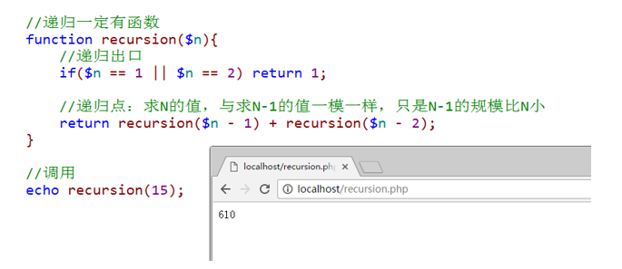

# 数组排序算法

## 冒泡排序

冒泡排序（Bubble Sort），是一种计算机科学领域的较简单的排序算法。

它重复地走访过要排序的数列，**一次比较两个元素**，如果他们的顺序错误就把他们交换过来。走访数列的工作是重复地进行直到没有再需要交换，也就是说该数列已经排序完成。

冒泡排序的算法思路：

1） 比较相邻的元素。如果第一个比第二个大，就交换他们两个。

2） 对每一对相邻元素作同样的工作，从开始第一对到结尾的最后一对。在这一点，最后的元素应该会是最大的数。

3） 针对所有的元素重复以上的步骤，除了最后一个。

4） 持续每次对越来越少的元素重复上面的步骤，直到没有任何一对数字需要比较。

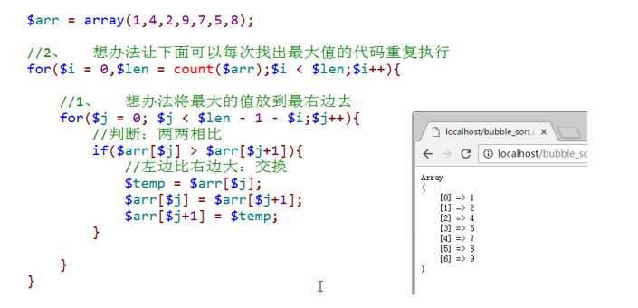

## 选择排序

选择排序（Selection
sort）是一种简单直观的排序算法。它的工作原理是每一次从待排序的数据元素中选出最小（或最大）的一个元素，存放在序列的起始位置，直到全部待排序的数据元素排完。
选择排序是不稳定的排序方法（比如序列[5， 5， 3]第一次就将第一个[5]与[3]交换，导致第一个5挪动到第二个5后面）。

选择排序的算法思路：

1） 假设第一个元素为最小元素，记下下标。

2） 寻找右侧剩余的元素，如果有更小的，重新记下最新的下标。

3） 如果有新的最小的，交换两个元素。

4） 往右重复以上步骤，直到元素本身是最后一个。

## 插入排序

插入排序（Insert sort）,插入排序的基本操作就是将一个数据插入到已经排好序的有序数据中，从而得到一个新的、个数加一的有序数据，算法适用于少量数据的排序，是稳定的排序方法。插入算法把要排序的数组分成两部分：第一部分包含了这个数组的所有元素，但将最后一个元素除外（让数组多一个空间才有插入的位置），而第二部分就只包含这一个元素（即待插入元素）。在第一部分排序完成后，再将这个最后元素插入到已排好序的第一部分中。

插入排序的基本思想是：每步将一个待排序的纪录，按其关键码值的大小插入前面已经排序的文件中适当位置上，直到全部插入完为止。

插入排序的算法思路：

专业版：

1） 设置监视哨r[0]，将待插入纪录的值赋值给r[0]；

2） 设置开始查找的位置j；

2） 在数组中进行搜索，搜索中将第j个纪录后移，直至r[0].key≥r[j].key为止；

4） 将r[0]插入r[j+1]的位置上。

通俗版：

1） 认定第一个元素已经排好序；

2） 取出第二个元素，作为待插入数据；

3） 与已经排好序的数组的最右侧元素开始进行比较

4） 如果后面的小于前面的：说明前面已经排好序的那个数组元素不在对的位置（向后移一个），然后让新的元素填充进去（继续向前比：高级）

5） 重复前面的步骤：直到当前元素插入到对的位置；

6） 重复以上步骤，直到所有的数组元素都插入到对的位置。

优化代码：找到对的位置交换一次即可。

## 快速排序

快速排序（Quicksort）是对冒泡排序的一种改进。通过一趟排序将要排序的数据分割成独立的两部分，其中一部分的所有数据都比另外一部分的所有数据都要小，然后再按此方法对这两部分数据分别进行快速排序，整个排序过程可以递归进行，以此达到整个数据变成有序序列。（递归）

设要排序的数组是A[0]……A[N-1]，首先任意选取一个数据（通常选用数组的第一个数）作为关键数据，然后将所有比它小的数都放到它前面，所有比它大的数都放到它后面，这个过程称为一趟快速排序。值得注意的是，快速排序不是一种稳定的排序算法，也就是说，多个相同的值的相对位置也许会在算法结束时产生变动。

快速排序的算法是：

1） 从数组中选出一个元素（通常第一个），作为参照对象。

2） 定义两个数组，将目标数组中剩余的元素与参照元素挨个比较：小的放到一个数组，大的放到另外一个数组。

3） 第二步执行完之后，前后的数组顺序不确定，但是确定了自己的位置。

4） 将得到的小数组按照第1到第3部重复操作（子问题）。

5） 回溯最小数组（一个元素）。

## 归并排序

归并排序（MERGE-SORT）是建立在归并操作上的一种有效的排序算法,该算法是采用分治法（Divide and Conquer）的一个非常典型的应用。将已有序的子序列合并，得到完全有序的序列；即先使每个子序列有序，再使子序列段间有序。若将两个有序表合并成一个有序表，称为二路归并。

二路归并实现：

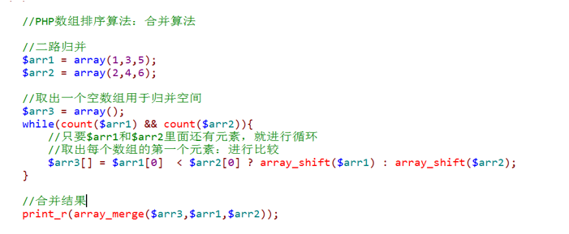

归并排序的算法是：

1） 将数组拆分成两个数组。

2） 重复步骤1将数组拆分成最小单元。

3） 申请空间，使其大小为两个已经排序序列之和，该空间用来存放合并后的序列.

4） 设定两个指针，最初位置分别为两个已经排序序列的起始位置。

5） 比较两个指针所指向的元素，选择相对小的元素放入到合并空间，并移动指针到下一位置。

6） 重复步骤3直到某一指针超出序列尾。

7） 将另一序列剩下的所有元素直接复制到合并序列尾。

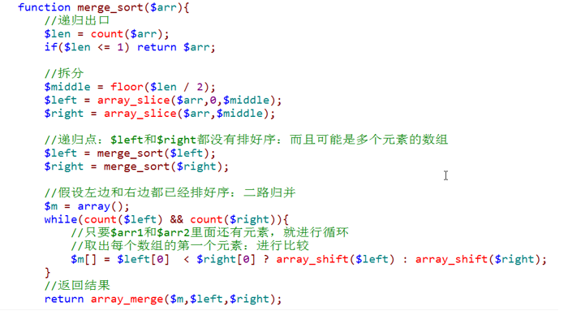

# 查找算法

## 查找算法含义

查找是在大量的信息中寻找一个特定的信息元素，在计算机应用中，查找是常用的基本运算。查找算法是指实现查找过程对应的代码结。就是中大型数组中去快速定位想要的元素。

## 顺序查找算法

顺序查找也称为线形查找，从数据结构线形表的一端开始，顺序扫描，依次将扫描到的结点关键字与给定值k相比较，若相等则表示查找成功；若扫描结束仍没有找到关键字等于k的结点，表示查找失败。

## 二分查找算法

二分查找要求线形表中的结点按关键字值升序或降序排列，用给定值k先与中间结点的关键字比较，中间结点把线形表分成两个子表，若相等则查找成功；若不相等，再根据k与该中间结点关键字的比较结果确定下一步查找哪个子表，这样递归进行，直到查找到或查找结束发现表中没有这样的结点。

折半算法思路：

1、  计算数组长度；

2、  确定左右两边的指针位置；

3、  找到中间位置；

4、  匹配

5、  然后根据大小重定边界

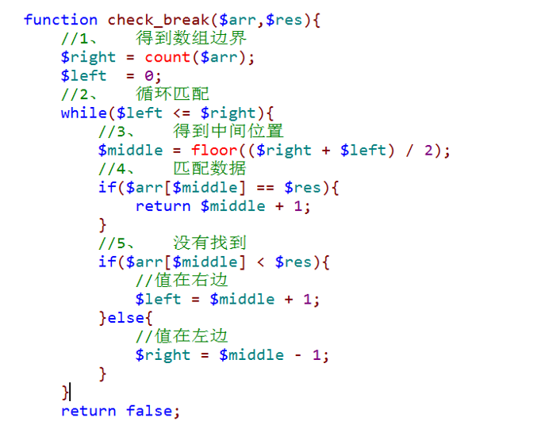

