(注1：[视频链接](https://www.bilibili.com/video/BV15741177Eh?from=search&seid=16250798732798430553) ，老师叫王红元，这个实战项目是紧跟着Vue基础知识之后的，因为基础知识部分写的博文字数太多了，所以我单独又写了一篇博文记录这个项目的创建过程。)

(注2：因为这个视频是2018年的，所以Vue的版本用的是V2.x，webpack，VueCli也都不是最新版本，不过这个没有什么大的问题，先学老版本，后面的新版本新增的知识点应该不会太多，过渡过来应该不会太复杂。)

(注3：这个项目的接口数据好像是需要加老师微信买一下，好像是9块钱吧，这个也是老师自己搭建服务器做的接口，也是花了成本的，我觉得这个钱花的没问题的。——最终我花了10块钱，给老师凑了个整。老师给了我接口，也让我加了个群。)

(注4：现在是2020年11月30日，因为想着版本问题，误删了Hexo有关的东西，然后我这4,5天就一直在重新弄自己的博客了，还把自己的仓库删除重新建了，里面的Commits全部没有了，心态炸裂。不管怎么样，Hexo又重新装了一遍，现在开始学习Vue项目吧。)

(注5：现在是2020年12月07日，将近一周没有看项目视频了，从此以后，以这个为主要重点！！！我80%的精力都要放到这上面来了！！！)

(注6：现在是2020年12月08日，我这篇博文只是粗略的描述了一些步骤，里面还有无数的细节我没有办法事无巨细的记录其中，所以，要想真正的了解这个项目，只能完整的看一遍视频。这篇博文只是起到一部分唤起记忆的作用而已。)

(注7：现在是2021年1月1日，这个项目做着做着自己慢慢的有了一些感觉了，就是从后端传过来的数据池中挑选出想要的数据，然后用直观的形式(图片、文字等)将这些数据进行展示，再加一些动态交互的效果，这个就是前端要做的工作啊。)

(注8：现在是2021年1月7日，视频全部看完，但是项目还没完，还有`分类`和`我的`老师没有讲，我也没有写，打算过一段时间后自己重温一遍这个项目，自己单独写一遍，然后把剩下的内容也写了。这个项目从2020年11月30日开始看，到现在为止，已经花了有37,8天的时间了，统计了一下学习时长，大概是76个小时。掌握程度自己评估为60%，给自己打个及格分吧，虽然里面有很多知识不熟悉甚至完全不懂，但是还是有收获的。在此感谢codewhy王红元老师，讲的真的挺好的，感谢。)

(注9：我和这个视频的第一次亲密接触是2020年1月1日元旦，当时自己JS水平都不行，当时心里很慌，觉得自己学习进度太慢，于是硬着头皮看了Vue，这个视频看了70%多，一直看到2月份左右，基础知识点都快看完了，但是掌握程度估计只有10%，后来实在看不懂，就把Vue暂时放下了，回去继续巩固DOM、JS之类的了，一直到2020年9月份才开始重新学习Vue，基础知识学了3个多月，项目学了1个多月，一直到今天，2021年的1月初，才算比较仔细和完整的学完了Vue。不过自己的水平还不太够，也只写了这1个项目，我今后还需要再写几个项目，再把自己比较薄弱的知识点再回过头来回顾一下。总之，学习，还是要静下心来，脚踏实地的学习吧。某些知识一时不了解也没关系，不要急躁，温故而知新，随着时间的推移，慢慢的，眼前一定会变得逐渐清晰的。随着自己代码量的增加，一定会在某个时刻，自己的前端水平一定会有突飞猛进的提升的，做项目就跟玩一样，游刃有余，我期待着那一天的到来。以此自勉。)

# 项目总体思路

现在是2020年12月8日，到现在才看到了7小节课程，不过自己也大概总结出来了一些值得记录的东西。

* 以后每看一小节内容，就起一个大标题进行记录这个小节视频大体讲了什么
* 每个小节写个知识点总结，列出这小节老师使用了哪些知识点，方便自己以后去查漏补缺
* 每个小节都来个git三件套:`git add .`、`git commit-m'每小节题目名称'`、`git push`把它推送到自己的GithHub上，进行版本控制。

# 项目创建和Github托管

在创建新项目之前，我觉得有必要清理一下自己当前安装的Vue，Vue CLI，Webpack版本，自己可以先找到老师的项目，看看他当时都用的是什么版本，让自己的版本尽量和他的版本匹配上，否则到时候可能会遇到一些问题。

从`package.json`里面查看的一些项目版本如下：

[package.json和package-lock.json区别](https://www.zhihu.com/question/62331583)

~~~json
{
  "name": "supermall",
  "version": "0.1.0",
  "private": true,
  "scripts": {
    "serve": "vue-cli-service serve",
    "build": "vue-cli-service build"
  },
  "dependencies": {
    "axios": "^0.18.0",
    "vue": "^2.5.21",
    "vue-router": "^3.0.2"
  },
  "devDependencies": {
    "@vue/cli-plugin-babel": "^3.2.0",
    "@vue/cli-service": "^3.2.0",
    "vue-template-compiler": "^2.5.21"
  }
}
~~~

* 我先把以前安装的Vue CLI版本全部卸载掉，然后全局安装特定的Vue CLI 3.x版本

  [vue-cli的卸载与安装](https://blog.csdn.net/qq_39102819/article/details/99620256)

  * 全局卸载Vue CLI命令(1.x和2.x版)：`npm uninstall vue-cli -g `
  * 全局卸载Vue CLI命令(3.x版)：`npm uninstall -g @vue/cli `
  * 全局安装Vue CLI命令(3.x版)：`npm install -g @vue/cli`
  * 唉，安装了Vue CLI 3.x版本后报错：`error: ~/.vuerc may be outdated. Please delete it and re-run vue-cli in manual mode`,那我还是安装新版本吧。
  * 最终我的项目的Vue CLI版本号为`V4.5.0`

* Vue版本也要删除以前版本，改成`V2.5.21`版本的，不要用Vue3.x版本。

  * [如何查看vue版本号-看评论](https://blog.csdn.net/hejiaying68/article/details/87636239)
  * 全局卸载Vue命令：`npm uninstall -g vue`

* 输入`vue create supermall`创建新项目。

  * 我之前删除了一些东西，然后我现在必须重新装Vue和Vue CLI

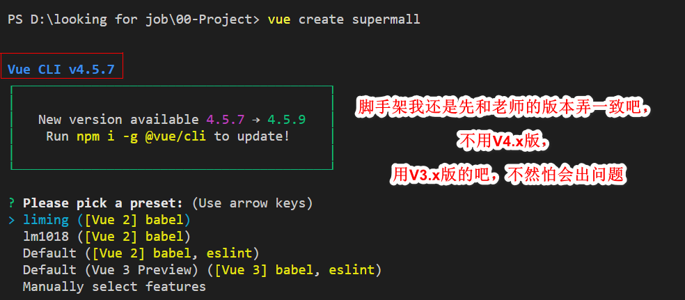

> 最终我的项目的Vue CLI版本号为`V4.5.0`，没有办法了，只能先这样了。

* 项目建立好后，我们再登陆GitHub上创建一个仓库，其中不要勾选添加`README`文件，因为我们项目本身就有一个`README`了，再添加一个`README`文件，之后可能会冲突。

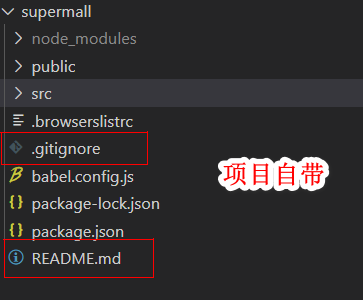

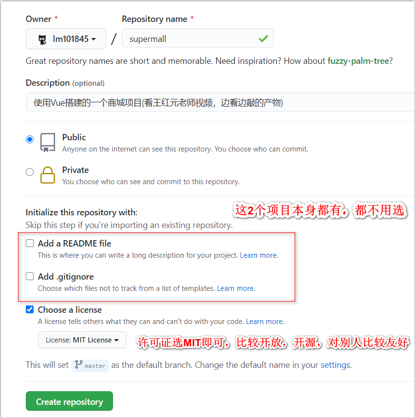

* 接下来我们需要把我们本地新建的`supermall`这项目和新建的GitHub仓库联系起来。
  * 我们先把项目名字改成`supermall01`,不然和仓库名字一样会冲突

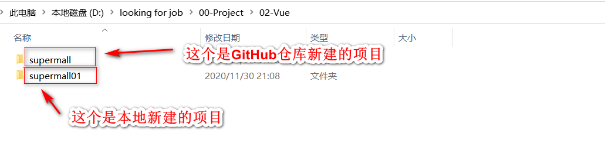

* 然后我们把`supermall01`文件夹里面的除了`.git`(仓库里有)和`node_modules`(被仓库忽略)的所有文件复制到`supermall里面`。

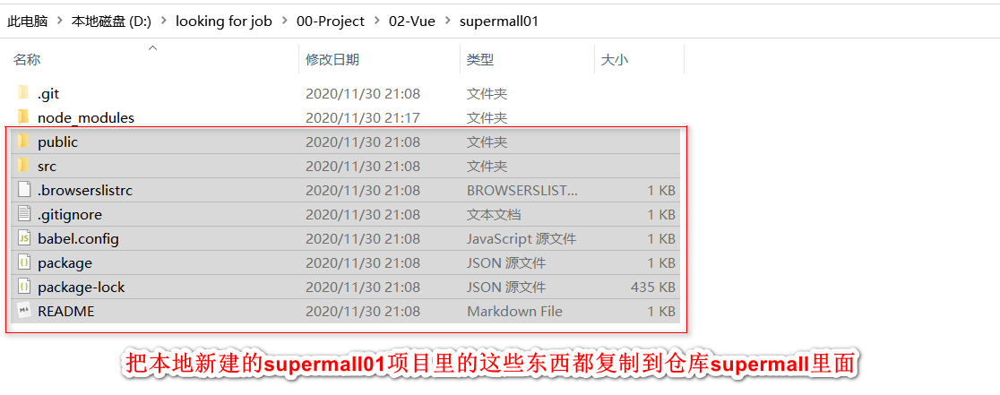

> 因为`node_modules`没有复制进来，所以后面我们还要cd到`supermall`文件夹下执行`npm install`再把`node_modules`给再创建出来。

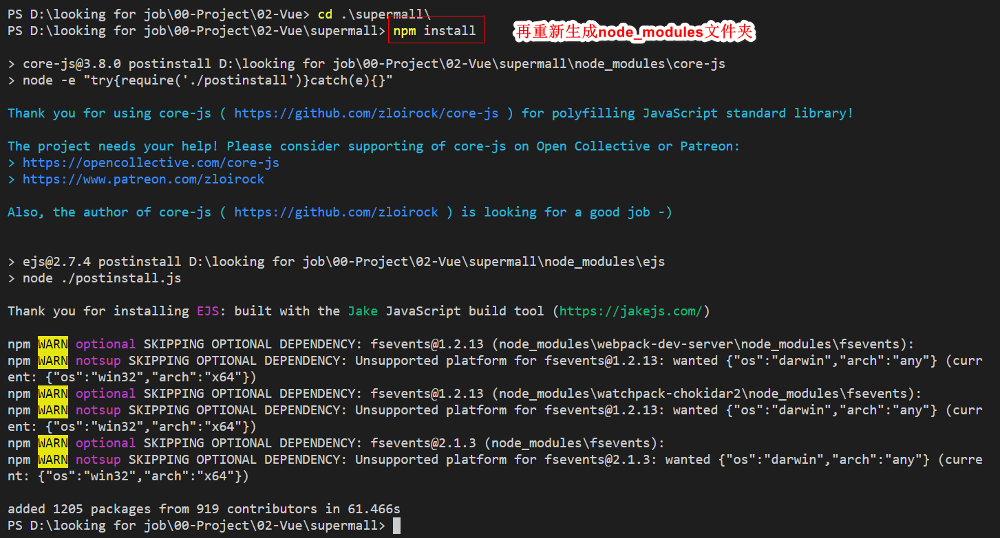

* 然后我们到`supermall`文件夹里，发现新复制进来的文件是绿色，我们就`git add .`来把这些文件放入暂存区。

* 再用`git commit -m`命令生成一个版本

* 但是这次提交只是提交到本地，我们还要提交到服务器，所有用`git pull`命令"上传"本地文件到GitHub上去。

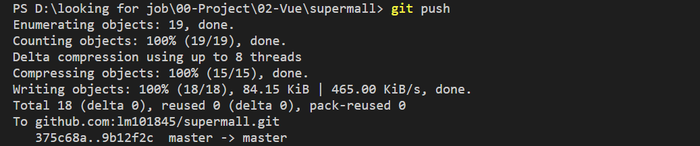

> 当初`git clone`GitHub仓库到本地的时候，最好使用`SSH`的方式，而不是`HTTPS`的方式，后者当你`git push`的时候还要你输入用户名和密码，非常麻烦。

* 此时刷新我们的GitHub页面，可以看到文件已经顺利的`push(上传)`到GitHub上了。

* 我以后只要在本地修改完代码后`git add .`、`git commit`、`git push`三板斧就可以把代码上传到"网盘"(GitHub)上去了。
* 因为`supermall`里面当初是没有把`node_modules`也复制进去的(就算复制进去了也会被仓库所忽略)，所以我们还要通过`npm install`来重新生成`node_modules`文件夹。
* 前面我们是采用"复制"的方式来做的，其实我们还可以采用`git remote add origin 地址`+`git push -u origin master`指令直接上传到远程仓库

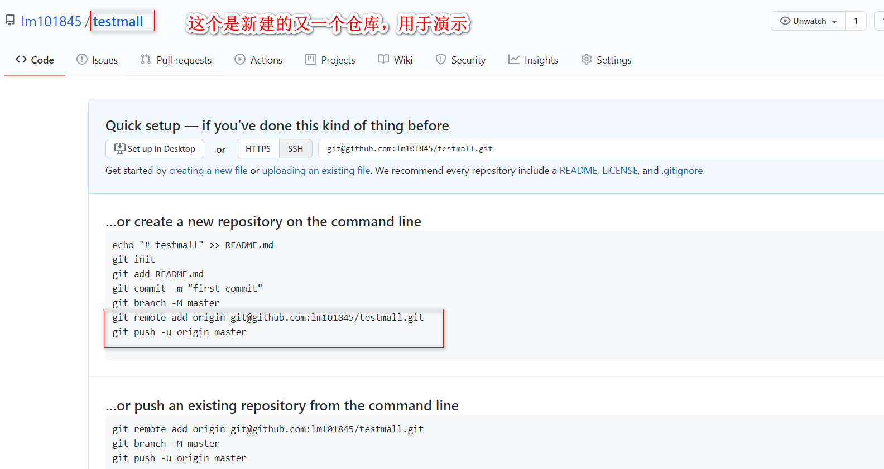

* 注意：我们的`supermall(是当初克隆下来的仓库，后来把supermall01里面的东西复制到了里面)`已经弄好了，我们接下来要弄的是`supermall01(是我们当初新建的本地项目)`，不要搞混了啊！

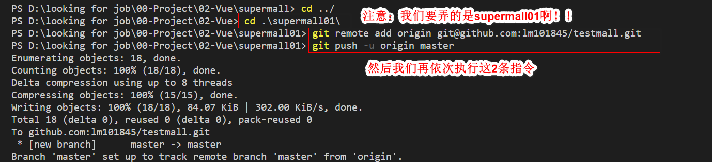

> 这种方法显得更加专业，用前面**复制**的方法就显得有点呆了。

* 后来老师把`supermall01`这个文件夹给删除了，这只是起到了演示作用。我想了想还是先隐藏起来，以后可能自己还要再自己做一遍这个项目，到时候就用`supermall01`这个文件夹来做。

# 划分目录结构

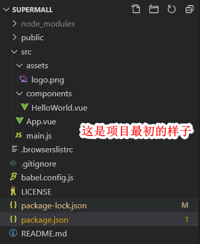

* 一般面对一个新项目时，要做的第一件事情就是划分目录结构了。不然等你以后把这些文件放的乱七八糟的时候再去划分，这个时候就有点晚了。
* 先删除一些垃圾的东西，比如`Hello World.vue`以及`App.vue`里面有关这个组件的引用，`assets`文件夹里面的`logo.png`也删掉。

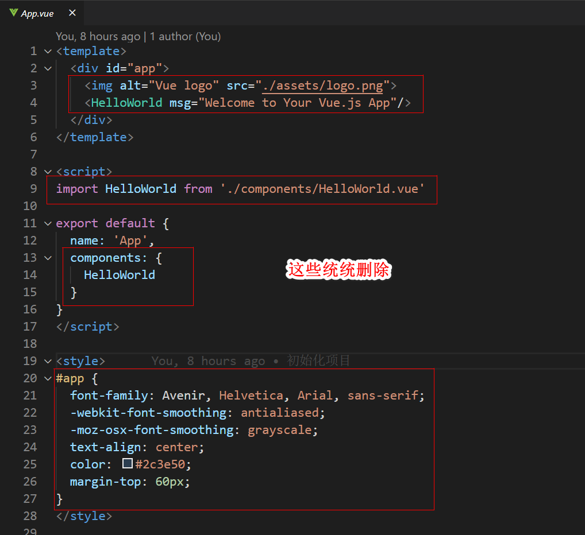

* 源码一般在`src`文件夹里面，我们划分目录结构也一般在这个文件夹里面划分，其他的地方一般也是不需要去动的。`src`文件夹里面已经默认有2个目录了，一个是`assets(资源)`文件夹，一个是`components(组件)`文件夹。

* `assets`文件夹主要放2个东西：一个是图片文件，另一个是`css`文件。

* `components`文件夹主要放组件相关的文件，但是如果把所有的组件都放到这一个文件夹里面，以后会不方便维护的，所以`components`里面我们一般只会放一些**公共的组件**。比如我们一个组件既在`home.vue`里面用，也在`categories.vue`里面用，我们就会把它抽离出来，放到`componets`组件里面。

* 而公共的组件我们一般也会分成2类，一类叫做`common`，一类叫`content`。

  * `common`文件夹里面会放一些不仅仅在当前项目要用的组件，而且可能我会到时候直接把这个文件夹放到下一个项目里面也使用。即`common`里面的组件是完全公共的，不仅这个项目可以用，其他的项目也可以拿过来就用。
  * `content`文件夹里面就会放一些和业务相关的公共组件。你也确实是公共的组件，但是你只针对于我当前的项目来说是公共的，如果我把这个东西放到下一个项目里面，这里面所有的东西应该是不能用的。

* 其他的组件我们会在`src`文件夹下面再新建一个`views`文件夹，里面存放一些大的视图(首页视图、分类视图、购物车视图等等。)

* `src`文件夹里面还会有`router`文件夹，用于存放路由相关的东西。

* `src`文件夹里面还会有`store`文件夹，用于存放Vuex,公共状态管理有关的文件夹。

* `src`文件夹里面还会有`network`文件夹，用于存放和网络相关的东西。

* `src`文件夹里面还会有`common`文件夹(注意和`components`下面的`common`文件夹进行区分)，里面放了更加公共的东西

  * 比如公共的`js`文件(当我们有一些公共的常量需要抽取的时候，到时候我们就会放到`common`文件夹下的`const.js`文件里面)
  * 当我们开发的时候，我们会给它封装一些工具类，所以会生成一个`utils.js`文件
  * 以后我们还会遇到混入，所以会生成一个`mixin.js`文件。

  * 不过现在我们还都用不到，先不急着新建这3个文件了。

# CSS文件的引入

> 整个项目里面尽可能是使用原生CSS，而没有过多的使用`SASS`和`LESS`。

* 我们需要在GitHub上面引入一个`normalize.css`文件，来初始化我们的这个项目，对我们的浏览器上的标签做一个统一和重置(reset)，很多项目都使用过这个文件。

  [necolas/normalize.css](https://github.com/necolas/normalize.css)

  [来，让我们谈一谈 Normalize.css](https://jerryzou.com/posts/aboutNormalizeCss/)

* 除了第三方的`css`文件夹，我们还需要再建立一个属于自己的`base.css`，首先在`base.css`里面通过`@import`引用`normalize.css`文件，其次再放一些别的东西(老师复制的一堆东西。)

  [了解CSS中的@import](https://segmentfault.com/a/1190000000369549)

  [伪类和伪元素](https://developer.mozilla.org/zh-CN/docs/Learn/CSS/Building_blocks/Selectors/Pseudo-classes_and_pseudo-elements)

* 然后在`App.vue`里面引入`base.css`

* 总结：主要是引入了`normalize.css`和`base.css`这2个文件

* `base.css`文件如下：

  ~~~css
  /* 第一件事：引入normalize.css */
  @import "./normalize.css";
  
  /*:root -> 获取根元素html*/
  /* 元素前面的冒号表示伪类 */
  :root {
    /* 这里面定义的其实是变量，这个是CSS里面定义变量的方式 */
    /* 声明变量的时候，变量名前面要加两根连词线（--）*/
    /* 在这里提前定义了一些变量，后面要用的时候，使用var()即可使用 */
    --color-text: #666;
    /* 文字颜色 */
    --color-high-text: #ff5777;
    /* 文字高亮时的颜色 */
    --color-tint: #ff8198;
    /* 设置类似导航时候的背景颜色的 */
    --color-background: #fff;
    /* 这个是设置的白色背景 */
    --font-size: 14px;
    /* 整体上应用程序大小为14px */
    --line-height: 1.5;
    /* 整体上行高为1.5倍 */
  }
  
  *,
  *::before,
  *::after {
    margin: 0;
    padding: 0;
    box-sizing: border-box;
  }
  
  body {
    font-family: "Helvetica Neue", Helvetica, "PingFang SC", "Hiragino Sans GB",
      "Microsoft YaHei", "微软雅黑", Arial, sans-serif;
    user-select: none; /* 禁止用户鼠标在页面上选中文字/图片等 */
    -webkit-tap-highlight-color: transparent; /* webkit是苹果浏览器引擎，tap点击，highlight背景高亮，color颜色，颜色用数值调节 */
    background: var(--color-background);
    color: var(--color-text);
    /* rem vw/vh */
    width: 100vw;
  }
  
  a {
    color: var(--color-text);
    text-decoration: none;
  }
  
  .clear-fix::after {
    clear: both;
    content: "";
    display: block;
    width: 0;
    height: 0;
    visibility: hidden;
  }
  
  .clear-fix {
    zoom: 1;
  }
  
  .left {
    float: left;
  }
  
  .right {
    float: right;
  }
  ~~~

* `normalize.css`网上有，就不写了。

# vue.config和editorconfig配置

* 在脚手架3里面配置一些相关文件夹的别名。不像脚手架2，脚手架3里面它将我们配置的东西隐藏起来了。我们不要在`node_modules`文件夹里面直接改，我们要创建`vue.config.js`文件(名字固定的，只能叫这个名字)，把我们要修改的东西全写到这里面，到时候`node_modules`里面的公共配置和我们新建的`vue.config.js`配置文件会进行合并的。

* `vue.config.js`文件如下：

  ~~~javascript
  module.exports = {
      // 在这里我们配置别名
      configureWebpack: {
          resolve: {
              // resolve用于配置和路径相关的
              // extensions:[]
              // 这个可以省略.vue,.js等配置文件，我们这里不用配置，公共配置文件就已经配置好了
              alias: {
                  // alias配置别名的
                  // '@':'src'
                  // 它的内部已经配置了@等于src这个别名了
                  'assets': '@/assets',
                  'common': '@/common',
                  'components': '@/components',
                  'network': '@/network',
                  // 'router': '@/router',
                  // router不用起别名的，因为只会在main.js里面引用一次的
                  // 以后也可以通过this.$router拿到这个对象的，同理this.$store也不用起别名
                  'views':'@/views'
              }
          }
      }
  }
  ~~~

* 在`supermall`文件夹下新建一个`.editorconfig`文件，主要作用是给项目进行一些统一，内容如下：

  ~~~shell
  # 表明这是最顶层的配置文件，这样才会停止继续向上查找 .editorconfig 文件；
  # 查找的 .editorconfig 文件是从顶层开始读取的，类似变量作用域的效果，内部
  # 的 .editorconfig 文件属性优先级更高
  root = true
  
  # 指定作用文件格式
  [*]
  
  # 缩进的类型 [space | tab]
  indent_style = space
  
  # 缩进的大小 
  # tab_width: 设置整数用于指定替代tab的列数。默认值就是indent_size的值，一般无需指定。
  indent_size = 2
  
  # 定义换行符 [lf | cr | crlf]
  end_of_line = lf
  
  # 编码格式。支持latin1、utf-8、utf-8-bom、utf-16be和utf-16le，不建议使用uft-8-bom。
  charset = utf-8
  
  # 是否除去换行行首的任意空白字符
  trim_trailing_whitespace = false
  
  # 文件是否以一个空白行结尾 [true | false]
  insert_final_newline = true
  
  ~~~

# tabbar引入和项目模块划分

* 因为下面的`tabbar`之前基础知识视频老师讲过，就不再写一遍代码了，直接拿过来使用了。
  * 把以前写的`tabbar`文件夹复制到`components`中的`common`文件夹(完全独立)里面。
  * 把以前写的`mainTabbar`文件夹复制到`components`中的`content`文件夹(跟业务有关系)里面。
  * 把以前的`img`文件夹也拿出来放到项目中。
  * `Vue Router`不熟啊，到时候还要再回过头来复习一下啊。
* 但是我是极其不熟啊，所以还要自己再看一遍，看一下当初是怎么写代码的。

* 因为MainTabBar还用于管理了路由相关的映射关系，所以接下来我们可以`npm install vue-router --save `把路由安装一下了。

* 现在的项目目录成了这个样子的了，变得复杂了很多了： 

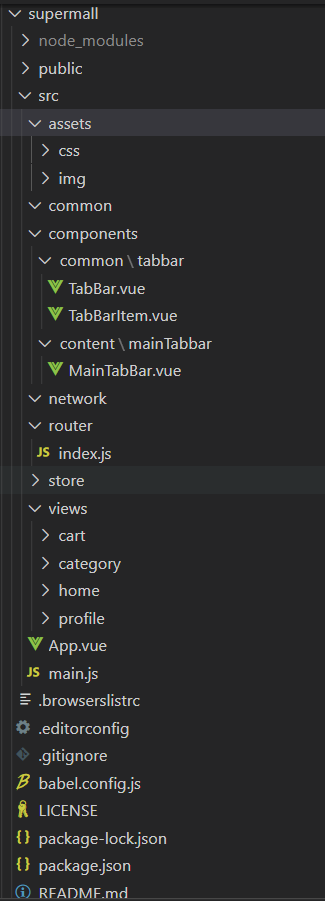

# 小图标的修改以及路径问题

* 把`public`文件夹下的`favicon.ico`图标换成你想要的图标即可。
* 使用`npm run build`进行代码打包时，`dist`文件夹下面的代码都是被丑化过的(被压缩了，注释什么的都没有了，我现在处于学习阶段，所以想把压缩/丑化插件给它禁用了。)

# 首页导航栏的封装和使用

* 首页、分类、购物车、我的四个选项卡上面都有导航，而且上面的导航长得都不一样。所以我们需要封装一个导航组件，并且预留插槽：左边一个插槽，中间一个大插槽，右边一个插槽。之后你就可以根据我这个需求来决定插槽里面到底放什么东西了。
* 注意：我们在封装的时候一定要考虑扩展性啊。
* 接下来考虑这个组件封装到什么位置：因为这个组件在多个界面都会用到，所以放到`components`里面的`common`文件夹里面比较好(很有可能别的项目也会用到这个组件的，因为导航栏长得都差不多)。文件夹名字就叫做`navbar`。
* 文件夹名字一般小写，组件名字一般大写。(这是一种风格，也许别的公司不是这样的，但是老师说这样比较好。)

* 插槽我们就用flex布局了，然后左边给它一个固定的宽度(左边一般就是放个图标)
* 知识点总结
  * flex布局
  * slot插槽
  * line-height和height的关系
  * `box-shadow`盒子阴影的使用
  * CSS中通过`var(--)`使用变量(先不用SASS或LESS，这里用的是原生的CSS)

# 请求首页的多个数据

* 接下来我们应该做轮播图了，但是做轮播图之前我们需要先做一件事情。

  

* 但是我们首先要先将轮播图的数据请求过来，先拿到数据再说(这个时候就要加老师微信买那个接口数据了吧，我买了，花了10元，多给了老师1元，算是支持老师了，哈哈。)

* 但有时候这个项目的服务器还没有开发完，所以这里先拿不到数据也是可能的。这个时候我们也只能按照一些模拟数据把页面给做出来。

* 一般的开发流程是：从服务器拿到数据(第一步)，根据拿到的数据再创建对应的标签和元素，之后再来对数据做一个展示。

* 所以接下来我们要做的不是轮播图，而是网络模块的封装。

* 我们要先安装一下axios：`npm install axios --save`

* `network`文件夹里面的`request.js`：

  ~~~javascript
  import axios from 'axios'
  
  export function request(config) { 
      // 1.创建axios的实例
      const instance = axios.create({
          baseURL: 'http://152.136.185.210:7878/api/m5',
          timeout:5000
      })
  
      // 2.axios的拦截器
      // 2.1 请求拦截的作用
      instance.interceptors.request.use(config => { 
          return config
      }, err => { 
          // console.log(err);
      })
  
      // 2.2响应拦截
      instance.interceptors.response.use(res => { 
          return res.data
      }, err => { 
          console.log(err);
      })
  
      // 3.发送真正的网络请求
      return instance(config)
      // 这个函数返回的是promise
  }
  ~~~

* `network`文件夹里面的`home.js`文件

  ~~~javascript
  // 我对首页数据的所有请求都放在这里面
  // 以后Home.vue面向home.js开发，十分的合理
  import { request } from './request'
  
  export function getHomeMutidata() { 
      // 函数名意思是获取首页的多个数据
      return request({
          url:'/home/multidata'
      })
  }
  
  //补充知识:函数的调用 ——>压入函数栈当中(保存函数调用过程中所有的变量)
  // 函数调用结束，会弹出函数栈(释放函数中所有的变量)
  // function test() { 
  //     const names = ['why', 'aaa']
  //     // 函数里面的东西都是局部变量，一旦函数执行完，这里面的东西全部都会被内存回收掉
  // }
  
  // test()
  
  // test()
  // 再调用一次的话函数会重新创建，调用完后再次消失
  ~~~

* 知识点总结：

  * axios网络模块的封装
  * axios请求拦截和响应拦截

# 轮播图的展示

* 数据已经拿到了，我们现在要做的就是封装对应的组件对它进行展示。
* 首先我们要展示的第一个东西，就是我们的轮播图了。老师把轮播图封装成了一个组件，独立的模块。可以随时随地的使用，别的项目里也可以使用。
* 轮播图因为以前学过，所以老师就不写了。(但是我是很久以前学的，很多都忘了，还要复习一下啊。)
* 遇到的一个问题是，vue使用v-for时vscode报错`Elements in iteration expect to have 'v-bind:key' directives`，原因是Vue 2.2.0+的版本里，当在组件中使用v-for时，key是必须的，解决方法就是：在`v-for`后添加`:key='item'`。
* 但是`npm run serve`后在控制台还是会报错`Avoid using non-primitive value as key, use string/number value instead.`,我想了一下还是把eslint关掉吧，太尼玛费事了。
* 我去了，关掉这个烦人的`eslint`我网上找了一圈居然没找到，于是我就自己跑到`package-lock.json`中搜到`eslint`把里面的dev由true改成false，之后好像不报错了。
* 我去，又报错了，说明这个方法不行。
* 我这个轮播图它只是显示一张图片啊，用不了啊，出了一些小问题了。
* 也不知道怎么回事，后来它自己就好了。真的是很神奇啊。
* 又显示不出来了，淦。
* 又好了，真的很神奇。
* 学习阶段老师不建议我们去使用UI库，这些UI库也是以类似`Swiper轮播图组件`这样的方式封装起来的，用肯定很简单，但是我们要自己设计，理解其中的原理，更加的重要。
* 随着项目越做越多，你封装的库也越来越多，你就可以把这些库开源出去了。
* 知识点总结：
  * 轮播图之swiper组件的使用(老师直接引用的，没有带我们写。)
  * [vue组件开发swiper老司机带你上车](https://www.bilibili.com/video/BV1jE411e7GC?from=search&seid=5696927823665358575)

# 推荐信息的展示

* 这个也是一个用独立的组件进行展示

* `childComps`中的`RecommendView.vue`组件：

  ~~~vue
  <template>
      

          

              <a :href="item.link">
                  
                  
{{item.title}}

              </a>
          

      

  </template>
  
  
  
  
  ~~~

# FeatureView的封装

* 接下来的**本周流行**它就是一张图片(官网上也是一张图片)，但是它也属于一个独立功能的模块，所以不建议你直接在`Home.vue`里面直接放一张图片进去，建议也给它封装一个独立的组件。

* 注意1：我们封装的**本周流行**也是我们首页里的一个小组件。

* 注意2：虽然它整体上是一个图片，但是它是可以点击的，一点击就可以跳转到别的地方去了。所以要有一个a标签。

* 我们在`childComps`文件夹下新建一个`FeatureView.xue`组件

* 随着内容逐渐增多，必须要滚动才能看到全貌，但是上面的导航条和下面的菜单栏是不应该滚动的。

* 解决滚动的问题：[iscroll仓库](https://github.com/cubiq/iscroll)，但是它很久不更新了。

* 国人在`iscroll`核心的基础上弄了个[betterscroll](https://github.com/linYeeTracy/betterScroll)，这个以后老师会讲，现在就先用定位做了。

* `childComps`中的`FeatureView.vue`组件：

  ~~~vue
  <template>
      <!-- 独立的组件都要有一个根，我们这里是div -->
      

         <a href="https://act.mogujie.com/zzlx67">
              
              <!-- 我忘了assets前面的~代表什么了 -->
         </a>
      

  </template>
  
  
  
  
  ~~~

# TabControl的封装

* 这个属于独立的组件里面的业务组件，所以在`components`文件夹里面的`content`文件夹下新建`tabControl`文件夹，文件夹下面新建一个`TabControl.vue`组件(上面是文字，下面是图片)。
* 如果在首页里面就填充流行、新款、精选这3个文字。
* 如果在分类里面就填充综合、新品、销量这3个文字。
* 文字内容不能确定，填充几个其实也不确定。
* 但是我们这里没有用插槽slot。
* 因为我们发现它们长的样子在首页和分类里面完全一样(文字颜色都一样),下面也有横杠一样的东西。
* 只是文字不一样，如果你搞一个插槽的话，你插入的是一个span标签，我插入的也是span标签，既然大家都插入的是span标签的话，就没有必要专门弄插槽了，会导致代码重复。
* 我们选择这个文字，会变色，而且下面会有一个小横线。
* 这个文字还有一个吸顶效果，怎么做呢？首先肯定要监听滚动，一旦滚到某个位置之后，我们就把文字改成绝对定位即可。一旦向下滚动到一定位置时再把fixed属性删除即可。(这个我们后面再说，还可以直接用CSS中的`position: sticky;`直接实现吸顶效果。)
* 因为只有首页才需要吸顶功能，所以我们要在`Home.vue`文件中加这个功能。
* 知识点总结：
  * 要养成良好的编程习惯，对以后是很好帮助的，不好的编程习惯很有可能会成为你的瓶颈。
  * 导入的组件很多，希望按顺序导入比较好。
  * 相同的导入放到一块：独立组件放一块，公共组件放一块，方法放一块(中间用空格隔开)。
  * `export default`时，最好也和上面的import导入组件的顺序保持一致。
  * CSS中的`position: sticky;`属性。[杀了个回马枪，还是说说position:sticky吧](https://www.zhangxinxu.com/wordpress/2018/12/css-position-sticky/)

# 保存商品的数据结构

* 接下来我们要做的就是商品列表页了。

* 第一件事就是请求数据了，你要先把数据请求过来之后才能进行接下来的展示。

* 我们这边的数据还是有点复杂的，而且数据分为3类，一类叫流行，一类叫新款，一类叫精选。它要根据我不同的点击展示不同的数据。但是我们在保存数据的时候，既要有流行数据，也要有新款数据，也要有精选的数据。我们数据得都有，至于它展示哪个，是根据用户点击来决定的。

* 我们需要弄一个变量，这个变量存储了"流行、新款、精选"的数据。点击谁，就从这个变量中找出对应的数据。

* 但是流行的数据有很多页的，你手机可以一直往下拉，它会一直显示很多页，但是我们不能一次请求这么多数据。

* goods变量保存(流行/新款/精选)，其中每个数据都是一个数组。而且goods本身是一个对象。

  ~~~javascript
  goods:{
    'pop':{page:1,list:[50]},
    'new':{page:2,list:[60]}, --> {page:3,list:[90]}
     'sell':{page:1,list:[30]}
  }
  ~~~

* 用户可能点击流行后，往下滑动几页后又点击了新款(这个时候新款应该显示第一页的数据)，往下滑动几页后又点击了精选。

* 新款本身只显示了60条数据，当用户往下滑动(上拉加载更多)后，我们要显示更多数据，比如，又再显示30条数据。

# 首页数据的请求和保存

* 如何把一个数组放到另一个数组当中去。

# 首页商品数据的展示

* 首先封装一个大的组件，而且这个组件是会被复用的。所以在`components`文件夹中的`content`文件夹下新建一个`goods`文件夹。
* 一会写good，一会写goods，就写错了，就报错，然后就找啊找哪里错了，花了好长时间。所以写代码的时候眼睛要看清楚了再写。
* 照着视频抄代码把`goodsItem`写成了`goodsItme`，找了快半个小时错。。。。。。

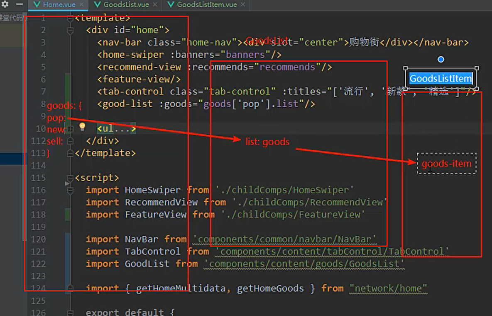

# TabControl点击切换商品

* 在组件内部发生的点击事件，你得传到外面的Home组件中去。这样Home组件知道你点击了谁，才会根据你的点击来这里替换数据。
* 我发现随着代码的增多，逻辑关系慢慢的变得也复杂了，我现在在哪个位置写代码都要找一下了，这个项目等以后做完了，一定还要自己再重新做一遍！！！！写一遍肯定是不行的。

# Better-Scroll的安装和使用

* 我们现在的滚动是非常的卡顿的。
* 所以我们会找一些滚动的框架 。

* 解决滚动的问题：[iscroll](https://github.com/cubiq/iscroll)，但是它很久不更新了,所以我们不用这个。
* 国人在`iscroll`核心的基础上弄了个[betterscroll](https://github.com/linYeeTracy/betterScroll)，我们用这个。
* [BetterScroll 2.0官方文档](https://better-scroll.github.io/docs/zh-CN/)。
* 但是为了让它不干扰我们首页的代码，我们在category进行演示。
* 既然要用这个框架，我们就先来安装一下：`npm install better-scroll --save`

# scroll的基本使用解析

* 这里老师单独新建了一个文件来讲`Better-Scroll`这个插件如何使用

  ~~~javascript
  <!DOCTYPE html>
  <html lang="en">
  
  <head>
    <meta charset="UTF-8">
    <meta name="viewport" content="width=device-width, initial-scale=1.0">
    <title>Document</title>
    
  </head>
  
  <body>
    

      

        <ul>
          <button class="btn">按钮</button>
          <!-- 这个按钮在滚利范围之内，依旧能够监听到 -->
          <li>列表数据1</li>
          <li>列表数据2</li>
          <li>列表数据3</li>
          <li>列表数据4</li>
          <li>列表数据5</li>
          <li>列表数据6</li>
          <li>列表数据7</li>
          <li>列表数据8</li>
          <li>列表数据9</li>
          <li>列表数据10</li>
          <!-- 后面还有90条数据，我就不写了 -->
        </ul>
      

    

    <!-- 在wrapper里面只能有一个元素，有多个元素是不行的 -->
    <!-- 这一个元素里面你可以放很多的元素 -->
    <!-- 但是类名可以随便取，wrapper和content可以改成别的名字 -->
    <!-- 主要强调的是结构 -->
  
    
    
  </body>
  
  </html>
  ~~~

# Scroll在Vue项目中使用过程

* 因为`Home.vue`、`Profile.vue`、`Category.vue`这3个组件都对`better-scroll`框架有依赖，如果每个组件都单独引入这个框架，那如果有一天这个框架不再维护了，到时候修改的话就很麻烦，所以我们最好再单独封装一层。
* 我们把可滚动这个东西封装到`components`文件夹下的`common`文件夹下(别的项目也能用)。
* 到时候我们封装的scroll组件，高度要进行单独设置的，因为每个视图需要滚动的高度都不是相同的。
* `ref`如果绑定在组件中的，那么通过`this.$refs.refname`获取到的是一个组件对象。
* `ref`如果绑定在普通的元素中，那么通过`this.$refs.refname`获取到的是一个元素对象。
* 报错：` [BScroll warn]: EventEmitter has used unknown event type: "pullingUp", should be oneof["refresh","contentChanged","enable","disable","beforeScrollStart","scrollStart","scroll","scrollEnd","scrollCancel","touchEnd","flick","destroy"]`，有点晚了，明天再来解决这个问题。
* [报错问题](https://blog.csdn.net/QFREX/article/details/107895548)——但是试了还是没有用啊。
* 弄了快一个小时没弄好，我他娘的先不弄了，先看后面的视频吧。淦！！

# BackTop组件的封装和使用

* 让图片有一个往下拉到一定位置右下角有个向上的箭头，点击箭头就可以马上回到页面最上方。
* 这个组件应该封装到`components`文件夹里面的`content文件夹`中，这个很明显和业务有关系。
* 哈哈，前面的报错弄好了。
* 但是又出现了一些新的报错，不过不算很严重，到时候我再看看吧。`TypeError: Cannot read property 'data' of undefined
  ​    at eval `我也发现了，很多组件里都有data属性，我都不知道最初是在哪里定义的了，它这里直接显示找不到这个属性了。
* 后面我知道了，这个`data`属性报错说明数据没有请求下来，是服务器接口的问题，不是我写的代码的问题，那我就放心了。
* backTop组件里面发生了一个点击事件，你要去操作Scroll组件里的代码，有点不好操作。
* `.native`修饰符的使用：当我们需要监听一个组件的原生事件时，必须给对应的事件加上`.native`修饰符才能进行监听。

# BackTop的显示和隐藏

* 计算机中没有黑魔法，一旦出现问题，一定是你的代码出现了问题。

# 完成上拉加载更多

* 又出现了别的报错了` "TypeError: Cannot read property 'scrollTo' of undefined"`，暂时还没弄好，很烦。
* 又报了一个错：`Error in nextTick: "InvalidCharacterError: Failed to execute 'setAttribute' on 'Element': ',' is not a valid attribute name."`。
* 这个报错主要是因为自己多写了一个逗号导致的，我把逗号删除之后发现上面的两个错都不报了，又好了，哈哈哈哈哈哈哈！！！
* 不知道自己装了什么插件，导致它自动自作聪明的给我添了一些代码，比如我明明写的是`$emit`，不一会儿它就不知道怎么就变成`$$emit`了，很烦。

* `流行`、`新款`、`精选`，选中谁，谁就加载更多。

* 这个`better-scroll`插件本身有一个bug，有时候滚不了。

# 昨天内容的回顾

> 唉，讲真的，学到这里，我里面的逻辑关系已经搞的一团浆糊了，完全搞不清楚了，现在只能被动的边看老师视频边敲代码了，自己独立写的话是万万写不出来的。没关系，第一次做大型项目，就先跟着照猫画虎的做吧。

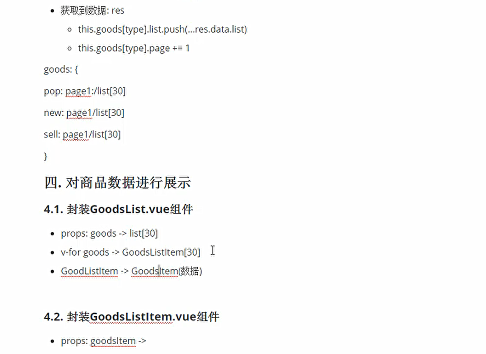

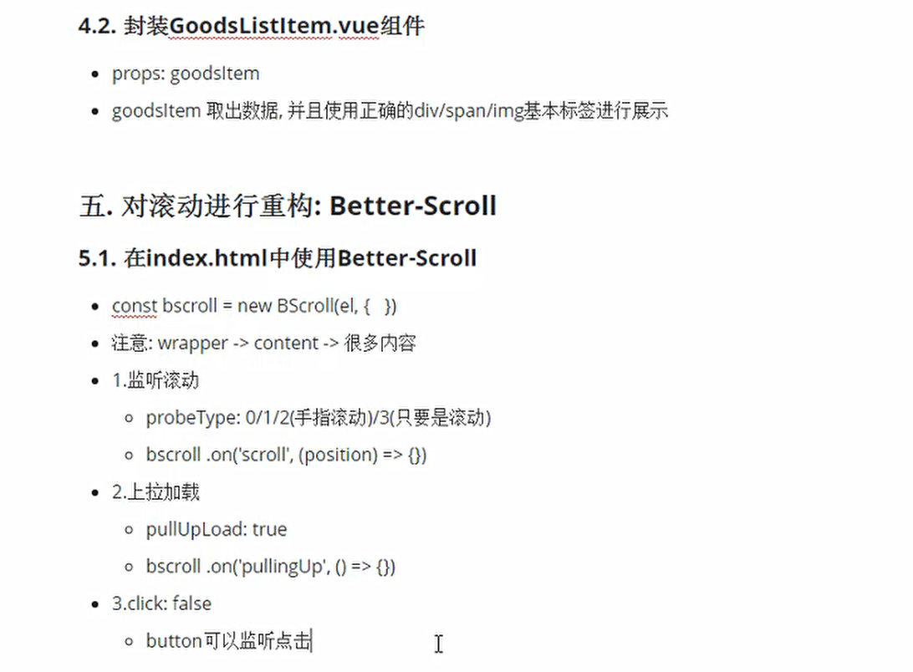

> 学到这里，我感觉有点崩溃了，我不知道自己还要学多久？也许还需要500个小时？自己现在的水平明显达不到一去公司就能产出，就能正常开发的程度。我的Vue知识、原生JS知识、甚至CSS都并不熟练，我不知道我到底还要多久才能找到一个月薪10K的工作呢？
>
> 没办法，只能硬着头皮继续学了。
>
> 等我再学到500个小时，到时候再来看看自己说的这句话，看到时候自己能否找到月薪10K的工作了吧。

# 滚动区域的Bug分析和解决

* Better-Scroll在决定有多少区域可以滚动时，是根据scrollerHeight属性决定的
  * scrollerHeight属性是根据放Better-Scroll的content中的子组件的高度
  * 但是我们的首页中，刚开始在计算scrollerHeight属性时，是没有将图片计算在内的
  * 所以，计算出来的告诉是错误的
  * 后来图片加载进来之后有了新的高度，但是scrollerHeight属性并没有进行更新的
  * 所以滚动出现了问题
* 如何解决这个问题呢？
  * 监听每一张图片是否加载完成，只要有一张图片加载完成了，执行一次refresh()
  * 如何监听图片加载完成呢？
    * `原生的JS监听图片：img.onload = function(){}`
    * Vue中监听：`@load = "方法"`
  * 调用scroll的refresh()
* 如何将GoodsListitem.vue中的事件传入到Home.vue中
  * 因为涉及到非父子组件的通信，所以这里我们选择了事件总线
    * bus：总线
    * `Vue.prototype.$bus = new Vue()`
    * this.\$bus.\$emit('事件名称', 参数)
    * this.\$bus.$on('事件名称'，回调函数(参数))

# refresh函数找不到的bug处理

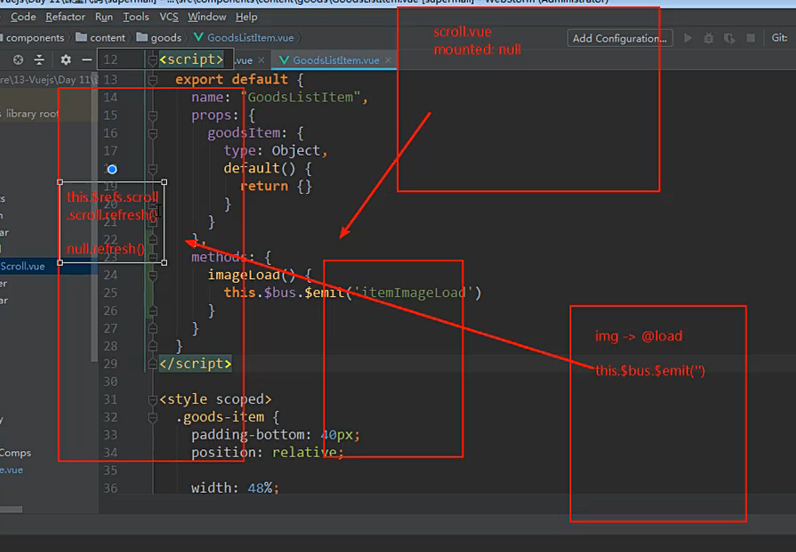

# 刷新频繁的防抖函数处理

* 我们不希望refresh函数调用的这么频繁，我们只希望它一秒钟之内只调用一次就可以了。
* 一个场景：一个输入框，我们在上面输入一个字，下面会立刻向服务器发送请求，在下面进行对应的展示，我们输入一个字，下面会根据这个字进行相应的展示。
* 用户输入`yifu`，而你是一个一个监听的，先监听`y`，再监听`yi`，再监听`yif`，再监听`yifu`，每次监听都向服务器发送请求，服务器就会受不了而且没有必要。
* 所以我们会进行一个"防抖"的操作，它会有一个防抖函数。用户输入后我们等它一会儿，看它还继不继续输入了，然后他不输入了，我们就发送网络请求。如果他在等待的这段时间内继续输，我们就将继续输入的内容作为备选，再等一会儿，看他继不继续输入了，如此往复。
* 对于`refresh`非常频繁的问题，进行防抖操作。
  * 防抖(debounce)/节流(throttle)
  * 我们这里只用防抖就可以了，节流没有用了(课下研究一下)。
  * 防抖函数起作用的过程
    * 如果我们直接执行refresh，那么refresh函数会被执行30次
    * 可以将refresh函数传入到debounce函数中，生成一个新的函数
    * 之后再调用非常频繁的时候，就使用新生成的函数
    * 而新生成的函数，并不会非常频繁的调用，如果下一次执行来的非常快，那么就会将上一次执行取消掉

* ~~~javascript
  debounce(func,delay){
        // debounce(this.$refs.scroll.refresh,500){
        // func表示给哪个函数进行防抖
        // delay表示要等多久 
        let timer = null
        return function(...args){
          if(timer) clearTimeout(timer)
          timer = setTimeout(()=>{
            func.apply(this,args)
          },delay)
        }
  }
  ~~~

* 像防抖这种功能性函数应该单独放到某一个位置，因为很多地方都可以用得到。
* 在单独的`common`文件夹下新建一个`utils.js`文件。
* 遇到一个报错：` [Vue warn]: Error in mounted hook: "TypeError: Cannot read property 'refresh' of undefined"`，很烦。

# 上拉加载更多的完成

> 这个报错是真的很烦，而且还暂时找不到解决方法。越学到后面越像听天书一样了，吸收的就很有限了，所以这个项目我以后可能要再做2遍，每间隔一段时间就再做一次。希望自己能有所收获吧。

* 监听什么时候滚动到底部。
* 报错：`Home.vue?76f2:267 Uncaught (in promise) TypeError: Cannot read property 'finishPullUp' of undefined`，很烦。

# tabControl的吸顶效果

## tabControl的offsetTop获取分析

* 必须要知道滚动到多少时，才有吸顶效果，这个时候就需要获取tabControl的offsetTop

* 但是如果直接在mounted中获取tabControl的offsetTop，那么值是不正确的。

* 如何获取正确的值呢？

  * 监听HomeSwipertimg的加载完成
  * 加载完成后，发出事件，在`Home.vue`中，获取正确的值.
  * 补充：
    * 为了不让HomeSwiper多次发出事件
    * 可以使用isLoad的变量进行状态的记录

  * 注意：这里不进行多次调用和debounce的区别

## 监听滚动，动态的改变tabControl的样式

* 问题：动态的改变tabControl的样式时，会出现两个问题：
  * 问题一：下面的商品内容，会突然上移。
  * 问题二：tabControl虽然设置了fixed，但是也随着Better-Scroll一起滚出去了。
* 其他方案来解决停留问题
  * 在最上面，多复制了一份PlaceHolderTabControl组件对象，利用它来实现停留效果。
  * 当用户滚动到一定位置时，PlaceHolderTabControl显示出来。
  * 当用户滚动没有达到一定位置时，PlaceHolderTabControl隐藏起来。

> 现在是2020年12月24日，这个项目先停一停，再这样听下去收效甚微，我要先回去把组件通信、`$emit`、`$refs`等这些知识弄懂再说。
>
> 做项目，重要的不是说我必须要在一个月内做完，或者说我要在接下来的3个月来做7,8个项目，这有何意义，而是在项目实战中看出自己的不足，然后进行知识的弥补。还有就是锻炼自己独立解决问题的能力，使用搜索引擎快速解决问题的能力，而不是在各大微信群里面到处问。
>
> 现在是2020年12月28日，我把前面的组件通信，自定义事件$emit，\$refs这些终于搞懂了，现在想了想还是继续做这个项目吧。本来打算重新再做一遍的，但是想想这样太浪费时间了，我知道自己第一次做项目肯定有很多不足的地方，但是没关系，这个项目我以后还是会在做第二次，第三次的啊，第一次做就看视频敲吧，掌握个3,4成也是没有关系的啊，以后还有进步的空间的嘛。

现在是2020年12月29日，我又快速的把之前报错的那段项目视频快速过了一遍，虽然依旧只能听懂3成，但是没关系，我就对着抄代码吧，可喜可贺啊！！！之前的报错终于消失了，这也意味着我可以继续接下来的学习了。

接下来把吸顶这部分学完，然后代码不报错的话，就可以弄另一块了，唉，不容易啊，自己也从我的第一个项目中了解到了自己还是有着严重的不足啊，还需要继续努力钻研啊！不知不觉2021年就快来了，我也只剩下3个月了，我真的不想再推迟自己的转行时间了，太煎熬了。

# Home离开时记录状态和位置

## 让Home不要随意销毁

* 你在首页界面往下滚，然后又点击 新款，再点回首页，发现页面又跑到最上面了。(有时候会出现这个问题)
* 这个主要是通过路由进行管理的，比如从首页调到新款界面，首页就会被销毁。
* 使用`<keep-alive>`可以让页面不会随意销毁。

## 让Home中的内容保持原来的位置

* 离开时，保存一个位置信息
* 进来时，将位置设置为原来保存的位置saveY信息
* 之前讲过两个函数：`activated`和`deactivated`。
  * 注意：最好回来时，进行一次refresh()刷新。

# 跳转到详情页并且携带iid

* 前端做的事情比较多的一般就是从服务器请求数据，把数据拿过来之后进行展示。
* 一个商品就是一个GoodsListItem，现在我们要做的就是监听它的点击。
* 详情页如何跳转呢？我们也可以给详情页配置一个路由，之后到时候跳转的时候，就是路由之间的跳转了。
* 在views文件夹下新建一个文件夹叫`detail`，新建一个组件叫`Detail.vue`
* 然后再`index.js`文件中创建路由：`const Detail = () => import('../views/detail/Detail')`以及后面的建立path和component等。
* 在`GoodsListItem.vue`里面进行路由设置。
  * 这里最好用push，之前很多地方用的是replace
  * 用push到时候方便返回(到时候调用push的back方法就可以返回了)
  * 你在调到详情页的同时也需要传递过来一些参数
  * 你需要把我们点击的商品的id给我们

# 详情页-导航栏的封装

* 因为导航栏比较复杂，所以我们新建一个`detail`文件夹下新建一个文件夹`childComps`文件夹，再在这个文件夹下新建一个`DetailNavBar.vue`文件来封装首页。

  ~~~javascript
  <template>
      

          <nav-bar>
              

                  
                  <!-- 这个图标也要监听点击，点击完之后会返回 -->
              

              

                  

                      {{item}}
                  

              

          </nav-bar>
          <!-- 它们是一些标题，我们最好把这些标题定义出来，等会做一个遍历就好了 -->
      

  </template>
  
  
  
  
  ~~~

# 数据请求以及轮播图展示

* 接下来要做的东西，我们首先需要先把数据请求过来才行。
* 拿数据主要就是根据iid来拿。
* 数据请求我们单独新建文件夹来封装，在`network`文件夹下新建一个`detail.js`文件来请求数据。
* 我们首先将需要的数据进行抽离。

> 实际开发中给的数据就是这么复杂，我们需要将这些复杂的数据进行抽离和提取，获取我们想要的数据。有一些公司有一些详细的接口文档，会告诉你每个参数是什么意思。但是有一些公司不会，只给你个大概。

* 拿到数据后我们利用轮播图对数据进行展示，我们在`childComps`文件夹下建立一个`DetailSwiper.vue`，里面放详情页的轮播图。
* 这个轮播图有一个问题，就是你无论点击哪个小图片，最终跳转的都是相同的轮播图图片。
* 原因很简单，主要是因为数据没有变。你每次进入detail里面的时候，这个东西也keep-alive了(在`App.vue`里面包裹着`keep-alive`的)，而我们希望每次进入detail里面的时候，希望获取一个新的iid。
* 所以我们detail这个东西不要让它`keep-alive`，在`App.vue`里面执行`exclude='Detail'`即可。

# 商品基本信息的展示

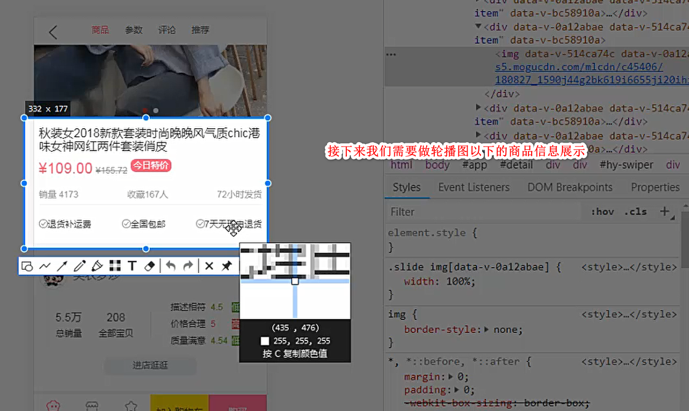

*  我们需要先封装一个组件，然后把我们需要的数据进行抽离。
* 这些数据总共在3个地方，但是我们不要弄3个变量，只弄一个变量就可以了。
* 我们需要把杂乱无章的数据整合为一个对象。然后在给我们组件传过去的时候，只把这一个对象传过去。

* `v-for`除了可以遍历数组以外，还可以遍历数字，比如`v-for="item in 10"`

* [object.keys()用法总结](https://www.cnblogs.com/wangshengli520/p/10044952.html)
* 你先把数据整合好，到时候一起展示。而不是一边取数据，一边展示，这样很容易乱的。

# 店铺信息的解析和展示

* 如果`is-better`为true时，说明很好，文字展示为红色，否则为绿色。
* 在这里我们要根据`is-better`动态绑定class。
* 现在这里程序出现了一些问题了，导航跟着一起滚了。(因为当前相当于原生的滚动，导航没有fixed)

# 加入滚动的效果

* 在详情页的时候，`首页、分类、购物车、我的`这4个东西就不要让它显示了。
* 我们可以使用相对定位加`z-index:9`和添加背景色来让它不显示。
* 我们这里还是用`better-scroll`来弄滚动。

* 因为有了`better-scroll`，那么导航就不用设置为脱离标准流了，因为`better-scroll`可以进行局部滚动。

# 商品详情数据展示

* 接下来就是下面的详情图片展示了。
* 这些图片都是在一个List里面，所以我们就没有必要弄一个对象了。
* 我们可以直接弄一个数组进行保存。
* 不对，图片上面还有2行文字，也是需要保存的。
* 我们还需要封装一个独立的组件来展示 detailInfo相关的数据
* 这里老师都是把文件直接复制拿来用了，我也直接复制了，到时候自己再单独敲一遍啊。
* 后端的API服务器不仅仅是为你前端服务的，它还要为安卓端、IOS端、浏览器端Web网页等服务。
* 写项目代码的难点
  * 代码如何组织
  * 业务逻辑(不要立即动手)
  * 自己留的bug(莫名bug)

# 从首页跳转详情页-iid

* 老师再这里又重新讲了一遍前面的内容。
* 我发现后面有好多视频内容和前面的重复了，应该是老师带了2个班，然后录视频的时候重复了。

# 首页位置的保持

* activated和deactivated这2个回调函数也叫做钩子函数

# 商品评论信息的展示

[vue基础之过滤器(filter)的使用](https://blog.csdn.net/badmoonc/article/details/81485803?utm_medium=distribute.pc_relevant.none-task-blog-BlogCommendFromMachineLearnPai2-2.control&depth_1-utm_source=distribute.pc_relevant.none-task-blog-BlogCommendFromMachineLearnPai2-2.control)

* 前面有一大节都是重复的视频内容，一直到这里才开始讲新的东西。
* 不是所有的商品都有评论信息的，有的有，有的没有。
* 在真实开发中，只要服务器返回的事件，都只是一串数字，而不会是:`2021-01-02 19:53`这样的时间格式的，需要你自己进行转换。因为每个地方展示时间不一定是一样的，比如有些地方需要时分秒，有些地方不需要。服务器会以Unix时间元年为起点，返回对应的时间戳。
* 如何将时间戳转为时间格式化？这个是非常常用的功能。因为太常用了，所以很多编程语言内置了函数。
  * 首先将时间戳转为Date对象。
  * 将date进行格式化(需要使用到正则表达式)，转为对应的字符串。
  * 时间格式化很重要，以后在公司100%会遇到这个问题的。
* 正则表达式是一个字符串匹配**利器**，还是比较复杂的，它里面的规则太多了。

# 首页和详情页监听全局事件和mixin的使用

* `Home.vue`和`Detail.vue`里面的mounted里面都有一模一样的代码，我们需要使用一个新的技术：**混入**来对它进行抽取。
* 有重复的代码，这里是不能用继承的，虽然继承也可以减少一部分重复的代码。(继承是减少类里面重复的代码的。)
* 但是我们这里是2个对象，对象是不能够继承的。
* 最怕的就是代码不是预期的结果，还不报任何错误。

# 首页TabControl不一致的问题

* 我们在开发中经常遇到一些hack的方式，就是比较巧妙的代码。
* 你刚开始选择的是精选，往上滚的话，首页TabControl就贴上去了，但是它显示的是流行。
* 我们代码里有2个TabControl，我点击一个的时候，另一个也要和我点击的保持一致才行。(它们2个的currentIndex应该一致才行。)

* 我也只能把这2行注释掉，让这个bug留着，以后再来解决这个问题吧。我解决问题的能力还是不足，大体上知道，但是最终还是解决不了。
* 哈哈，下一节视频老师就讲了这个问题了，是生命周期的问题，拿不到这个对象，所以才显示undefined。所以，添加一个`if(this.$refs.TabControl1 !== undefined)`条件判断即可。
* 这个问题圆满解决了。不过这也反映出我对于生命周期掌握程度不够。比如created里面去拿元素(比如$refs)是拿不到的。

# 详情页不能滚动的bug处理

* 我们要监听图片加载完，每次监听到图片加载后我们做一次刷新就可以了。
* 而图片都在`DetailGoodsInfo.vue`里面。
* 这个bug也解决了，基本上这个项目就挺好了，我现在的项目也没什么bug 了。

# 点击标题滚到对应内容

* 首先要监听它的点击——在`DetailNavBar.vue`里面监听。
* 在detail中监听标题的点击
* 获取index滚动到对应的主题：
  * 获取所有主题的offsetTop
  * 问题：在哪里才能获取到正确的offsetTop
    * 1.created肯定不行，压根不能获取元素
    * 2.mounted也不行，数据还没有获取到
    * 3.获取到数据的回调中也不行，DOM还没渲染完
    * 4.\$nextTick也不行，因为图片的高度没有被计算在内
    * 5.在图片加载完成后，获取的高度才是正确的

# 滚动内容显示对应标题

* 老师这里用了一个比较复杂的判断条件：

  ~~~javascript
  if(this.currentIndex !== i &&((i < length - 1  && positionY >= this.themeTopYs[i] && positionY < this.themeTopYs[i+1])||(i === length - 1 && positionY > this.themeTopYs[i]))){
   	   this.currentIndex = i;
  		 this.$refs.nav.currentIndex = this.currentIndex
  }
  ~~~

*  老师又给了一个hack做法

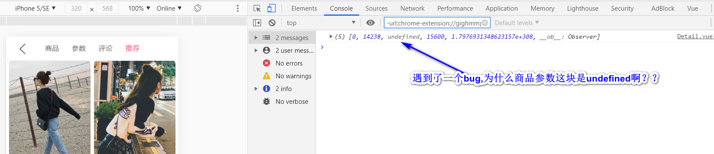

* 这个bug我一时不知道怎么解决

# 底部工具栏的封装

* 又有了一个bug，老师说最下面的图片没有显示全，但是他的代码和以前视频上的代码不一样，我也不能随便调，把样式调的乱七八糟，这个问题也只能以后再说了。

* 哈哈，问题解决了，`Detail.vue`里面`height: calc(100% - 44px - 49px);这样写不行`，应该这样` height: calc(100% - 93px);`写。

# BackTop的混入封装

* 右边的上拉箭头Home里面有，现在我们想要Detail里面也要有，于是把有关代码也复制一份到Detail里面，但是这样做的话代码就很冗余了。
* 我们可以进行抽取，使用mixin来做，把2个组件里面的公共代码给它抽离出去，抽到`mixin.js`里面去。
* 视频看到这里，突然信心大增，以前我认为这个项目我大概只掌握了2,3成，现在觉得自己以前是太没自信了，也是因为当初连组件通信都没怎么搞清楚导致的。现在，我对于这个项目的掌握程度，起码到了7成左右了，这个项目不知不觉也做了有40天了，一边做一边进行查漏补缺，遇到卡壳的地方也没有硬学，会停下来弥补自己的知识缺陷，所以还是有收获的。

# 将商品添加到购物车中

* 我们需要监听`加入购物车`的点击。
* 我们是在子组件里面监听的，要传给父组件`Detail.vue`。

* 我们可以使用Vuex来管理购物车中的商品。
* 有时候商品的价格是一个区间，而我们给到购物车的价格应该是一个确定的，真实的价格。
* 我们之前没有安装Vuex，现在我们通过`npm install vuex --save`来安装它。

# 将商品添加到store中

* 在store文件夹下新建一个`index.js`文件。
* 我的Vuex已经快忘光了，现在需要再去复习一下Vuex了。
* 不要慌，还是继续跟着视频去做吧。Vuex这个东西到时候再回过头来补一下，这个基本使用的话不算难的，只需要看2个小时的视频，就可以补的回来的。

# 导航航栏实现-Vuex知识点

* 把Vuex给分拆了

# 购物车商品列表展示

* 写着写着又报错了，而且我发现后面很多代码老师都是直接拿过来就用了，没有自己写了，怪不得这个项目都快完成了呢，原来好多代码都没有手敲完成啊。

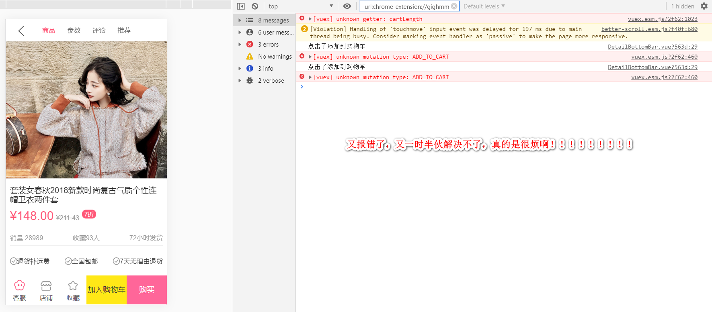

* 有些代码我没有完全按老师最终版的写，按老师刚开始的时候写的，然后问题解决了很多了。首先这个要跑起来，然后才考虑代码优化问题才比较好。

# 购物车列表的Item展示

* 这个又有了一个bug，就是页面没有滚动。原因是我新添加了新的数据，但是`better-scroll`并不知道我添加了新的数据，所以它认为滚动区域`scrollerHeight`还是0。
* 开心，现在的bug基本都解决了，不过是稀里糊涂的解决的，自己以后还需要再重新看一遍这个项目。
* 购物车图片左边的按钮单独给它封装为一个组件。
* 又有一个bug了，就是哪个对勾的图片没有显示出来，这个应该是个小问题，到时候我来看一下。——这个bug解决了，是自己的背景颜色写错了，所以没有显示出来。

# Item选中和不选中的切换

* 一个商品选中还是不选中，必然要通过一个东西来记录它。
* 记录这个东西的状态一定是在对象模型里面记录的。
* 以后在开发中，这种选中不选中的状态一定是在模型里面记录的。

# 顶部工具的封装和应用

* 这个我又出现了一些问题，格式没弄好，下面的全选、合计什么的遮住了图片，弄了半天，最后还是参照老师的做好的项目弄好了。
* 后来金额又多了一个￥，成了￥￥57.00,导致下面的合计金额错误，这个又搞了很长时间。
* 上面2个错误差不多搞了有1个多小时才弄好，也说明了基础的不扎实啊。

# 全选按钮的状态显示

* 显示的状态
  * 判断是否有一个不选中，全选就是不选中
* 点击全选按钮
  * 如果原来都是选中，点击一次，全部不选中
  * 如果原来都是不选中（某些不选中），全部选中

# Vuex-actions返回Promise-mapActions

[APP 反馈的三种形式：toast、snackbar、dialog](http://www.woshipm.com/pd/603334.html)

* toast就是你点击某个按钮出来的弹窗
* 我们来封装一个toast组件，在很多地方都可以使用它。
* 我们要做：点击添加到购物车按钮后会有弹窗，显示：添加到购物车成功。
* 那我们的第一件事就是监听点击按钮事件。
* 2个知识点：Promise、mapActions
* 查看官方文档是一个很重要的能力，你必须要掌握。IT行业的技术更迭是非常快的，不可能你所有想学的东西，每次你看视频都能找到。所以我们一定要多看官方文档。

# Toast封装-普通方式的封装

* 我现在觉得做项目真的挺好的，做项目会不停的用到自己以前学过的单个知识点，它们通过各种各样的混合方式，各个知识点合作来完成一个项目。然后我在做项目的时候，就能很容易的就可以知道我哪些知识点不熟悉，还需要单独再学一下了。

* 反正这里是看的一脸懵逼，也和自己今天感觉有点神游有关，思想没有那么集中了。

# Toast封装-插件方式的封装

# 解决移动端300ms延迟

* 老师的`分类`和`我的`这2个项目没有讲了，让我们自己写。
* 我以后第二次做项目的时候再写吧，现在也没时间了，而且感觉有点浮躁了，静不下心去写了。

* 首先使用`npm install fastclick --save`进行安装。
* 然后`main.js`里面进行导入
* 最后调用它的attach方法

# 图片懒加载

* 什么是图片懒加载？
  * 图片需要现在在屏幕上时，再加载这张图片.

* 首先使用` npm i vue-lazyload -S`进行安装
* 然后`main.js`里面进行导入
* 然后使用`Vue.use(VueLazyLoad)`

* 然后修改`img:src`为`v-lazy`指令

# px2vw-css单位转化插件

* 输入`npm install postcss-px-to-viewport --save-dev`来安装这个插件

* 在`supermall`文件夹下新建一个`postcss.config.js`文件，内容如下：

  ~~~javascript
  module.exports = {
    plugins: {
      autoprefixer: {},
  	  "postcss-px-to-viewport": {
  		  viewportWidth: 375,  // 视窗的宽度，对应的是我们设计稿的宽度.
  		  viewportHeight: 667, // 视窗的高度，对应的是我们设计稿的高度.(也可以不配置)
  		  unitPrecision: 5, // 保留几位小数，指定`px`转换为视窗单位值的小数位数（很多时候无法整除）
  		  viewportUnit: 'vw', // 指定需要转换成的视窗单位，建议使用vw
  		  selectorBlackList: ['tab-bar', 'tab-bar-item','shopping-cart-bottom-bar'], // 指定不需要转换的类
  		  minPixelValue: 1, // 小于或等于`1px`不转换为视窗单位.
  		  mediaQuery: false // 允许在媒体查询中转换`px`
  	  },
    }
  }
  ~~~

* retina：高清屏，一个点上有2个像素。

* exclude中存放的元素必须是正则表达式

# nginx-项目在window下的部署

* 当我们把项目开发完之后，对项目做的第一件事情，就是对项目进行打包了。
* 我们通过`npm run build`进行打包。
* 刚开始可能会将项目部署到测试服务器，让测试人员先对项目进行一个测试。
* 部署的方式有很多，你可以通过Apache进行部署，也可以通过TomCat进行部署，等等。
* 在这里我们选择Nginx服务器进行部署。
* 服务器本质上也是一台电脑，只不过这台电脑可能没有显示器，就只有一个主机。而且这个电脑的特点是24小时开机的。它里面存了很多东西，可以给用户提供各种各样的东西。
* 公司有没有自己的服务器主机？
  * 大部分公司都没有自己的服务器主机，它要有一个机房，还要维护，成本挺高的。
  * 他们一般租借腾讯云/阿里云等云服务器。
  * 很多大公司都有自己的服务器集群，很多公司都会选择去租他们的服务器。
  * 老师的服务器接口是部署在腾讯云上面的。
  * 我自己买的腾讯云服务器已经吃灰好几个月了，一直没有时间去弄它，也不知道自己要怎么去利用这个云服务器干些事情。
* 第一：将自己的电脑作为服务器，装一个Nginx。
* 第二：远程部署。
* 我打开自己的腾讯云服务器，试着部署了一下，没有成功，我也没有试了。

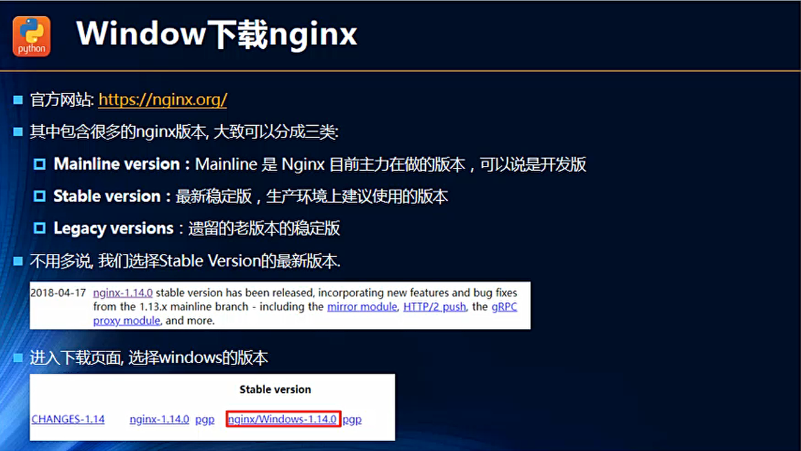

# 项目在远程linux下的部署

# 一道面试题

* 如何理解生命周期
* 如何进行非父子组件通信
* Vue响应式原理
  * 不要认为数据发生改变，界面跟着跟新，这个是理所当然的。

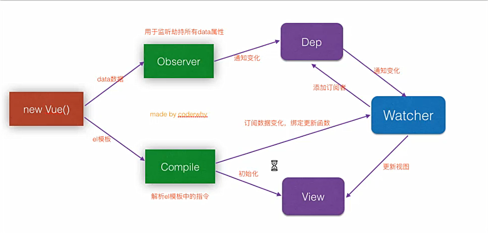

~~~javascript
<!DOCTYPE html>
<html lang="en">

<head>
    <meta charset="UTF-8">
    <meta name="viewport" content="width=device-width, initial-scale=1.0">
    <title>Document</title>
</head>

<body>
    <!-- 
        问题1：app.message修改数据，Vue内部是如何监听message数据的改变的
    ——通过Object.defineProperty，用于监听对象属性的改变

        问题2：当数据发生改变，Vue是如何知道要通知哪些人，界面发生刷新
    ——通过一种设计模式：发布订阅者模式
     -->
    

        {{message}}
        {{message}}
        {{message}}
        {{message}}
        {{name}}
    

    
    
    
</body>

</html>
~~~

* 问题1：Vue内部它是怎么知道我有几个地方是用到message的呢？
* 它需要知道数据一旦发生改变，要通知别人做出改变。

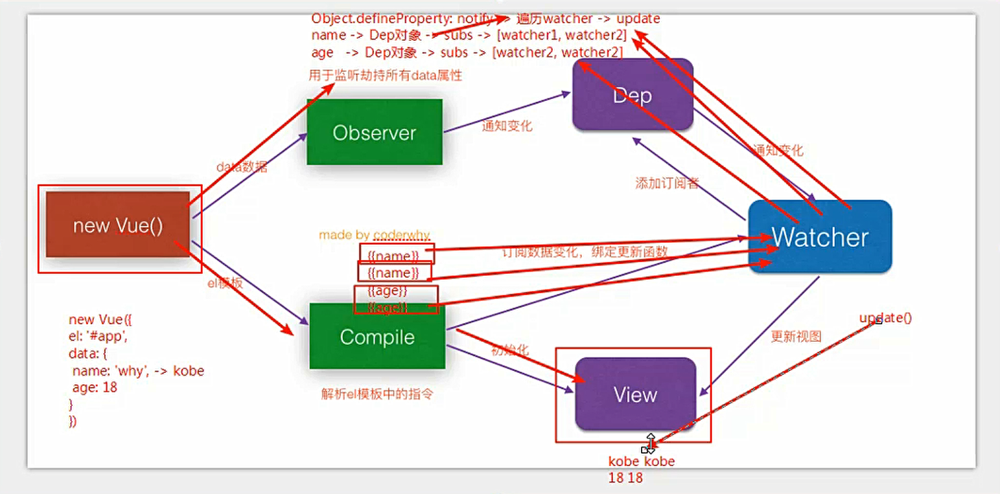

# 看完了

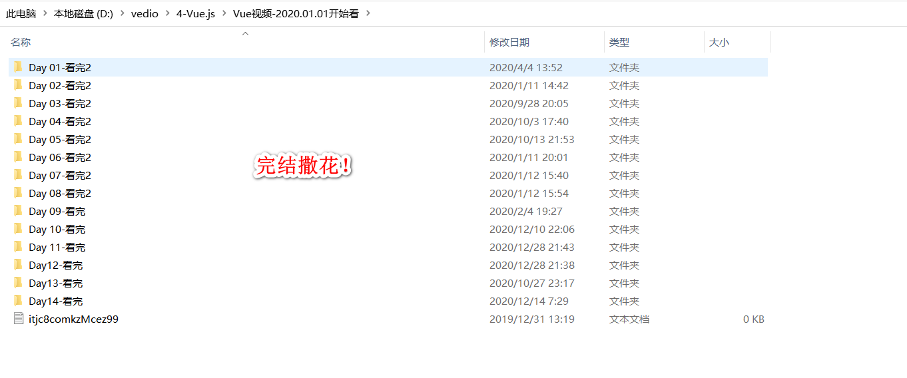

# 部署项目到GitHub Pages

[GitHub Pages发布出去后显示的是Readme.md的内容而不是index.html？](https://www.zhihu.com/question/34042071?sort=created)

[Vue 项目部署到GitHub Pages并同步到Gitee Pages](https://my.oschina.net/u/4365632/blog/3319697)

现在是2021年2月10日，放假已经9天了，我开始逐渐变得慢悠悠了起来，对于找工作一点也没有什么紧迫感。这9天慢悠悠的把后台商城弄完了，之后就一点也没有准备别的了。

今天打算把自己的项目部署一下，找了半天资料，这才发现，其实最好的东西就是文档。

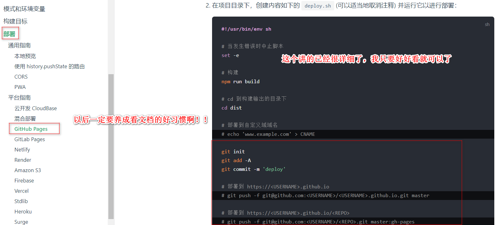

* 我试了一下不行，又仔细看了一下文档，不好意思，是我眼瞎。

* 我先在项目根路径下新建一个`deploy.txt`的文件，然后把里面的内容复制一下，并进行了修改。
* 最后把后缀名改成了`.sh`，它就自动开始运行了，之后我打开GitHub，发现我的仓库变成了这个样子，新多了一个分支。

* 我去，页面虽然显示了，但是请求不到数据，而且还把我原来的博客地址不显示了。。。。。。
* 我还是用我自己的腾讯云服务器来部署吧，有效期还有大概半年吧，先用着吧。

