(注1：第一个项目做的是前台商城，第二个项目想着就弄个后台管理系统吧。)

(注2：现在是2021年1月9日，想着自己还有那么多东西没学：TypeScript、Vue3.0、React、Node等，还有那么多的东西知识点还没巩固：ES6、CSS、Webpack等，心里面不免焦虑，今年的三月份我真的要辞职转行了啊，刻不容缓了，没办法了，一口也吃不成个胖子，我就一边做项目，一边准备简历，一边再学习新的知识、还要一边巩固以前学过的知识了啊。就3个月不到的时间了，时间肯定是不够用的，我就尽力去做去学去尝试吧。目前也没什么好的办法了。)

(注3：这个项目是黑马的，[视频链接](https://www.bilibili.com/video/BV1EE411B7SU?from=search&seid=17348368151678187991))

(注4：这个视频也就20个小时左右时间，7天的课程，大体看了一下，一节课短的就3,4分钟，长的就8,9分钟，我挺喜欢的，这样的视频时长可以极大的缓解自己的焦虑感，毕竟已经步入社会4年了，心早就跟上学的时候不一样了，不容易集中精神了，要是一节课40分钟我恐怕自己会崩溃掉。况且整个社会的大环境也是极其浮躁的。)

(注5：现在是2021年1月25日，大概有将近2周的时间基本上没有做这个项目了，一方面在后端API接口那里卡了壳，一方面自己的心态出现了一些问题，导致这2周自己处于一种不知所措的状态，方寸乱了，生活也没有规律了，几乎是没有怎么学习，就是进行一些娱乐活动，看看视频、玩玩游戏这些。前几天自己将自己的电脑重置了，里面的重要内存保存后重装了操作系统，不过还是没有找到学习的感觉，直到今天，我昨天晚上第一次尝试盐酸舍曲林，晚上12:00睡的，结果今天4:30就自然醒了。想着这么早起来不然试着学习一下，结果还行，我慢慢找到了学习的感觉了，现在在写这些字，接下来准备继续学习了。希望慢慢的调节，自己的生活和学习都能够规律下来吧。)

(注6：现在是2021年2月1日，现在做这个项目只能是被动的看老师视频，跟着视频照猫画虎的敲代码，如果让自己独立写，自己是万万写不出来的，现在还完全达不到这种程度。不过也别气馁，**日撸代码几百行，烂泥也能扶上墙**，自己现在这个阶段，敲就完事了。)

(注7：[如何才算有前端项目经历，看着视频完成算吗？](https://www.zhihu.com/question/406883171/answer/1401659718)，看来我做的很多项目都要自己重新再试着独立做一遍了啊，第一次都是看着视频对着敲的啊，到时候面试官问起来我估计都答不上来啊。)

(注8：有一些重复功能老师没有写了，让我们自己写，我以后再重写这个项目的时候再来自己写吧。)

(注9：现在是2021年2月3日，这个项目我看的很赶，不过也是有收获的。我的脑海中隐隐约约的产生了一些变化，我可以感觉的到。其中一个体验就是函数真的是无处不在，一个功能就对应一个函数。还有从服务器拿数据，也比以前印象更加深刻了。)

(注10：现在是2021年2月5日，我的视频是下载到自己的电脑上看的，昨天做商品分类时出了一些小bug，花了一晚上的时间都没弄好，今天试了把老师的代码复制了一下运行，也没用，和我自己写的一样，后来突然想到看弹幕，大家有没有遇到同样的问题，果然！！问题就这样顺利解决了。哈哈，还是大家一起学习，互相帮助效率高啊！)

# 项目实战目标

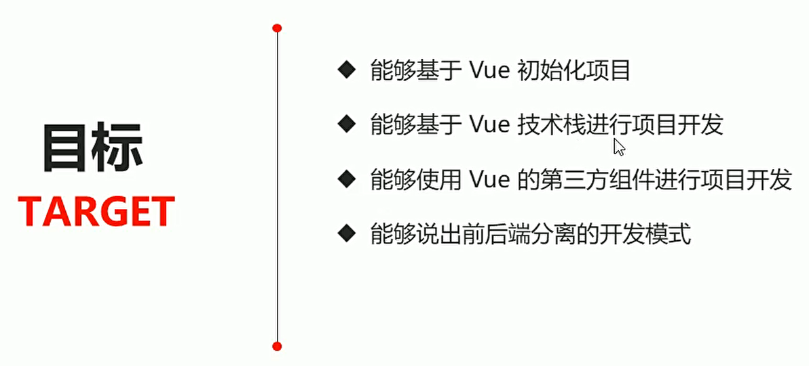

# 项目实战目录

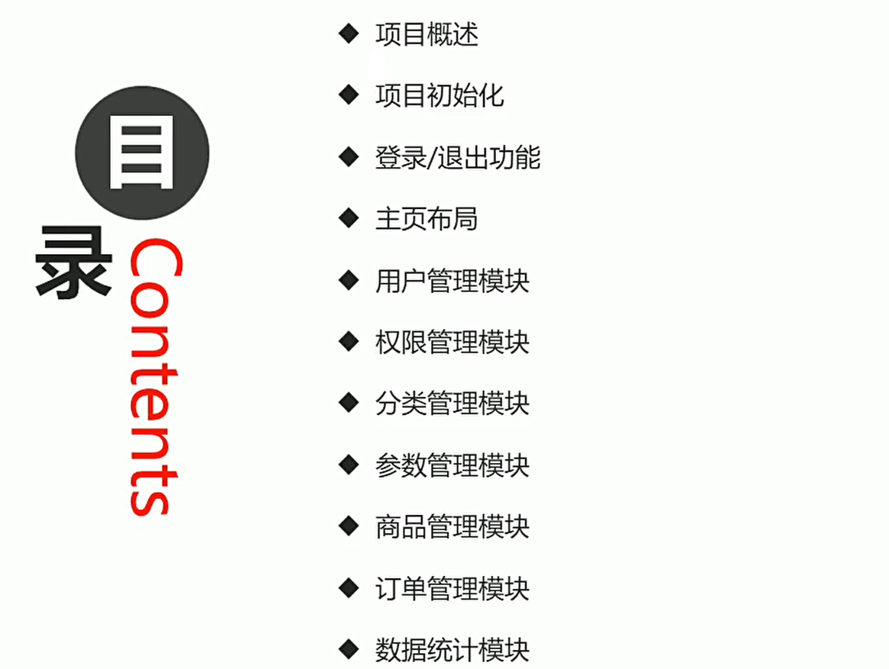

# 项目概述

## 电商项目基本业务概述

## 电商后台管理系统的功能

> 老师展示了一下后台里的内容，感觉里面的界面也挺丑的，功能也不算多。所以这个项目也就是先熟悉一下吧。
>
> 现在是2021年1月31日，我现在觉得界面也不算丑了。

## 电商后台管理系统的开发模式（前后端分离）

* 后端主要负责操作数据库，并且向前端暴露一些API接口
* 前端主要负责绘制页面，同时基于AJAX技术来调用后端提供的API接口
* 这种后端负责写接口，后端负责调接口的开发模式，我们可以称之为前后端分离模式

## 电商后台管理系统的技术选型

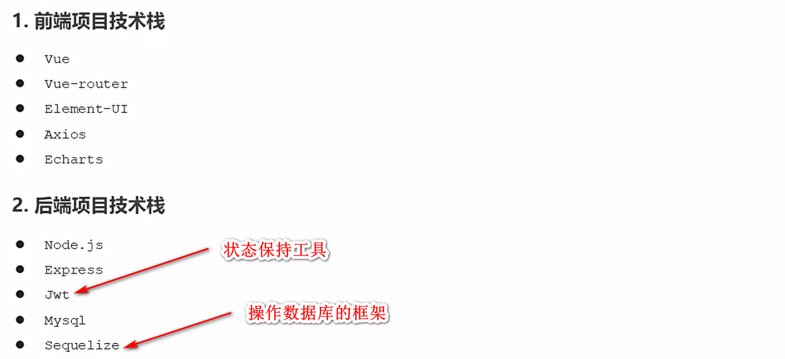

# 项目初始化

## 前端项目初始化步骤

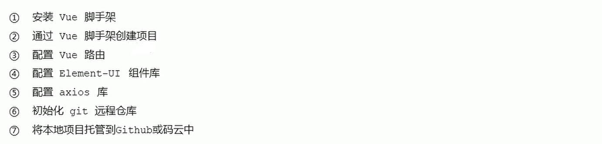

* 运行，输入`cmd命令`
* 在DOS下输入`vue ui`命令
* 如下图所示创建新项目

* 在下一页的预设中选择安装`Babel`、`Router`、`Linter/Formatter`、`使用配置文件`这些选项。

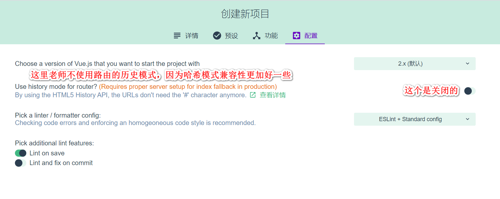

* 项目安装好之后，我们开始安装`Element UI`，点击插件选项并进行查找`vue-cli-plugin-element`，之后下载安装即可。
* 插件安装完之后要对插件进行一些相关的配置：将完全安装改为按需安装，可以不会让这个插件过于臃肿。
* 接下来安装Axios，选择`依赖`——`安装依赖`、——`运行依赖`——输入`axios`——点击安装。

## 本地项目托管到Github上

视频里老师把项目托管到码云上了，我习惯Github了，就托管到Github了。

> 随着时间的推移，我的Github基本操作已经大体没有问题了。

## 后台项目的环境安装配置

> 昨天(2021.01.14)看这节视频的时候，老师用的是PHPStudy集成安装软件来安装的MySQL，我为了显得更加"专业"一点，使用的是以前单独安装的MySQL，可是没想到打不开了(PS也打不开)，刚开始的时候提示缺少`msvcr140.dll`文件，然后又提示缺少`vcruntime140.dll`文件，后来又直接`无法启动，报错0xc000007b`，然后我就杠上了，查了网上可以查到的各种方法，下载了DirectX修复工具，没有用;下载了`微软常用运行库合集`，也没有用。最后心态炸裂，这节视频都没有看完，后台环境也没有搭建完成。也没心思去看别的视频了。昨天晚上就这样被自己彻底浪费了。
>
> 唉，以后要学会妥协啊，一件事情弄来弄去弄不好就先放下，不要一根筋啊。
>
> 现在是2021年1月25日，电脑重装！！，重新开始！！

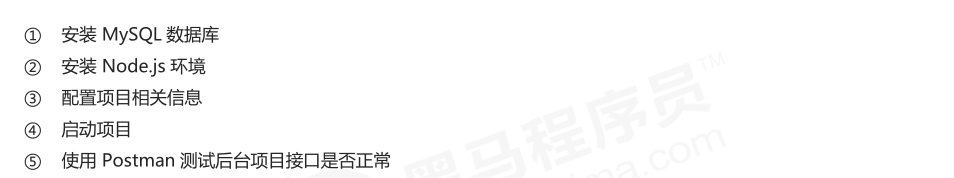

进入`vue_api_server`这个文件夹，shift并右键，进入powshell命令行，输入`npm install`安装依赖包。

然后再输入`node .\app.js`就可以将API接口项目运行起来了。

接口有问题，我又看了下面评论区提供的接口，都没有用POSTMAN成功请求到数据。这可咋办。

安装完依赖包以后使用`node .\app.js`执行这个文件夹里面的`app.js`文件,从而把API接口项目给它跑起来。

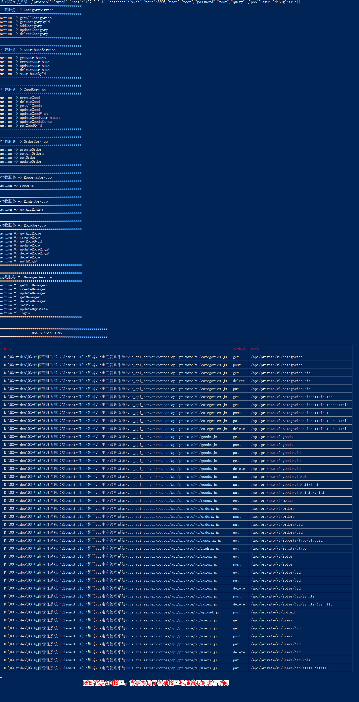

### 使用Postman测试后台接口是否正常

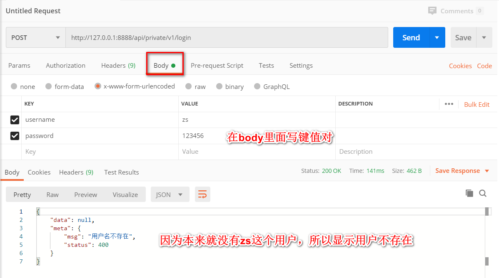

> 其中，这里面的token是用来进行登陆状态保存的，之前我们学习的Node里面有一个session，它也是客户端与服务器之间的状态保存机制，这里的token和session的作用是一样的，都是用来保存状态的。

# 登陆/退出功能

## 登陆概述

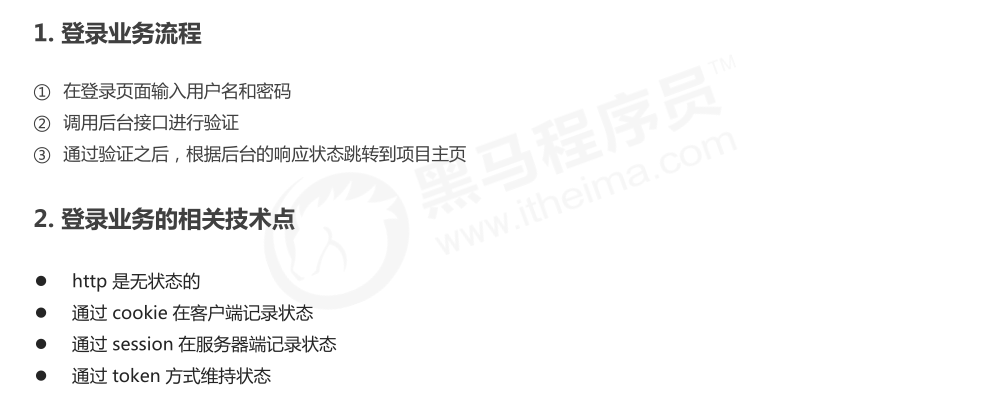

cookie和session是一组，token是一组。使用它们三个的原因就是因为http记性不好。

什么时候用cookie和session，什么时候用token呢？

* 我们做的这个Vue项目它运行在一个新的端口号，那我们的服务器可能与我们的前端Vue之间有一个跨域的问题，那如果前端和服务器(后台接口)不存在跨域问题，推荐使用cookie和session，反之如果存在跨域问题，则使用token来维持登陆状态。

## 登陆概述-token原理分析

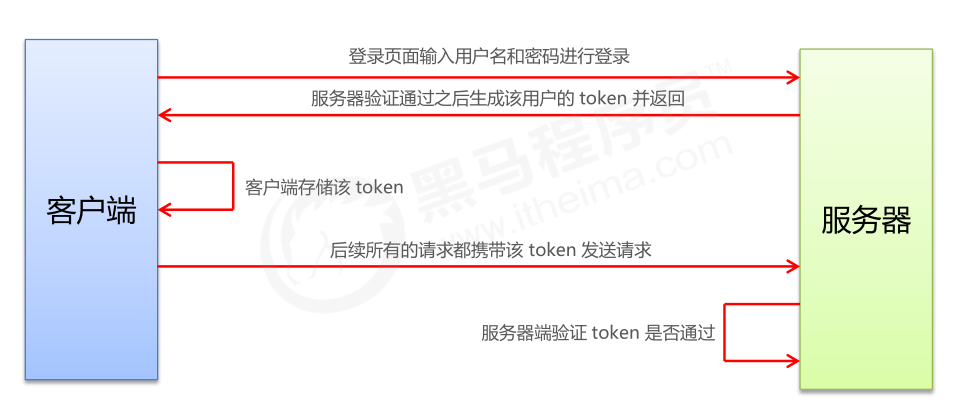

> token值是由服务器生成的，而且每个不同的用户对应的token值也都是不一样的。 

## 登陆功能实现

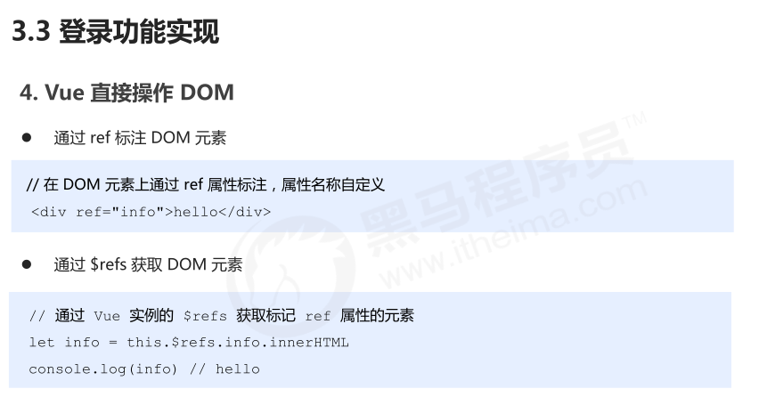

在页面正中间是一个div,这个div头部区域是默认的头像，div的中间有用户名和登陆密码，在div的底部有登陆和重置2个按钮。

* `el-form`表单组件：整个组件框可以认为是一个大的表单。
* `el-form-item`表单项目组件：在表单中，还会包含表单item项。用户名是一个item项，密码区域是另一个item项目。甚至，底部的登陆和重置这2个按钮也是属于item项的。在这个表单中包含3个item项的。
* `el-input`：输入框
* `el-button`：按钮
* 字体图标：admin和密码框前面的小图像。它们都属于字体图标

我们先打开`vue_shop`文件夹，使用`git status`查看状态，确保其是干净的。然后我们开始创建新功能：登陆功能。在开发中，每创建一个新功能最好就新建一个分支，当把这个功能开发完成之后，再把这个分支合并到master主分支上。

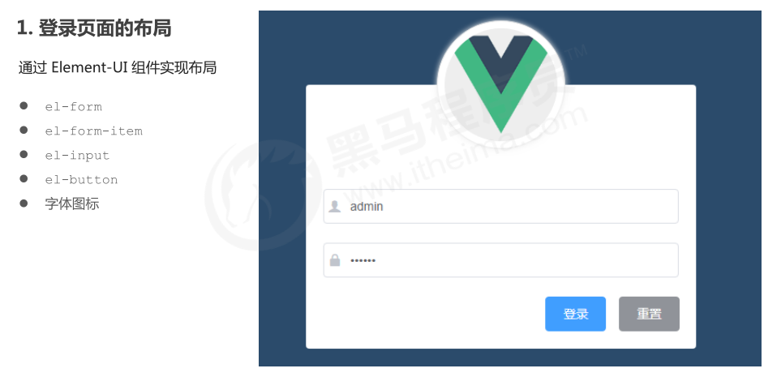

* 使用`git checkout -b login`创建login分支。
* 使用`git branch`命令可以查看当前项目中所有分支。

# 删除不要的组件

把模版里面的什么``Hello World.vue`这些东西都删掉了，里面干干净净的，什么都没有。

我这里出现了问题，明明下载了`element ui`但是它显示`element元素没有被定义`，弄了半天没弄好，索性版本回滚到之前初始化项目的那个时候，重新来弄了。

# 创建登陆组件

[解决Vue中Module not found: Error: Can't resolve 'xxxxx' 究极管用办法](https://blog.csdn.net/qq_31493411/article/details/105791494?utm_medium=distribute.pc_relevant.none-task-blog-BlogCommendFromBaidu-4.control&depth_1-utm_source=distribute.pc_relevant.none-task-blog-BlogCommendFromBaidu-4.control)

[Module not found: Error: Can't resolve 'less-loader'报错解决](https://blog.csdn.net/weixin_43553701/article/details/95106038)

> 今天是2021年1月27日，我今天晚上啥也没干，把项目删了重新部署了一遍，重新上传到GitHub上了，现在终于没有问题了，可以接着往下做了。

* 在文件夹`components`下新建`login.vue`组件
* 它又开始给我报错了`Module not found: Error: Can't resolve 'less-loader' in 'D:\02-looking for job\00-Project\03-background management\vue_shop'`。
* 又来一个报错`Module not found: Error: [CaseSensitivePathsPlugin] D:\02-looking for job\00-Project\03-background management\vue_shop\src\components\Login.vue does not match the corresponding path on disk login.vue`这个应该是大小写的问题了。
* 接着报错`Module not found: Error: Can't resolve 'less-loader' in 'D:\02-looking for job\00-Project\03-background management\vue_shop'`，这个我觉得自己添加一个`less-loader`应该就可以了。
* 终于解决了，正常编译了！！真的是费劲啊！！

# 登陆组件布局

[前端运行时依赖（dependencies）和开发依赖（devDependencies）区分](https://www.cnblogs.com/sue7/p/11759146.html)

* 首先给登陆界面设置一个背景色

  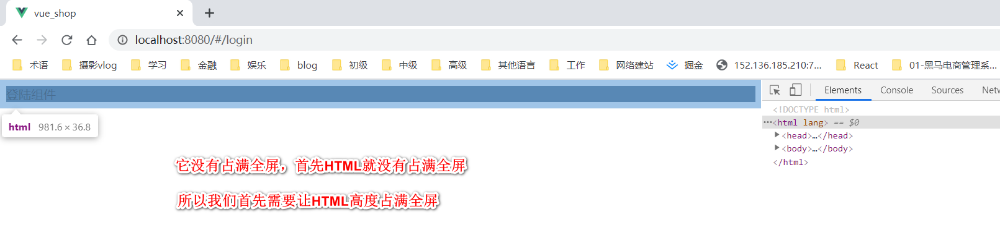

  * HTML撑满全屏
  * body要撑满全屏
  * body里面的div也要撑满全屏

* 我们在`assets`文件夹下新建`css`文件夹，里面新建一个`global.css`，里面写全局样式。

* 撑满全屏后我们在绘制登陆的那个白色的盒子。

  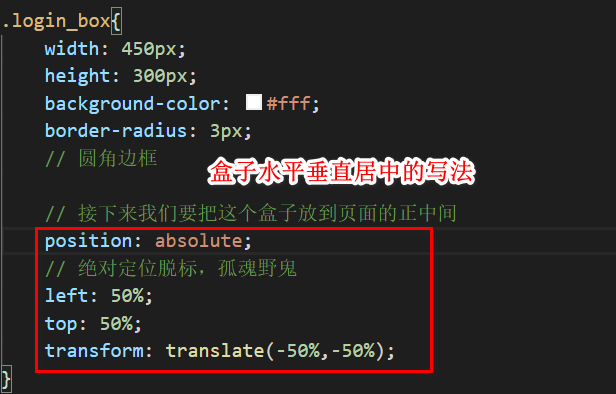

# 登陆组件头部布局

[CSS3系列之transform详解translate](https://www.cnblogs.com/yanggeng/p/11286250.html)

* 这里老师使用了Less的语法嵌套形式，我需要单独去复习一下Less了，都忘了。
* 老师使用了`box-shadow`来设置了头像阴影。

# 登录组件表单布局

* 最外面是一个form表单，里面的每一行都是一个form表单项(item)。

* 每个输入框都是`el-input`组件，下面的2个button都属于`el-button组件`。

* 在左侧我们还会用到字体图标。

  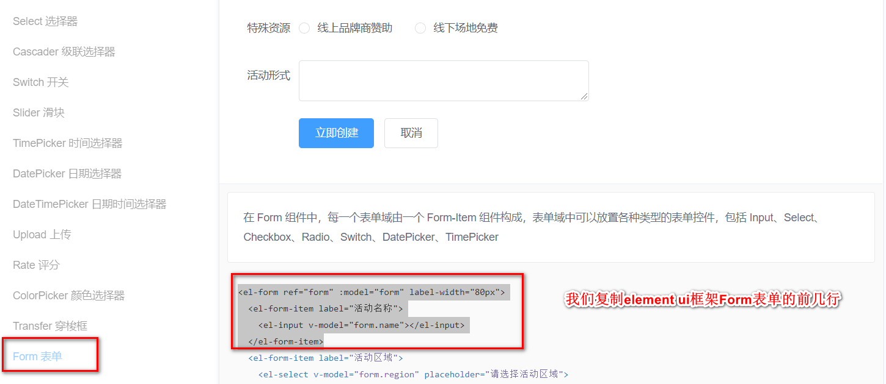

* 这里会报错：` Unknown custom element: <el-form> - did you register the component correctly?`，原因是我们当时下载`element ui`时选择的是按需导入的，所以我们需要打开`plugins`文件夹下的`element.js`文件，导入我们用到的组件。

  

* 接下来我们要对界面做一下美化。

  * 2个按钮用flex布局，让它居右对齐。
  * 2个文本框加一个定位，移动位置到页面底部。

  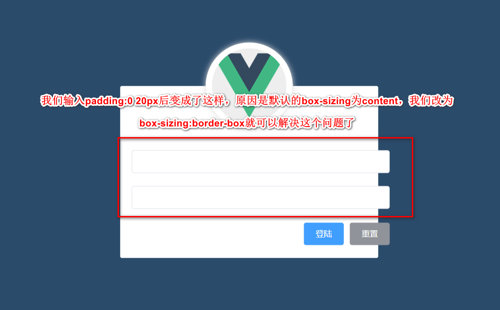

  # 登录组件表单小图标布局

  

* 我们可以在`el-input`标签内添加`prefix-icon="el-icon-search"`使得文本框前面有个图标，之后我们再把图标改成用户和小锁的图标就可以了。

  

* 我们这里使用的是阿里的图标库，`fonts`文件夹老师已经帮我们下载好了。里面的`iconfont.css`这个里面就有我们需要的图标。这个图标怎么用呢？我们可以打开`demo_fontclass.html`这个文件。

  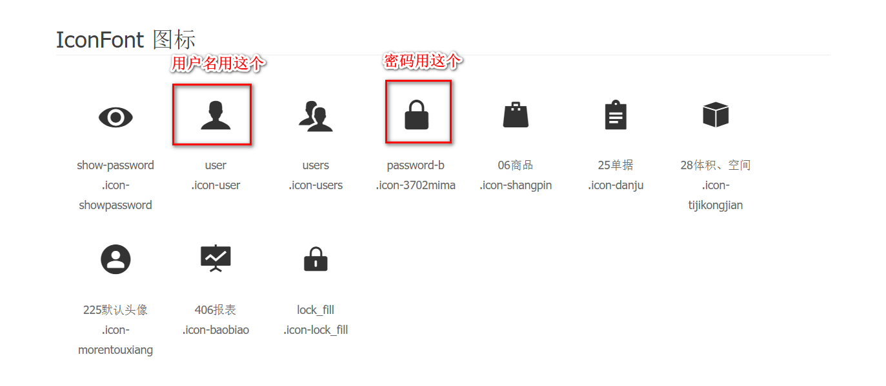

  

* 我们的`fonts`文件夹最终是放到`src`文件夹下的`assets(资源)`文件夹里面的。

* 之后我们在`main.js`入口文件中导入字体图标。

# 登录组件表单的数据绑定

[export 和 export default 的区别](https://www.cnblogs.com/fanyanzhao/p/10298543.html)

[Vue的组件为什么要export default](https://www.cnblogs.com/blog-cxj2017522/p/8562536.html)

[ES6中export default 命令的详解（引用）](https://blog.csdn.net/liuguiqian1/article/details/82712659)

[export default {} 和new Vue()区别](https://blog.csdn.net/weixin_30437847/article/details/96196263?utm_medium=distribute.pc_relevant.none-task-blog-BlogCommendFromMachineLearnPai2-1.control&depth_1-utm_source=distribute.pc_relevant.none-task-blog-BlogCommendFromMachineLearnPai2-1.control)

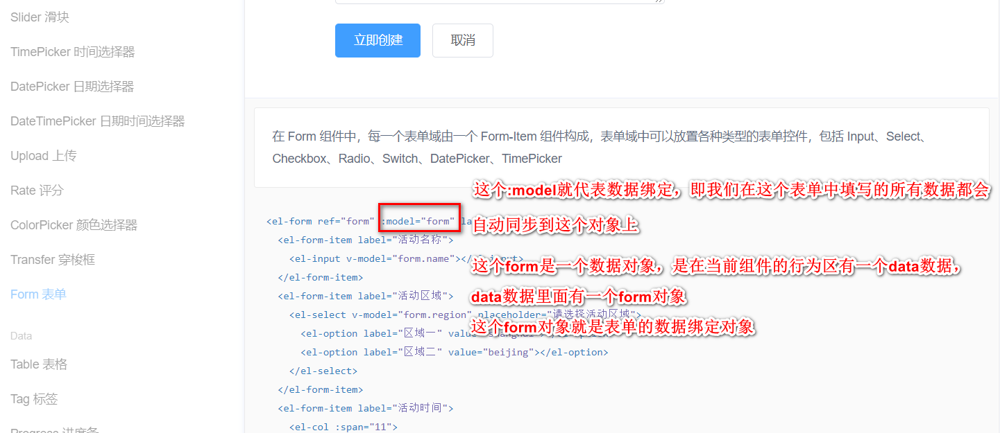

* 我写`:model`表单里不显示内容，我写`v-model`表单里才显示内容，估计是版本的问题吧。——哈哈，我是把`v-bind`和`v-model`给弄混了。`v-model`好像没有缩写，`v-bind`的缩写才是`:`
* 密码框应该是隐藏的，我们不应该让他们看到具体的密码是什么样子的。可以给`el-input`添加一个`type="password"属性即可，这是H5C3的属性。`

# 登录组件表单的数据验证

* 当我们输入用户名和密码的时候，一离开文本框就会立刻对用户名和密码进行合法性的校验。

* 首先，为`el-form`通过属性绑定置顶一个rules校验对象。

* 其次，在data数据中，定义`rules`这个教研对象，其中每一个属性都是一个验证规则。

* 最后，为不同的表单item项通过`prop`来置顶不同的验证规则，来进行表单的验证。

  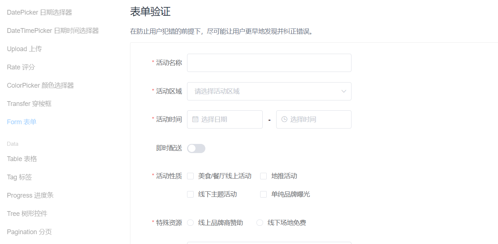

  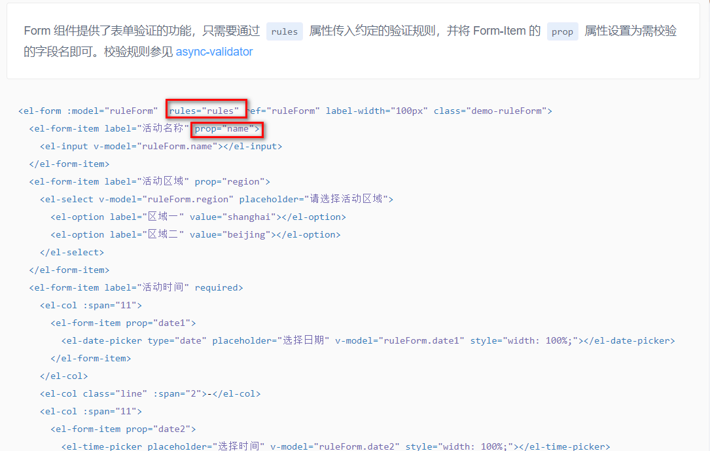

  

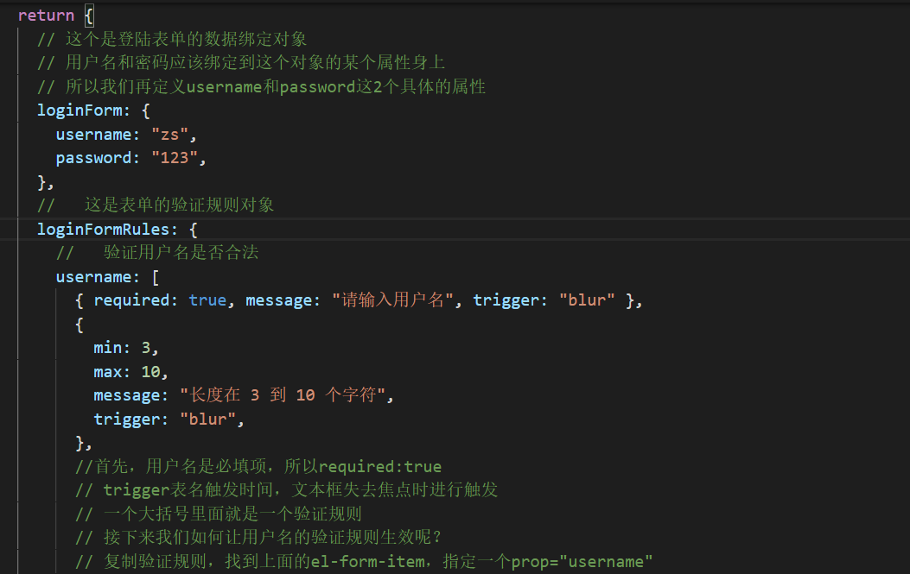

* `el-form-item`是子组件，`el-form`是父组件，`:rules:xxx`是写在父组件里面的，`prop="xxx"`是写在子组件里面的，这个我是真的不熟悉啊！！！

# 登录组件实现表单的重置

[vue中ref的作用](https://www.jianshu.com/p/623c8b009a85)

* 当点击重置按钮我们希望重置表单的数据校验结果。

  

* 一个问题：如何拿到表单的实例对象呢？给`el-form`加上一个`ref`的引用，`ref='loginFormRef'`(既然是一个引用，我们推荐都`ref`后缀结尾。)

* 接下来只要大家获取到`loginFormRef`就能拿到表单的实例对象，即`loginFormRef`就是表单的实例对象，可以通过它调用`resetFields`这个函数来实现表单的重置。

* 我们需要为重置按钮绑定一个点击事件

  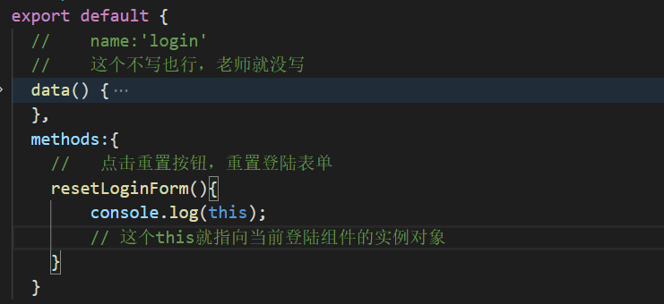

  

* 通过`this.$refs.loginFormRef`就可以直接获取到表单的实例对象了。

# 登录组件登录前的预验证

* 当我们点击登陆按钮，不应该直接发起网络请求，而是在发起请求之前先对我们的表单数据进行一下预验证。当只有验证通过之后，才应该允许它发起这次网络请求，否则，我们应该直接提示用户，表单数据不合法。

* 怎么进行预验证呢？我们应该在点击登陆按钮的时候，通过调用表单的某个函数来进行预验证。那么调用哪个函数呢？

  

* 先为登陆按钮绑定一个单击事件，然后再调用`this.$refs.loginFormRef.validate((valid)=>{console.log(valid);})`进行预验证。

# 登录组件根据预验证是否发起请求

[async 函数的含义和用法](http://www.ruanyifeng.com/blog/2015/05/async.html)

> 我`async`和`await`还没有学，感觉抓紧时间来学一下啊。

* 我们根据验证结果来决定是否发起验证登陆请求。
* 我们对`valid`值是否为true进行判断，如果为true，则通过验证，可以发送请求。
* 要发起请求，肯定要使用对应的包：`Axios`，我们需要在`main.js`中对`Axios`进行一下全局的配置。

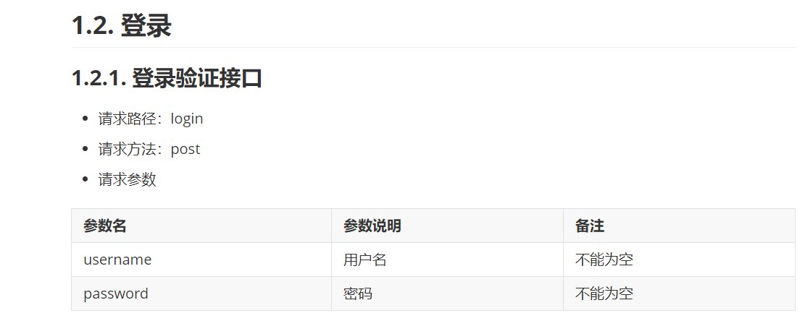

* 用户在表单中填写的数据会自动同步到`loginForm`中。
* 如果你要请求登陆服务器，必须要让API服务器处于运行中的状态。

​       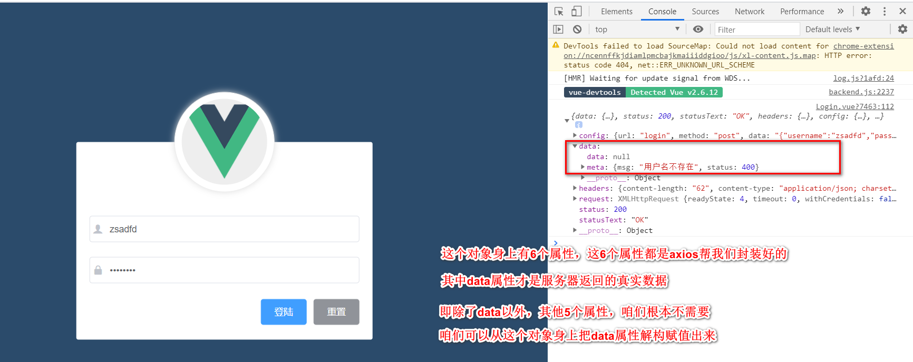

* post的返回值是promise，我们可以用`async`和`await`来进行简化操作。
  * await只能用在被`async`修饰的方法中

# 登录组件配置弹窗提示

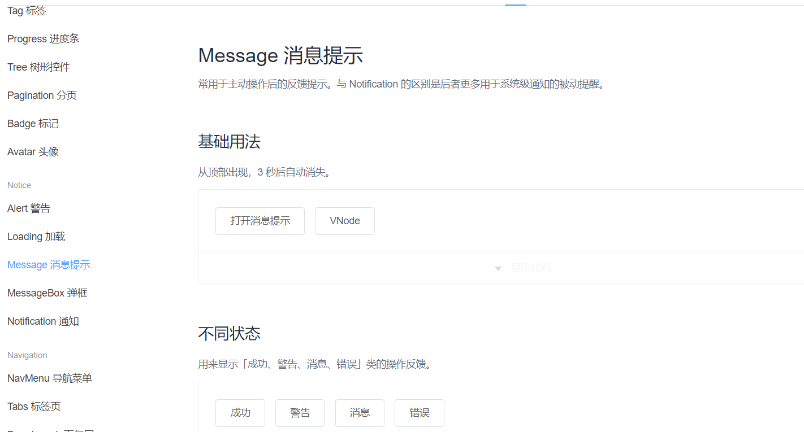

* 从`plugins`的`element.js`中导入这个message：`import {Message} from 'element-ui'`，然后把Message挂载到Vue上的属性：`Vue.prototype.$message = Message`
* message和button.form，input这些都不一样，它需要进行全局挂载
* 这个代表把弹框组件挂载到了Vue的原型对象上

# 登录组件登录成功后的行为

[编程式的导航](https://router.vuejs.org/zh/guide/essentials/navigation.html)

* 将登录成功之后的token，保存到客户端的 sessionstorage中

  * 项目中除了登录之外的其他API接口，必须在登录之后才能访问
  * token只应在当前网站打开期间生效，所以将 token 保存在sessionstorage中
  * 注意：sessionstorage是会话期间的存储机制，而localstorage是持久期间的存储机制
  * 所以将token保存在sessionstorage里面比较合适

* 通过编程式导航跳转到后台主页，路由地址是/home

  

  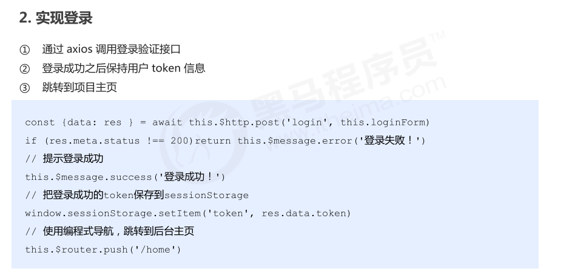

# 路由导航守卫控制访问权限

[vue-router.esm.js:1697 RangeError: Maximum call stack size exceeded](https://blog.csdn.net/fengjingyu168/article/details/75517415)

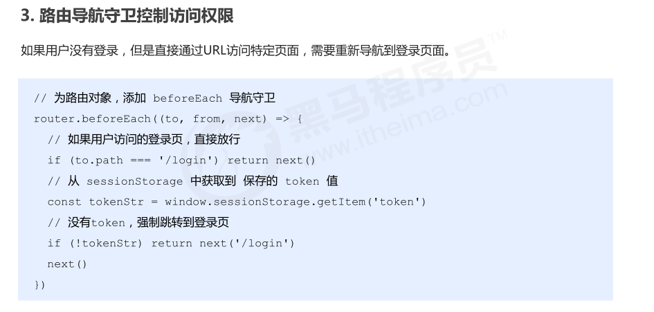

* `home.vue`属于有权限的页面，只有在登陆的情况下才能被访问。如果不设置权限，你就可以直接跳过登陆界面直接在浏览器输入框输入`http://localhost:8080/#/home`直接访问home页面，这样肯定是不安全的。

* 我们希望如果你没有登陆的话，我们希望你直接从home路径直接跳转到登陆页。

* 这个时候你就要用到路由导航守卫了。

* 内存溢出报错：`vue-router.esm.js?8c4f:2314 RangeError: Maximum call stack size exceeded`，

  我查了一下，应该是自己代码写的有点问题，出现了死循环，导致内存溢出了。

* 哈哈，问题确实是自己代码写的有问题导致的。

  

# 退出功能实现原理

* 为退出按钮绑定一个单击事件

# 处理语法警告问题

* eslint要求代码后面不要有分号，字符串要用单引号，我按照要求修改，保存代码后发现代码自动又给我加了分号，字符串又变成了双引号了。

* 可以在根目录下新建`.prettierrc.json`文件进行设置。

  ~~~json
  {
      "semi": false,
      //用于取消分号
      "singleQuote": true
      //用于字符串外面是单引号
  }
  ~~~

#  代码优化

# 主页布局开始

* 注意：每次做这个项目都要把`MySQL`和接口数据库打开才行。
* 因为没有注册`el-header`这些组件，所以会报错：`Unknown custom element: <el-container> - did you register the component correctly? For recursive components, make sure to provide the "name" option.`，只要在`element.js`里面进行导入，然后再使用`Vue.use`将它注册为全局组件即可。

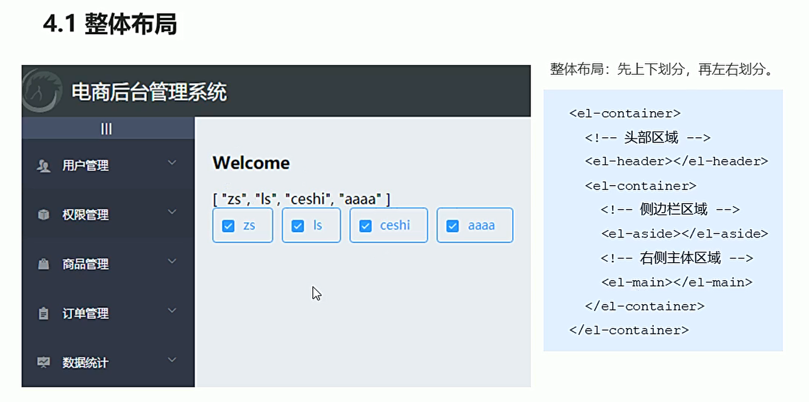

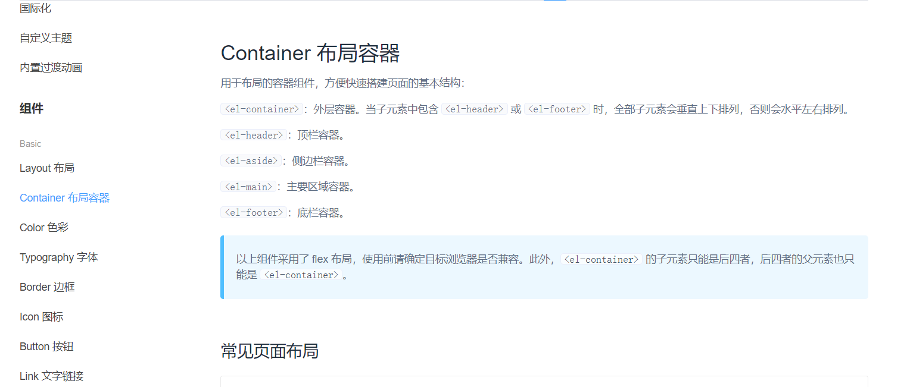

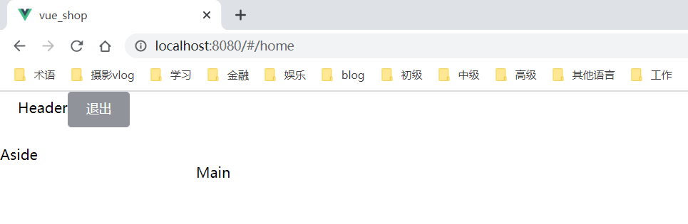

* 接下来我们需要对页面继续进行美化。

* 首先为Header添加一个背景色。

  

* 注意：每一个element-ui中提供的组件，它的组件名就是类名。 

* 我们需要让整个页面主体区域撑满整个屏幕。

  

* 我们给`el-container`添加全屏即可。

# 主页Header布局

* 左侧放了一个Logo，还有一个`电商后台管理系统`的文本，右侧放了一个退出按钮。最简单的我们用Flex布局即可。
* Logo图片左侧还有一个空白区域，属于`el-header`的内padding，如果我们不想看到这个空白，可以将它的`padding-left`设置为0。
* 右边的按钮是上下贴边的，我们想要让它居中，可以加`align-items:center`。
* 接下来我们再来美化一下文本：字体颜色，大小等。
* 我们还要让这个文本居中对齐，可以再给左侧div加上一个flex布局。——使用Less嵌套的写法。

# 左侧菜单布局

* `el-menu`属于包裹性质的容器。
* 再将使用到的组件在`element.js`中进行按需导入。
* 对我们来说，只需要有一级和二级菜单就可以了。
* 我们也不需要分组，把分组的元素都给删掉。

# 通过接口获取菜单数据

[axios拦截器](https://www.jianshu.com/p/a0c67f4e145e)

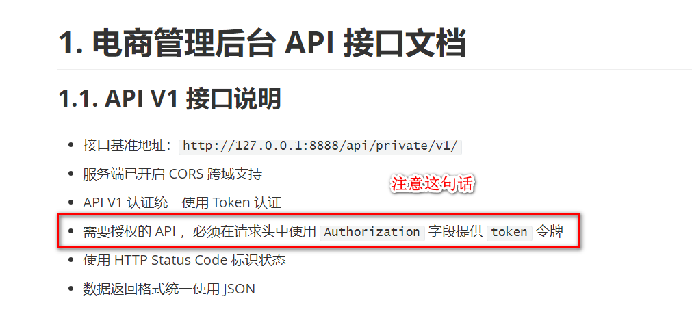

* 我们这个文档中有N个接口，除了登陆的接口之外，其他所有接口必须要授权才能够正常调用。

* token令牌就是权限认证的字段。

* 问题是如何在每个API的请求头中添加这么一个字段呢？——使用Axios拦截器即可。

  

  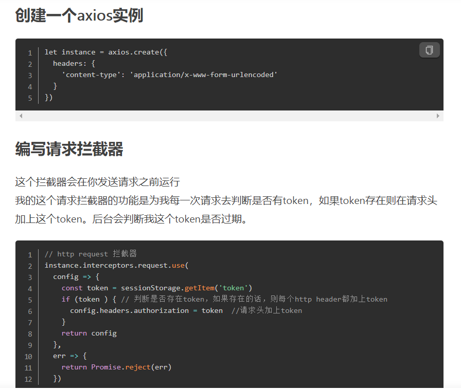

* `return config`就表示我们已经把这个请求头做了一次预处理了，那这样的话我们这个请求做过预处理之后才会被发送到服务器进行真正的处理了。

* 请求拦截器相当于是一个预处理的过程。

  

# 发起请求获取左侧菜单数据

> 看到这里，我发现自己对于获取数据这块操作是极其的不熟悉啊！自己的axios水平是非常薄弱的，这个需要以后进行专门的复习啊！！！

* 接下来我们先去请求一下左侧菜单。
* 在`home.vue`刚一加载的时候就应该立刻获取整个左侧菜单,所以我们在行为区域`export default`里面定义一个生命周期函数`created`。

# 左侧菜单UI绘制

* 我们获取到左侧菜单数据后就应该想办法渲染出界面来了。

* 在这个数据中，所有的一级菜单都放到了data数组中。

  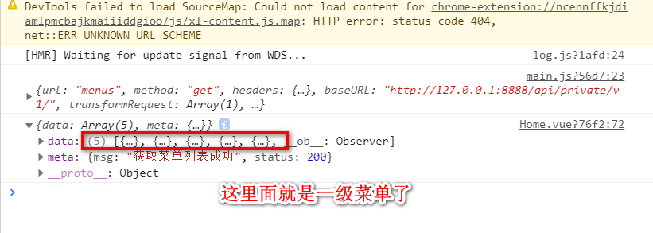

  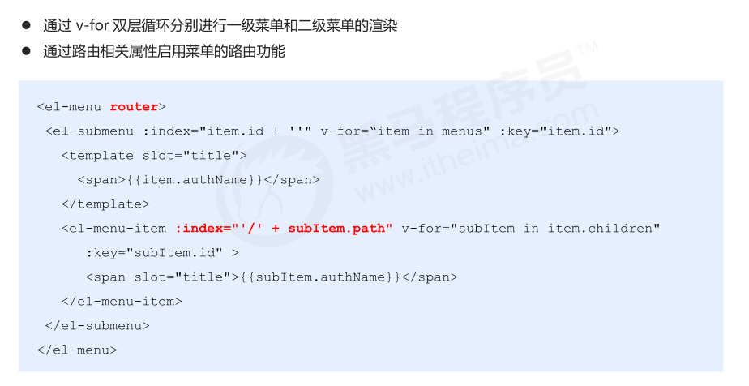

* 而每个一级菜单通过children属性嵌套了二级菜单。

* 所以我们只需要使用双层for循环就可以了，外层渲染一级菜单，内层渲染二级菜单。

* 在`el-submenu`身上加一个`v-for`指令。

* 每一个菜单都应该有一个独属于自己的index值，正好id不一样，所以给index动态绑定id即可。

* index如果相同的话，你点击一个，所有的菜单都会展开，关闭，所有的菜单也会关闭的。

* 报错：`Invalid prop: type check failed for prop "index". Expected String with value "103", got Number with value 103.`，原因是index只接受字符串，不接受数值，而index是数值。最简单的方式就是在后面拼接上一个空的字符串即可。

* 一级菜单渲染出来以后我们接下来开始渲染二级菜单。

* 我们只需要循环一级菜单的children属性即可。

# 左侧菜单格式美化

* 类` active-text-color`表明激活的文本的颜色。

* 当前所有的图标都是一样的，我们需要进行优化一下。

  

  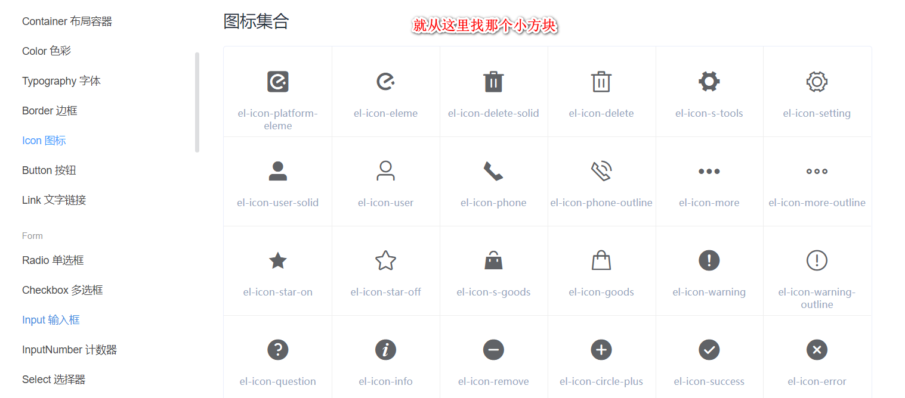

* 图标名字为`el-icon-menu`。

* 所有一级菜单图标都是不一样的，我们要通过自定义图标的方式来进行解决。`element ui`中提供的图标并不能解决我们的需求，它的个数有限。

* `fonts`文件夹下的`demo_fontclass.html`中有我们下载好的字体图标库。

  

* 这里的每个一级菜单都是通过for循环给它自动生成的，那我们怎样在它自动生成期间，给它修改不同的图标呢？解决方案如下：我们可以先定义一个字体对象，key是id,value是图标的类。

  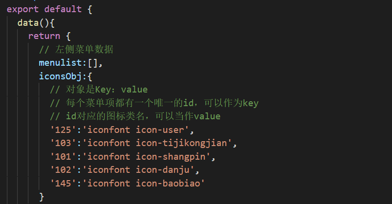

* 接着让图标和右边的字保持一些距离。

# 左侧菜单优化

* 我们希望左侧菜单只能一项展开，其他都关闭。

  

* 把`unique-opened`这个属性改成true即可，这个属性加给谁呢？它是属于Menu的。` :unique-opened="true"`一定要这样写，表明是属性绑定，如果不加冒号，则表明是字符串，这样是不行的。或者直接写`<el-menu unique-opened>`这样也行。

* 在边框线的位置若隐若现的有点没有对齐。

  

  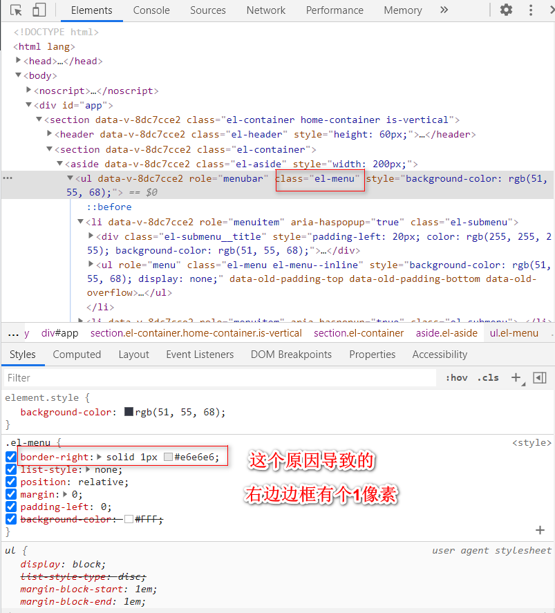

# 实现左侧菜单的折叠与展开功能

[CSS letter-spacing 属性](https://www.runoob.com/cssref/pr-text-letter-spacing.html)

* 首先我们应该在左侧菜单之上放一个折叠展开的按钮条。

* 我们翻到`Home.vue`中的菜单侧边栏区进行操作。

  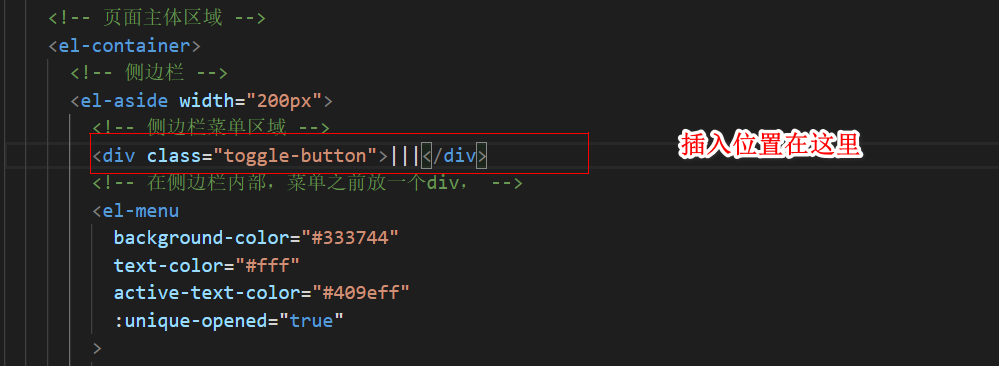

* 文本`|||`应该是白色并且居中。

* 我们希望鼠标放上去的时候变成一个小手。

* 我们希望点击它可以实现菜单的折叠和展开。

* 我们要为这个按钮条绑定一个单击事件

  

* 它有一个默认展开和折叠的动画，而这个动画效果非常的丑。为了让它更加流畅一些，可以把这个动画效果给它关闭掉。

  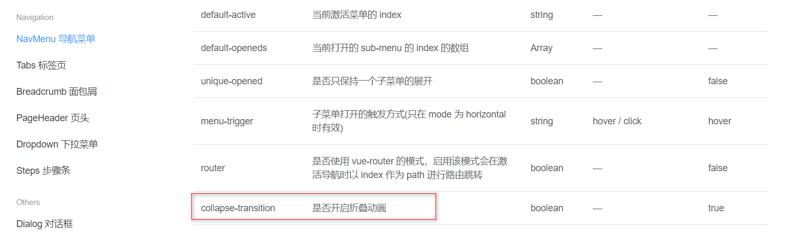

* 折叠以后侧边栏并没有跟着变小。原因是因为这个侧边栏宽度写死为200px了。

  

* 我们只要让它`isCollapse`为true的时候，让它把这个值变小。`isCollapse`为false时，再把宽度重置为200px就可以了。

* 折叠状态下它的宽度为64px。

  

# 实现首页的路由重定向

* 只要我们登陆成功就在Main这个位置展示一下欢迎页面
* 首先我们应该新建一个Welcome的组件，然后我们在Main这个位置放一个路由的占位符。
* 然后我们应该把Welcome路由设置为Home路由的子路由规则。
* 这样我们在Home页面中嵌套显示了Welcome的子组件。
* 我们新建`Welcome.vue`新组件，然后在`index.js`中导入这个新组件。

# 左侧菜单改造为路由链接

* 我们把二级菜单改为路由链接，但是怎么改呢？

* 难道我们要为每一个二级菜单都加一个`router-link`吗？这样也太麻烦了。

  

* 我们给`el-menu`加上一个`:router="true"`属性(或者直接写router也行)即可。

* 但是这个默认是使用id来作为路由名字的，不太好，我们希望使用path来作为跳转属性比较好。

  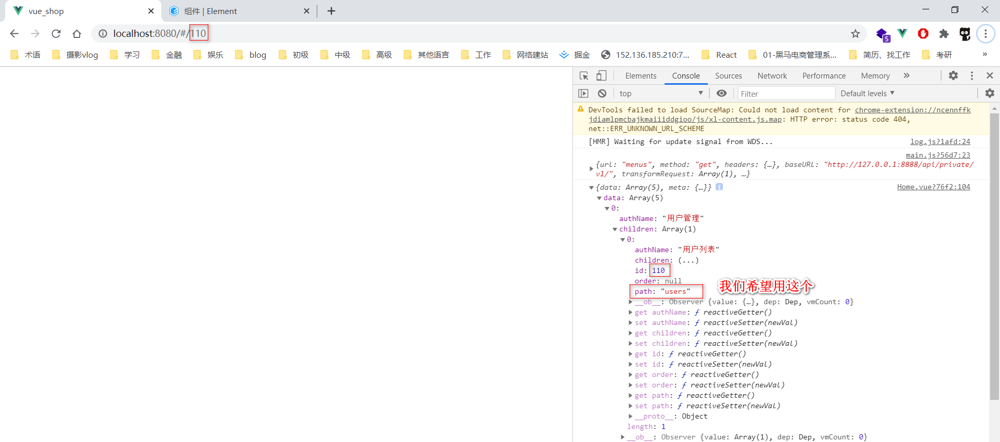

* 这个path前面没有加斜线`/`，但是我们知道每一个路由地址都必须以斜线开头。因为我们应该在设置的时候手动给它补上一个斜线。

  

# 用户列表开发

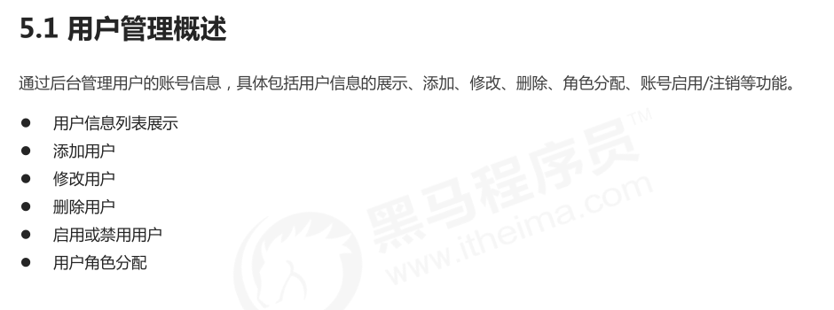

* 首先，我们应该创建用户列表链接对应的组件页面。
* 我们希望把用户列表组件嵌套着显示到Home组件中去，Home里面肯定包含了一个子路由叫做用户列表。

# 解决用户列表小问题

* 点击用户列表链接，此时它并没有显示高亮。

  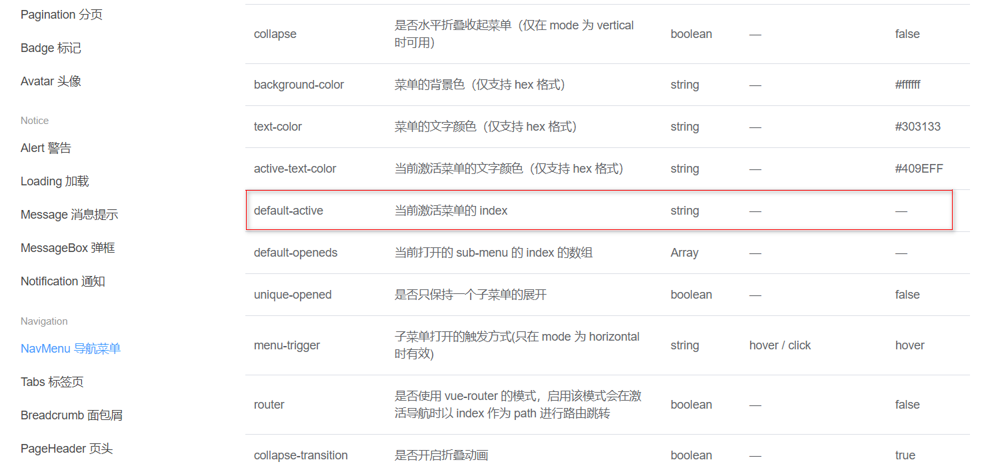

* 如果你想让菜单中的某一项被高亮，被激活，你就让这一项的`index`值赋值为整个menu菜单的这个属性。

* 在每次点击链接的时候，我们应该把对应的地址保存到`sessionStorage`中，这样我们就把激活的链接给它保存起来了。接下来等我们刷新页面的时候，可以从`sessionStorage`中把这个值再取出来，然后动态的赋值给`el-menu`的`default-active`属性即可。

* 我们给二级菜单绑定一个单击事件。

* 整个Home组件一被创建我们就从`sessionStorage`中把那个值给取出来。

* 这个组件被创建的时候，肯定会执行created生命周期函数。

* 在点击不同链接的时候，我们应该也要为`activePath`重新赋一下值。

# 绘制用户列表的基本UI结构

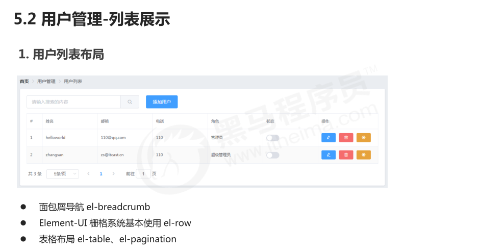

* 头部是一个面包屑导航区域

  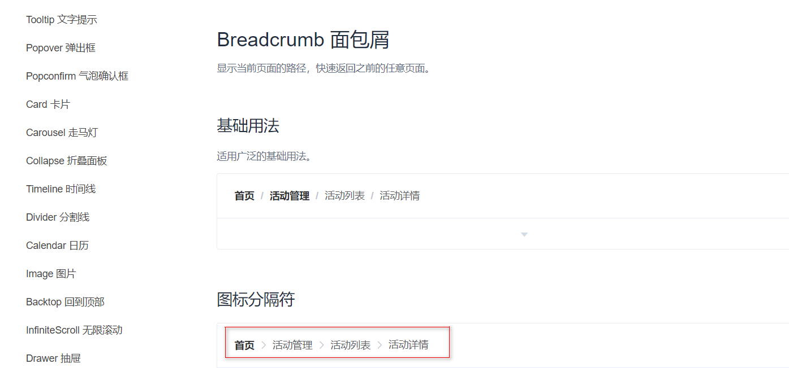

* 中间是卡片视图区域

  

* 但是样式有些问题，面包屑和卡片之间的距离太近了。

* 我们在`assets`中的`global.css`里面写，对原始的element框架里面的样式进行重置。

* 接下来我们绘制卡片里面的搜索区域和添加用户按钮。

  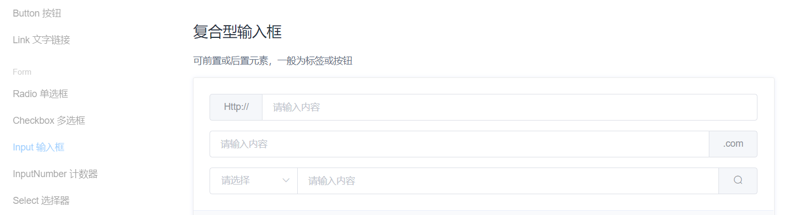

* 但是这个搜索框占满了整个屏幕，我们可以使用`element ui`中的栅格系统(layout)进行绘制。

  

# 获取用户列表数据

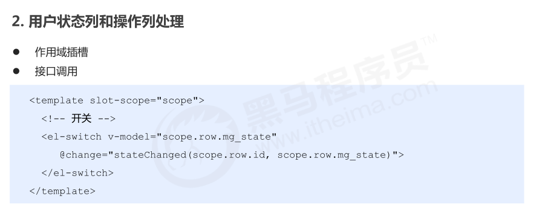

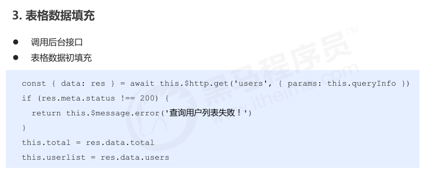

# 渲染用户列表数据

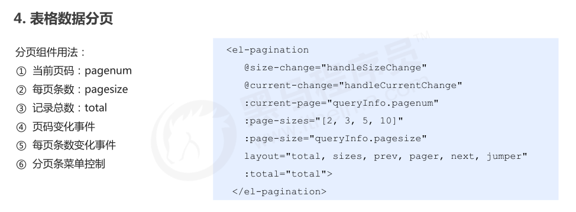

* 其中状态视图中对应的是一个开关，而响应数据这里是一个布尔值`mg_state`，这里会涉及到数据解构的改造。
* 操作并不对应数据源中的任何一个字段，所以不用写prop属性的。
* 数据获取完毕后接下来就是要对表格添加边框线了。——给table加一个border属性即可。
* 我们希望表格有一个隔行变色的效果。——给table加一个stripe属性即可。

# 为用户列表添加索引列

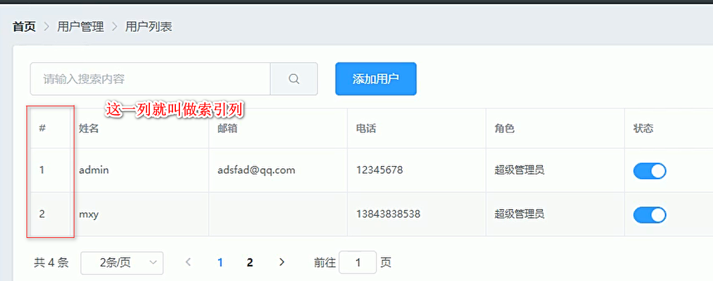

* `        <el-table-column type="index"></el-table-column>`即可。

# 改造状态列的显示效果

[Vue slot-scope的理解（适合初学者）](https://blog.csdn.net/huangyilinnuli/article/details/81239077)

* `mg_state`是一个布尔值，我们的布尔值是没有办法在页面上直接渲染出来的。

* 我们希望把这个布尔值渲染为一个开关效果。

* 我们这里要使用作用域插槽了。

* 状态这一列，它是单元格，它肯定属于这一行，只要我们拿到这一行的数据，那么就可以`.`出来状态具体的值。此时我们就可以按需渲染状态的效果了。 

  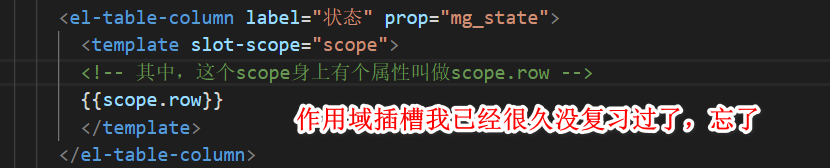

  

  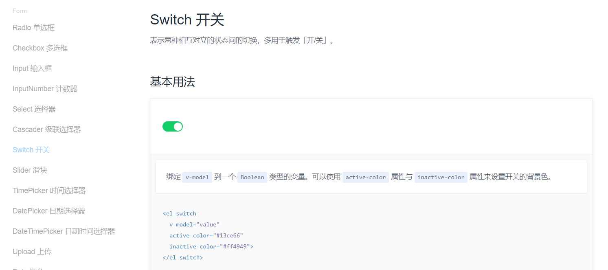

* 如果你同时给`el-table-column`指定了prop和作用域插槽，那么作用域插槽会覆盖掉prop，所以我们把状态栏的prop可以删掉。

# 插槽形式自定义操作列的渲染

[slot插槽+作用域插槽](https://zhuanlan.zhihu.com/p/51107654)

* 操作页必须要拿到对应的id才能进行操作。

  

* 希望鼠标放到最后一个按钮的时候会显示一个提示

  

* 作用域插槽不熟，又回去看了一遍。

# 实现数据分页效果

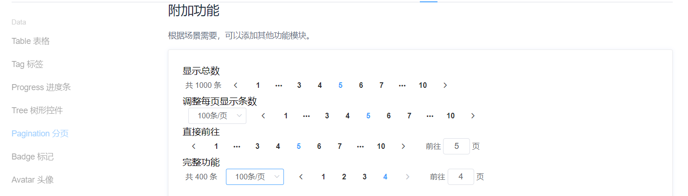

# 实现用户状态的修改

* 我们只是在前台把状态按钮进行了打开，但是这个打开状态并没有同步到数据库中进行保存。所以你下次刷新页面的话又变成了一个关闭的状态。

* 首先我们需要监听到switch状态开关的改变从而拿到最新的状态。

* 其次要调用对应的API接口，把这一次最新的状态保存到数据库中。

  

  

  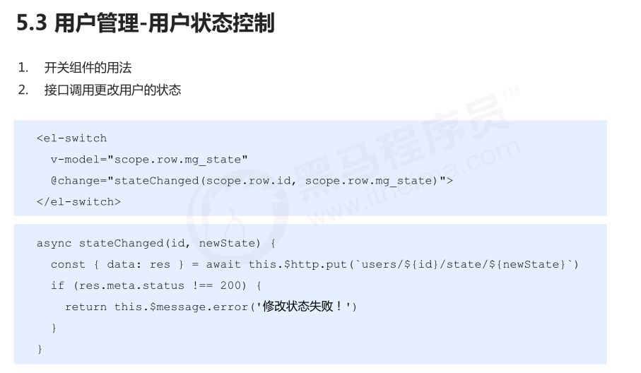

* 一般发生修改基本上就调用put请求。

# 实现搜索的功能

* 首先我们应该将文本框和data中的数据做双向绑定。

* 绑定完毕之后，我们在点击按钮的时候可以调用获取用户列表的函数进行数据查询。

* 我们还要为搜索按钮绑定一个单击事件。

  

  

  

# 实现添加用户的功能

* 首先我们要实现点击按钮弹出一个对话框。

  

  

* 为添加按钮绑定单击事件，将`addDialogVisible`重置为true即可。

# 添加用户的对话框中渲染一个添加用户的表单

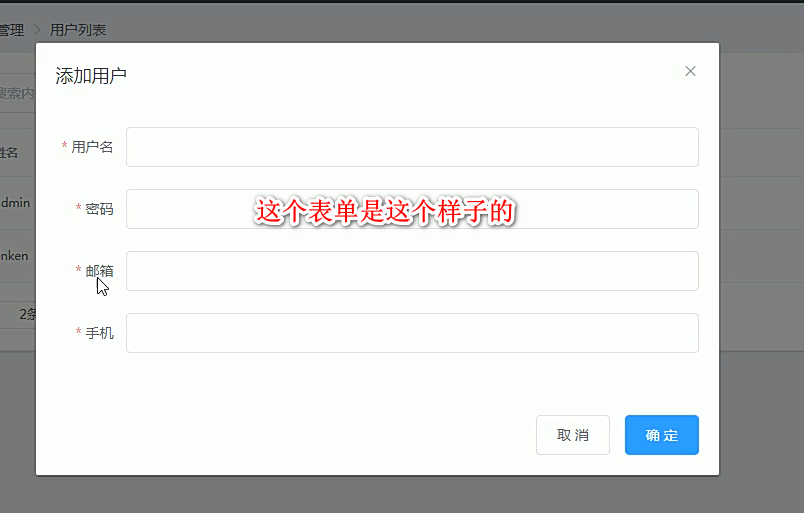

* 这4项都要包含表单验证效果。

  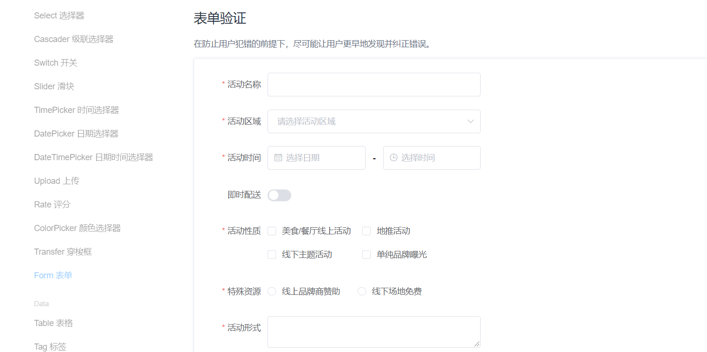

# 实现自定义规则

* 我们需要自定义校验规则来实现邮箱和手机号的校验。

  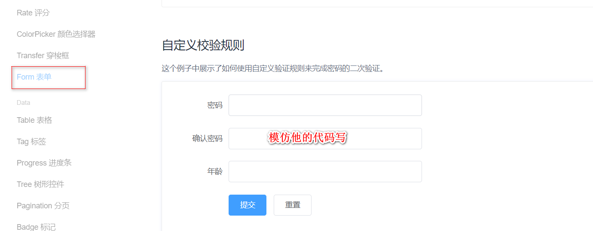

  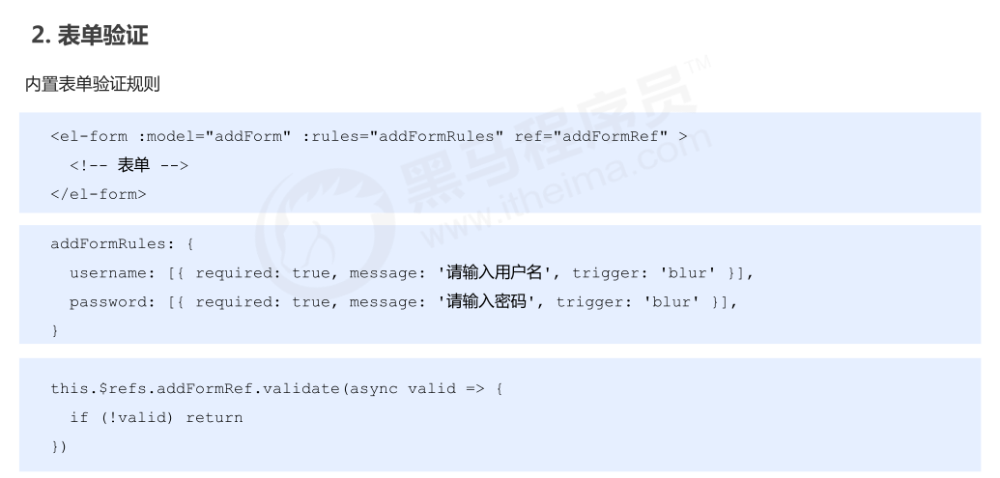

  

# 实现添加用户表单的重置功能

* 我们需要在整个对话框关闭之后进行重置表单。
* 要使用`resetFields()`方法。

# 添加用户的预验证功能

* 我们在点击按钮的时候，不应该直接关闭对话框，而是在点击按钮的时候调用一个函数，在函数中对整个表单进行一下预验证。

# 发起请求添加一个新用户

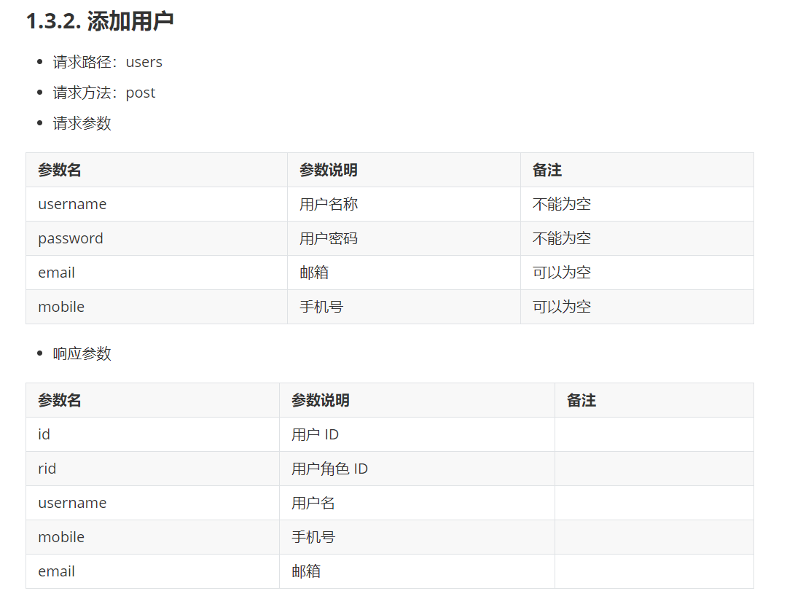

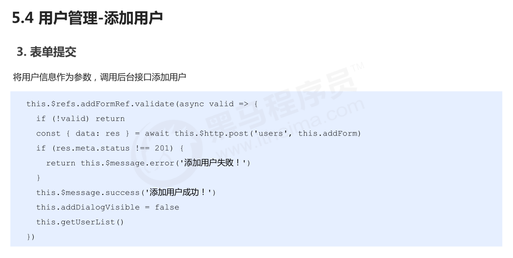

#  添加用户修改的操作

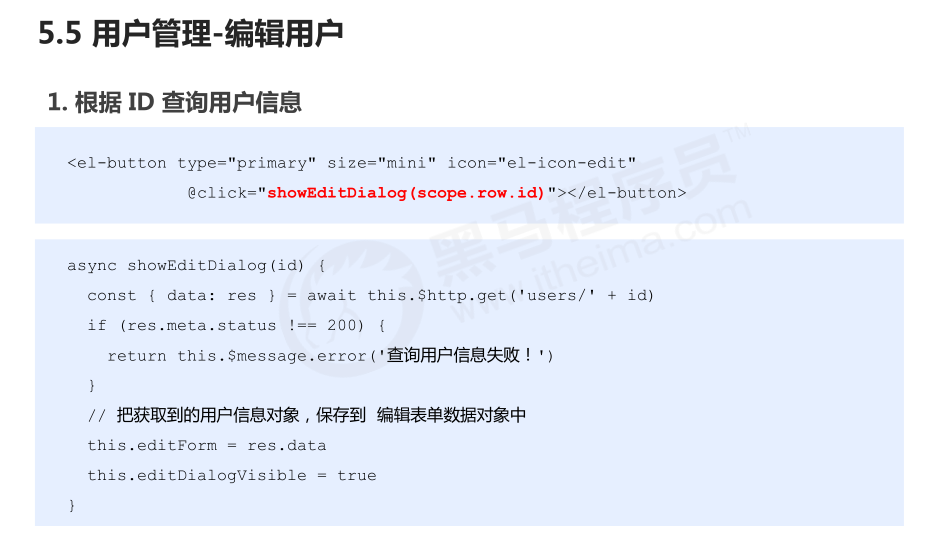

* 用户名是只读的，我们只允许用户修改邮箱和手机号。

# 根据ID查询用户信息

* 我们需要在点击修改按钮的同时根据用户的id来查询到用户对应的旧数据。

* 并且给它保存起来供我们在表单中进行填充。

* 首先我们要拿到用户的id。

* id拿到了紧接着就要调用用户的接口，获取用户的信息。

  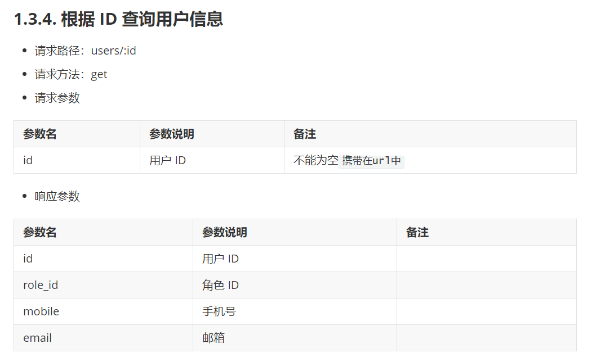

* 我们需要在data中定义一个私有对象，专门用来保存用户信息。

# 绘制修改用户的表单

* 感觉老师写了一些重复代码，但是我现在又不敢改，现在第一遍就对着视频敲吧，等自己以后有时间了再进行代码的优化啊。

# 实现修改表单的关闭之后的重置操作

# 提交修改之前表单预验证操作

* 给确定按钮绑定一个预验证处理函数

# 修改用户信息的操作

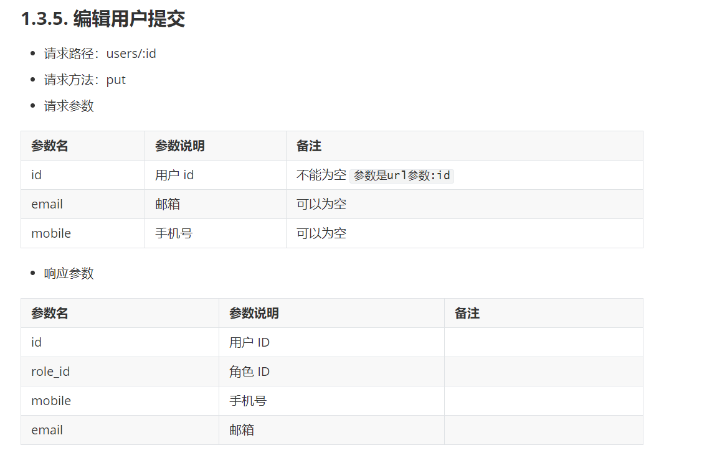

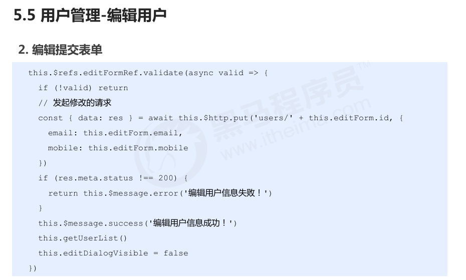

* 点击确定按钮后要做3件事：
  * 关闭对话框
  * 刷新数据列表
  * 提示修改成功

# 实现删除用户的操作

* 点击删除按钮后不能直接删，可能是用户误操作，需要有提示信息。

  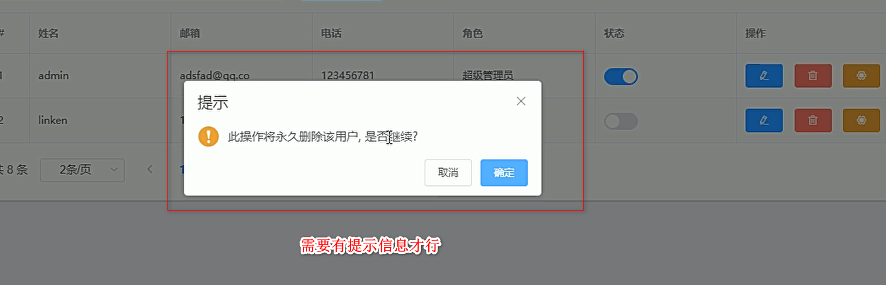

  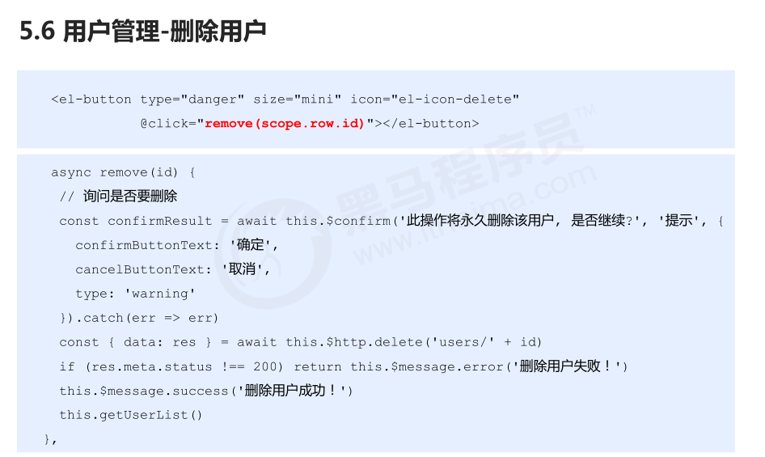

* 用户点击取消的话，我们就不删除。

* 用户点击确定，我们才真正的删除数据。

* 如何在点击删除按钮的同时，弹出提示信息框呢？ 

  

* `$confirm`函数需要先进行挂载才能够使用。

  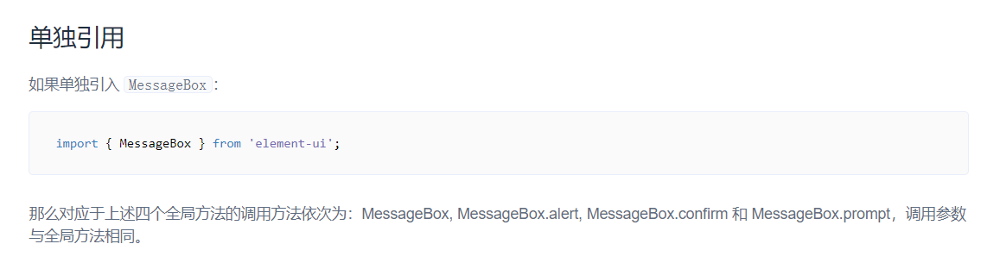

  # 完成删除用户的操作

  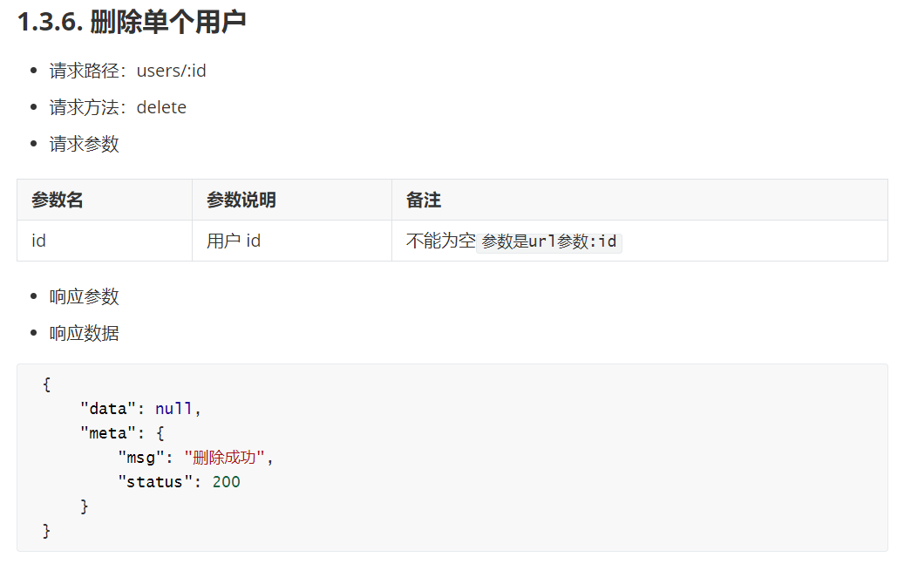

* 接下来要发起请求开始删除用户的信息了。

# 权限管理开发开始

* 首先我们开发全选列表对应的功能模块
* 因为这个是一个新的功能模块，所以在代码上我们应该创建一个新分支进行开发。
* 前面2个`项目初始化`和`用户列表`我都没有创建新分支，直接就在master上进行开发了，失误了。
* 现在我们所有功能都可以基于rights子分支进行开发。
* `git checkout -b rights`。
* `git branch`查看是否在rights分支。
* `git push -u origin rights`将本地分支推送到GitHub上。

# 开发权限列表对应规则

* 我们需要先创建对应的组件，再定义对应的路由规则。
*  `components`文件夹下新建`power`文件夹，在里面新建`Rights.vue`组件。
* 在`index.js`中导入这个组件。

# 权限列表的基本页面布局

* 首先在头部区域有一个面包屑导航

* 下面有一个卡片视图

* 卡片视图之中放了一个table数据表格

  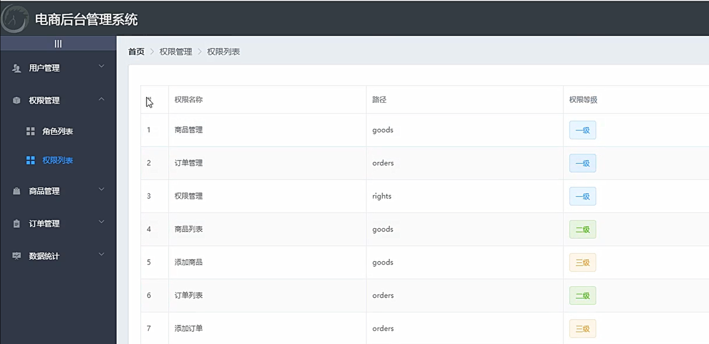

  

* 我们首先不画这个table，先把面包屑导航和卡片视图做出来。

* 接下来的事情就是获取对应的权限列表数据，然后通过表格的形式给它渲染出来即可。

# 请求权限列表的数据

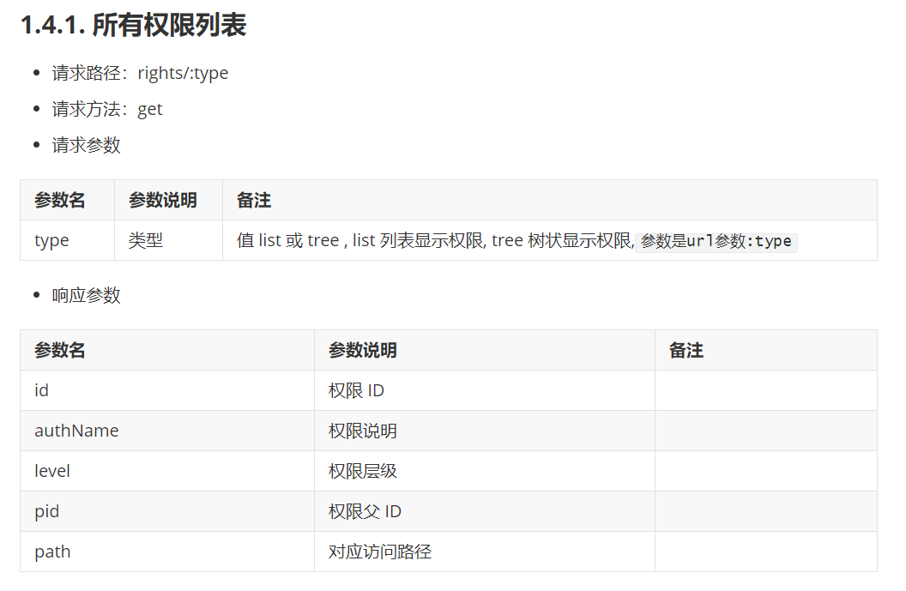

* `Rights.vue`中先定义一个data数据。
* 什么时候发起请求呢？在生命周期函数`created`时发起。
* type的类型我们选择list,而不选择tree。

# 权限列表数据渲染为table表格

* table要指定数据源，通过`:data`绑定数据源。

* `<el-table-column type="index">`创建索引列。

  

* 数据渲染出来后我们就要对表格进行美化了。

* 首先我们要为所有表格添加竖向的边框线。——添加border属性即可。

* 再添加stripe让列表实现隔行变色。

* 最后我们要美化权限等级的标签。

  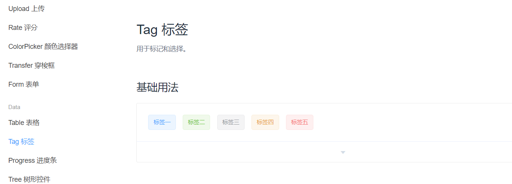

* 我们这里要使用作用域插槽。

* 如果权限等级为0，则展示一级，1，则展示二级，2，则展示三级。

# 权限管理业务分析

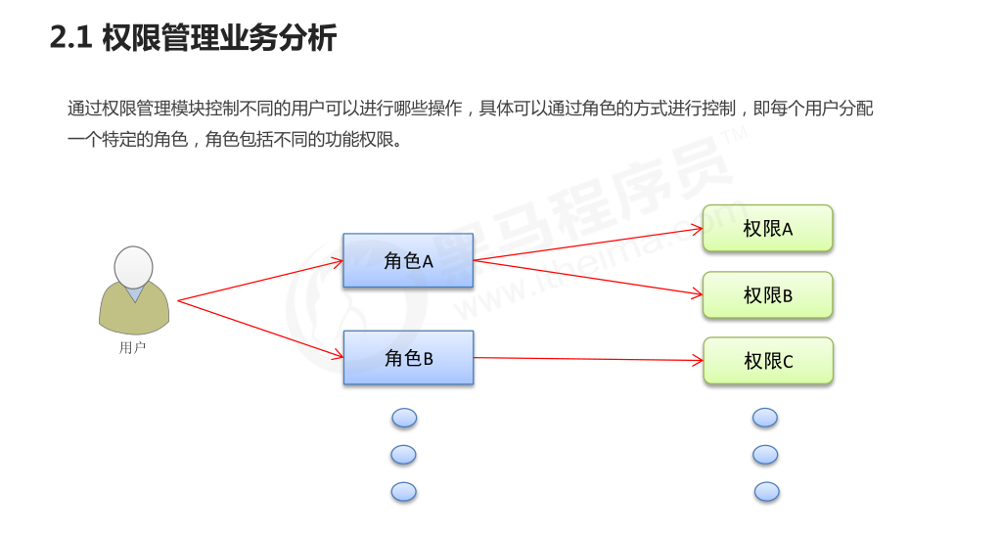

# 权限管理角色

* 新建一个`Roles.vue`组件。

# 角色列表的基础布局

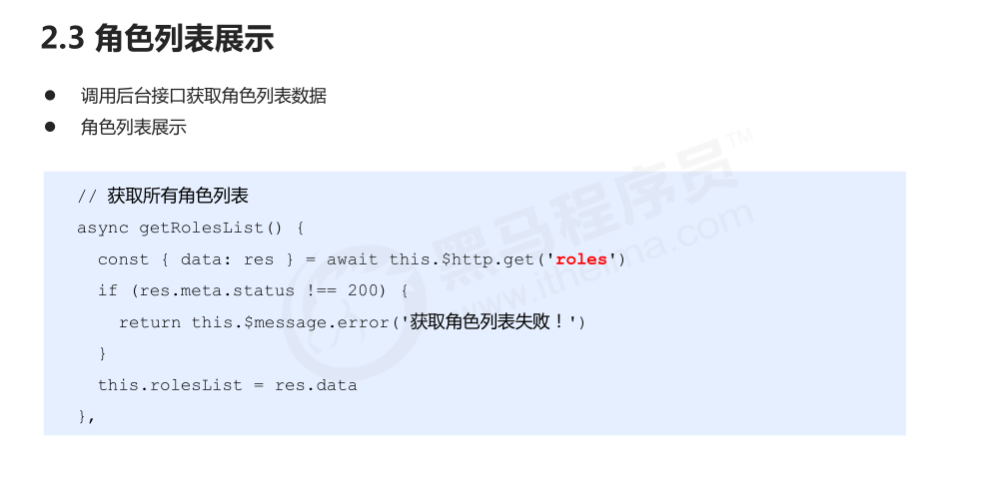

* 头部区域还是一个面包屑导航。

* 下边还是一个卡片视图。

* 在卡片视图中，头部是一个添加角色的按钮。

  

# 渲染角色列表中的table数据

* 这个table一共有5列。

  

* 其中头部第一列是展开列，可以把它展开之后查看对应角色下所有的权限。

  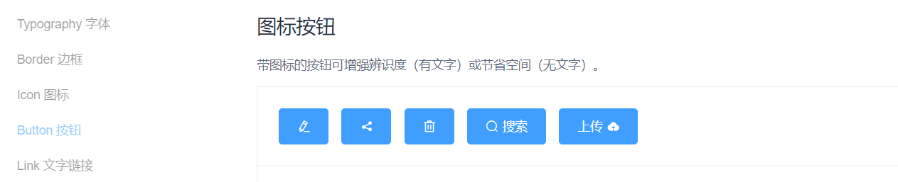

# 自己做

* 角色信息的添加，删除，编辑这些和用户管理的添加，删除，编辑一样，为了节省课堂时间，老师就不做了，我以后再做吧。
* 这些代码都是完全一样的，只不过调用的API接口不太一样。
* 所以这些带有重复性质的功能留给大家课下自己去完成。

# 角色下权限数据的渲染

* 我们首先应该在展开行中拿到当前角色的所有权限。

* 我们在请求数据的时候，服务器请求回来的数据中已经包含了每个角色的所有权限。

  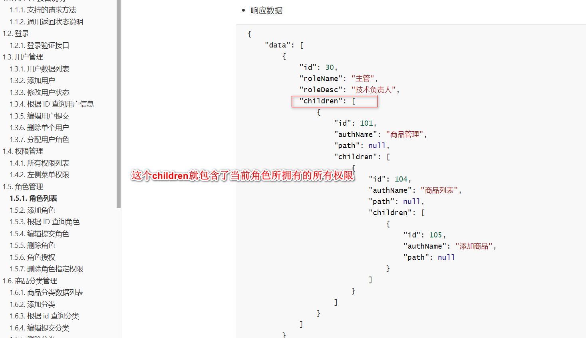

* 我们通过作用域插槽来拿数据是最方便的。

* 我们可以循环children的每一个对象，可以渲染出它的一级权限。

* 在每个一级权限中，又通过children嵌套了二级权限。

* 而每个二级权限，又通过children嵌套了三级权限。

* 所以我们需要进行三层for循环的嵌套。

  

# 页面一级权限的渲染

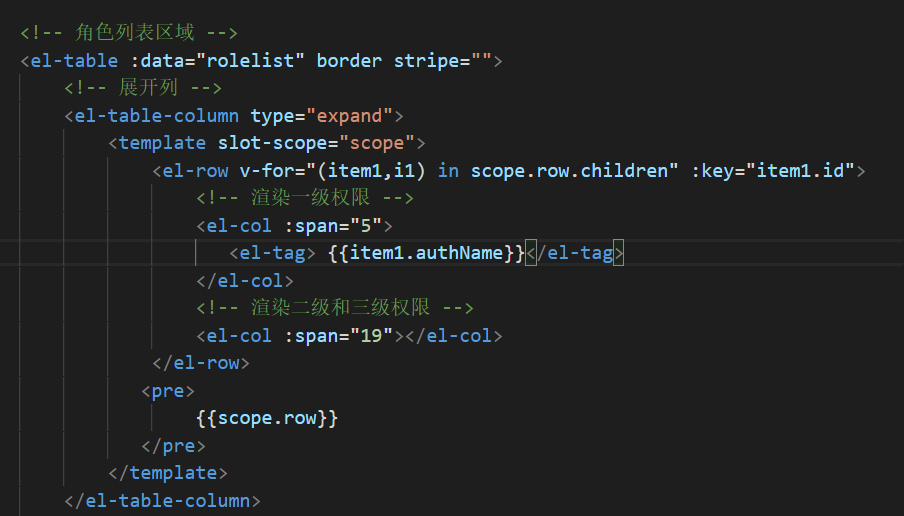

# 一级权限的美化

* 让它们每一项之间有一个边框线来进行间隔。
* 因为一级权限是在`el-row`里面的，所以我们给`el-row`添加一条底边框线即可。

# 渲染二级权限

* 每个二级权限也应该是`el-row`。

# 渲染三级权限

* 和渲染二级权限一样。

# 进一步美化权限数据的UI结构

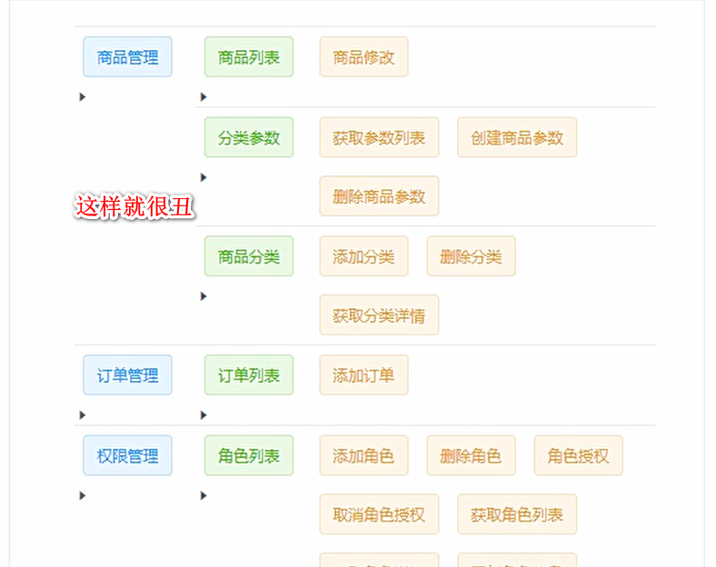

* 我们给整个页面加一个最小宽度，就不会导致挤在一起了。
* 在`global.css`里面写即可。
* 商品管理在纵向上应该有一个居中的效果。我们只要选中对应的`el-row`这一行，给它加上`display:flex `和`align-items:center`即可。

# 删除角色下指定权限的需求

* 首先，我们应该为每一个标签都提供一个关闭的小图标。
* 然后我们在点击这个小图标的时候可以弹出一个确认删除的提示框。

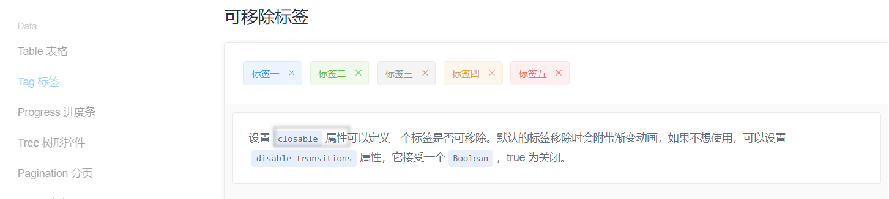

 

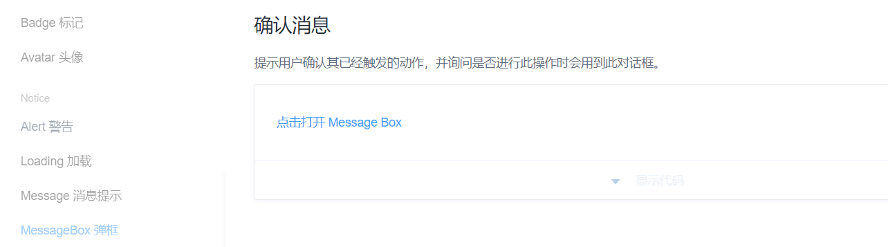

# 继续删除的业务逻辑

* 当我点击删除确定之后，这个页面它就合上了。我们还需要重新把它打开，很麻烦。
* 因为删除完毕后，它会获取整个数据列表，我们页面上整个table表格会被重新渲染一次，所以打开的状态就被立即给取消了。

# 分配权限的功能

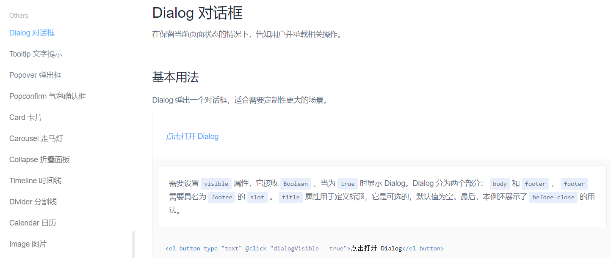

* 我们应该在弹出对话框的同时将所有权限以一个树形结构获取回来。

  

# 将所有权限以树形结构加载到对话框中

* 这里会用到一个新的控件：tree树形控件

  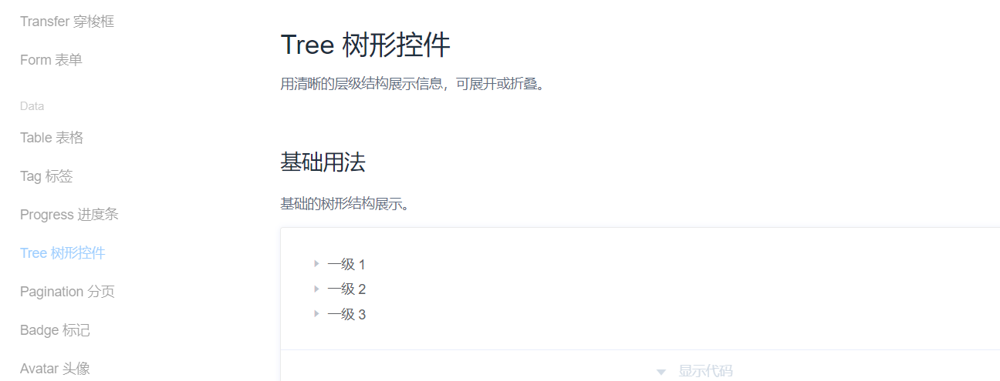

* 我是通过哪个属性来实现父子间的嵌套的。使用`prop`来进行指定。

# 优化树形控件

* 要在前面提供一个复选框供我们进行勾选

  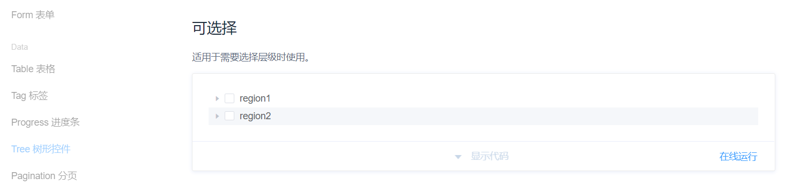

* 添加一个`show-checkbox`属性即可。

  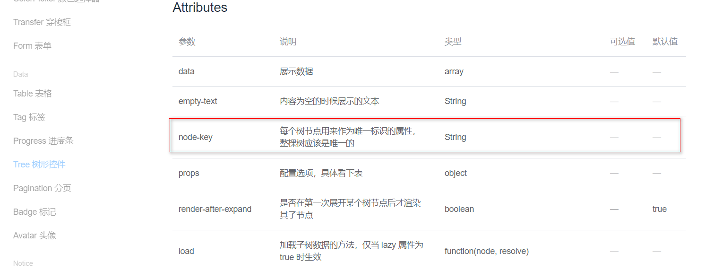

* 只要你勾选了这个节点，你勾选的就是对应这个属性的id值。

* 默认节点都是折叠起来的，希望一打开这个对话框，就应该把所有节点都给我展开。

  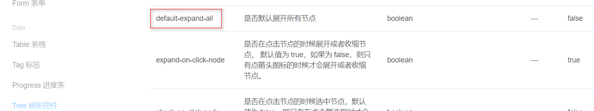

# 优化分配权限

* 主管身上已有的权限并没有给它勾选，我们需要默认给它勾选上。

  

* 注意：我们只获取三级权限的id。

* 把所有的id都添加到defKeys这个数组中。

# 实现已有权限的默认勾选功能

*  我们需要定义一个递归函数，把角色信息传入到递归函数中。
* 我们还缺少一个递归函数来获取三级节点的id。
* 我们在点击分配权限按钮的时候，除了要弹出对话框，还要在弹出对话框之前把三级节点id都获取出来。

# 小Bug

* 每次点击分配权限按钮的时候，都会把已有的权限保存到defKeys数组中。
* 但是我们在关闭对话框的时候并没有清空那个数组。
* 这样会导致长此以往，我们数组中的id会越来越多。
* 为了防止这个Bug，我们应该在每次对话框关闭期间，都清空一下当前数组中的元素项。

# 勾选权限向服务器发起请求

* 当我们勾选权限时，应该向服务器发起一次请求，将勾选的状态都保存到服务器中进行数据的持久化。
* 当我们点击确定按钮的时候，需要调用哪个处理函数呢？

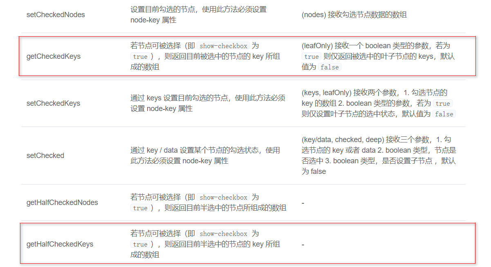

* 接下来我们为确定按钮绑定一个单击事件处理函数

# 完善用户列表分配角色的功能

* 首先，要为分配角色按钮绑定一个单击事件。

* 然后在单击事件的处理函数中展示一个分配角色的对话框。

  

* 我们直接在点击分配角色按钮的时候，直接将`scope.role`给传过去就可以了。

* 我们在点击按钮的同时把所有角色的数据列表给获取出来。

  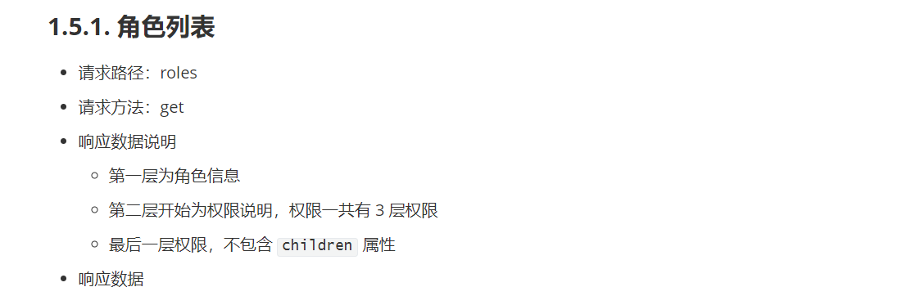

# 获取到的角色列表渲染为下拉菜单

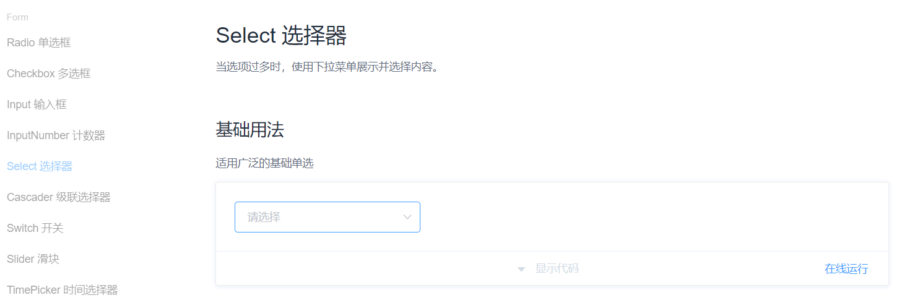

* 接下来是点击确定把分配的新角色保存到数据库中。

# 分配角色的功能

* 给确定按钮绑定一个事件处理函数

  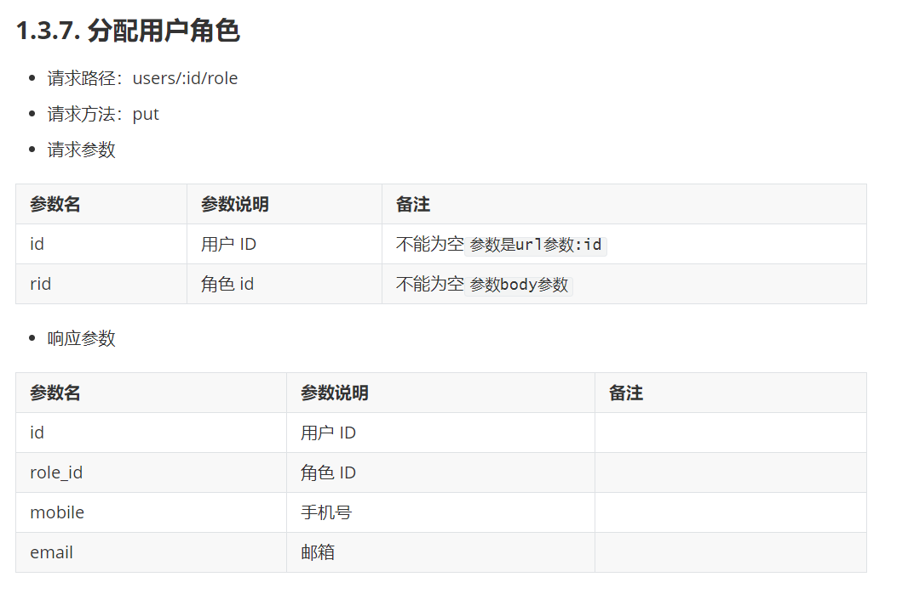

# 分类管理开始

* 左侧是一级分类，右侧是二级和三级分类。

  

* 在我们这个系统中，最多只允许有3级分类。

* 同时，我们的系统还允许添加新的分类，也允许编辑和删除对应的分类。

* 我们分类的底部还有分页展示的效果。

# 创建分类管理git分支

* `git checkout -b goods_cate`
* `git push -u origin goods_cate`

# 商品分类路由组件的加载

* `components`文件夹下新建`goods`文件夹，在里面新建`Cate.vue`组件。
* 在`router.js`中进行导入。

# 绘制商品分类页面的基本结构

* 首先头部区域放一个面包屑导航。
* 我的感想是做项目做着做着反正就是不停的重复，很多东西都大同小异的，代码敲多了到时候自然也就懂了。
* 不要害怕有多难，其实它也就这样啊。
* 面包屑导航下面有一个卡片视图。
* 卡片视图中有一个添加分类的按钮(这个要单独放一行)，下面是table表格和分页条。

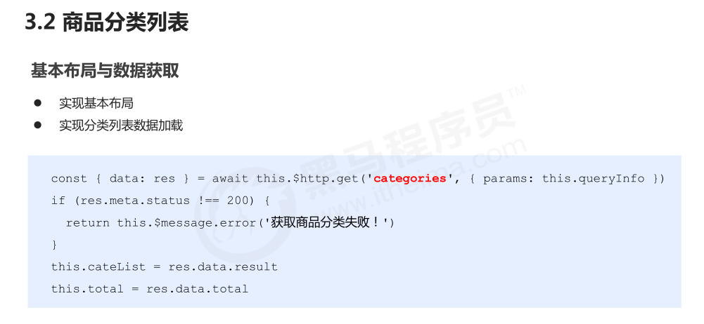

# 获取商品分类的数据列表

* 在我们的项目中，每一页只显示5条数据。

# 商品分类数据渲染为树形表格

* `element ui`中并没有提供树形的table表格，所以这里我们需要使用第三方的插件。

  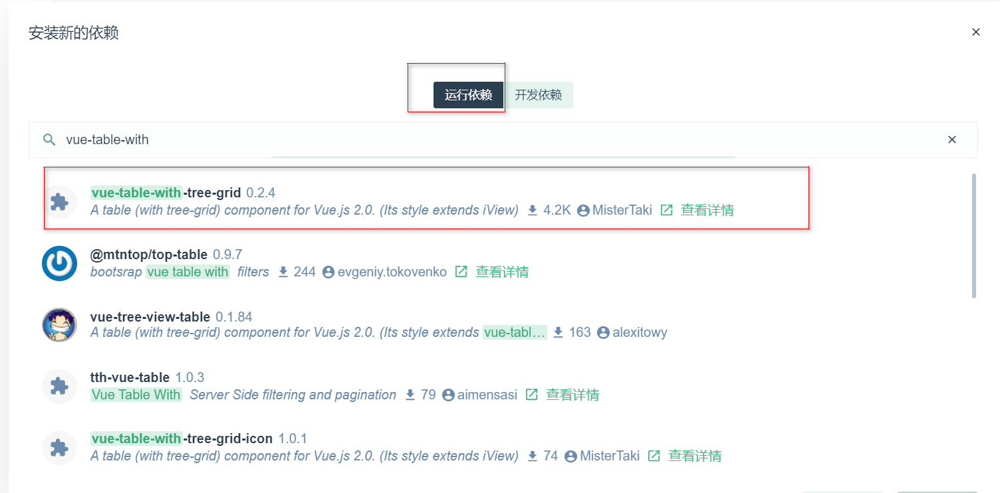

  

  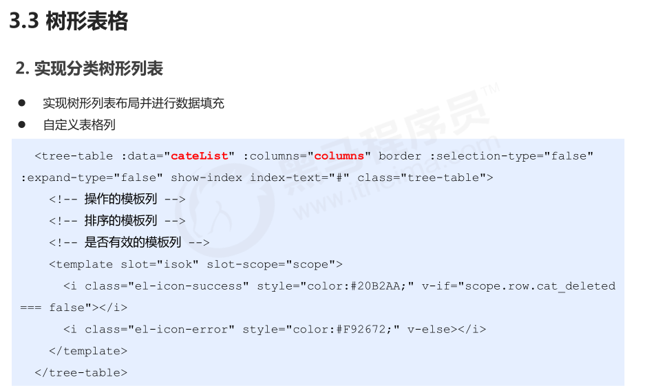

* 我这里显示了一个错误：`module "d:/02-looking for job/00-Project/03-background management/vue_shop/node_modules/vue-table-with-tree-grid/lib/vue-table-with-tree-grid"`

  `Could not find a declaration file for module 'vue-table-with-tree-grid'. 'd:/02-looking for job/00-Project/03-background management/vue_shop/node_modules/vue-table-with-tree-grid/lib/vue-table-with-tree-grid.js' implicitly has an 'any' type.\`

* 哈哈，这个其实是没问题的，我数据之所以显示不出来是因为我单词写错了......

# 通过自定义模版列的方式渲染是否有效

* 是否有效对应数据`cat_delete`
* 我们要用到作用域插槽来进行自定义渲染。

# 通过自定义模版列的方式渲染排序和操作

* 和前面一样的步骤，也是要用到作用域插槽。

  

# 商品分类的分页效果

* 首先我们要在页面中渲染出分页的页码条。

  

  

  

# 添加分页的操作

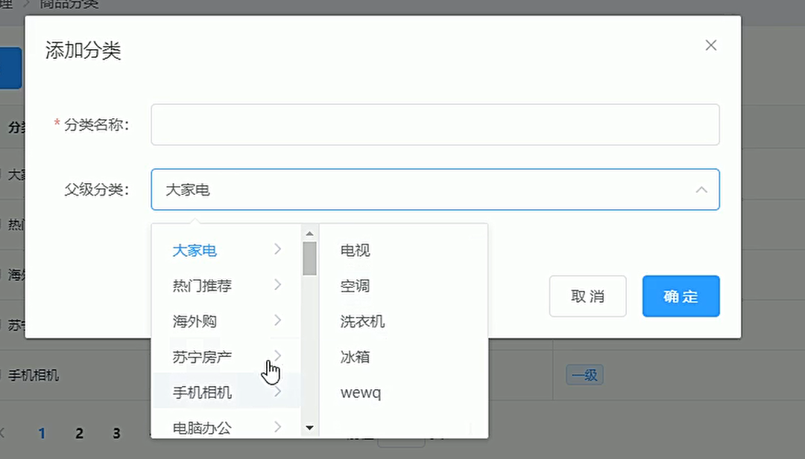

* 父级分类会用到一个组件叫做**级联选择框**。

*  首先要添加一个分类的对话框

  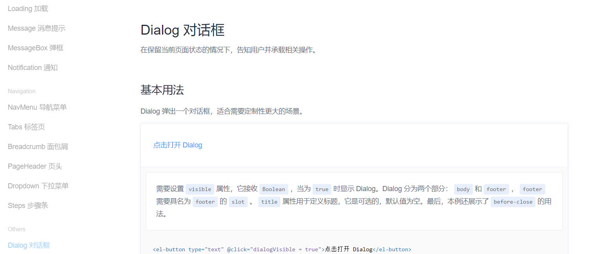

  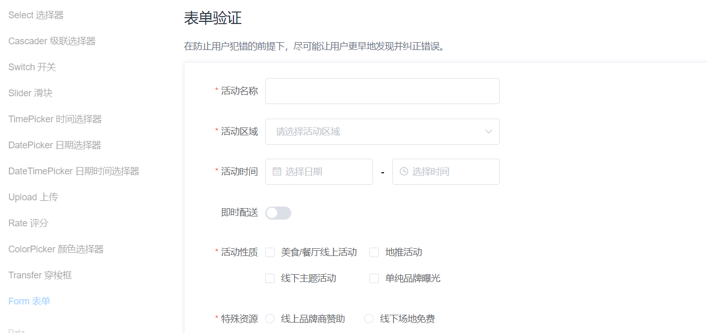

  

* 父级分类身上并没有验证规则，因为父级分类可以不填。

  

* 因为父级分类不需要验证规则，所以不需要prop。

# 父级分类

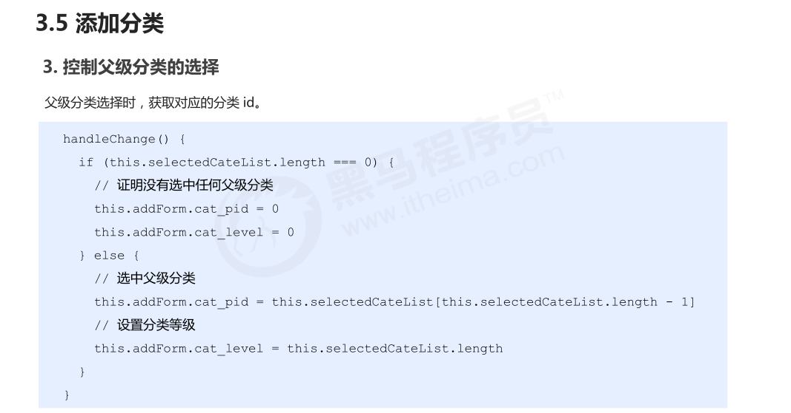

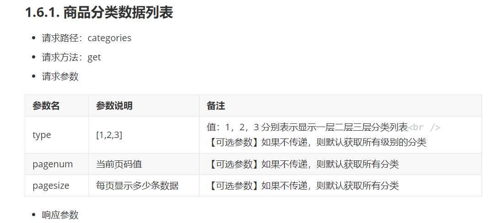

# 级联选择器

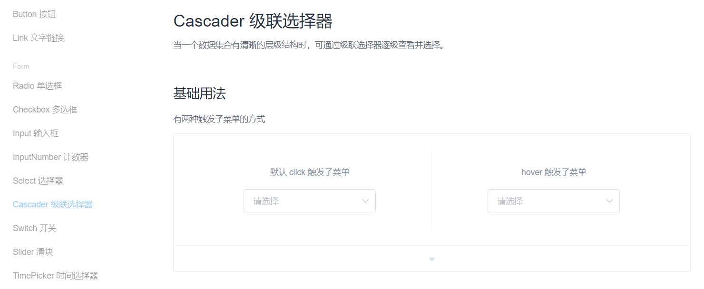

* 注册一下`cascader`选择器。

* 父子节点的嵌套都要预先通过props进行嵌套。

  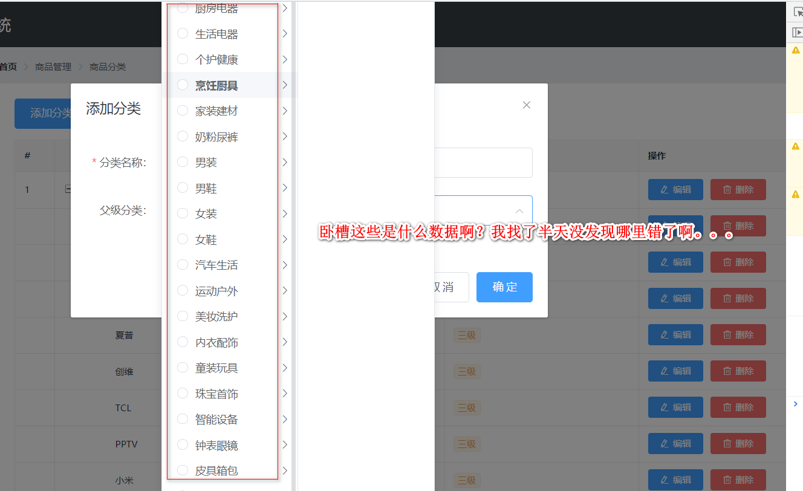

* 为什么没有大家电啊？？？是服务器请求数据有问题吗？？

* 我知道了，应该是我的代码没有什么错误，是别人删除的吧。

* 我又把老师自己的代码复制过来运行，发现和我的数据是一样的，说明我没有错。害我昨天找了半天错，还没找到，导致心态爆炸。

  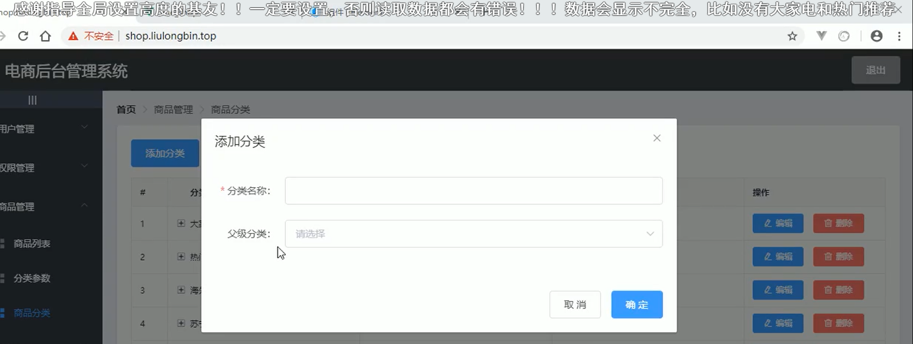

  

  

  

# 监听添加分类对话框的关闭

* 只要对话框关闭了，我们就应该立即将表单的数据进行清空。
* 只清空分类名称还不行，父级分类还没有被清空。
* 我们应该将表单里面的`cat_level`和`cat_pid`也都清空掉。

# 完成具体的添加操作

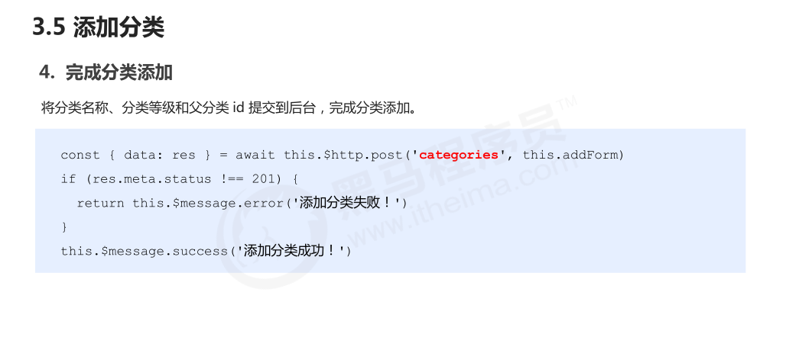

* 在点击这个确定按钮的时候，要针对这个表单进行预验证。
* 当预验证通过之后，就应该调用接口，发起请求，从而添加新的分类。

# git操作将goods_cate上传到Github并合并

# 分类参数开始

* 首先创建一个新分支`goods_params`
* 这里master分支下面的代码也是最新的(合并过了)，我们要基于master分支创建一个新的分支。
* `git checkout -b goods_params`
* ` git push -u origin goods_params`

# 参数管理概述

* 在选择商品分类的时候，我们只允许你选择三级分类。
* 我们这个系统中只允许给三级分类设置动态参数或者静态属性。

# 商品参数页面创建

* 在goods文件夹下新建一个`Params.vue`文件。

# 分类参数的基本结构

* 头部是一个面包屑导航
* 下面是一个卡片视图
* 都是一样的布局！！！！！！！！！
* 在卡片视图里面页面分成了三部分
* 头部是一个提示的注意项
* 中间是选择商品分类的级联选择框
* 下面是tab页签

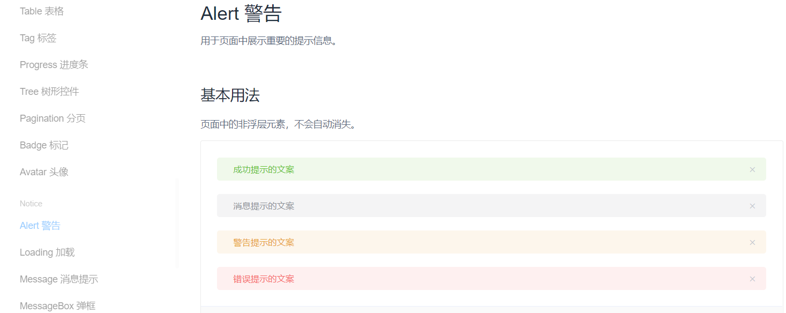

* 在`element.js`中按需导入这个`Alert`组件。

# 获取商品分类的列表数据

* 在这里我们需要一次性的将它的所有分类及它的所有等级的数据都获取到。

  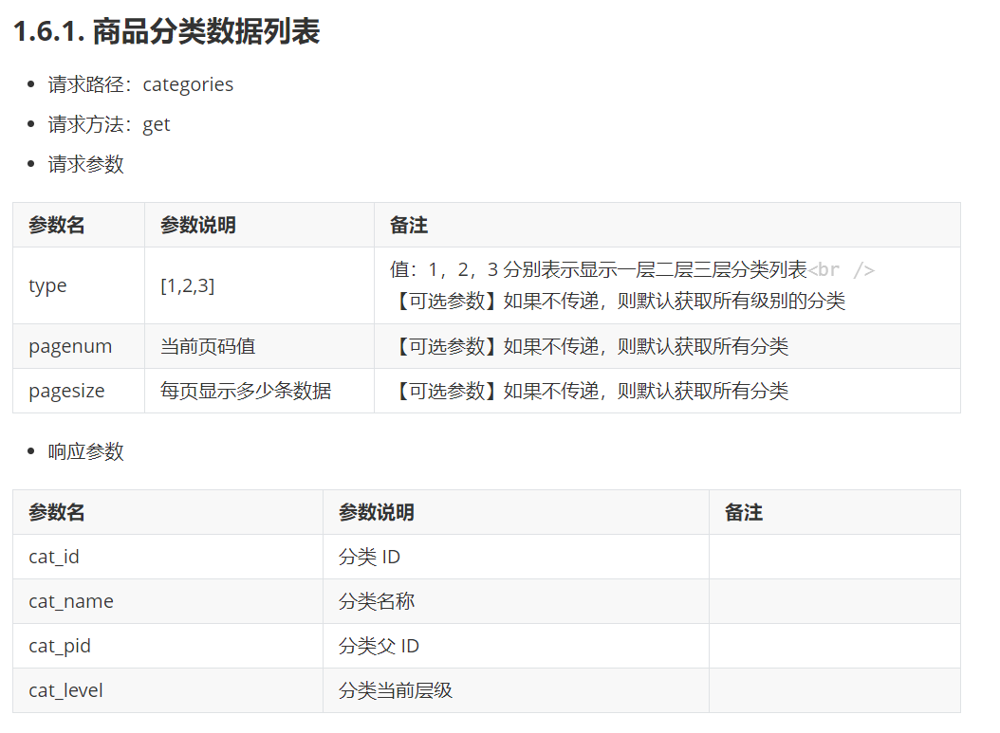

* 在这次请求中，type值我们可以指定为3或者不写默认获取的也是前3级的所有分类。

* 因为我们不需要获取页码和多少数据，所以pagenum和pagesize这2个值我们也可以不传。

  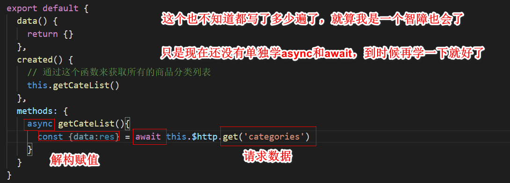

# 渲染商品分类的级联选择框

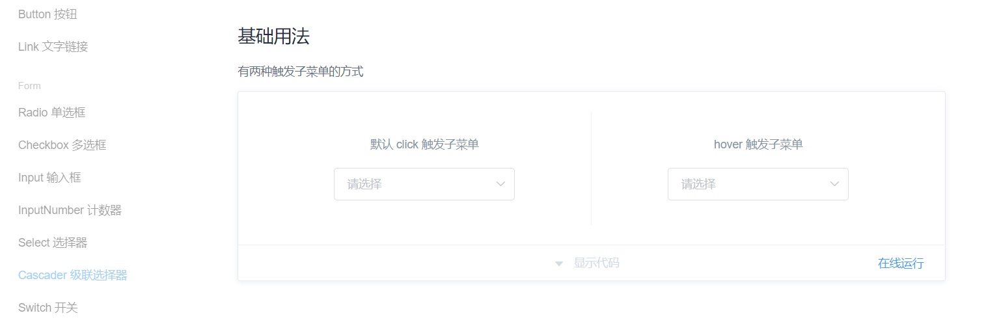

# 控制级联选择器的选择范围

* 我们只允许你选择三级分类，不允许选中一级或二级分类。
* 只需要监听选择器的change事件，只需要判断选中项的数组长度即可。如果这个长度不等于3，则证明你选中的不是三级分类。
* 如果长度不等于3，我们可以立即将这个数组再清空就可以了。
* 因为这个数组和级联选择器之间有一个`v-model`的双向数据绑定。只要我们人为的将数组清空了，那对应的选择器里面的选择项也就被重置了。

# 渲染动态参数和静态属性的Tab页签

* 在这里会用到一个新的组件:`Tabs标签页`

  

* 全局注册`tabs`和`tab-pannel`组件

# 按钮的启用与禁用

* 当你没有选择三级商品分类的时候，则这2个按钮都会处于禁用的状态。
* 如果你选择了任何一个三级分类，则它们就立即变成了启用的状态。
* 接下来我们可以在对应的页签中渲染出这2个按钮。
* 接下来我们要控制它们的禁用状态。——如果你没有选择三级分类，则这2个都是禁用状态。

# 获取参数的数据

* 首先我们要根据选中的三级商品分类，并且结合参数的类型，从而获取table表格里的数据。

  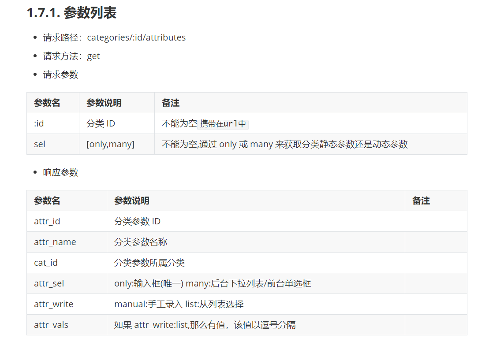

* 你选中的是哪个三级分类，就把那个三级分类的id填到我们的url的id中去。

* 这个分类id如何去拿呢？我们可以定义一个计算属性。

  

* 我们把原来面板的name由原来的`first`和`second`改为`many`和`only`。

* 这下我们的参数都准备好了，接下来应该要开始发起请求了。

* 我们如何发起请求呢？我们应该在选择项发生改变的那个change函数中发起对应的请求。

# 切换面板重新发起请求

* 当我从动态参数面板切换到静态属性面板时，应该再次发起请求，从而获取静态的属性。
* `handleChange`这个事件处理函数是属于级联选择器的，也就是说，只有级联选择器的选中项发生变化，我们才会获取对应的数据。但是，当面板发生切换的时候，咱们并没有去获取数据。、
* 所以接下来我们应该将获取数据的这些业务逻辑单独的抽离为一个函数，然后不论是级联选择器的选中项发生变化，还是面板的选中项发生变化，都应该调用一下那个函数。
* 我们将`handleChange`里面的所有代码选中，单独命名为一个函数`getParamsData`

# 一个小问题

* 我们的动态参数和静态属性都调用`getParamsData`这个函数，但是它只能返回一个数据。那么问题是：你获取到的这一个数据到底是给哪一个表格来使用的啊？？？

* 所以我们这里获取到数据之后并不能直接保存到data身上。

  

* 而是应该先做一下判断，判断这个数据到底是哪个表格的数据，然后再做对应的处理。

# 渲染动态参数和静态属性的table表格

# 添加参数和添加属性的功能

* 点击添加参数按钮会弹出添加动态参数的对话框。这里有一个item项，是动态参数。同时里面有验证规则。

* 我们可以让添加动态参数和添加静态属性的对话框，它们共用一个对话框。

  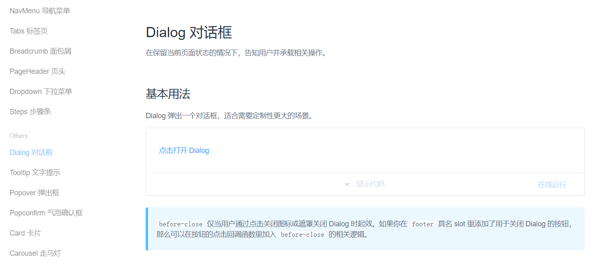

  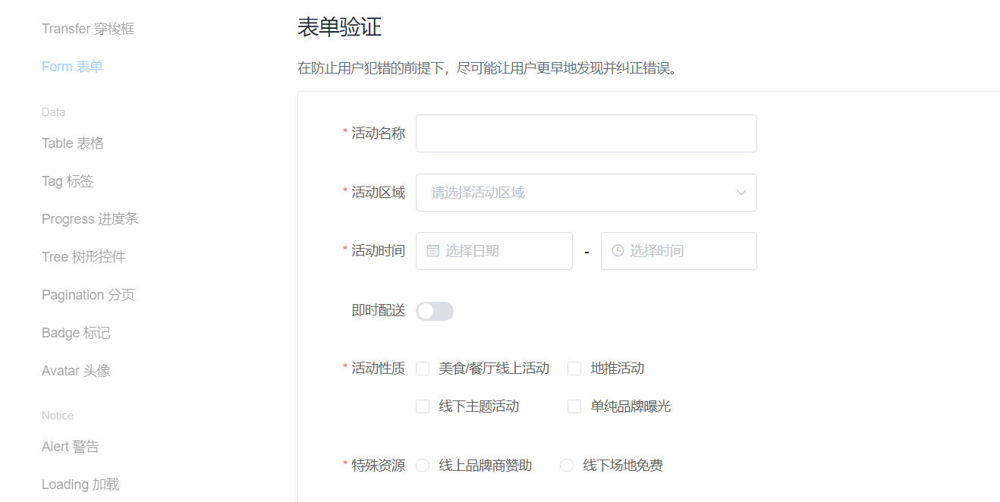

* 当我这个对话框关闭的时候，应该把它的验证规则给取消掉。

* 接下来需要监听对话框的close事件

# 参数的添加操作

# 点击修改按钮

* 点击修改按钮弹出修改按钮的对话框
* 同时将数据加载到表单项中供用户进行修改
* 修改和添加弹出的对话框基本上是一致的，只不过里面的某些文本和行为有些不同。
* 我们可以把添加的对话框复制一份，修改一下当成修改的对话框。
* 我们首先需要为修改按钮绑定一个单击事件。

# 继续完善编辑的功能

* 首先在点击按钮的时候，应该将对应参数的id传到处理函数中，并且根据传过来的id去查询参数之间的数据，给它绑定到这个表单中。

  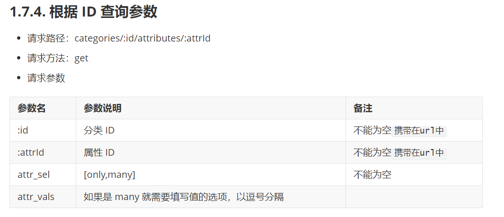

* 现在这里面的代码是越来越多了，我现在是真的有点晕了。

* 完成参数信息的获取之后，点击确定以后就应该完成这次的修改操作。

* 点击确定先进行表单的预校验，预校验通过之后再发起请求，修改对应的数据。

  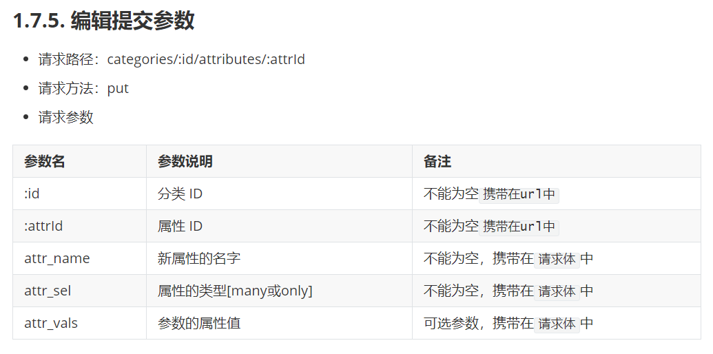

# 删除参数的操作

* 点击删除按钮会触发点击事件

* 在事件中我们可以指定处理函数，并且把对应的参数id传到函数中

* 传进去之后我们就可以调用对应的API发起删除的请求了。

  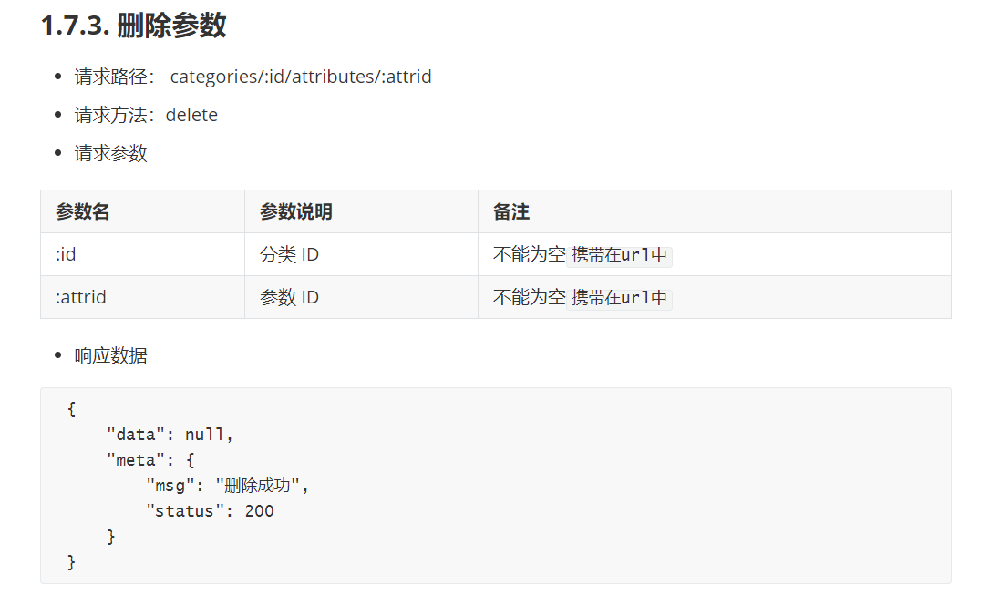

# 渲染参数下的可选项

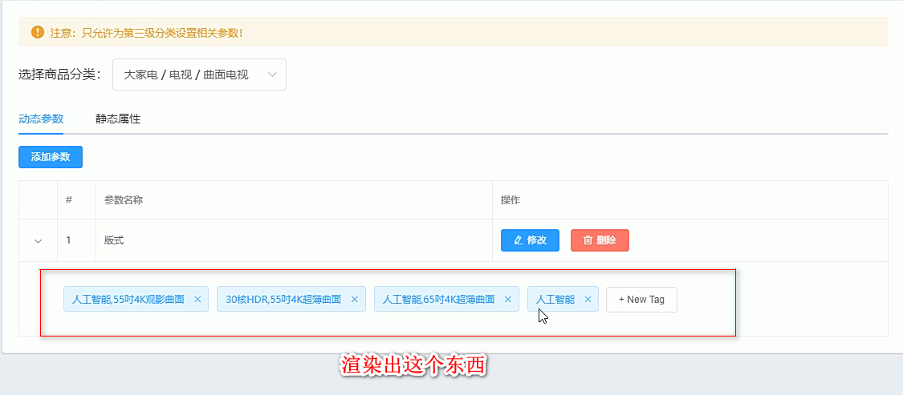

* 可以删除可选项，也可以点击后面的添加按钮新增可选项。

* 首先我们看一下板式下的可选项对应的数据项是谁？

  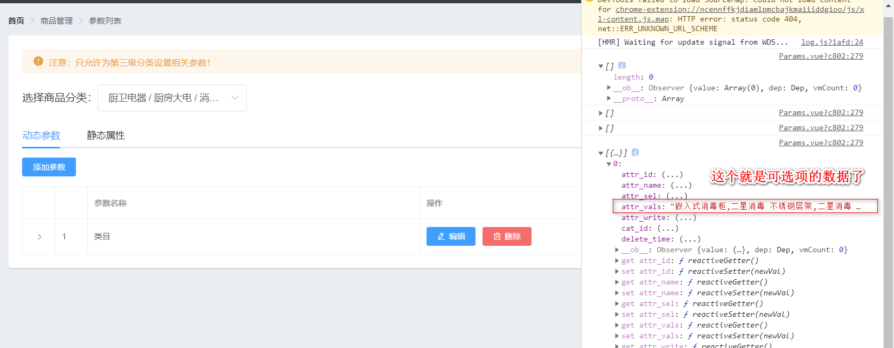

* 首先我们要将服务器返回的数组里的每一项进行一下for循环。每循环一次，都会拿到一个参数项，我们立即将参数项中的`attr_vals`从字符串分割为一个数组，然后重新给它赋一下值。

* 这样的话每一项的`attr_vals`就不再是字符串了，而是一个数组。

* 那么接下来我们可以在渲染每一行的时候，在它的展开行中通过for循环将数组里的每一项渲染为tab标签即可。

# 解决一个小问题

* 空的可选项下面是这个东西。

* 默认情况下**颜色**里面是有这些可选项参数的，可以被渲染出黑色，白色出来。但是**大小**是我们刚添加的，它的`attr_vlas`是一个空字符串，而空字符串如果使用空格来进行split分割的话，会返回一个数组，里面包含一项空字符串的。所以这里它就渲染出了一个空白的`el-tag`标签。

* 如果解决这个问题呢？——我们不应该直接分割并赋值，而是首先做一下三元表达式的判断。

  

# 控制添加按钮与输入文本框之间的切换显示

# 一个小问题

* 原因是每渲染出一个展开行，它们都共用一个布尔值和value值导致的。

* 要想解决这个问题，只需要给每一行的数据单独提供布尔值和value值即可。

  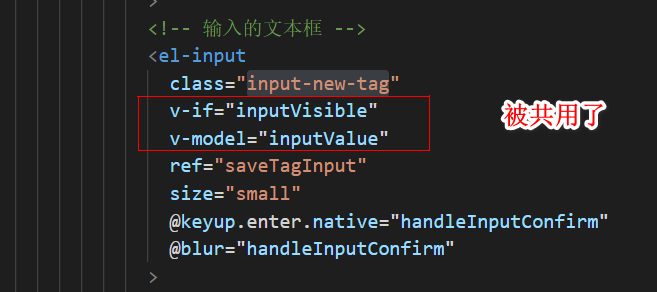

* 大家需要找到获取参数列表的那个方法，`getParamsData`，修改里面的代码。

  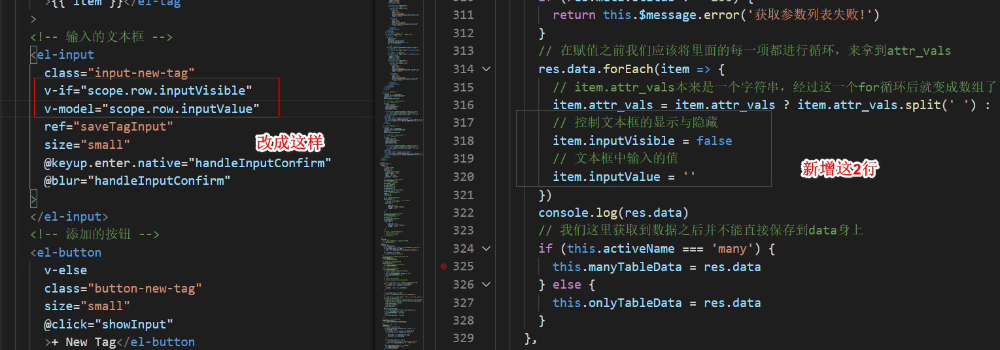

# 文本框自动获取焦点

* 我们希望文本框可以自动获得焦点。

* 他在点击+New Tag这个按钮的时候，会触发`showInput`这个事件处理函数。

  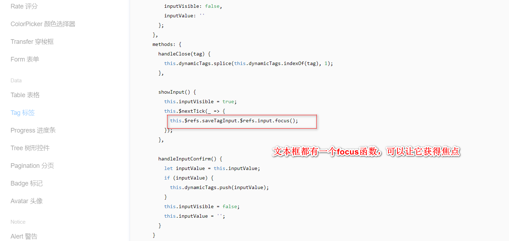

# 按钮与文本框的切换显示

* 我们监听文本框失去焦点的事件

* 这里无论是按回车还是失去焦点，都会触发一个`handleInputConfirm`函数

  

* 调用这个函数的时候，立即将`inputVisible`重置为false即可。

* 我们接下来做一些优化。

* 我们在文本框中输入一些空格，然后失去焦点，然后再点击，发现之前输入的空格还在。

* 如果你输入的内容不合法，那么在失去焦点的时候，就应该立即将失去的焦点进行清空。

# 参数项的添加操作

* 如果输入了合法的值，我们将`row.inputValue`push到`row.attr_vals`数组后面即可。

* 在这里我们只是在前端进行了操作，数据并没有上传到数据库里面进行保存。所以如果我刷新页面的话，输入的内容就没有了。

* 所以我们在push完毕以后，还应该发起网络请求，将这一次的操作保存到数据库中。

  

* 注意：务器指定的`attr_vals`是字符串，我们这里拆成了数组，需要再把它改成字符串。

# 参数项的删除操作

* 点击删除按钮进行删除会触发close事件的。

# 小问题

* 这里商品分类只允许选择三级分类，不允许选择一级和二级的。
* 假设我只选择了二级的，但是下面的表格数据还有。
* 所以你只要选择的不是三级分类，下面的表格数据也应该清空。
* 只要选择项发生变化，就会触发它的change事件。

# 静态属性的展开行

* 只需要将动态参数属性展开行的代码复制一份即可。

# 商品列表功能的开发

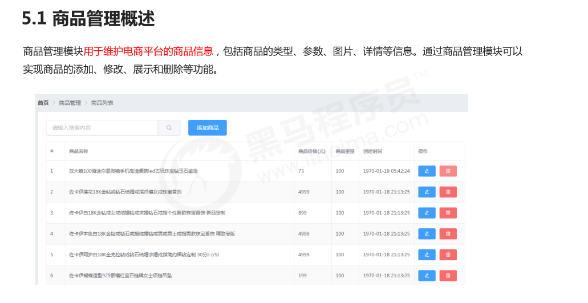

* 创建一个新分支
* `git checkout -b goods_list`
* `git push -u origin goods_list`——将这个分支推送到GitHub中

# 商品列表初始化基本UI结构

* 在`goods`文件夹下新建一个`List.vue`组件。

* 再在`router.js`中导入这个组件。

  

* 首先，在头部区域有一个面包屑导航

* 下面是一个卡片视图

* 卡片视图中有一个row,这个row分成了2列，左边是一个搜索框区域，右边是一个添加商品的按钮区域。

  

# 获取商品列表的数据

* 在这里，列表数据涉及到了分页的功能。

  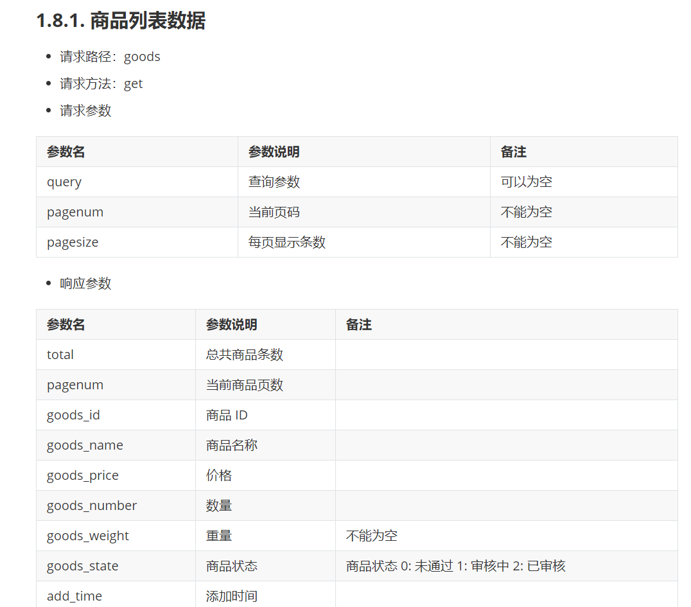

  

* 当我们数据获取成功之后，就应该想办法将数据渲染到页面之上。

# 渲染商品列表的table表格

* 首先渲染出index

* 接着渲染出商品名称

* 接着渲染出商品价格

* 接着渲染出商品重量

* 接着渲染出商品创建时间

  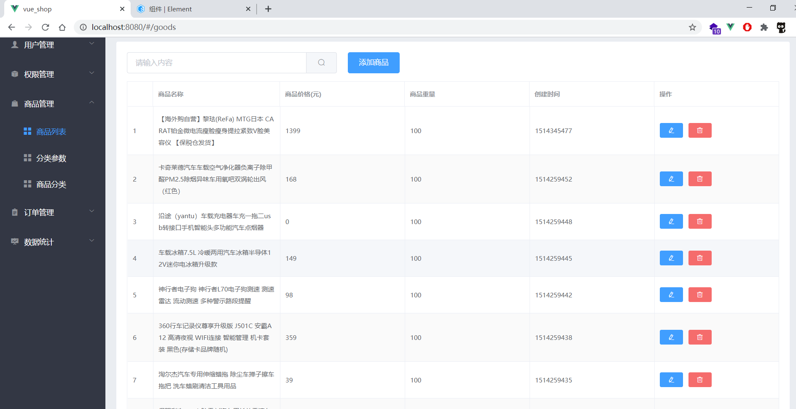

* 表格的数据基本上都渲染好了，但是表格的宽度需要再调整一下。

* 我们希望：商品名称的宽度可以自适应。剩下的这几列我们可以给它一个强制性的宽度。

# 创建全局的时间过滤器来处理时间格式

* 在`main.js`中注册一个全局的过滤器。

  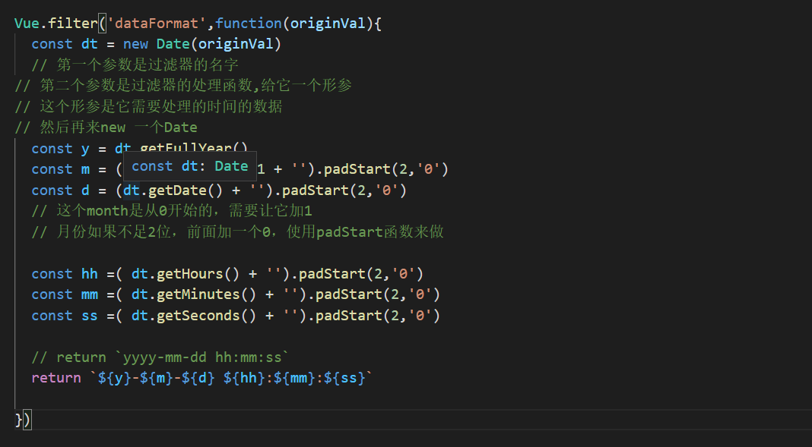

# 商品列表底部的分页功能

# 实现搜索与清空的功能

* 首先要将`el-input`里面的内容进行双向绑定。`v-model="queryInfo.query"`
* 当你点击搜索按钮，就应该调用获取数据列表的函数。
* 我们想要有清空的效果，给`el-input`加一个clearable属性即可。
* 当你点击清空按钮的时候，会触发一个事件`getGoodsList`来重新获取所有的数据。

# 删除商品的功能

* 首先在点击删除按钮的时候会弹出一个提示框，询问是否删除。

* 首先，我们应该找到自己的删除按钮，为它绑定一个单击事件处理函数。

  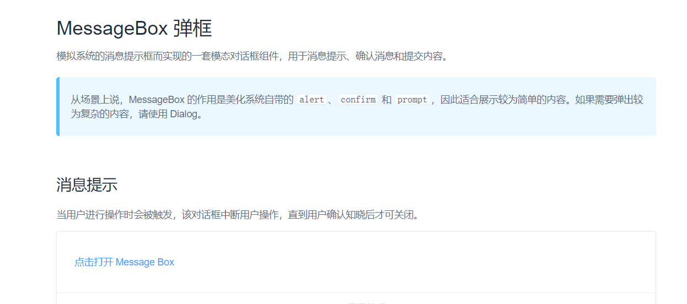

# 点击添加商品按钮跳转到添加商品页面

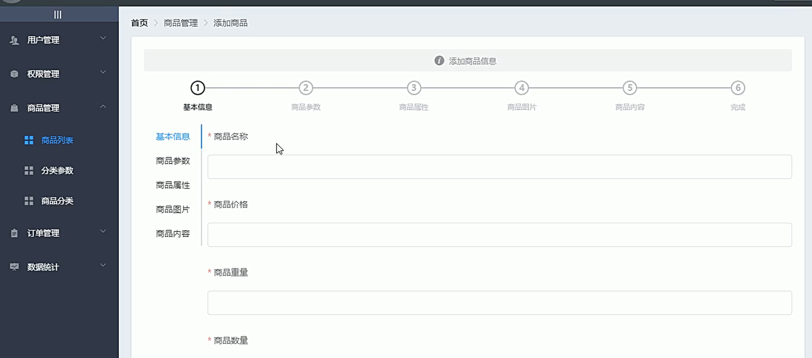

* 我们首先需要为添加按钮绑定一个单击事件。
* 在事件处理函数中，通过路由导航的形式跳转到添加页面。`this.$router.push('/goods/add')`
* 只不过这个路由并没有被监听，我们也没有创建对应的组件来显示这个页面。
* 在`goods`目录下我们新建一个组件叫`Add.vue`

# 绘制添加页面的基本结构

* 首先头部还是一个面包屑导航

* 下面是一个卡片视图。

* 在卡片视图里面包含了一个alert警告区域，还有一个进度条区域，还有下面的一个tab面板。

  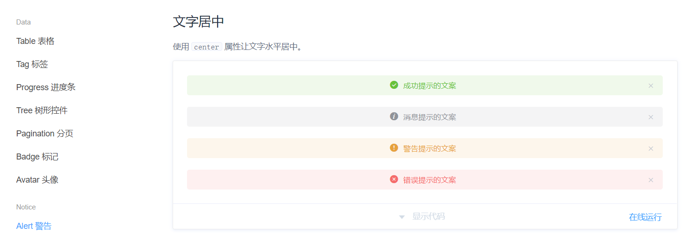

* 底部的进度条需要用到一个组件

  

# 美化一下步骤条

* 首先为步骤条增加几项，它默认只有3项，我们需要有6项。

* 当前这个步骤条距离上下都很近，我们需要进行调整。在`global.css`里面进行修改。

* 我们希望里面的文本变得稍微小一点。

  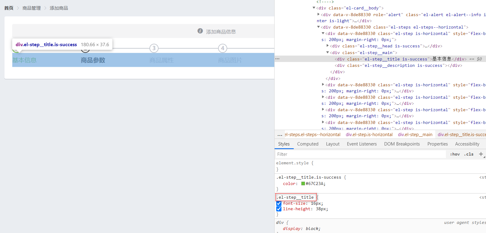

* 我们希望步骤条里的每一项可以居中进行显示。现在它是贴边来显示的。`align-center`
* 默认情况下我们进入到添加页面，它激活的是基本信息。而我们这里它默认激活的是第二个。它是通过`:active`属性来控制激活选项的。`:active="0"`即默认把第一项激活。
* 我们这里希望将active保存到data身上，实现数据的联动效果。

# 绘制添加商品页面中的tab栏区域

* 这里我们需要使用新的组件：tabs标签页

  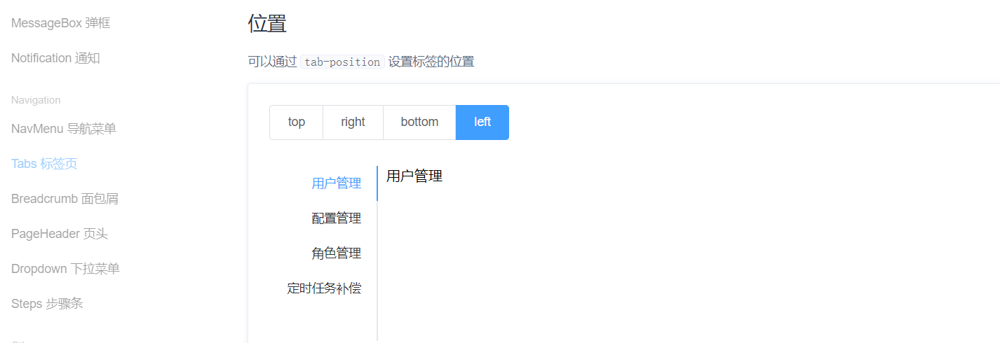

# 步骤条与tab栏之间的数据联动效果

* 步骤条是通过active修改激活状态的。
* `el-tabs`是通过`v-model="activeName" `来实现的。

# 分析一下页面上的添加行为

* 这里将商品的添加信息拆分为了5个不同的pannel面板。

* 每个pannel面板中只维护着当前商品面板中的部分数据。

* 只有将这5个面板中的数据合起来才是一个完整的商品信息数据。

* 所以我们应该将这5个pannel面板用一个统一的form表单进行包裹。

  

* `el-tabs`和`el-tab-pane`之间不能有其他标签，所以`el-form`必须要在`el-tabs`之外。

* 默认label和表格在一行，我们想要它们分别占2行。

  

* 大表单填好之后，我们接下来需要填写不同的表单项了。

# 绘制基本信息面板的表单

* 包含商品名称、价格、重量、数量、分类5个项目

  

# 获取商品分类数据

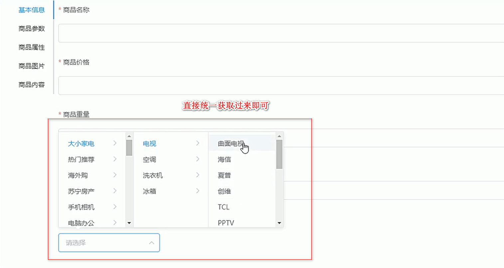

* 在这次请求中，不需要向服务器发送任何get参数，直接请求即可。

# 根据获取到的数据渲染级联选择器

* 这个级联选择器也只允许你获取三级商品分类

  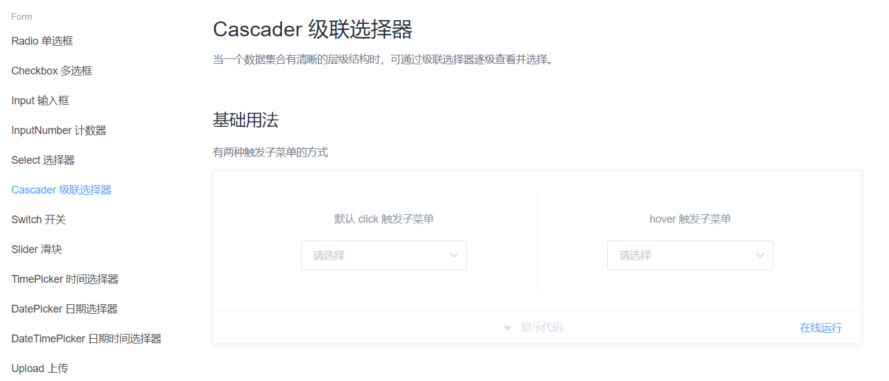

  

* 提交表单的时候我们应该把`goods_cat`由一个数组转为一个以`,`分割的字符串。

# 控制级联选择器的选择范围

* 只准选择3级，不准选择1,2级。
* 使用`if-else`判断length即可。

# 阻止标签页的切换

* 商品分类如何不选择的话，无法进行标签切换。

* 首先要监听标签页的切换事件。

* 然后在事件的处理函数中判断当前是否处于第一个页签。

* 同时还要判断你选中的商品分类是否为3级。(length是否等于3)

  

# 获取商品参数面板对应的数据

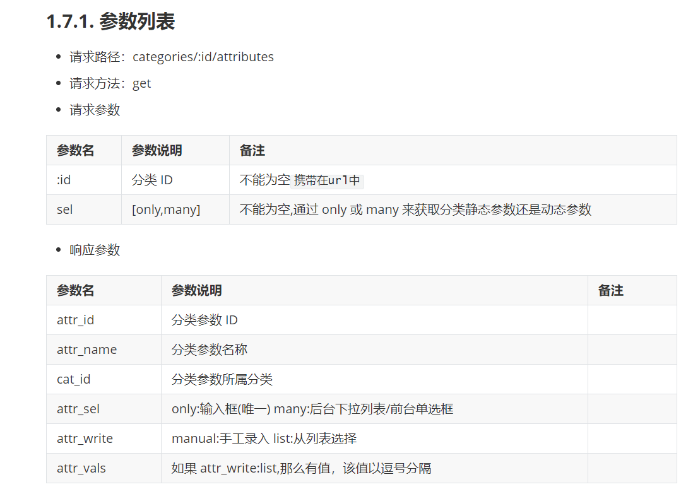

* 因为我们打开的是商品参数面板，所以直接将sel的值规定死为many就可以了。

* 当我点击商品参数面板的时候，才发起这次请求。

  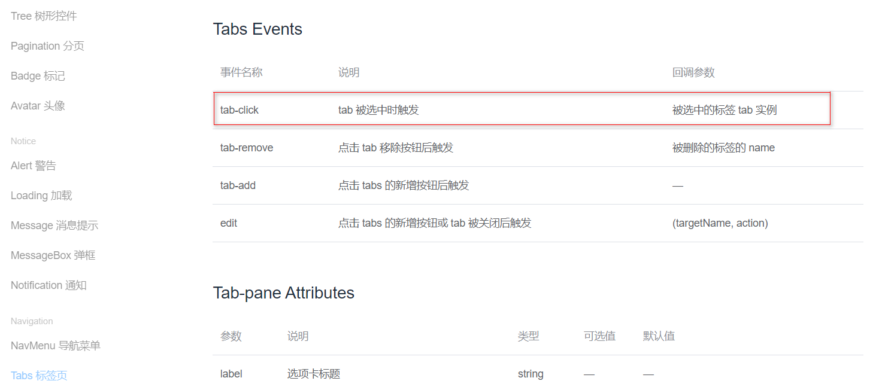

# 商品参数面板的绘制

* 版式以及下面的复选框都属于表单的item项。

  

* 不过这个版式是属于label属性渲染出来的。`attr_name`

  

* `attr_vals`并不是数组，而是字符串，使用forEach循环即可。

* 全局注册一下`el-checkbox-group`和`el-checkbox`。

* 加一个border属性就可以加边框了。

# 美化复选框

* 当前复选框之间的间隔太大了。
* 如果复选框占到第2行的话，有一种对不齐的效果。
*  ` .el-checkbox{margin: 0 10px 0!important; }`来替换掉它的默认样式即可。

# 商品属性面板对应的功能

* 在点击商品属性面板的时候，应该立即发起数据请求，获取对应的静态属性数据列表。

  

* 这次需要将sel的值指定为only。

# 通过循环将静态属性渲染为表单item项

* 每一个item项都要对应一个文本框。

# 图片上传的功能

* 我们这里要使用`Upload`上传组件。

  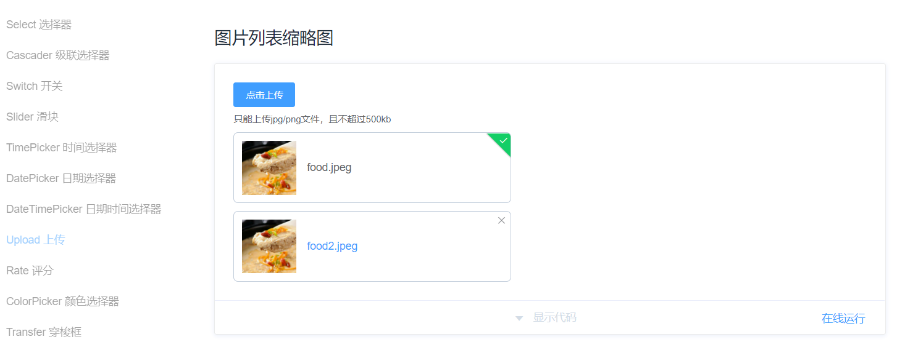

  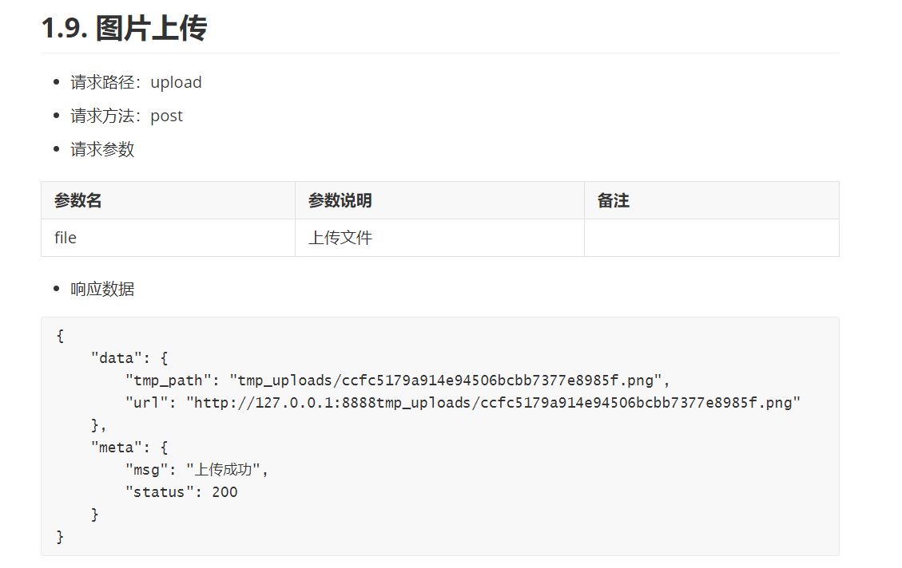

* 但是，如果你直接把upload地址直接放到action里面是不行的。

* 因为我们的后台API接口不是8080而是8888。

* 所以我们不应该写相对路径，而是应该写一个完整的API地址。

# 演示上传组件能否正常生效

* 看到图片列表并不一定代表图片上传成功了。

  

* 文档中的所有接口，除了登陆接口之外，其他接口都是有权限的。都需要在调用这个接口的同时提供一个token值才可以。

  

* 说明在调用Upload组件上传图片的时候，它在发AJAX期间，并没有用到Axios。

* 而是这个组件内部它自己封装了一套AJAX，它自己封装的AJAX是并没有携带Authorization这个字段的。因此就报了这个错。

  

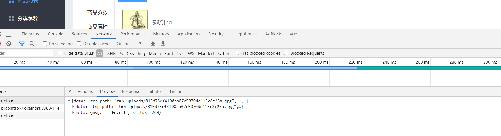

* 这次就可以了。
* 在每次上传图片期间，都要为每张图片手动指定headers请求头，同时在请求头对象中绑定Authorization属性。

# 处理图片上传成功之后的操作

* 上传成功只代表服务器已经存储了这张图片，但是这张图片的相关信息我们还需要把它存储到添加表单中。

  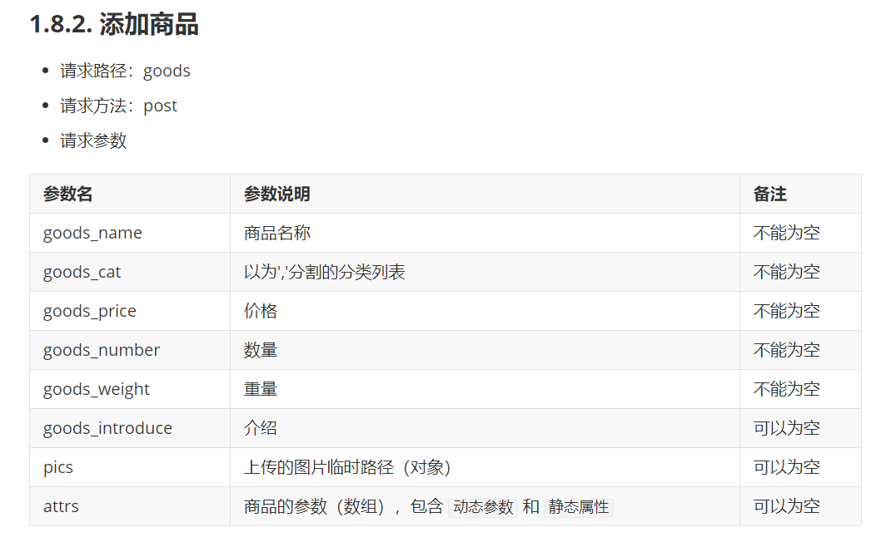

  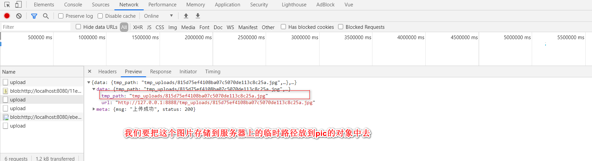

# 图片的移除操作

* 获取将要删除的图片的临时路径
* 从pics数组中，找到这个图片对应的索引值
* 调用数组的splice方法，把图片信息对象，从pics数组中移除

# 图片的预览效果

[跨域问题(Cross-Origin Read Blocking (CORB) blocked cross-origin response)的解决方案](https://www.jiangweishan.com/article/js8908093284092384.html)

* 在点击对应图片名称的时候会弹出对话框，将图片的信息完整的展示出来。

* 当我们点击关闭的时候，会将对应的预览窗口给移除掉。

* 给Upload组件绑定一个预览的事件。

  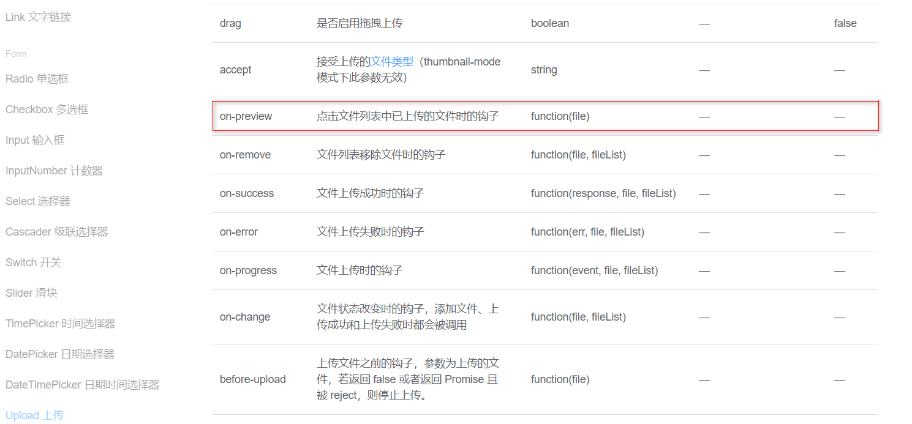

  

* 我这里报了一个错，是跨域问题。`Cross-Origin Read Blocking (CORB) blocked cross-origin response http://127.0.0.1:8888/tmp_uploads/1f82dddeb79112f10a4437021cc15453.jpg with MIME type application/json. See https://www.chromestatus.com/feature/5629709824032768 for more details.`

* 我把接口换成了老师的接口，图片就显示出来了，看来老师的接口已经处理了跨域的问题。

# 在商品内容面板中渲染富文本编辑器

* 这个要安装依赖项。

  

* 我们这里选择全局挂载的方式注册为全局可用的组件(而非局部可用的组件)

  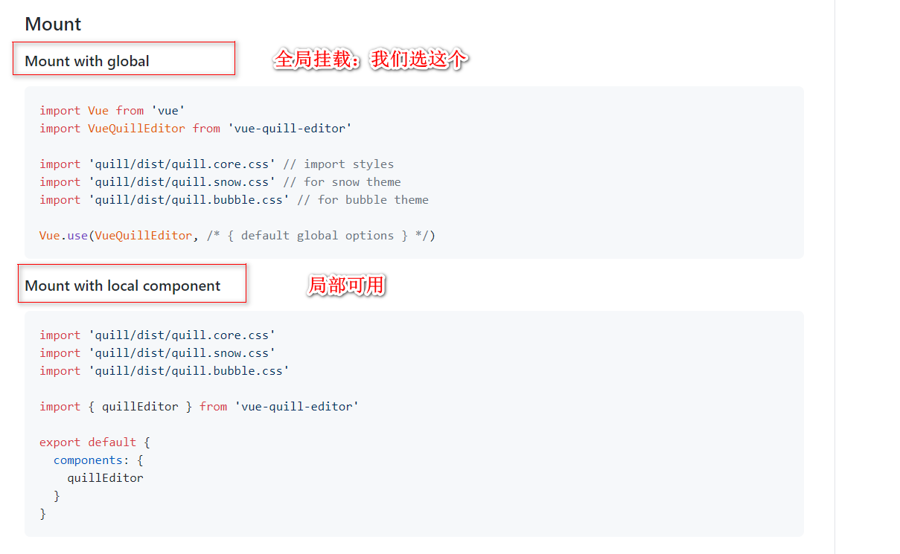

  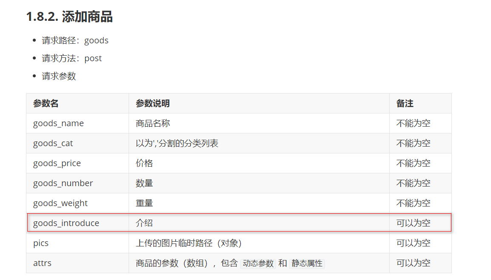

* 给文本区域加一个最小的高度：`.ql-editor{min-height: 300px;}`

* 在编辑器下面有一个添加商品的按钮。

# 商品内容的添加

* 在添加商品之前，要对整个表单进行一下数据的校验。
* 比如一些必填项你是否都填写了。

# 发起数据请求

* 在通过表单的预检验之后，就可以发起数据请求了。

  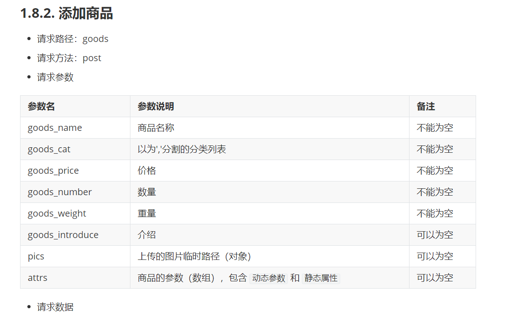

* 我们在发起请求之前，需要将`goods_cat`这个**数组**改造成字符串。

* ` this.addForm.goods_cat = this.addForm.goods_cat.join(',')`，这个看上去没问题，但是真正执行这个函数的时候，到了这一行就会报错。

* 原因：**级联选择器**只能双向绑定`goods_cat`这个数组，在你执行这个函数之前，`goods_cat`是数组是没问题的，只要你执行这个函数，你就立即把`goods_cat`这个数组转成字符串了。

* 在操作`goods_cat`之前，我们可以把`addForm`这个对象做一个**深拷贝**。

* 哇，第一次在项目里用到深拷贝的知识！！！！！！！！！！！！

* 深拷贝就是把这个对象原封不动的再拷贝新的一份，与原对象之间是互不相干的。

* 我们应该在拼接之前就进行深拷贝的操作。

* 我们会用loadsh这个包进行深拷贝。

  

# 继续处理attrs这个参数

* 大家在页面中勾选的动态参数和静态属性最终都要存储到attrs这个属性中。

# 实现添加商品的操作

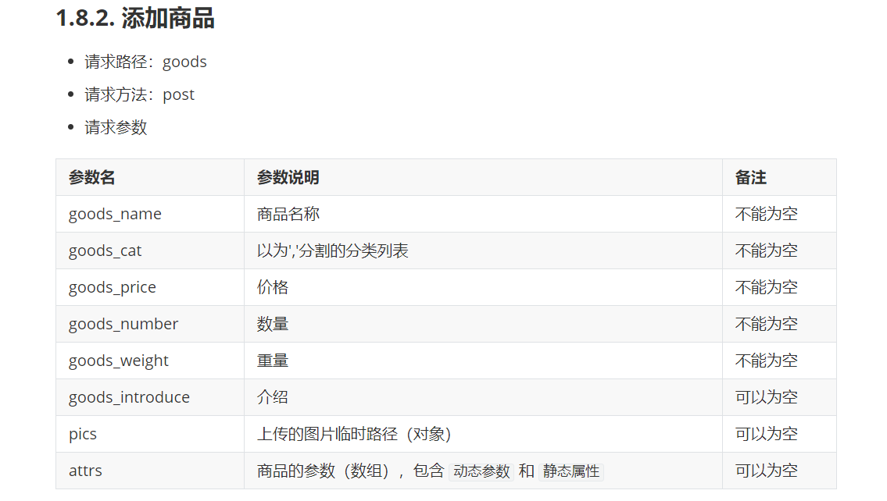

# 商品列表功能提交到GitHub

# 订单管理开发开始

* 创建新分支
* `git checkout -b order`
* `git push -u origin order`

# 根据路由形式加载订单列表

* 在components文件夹下新建`order`文件夹，在此文件夹下新建`Order.vue`组件。

  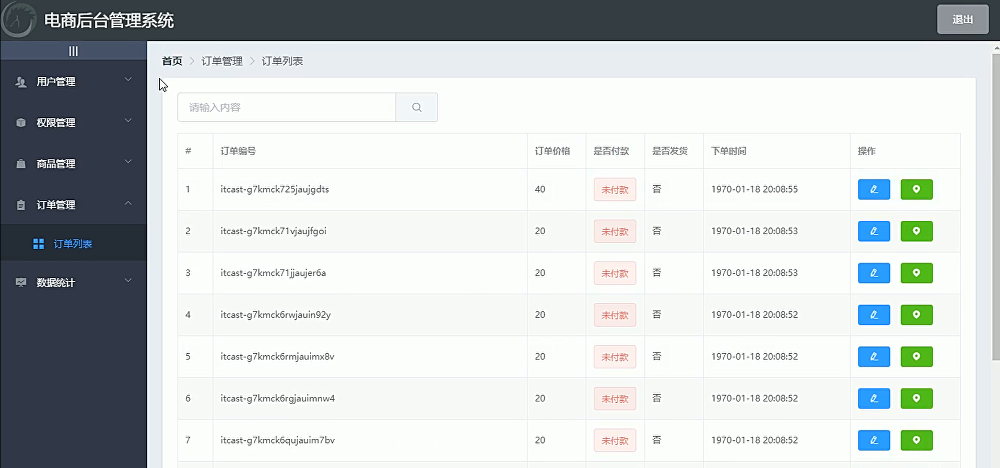

* 头部区域是一个面包屑

* 中间是卡片视图区域

  

# 获取订单列表的数据

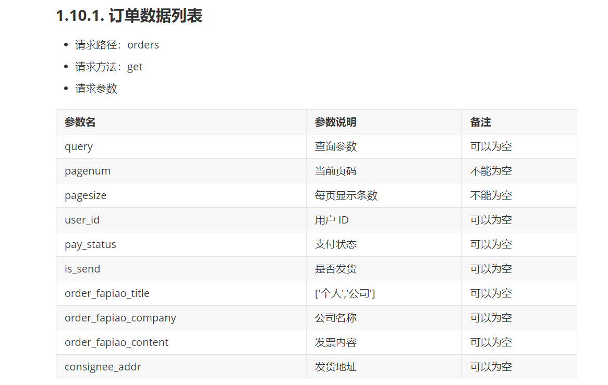

# 渲染订单列表数据

* 下单时间这一列我们也需要通过作用域插槽来选择渲染的时间
* 是否付款我们也需要进行渲染出来一个标签。0代表未付款，1代表已付款。

# 订单列表底部分页功能

* 没啥好说的了。

# 省市联动的效果

* 首先为修改按钮绑定单击事件

  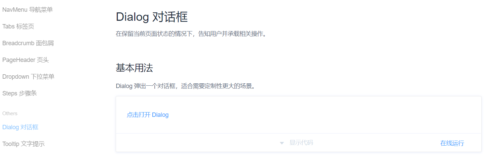

  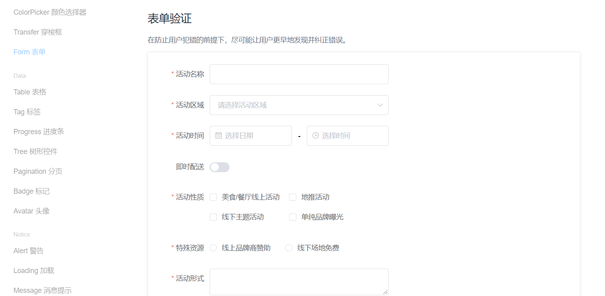

* 我们需要将省市区/县从文本框改造成一个级联选择器。

* 在改造之前我们需要拿到省市区县对应的数据。老师给了我们资料`citydata.js`。

* 我们应该在关闭对话框的时候清空里面的内容。

* 其他的功能了老师让我们自己去做了。

# 物流进度的查询

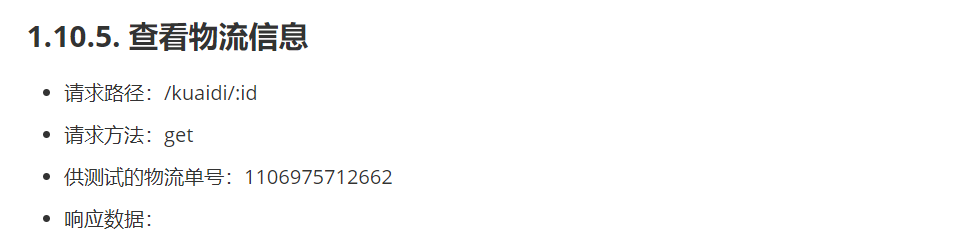

* 这个接口物流单号接口用不了了，直接报错。

* 嘿嘿，我找到了老师写的项目，看了一下他的，发现可以。于是我把baseURL改成老师的了。

  

# 将物流进度以时间轴形式展现到面板中

* 这里我们会用一个新的组件：`Timeline`

  

* 这个这个组件比较新，原来版本里没有，所以老师给了我们2个文件夹，`timeline`和`timeline-item`，让我们把它导入到plugins文件夹中就可以了。 

# 订单项目结束，git提交

# 数据报表相关功能的开发

* 新建分支`report`

# 报表组件初始化

* `components`文件夹下新建`report`文件夹，里面新建`Report.vue`组件。

#  E-charts绘制图形区域

* 初始化图表必须在页面上DOM结构渲染完毕之后才能初始化，所以我们选择mounted这个阶段进行初始化。

# 获取报表的数据并将数据替换到图形中进行展示

* 报错，`“export ‘default‘ (imported as ‘echarts‘) was not found in ‘echarts‘`，解决方法：

  `import * as echarts from 'echarts';`这样就可以了。

  

* 服务器返回的这个折线图的数据是不完整的，为了能够实现鼠标跟随效果，还需要将服务器返回的数据`res.data`和options选项进行合并得到一个新对象，展示那个新对象。这里我们就会用到之前用过的lodash了。

* 这次我们使用lodash来进行两个对象的合并。

# 报表git提交

# 优化及部署Vue项目

# 项目优化策略

# 为项目添加进度条效果

* 这里我们会用到第三方包：`nprogress`

  

* 我们可以通过基于拦截器来实现展示和隐藏进度条的效果。

  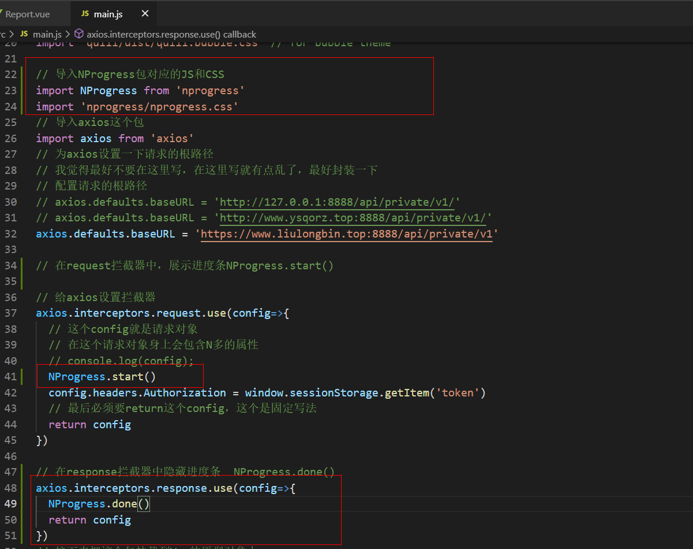

# 查看是否有警告

* `npm run build`时不要有`console.log`这样的代码了，我们可以使用`babel-plugin-transfrom-remove-console`这个插件来帮我们找到并删除掉。

* 如何让这个插件只在发布阶段生效，开发阶段不要生效呢？(开发的时候我们要看`console.log`)

  

# 生成打包报告

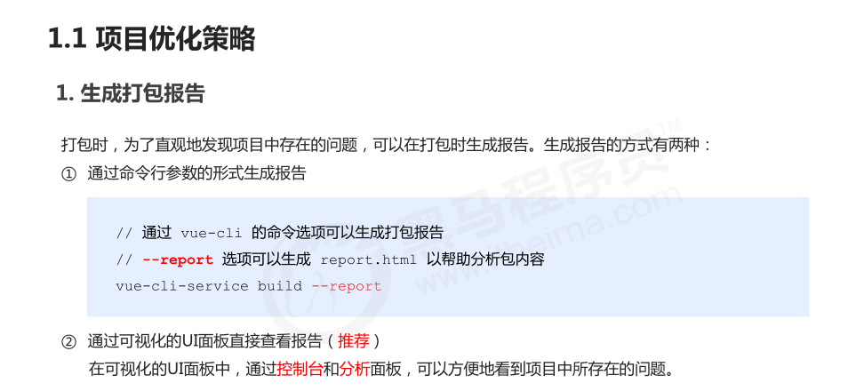

* 我去，我昨天没有学习今天它就报错了。

  

* 我把原来的`node_modules`文件夹删除，重新`npm install`发现还是不行。

* 我又重新仔细看了一下报错信息`babel.config.js: Error while loading config - Process is not defined`，这个是之前写的`babel.config.js`文件有问题啊。

* 于是我把`babel.config.js`这个文件复原到原来的样子，然后运行，就没有问题了，嘿嘿。

* 看来遇到报错，一定要仔细查看报错信息写了什么啊！！！！！

  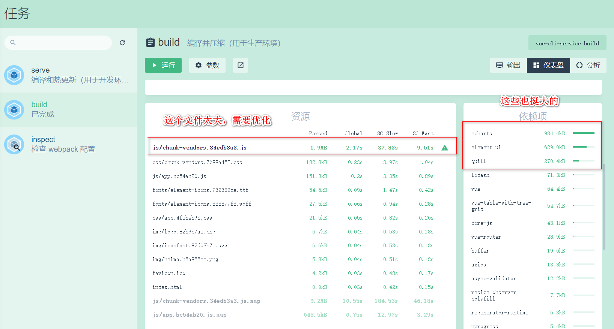

# 修改webpack的默认配置

# 指定不同的打包入口

[dev、test和prod是什么意思？](https://blog.csdn.net/zsl131557/article/details/80886114)

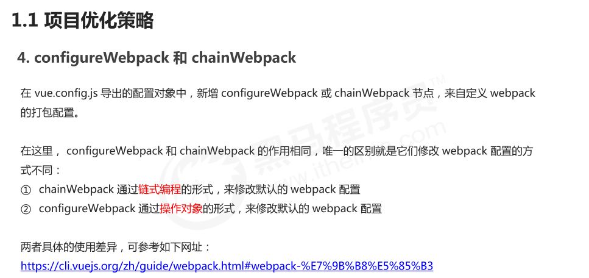

# 加载外部CDN资源

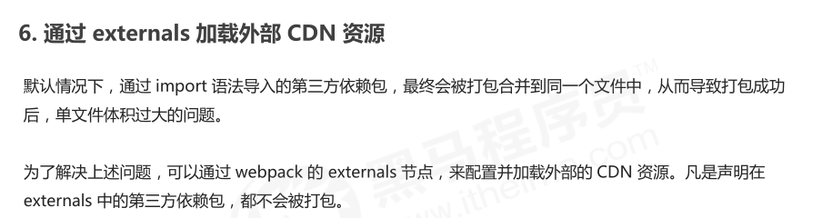

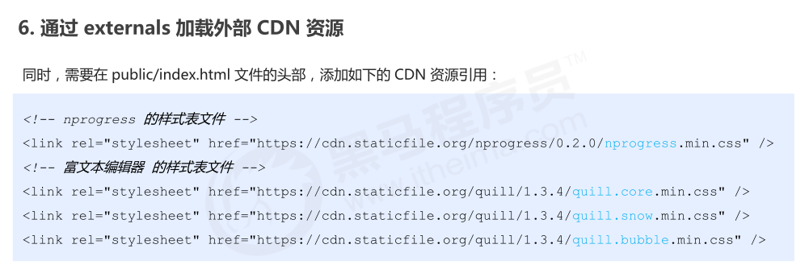

* `chunk-vendors.js`体积大的原因是我们把所有导入的第三方依赖包的资源都放到这里了，所以导致它的体积会很大。
* 如果可以把这些能够拆出的依赖项声明到externals节点中去，在打包期间我们的webpack会先检查程序员有没有在externals里面去声明一些第三方依赖包，如果有的话webpack就不会把第三方依赖包打包到`chunk-vendors.js`里面去。
* 而是在用到这些依赖包的时候，在window那个全局对象身上去找那个现成的对象进行使用。
* 只有在发布模式的时候我们才有必要配置代码。

# 通过 CDN 优化 ElementUI 的打包

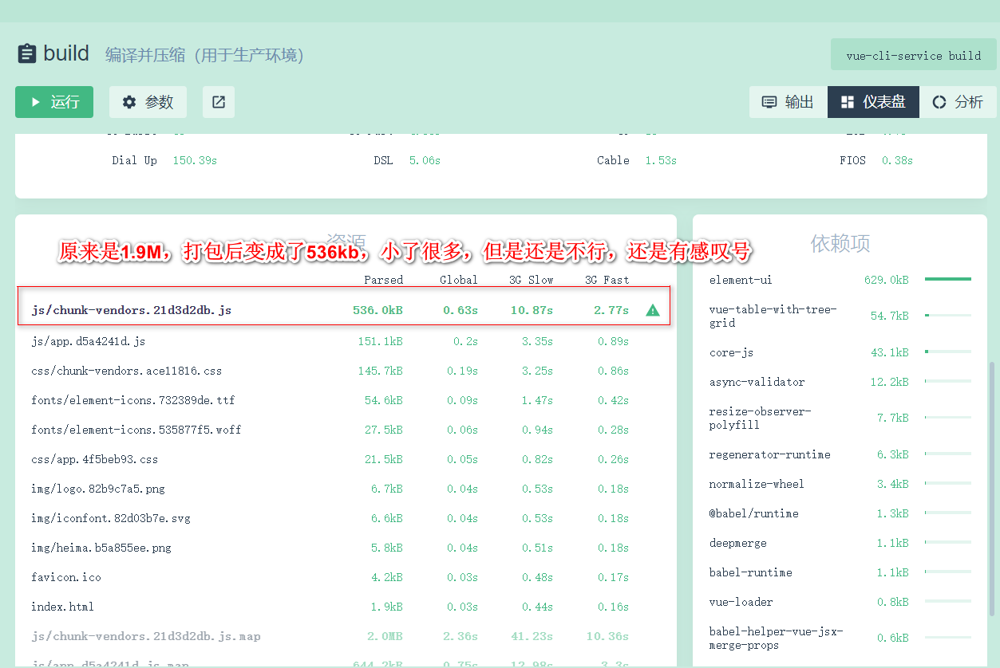

* 在这个js文件中，占了绝大部分体积的是`element-ui`，所以我们解决掉它就可以了。

  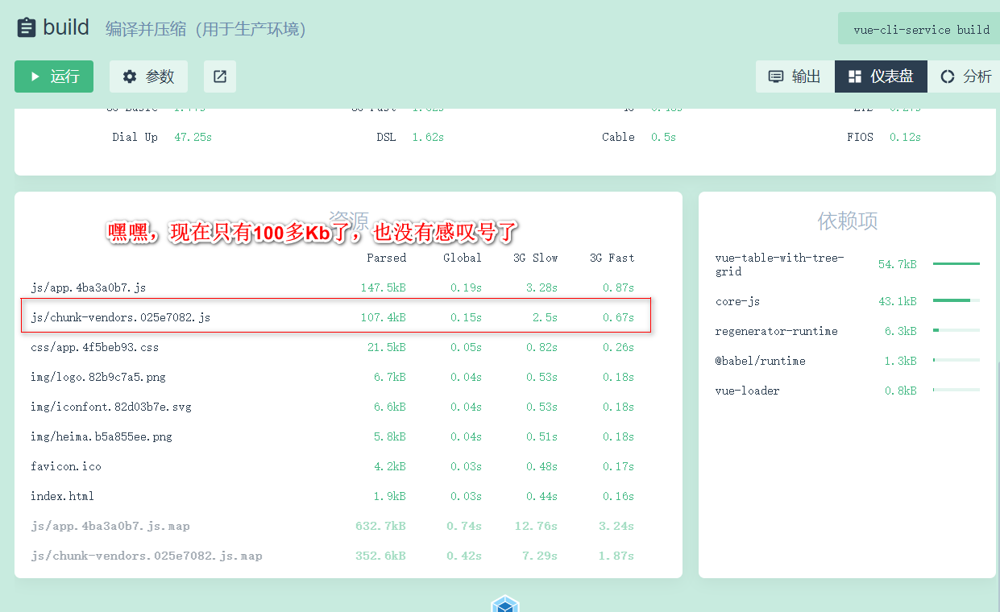

* 出现了报错`[Vue 打包后报错 Uncaught TypeError: Cannot redefine property: $router](https://www.cnblogs.com/mengyouyouyou/p/10936171.html)`,页面不显示了。

  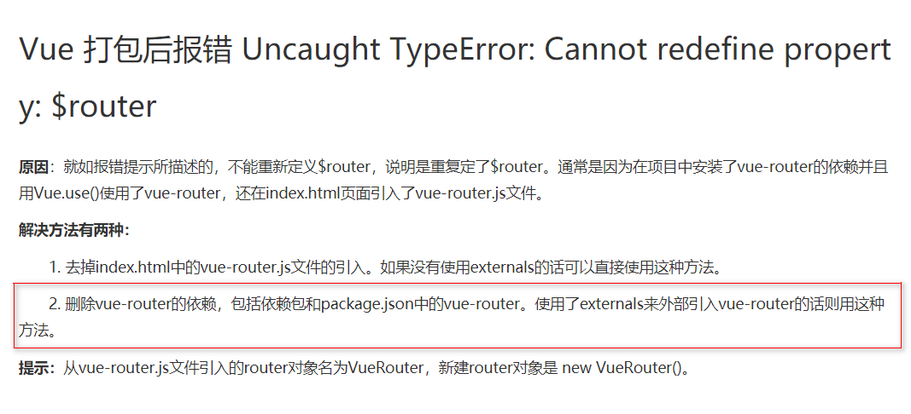

* 但是我删了依赖包之后它报错，我只好先注释掉引入的router了。

* 之后又报错了，于是我又取消了注释，发现`npm run serve`和`npm run build`也都没有问题了，奇了怪了。

  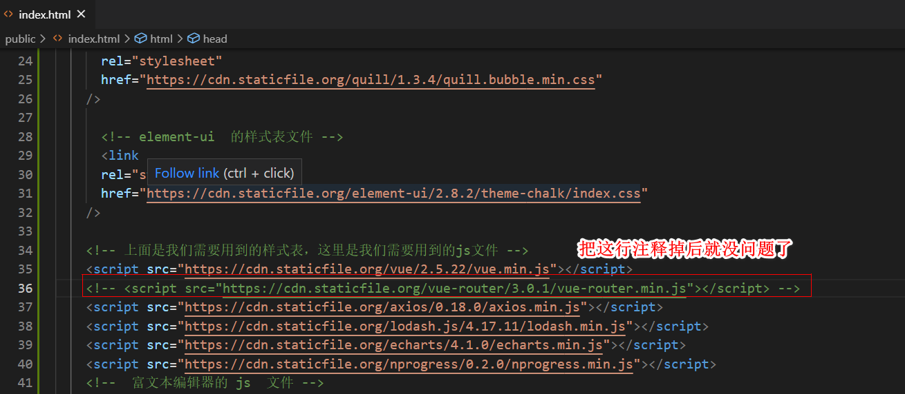

# 首页内容定制

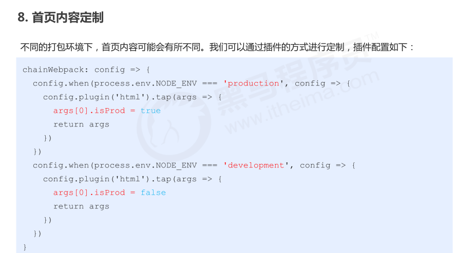

# 路由懒加载

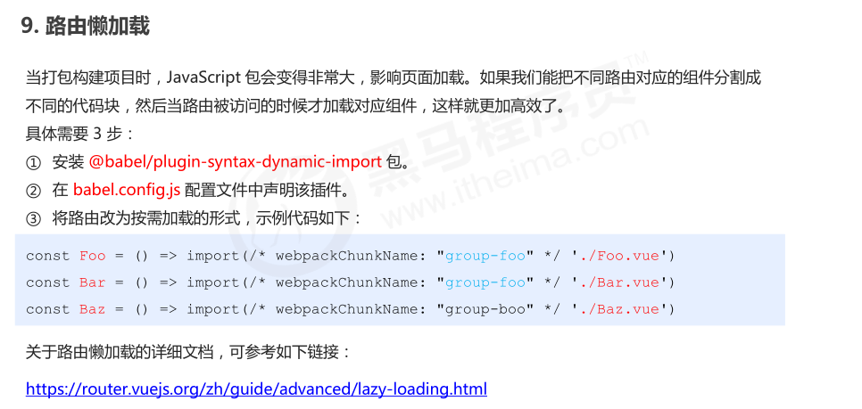

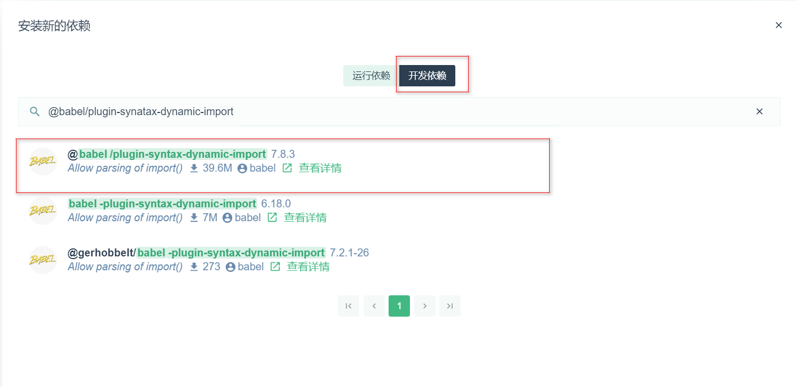

# 项目上线

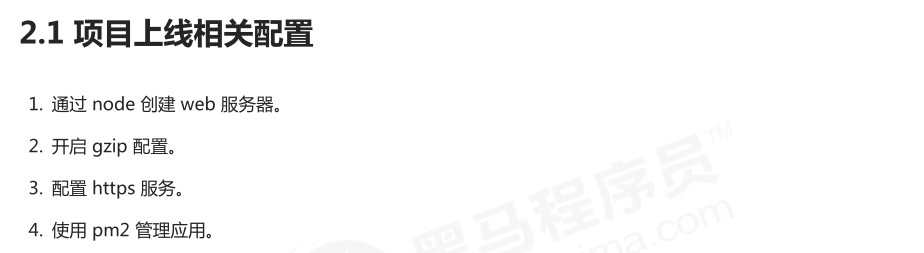

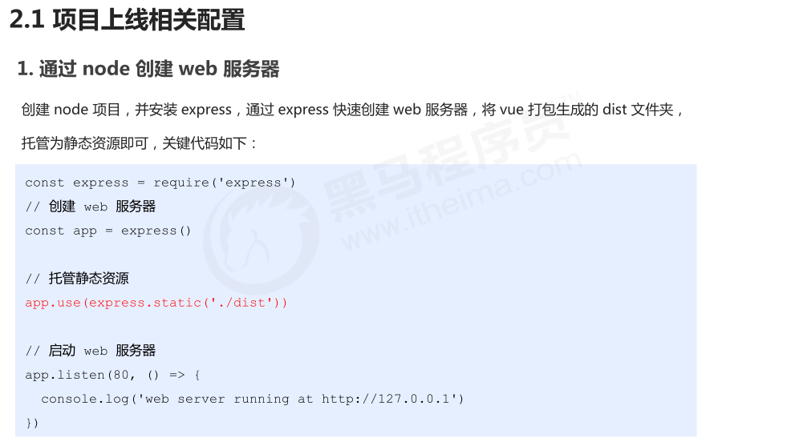

* 在`vue_shop`同级文件夹下新建一个`vue_shop_service`文件夹，并执行`npm init -y`命令，初始化这个文件。

  

* 再在`vue_shop_service`下执行`npm i express -S`安装express。

* 将`vue_shop`打包生成的`dist`文件夹复制到`vue_shop_service`文件夹中。

* 在复制中的`dist`文件夹同级中新建一个`app.js`文件。

* 如果打开显示不出来项目就更改一下端口号即可。

# 项目上线相关配置

* 我用了这个以后它报错，都不显示，不用这个就不会报错。
* 角色列表不见了的话可以把`index.html`文件中的element里的js和css版本从2.8.2改成2.4.5即可。

# 配置HTTPS服务

# 使用PM2管理应用

* 如果你把本地API服务器关了，就打不开了。我们要解决这个问题。

# 从这个项目中看出的薄弱知识点

* CSS预处理器Less
* 网络请求Axios
* 异步async和await
* 对象的解构赋值
* Flex布局不算很熟

