(注1：现在是2021年2月24日，这个项目内容和我之前做的Vue商城项目完全一样，只不过这次是用小程序来写的，感觉用小程序写简单很多，很多功能，比如轮播图什么的，小程序都内置了组件，直接拿来用就可以了。之前的那个Vue项目我用了1个多月才看完视频，写完代码，这个小程序项目我2天就可以看完视频写完代码了。)

(注2：现在是2021年2月25日，视频已经看完了，但是项目并没有完成。因为老师视频里只讲了首页，其他的`分类`、`购物车`、`我的`都没有讲了，我现在也暂时没有时间去写剩下的项目了，等我有时间的话再来写吧。怪不得就用2天就"写完"这个项目了，因为老师就讲了这一点啊，哈哈。)

# 项目的结构

## 目录的结构

* 小程序基本的结构，如`pages`文件夹，`app.js`，`app.json`，`app.wxss`，`project.config.json`，`sitemap.json`这些文件。

* `components`文件夹放公共组件

* `assets`文件夹放一些资源

* `service`文件夹放一些网络请求相关的东西

* `utils`文件夹放一些工具相关的东西

  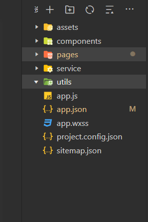

## 划分项目的页面结构

* 底部主要有4个tabBar,分别是`首页`、`分类`、`购物车`、`我的`。

* 我们在`app.json`中使用`tabBar`来写。

  

  

# 首页

* 首先第一个是要有一个导航，每个页面的导航都差不多，颜色都是一样的，只是文字不一样。

* 所以我们可以整理对它们进行一些设置，再在具体的某一个页面中对文字进行单独的设置。

* 整理设置在`app.json`里面就可以进行设置了。有一个`window`的属性。

* 因为文字不同，所以`navigationBarTitleText`就不要设置了，要在每个页面中单独对它进行设置。

  

  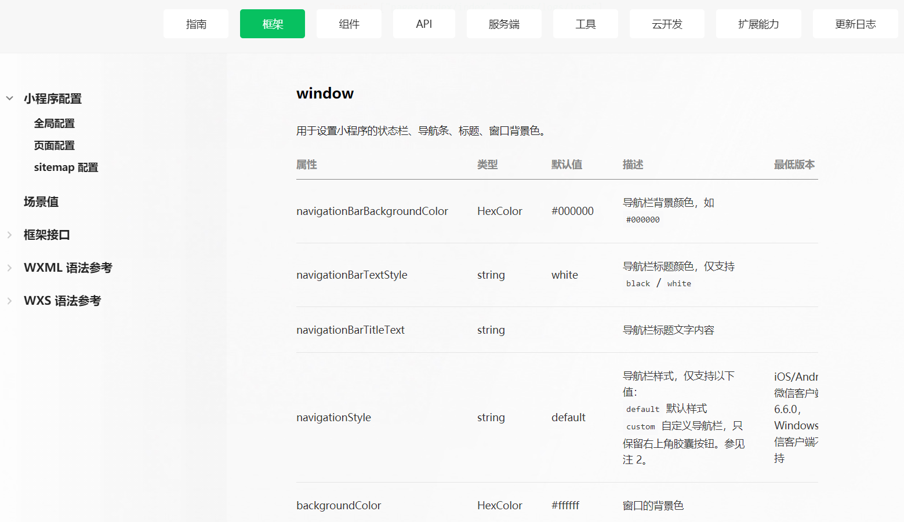

## 请求轮播图和推荐数据

* 在小程序里面做轮播图是非常简单的，因为它提供了对应的内置组件可以直接做轮播图。

* 但是真正开始做轮播图之前我们首先要有轮播图的数据。

* 所以我们要做的第一件事就是先请求数据。

* 老师服务器的轮播图的接口地址是`http://123.207.32.32:8000/home/multidata`，我试了一下，还是可以用的。

* 但是我在做后面的网络请求数据的时候，发现接口就用不了了。

* 在`service`文件夹下新建一个`network.js`文件，在里面给它封装一个函数。

  ~~~javascript
  export default function(options){
   return new Promise((resolve,reject)=>{
    wx.request({
      url:options.url,
      method:options.method || 'get',
      data:options.data || {},
      success:resolve,
      fail:reject
    })
   })
  } 
  ~~~

*  之后在`home.js`里面的`onLoad`生命周期函数中来进行网络请求。(注意：在发出网络请求之前要现将封装的`network.js`这个函数先进行导入才能够使用，而且这里只能写**相对路径**！！)

  ~~~javascript
  // pages/home/home.js
  import request from '../../service/network.js'
  
  Page({
    data: {
      title:'哈哈哈'
    },  
    onLoad:function(options){
      // 1.请求轮播图以及推荐数据
      request({
        url:'http://123.207.32.32:8000/home/multidata'
      }).then(res=>{
        console.log(res);
      })
    }
  })
  ~~~

* 因为首页里面要发出很多的网络请求，请求轮播图的数据，请求下面的衣服图片的数据等，接下来我们需要对网络请求进行一次分层，如果你想请求的所有首页相关的数据的话，我打算再新建一个js文件。

* 总结一下，我们目前是对网络请求封装了三层。

  * 第一层`network.js`是对`wx.request()`网络请求进行了封装。
  * 第二层`home.js`是对`network.js`网络请求进行了封装。(注意：这个`home.js`是在service文件夹里面建的。)
  * 第三层是首页调用`home.js`来请求首页的所有数据。

* 这样的好处是，我首页在请求数据的时候并不需要关心对应的url，我准备把url这些数据全部抽取到`home.js`里面，另外我们还打算将`baseURL`也进行一个抽取。

* 分层处理后各个文件的代码如下：

  

  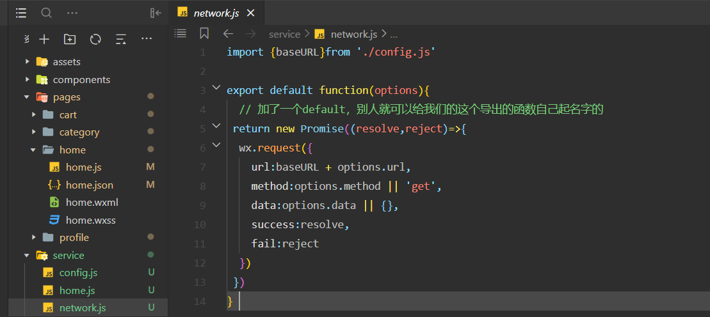

  

  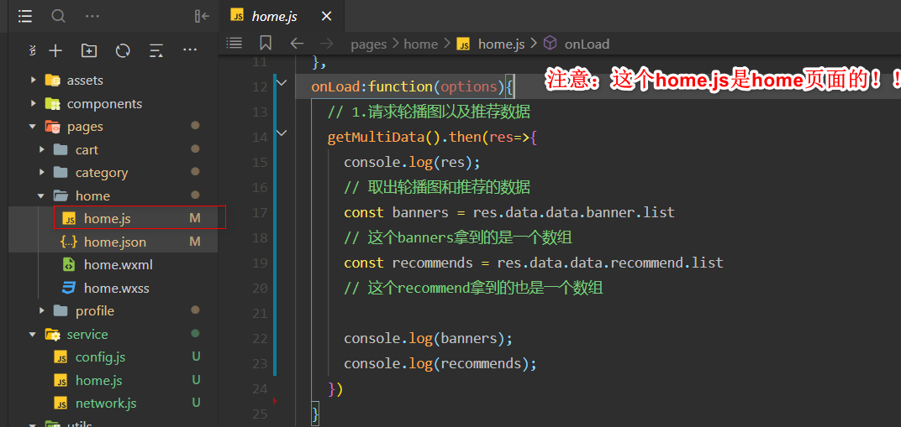

* 在`home.js`里面拿到数据以后最后都要回到`home.wxml`里面进行数据的展示，但是当前拿到的`banners`和`recommends`都是局部变量，是无法直接在`home.wxml`里面使用的。你必须把我们这2个数据放到`home.js`的data里面，只有放到data里面之后才能`home.wxml`才能引用data里面的相关数据。

## 轮播图的展示

* 小程序里面提供了`swiper`这个组件专门用来展示轮播图
* `swiper`里面是放item的，具体放几个item，是跟我们的数据是有关系的。你到时候轮播的时候，有几个数据，就放几个item。因此我们需要进行遍历。
* 遍历的话最好使用block。
* `swiper-item`里面也是需要放一些东西的，因为我们做的是轮播图，相当于你整理是我们的swiper，swiper里面是`swiper-item`，而`swiper-item`里面需要放上一张图片。

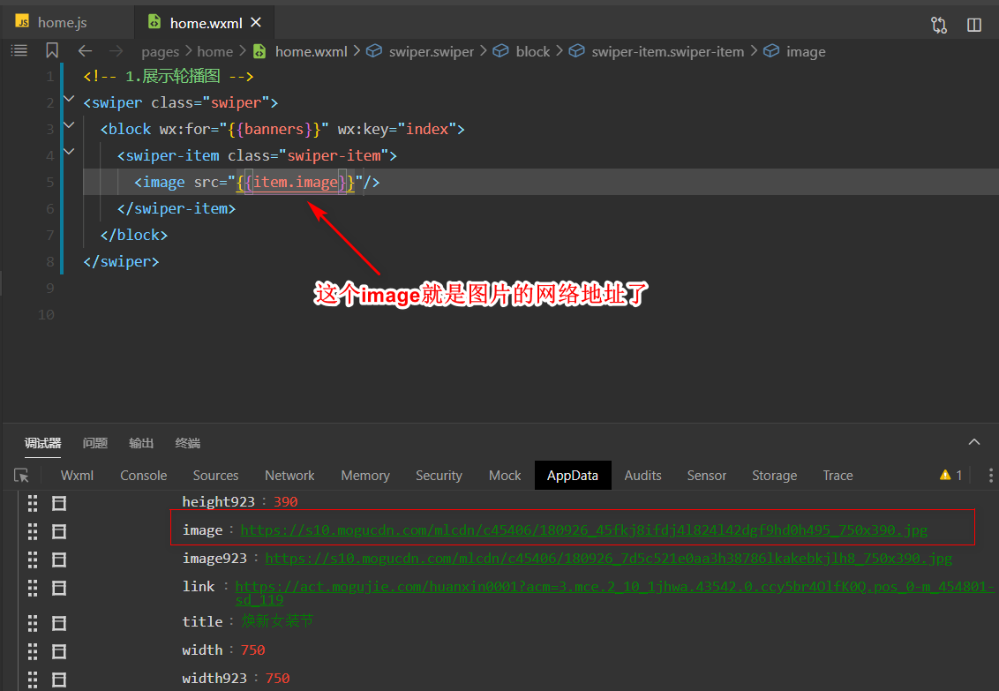

* 但是我们这里显示的图片稍微有些问题，是宽高的比例显示的有点问题。所以给它设置`mode="widthFix"，`这个是可以根据图片的大小显示图片正确的比例的。

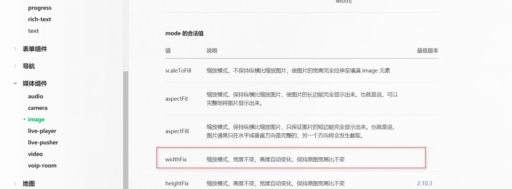

* 还有一个问题，你滚动到最后一张图片的时候，发现滚动不了了，没有轮播效果。而且它这里下面也没有小圆点：指示器。所以我们这里还是有挺多东西没有做的。

* `swiper`组件里面有个`circular`属性，可以设置采用衔接滑动。

* `autoplay`属性，可以设置自动切换。

* `interval`属性可以用来设置自动切换时间间隔，默认是5秒，嫌长的话可以设置短一点。

* `duration`属性可以设置滑动动画时间，你嫌它滚的慢可以设置短一点。

* `indicator-dots`属性可以显示面板指示点，设置为true就可以在图片下面添加小圆点了。

  * 小圆点的颜色有点不对，我们希望和主体颜色一样，而不是默认的灰色。有一个`indicator-color`和`indicator-active-color`属性可以解决这个问题。

* 轮播图就这样做完了。

* 接下来要进行代码优化了，像首页这里我是不希望见到这样一坨一坨代码的。

  

* 我们可以把这些东西单独抽离成一个组件，到时候让别人给我们传入数据，我根据别人传入的数据直接给它展示一个轮播图。这样可以让首页里的代码不会特别特别多。

* 如果一个页面里面的代码多到一定程度的时候，你去维护里面的每一个代码功能的话，它都不是特别好维护。

* 抽离有2种抽离方法：

  * 你可以直接将`home.wxml`里面写的轮播图代码抽到`components`文件夹里面
  * 你也可以将`home.wxml`里面写的轮播图代码抽到`home`文件夹下的新建的`childCpns`文件夹下，这个目录就放首页里面的所有子组件。

* 我们一般按照什么样的原则来决定到底抽到哪里呢？

  * 如果我现在抽的组件只有首页自己会用，别的页面它都不用，这个时候我就抽到首页的子组件里面(`childCpns`文件夹里面)。
  * 如果我现在抽的组件不仅在首页里面用，还在其他的地方也都用，这个时候就可以把组件抽到`components`文件夹里面作为公共的组件使用了。

* 我们这里的轮播图好像只在首页里面才用，但是如果我们统筹整个项目的话，你会发现在其他地方它也是有路面波图的。

  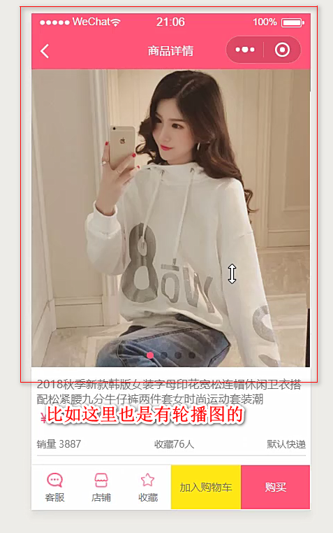

* 所以抽取轮播图组件的话推荐抽到`components`文件夹里面去。

* 这样，不仅首页里面可以使用这个自定义组件，详情页这里也是可以使用自定义组件的。只不过到时候它们展示的数据不一样，或者说图片展示的高度不一样。如果哪些东西不一样的话，你可以把那些不一样的东西抽成一个独立的属性，让外界来决定这个东西的高度，让外界来决定我们的这些数据就可以了。

* 注意：在当前项目里面，我们习惯在所有自定义组件名前面加上一个`w-`的前缀。

* 注意：首页里面要用自定义组件记得在`home.json`里面对自定义组件先进行一个注册。

  

  

  

  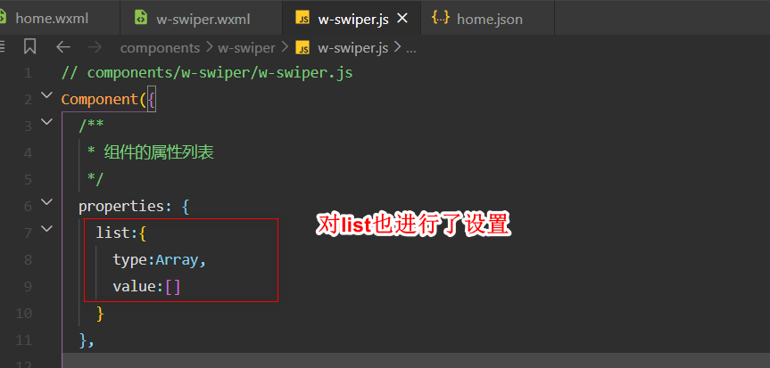

  ## 推荐数据的展示

* 首先1个大view，里面放4个小view。其中具体放几个小view是由数据决定的，这里是4个。

* 里面的4个小view上面是图片，下面是文字。

* 这个推荐数据最后也是写成了一坨wxml，我们也要进行抽离。

* 但是这个抽成自定义组件的话，这个在其他界面就用不到了，我们我们把它抽到`home`文件夹下的`childCpns`文件夹里面。

  

  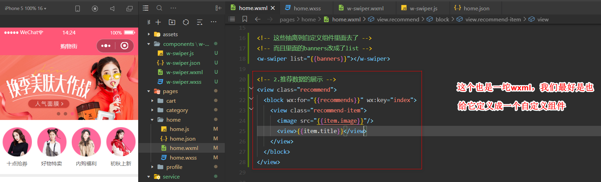

* 最终抽离结果如下：

  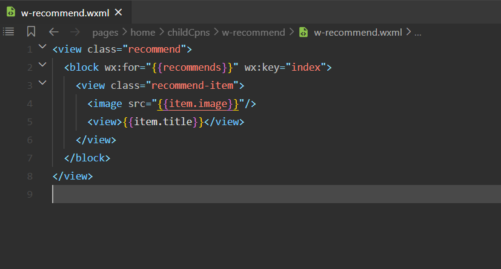

  

  

  

  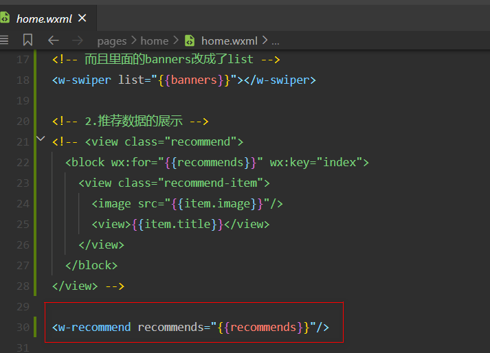

## 本周流行的展示

## 一个bug

我们是在iphone5中进行开发的，页面显示正常，可是如果跳到iphone6上，就显示成这样了

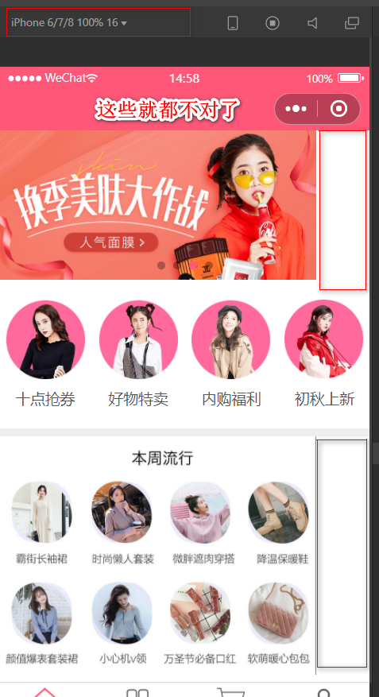

* 原因是图片有默认的宽高:`320*240`，你需要设置它的宽度为100%即可。

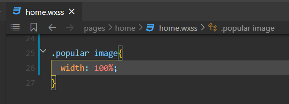

## tab-control组件

* 因为老师已经在之前的视频里讲过这个组件了，老师就直接用了。

* `tab-control`当我内部点击一个选项的时候，到时候它会发出一个事件。 

## 首页商品数据的请求 

* 首页里面的商品分成了3种类型：流行、新款和精选。

**数据模型的设计**

~~~javascript
goods:{
'new':{page:0,1ist:[]},
'pop':{page:0,1ist:[]},
'se11':{page:0,1ist:[]}
~~~

**发送网络请求，将数据储存起来**

**展示所有商品标题，并完成切换**

**自定义w-goods-item组件，并且设置样式**

**自定义w-goods组件，调整样式**

## 商品数据标题展示

* 首先在`home.js`中先定义一个types的数组：`const types = ['pop','new','sell']`
* 然后在事件监听函数`handleTabClick`中设置currentType

## 自定义goods-item

* 这个自定义组件要写到`components`文件夹里面，因为别的地方也是会用到的。
* 这个组件分为几个部分，最上面是图片，下面是标题，最下面是价格和收藏数。
* 老师样式直接就给我们了，没有带我们写，我也就先直接复制用吧，以后有时间再自己写。
* 注意：在wxss中不能引用本地图片，只能引用网络图片。
* 解决方法：我们可以在`w-goods-item.wxml`中使用本地图片。

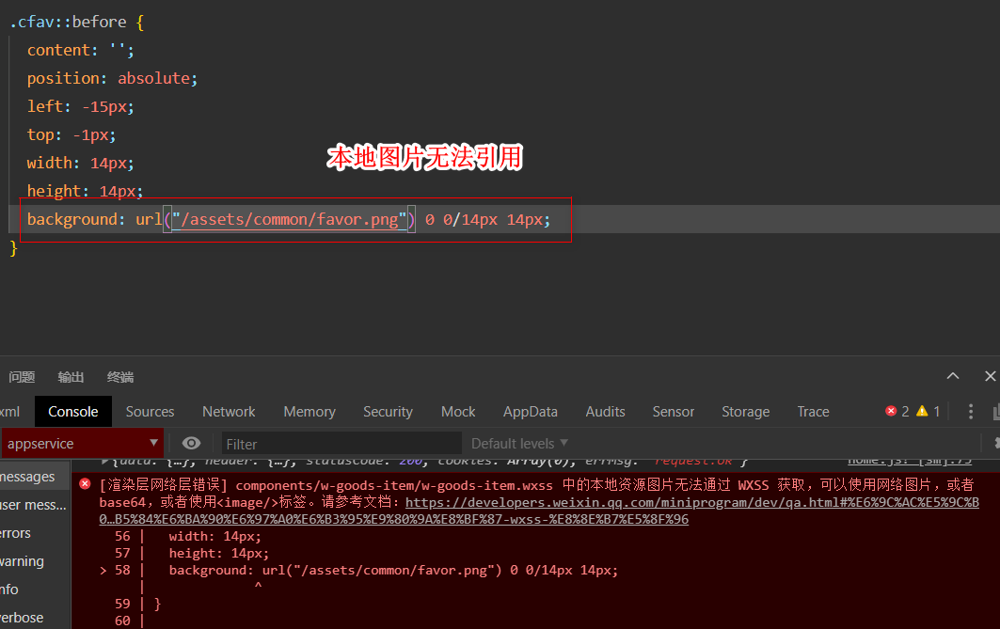

## 自定义goods组件

* 一个个的item是自定义组件，实际上整个大的goods我也会给它封装为一个自定义组件的。

## 首页上拉加载更多

* 等用户把我们当前页面滚动到底部的时候我们就可以上拉加载更多了。
* 这个上拉加载更多比在Vue里面做简单多了！！！！Vue里面还要单独用`better-scroll`，还很麻烦。

## 首页回到顶部功能

* 这个最好也给它做一个独立的组件。
* 在`components`文件夹里面给它新建一个`w-back-top`组件。
* `wx.pageScrollTo`可以用来回到顶部。
* 这个按钮不是一开始就出现的，而是我滚动到一定的位置才出现的。
* 注意：`hidden`属性对于自定义的组件是无效的，而`wx:if`对自定义组件是有效果的。
* 监听页面滚动的函数叫做`onPageScroll`。

## tab-control停留效果 

* 我们先监听滚动，一定滚动到一定位置的时候，我们就把`tab-control`脱离标准流。

* 页面显示是否意味着所有的图片都加载完成呢？不是的
* 因为图片的加载是异步的,所以我们最好等图片加载完的时候再去获取它的高度
* 我们这里影响高度的图片主要是它：

