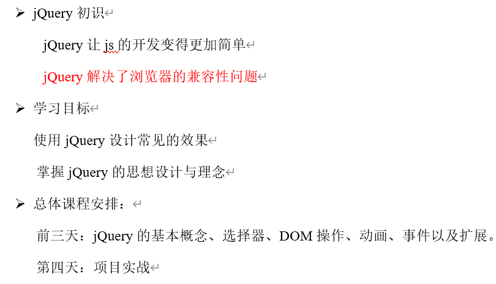
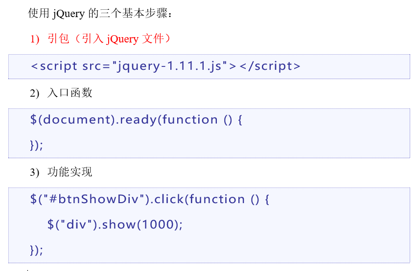
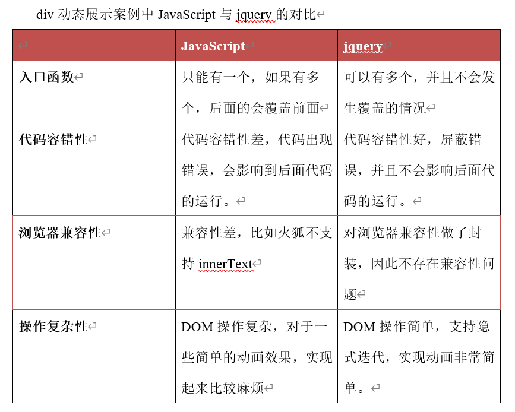
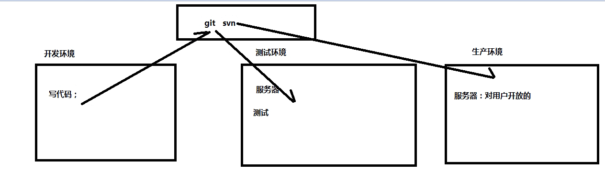
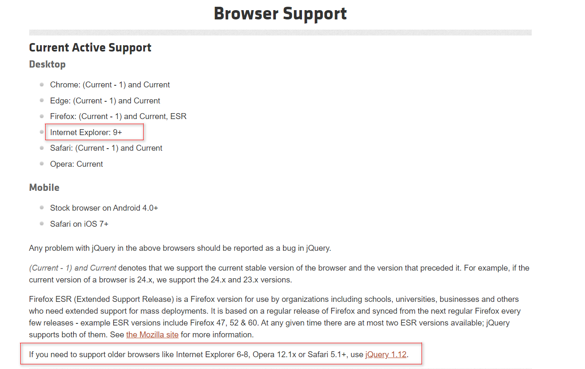
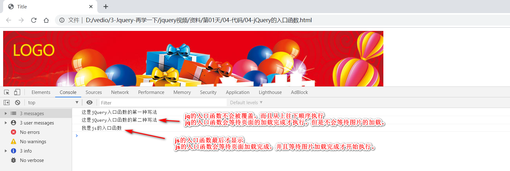
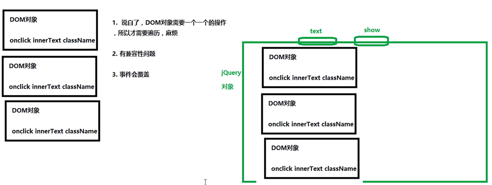

（注1：自己现在的学习进度是：去年大概12月份开始学HTML+CSS,但是看传智播客刘晓强的视频看到一半，今年八月份又重新开始学，看了两个月视频，把HTML和CSS过了一遍，JavaScript视频也从9月份下旬开始看尚学堂的视频看了一个多月大体过完，之后又草草看了W3C的JS入门。11月初弄了博客，开始通过看书进行复习，并写一些博客，补充一些其他知识，目前复习进度有点缓慢）

（注2：截至目前[2019-12-10]自己的《JavaScript高级程序设计》才做笔记到第五章一小半，CSS浮动还没开始复习，但是距离自己做读书笔记起时间已经过去了一个多月时间了，我觉得自己需要一些新鲜东西刺激一下我的大脑了，也许现在时机还不到，自己起码要把CSS再复习一遍，JavaScript起码看到第7章才能开始接触框架，但是想了想还是先预热起来吧，否则感觉自己有点温水煮青蛙了，一直慢吞吞的在做笔记啊）

（注3：搜了一些前端框架有关知识，还是决定把JQuery先学了，主要还是在B站找一些视频来看，虽然说有点老了，打算边学JQuery边复习JavaScript，大体学完后再从主流三大框架[Angular、React、Vue]挑一个Vue来学一下，一定要学到精通，然后再做一两个自己的作品，大体计划就是这样）

（注4：自己在房山的房子6月4号到期，自己也就只有5个多月的时间了，时间还是有点紧迫的。就看5个月后自己的学习情况了，学的还行就辞职转行重新找工作找房子，学的不好就难搞哦）

（注5：我怕时间来不及，还是先学Vue.js吧--2019.12.30）

   (注6：本博文基本上就是看黑马程序员视频里面原生的笔记，简单复制了一下,老师是黑马程序员的老师胡聪聪，录课的时间是2017年的4月份，3年前的课了。——2020.02.12)

   (注7：现在是2020年3月25日，思来想去，自己目前把DOM、AJAX、PHP、JQuery视频都大体过了一遍，现在自己需要做的是先巩固一下看过的视频，而不是再去看别的书了，看书现阶段太慢了，我需要快速接触项目了。等做了一些项目之后再回过头来看书我觉得效果反而会更好)

(注8：现在是2020年7月2日，现在自己要开始重新复习一遍DOM,JQuery,AJAX和PHP，前2个是有关操作DOM的，后2个是有关前后端数据交互的，之前看的视频只是囫囵吞枣的过了一遍，现在回过头来看是根本就没有掌握到。脚踏实地啊，Vue，Node.js之类的不能急了，要把前面的基础给打好了，后面学起来就会很快了，欲速则不达啊，千万不能图快啊。)

(注9：我想了一下，还是不能"双线程"学习，不要想着双管齐下，这回还是一门一门的学习比较好。或者说类似知识(比如DOM和JQuery)不能同时学，但是可以同时学DOM和PHP,同时学的课程最多2门，这样既可以换换脑子，也不会过多分散精力。)

(注10：那我接下来2个月的计划就是这样吧：先学DOM,PHP,学完后再去学JQuery和AJAX,然后学Bootstrap，最后再写一个静态页面(这个静态页面和京东商城几乎一模一样，也是pink老师讲的，叫品优购)，不知道2个月的时间够不够，反正大体先这样吧，到时候再视情况调整。)

(注11：今天是2020年7月20日，开始正式(第二次)学习jQuery，学习过程中和原生的操作DOM进行对比并复习原生DOM操作)

# 课程介绍



> 学习目标：学会如何使用jQuery，掌握jQuery的 常用API,能够使用jQuery实现常用的效果。

# jQuery基本概念

## 为什么要学jQuery

使用javascript开发过程中，有许多的缺点：

1. 查找元素的方法单一，麻烦。
2. 遍历数组很麻烦，通常要嵌套一大堆的for循环。
3. 有兼容性问题。
4. 想要实现简单的动画效果，也很麻烦
5. 代码冗余。

### div动态展示与设置内容案例(原生JS)

```javascript
<!DOCTYPE html>
<html lang="zh-CN">
<head>
  <meta charset="UTF-8">
  <title>Title</title>
  <style>
    div {
      height: 200px;
      margin-bottom: 10px;
      background-color: #a43035;
      display: none;
    }
  </style>
  <script>
    //等待页面加载完成后才会执行。(只有加上window.onload里面的代码才能写到上面，否则不行，会报错)
    window.onload = function () {
      //不爽的地方：
      //1. 代码比较麻烦，需要遍历，可能还需要嵌套。
      //2. 找对象麻烦，方法少，还长
      //3. 会有兼容性问题。
      //4. 如果想要实现简单的动画效果 animate
      //5. js注册事件，会被覆盖，不想覆盖用addEventListener(但又有兼容性问题)
  
      var btn1 = document.getElementById("btn1");
      var btn2 = document.getElementById("btn2");
      var divs = document.getElementsByTagName("div");
  
      btn1.onclick = function () {
        for (var i = 0; i < divs.length; i++) {
          divs[i].style.display = "block";
        }
      };
  
      btn2.onclick = function () {
        for (var i = 0; i < divs.length; i++) {
          //低版本火狐浏览器不支持innerText，支持textContent
          divs[i].innerText = "我是内容";
        }
      };
    };
	
		//window.onload的缺点是，只能存在一个,最后一个有效，前面的都无效
    // window.onload = function(){
    //   console.log('呵呵');
    // };
  </script>
</head>
<body>
<input type="button" value="展示" id="btn1">
<input type="button" value="设置内容" id="btn2">
<div></div>
<div></div>
<div></div>
</body>
</html>
```

分析一下，元素js的缺点：


~~~
1.不能添加多个入口函数（window.onload）,如果添加了多个，后面的会把前面的给覆盖。
2.原生js的api名字都太长太难记。
3.原生js有的时候代码冗余。
4.原生js中有些属性或者方法，有浏览器兼容问题。
5.原生js容错率比较低，前面的代码出了问题，后面的代码执行不了。
~~~

## 什么是jQuery(理解)

> jQuery的官网 [http://jquery.com/](http://jquery.com/)   
>
> jQuery就是一个js库，使用jQuery的话，会比使用JavaScript更简单。


```text
jQuery是一个快速、小型且功能丰富的JavaScript库。
它通过易于使用的，可以跨多种浏览器工作的API让HTML文档遍历和操作，事件处理、动画和Ajax变得非常简单
通过多功能性和可扩展性的结合，jQuery改变了数百万人编写JavaScript的方式。
```

js库：把一些常用到的方法写到一个单独的js文件，使用的时候直接去引用这js文件就可以了。
（animate.js、common.js）

我们知道了，jQuery其实就是一个js文件，里面封装了一大堆的方法方便我们的开发，
其实就是一个加强版的common.js，因此**我们学习jQuery，其实就是学习jQuery这个js文件中封装的一大堆方法**。

## 怎样使用jQuery



### div动态展示与设置内容案例(jQuery)

~~~javascript
<!DOCTYPE html>
<html lang="zh-CN">
<head>
  <meta charset="UTF-8">
  <title>Title</title>
  <style>
    div {
      height: 200px;
      margin-bottom: 10px;
      background-color: #a43035;
      display: none;
    }
  </style>
  
  <!--1. 需要引入jQuery文件-->
  <script src="jquery-1.12.4.js"></script>
  <script>
    
    //2. 入口函数的标准
    $(document).ready(function(){
      //注册事件，把on去掉，是一个方法
      $("#btn1").click(function () {
        //隐式迭代：偷偷的遍历，jQuery会自动的遍历，不需要我们遍历。(不用写for循环了！！)
        //$("div")表示标签选择器，会把3个div全部找到
        //show()方法，里面加数字则会在多少毫秒后执行
        $("div").show(1000);
        //slideDown方法会从上往下显示这3个div
        //$("div").slideDown(1000);
      });
      
     //这个事件也会运行出来，不会覆盖
      // $('#btn1').click(function(){
      //   alert("呵呵");
      // });

      $("#btn2").click(function () {
        //text()方法
        $("div").text("我是内容");
      });
    });
  </script>
</head>
<body>

<input type="button" value="展示" id="btn1">
<input type="button" value="设置内容" id="btn2">
<div></div>
<div></div>
<div></div>
</body>
</html>

		//这又是一个入口函数，不会覆盖前面的入口函数！不像window.onload只能最后一个起作用
		$(document).ready(function(){
			console.log('我又是一个入口函数');
		})
</script>
~~~

  jQuery的优势:

~~~
  1.是可以写多个入口函数的。
  2.jQuery的api名字都容易记忆。
  3.jQuery代码简洁（隐式迭代）。
  4.jQuery帮我们解决了浏览器兼容问题。
  5.容错率较高，前面的代码出来了问题，后面的代码不受影响。
~~~



# jQuery详细解释

### 版本介绍

> 官网下载地址：[http://jquery.com/download/](http://jquery.com/download/)  
> jQuery版本有很多，分为1.x   2.x   3.x     
> 1.x和2.x版本jQuery都不再更新版本了，**现在只更新3.x版本**。

大版本分类：

* 1.x版本：能够兼容IE678浏览器（在国内，只要用jQuery,基本上都用1.x版本，来兼容IE678浏览器）
* 2.x版本：不能兼容IE678浏览器
* 3.x版本：不能兼容IE678浏览器，更加的精简（在国内不流行，因为国内使用jQuery的主要目的就是兼容IE678）


~~~
京东的也用了jQuery,但是淘宝没有用(淘宝号称前端最牛，用了其他的)
~~~

> jquery3.0现在发布了，这个版本自从2014年10月就开始测试了，我们的目标是创建一个更苗条、更快的jquery版本（并且能向后兼容）。我们已经移除了IE旧版本的解决方案，并且带来了一些较为现代的web API，但这是有道理的。3.0是2.x分支的延续，但是有一些突破性的改变。但是1.12和2.2分支将会在同一时间继续获得关键性的支持补丁。但是他们不会再有任何新的功能和重大的修订。jQuery3是jQuery的未来，**如果你需要兼容IE6-8，你可以继续使用1.12版本**。

关于压缩版和未压缩版：  

* jquery.min.js:压缩版本，适用于**生产环境**，因为文件比较小，去除了注释、换行、空格等东西，但是基本没有阅读性。
* jquery.js:未压缩版本，适用于**学习与开发环境**，源码清晰，易阅读。



> 生产环境代码尽可能的要小，省流量，省钱。
>
> 我们开发不用管流量的问题，代码要清晰易阅读。



### 入口函数

> jQuery函数可以写在上边也可以写在下边，但是推荐写在**下边**，而且要使用jQuery必须**引入**jQuery。
>
> 同时建议加上jQuery的入口函数。(jQuery的入口函数是可以不写的,但是不写不好)

使用jQuery的三个步骤：

```javascript
1. 引入jQuery文件
2. 入口函数
3. 功能实现
```

关于jQuery的入口函数：

```javascript
//第一种写法
$(document).ready(function() {
	
});
//第二种写法
$(function() {
	
});
```

jQuery入口函数与js入口函数的对比

~~~
1.	JavaScript的入口函数要等到页面中所有资源（包括图片、文件）加载完成才开始执行。
2.	jQuery的入口函数只会等待文档树加载完成就开始执行，并不会等待图片、文件的加载。
~~~


~~~javascript
<!DOCTYPE html>
<html lang="zh-CN">
<head>
  <meta charset="UTF-8">
  <title>Title</title>
</head>
<body>


<script src="jquery-1.12.4.js"></script>
<script>
  
  //js的入口函数执行要比jQuery的入口函数执行得晚一些。
  //jq的入口函数会等待页面的加载完成才执行，但是不会等待图片的加载。
  //js的入口函数会等待页面加载完成，并且等待图片加载完成才开始执行。
  
  window.onload = function () {
    console.log("我是js的入口函数");
  };
  
  //认识
  $(document).ready(function () {
    console.log("这是jQuery入口函数的第一种写法");
  });
  
  //我们用第二种写法！因为更加简洁
	//这个时不会被前面覆盖的！
  $(function () {
    console.log("这是jQuery入口函数的第二种写法");
  });
</script>
</body>
</html>
~~~



> 举个例子：京东网站的图片很多，如果图片没加载完，你鼠标点击上面的按钮什么的，动态效果不会出来。
>
> 而jQuery即使图片没有加载完，你点击上面的图片，动态效果也会显示的。
>
> 所以推荐写jQuery入口函数，图片多了的话没加载完动态效果也会出来的。

### 了解jQuery的$符号

$是什么？

其实\$就是一个函数：**$()**；**参数不一样，功能不一样**

$常用的几种情况：


### jQuery对象与DOM对象之间的转换（难点）

~~~
1. DOM对象：使用JavaScript中的方法获取页面中的元素返回的对象就是DOM对象。
2. jQuery对象：jQuery对象就是使用jQuery的方法获取页面中的元素返回的对象就是jQuery对象。
3. jQuery对象其实就是DOM对象的包装集（包装了DOM对象的集合（伪数组））
4. DOM对象与jQuery对象的方法不能混用。
~~~

**什么是DOM对象（JS对象）？**

* 使用JavaScript中的方法获取页面中的元素返回的对象就是DOM对象。
* DOM对象只可以使用DOM对象的方法和属性

**什么是jQuery对象？**

* jQuery对象就是使用jQuery的方法获取页面中的元素返回的对象就是jQuery对象。

* jQuery对象只能使用jQuery对象的方法

**jQuery对象和DOM对象的联系**

* jQuery对象里面放了DOM对象

> 首先记住，jQuery对象是个伪数组（你就可以把jQuery对象理解为一个数组！！！！！！！！！）
>
> 然后举个例子，一个数组里放了一个对象，那个对象有个方法。类似于你有一个儿子，你的儿子可以取得很高的成就(有一个方法)，不代表你也可以取得很高的成就。
>
> 再来一个例子，你把衣服放在洗衣机里，衣服可以用来穿这个功能，不能因为衣服在洗衣机里面，洗衣机也就有了"穿"这个功能。你只能把衣服给“取”出来(arr[0]),"取"出来后才能穿。
>
> 虽然jQuery对象和DOM对象里的方法不能混着用，但是两个对象之间可以相互转换，转换完后就可以用对方的方法了。

~~~html
var arr = [{
	  name: andy;
		say: function(){
			console.log('你好')
		}
}]

arr[0].say();			//数组里面的对象有个方法，执行它，不会报错
arr.say();				//数组对象有方法，但是数组本身没有这个方法，执行这个不存在的方法，所以会报错
~~~

**深入了解jQuery对象**

* jQuery对象其实就是DOM对象的包装集（包装了DOM对象的集合（伪数组））

* 联想记忆：衣服和洗衣机的关系




> 处理DOM对象是用手洗衣服，处理jQuery对象是洗衣机洗衣服。(洗衣机有一系列按钮，正如jQuery封装了一系列的方法函数)
>
> 举个例子：你调用text()方法的时候，最终你操作的还是内部的DOM对象(改内容改的还是DOM对象，只是具体怎么改不用你去操心了

DOM对象转换成jQuery对象：【联想记忆：花钱升级】

```javascript
var $obj = $(domObj);
//$(document).ready(function(){});就是典型的DOM对象转jQuery对象
```

jQuery对象转换成DOM对象：

```javascript
var $li = $(“li”);

//第一种方法（推荐使用）
$li[0]

//第二种方法
$li.get(0)

```

~~~javascript
<!DOCTYPE html>
<html lang="zh-CN">
<head>
  <meta charset="UTF-8">
  <title>Title</title>
  
</head>
<body>
<ul>
  <li id="cloth">衣服</li>
  <li>裤子</li>
  <li>裤衩子</li>
  <li>袜子</li>
</ul>

<script src="jquery-1.12.4.js"></script>
<script>
  
  $(function () {
    
    //1. 什么是DOM对象(js对象):使用js的方式获取到的元素就是js对象（DOM对象）
    //var cloth = document.getElementById("cloth");
    //cloth.style.backgroundColor = "pink";
    
    //2. 什么是jq对象：使用jq的方式获取到的元素就是jq对象
    //var $li = $("li");
    //console.log($li);
    //$li.text("我改了内容");
    
    
    //3. jq对象与js对象的区别
    //js对象对象不能调用jq对象的方法
    //var cloth = document.getElementById("cloth");
    //cloth.text("呵呵");
    
    //4. jq对象与js对象的联系
    //jq对象其实就是js对象的一个集合，伪数组，里面存放了一大堆的js对象(宏观上)
    
    
    
    //jquery对象能不能调用DOM对象的方法
    //var $li = $("li");
    //$li[0].setAttribute("name","hehe");
    
    //DOM无法调用jQuery对象的方法：为什么：因为是两个不同对象
    //DOM对象调用jQuery对象的方法。需要把DOM对象转换成jQuery对象。
    var cloth = document.getElementById("cloth");
    
    //DOM对象转变成jQuery对象(用钱[dollar]买一台洗衣机，手洗变机洗)
    //$(cloth).text("呵呵");
    
    //jQuery对象怎么转换成DOM对象（取出来）
    var $li = $("li");
    $li[1].style.backgroundColor = "red";
    $li.get(2).style.backgroundColor = "yellow";
    
    
    //1. 什么是DOM对象：用js的方式获取到的对象时DOM对象
    //2. jQuery对象：用jq的方式获取到的对象时jq对象
    //3. 区别与联系
    //4. 区别:js对象与jq对象的方法不能混着用
    //5. 联系：
      // DOM--> jQuery  $()
      // jQuery--》 DOM  $li[0]  $li.get(0)
  });
</script>

</body>
</html>
~~~

### 区分jQuery和JavaScript

JavaScript是一门编程语言，jQuery是用JavaScript实现的一个JavaScript库，目的是简化我们的开发。

（联想记忆：jQuery是个方便的洗衣机，但你也不能扛着洗衣机去出差，有时候不得不用手洗衣服，所以JavaScript才是根本！而jQuery则是前端程序员的基本功，以后可能用不到，但是不能不会！）


#### 案例：表格隔行变色

~~~javascript
<!DOCTYPE html>
<html lang="zh-CN">
<head>
  <meta charset="UTF-8">
  <title>Title</title>
</head>
<body>

<ul>
  <li>我是第1个li</li>
  <li>我是第2个li</li>
  <li>我是第3个li</li>
  <li>我是第4个li</li>
  <li>我是第5个li</li>
  <li>我是第6个li</li>
  <li>我是第7个li</li>
  <li>我是第8个li</li>
  <li>我是第9个li</li>
  <li>我是第10个li</li>
</ul>

<script src="jquery-1.12.4.js"></script>
<script>
  $(function () {
    
    //就这么写，会不会报错，会不会有效果(是不会报错的！！！)
  	//var $lis = $("li"); 变量lis前面加$，仅仅是为了区分是jq对象，不加也行，没有限制！！
    var lis = $("li");
    for (var i = 0; i < lis.length; i++) {
      if (i % 2 == 0) {
        // lis:jq对象
        // lis[i]:DOM对象，通过下标取出来了,所以可以用下面这个方法
        //但是我们以后不会这么去写，这样实在是太乱了，又有jq对象又有DOM对象
        lis[i].style.backgroundColor = "pink";
      } else {
        lis[i].style.backgroundColor = "hotpink";
      }
    }
  });
</script>
</body>
</html>
~~~

### $符号的实质(function)

~~~javascript
<!DOCTYPE html>
<html lang="zh-CN">
<head>
  <meta charset="UTF-8">
  <title>Title</title>
</head>
<body>
<script src="jquery-1.12.4.js"></script>
<script>
  
  
  //$其实就是一个函数，以后用$的时候，记得跟小括号 $();
  //参数不同，功能就不同
  //3种用法

  //1. 参数是一个function, 入口函数
  $(function () {
    
  });
  console.log(typeof $);    //function
	console.log($ === jQuery);	//true
  
  //2.$(dom对象)  把dom对象转换成jquery对象
  //document是dom对象，而ready是jq的方法，在dom对象前加个$就变成jq对象了，
  //就可以用ready方法了(花点钱$,把dom对象装饰一下，就变成jq对象了)

  //$(document).ready(function () {
  //
  //  });
  
  //3. 参数是一个字符串,用来找对象
  //$("div")    $("#btn")   $(".current")  $("div ul")
</script>
</body>
</html>
~~~

# jQuery选择器

## 什么是jQuery选择器？

jQuery选择器是jQuery为我们提供的**一组方法**，让我们更加方便的**获取到页面中的元素**。注意：**jQuery选择器返回的是jQuery对象**。

> 选择器就是为了找对象的。

jQuery选择器有很多，基本**兼容了CSS1到CSS3所有的选择器**（比如jQuery选择器还可以这样写：$("div ul") ,这种是后代选择器），并且jQuery还添加了很多更加复杂的选择器。【查看jQuery文档】

jQuery选择器虽然很多，但是**选择器之间可以相互替代**，就是说**获取一个元素，你会有很多种方法获取到**。所以我们平时真正能用到的只是少数的最常用的选择器。

## 基本选择器

| 名称       | 用法               | 描述                                                         |
| ---------- | :----------------- | :----------------------------------------------------------- |
| ID选择器   | $(“#id”);          | 获取指定ID的元素                                             |
| 类选择器   | $(“.class”);       | 获取同一类class的元素                                        |
| 标签选择器 | $(“div”);          | 获取同一类标签的所有元素                                     |
| 并集选择器 | $(“div,p,li”);     | 使用逗号分隔，只要符合条件之一就可。（获取所有的div、p、li元素） |
| 交集选择器 | $(“div.redClass”); | 获取class为redClass的div元素（注意区分后代选择器。）         |

> 总结：跟CSS的选择器用法一模一样。

~~~javascript
<!DOCTYPE html>
<html lang="zh-CN">
<head>
  <meta charset="UTF-8">
  <title>Title</title>
</head>
<body>

<ul>
  <li>1</li>
  <li>2</li>
  <li>3</li>
  <li id="four">4</li>
  <li>5</li>
  <li class="green yellow">6</li>
  <li class="green">7</li>
  <li>8</li>
  <li>9</li>
  <li>10</li>
</ul>

<div class="green">111</div>
<div class="green">111</div>
<div class="green">111</div>
<div class="green">111</div>

<script src="jquery-1.12.4.js"></script>
<script>
  //入口函数
  $(function () {
    
    //jquery如何设置样式
    //css(name, value)
    //name:样式名  value：样式值
    
    //id选择器  $("#id")
    //$("#four").css("backgroundColor", "red");
  
  
    //$(".green").css("backgroundColor", "green");
  
  
    //$("li").css("color", "red");
  
  
    //并集选择器(和)
    //$("#four,.green").css("backgroundColor", "pink");
    
    //交集选择器(并)
    //$("li.green").css("backgroundColor", "red");
    $(".green.yellow").css("backgroundColor", "pink");
    
  });
  
</script>
</body>
</html>
~~~

## 层级选择器

| 名称       | 用法        | 描述                                                        |
| ---------- | ----------- | ----------------------------------------------------------- |
| 子代选择器 | $(“ul>li”); | 使用>号，获取儿子层级的元素，注意，并不会获取孙子层级的元素 |
| 后代选择器 | $(“ul li”); | 使用空格，代表后代选择器，获取ul下的所有li元素，包括孙子等  |

> 总结：跟CSS的选择器用法一模一样。

~~~javascript
<!DOCTYPE html>
<html lang="zh-CN">
<head>
  <meta charset="UTF-8">
  <title>Title</title>
</head>
<body>

<div id="father">
  <div>11</div>
  <div>22
    <p>221</p>
    <p>222</p>
    <p>223</p>
  </div>
  <div>33</div>
  <div>44</div>
  <div>55</div>
  <p>66</p>
  <p>77</p>
  <p>88</p>
</div>

<script src="jquery-1.12.4.js"></script>
<script>
  $(function () {

    //假设s1,s2是2个选择器
    //$("s1,s2")// 并集选择器
    //$("s1 s2")// 后代选择器
    //$("s1>s2")// 子代选择器
    
    //$("li.green")  最常用：既要是标签，还要是类
    //$("s1s2") //交集选择器
    
    
    //$("#father>p").css("backgroundColor", "red");
    $("#father p").css("backgroundColor", "red");
  });
</script>

</body>
</html>
~~~

## 过滤选择器

| 名称         | 用法                               | 描述                                                         |
| ------------ | ---------------------------------- | ------------------------------------------------------------ |
| :eq（index） | $(“li:eq(2)”).css(“color”, ”red”); | 获取到的li元素中，选择索引号为2的元素，索引号index从0开始。(eq是equal相等的意思) |
| :odd         | $(“li:odd”).css(“color”, ”red”);   | 获取到的li元素中，选择索引号为奇数的元素                     |
| :even        | $(“li:even”).css(“color”, ”red”);  | 获取到的li元素中，选择索引号为偶数的元素                     |

> 课程中只讲了这3个，其他的都没讲。
>
> 这类选择器都带冒号:

#### 案例：隔行变色(过滤选择器)

~~~javascript
<!DOCTYPE html>
<html lang="zh-CN">
<head>
  <meta charset="UTF-8">
  <title>Title</title>
</head>
<body>
<ul>
  <li>我是第1个li</li>
  <li>我是第2个li</li>
  <li>我是第3个li</li>
  <li>我是第4个li</li>
  <li>我是第5个li</li>
  <li>我是第6个li</li>
  <li>我是第7个li</li>
  <li>我是第8个li</li>
  <li>我是第9个li</li>
  <li>我是第10个li</li>
</ul>

<script src="jquery-1.12.4.js"></script>
<script>
    $(function(){
      //指的是下标为偶数(下标是从0开始的)
      $("li:even").css('backgroundColor','red');
      $("li:odd").css('backgroundColor','yellow');
      
      // $("li:first").css('fontSize','32px');
      // $("li:last").css('fontSize','48px');
      $("li:eq(2)").css('backgroundColor','green');
    });  
</script>
</body>
</html>
~~~

## 筛选选择器(方法)

| 名称               | 用法                        | 描述                             |
| ------------------ | --------------------------- | -------------------------------- |
| children(selector) | $(“ul”).children(“li”)      | 相当于$(“ul>li”)，子类选择器     |
| find(selector)     | $(“ul”).find(“li”);         | 相当于$(“ul li”),后代选择器      |
| siblings(selector) | $(“#first”).siblings(“li”); | 查找兄弟节点，不包括自己本身。   |
| parent()           | $(“#first”).parent();       | 查找父亲                         |
| eq(index)          | $(“li”).eq(2);              | 相当于$(“li:eq(2)”),index从0开始 |
| next()             | $(“li”).next()              | 找下一个兄弟                     |
| prev()             | $(“li”).prev()              | 找上一次兄弟                     |

> 筛选选择器的功能与过滤选择器有点类似，但是用法不一样，筛选选择器主要是方法。以前的选择器都是写在字符串里面的，而它是写在字符串外面的。
>
> children找的是子代(亲儿子)，而find找的是后代(儿子，孙子，重孙子...),parent找的则是爹，siblings找的是兄弟(不包括自己)

#### 案例1：下拉菜单

> this+children+mouseenter+mouseleave

~~~javascript
<!DOCTYPE html>
<html>
<head lang="en">
  <meta charset="UTF-8">
  <title></title>
  <style type="text/css">
    * {
      margin: 0;
      padding: 0;
    }
    
    ul {
      list-style: none;
    }
    
    .wrap {
      width: 330px;
      height: 30px;
      margin: 100px auto 0;
      padding-left: 10px;
      background-image: url(imgs/bg.jpg);
    }
    
    .wrap li {
      background-image: url(imgs/libg.jpg);
    }
    
    .wrap > ul > li {
      float: left;
      margin-right: 10px;
      position: relative;
    }
    
    .wrap a {
      display: block;
      height: 30px;
      width: 100px;
      text-decoration: none;
      color: #000;
      line-height: 30px;
      text-align: center;
    }
    
    .wrap li ul {
      position: absolute;
      top: 30px;
      display: none;
    }
  </style>
  <script src="../jquery-1.12.4.js"></script>
  <script>
    $(function () {
      
      //mouseover：鼠标经过事件(会冒泡)
      //mouseout:鼠标离开事件
      
      //mouseenter:鼠标进入事件（不会冒泡）
      //mouseleave：鼠标离开事件
      
     //给它起个名字更好
      var $li = $(".wrap>ul>li");
      
      //给li注册鼠标经过事件，让自己的ul显示出来
      $li.mouseenter(function () {
        //找到所有的儿子，并且还得是ul
        
        // console.log(this);
        // 这个this返回的是JS对象!!要转换为jq对象！
        $(this).children("ul").show();
      });
  
      $li.mouseleave(function () {
        $(this).children("ul").hide();
      }); 
    });
  </script>
</head>
<body>
<div class="wrap">
  <ul>
    <li>
      <a href="javascript:void(0);">一级菜单1</a>
      <ul class="ul">
        <li><a href="javascript:void(0);">二级菜单11</a></li>
        <li><a href="javascript:void(0);">二级菜单12</a></li>
        <li><a href="javascript:void(0);">二级菜单13</a></li>
      </ul>
    </li>

    <li>
      <a href="javascript:void(0);">一级菜单2</a>
      <ul>
        <li><a href="javascript:void(0);">二级菜单21</a></li>
        <li><a href="javascript:void(0);">二级菜单22</a></li>
        <li><a href="javascript:void(0);">二级菜单23</a></li>
      </ul>
    </li>

    <li>
      <a href="javascript:void(0);">一级菜单3</a>
      <ul>
        <li><a href="javascript:void(0);">二级菜单31</a></li>
        <li><a href="javascript:void(0);">二级菜单32</a></li>
        <li><a href="javascript:void(0);">二级菜单33</a></li>
      </ul>
    </li>

  </ul>
</div>

</body>
</html>
~~~

> 不用写for循环，感觉整个人生都完满了。
>
> 学DOM时也写过新浪下拉菜单)

#### 案例2：突出展示

> siblings+find

~~~javascript
<!DOCTYPE html>
<html>
<head lang="en">
  <meta charset="UTF-8">
  <title></title>
  <style type="text/css">
    * {
      margin: 0;
      padding: 0;
    }
    
    ul {
      list-style: none;
    }
    
    body {
      background: #000;
    }
    
    .wrap {
      margin: 100px auto 0;
      width: 630px;
      height: 394px;
      padding: 10px 0 0 10px;
      background: #000;
      overflow: hidden;
      border: 1px solid #fff;
    }
    
    .wrap li {
      float: left;
      margin: 0 10px 10px 0;
      
    }
    
    .wrap img {
      display: block;
      border: 0;
    }

    .wrap img {
      display: block;
      border: 0;
    }
  </style>
  
  <script src="../jquery-1.12.4.js"></script>
  <script>
    $(function () {
      
      $(".wrap>ul>li").mouseenter(function () {
        //当前的li不透明度为1，并且除了他以外的所有兄弟不透明度为0.4
        $(this).css("opacity", "1").siblings().css("opacity", "0.4");
      });
      
      $(".wrap").mouseleave(function () {
        //离开这个大盒子的时候让所有的li都变亮
        //$("li");
        //$(".wrap li");
        //$(".wrap>ul>li")
        
        //$(this).children().children("li");
        //children找的是子代(亲儿子)，而find找的是后代(儿子，孙子，重孙子...)
        $(this).find('li').css("opacity", 1);
      });
    });
  </script>
  
</head>
<body>
<div class="wrap">
  <ul>
    <li><a href="#"></a></li>
    <li><a href="#"></a></li>
    <li><a href="#"></a></li>
    <li><a href="#"></a></li>
    <li><a href="#"></a></li>
    <li><a href="#"></a></li>
  </ul>
</div>
</body>
</html>
~~~

> opacity属性是CSS3新增的，用来设置元素的不透明级别。
>
> DOM里要用排他思想，jq里面不需要排他了(链式编程，用点号)

#### 案例3：手风琴

> next+parent
>
> 为什么链式编程能一直链下去？因为jQuery方法能一直返回一个jQuery对象。(但有一种情况不能一直链下去，具体是什么老师没有说)

~~~javascript
<!DOCTYPE html>
<html>
<head lang="en">
  <meta charset="UTF-8">
  <title></title>
  <style type="text/css">
    * {padding: 0;margin: 0;}
    ul { list-style-type: none;}
    
    .parentWrap {
      width: 200px;
      text-align:center;
      
    }
    
    .menuGroup {
      border:1px solid #999;
      background-color:#e0ecff;
    }
    
    .groupTitle {
      display:block;
      height:20px;
      line-height:20px;
      font-size: 16px;
      border-bottom:1px solid #ccc;
      cursor:pointer;
    }
    
    .menuGroup > div {
      height: 200px;
      background-color:#fff;
      display:none;
    }
  
  </style>
  
  <script src="jquery-1.12.4.js"></script>
  <script>
      $(function () {
          //思路分析：
          //1. 给所有的span注册点击事件，让当前span的兄弟div显示出来
          $(".groupTitle").click(function () {
            //下一个兄弟：nextElementSibling
            
            //链式编程：在jQuery里面，方法可以一直调用下去。
           	   $(this).next().slideDown(200).parent().siblings().children("div").slideUp(200);
          });
      });
  </script>
</head>
<body>
<ul class="parentWrap">
  <li class="menuGroup">
    <span class="groupTitle">标题1</span>
    <div>我是弹出来的div1</div>
  </li>
  <li class="menuGroup">
    <span class="groupTitle">标题2</span>
    <div>我是弹出来的div2</div>
  </li>
  <li class="menuGroup">
    <span class="groupTitle">标题3</span>
    <div>我是弹出来的div3</div>
  </li>
  <li class="menuGroup">
    <span class="groupTitle">标题4</span>
    <div>我是弹出来的div4</div>
  </li>
</ul>
</body>
</html>
~~~

#### 案例4：淘宝精品

> index+eq

~~~javascript
<!DOCTYPE html>
<html>
<head lang="en">
  <meta charset="UTF-8">
  <title></title>
  <style type="text/css">
    * {
      margin: 0;
      padding: 0;
      font-size: 12px;
    }
    
    ul {
      list-style: none;
    }
    
    a {
      text-decoration: none;
    }
    
    .wrapper {
      width: 298px;
      height: 248px;
      margin: 100px auto 0;
      border: 1px solid pink;
      overflow: hidden;
    }
    
    #left, #center, #right {
      float: left;
    }
    
    #left li, #right li {
      /*repeat-x表示背景图片在横向上平铺*/
      background: url(images/lili.jpg) repeat-x;
    }
    
    #left li a, #right li a {
      display: block;
      width: 48px;
      height: 27px;
      border-bottom: 1px solid pink;
      line-height: 27px;
      text-align: center;
      color: black;
    }
    
    #left li a:hover, #right li a:hover {
      background-image: url(images/abg.gif);
    }
    
    #center {
      border-left: 1px solid pink;
      border-right: 1px solid pink;
    }
  </style>
  
  <script src="../jquery-1.12.4.js"></script>
  <script>
    $(function () {
      
      //找不到对象
      $(function () {
        $("#left>li").mouseenter(function () 
          //左边用的是过滤选择器：要拼串，比较麻烦
          $("#center>li:eq(" + $(this).index() + ")").show().siblings().hide();
        });
        
        //右边用的是筛选选择器：不用拼串了，比较方便
        $("#right>li").mouseenter(function () {
          $("#center>li").eq($(this).index() + 9).show().siblings().hide();
        });
      })
    });
    
    //      $("#left>li").mouseenter(function () {
    //        //让center中对应下标的li显示，其他li隐藏
		//				idx是一个变量，变量是不能之间写到字符串“”里面的！！！要拼串，有点麻烦
    //        var idx = $(this).index();
    //        $("#center>li:eq(" + idx + ")").show().siblings().hide();
    //      });
    //
    //      $("#right>li").mouseenter(function () {
    //        var idx = $(this).index() + 9;
    //        $("#center>li").eq(idx).show().siblings().hide();
    //
    //        //$("#center>li").eq(idx)  :jq对象——用得多
    //        //$("#center>li").get(idx);：js对象——用得少
    //      });
    //    });
  </script>

</head>
<body>
<div class="wrapper">
  
  <ul id="left">
    <li><a href="#">女靴</a></li>
    <li><a href="#">雪地靴</a></li>
    <li><a href="#">冬裙</a></li>
    <li><a href="#">呢大衣</a></li>
    <li><a href="#">毛衣</a></li>
    <li><a href="#">棉服</a></li>
    <li><a href="#">女裤</a></li>
    <li><a href="#">羽绒服</a></li>
    <li><a href="#">牛仔裤</a></li>
  </ul>
  <ul id="center">
    <li><a href="#"></a></li>
    <li><a href="#"></a></li>
    <li><a href="#"></a></li>
    <li><a href="#"></a></li>
    <li><a href="#"></a></li>
    <li><a href="#"></a></li>
    <li><a href="#"></a></li>
    <li><a href="#"></a></li>
    <li><a href="#"></a></li>
    <li><a href="#"></a></li>
    <li><a href="#"></a></li>
    <li><a href="#"></a></li>
    <li><a href="#"></a></li>
    <li><a href="#"></a></li>
    <li><a href="#"></a></li>
    <li><a href="#"></a></li>
    <li><a href="#"></a></li>
    <li><a href="#"></a></li>
  
  </ul>
  <ul id="right">
    <li><a href="#">女包</a></li>
    <li><a href="#">男靴</a></li>
    <li><a href="#">登山鞋</a></li>
    <li><a href="#">皮带</a></li>
    <li><a href="#">围巾</a></li>
    <li><a href="#">皮衣</a></li>
    <li><a href="#">男毛衣</a></li>
    <li><a href="#">男棉服</a></li>
    <li><a href="#">男包</a></li>
  </ul>

</div>
</body>
</html>
~~~

## 补充：index方法详解

~~~javascript
<!DOCTYPE html>
<html lang="zh-CN">
<head>
  <meta charset="UTF-8">
  <title>Title</title>
</head>
<body>
<ul>
  <li><a href="#">我是链接</a></li>
  <li><a href="#">我是链接</a></li>
  <li><a href="#">我是链接</a></li>
  <li><a href="#">我是链接</a></li>
  <li><a href="#">我是链接</a></li>
  <li><a href="#">我是链接</a></li>
  <li><a href="#">我是链接</a></li>
  <li><a href="#">我是链接</a></li>
  <li><a href="#">我是链接</a></li>
</ul>

<script src="jquery-1.12.4.js"></script>
<script>
  $(function () {
    //index()会返回当前元素在所有兄弟元素里面的索引。
    $("li").click(function () {
      //jq里的index是个函数！！！后面要加小括号
      //console.log($(this).index);		//显示的是一个函数
      console.log($(this).index());	//这个才显示索引号
    });
  
   	$("a").click(function () {
      //index()会返回当前元素在所有兄弟元素里面的索引。
      //a没有兄弟！！其他的a不是它的亲兄弟，而是堂兄弟！！！
      //你爸爸和你二叔是亲兄弟，而你和你堂弟就不是亲兄弟！！！
      console.log($(this).index());	
    });
  });
</script>
</body>
</html>
~~~

# 第一天复习

~~~javascript
<!DOCTYPE html>
<html lang="zh-CN">
<head>
  <meta charset="UTF-8">
  <title>Title</title>
</head>
<body>

<script src="jquery-1.12.4.js"></script>
<script>
  
  
  //jquery:简单、粗暴
  
  //jq和js的关系
  //js是什么？ js是一门编程语言
  //jq仅仅是基于js的一个库，jq可理解为就是开发js的一个工具
  //没有js就不会有jq(在移动端就不会用jq,但会用js)
  //js才是根本！！！
  
  
  //概念
  //1. 为什么要学jquery ？ 简单，粗暴 没有兼容性问题
  //2. 什么是jquery？js库，说白了就是js文件，里面有一大堆的方法
  //3. 使用jquery的步骤：  1. 引入jquery文件 2. 入口函数 功能实现
  //4. 版本：1.x 2.x 3.x   1.x   压缩版和未压缩版
  //5. 入口函数：  $(document).ready(function)  $(function(){})
  //6. jQuery对象与DOM对象
    //区别：方法不能混用
    //联系： DOM-->jq   花钱  jq-->dom  [0]  get(0)
  
  
  //$的实质：function
  
//  console.log($ === jQuery);
//  $(function () {
//
//  });
  
  
  //选择器
  
  //基本选择器  标签 类  id选择器  交集  并集
  //层级选择器： 子代 后代
  
  //过滤选择器：
  //:odd:奇数  even:偶数  :eq：指定下标
  //:first  :last  :gt  :lt

  //筛选选择器
  //children():找儿子
  //find():找后代
  //parent():找爹
  //siblings():找兄弟，不包括自己
  //next:下一个兄弟
  //prev:上一次兄弟
  //eq:指定下标
  
  //index()：返回的当前元素在所有兄弟里面的索引。
</script>
</body>
</html>
~~~

# jQuery操作样式

> 能写到style里面的叫做样式。

## CSS操作：(对应原生JS的style)

> 功能：设置或者操作样式，操作的是style属性

设置单个样式：

~~~javascript
//name：需要设置的样式名称
//value：对应的样式值
css（name，value）；
//使用案例
$("#one").css("background"，"gray");		//将背景色修改为灰色
~~~

设置多个样式:

~~~javascript
//参数是一个对象，对象中包含了需要设置的样式名和样式值css（obj）；
//使用案例
$("#one").css({
	"background"："gray",
	"width"："400px",
	"height"："200px"
});
~~~

获取样式：

~~~javascript
//name：需要获取的样式名称
css(name);
//案例
$("div").css（"background-color"）;
~~~

注意：获取样式操作只会返回第一个元素对应的样式值。

隐式送代：

1.设置操作的时候，如果是多个元素，那么给所有的元素设置相同的值

2.获取操作的时候，如果是多个元素，那么只会返回第一个元素的值。

### 基本使用

~~~javascript
<!DOCTYPE html>
<html lang="zh-CN">
<head>
  <meta charset="UTF-8">
  <title>Title</title>
</head>
<body>

<ul>
  <li>高圆圆</li>
  <li>周二珂</li>
  <li>冯提莫</li>
  <li>郑爽</li>
</ul>

<script src="jquery-1.12.4.js"></script>
<script>
  
  $(function () {
    //css(name, value)
    //修改单个样式
    //name:样式名 value:样式值
    /*
    $("li")
      .css("backgroundColor", "pink")
      .css("color", "red")
      .css("fontSize", "32px");
    */
    
    //css(obj)
    //修改多个样式
    /*
    $("li").css({
      backgroundColor:"pink",
      color: "red",
      fontSize:"32px",
      border: "1px solid black"
    });
    
    */
    //获取样式
    //css(name)
    //name:想要获取的样式
    $("li").eq(0).css("fontSize", "20px");
    $("li").eq(1).css("fontSize", "21px");
    $("li").eq(2).css("fontSize", "22px");
    $("li").eq(3).css("fontSize", "23px");
    
    //A:20  b:21  c:22   d:23  e:16  f:[20, 21, 22, 23]  答案：A
    
    
    //隐式迭代：
      // 设置操作的时候：会给jq内部的所有对象都设置上相同的值。
      // 获取的时候：只会返回第一个元素对应的值。
    console.log($("li").css("fontSize"));		//16px
  });
  
</script>
</body>
</html>
~~~

## class操作(对应原生JS的className)

添加样式类：

~~~javascript
//name：需要添加的样式类名，注意参数不要带点.
addClass（name）;
//例子，给所有的div添加one的样式。
$（"div").addClass（"one"）;
~~~

移除样式类：

~~~javascript
//name：需要移除的样式类名
removeClass("name");
//例子，移除div中one的样式类名
$("div").removeClass("one");
~~~

判断是否有某个样式类：

~~~javascript
//name：用于判断的样式类名，返回值为true false 
hasClass("name");
//例子，判断第一个div是否有one的样式类
$("div").hasClass("one");
~~~

切换样式类：

~~~javascript
//name：需要切换的样式类名，如果有，移除该样式，如果没有，添加该样式。
toggleClass("name")
//例子
$("div").toggleClass("one");
~~~
### 基本使用

~~~javascript
<!DOCTYPE html>
<html lang="zh-CN">
<head>
  <meta charset="UTF-8">
  <title>Title</title>
  <style>
    li.basic {
      /*权重更高*/
      background-color: pink;
      font-size: 32px;
      color: red;
    }
    
    .bigger {
      font-size: 40px;
    }
  </style>
</head>
<body>
<input type="button" value="添加basic类" >
<input type="button" value="添加bigger类">
<input type="button" value="移除bigger类">
<input type="button" value="判断bigger类">
<input type="button" value="切换类">

<ul>
  <li class="aa bb cc dd">1</li>
  <li class="aa bb cc dd">2</li>
  <li class="aa bb cc dd">3</li>
  <li class="aa bb cc dd">4</li>
</ul>


<script src="jquery-1.12.4.js"></script>
<script>
  $(function () {
    
    $("input").eq(0).click(function () {
      // 添加一个类
      $("li").addClass("basic");
    });
  
    $("input").eq(1).click(function () {
      $("li").addClass("bigger");
    });
    
    
    $("input").eq(2).click(function () {
      //移除一个类
      $("li").removeClass("bigger");
    });
    
    
    $("input").eq(3).click(function () {
    	//判断一个类
      console.log($("li").hasClass("bigger"));;
    });
  
  
    $("input").eq(4).click(function () {
    	//切换一个类
      //判断li有没有basic类，如果有，就移除他，如果没有，添加他
      //toggle
      $("li").toggleClass("basic");
    });
  
  });
</script>
</body>
</html>
~~~

### 案例：Tab栏切换(原生JS也写过)

~~~javascript
<!DOCTYPE html>
<html>
<head lang="en">
  <meta charset="UTF-8">
  <title></title>
  <style type="text/css">
    * {
      margin: 0;
      padding: 0;
    }
    
    ul {
      list-style: none;
    }
    
    .wrapper {
      width: 1000px;
      height: 475px;
      margin: 0 auto;
      margin-top: 100px;
    }
    
    .tab {
      border: 1px solid #ddd;
      border-bottom: 0;
      height: 36px;
      width: 320px;
    }
    
    .tab li {
      position: relative;
      float: left;
      width: 80px;
      height: 34px;
      line-height: 34px;
      text-align: center;
      cursor: pointer;
      border-top: 4px solid #fff;
    }
    
    .tab span {
      position: absolute;
      right: 0;
      top: 10px;
      background: #ddd;
      width: 1px;
      height: 14px;
      overflow: hidden;
    }
    
    .products {
      width: 1002px;
      border: 1px solid #ddd;
      height: 476px;
    }
    
    .products .main {
      float: left;
      display: none;
    }
    
    .products .main.selected {
      display: block;
    }
    
    .tab li.active {
      border-color: red;
      border-bottom: 0;
    }
  
  </style>
  <script src="../jquery-1.12.4.js"></script>
  <script>
    $(function () {
      
      $(".tab-item").mouseenter(function () {
        //两件事件
        $(this).addClass("active").siblings().removeClass("active");
        var idx = $(this).index();
        $(".main").eq(idx).addClass("selected").siblings().removeClass("selected");
      });
      
    });
  </script>

</head>
<body>
<div class="wrapper">
  <ul class="tab">
    <li class="tab-item active">国际大牌<span>◆</span></li>
    <li class="tab-item">国妆名牌<span>◆</span></li>
    <li class="tab-item">清洁用品<span>◆</span></li>
    <li class="tab-item">男士精品</li>
  </ul>
  <div class="products">
    <div class="main selected">
      <a href="###"></a>
    </div>
    <div class="main">
      <a href="###"></a>
    </div>
    <div class="main">
      <a href="###"></a>
    </div>
    <div class="main">
      <a href="###"></a>
    </div>
  </div>
</div>

</body>
</html>
~~~

# jQuery操作属性

> 能写到标签里面的叫做属性

## attr操作

> 样式和属性是不一样的东西！！

设置单个属性:

~~~javascript
//第一个参数：需要设置的属性名
//第二个参数：对应的属性值
attr（name，value）；
//用法举例
$("img").attr("title"，"哎哟，不错哦");
$("img")attr("alt"，"哎哟，不错哦");
~~~

设置多个属性：

~~~javascript
//参数是一个对象，包含了需要设置的属性名和属性值
attr（obj）
//用法举例
$("img").attr({
  title:"哎哟，不错哦",
  alt:"哎哟，不错哦",
  style："opacity：0.5"
}）;
~~~

获取属性：

~~~javascript
//name：需要获取的属性名称
attr(name);
//案例
 console.log($("img").attr("alt"));
~~~
### 基本使用

~~~javascript
<!DOCTYPE html>
<html lang="zh-CN">
<head>
  <meta charset="UTF-8">
  <title>Title</title>
</head>
<body>
<!--样式：在style里面写的，用CSS来操作。-->
<!--属性：在标签里面写的，用attr方法操作。-->


<script src="jquery-1.12.4.js"></script>
<script>
  $(function () {
    
    
    //用法和css一样
    //设置单个属性
    //attr(name, value)
    //$("img").attr("alt", "图破了");
    //$("img").attr("title", "错错错错");
    
    //设置多个属性
    /*$("img").attr({
      alt:"图破了",
      title:"错错错",
      aa:"bb"
    })*/
    console.log($("img").attr("alt"));
  
  });
</script>

</body>
</html>
~~~

### 案例：美女相册

~~~javascript
<!DOCTYPE html>
<html>
<head lang="en">
  <meta charset="UTF-8">
  <title></title>
  <style type="text/css">
    body {
      font-family: "Helvetica", "Arial", serif;
      color: #333;
      background-color: #ccc;
      margin: 1em 10%;
    }
    
    h1 {
      color: #333;
      background-color: transparent;
    }
    
    a {
      color: #c60;
      background-color: transparent;
      font-weight: bold;
      text-decoration: none;
    }
    
    ul {
      padding: 0;
    }
    
    li {
      float: left;
      padding: 1em;
      list-style: none;
    }
    
    #imagegallery {
      
      list-style: none;
    }
    
    #imagegallery li {
      margin: 0px 20px 20px 0px;
      padding: 0px;
      display: inline;
    }
    
    #imagegallery li a img {
      border: 0;
    }
  </style>
  
  <script src="../jquery-1.12.4.js"></script>
  <script>
    $(function () {
      //1. 给所有的a注册点击事件
      
      
      $("#imagegallery a").click(function () {
        var href = $(this).attr("href");
        $("#image").attr("src", href);
        
        var title = $(this).attr("title");
        $("#des").text(title);
        
        return false;
      });
    });
  </script>
</head>
<body>
<h2>
  美女画廊
</h2>

<ul id="imagegallery">
  <li><a href="images/1.jpg" title="美女A">
    
  </a></li>
  <li><a href="images/2.jpg" title="美女B">
    
  </a></li>
  <li><a href="images/3.jpg" title="美女C">
    
  </a></li>
  <li><a href="images/4.jpg" title="美女D">
    
  </a></li>
</ul>

<!-- clear:both用于清除浮动 -->
<div style="clear:both"></div>


<p id="des">选择一个图片</p>

</body>
</html>
~~~

## prop操作

> 在Query1.6之后，对于checked，selected，disabled这类**boolean类型的属性**来说，不能用atr方法，只能用prop方法。

~~~javascript
//设置属性
$（":checked").prop（"checked"，true）;

//获取属性
$（":checked").prop（"checked"）；//返回true或者false
~~~
### 基本使用

~~~javascript
<!DOCTYPE html>
<html lang="zh-CN">
<head>
  <meta charset="UTF-8">
  <title>Title</title>
</head>
<body>


<input type="button" value="选中">
<input type="button" value="不选中">
<input type="checkbox" id="ck">

<script src="jquery-1.12.4.js"></script>
<script>
  
  
  //对于布尔类型的属性，不要attr方法，应该用prop方法 prop用法跟attr方法一样。
  $(function () {
    $("input").eq(0).click(function () {
      $("#ck").prop("checked", true);
    });
  
    $("input").eq(1).click(function () {
      $("#ck").prop("checked", false);
    });
  });
</script>
</body>
</html>
~~~

### 案例：表格全选（原生JS也写过）

~~~javascript
<!DOCTYPE html>
<html>
<head lang="en">
  <meta charset="UTF-8">
  <title></title>
  <style>
    * {
      padding: 0;
      margin: 0;
    }
    
    .wrap {
      width: 300px;
      margin: 100px auto 0;
    }
    
    table {
      border-collapse: collapse;
      border-spacing: 0;
      border: 1px solid #c0c0c0;
      width: 300px;
    }
    
    th,
    td {
      border: 1px solid #d0d0d0;
      color: #404060;
      padding: 10px;
    }
    
    th {
      background-color: #09c;
      font: bold 16px "微软雅黑";
      color: #fff;
    }
    
    td {
      font: 14px "微软雅黑";
    }
    
    tbody tr {
      background-color: #f0f0f0;
      text-align: center;
    }
    
    tbody tr:hover {
      cursor: pointer;
      background-color: #fafafa;
    }
  </style>
</head>
<body>
<div class="wrap">
  <table>
    <thead>
    <tr>
      <th>
        <input type="checkbox" id="j_cbAll"/>
      </th>
      <th>菜名</th>
      <th>饭店</th>
    </tr>
    </thead>
    <tbody id="j_tb">
    <tr>
      <td>
        <input type="checkbox"/>
      </td>
      <td>红烧肉</td>
      <td>田老师</td>
    </tr>
    <tr>
      <td>
        <input type="checkbox"/>
      </td>
      <td>西红柿鸡蛋</td>
      <td>田老师</td>
    </tr>
    <tr>
      <td>
        <input type="checkbox"/>
      </td>
      <td>红烧狮子头</td>
      <td>田老师</td>
    </tr>
    <tr>
      <td>
        <input type="checkbox"/>
      </td>
      <td>日式肥牛</td>
      <td>田老师</td>
    </tr>
    
    </tbody>
  </table>
</div>

<script src="jquery-1.12.4.js"></script>
<script>
  $(function () {
    
    $("#j_cbAll").click(function () {
      //修改下面的哪些checkbox
      $("#j_tb input").prop("checked", $(this).prop("checked"));
    });
  
    $("#j_tb input").click(function () {
      // 过滤选择器，表名已经选中的多选框的个数
      // $("#j_tb input").length就是4，但是直接写个4不好，写个变量更好
      if($("#j_tb input:checked").length  ==  $("#j_tb input").length){
        // 说明可以全选了
        $("#j_cbAll").prop("checked", true)
      }else {
        $("#j_cbAll").prop("checked", false)
      }
    });  
  });
</script>

</body>
</html>
~~~

# jQuery动画

> jQuery提供了三组基本动画，这些动画都是标准的、有规律的效果，jquery还提供了**自定义动画**的功能。【演示动画例子】

## 三组基本动画

> 显示(show)与隐藏(hide)是一组动画;
>
> 滑入(slideUp)与滑出(slideDown)与切换(slideToggle)是一组动画——(效果与卷帘门类似)；
>
> 淡入(fadeln)与淡出(fadeOut)与切换(fadeToggle)是一组动画

~~~javascript
show([speed]，[callback]);
//speed(可选):动画的执行时间
		//1.如果不传，就没有动画效果。如果是slide和fade系列，会默认为normal
		//2.毫秒值(比如1000),动画在1000毫秒执行完成（推荐）
		//3.固定字符串，slow(200)、normal(400)、fast(600),如果传其他字符串，则默认为normal。
//callback(可选):执行完动画后执行的回调函数
~~~

### 显示和隐藏动画示例

~~~javascript
<!DOCTYPE html>
<html lang="zh-CN">
<head>
  <meta charset="UTF-8">
  <title>Title</title>
  <style>
    div {
      width: 400px;
      height: 400px;
      background-color: pink;
      display: none;
    }
  </style>
</head>
<body>
<input type="button" value="显示">
<input type="button" value="隐藏">

<div></div>

<script src="jquery-1.12.4.js"></script>
<script>
  $(function () {
    
    $("input").eq(0).click(function () {
      
      //show不传参数，没有动画效果
      //$("div").show();
      
      //show(speed)
      //speed:动画的持续时间  可以是毫秒值 还可以是固定字符串（如"fast"）
      //fast:200ms   normal:400ms   slow:600ms
      //传"ddd"它就会默认成normal
      //$("div").show("ddd");
    
      // show([speed], [callback])
      $("div").show(1000, function () {
        console.log("哈哈，动画执行完成啦");
      }) 
    });
    
    $("input").eq(1).click(function () {
      $("div").hide();
    })
  });
</script>
</body>
</html>
~~~

### 滑入和滑出和切换动画示例

~~~javascript
<!DOCTYPE html>
<html lang="zh-CN">
<head>
  <meta charset="UTF-8">
  <title>Title</title>
  <style>
    div {
      width: 400px;
      height: 400px;
      background-color: pink;
      display: none;
    }
  </style>
</head>
<body>
<input type="button" value="显示">
<input type="button" value="隐藏">
<input type="button" value="切换">

<div></div>

<script src="jquery-1.12.4.js"></script>
<script>
  $(function () {
    
    
    //滑入（slideDown——↓）  滑出：slideUp(——↑)
    $("input").eq(0).click(function () {
      
      //slideDown：如果不传参数，有一个默认值normal
      //$("div").slideDown();
      //$("div").slideDown(1000);
      $("div").slideDown(1000, function () {
        console.log("额呵呵");
      });
    });
    
    
    $("input").eq(1).click(function () {
      $('div').slideUp();
    })
  
  
    $("input").eq(2).click(function () {
      
      //如果是滑入状态，就执行滑出的动画，反之亦然
      $('div').slideToggle();
    })
  });
</script>
</body>
</html>
~~~

### 淡入和淡出和切换动画

~~~javascript
<!DOCTYPE html>
<html lang="zh-CN">
<head>
  <meta charset="UTF-8">
  <title>Title</title>
  <style>
    div {
      width: 400px;
      height: 400px;
      background-color: pink;
      display: none;
    }
  </style>
</head>
<body>
<input type="button" value="显示">
<input type="button" value="隐藏">
<input type="button" value="切换">

<div></div>

<script src="jquery-1.12.4.js"></script>
<script>
  $(function () {
    //淡入：fadeIn  淡出：fadeOut    切换：fadeToggle
    $("input").eq(0).click(function () {
      $("div").fadeIn(2000);
      
    });
    
    
    $("input").eq(1).click(function () {
      $("div").fadeOut(1000);
    })
    

    $("input").eq(2).click(function () {
      
      //如果是滑入状态，就执行滑出的动画，
      $('div').fadeToggle();
    })
  });
</script>
</body>
</html>
~~~

### 案例：下拉菜单动画版

~~~javascript
<!DOCTYPE html>
<html>
<head lang="en">
  <meta charset="UTF-8">
  <title></title>
  <style type="text/css">
    * {
      margin: 0;
      padding: 0;
    }
    
    ul {
      list-style: none;
    }
    
    .wrap {
      width: 330px;
      height: 30px;
      margin: 100px auto 0;
      padding-left: 10px;
      background-image: url(imgs/bg.jpg);
    }
    
    .wrap li {
      background-image: url(imgs/libg.jpg);
    }
    
    .wrap > ul > li {
      float: left;
      margin-right: 10px;
      position: relative;
    }
    
    .wrap a {
      display: block;
      height: 30px;
      width: 100px;
      text-decoration: none;
      color: #000;
      line-height: 30px;
      text-align: center;
    }
    
    .wrap li ul {
      position: absolute;
      top: 30px;
      display: none;
    }
  </style>
  <script src="../jquery-1.12.4.js"></script>
  <script>
    $(function () {
      
      //mouseover：鼠标经过事件
      //mouseout:鼠标离开事件
      
      //mouseenter:鼠标进入事件
      //mouseleave：鼠标离开事件
      
      var $li = $(".wrap>ul>li");
      
      //给li注册鼠标经过事件，让自己的ul显示出来
      $li.mouseenter(function () {
        //找到所有的儿子，并且还得是ul
        
        //stop：停止当前正在执行的动画——这样stop后面的动画才能立即执行
        //stop动画记得一定要写到前面
        $(this).children("ul").stop().slideDown();
      });
  
      $li.mouseleave(function () {
        $(this).children("ul").stop().slideUp();
      });
      
      
    });
  </script>
</head>
<body>
<div class="wrap">
  <ul>
    <li>
      <a href="javascript:void(0);">一级菜单1</a>
      <ul class="ul">
        <li><a href="javascript:void(0);">二级菜单11</a></li>
        <li><a href="javascript:void(0);">二级菜单12</a></li>
        <li><a href="javascript:void(0);">二级菜单13</a></li>
      </ul>
    </li>
    <li>
      <a href="javascript:void(0);">一级菜单2</a>
      <ul>
        <li><a href="javascript:void(0);">二级菜单21</a></li>
        <li><a href="javascript:void(0);">二级菜单22</a></li>
        <li><a href="javascript:void(0);">二级菜单23</a></li>
      </ul>
    </li>
    <li>
      <a href="javascript:void(0);">一级菜单3</a>
      <ul>
        <li><a href="javascript:void(0);">二级菜单31</a></li>
        <li><a href="javascript:void(0);">二级菜单32</a></li>
        <li><a href="javascript:void(0);">二级菜单33</a></li>
      </ul>
    </li>
  </ul>
</div>

</body>
</html>
~~~

### 案例：京东轮播图(呼吸灯)

~~~javascript
<!DOCTYPE html>
<html lang="zh-CN">
<head>
  <meta charset="UTF-8">
  <title>京东商城</title>
  <style>
    * {
      margin: 0;
      padding: 0;
      list-style: none;
    }
    
    .slider {
      height: 340px;
      width: 790px;
      margin: 100px auto;
      position: relative;
    }
    
    .slider li {
      position: absolute;
      /*先让所有的图片都隐藏*/
      display: none;
    }
    
		/*这个是过滤选择器*/
    .slider li:first-child {
      display: block;
    }
    
    .arrow {
      /*不知道这个是什么意思*/
      display: none;
    }
    
    .slider:hover .arrow {
      display: block;
    }
    
    .arrow-left,
    .arrow-right {
      font-family: "SimSun", "宋体";
      width: 30px;
      height: 60px;
      background-color: rgba(0, 0, 0, 0.1);
      position: absolute;
      top: 50%;
      margin-top: -30px;
      cursor: pointer;
      text-align: center;
      line-height: 60px;
      color: #fff;
      font-weight: 700;
      font-size: 30px;
    }
    
    .arrow-left:hover,
    .arrow-right:hover {
      background-color: rgba(0, 0, 0, .5);
    }
    
    .arrow-left {
      left: 0;
    }
    
    .arrow-right {
      right: 0;
    }
  
  </style>
</head>
<body>
<div class="slider">
  <ul>
    <li><a href="#"></a></li>
    <li><a href="#"></a></li>
    <li><a href="#"></a></li>
    <li><a href="#"></a></li>
    <li><a href="#"></a></li>
    <li><a href="#"></a></li>
    <li><a href="#"></a></li>
    <li><a href="#"></a></li>
  </ul>
  <!--箭头-->
  <div class="arrow">
    <span class="arrow-left">&lt;</span>
    <span class="arrow-right">&gt;</span>
  </div>
</div>

<script src="jquery-1.12.4.js"></script>
<script>
  $(function () {
    var $li = $(".slider>ul>li");
    var count = 0;
    
    $(".arrow-right").click(function () {
      count++;
      if(count == $li.length){
         count = 0;
      }
      //让count渐渐的显示，其他兄弟渐渐的隐藏
      //jQuery最厉害的地方在于它的排他特别简单
      $li.eq(count).fadeIn(1000).siblings().fadeOut(1000);
    });
  
    $(".arrow-left").click(function () {
      count--;
      if(count == -1){
        count = $li.length - 1;
      }
      $li.eq(count).fadeIn(1000).siblings().fadeOut(1000);
    });
  });
</script>
</body>
</html>
~~~

## 自定义动画

> animate:自定义动画

~~~javascript
$(selector).animate({params},[speed],[easing],[callback]);
//{params}：要执行动画的csS属性，带数字（必选）
//speed：执行动画时长（可选）
//easing：执行效果，默认为swing（缓动）可以是linear（匀速）
//callback：动画执行完后立即执行的回调函数（可选）
~~~

~~~javascript
<!DOCTYPE html>
<html lang="zh-CN">
<head>
  <meta charset="UTF-8">
  <title>Title</title>
  <style>
    div {
      width: 100px;
      height: 100px;
      background-color: pink;
      position: absolute;
    }
    #box2 {
      background-color: blue;
      margin-top: 150px;
    }
    
    #box3 {
      background-color: yellowgreen;
      margin-top: 300px;
    }
  </style>
</head>
<body>
<input type="button" value="开始">
<input type="button" value="结束">
<div id="box1"></div>
<div id="box2"></div>
<div id="box3"></div>

<script src="jquery-1.12.4.js"></script>
<script>
  $(function () {
    $("input").eq(0).click(function () {
      
      //第一个参数：对象，里面可以传需要动画的样式（必须填）
      //第二个参数：speed 动画的执行时间
      //第三个参数：动画的执行效果
      //第四个参数：回调函数
      $("#box1").animate({left:800}, 8000);
      
      //swing:秋千 摇摆
      $("#box2").animate({left:800}, 8000, "swing");
      
      //linear:线性 匀速
      $("#box3").animate({left:800}, 8000, "linear", function () {
        console.log("hahaha");
      });
    })
  });
</script>
</body>
</html>
~~~

## 动画队列与停止动画

> 在同一个元素上执行多个动画，那么对于这个动画来说，后面的动画会被放到**动画队列中**，等前面的动画执行完成了才会执行
> （联想：火车进站）。

~~~javascript
//stop方法：停止动画效果
stop（clearQueue，jumpToEnd）；
//第一个参数：是否清除队列
//第二个参数：是否跳转到最终效果
~~~

### 动画队列


~~~javascript
<!DOCTYPE html>
<html lang="zh-CN">
<head>
  <meta charset="UTF-8">
  <title>Title</title>
  <style>
    div {
      width: 100px;
      height: 100px;
      background-color: pink;
      position: absolute;
    }
  </style>
</head>
<body>
<input type="button" value="按钮" id="btn">
<div></div>

<script src="jquery-1.12.4.js"></script>
<script>
  $(function () {
    $("#btn").click(function () {
      
      //把这些动画存储到一个动画队列里面,挨个去执行
      $("div").animate({left:800})
        .animate({top:400})
        .animate({width:300,height:300})
        .animate({top:0})
        .animate({left:0})
        .animate({width:100,height:100})
    })
  });
</script>
</body>
</html>
~~~

### 停止动画(stop)详解

~~~javascript
<!DOCTYPE html>
<html lang="zh-CN">
<head>
  <meta charset="UTF-8">
  <title>Title</title>
  <style>
    div {
      width: 400px;
      height: 400px;
      background-color: pink;
      display: none;
    }
  </style>
</head>
<body>
<input type="button" value="开始">
<input type="button" value="结束">
<div></div>

<script src="jquery-1.12.4.js"></script>
<script>
  $(function () {
    $("input").eq(0).click(function () {
      $("div").slideDown(4000).slideUp(4000);
    });
    
    
    $("input").eq(1).click(function () {
      //stop:停止当前正在执行的动画
      //clearQueue:是否清除动画队列 true  false
      //jumpToEnd:是否跳转到当前动画的最终效果 true false
      
       //.stop().animate(); ——前面加stop的目的就是为了立即执行后面的animate
      //$("div").stop(true);
      //$("div").stop(false,true);
      $("div").stop(true, true);
    })
  });
</script>
</body>
</html>
~~~

### 案例：手风琴

~~~javascript
<!DOCTYPE html>
<html lang="en">
<head>
  <meta charset="UTF-8">
  <title>Title</title>
  <style>
    * {
      margin: 0;
      padding: 0;
    }
    
    ul {
      list-style: none;
      width: 1300px;
    }
    
    #box {
      width: 1200px;
      height: 400px;
      border: 2px solid red;
      margin: 100px auto;
    }
    
    #box li {
      width: 240px;
      height: 400px;
      /*border: 1px solid #000;*/
      float: left;
    }
  
  </style>
</head>
<body>
<div id="box">
  <ul>
    <li></li>
    <li></li>
    <li></li>
    <li></li>
    <li></li>
  </ul>
</div>
<script src="../jquery-1.12.4.js"></script>
<script>
  $(function () {
    var $li = $("#box li");
    //jQuery对象也是可以遍历的
    for (var i = 0; i < $li.length; i++) {
      $li.eq(i).css("backgroundImage", "url(images/" + (i + 1) + ".jpg)");
    }
  
  
    //给所有的li注册鼠标经过事件
    $li.mouseenter(function () {
      $(this).stop().animate({width:800}).siblings().stop().animate({width:100});
    }).mouseleave(function () {
      $li.stop().animate({width:240});
    });
  });
</script>
</body>
</html>
~~~

### 案例：音乐导航

~~~javascript

<!DOCTYPE html>
<html lang="en">
<head>
  <meta charset="UTF-8">
  <title>Title</title>
  <style>
    * {
      margin: 0;
      padding: 0;
      list-style: none;
    }
    
    .nav {
      width: 900px;
      height: 60px;
      background-color: black;
      margin: 0 auto;
    }
    
    .nav li {
      width: 100px;
      height: 60px;
      /*border: 1px solid yellow;*/
      float: left;
      position: relative;
      overflow: hidden;
    }
    
    .nav a {
      position: absolute;
      width: 100%;
      height: 100%;
      font-size: 24px;
      color: blue;
      text-align: center;
      line-height:60px;
      text-decoration: none;
      //span的层级不能比a标签高，否则会挡住它
      z-index: 2;
    }
    
    .nav span {
      position: absolute;
      width: 100%;
      height: 100%;
      background-color: yellow;
      top: 60px;
    }
  </style>
  <script src="../jquery-1.12.4.js"></script>
  <script>
    $(function () {
      $(".nav li").mouseenter(function () {
        //让当前li下面的span的top变成0
        $(this).children("span").stop().animate({top:0});
        
        var idx = $(this).index();
        //让对应的音乐播放, 音乐播放的方法是DOM对象(jQuery没有对它进行封装，所以不能用eq方法)。
        $("audio").get(idx).load();
        $("audio").get(idx).play();
      }).mouseleave(function () {
        $(this).children("span").stop().animate({top:60});
      });
      
    });
  </script>
</head>
<body>
<div class="nav">

  <ul>
    <li><a href="javascript:void(0);">导航1</a><span></span></li>
    <li><a href="javascript:void(0);">导航2</a><span></span></li>
    <li><a href="javascript:void(0);">导航3</a><span></span></li>
    <li><a href="javascript:void(0);">导航4</a><span></span></li>
    <li><a href="javascript:void(0);">导航5</a><span></span></li>
    <li><a href="javascript:void(0);">导航6</a><span></span></li>
    <li><a href="javascript:void(0);">导航7</a><span></span></li>
    <li><a href="javascript:void(0);">导航8</a><span></span></li>
    <li><a href="javascript:void(0);">导航9</a><span></span></li>
  </ul>
  
  <!--音频标签-->
  <div>
    <audio src="mp3/1.ogg"></audio>
    <audio src="mp3/2.ogg"></audio>
    <audio src="mp3/3.ogg"></audio>
    <audio src="mp3/4.ogg"></audio>
    <audio src="mp3/5.ogg"></audio>
    <audio src="mp3/6.ogg"></audio>
    <audio src="mp3/7.ogg"></audio>
    <audio src="mp3/8.ogg"></audio>
    <audio src="mp3/9.ogg"></audio>
  </div>
</div>
</body>
</html>
~~~

# jQuery节点操作

## 创建节点

~~~javascript
//$（htmlstr）
//htmlstr：html格式的字符串
//你想创建什么节点就加什么标签就行
$("<span>这是一个span元素</span>");
~~~
### 基本使用

~~~javascript
<!DOCTYPE html>
<html lang="zh-CN">
<head>
  <meta charset="UTF-8">
  <title>Title</title>
  <style>
    div {
      width: 400px;
      height: 400px;
      background-color: pink;
    }
  </style>
</head>
<body>
<!--<a href="http://web.itcast.cn" target="_blank">传智大前端</a>-->
<div id="box"></div>


<script src="jquery-1.12.4.js"></script>
<script>
  $(function () {
//    var box = document.getElementById("box");
//
//    var a = document.createElement("a");
//    box.appendChild(a);
//    a.setAttribute("href", "http://web.itcast.cn");
//    a.setAttribute("target", "_blank");
//    a.innerHTML = "传智大前端";
    
    $("#box").append('<a href="http://web.itcast.cn" target="_blank">传智大前端</a>');
    
  });
</script>
</body>
</html>
~~~

## 添加节点

~~~javascript
//append appendTo
//prepend prependTo
//before
//after
~~~

### 基本使用

~~~javascript
<!DOCTYPE html>
<html lang="zh-CN">
<head>
  <meta charset="UTF-8">
  <title>Title</title>
  <style>
    div {
      width: 400px;
      height: 400px;
      background-color: pink;
    }
  </style>
</head>
<body>

<div id="box">
  我是内容
</div>

<p>我是外面的p元素</p>

<script src="jquery-1.12.4.js"></script>
<script>
  $(function () {     
//    //创建jq对象
//    var $li = $('<a href="http://web.itcast.cn" target="_blank">传智大前端</a>');
//    console.log($li);
//
//    $("div").append('<a href="http://web.itcast.cn" target="_blank">传智大前端</a>');
    
    //添加到子元素的最后面（2种写法功能一样，一种是父元素后添加子元素，一种是子元素添加到父元素后）
  	//appendTo用得更多，更符合我们的习惯
    //$("div").append($("p"));
    //$("p").appendTo($("div"));
    
    //$("div").prepend($("p"));
    //$("p").prependTo($("div"));
    
//    $('div').after($("p"));
//    $('div').before($("p"));
       
  });
</script>

</body>
</html>
~~~

### 案例：城市选择

~~~javascript
<!DOCTYPE html>
<html>

<head lang="en">
  <meta charset="UTF-8">
  <title></title>
  <style>
    select {
      width: 200px;
      background-color: teal;
      height: 200px;
      font-size: 20px;
    }
    
    .btn-box {
      width: 30px;
      display: inline-block;
      vertical-align: top;
    }
  </style>
</head>

<body>
<h1>城市选择：</h1>
<select id="src-city" name="src-city" multiple>
  <option value="1">北京</option>
  <option value="2">上海</option>
  <option value="3">深圳</option>
  <option value="4">广州</option>
  <option value="5">西红柿</option>
</select>
<div class="btn-box">
  <!--实体字符-->
  <button id="btn1"> &gt;&gt; </button>
  <button id="btn2"> &lt;&lt; </button>
  <button id="btn3"> &gt;</button>
  <button id="btn4"> &lt; </button>
</div>
<select id="tar-city" name="tar-city" multiple>
</select>

<script src="jquery-1.12.4.js"></script>
<script>
  
  $(function () {
    $("#btn1").click(function () {
      $("#src-city>option").appendTo("#tar-city");
    });
    
    $("#btn2").click(function () {
      $("#src-city").append($("#tar-city>option"));
    });
    
    $("#btn3").click(function () {
      $("#src-city>option:selected").appendTo("#tar-city");
    });
  
    $("#btn4").click(function () {
      $("#src-city").append($("#tar-city>option:selected"));
    });
  });

</script>
</body>
</html>
~~~

## 清空和删除节点

> empty:清空指定节点的所有元素，保留自身(清理门户)

~~~javascript
s（"div"）.empty();		//清空div的所有内容（推荐使用，会清除子元素上绑定的内容，源码）
s（"div"）.html("");	//使用html方法来清空元素，不推荐使用，会造成内存泄漏，绑定的事件不会被清除。
~~~

> remove：相比于empty，自身也删除（自杀）

~~~javascript
$("div").remove();
~~~

## 克隆节点

> 作用：复制匹配的元素

~~~javascript
//复制$(selector)所匹配到的元素（深度复制）
//cloneNode（true）
//返回值为复制的新元素，和原来的元素没有任何关系了。即修改新元素，不会影到原来的元素。
$(selector).clone();
~~~

### 基本使用

~~~javascript
<!DOCTYPE html>
<html lang="zh-CN">
<head>
  <meta charset="UTF-8">
  <title>Title</title>
  <style>
    div {
      width: 400px;
      height: 400px;
      background-color: pink;
    }
  </style>
</head>
<body>

<div>
  <p>1111</p>
  <p>2222</p>
</div>

<p class='des'>我是外面的p元素</p>

<script src="jquery-1.12.4.js"></script>
<script>
  $(function () {
  	//给des注册一个事件
    $(".des").click(function () {
      alert("hehe");
    })
    
    //可以清空一个元素的内容
    
    //只清除元素，不清除这个元素的事件，会导致内存泄露：
    //$("div").html("");
  
    //元素和这个元素的事件一起被清除掉，清理门户（）
    //$("div").empty();
    
  	//自杀
    //$("div").remove();
  
    //false:不传参数默认是false，是深度复制（把内容也给复制了）,但不会复制事件
    //true:也是深复制，会复制事件
    $(".des").clone(true).appendTo("div");
  });
</script>
</body>
</html>
~~~

### 案例：微博发布

~~~javascript
<!DOCTYPE html>
<html>
<head lang="en">
  <meta charset="UTF-8">
  <title></title>
  <style>
    * {
      margin: 0;
      padding: 0;
    }
    
    ul {
      list-style: none;
    }
    
    .box {
      width: 600px;
      margin: 100px auto;
      border: 1px solid #000;
      padding: 20px;
    }
    
    textarea {
      width: 450px;
      height: 160px;
      outline: none;
      resize: none;
    }
    
    ul {
      width: 450px;
      padding-left: 80px;
    }
    
    ul li {
      line-height: 25px;
      border-bottom: 1px dashed #cccccc;
    }
    
    input {
      float: right;
    }
  
  
  </style>
</head>
<body>
<div class="box" id="weibo">
  <span>微博发布</span>
  <textarea name="" id="txt" cols="30" rows="10"></textarea>
  <button id="btn">发布</button>
  <ul id="ul">
  
  </ul>
</div>

<script src="jquery-1.12.4.js"></script>
<script>
  $(function () {
    
    $("#btn").click(function () {
      
      if($("#txt").val().trim().length == 0) {
        return;
      }
      //就是文本框的值
      $("<li></li>").text($("#txt").val()).prependTo("#ul");
  		//微博发布后再把文本框里的文字删除
      $("#txt").val("");
    })
  });
</script>
</body>
</html>
~~~

### 案例：弹幕效果

~~~javascript
<!doctype html>
<html>
<head>
  <meta charset="utf-8">
  <title></title>
  <style type="text/css">
    html, body {
      margin: 0px;
      padding: 0px;
      width: 100%;
      height: 100%;
      font-family: "微软雅黑";
      font-size: 62.5%;
    }
    
    .boxDom {
      width: 100%;
      height: 100%;
      position: relative;
      overflow: hidden;
    }
    
    .idDom {
      width: 100%;
      height: 100px;
      background: #666;
      position: fixed;
      bottom: 0px;
    }
    
    .content {
      display: inline-block;
      width: 430px;
      height: 40px;
      position: absolute;
      left: 0px;
      right: 0px;
      top: 0px;
      bottom: 0px;
      margin: auto;
    }
    
    .title {
      display: inline;
      font-size: 4em;
      vertical-align: bottom;
      color: #fff;
    }
    
    .text {
      border: none;
      width: 300px;
      height: 30px;
      border-radius: 5px;
      font-size: 2.4em;
    }
    
    .btn {
      width: 60px;
      height: 30px;
      background: #f90000;
      border: none;
      color: #fff;
      font-size: 2.4em;
    }
    
    span {
      width: 300px;
      height: 40px;
      position: absolute;
      overflow: hidden;
      color: #000;
      font-size: 4em;
      line-height: 1.5em;
      cursor: pointer;
      white-space: nowrap;
    }
  
  </style>
</head>

<body>
<div class="boxDom" id="boxDom">
  <div class="idDom" id="idDom">
    <div class="content">
      <p class="title">吐槽:</p>
      <input type="text" class="text" id="text"/>
      <button type="button" class="btn" id="btn">发射</button>
    </div>
  </div>
</div>
</body>

<script src="jquery-1.12.4.js"></script>

<script>
  $(function () {
    //注册事件
    var colors = ["red", "green", "hotpink", "pink", "cyan", "yellowgreen", "purple", "deepskyblue"];
    $("#btn").click(function () {
      var randomColor = parseInt(Math.random() * colors.length);
      var randomY = parseInt(Math.random() * 400);
      
      $("<span></span>")//创建span
        .text($("#text").val())//设置内容
        .css("color", colors[randomColor])//设置字体颜色
        .css("left", "1400px")//设置left值
        .css("top", randomY)//设置top值
        .animate({left: -500}, 10000, "linear", function () {
          //到了终点，需要删除
          $(this).remove();
        })//添加动画
        .appendTo("#boxDom");
      
      
      $("#text").val("");
    });
    
    
    $("#text").keyup(function (e) {
      if (e.keyCode == 13) {
        $("#btn").click();
      }
    });
    
  });

</script>
</html>
~~~

# 第二天复习

~~~javascript
<!DOCTYPE html>
<html lang="zh-CN">
<head>
  <meta charset="UTF-8">
  <title>Title</title>
</head>
<body>

<div title="呵呵"></div>

<script src="jquery-1.12.4.js"></script>
<script>
  
  //1. 操作样式(写到style里面的叫做样式) (5)
  //1.1 css操作
      //设置单个样式
      //设置多个样式
      //获取样式
  //1.2 class操作
      //addClass(name):添加类
      //removeClass(name):移除类
      //hasClass(name):判断类
      //toggleClass(name):切换
  
  //2. 操作属性(写到标签里面的叫做属性)(3)
    //2.1 attr
      //设置单个属性
      //设置多个属性
      //获取属性
    //2.2 prop
      //对于布尔类型的属性，disabled，selected，checked，只能用prop
  
    //2.3 removeAttr(name):移除某个属性
  
  //3. 动画  (10)
    //3.1 三组基本动画
      //show/hide   slideDown/slideUp/slideToggle  fadeIn/fadeOut/fadeToggle
    //3.2 自定义动画
      //animate(prop, [speed], [swing/linear], [callback])
    //3.3 停止动画
      //stop
  
  
  //4. 操作节点(10)
    //4.1 创建节点:  $("<span></span>")
    //4.2 添加节点   append appendTo prepend prependTo after before
    //4.3 清空内容   empty
    //4.4 删除节点   remove
    //4.5 克隆节点   clone
  
  $("div").removeAttr("title");
</script>
</body>
</html>
~~~

# jQuery特殊属性操作

## val方法

> val方法用于设置和获取表单元素的值，例如input，textarea的值

~~~javascript
//设置值
$("#name").val("张三");
//获取值
$("#name").val();
~~~

### 基本使用

~~~javascript
<!DOCTYPE html>
<html lang="zh-CN">
<head>
  <meta charset="UTF-8">
  <title>Title</title>
</head>
<body>
<input type="button" value="呵呵" id="btn">
<input type="text" value="洋酒" id="txt">


<script src="jquery-1.12.4.js"></script>
<script>
  $(function () {
    //console.log($("#btn").val());
    //$("#btn").val("哈哈");
    //console.log($("#btn").attr("value"));
    
    //$("#txt").val("123");
    
    
    $("#txt").focus(function () {
      //如果是默认值，清空内容
      if($(this).val() === "洋酒"){
        $(this).val("");
      }
    });
  
    $("#txt").blur(function () {
      if($(this).val() === ""){
        $(this).val("洋酒");
      }
    });
  });
</script>
</body>
</html>
~~~

## html方法和text方法

> html方法相当于innerHTML text方法相当于innerText

~~~javascript
//设置内容
$("div").html("<span>这是一段内容</span>");
//获取内容
$("div").html()

//设置内容
$("div").text("<span>这是一段内容</span>");
//获取内容
$("div").text()
~~~

> 区别：html方法会识别html标签，text方法会那内容直接当成字符串，并不会识别html标签。
>
> innerText方法有兼容性，火狐浏览器用不了，但是text方法就没有兼容性了。

### 基本使用

~~~javascript
<!DOCTYPE html>
<html lang="zh-CN">
<head>
  <meta charset="UTF-8">
  <title>Title</title>
</head>
<body>

<div><h3>我是标题</h3></div>

<script src="jquery-1.12.4.js"></script>
<script>
  $(function () {
    
    //html:innerHTML  text:innerText
    //console.log($("div").html());//<h3>我是标题</h3>
    //console.log($("div").text());//我是标题
    
    //$("div").html("<strong>我是文本</strong>");
    $("div").text("<strong>我是文本</strong>");
  });
</script>

</body>
</html>
~~~

## width方法和height方法

> 设置或者获取高度

~~~javascript
//带参数表示设置高度
$("img").height(200);
//不带参数表示获取高度
$("img").height();

//获取可视区宽度
$(window).width();
//获取可视区高度
$(winodw).height();
~~~


### 基本使用

~~~javascript
<!DOCTYPE html>
<html lang="zh-CN">
<head>
  <meta charset="UTF-8">
  <title>Title</title>
  <style>
    div {
      width: 200px;
      height: 200px;
      background-color: red;
      padding: 10px;
      border: 10px solid #000;
      margin: 10px;
    }
  </style>
</head>
<body>
<div></div>

<script src="jquery-1.12.4.js"></script>
<script>
  $(function () {
    //获取div的宽度
    //console.log($("div").css("width"));
    //$("div").css("width", "400px");
    
    //直接获取到的是数字
    //就是获取的width的值
    console.log($("div").width());//width
    //console.log($("div").innerWidth());//padding+width
    //console.log($("div").outerWidth());//padding+width+border
    //console.log($("div").outerWidth(true));//padding+width+border+margin
    //$("div").width(400);
    
    
    //需要获取页面可视区的宽度和高度
		//$(window).resize(function () {
		//   console.log($(window).width());
		//   console.log($(window).height());
		//});
  });
</script>
</body>
</html>
~~~

## scrollTop和scrollLeft方法

> 设置或者获取垂直滚动条的位置

~~~javascript
//获取页面被卷曲的高度
$(window).scrollTop();
//获取页面被卷曲的宽度
$(window).scrollLeft();
~~~

### 基本使用

~~~javascript
<!DOCTYPE html>
<html lang="zh-CN">
<head>
  <meta charset="UTF-8">
  <title>Title</title>
  <style>
    body {
      height: 4000px;
      width: 4000px;
    }
  </style>
</head>
<body>

<script src="jquery-1.12.4.js"></script>
<script>
  $(function () {
    
    $(window).scroll(function () {
      console.log($(window).scrollTop());
      console.log($(window).scrollLeft());
    });
    
  });
</script>

</body>
</html>
~~~

### 案例：仿腾讯固定菜单栏

~~~javascript
<!DOCTYPE html>
<html>
<head lang="en">
  <meta charset="UTF-8">
  <title></title>
  <style>
    * {
      margin: 0;
      padding: 0
    }
    
    img {
      vertical-align: top;
    }
    
    .main {
      margin: 10px auto 0;
      width: 1000px;
    }
    
    .fixed {
      position: fixed;
      top: 0;
      left: 0;
    }
  </style>
  
  <script src="../jquery-1.12.4.js"></script>
  <script>
    $(function () {
      
      $(window).scroll(function () {
        //判断卷去的高度超过topPart的高度
        //1. 让navBar有固定定位
        //2. 让mainPart有一个marginTop(因为固定定位脱离标准流，不占位置了)
        if($(window).scrollTop() >= $(".top").height() ){
          $(".nav").addClass("fixed");
          $(".main").css("marginTop", $(".nav").height() + 10);
        }else {
          $(".nav").removeClass("fixed");
          $(".main").css("marginTop", 10);
        }
      });
      
    });
  </script>

</head>
<body>

<div class="top" id="topPart">
  
</div>

<div class="nav" id="navBar">
  
</div>

<div class="main" id="mainPart">
  
</div>

</body>
</html>
~~~

### 案例：小火箭返回顶部

~~~javascript
<!DOCTYPE html>
<html lang="en">
<head>
  <meta charset="UTF-8">
  <title>Title</title>
  <style>
    body {
      height: 8000px;
    }
    
    a {
      color: #FFF;
    }
    
    .actGotop {
      position: fixed;
      bottom: 50px;
      right: 50px;
      width: 150px;
      height: 195px;
      display: none;
      //小火箭这个东西肯定不能被别人挡住
      z-index: 100;
    }
    
    .actGotop a, .actGotop a:link {
      width: 150px;
      height: 195px;
      display: inline-block;
      background: url(images/gotop.png) no-repeat;
      outline: none;
    }
    
    .actGotop a:hover {
      width: 150px;
      height: 195px;
      background: url(images/gotop.gif) no-repeat;
      outline: none;
    }
  </style>

  
</head>
<body>
<!-- 返回顶部小火箭 -->
<div class="actGotop"><a href="javascript:;" title="Top"></a></div>


<script src="jquery-1.12.4.js"></script>
<script>
  $(function () {
    
    //当页面超出去1000px的时候，让小火箭显示出来,如果小于1000，就让小火箭隐藏
    $(window).scroll(function () {
      if($(window).scrollTop() >= 1000 ){
        $(".actGotop").stop().fadeIn(1000);
      }else {
        $(".actGotop").stop().fadeOut(1000);
      }
    });
    
    //在外面注册
    $(".actGotop").click(function () {
      //这样写没有效果，因为scrollTop是方法，不是属性，把方法改成0没有意义
      //$(window).animate({scrollTop:0});
      
      //把window改成html和body，这样是有效果的！！！为什么？？
      $("html,body").stop().animate({scrollTop:0},3000);
      
      //scrollTop为0
      //$(window).scrollTop(0);
    })
    
   //第二个有效果的原因如下：
     // function getScroll(){
    //   		return {
    //     		left:window.pageYOffset || document.documentElement.scrollLeft ||                      	document.body.scrollLeft || 0,
    //     		top:window.pageYOffset || document.documentElement.scrollTop ||                         document.body.scrollTop || 0
    //   }
    // }
  });
</script>
</body>
</html>
~~~

## offset方法和position方法

> offset方法获取元素距离document的位置，positin方法获取的是元素距离有定位的父元素的位置。

~~~javascript
//获取元素距离document的位置，返回值为对象：（left：100，top：100}
$(selector).offset();
//获取相对于其最近的有定位的父元素的位置。
$(selector).position();
~~~

### 基本使用

~~~javascript
<!DOCTYPE html>
<html lang="zh-CN">
<head>
  <meta charset="UTF-8">
  <title>Title</title>
  <style>
    * {
      margin: 0;
      padding: 0;
    }
    
    .father {
      width: 400px;
      height: 400px;
      background-color: pink;
      position: relative;
      margin: 100px;
    }
    
    .son {
      width: 200px;
      height: 200px;
      background-color: red;
      position: absolute;
      top: 100px;
      left: 100px;
    }
  </style>
</head>
<body>

<div class="father">
  <div class="son"></div>
</div>

<script src="jquery-1.12.4.js"></script>
<script>
  $(function () {
    
    //获取元素的相对于document的位置
    console.log($(".son").offset());
    
    //获取元素相对于有定位的父元素的位置
    console.log($(".son").position());
    
    
  });
</script>
</body>
</html>
~~~

# jQuery事件机制

> JavaScript中已经学习过了事件，但是jQuery对JavaScript事件进行了封装，增加并扩展了事件处理机制。jQuery不仅提供了更加优雅的事件处理语法，而且极大的增强了事件的处理能力。
>
> 注册事件有2种：一种是**给自己注册**(如click)另一种是**给子元素注册**，属于**委托事件**。

## jQuery事件发展历程(历史：了解)

简单事件绑定>>bind事件绑定>>delegate事件绑定>>on事件绑定(推荐)

> 简单事件注册（缺点：**不能同时注册多个事件**）

```javascript
click(handler)			单击事件
mouseenter(handler)		鼠标进入事件
mouseleave(handler)		鼠标离开事件
```

> bind方式注册事件（缺点：**不支持动态事件绑定**）

```javascript
//第一个参数：事件类型
//第二个参数：事件处理程序
$("p").bind("click mouseenter", function(){
    //事件响应方法
});
```

> delegate注册委托事件（缺点：**只能注册委托事件，因此注册时间需要记得方法太多了**）

```javascript
// 第一个参数：selector，要绑定事件的元素
// 第二个参数：事件类型
// 第三个参数：事件处理函数
$(".parentBox").delegate("p", "click", function(){
    //为 .parentBox下面的所有的p标签绑定事件
});
```

### 基本使用

~~~javascript
<!DOCTYPE html>
<html lang="zh-CN">
<head>
  <meta charset="UTF-8">
  <title>Title</title>
  <style>
    #box {
      width: 500px;
      height: 500px;
      background-color: pink;
    }
  </style>
</head>
<body>

<!--点击按钮，在div里面创建一个新的p元素-->
<input type="button" value="按钮" id="btn">

<div id="box">
  <!--这里有2个div-->
  <div>
    <span>呵呵</span>
    <p>11111</p>
    <p>22222</p>
    <p>33333</p>
    <p>44444</p>
  </div>
</div>


<script src="jquery-1.12.4.js"></script>
<script>
  //$("div").children("p").click(function(){})
  $(function () {
   
//
//bind方式还可以传入一个对象，分别写不同的事件名和对应的函数
//    $("p").bind({
//      click:function () {
//        alert("呵呵")
//      },
//      mouseenter:function () {
//        alert("哈哈")
//      }
//    });
    
    
    $("#btn").click(function () {
      $("<p>我是新增加的p元素</p>").appendTo("div");
    });
  
    
    //简单事件，给自己注册的事件
//    $("div").click(function () {
//      alert("哈哈");
//    });
    
    //delegate:代理，委托
    //1. 给父元素注册委托事件，最终还是由子元素来执行。(function最终由子元素执行的！！)
    
    
    //要给div注册一个委托事件,但是最终不是由div执行，而是有p执行
    //第一个参数：selector:事件最终由谁来执行。
    //第二个参数：事件的类型
    //第三个参数：函数，要做什么
    
    //1. 动态创建的也能有事件 :缺点：只能注册委托事件
    //（给父元素注册事件，点击子元素到时候会冒泡。千万别给子元素注册啊！！）
    $("#box").delegate("p", "click", function () {
      //alert("呵呵");
      console.log(this);
    });
    
  
    //注册简单事件，缺点：一次只能注册一个事件
//    $("p").click(function () {
//      alert("呵呵");
//    });
  });
</script>

</body>
</html>
~~~

## on注册事件(现在：重点)

> jQuery1.7之后，jQuery用on**统一了所有事件的处理方法**。(既能注册简单事件，也能注册委托事件)
>
> 最现代的方式，兼容zepto(移动端类似jQuery的一个库)，强烈建议使用。

**1.on注册简单事件**(给自己执行，2个参数就可以了)

```javascript
// 表示给$(selector)绑定事件，并且由自己触发，不支持动态绑定。
$(selector).on( "click", function() {});
```

**2.on注册委托事件**(子元素执行，要传3个参数)

```javascript
// 表示给$(selector)绑定代理事件，当必须是它的内部元素span才能触发这个事件，支持动态绑定
$(selector).on( "click",“span”, function() {});
```

**3.on注册事件的语法：**

```javascript
// 第一个参数：events，绑定事件的名称可以是由空格分隔的多个事件（标准事件或者自定义事件）
// 第二个参数：selector, 执行事件的后代元素（可选），如果没有后代元素，那么事件将有自己执行。
// 第三个参数：data，传递给处理函数的数据，事件触发的时候通过event.data来使用（不常使用）
// 第四个参数：handler，事件处理函数
$(selector).on(events[,selector][,data],handler);
```

### 基本使用

~~~javascript
<!DOCTYPE html>
<html lang="zh-CN">
<head>
  <meta charset="UTF-8">
  <title>Title</title>
</head>
<body>

<input type="button" value="增加" id="btn">
<div>
  <p>111111</p>
  <p>111111</p>
  <p>111111</p>
  <p>111111</p>
</div>

<script src="jquery-1.12.4.js"></script>
<script>
  $(function () {
    
    
    // 这个是p自己注册的事件（简单事件）
    /*$("p").on("click", function () {
      alert("呵呵");
    });*/
    
    
    $("div").on("click", "p", function () {
      alert("呵呵")
    });
    
    
    $("#btn").on("click", function () {
      $("<p>我是新建的p元素</p>").appendTo("div");
    });   
  });
</script>

</body>
</html>
~~~

### 事件的执行顺序

~~~javascript
<!DOCTYPE html>
<html lang="zh-CN">
<head>
  <meta charset="UTF-8">
  <title>Title</title>
  <style>
    div {
      height: 500px;
      width: 500px;
      background-color: pink;
    }
  </style>
</head>
<body>

<input type="button" value="增加" id="btn">
<div>
  <p>111111</p>
  <p>111111</p>
  <p>111111</p>
  <p>111111</p>
</div>

<script src="jquery-1.12.4.js"></script>
<script>
  $(function () {
    
    
    // 这个是p自己注册的事件（简单事件）——必须点p才会执行
    $("p").on("click", function () {
      alert("呵呵哒");
    });
  
  
    //给div自己执行的
    $("div").on("click", function () {
      alert("呜呜呜");
    });
    
    //给div里面的p执行 委托事件——必须点p才会执行
    $("div").on("click", "p", function () {
      alert("嘿嘿嘿")
    }); 
    
    $("#btn").on("click", function () {
      $("<p>我是新建的p元素</p>").appendTo("div");
    });
    
    
  });
</script>

</body>
</html>
~~~

### 案例：表格删除

~~~javascript
<!DOCTYPE html>
<html>

<head lang="en">
  <meta charset="UTF-8">
  <title></title>
  <style>
    * {
      padding: 0;
      margin: 0;
    }
    
    .wrap {
      width: 410px;
      margin: 100px auto 0;
    }
    
    table {
      border-collapse: collapse;
      border-spacing: 0;
      border: 1px solid #c0c0c0;
    }
    
    th,
    td {
      border: 1px solid #d0d0d0;
      color: #404060;
      padding: 10px;
    }
    
    th {
      background-color: #09c;
      font: bold 16px "΢ÈíÑźÚ";
      color: #fff;
    }
    
    td {
      font: 14px "΢ÈíÑźÚ";
    }
    
    td a.get {
      text-decoration: none;
    }
    
    a.del:hover {
      text-decoration: underline;
    }
    
    tbody tr {
      background-color: #f0f0f0;
    }
    
    tbody tr:hover {
      cursor: pointer;
      background-color: #fafafa;
    }
    
    .btnAdd {
      width: 110px;
      height: 30px;
      font-size: 20px;
      font-weight: bold;
    }
    
    .form-item {
      height: 100%;
      position: relative;
      padding-left: 100px;
      padding-right: 20px;
      margin-bottom: 34px;
      line-height: 36px;
    }
    
    .form-item > .lb {
      position: absolute;
      left: 0;
      top: 0;
      display: block;
      width: 100px;
      text-align: right;
    }
    
    .form-item > .txt {
      width: 300px;
      height: 32px;
    }
    
    .mask {
      position: absolute;
      top: 0px;
      left: 0px;
      width: 100%;
      height: 100%;
      background: #000;
      opacity: 0.15;
      display: none;
    }
    
    .form-add {
      position: fixed;
      top: 30%;
      left: 50%;
      margin-left: -197px;
      padding-bottom: 20px;
      background: #fff;
      display: none;
    }
    
    .form-add-title {
      background-color: #f7f7f7;
      border-width: 1px 1px 0 1px;
      border-bottom: 0;
      margin-bottom: 15px;
      position: relative;
    }
    
    .form-add-title span {
      width: auto;
      height: 18px;
      font-size: 16px;
      font-family: ËÎÌå;
      font-weight: bold;
      color: rgb(102, 102, 102);
      text-indent: 12px;
      padding: 8px 0px 10px;
      margin-right: 10px;
      display: block;
      overflow: hidden;
      text-align: left;
    }
    
    .form-add-title div {
      width: 16px;
      height: 20px;
      position: absolute;
      right: 10px;
      top: 6px;
      font-size: 30px;
      line-height: 16px;
      cursor: pointer;
    }
    
    .form-submit {
      text-align: center;
    }
    
    .form-submit input {
      width: 170px;
      height: 32px;
    }
  </style>


</head>

<body>
<div class="wrap">
  <input type="button" value="清空内容" id="btn">
  <input type="button" value="添加" id="btnAdd">
  <table>
    <thead>
    <tr>
      <th>课程名称</th>
      <th>所属学院</th>
      <th>操作</th>
    </tr>
    </thead>
    <tbody id="j_tb">
    <tr>
      <!-- <td><input type="checkbox"/></td> -->
      <td>JavaScript</td>
      <td>传智播客-前端与移动开发学院</td>
      <td><a href="javascrip:;" class="get">DELETE</a></td>
    </tr>
    <tr>
      <!-- <td><input type="checkbox"/></td> -->
      <td>css</td>
      <td>传智播客-前端与移动开发学院</td>
      <td><a href="javascrip:;" class="get">DELETE</a></td>
    </tr>
    <tr>
      <!-- <td><input type="checkbox"/></td> -->
      <td>html</td>
      <td>传智播客-前端与移动开发学院</td>
      <td><a href="javascrip:;" class="get">DELETE</a></td>
    </tr>
    <tr>
      <td>jQuery</td>
      <td>传智播客-前端与移动开发学院</td>
      <td><a href="javascrip:;" class="get">DELETE</a></td>
    </tr>
    </tbody>
  </table>
</div>

<script src="jquery-1.12.4.js"></script>
<script>
  $(function () {
    //1. 找到清空按钮，注册点击事件，清空tbody
    $("#btn").on("click", function () {
      $("#j_tb").empty();
    });
    
    
    //2. 找到delete，注册点击事件
//    $(".get").on("click", function () {
//      $(this).parent().parent().remove();
//    });
    
    $("#j_tb").on("click", ".get", function () {
      $(this).parent().parent().remove();
    });
    
    
    //3. 找到添加按钮,注册点击事件
    $("#btnAdd").on("click", function () {
      $('<tr> <td>jQuery111</td> <td>传智播客-前端与移动开发学院111</td> <td><a href="javascrip:;" class="get">DELETE</a></td> </tr>').appendTo("#j_tb");
    });
    
  });
  
</script>

</body>
</html>
~~~

## 事件解绑

> unbind方式（不用）

```javascript
$(selector).unbind(); //解绑所有的事件
$(selector).unbind("click"); //解绑指定的事件
```

> undelegate方式（不用）

```javascript
$( selector ).undelegate(); //解绑所有的delegate事件
$( selector).undelegate( “click” ); //解绑所有的click事件
```

> off方式（推荐）

```javascript
// 解绑匹配元素的所有事件
$(selector).off();
// 解绑匹配元素的所有click事件
$(selector).off("click");
```

## 触发事件

```javascript
$(selector).click(); //触发 click事件
$(selector).trigger("click");
```

###  基本使用

~~~javascript
<!DOCTYPE html>
<html lang="zh-CN">
<head>
  <meta charset="UTF-8">
  <title>Title</title>
</head>
<body>

<input type="button" value="触发" id="btn">
<p>我是一个p元素</p>

<script src="jquery-1.12.4.js"></script>
<script>
  $(function () {
    
    $("p").on("click mouseenter",function () {
      alert("呵呵");
    })
    
    //移除p元素的mouseenter事件
    $("p").off("mouseenter");

    //toggle：切换  trigger：触发
    $("#btn").on("click",function () {
      //触发p元素的点击事件
      $("p").click();
      //$("p").trigger("click");
    });
  });
</script>
</body>
</html>
~~~

## jQuery事件对象

jQuery事件对象其实就是js事件对象的一个封装，处理了兼容性。

```javascript
//screenX和screenY	对应屏幕最左上角的值
//clientX和clientY	距离页面左上角的位置（忽视滚动条）
//pageX和pageY	距离页面最顶部的左上角的位置（会计算滚动条的距离）

//event.keyCode	按下的键盘代码
//event.data	存储绑定事件时传递的附加数据

//event.stopPropagation()	阻止事件冒泡行为
//event.preventDefault()	阻止浏览器默认行为
//return false:既能阻止事件冒泡，又能阻止浏览器默认行为。
```

### 基本使用

~~~javascript
<!DOCTYPE html>
<html lang="zh-CN">
<head>
  <meta charset="UTF-8">
  <title>Title</title>
</head>
<body>

<div>这是一个div</div>
<p>这是一个p元素</p>

<script src="jquery-1.12.4.js"></script>
<script>
  $(function () {
    
    //100，注册的时候的时候，把100传到事件里面去。
    var money = 100;
    //on(types, selector, data, callback)
    //使用on方法的时候，可以给data参数传一个值，可以在事件里面通过e.data获取到。
    $("div").on("click",100, function (e) {
      console.log(e);
      console.log("哈哈，我有"+e.data);
    });
    
    money = 0;
    $("p").on("click",function () {
      console.log("呜呜，我有"+money);
    })
    
  });
</script>
</body>
</html>
~~~

### 阻止冒泡和浏览器默认行为

~~~javascript
<!DOCTYPE html>
<html lang="zh-CN">
<head>
  <meta charset="UTF-8">
  <title>Title</title>
</head>
<body>

<a href="http://web.itcast.cn" id="link">呵呵</a>


<script src="jquery-1.12.4.js"></script>
<script>
  $(function () { 
    $("#link").on("click", function (e) { 
      //阻止默认
      e.preventDefault();

      //阻止事件冒泡
      //e.stopPropagation();
      alert("呵呵");

      //return false;//既能阻止事件冒泡，也能阻止浏览器的默认行为。
      //console.log(e.cancelBubble);
      //alert("呵呵");
    });
    
    $("body").on("click", function () {
      alert("嘻嘻");
    })
    
  });
</script>
</body>
</html>
~~~

### 案例：钢琴版导航（加强）

~~~javascript
<!DOCTYPE html>
<html lang="en">
<head>
  <meta charset="UTF-8">
  <title>Title</title>
  <style>
    * {
      margin: 0;
      padding: 0;
      list-style: none;
    }
    
    .nav {
      width: 900px;
      height: 60px;
      background-color: black;
      margin: 0 auto;
    }
    
    .nav li {
      width: 100px;
      height: 60px;
      /*border: 1px solid yellow;*/
      float: left;
      position: relative;
      overflow: hidden;
    }
    
    .nav a {
      position: absolute;
      width: 100%;
      height: 100%;
      font-size: 24px;
      color: blue;
      text-align: center;
      line-height: 60px;
      text-decoration: none;
      z-index: 2;
    }
    
    .nav span {
      position: absolute;
      width: 100%;
      height: 100%;
      background-color: yellow;
      top: 60px;
    }
  </style>
  <script src="../jquery-1.12.4.js"></script>
  <script>
    $(function () {
      //给li注册鼠标进入事件,让li下面的span top：0  播放音乐
      $(".nav li").mouseenter(function () {
        $(this).children("span").stop().animate({top: 0});
        //播放音乐
        var idx = $(this).index();
        $(".nav audio").get(idx).load();
        $(".nav audio").get(idx).play();
      }).mouseleave(function () {
        $(this).children("span").stop().animate({top: 60});
      });
      
      //节流阀  ：按下的时候，触发，如果没弹起，不让触发下一次
      //1. 定义一个flag
      var flag = true;
      
      
      //按下1-9这几个数字键，能触发对应的mouseenter事件
      $(document).on("keydown", function (e) {
        if(flag) {
          flag = false;
          //获取到按下的键
          var code = e.keyCode;
          if(code >= 49 && code <= 57){
            //触发对应的li的mouseenter事件
            $(".nav li").eq(code - 49).mouseenter();
          }
        }
       
      });
  
      $(document).on("keyup", function (e) {
        flag = true;
        
        //获取到按下的键
        var code = e.keyCode;
        if(code >= 49 && code <= 57){
          //触发对应的li的mouseenter事件
          $(".nav li").eq(code - 49).mouseleave();
        }
      });
      //弹起的时候，触发mouseleave事件
    });
  </script>
</head>
<body>
<div class="nav">
  <ul>
    <li>
      <a href="javascript:void(0);">导航1</a>
      <span></span>
    </li>
    <li><a href="javascript:void(0);">导航2</a><span></span></li>
    <li><a href="javascript:void(0);">导航3</a><span></span></li>
    <li><a href="javascript:void(0);">导航4</a><span></span></li>
    <li><a href="javascript:void(0);">导航5</a><span></span></li>
    <li><a href="javascript:void(0);">导航6</a><span></span></li>
    <li><a href="javascript:void(0);">导航7</a><span></span></li>
    <li><a href="javascript:void(0);">导航8</a><span></span></li>
    <li><a href="javascript:void(0);">导航9</a><span></span></li>
  </ul>
  
  <div>
    <audio src="mp3/1.ogg"></audio>
    <audio src="mp3/2.ogg"></audio>
    <audio src="mp3/3.ogg"></audio>
    <audio src="mp3/4.ogg"></audio>
    <audio src="mp3/5.ogg"></audio>
    <audio src="mp3/6.ogg"></audio>
    <audio src="mp3/7.ogg"></audio>
    <audio src="mp3/8.ogg"></audio>
    <audio src="mp3/9.ogg"></audio>
  </div>
</div>
</body>
</html>
~~~

### delay的用法

~~~javascript
<!DOCTYPE html>
<html lang="zh-CN">
<head>
  <meta charset="UTF-8">
  <title>Title</title>
  <style>
    div {
      width: 400px;
      height: 60px;
      background-color: pink;
      text-align: center;
      line-height: 60px;
      font-size: 30px;
      margin: 100px auto;
      display: none;
      
    }
  </style>
</head>
<body>
<div>这个一个提示消息</div>


<script src="jquery-1.12.4.js"></script>
<script>
  $(function () {
    
    $("div").fadeIn(1000).delay(2000).fadeOut(1000);
    
  });
</script>
</body>
</html>
~~~

# jQuery补充知识点

## 链式编程

> 通常情况下，只有设置操作才能把链式编程延续下去。因为获取操作的时候，会返回获取到的相应的值，无法返回jQuery对象。

~~~javascript
end（）;//筛选选择器会改变jQuery对象的DOM对象，想要回复到上一次的状态，并且返回匹配元素之前的状态。
~~~

### 基本使用

~~~javascript
<!DOCTYPE html>
<html lang="zh-CN">
<head>
  <meta charset="UTF-8">
  <title>Title</title>
</head>
<body>
<div></div>

<script src="jquery-1.12.4.js"></script>
<script>
  $(function () {
    //设置性操作：可以链式编程
    //获取性操作，不能链式，因为获取性操作，数值，字符串，
    //返回值是不是一个jq对象。
    console.log($("div").width(200).height(200).css("backgroundColor", "pink").width());
    
  });
</script>
</body>
</html>
~~~

### 案例：五角星评分

~~~javascript
<!DOCTYPE html>
<html lang="en">

<head>
  <meta charset="UTF-8">
  <title>五角星评分案例</title>
  <style>
    * {
      padding: 0;
      margin: 0;
    }
    
    .comment {
      font-size: 40px;
      color: #ff16cf;
    }
    
    .comment li {
      float: left;
    }
    
    ul {
      list-style: none;
    }
  </style>
  <script src="jquery-1.12.4.js"></script>
  <script>
    $(function () {
      
      //1. 给li注册鼠标经过事件，让自己和前面所有的兄弟都变成实心
      var wjx_k = "☆";
      var wjx_s = "★";
      $(".comment>li").on("mouseenter", function () {
        //方法1：分开写(推荐，简单明了不容易出错)
        $(this).text(wjx_s).prevAll().text(wjx_s);
        $(this).nextAll().text(wjx_k);
        
        //方法2：一起写(中间使用end回到上一个对象)
         $(this).text(wjx_s).prevAll().text(wjx_s).end().nextAll().text(wjx_k);
      });
      
      //2. 给ul注册鼠标离开时间，让所有的li都变成空心
      $(".comment").on("mouseleave", function () {
        $(this).children().text(wjx_k);
        
        //再做一件事件，找到current，让current和current前面的变成实心就行。
        $("li.current").text(wjx_s).prevAll().text(wjx_s);
      });
      
      //3. 给li注册点击事件
      $(".comment>li").on("click", function () {
        //给它做个标记，点谁就让谁添加一个类：current
        $(this).addClass("current").siblings().removeClass("current");
      }); 
    });
  </script>
  
  
</head>

<body>
<ul class="comment">
  <li>☆</li>
  <li>☆</li>
  <li>☆</li>
  <li>☆</li>
  <li>☆</li>
</ul>
</body>
</html>
~~~

## each方法

> jQuery的隐式迭代会对所有的DOM对象设置相同的值，但是如果我们需要给每一个对象设置不同的值的时候，就需要自己进行迭代了。

作用：遍历jQuery对象集合，为每个匹配的元素执行一个函数

~~~javascript
//参数一表示当前元素在所有匹配元素中的索引号
//参数二表示当前元素（DOM对象）
$(selector).each(function(index，element){});
~~~

### 案例：不同的透明度

~~~javascript
<!DOCTYPE html>
<html lang="en">

<head>
  <meta charset="UTF-8">
  <title>复制</title>
  <style>
    ul {
      list-style: none;
    }
    
    li {
      float: left;
      width: 200px;
      height: 200px;
      background: pink;
      text-align: center;
      line-height: 200px;
      margin: 0 20px 20px 0;
    }
  </style>
  
  <script src="jquery-1.12.4.js"></script>
  <script>
    $(function () {
      
//      for(var i = 0; i < $("li").length; i++) {
//        $("li").eq(i).css("opacity", (i+1)/10);
//      }
    
      //each方法
      $("li").each(function (index, element) {
        //console.log(index);
        //console.log(element);
        //都在function里面写，不会出现变量污染的问题
        $(element).css("opacity", (index+1)/10);
      })
    });
  </script>
  
</head>

<body>
<ul id="ulList">
  <li>什么都看不见</li>
  <li>什么都看不见</li>
  <li>什么都看不见</li>
  <li>什么都看不见</li>
  <li>什么都看不见</li>
  <li>什么都看不见</li>
  <li>什么都看不见</li>
  <li>什么都看不见</li>
  <li>什么都看不见</li>
  <li>什么都看不见</li>
</ul>
</body>

</html>
~~~

## 多库共存

> jQuery使用\$作为标示符，但是如果与其他框架中的\$冲突时，jQuery可以释放$符的控制权。

~~~javascript
var c = $.noConflict();	   //释放$的控制权，并且把的能力给了c
~~~

### $冲突

~~~javascript
<!DOCTYPE html>
<html lang="zh-CN">
<head>
  <meta charset="UTF-8">
  <title>Title</title>
  
  
  <script src="itcast.js"></script>
	//注意：jQuery一定要写在下面，拿到控制权。(你要先属于我，我才能不要你)
  <script src="jquery-1.12.4.js"></script>
  <script>
    
    console.log($);
    
    //jQuery释放$的控制权(别人要用$,自己就不用$了,把$的特权全部夺走，给$$了)
    var $$ = $.noConflict();
    
		//jQuery之所以这么大度，是因为它有备胎
    //jQuery(function () {
    //});

		//$$(function () {
    //});
    
  </script>
</head>
<body>

</body>
</html>
~~~

# 第三天复习

~~~javascript
<!DOCTYPE html>
<html lang="zh-CN">
<head>
  <meta charset="UTF-8">
  <title>Title</title>
</head>
<body>
<script>
  
  //1. 特殊的属性操作
  // val()
  // text() 与 html()
  // width height
  //scrollTop scrollLeft
  //offset position
  
  
  //2. 事件
  //注册事件  on
  // on("click", function(){})
  // on("click", "p", function(){})
  
  // off() off("click")
  
  //click()  trigger("click")
  
  // e.stopPropagation()
  // e.preventDefault()
  // return false;
 
  //3. 补充
  
  //链式编程：end()
  //each
  //$.noConflict();
  
</script>
</body>
</html>
~~~

# 插件

## 常用插件

> 插件：jquery不可能包含所有的功能，我们可以通过插件扩展jquery的功能。
>
> jQuery有着丰富的插件，使用这些插件能给jQuery提供一些额外的功能。

### jquery.color.js

> animate不支持颜色的渐变，但是使用了jquery.color.js后，就可以支持颜色的渐变了。

使用插件的步骤

```javascript
1. 引入jQuery文件
2. 引入插件（如果有用到css的话，需要引入css）
3. 使用插件
```

~~~javascript
<!DOCTYPE html>
<html lang="zh-CN">
<head>
  <meta charset="UTF-8">
  <title>Title</title>
  <style>
    div {
      width: 400px;
      height: 400px;
      background-color: red;
    }
  </style>
</head>
<body>

<div></div>

<!--1. 引入jquery的js文件-->
<script src="jquery-1.12.4.js"></script>
<!--2. 引入插件的js文件(在jQuery后面引入)-->
<script src="jquery.color.js"></script>
<script>
  $(function () {
    //3. 直接使用即可。
    //说明jquery不支持颜色的渐变,颜色最好用16进制
    $('div').animate({backgroundColor:"#ffc0cb"}, 3000, function () {
        alert("呵呵");
    });
  
  });
</script>
</body>
</html>
~~~

### jquery.lazyload.js

懒加载插件

~~~javascript
<!DOCTYPE html>
<html lang="zh-CN">
<head>
  <meta charset="UTF-8">
  <title>Title</title>
  <style>
    div {
      width: 400px;
      height: 400px;
      background-color: red;
    }
  </style>
</head>
<body>

<div></div>

<!--1. 引入jquery的js文件-->
<script src="jquery-1.12.4.js"></script>
<!--2. 引入插件的js文件-->
<script src="jquery.color.js"></script>
<script>
  $(function () {
    //3. 直接使用即可。
    //说明jquery不支持颜色的渐变,颜色最好用16进制
    $('div').animate({backgroundColor:"#ffc0cb"}, 3000, function () {
        alert("呵呵");
    });
  
  });
</script>
</body>
</html>
~~~

### jquery.ui.js插件

jQueryUI专指由jQuery官方维护的UI方向的插件。

官方API：[http://api.jqueryui.com/category/all/](http://api.jqueryui.com/category/all/)

其他教程：[jQueryUI教程](http://www.runoob.com/jqueryui/jqueryui-tutorial.html)

基本使用:

```javascript
1.引入jQueryUI的样式文件
2.引入jQuery
3.引入jQueryUI的js文件
4.使用jQueryUI功能
```

#### 案例：新闻模块

~~~javascript
<!DOCTYPE html>
<html>

<head lang="en">
  <meta charset="UTF-8">
  <title></title>
  <link rel="stylesheet" href="jquery-ui.css">
  <style type="text/css">
    * {
      margin: 0;
      padding: 0;
    }
    
    .drag-wrapper {
      width: 400px;
      margin: 50px auto 0;
      /*border: 10px solid #000;*/
    }
    
    .drag-bar {
      height: 40px;
      font-size: 20px;
      font-weight: bold;
      line-height: 40px;
      text-align: center;
      background-color: #E6E6E6;
      border-top-left-radius: 5px;
      border-top-right-radius: 5px;
      cursor: move;
    }
    
    .resize-item {
      height: 212px;
      border: 1px solid #e6e6e6;
    }
    
    .sort-wrapper {
      height: 100%;
      overflow: hidden;
    }
    
    .sort-item {
      list-style: none;
      padding-top: 10px;
    }
    
    .sort-item li {
      height: 40px;
      line-height: 40px;
      padding-left: 20px;
      cursor: pointer;
    }
    
    .sort-item li:hover {
      background-color: #e6e6e6;
    }
  </style>
</head>

<body>
<div class="drag-wrapper">
  <div class="drag-bar">可拖动、排序、变形的新闻模块</div>
  <div class="resize-item">
    <div class="sort-wrapper">
      <ul class="sort-item">
        <li>这是第1条新闻!</li>
        <li>这是第2条新闻!</li>
        <li>这是第3条新闻!</li>
        <li>这是第4条新闻!</li>
        <li>这是第5条新闻!</li>
        <li>这是第6条新闻!</li>
        <li>这是第7条新闻!</li>
        <li>这是第8条新闻!</li>
        <li>这是第9条新闻!</li>
        <li>这是第10条新闻!</li>
      </ul>
    </div>
  </div>
</div>

<script src="jquery-1.12.4.js"></script>
<script src="jquery-ui.js"></script>


<script>
  $(function () {
  
    $(".drag-wrapper").draggable({
      handle:".drag-bar"
    });
  
    
    $(".sort-item").sortable({
      opacity:0.3
    });
    
    
    $(".resize-item").resizable({
      handles:"s"
    });
  });
</script>

</body>

</html>
~~~

## 制作jquery插件

> 原理：jquery插件其实说白了就是给jquery对象增加一个新的方法，让jquery对象拥有某一个功能。

```javascript
//通过给$.fn添加方法就能够扩展jquery对象
$.fn. pluginName = function() {};
```

#### 原型初体验

~~~javascript
<!DOCTYPE html>
<html lang="zh-CN">
<head>
  <meta charset="UTF-8">
  <title>Title</title>
</head>
<body>


<script src="jquery-1.12.4.js"></script>
<script>

  //var arr = new Array();
  //console.log(arr);

  //给数组的原型增加了一个方法，sayHi的方法(那么所有的数组对象都会有这个方法)
//  Array.prototype.sayHi = function () {
//    console.log("呵呵");
//  }
//
//
//
//  var arr = new Array();
//
//  arr.sayHi();


  //jquery插件的实质，就是给jquery的原型上增加方法。

  //$.fn  ==== jQuery.prototype
  $.fn.sayHi = function () {
      console.log("呵呵");
  }

  $(document).sayHi();

</script>
</body>
</html>
~~~

#### 简易版本的jquery插件

~~~javascript
$.fn.bgColor = function (color) {
  //原型里面的this是一个jq对象
  this.css("backgroundColor", color);
  //再返回这个jQuery对象(这样才能链式编程)
  return this;
};
~~~

~~~javascript
<!DOCTYPE html>
<html lang="zh-CN">
<head>
  <meta charset="UTF-8">
  <title>Title</title>
  <style>
    div {
      width: 200px;
      height: 200px;
      background-color: pink;
    }
  </style>
</head>
<body>

<div></div>
<p>1234</p>


<script src="jquery-1.12.4.js"></script>
<script src="jquery.bgColor.js"></script>
<script>

  $(function () {

    $("div").bgColor("red").width(400);

  });
</script>
</body>
</html>
~~~

#### 案例：制作手风琴插件

**手风琴测试：**

~~~javascript
<!DOCTYPE html>
<html lang="zh-CN">
<head>
  <meta charset="UTF-8">
  <title>Title</title>
  <style>

    * {
      margin: 0;
      padding: 0;
      list-style: none;
    }

    div {
      width: 1000px;
      height: 300px;
      border: 2px solid #000;
      margin: 100px auto;
      overflow: hidden;
    }

    ul {
      width: 1100px;
    }

    li {
      width: 100px;
      height: 300px;
      float: left;
    }

  </style>
</head>
<body>

<div id="box">

  <ul>
    <li></li>
    <li></li>
    <li></li>
    <li></li>
    <li></li>
    <li></li>
    <li></li>
    <li></li>
    <li></li>
    <li></li>
  </ul>

</div>

<script src="jquery-1.12.4.js"></script>
<script src="jquery.accordion.js"></script>
<script>

  $(function () {
    var colors = ["red","yellow","green", "cyan", "pink","hotpink", "blue", "yellowgreen","greenyellow", "skyblue"];

    $("#box").accordion(colors, 20);

  });

</script>

</body>
</html>
~~~

**手风琴最终版：**

~~~javascript
$.fn.accordion = function (colors, width) {
  colors = colors || [];
  width = width || 0;

  var $li = this.find("li");

  var boxLength = this.width();
  var maxLength = boxLength - ($li.length - 1) * width;
  var avgLength = boxLength / $li.length;

  //更改li的颜色
  $li.each(function (i, e) {
    $(e).css("backgroundColor", colors[i]);
  });

  //给li注册鼠标经过事件
  $li.on("mouseenter", function () {
    $(this).stop().animate({width: maxLength}).siblings().stop().animate({width: width})
  });

  $li.on("mouseleave", function () {
    $li.stop().animate({width: avgLength});
  });
};
~~~

~~~javascript
<!DOCTYPE html>
<html lang="zh-CN">
<head>
  <meta charset="UTF-8">
  <title>Title</title>
  <style>

    * {
      margin: 0;
      padding: 0;
      list-style: none;
    }

    div {
      width: 1200px;
      height: 400px;
      border: 2px solid #000;
      margin: 100px auto;
    }
    
    li {
      width: 240px;
      height: 400px;
      float: left;
    }

    li:nth-child(1) {
      background-image: url(images/1.jpg);
    }

    li:nth-child(2) {
      background-image: url(images/2.jpg);
    }

    li:nth-child(3) {
      background-image: url(images/3.jpg);
    }

    li:nth-child(4) {
      background-image: url(images/4.jpg);
    }

    li:nth-child(5) {
      background-image: url(images/5.jpg);
    }
  </style>
</head>
<body>

<div id="box">
  <ul>
    <li></li>
    <li></li>
    <li></li>
    <li></li>
    <li></li>
  </ul>
</div>

<script src="jquery-1.12.4.js"></script>
<script src="jquery.accordion.js"></script>
<script>

  $(function () {
		//不写参数就是默认的
    $("#box").accordion();

  });
</script>
</body>
</html>
~~~


