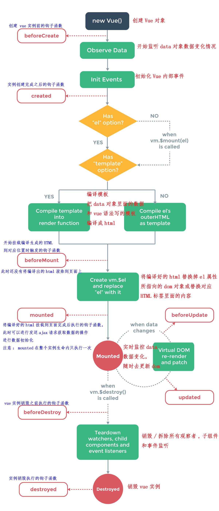

# 概念1：Vue生命周期

## created和mounted的区别

[vue中created与mounted区别——有误](https://segmentfault.com/a/1190000020058583)

以下为测试vue部分生命函数

~~~javascript
beforeCreate(){
    console.log('beforecreate:',document.getElementById('first'))//null
    console.log('data:',this.text);//undefined
    this.sayHello();//error:not a function
},
created(){
    console.log('create:',document.getElementById('first'))//null
    console.log('data:',this.text);//this.text
    this.sayHello();//this.sayHello()
},
beforeMount(){
    console.log('beforeMount:',document.getElementById('first'))//null
    console.log('data:',this.text);//this.text
    this.sayHello();//this.sayHello()
},
mounted(){
    console.log('mounted:',document.getElementById('first'))//

    console.log('data:',this.text);//this.text
    this.sayHello();//this.sayHello()
}
~~~

通过上述测试我们可以知道：

| 生命周期     | 是否获取DOM节点 | 是否可以获取data | 是否获取methods |
| ------------ | :-------------: | :--------------: | :-------------: |
| beforeCreate |       否        |        否        |       否        |
| created      |       否        |        是        |       是        |
| beforeMount  |       否        |        是        |       是        |
| mounted      |       是        |        是        |       是        |

以我的个人理解，**Vue生命周期实际上和浏览器渲染过程是挂钩的**。

* 在beforecreate阶段，对浏览器来说，整个渲染流程尚未开始或者说准备开始，对vue来说，实例尚未被初始化，data observer和 event/watcher也还未被调用，在此阶段，对data、methods或文档节点的调用现在无法得到正确的数据。

* 在created阶段，对浏览器来说，渲染整个HTML文档时,DOM节点、CSS规则树与js文件被解析后，但是没有进入被浏览器render过程，上述资源是尚未挂载在页面上，也就是在vue生命周期中对应的created
  阶段，实例已经被初始化，但是还没有挂载至**\$el**上，所以我们无法获取到对应的节点，但是此时我们是可以获取到vue中data与methods中的数据的

* 在beforeMount阶段，实际上与created阶段类似，节点尚未挂载，但是依旧可以获取到data与methods中的数据。

* 在mounted阶段，对浏览器来说，已经完成了DOM与CSS规则树的render，并完成对render tree进行了布局，而浏览器收到这一指令，调用渲染器的paint()在屏幕上显示，而对于vue来说，在mounted阶段，vue的**template成功挂载在\$el中**，此时一个完整的页面已经能够显示在浏览器中，所以在这个阶段，即可以调用节点了（关于这一点，在笔者测试中，在mounted方法中打断点然后run，依旧能够在浏览器中看到整体的页面）。

> 评论1：mounted阶段不一定有实际的DOM，最好在this.\$nextTick中获取。
>
>  评论2：没有挂钩，vue的生命周期只是vue的执行逻辑而已, 最终vue内部会执行render， 才会涉及到页面的重绘流程。
>
> 这篇文章参考一下吧，写的好像有点问题。

