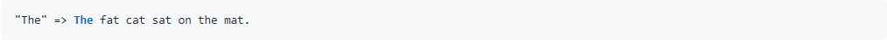
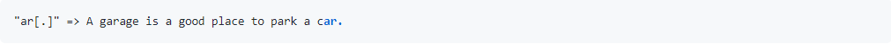
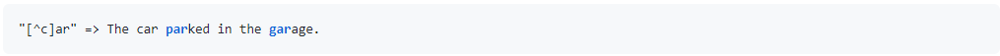
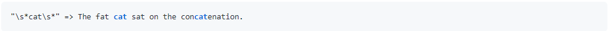
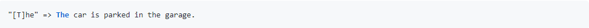
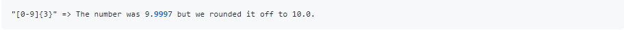
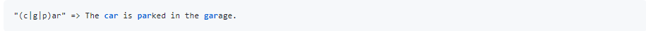
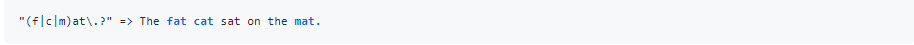
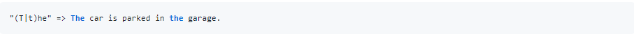

(注1：GitHub上有个3.5万星的项目，叫[learn-regex](https://github.com/ziishaned/learn-regex/blob/master/translations/README-cn.md)，本篇博文就是从里面完全摘抄的)

(注2：学习正则表达式还有一个可视化页面的网站，叫[Regexper](https://regexper.com/),很好用，可以配合着学习使用)

(注3：[JS正则表达式完整教程（略长）](https://juejin.im/post/6844903487155732494))

(注4：[JavaScript 正则表达式迷你书](https://juejin.im/post/6844903501034684430))

(注5：突然发现正则表达式里面的东西好像也没有多少，而我为了正则表达式已经单独写了2篇博文了，里面好多东西重复了。更别说《JavaScript高级》博文最后部分专门还讲了正则表达式，里面的内容基本上将正则表达式全都讲到了，所以没必要害怕它，我已经完全学完了，今后能够看懂正则表达式，并且会正常的使用基本的就可以了。)

# 什么是正则表达式

> 正则表达式是一组由字母和符号组成的特殊文本，它可以用来从文本中找出**满足你想要的格式的句子**。

一个正则表达式是一种从左到右匹配主体字符串的模式。 “Regular expression”这个词比较拗口，我们常使用**缩写**的术语**“regex”或“regexp”**。 正则表达式可以从一个基础字符串中根据一定的匹配模式替换文本中的字符串、验证表单、提取字符串等等。

# 基本匹配

正则表达式其实就是**在执行搜索时的格式**，它**由一些字母和数字组合而成**。 例如：一个正则表达式 `the`，它表示一个规则：由字母`t`开始，接着是`h`，再接着是`e`。

正则表达式`123`匹配字符串`123`。它逐个字符的与输入的正则表达式做比较。

正则表达式是**大小写敏感**的，所以`The`不会匹配`the`。

# 元字符

正则表达式主要依赖于元字符。 元字符不代表他们本身的字面意思，他们都有特殊的含义。一些元字符写在方括号中的时候有一些特殊的意思。以下是一些元字符的介绍：

| 元字符 | 描述                                                         |
| ------ | ------------------------------------------------------------ |
| .      | 句号匹配任意单个字符除了换行符。                             |
| [ ]    | 字符种类。匹配方括号内的任意字符。                           |
| [^ ]   | 否定的字符种类。匹配除了方括号里的任意字符                   |
| *      | 匹配>=0个重复的在*号之前的字符。                             |
| +      | 匹配>=1个重复的+号前的字符。                                 |
| ?      | 标记?之前的字符为可选.                                       |
| {n,m}  | 匹配num个大括号之前的字符或字符集 (n <= num <= m).           |
| (xyz)  | 字符集，匹配与 xyz 完全相等的字符串.                         |
| \|     | 或运算符，匹配符号前或后的字符.                              |
| \      | 转义字符,用于匹配一些保留的字符 `[ ] ( ) { } . * + ? ^ $ \ |` |
| ^      | 从开始行开始匹配.                                            |
| $      | 从末端开始匹配.                                              |

## 点运算符 `.`

`.`是元字符中最简单的例子。 **`.`匹配任意单个字符**，但**不匹配换行符**。 例如，表达式`.ar`匹配一个任意字符后面跟着是`a`和`r`的字符串。

## 字符集

字符集也叫做字符类。 **方括号用来指定一个字符集**。 在方括号中使用连字符来指定字符集的范围。 在方括号中的字符集**不关心顺序**。 例如，表达式`[Tt]he` 匹配 `the` 和 `The`。

方括号的句号就表示句号。 表达式 `ar[.]` 匹配 `ar.`字符串

###  否定字符集

一般来说 `^` 表示一个字符串的**开头**，但它**用在一个方括号的开头的时候**，它表示这个字符集是否定的。 例如，表达式`[^c]ar` 匹配一个后面跟着`ar`的除了`c`的任意字符。

##  重复次数

后面跟着元字符 `*`  , `+`或 `?` 的，用来**指定匹配子模式的次数**。 这些元字符在不同的情况下有着不同的意思。

###  `*` 号(>=0)

`*`号匹配 在`*`**之前**的字符出现`大于等于0`次。 例如，表达式 `a*` 匹配**0或更多个**以a开头的字符。表达式`[a-z]*` 匹配一个行中**所有以小写字母开头的字符串**。

`*`字符和`.`字符搭配可以匹配所有的字符`.*`。 `*`和**表示匹配空格的符号`\s`**连起来用，如表达式`\s*cat\s*`匹配0或更多个空格开头和0或更多个空格结尾的cat字符串。

###  `+` 号(>=1)

`+`号匹配`+`号**之前**的字符出现 >=1 次。 例如表达式`c.+t` 匹配以首字母`c`开头以`t`结尾，中间跟着至少一个字符的字符串。

###  `?` 号(0或1)

在正则表达式中元字符 `?` 标记在符号前面的字符为可选，即出现 0 或 1 次。 例如，表达式 `[T]?he` 匹配字符串 `he` 和 `The`。

### `{}` 号

在正则表达式中 `{}` 是一个量词，常用来限定一个或一组字符可以重复出现的次数。 例如， 表达式 `[0-9]{2,3}` 匹配最少 2 位最多 3 位 0~9 的数字。

我们可以省略第二个参数。 例如，`[0-9]{2,}` 匹配至少两位 0~9 的数字。

如果逗号也省略掉则表示重复固定的次数。 例如，`[0-9]{3}` 匹配3位数字

###  `(...)` 特征标群

特征标群是一组写在 `(...)` 中的子模式。`(...)` 中包含的内容将会被看成一个整体，和数学中小括号（ ）的作用相同。例如, 表达式 `(ab)*` 匹配连续出现 0 或更多个 `ab`。如果没有使用 `(...)` ，那么表达式 `ab*` 将匹配连续出现 0 或更多个 `b` 。再比如之前说的 `{}` 是用来表示前面一个字符出现指定次数。但如果在 `{}` 前加上特征标群 `(...)` 则表示整个标群内的字符重复 N 次。

我们还可以在 `()` 中用或字符 `|` 表示或。例如，`(c|g|p)ar` 匹配 `car` 或 `gar` 或 `par`.

###  `|` 或运算符

或运算符就表示或，用作判断条件。

例如 `(T|t)he|car` 匹配 `(T|t)he` 或 `car`。

### 转码特殊字符

反斜线 `\` 在表达式中用于转码紧跟其后的字符。用于指定 `{ } [ ] / \ + * . $ ^ | ?` 这些特殊字符。如果想要匹配这些特殊字符则要在其前面加上反斜线 `\`。

例如 `.` 是用来匹配除换行符外的所有字符的。如果想要匹配句子中的 `.` 则要写成 `\.` 以下这个例子 `\.?`是选择性匹配`.`

### 锚点

在正则表达式中，想要匹配指定开头或结尾的字符串就要使用到锚点。`^` 指定开头，`$` 指定结尾。

####  `^` 号

`^` 用来检查匹配的字符串是否在所匹配字符串的开头。

例如，在 `abc` 中使用表达式 `^a` 会得到结果 `a`。但如果使用 `^b` 将匹配不到任何结果。因为在字符串 `abc` 中并不是以 `b` 开头。

例如，`^(T|t)he` 匹配以 `The` 或 `the` 开头的字符串。

####  `$` 号

同理于 `^` 号，`$` 号用来匹配字符是否是最后一个。

例如，`(at\.)$` 匹配以 `at.` 结尾的字符串。

# 简写字符集

正则表达式提供一些常用的字符集简写。如下:

| 简写 | 描述                                               |
| ---- | -------------------------------------------------- |
| .    | 除换行符外的所有字符                               |
| \w   | 匹配所有字母数字，等同于 `[a-zA-Z0-9_]`            |
| \W   | 匹配所有非字母数字，即符号，等同于： `[^\w]`       |
| \d   | 匹配数字： `[0-9]`                                 |
| \D   | 匹配非数字： `[^\d]`                               |
| \s   | 匹配所有空格字符，等同于： `[\t\n\f\r\p{Z}]`       |
| \S   | 匹配所有非空格字符： `[^\s]`                       |
| \f   | 匹配一个换页符                                     |
| \n   | 匹配一个换行符                                     |
| \r   | 匹配一个回车符                                     |
| \t   | 匹配一个制表符                                     |
| \v   | 匹配一个垂直制表符                                 |
| \p   | 匹配 CR/LF（等同于 `\r\n`），用来匹配 DOS 行终止符 |

# 零宽度断言（前后预查）