(注1：感觉有必要把浏览器渲染单独学习一下，网上搜了一下资源：[从零开始，彻底掌握浏览器渲染原理](https://www.bilibili.com/video/BV1P7411E7j9?from=search&seid=3657741096512803854))

(注2：这个视频只有3节，不到2个小时，看了以后感觉自己的水平还远远不够啊，前端的底层原理还是接触的不多啊。要知其然，还要知其所以然啊！)

(注3：这个老师不知道叫什么，但是挺有水平的，不管是技术上还是职业规划上，看了这2个小时挺拓展思维的。)

# 一道面试题引发的"血案"

请说出：从用户在浏览器地址栏输入网址，到看到整个页面(网速比较快的情况下只要几秒钟)，中间都发生了哪些事情？

它大体上分成三大步骤：

* HTTP请求阶段
  * 能够通过输入网址，在连接互联网的情况下通过HTTP和TCP协议能够向对应的Web服务器发送请求。
  * DNS解析
  * TCP协议的三次握手和四次挥手等
* HТТР响应阶段
  * 这个阶段会涉及到很多状态码，涉及到很多HTTP报文，涉及到服务器和客户端之间建立的一些缓存机制等。
* 浏览器渲染阶段
  * 前2个阶段不是我们这节课的重点，我们重点讲第3个阶段。
  * 当服务器把我们想要的东西给了浏览器之后，浏览器怎么给用户呈现出来，这个叫做浏览器的渲染阶段。

# 浏览器渲染页面的机制和原理

[CPU核心](https://zhuanlan.zhihu.com/p/64020002)

现代操作系统比如Mac OS X，UNIX，Linux，Windows等，都是支持"多任务"的操作系统。

* 单核CPU执行多任务：操作系统轮流让各个任务交替执行，任务1执行0.01秒，切换到任务2，任务2执行0.01秒，再切换到任务...由于CPU的执行速度实在是太快了，我们感觉就像所有任务都在同时执行一样
* 多核CPU执行多任务：真正的并行执行多任务只能在**多核CPU**上实现，但是，由于**任务数量远远多于CPU的核心数量**，所以，操作系统也会自动把很多任务轮流调度到每个核心上执行

有些进程还不止同时干一件事，要同时干多件事，就需要同时运行多个"子任务"，我们把**进程内的这些"子任务"称为线程**
。

**多个线程可以同时执行**，多线程的执行方式和多进程是一样的，也是由操作系统在多个线程之间快速切换，让每个线程都短暂地交替运行，看起来就像同时执行一样。

> 输入网址，进入网页后按F12,点击Source下的`index.html`,可以看到服务器返回给客户端的不是网页，而是一堆堆的源代码。
>
> 浏览器拿到这一堆堆源代码就开始它的表演了，它要把这堆只有它才能看得懂的代码，变成我们可以看得到的绚丽多彩的页面(怎么变成页面呢？只能把这些代码从上到下一行行执行！)。
>
> 那浏览器要执行代码总要有一个执行环境吧，就像我们人类生活要有一个地球环境一样。
>
> 所以浏览器拿到代码后，会先在内存条中开辟出一条**栈内存**，用来给代码的执行提供执行环境，同时分配一个**主线程**(只有一个！！！)去一行行的去解析和执行代码。
>
> (开辟栈内存当环境，在这个环境下分配主线程去做劳力。)
>
> 前端JS是单线程的，原因是浏览器只会分配**一个**线程去干活！！！
>
> (饭店比较穷，只能雇一个服务员给客户点餐。而且JS的机制决定了这门语言如果是多线程的话会十分的混乱。)
>
> 单线程特点：必须上一个任务完成后，才能执行下一个任务。(服务员必须服务完上一个顾客，才能执行下一个顾客。)
>
> 主线程进栈执行，执行完后出栈。
>
> 当我们浏览器中遇到`link`,`script`,`img`,`audio`,`video`这些需要额外从服务器进行加载的外部资源请求时，都会单独开辟新的线程去加载资源文件，主线程会继续向下执行。(一个服务员遇到当前服务的顾客想要从外面拿东西，她不会自己帮他拿，会叫自己的闺蜜帮忙去拿一下。)
>
> 疑问：那这样不就变成多线程了吗？——"JS是单线程的"这句话还是对的，因为执行代码的依旧只有一个。
>
> "JS是单线程的"这句话全称应该是："浏览器是多线程程序，但是它只分配了一个线程来执行页面中的各种代码。所以说JS是单线程的，浏览器是多线程的。"
>
> 举个例子：我去饭店吃饭，饭店只有一个服务员，服务员给我点完餐之后继续服务下一个顾客了，厨房的厨师负责做餐，但是厨师需要知道这个餐是给谁做的，需要有一个点餐单这个的东西。
>
> 浏览器需要再开辟一个新的内存**空间**，叫任务队列(Task Quene)。(比如任务1，委托小红去服务器拿`1.css`代码；任务2，委托小兰去服务器拿`2.css`代码)
>
> 服务员依旧不会闲着，继续往下服务客人，继续往下执行代码，等她从上往下都执行完代码后，小红和小兰不一定从服务器拿回`1.css`和`2.css`。
>
> 则服务员**第一次**执行完代码后，只是把页面中的HTML标签，DOM结构给渲染完了。
>
> 所以浏览器加载页面第一个环节叫DOM树渲染，因为只看了DOM,CSS还不知道有没有回来。
>
> 但是光有DOM树，页面不能渲染出来，样式都没有呢！！
>
> 举个例子：服务员把所有的顾客都点完餐了，接下来就是把做好的饭都端上来。
>
> 服务员会到任务队列(Task Quene)里去看，哪个任务完成了，就把这个任务拿到我们栈内存去执行。
>
> 如果任务队列里`1.css`和`2.css`都执行完了，因为是单线程，服务员也会一个一个去执行`1.css`和`2.css`。(我干着活呢，老板你不能压榨我了吧，我做事情是一件一件做的。)
>
> 这个机制就叫做事件循环(Event Loop)

[JavaScript 运行机制详解：再谈Event Loop](http://www.ruanyifeng.com/blog/2014/10/event-loop.html)

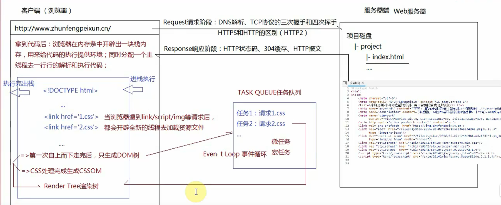

> 事件循环还有个微任务和宏任务这2个概念。
>
> CSS也弄完了，生成了CSSOM树，这个时候，DOM树和CSSOM树一起，会生成Render Tree树，这个时候浏览器会通知显卡(GPU)，进行渲染。

> 一定**先发生回流**，**再发生重绘**。
>
> **回流一定会重绘，但重绘不一定会回流。**(因为回流完要做的事情就是重绘)
>
> 回流就是计算所有元素在窗口中的位置，重绘就是计算所有元素在窗口中的位置具体要呈现出来的样式。

# 前端性能优化

* 减少HTTP请求次数和大小
  * 资源合并压缩
  * 图片懒加载(生成DOM树的时候不加载图片，滚动到哪个区域再加载哪个区域的图片)
  * 音视频走流文件(文件只要加载一部分就算加载了，如`m3u8`文件)
* DNS缓存，304缓存等

# DOM的重绘和回流

[你真的了解回流和重绘吗](https://zhuanlan.zhihu.com/p/52076790)

[你可能不了解的回流与重绘](https://zhuanlan.zhihu.com/p/82378692)

> 所有的元素都是小朋友，每个小朋友都坐在特定位置的一把椅子上。
>
> 重绘(repaint)：所有小朋友坐的位置都不变，只是有的小朋友换了新衣服，有的小朋友隐身了(但是他的座位还在，`visibility`隐身了座位还在，`display`就不行了，隐身了，座位也给你搬走了。所以`display`不是重绘！！)
>
> 重绘耗性能，但是感觉稍微好一点，**更加恶心**的是回流。
>
> 回流(reflow)：自己的位置改变，也改变了别人的位置。(比如`margin`,`top`，文本变成图片，浏览器窗口改变)
>
> 所有的回流都会干一件事情，根据生成的render tree,重新计算所有元素在页面中的位置。

## 避免DOM回流

> 当下我们的开发都是避免操作DOM的了，从最老的Backbone,到现在的Angular，React和Vue，都不是直接来操作DOM了。
>
> 虚拟DOM和DOM Diff的处理，能最大限度的减少DOM的回流和重绘。

### 具体示例1

~~~javascript
<!DOCTYPE html>
<html lang="en">

<head>
    <meta charset="UTF-8">
    <meta name="viewport" content="width=device-width, initial-scale=1.0">
    <title>分离读写</title>
    
</head>

<body>
    

    
</body>

</html>
~~~

[createDocumentFragment()用法总结](https://blog.csdn.net/qiao13633426513/article/details/80243058)

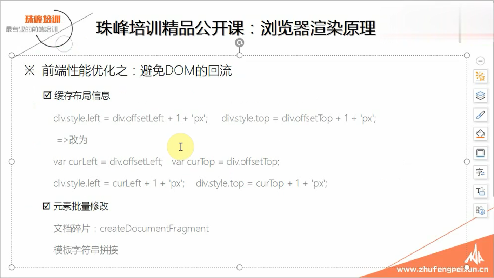

### 具体示例2

~~~javascript
<!DOCTYPE html>
<html lang="en">

<head>
    <meta charset="UTF-8">
    <meta name="viewport" content="width=device-width, initial-scale=1.0">
    <title>Document</title>
</head>

<body>
    <ul id="box">
        <!-- 想要动态创建5个li -->
    </ul>
    
</body>

</html>
~~~

[硬件加速](http://www.hiheng.com/blog/archives/2608)

> 定位的元素会脱离文档流，形成一个新的层面，也会引发回流，但是对其他元素没有影响，性能会更好。
>
> 我们有一个规则：能用`transform`改变样式的绝对不用普通的样式，就是因为 `transform`开启了硬件加速，规避了DOM回流。
>
> 动画中如果1像素1像素的移动，那每移动1像素就会触发一次回流，那性能会太慢。我们可以每3像素移动一次，可能平滑度差一些，但是回流的次数少了，它的性能会更好一些。
>
> `table`这玩意能不用就不用，回流的地方太多了。

# 职业规划

> P3及以下：现在已经没有了，现在这个职业环境下，最不缺的就是人了。
>
> P4:初级，至少会Vue和React,否则找不到工作。
>
> P5:中级，能自己独立做项目了。中国的IT程序员，不管是前端还是后端，80%全部止于P5。(二八原则)
>
> 比如现在的Java程序员，要想35岁之前不被裁，必须要学数据结构和算法，以及服务器端数据缓存及并发。不学这个，以后连工作都没有。
>
> P6:高级,不仅可以自己做项目，而且还可以自己带团队了。封装底层代码，写插件。要做到P6这个级别,JS源码必须要懂了，要做到知其然，知其所以然了。
>
> P7:架构师,不仅仅自己封装东西，你封装的东西不仅仅可以给你公司小组的员工用，而且最起码能让整个公司全用起来，更好一点的话你能让更多公司，更多人用起来。所以你要经常活跃于各大博客，各大论坛，参见各大会议，成为受邀嘉宾，演讲嘉宾。你需要做开放分享，帮助更多人。
>
> 阮一峰，廖雪峰，大漠都是P7。

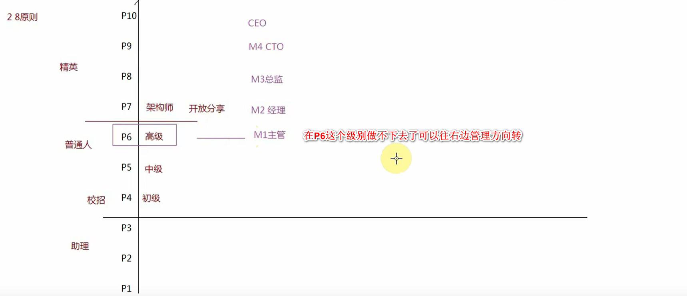

# 大前端时代

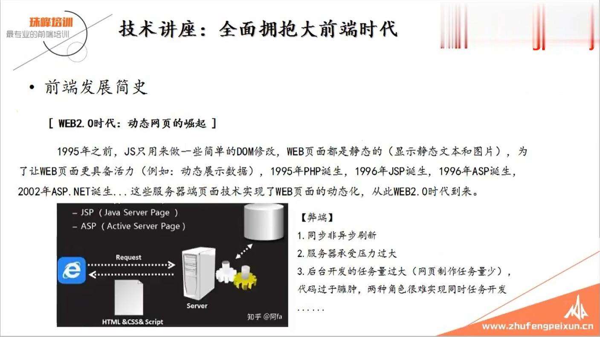

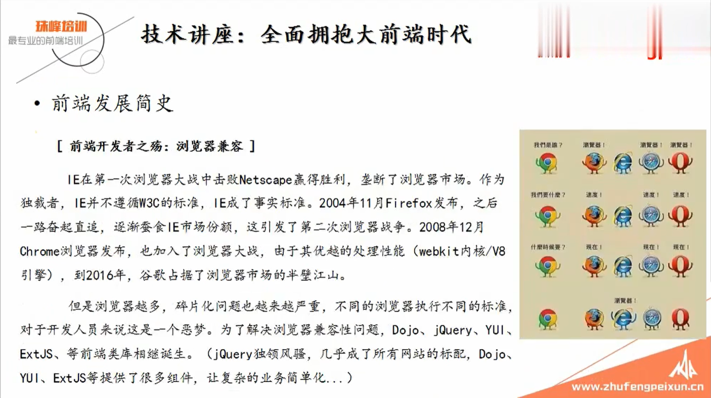

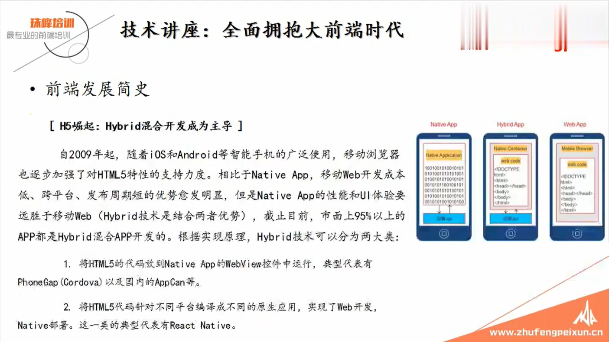

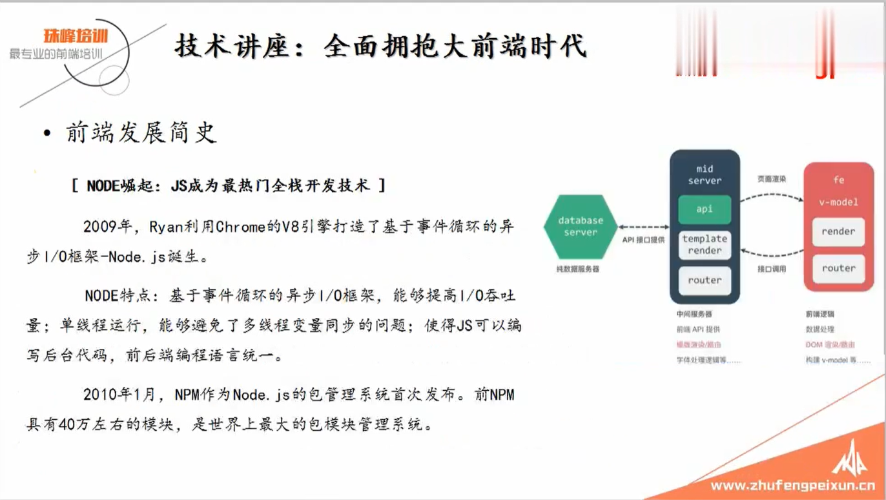

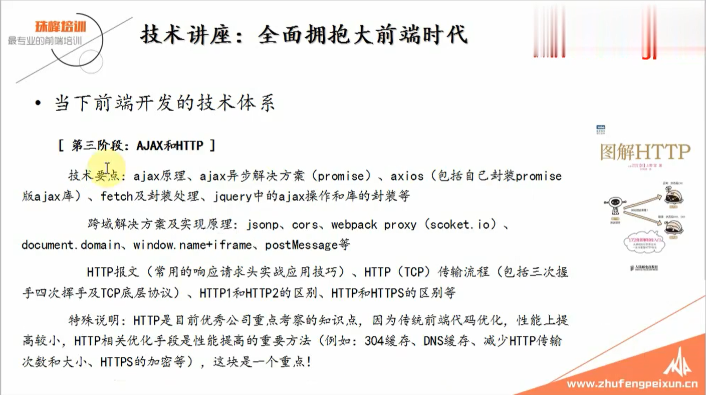

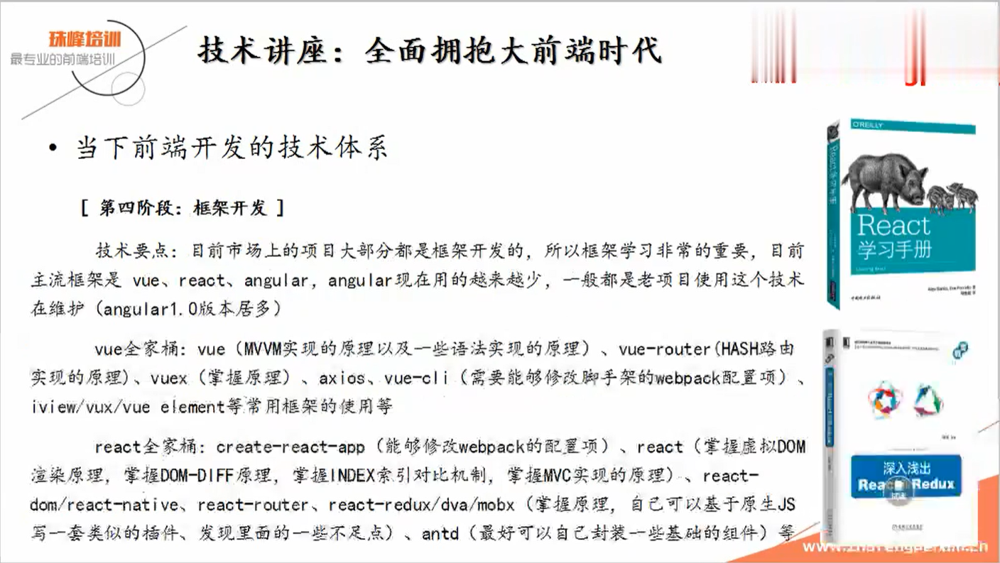

> 一线程序，全栈工程师(既会JS又会Node.js(学的特别好)基础薪资是2.5万。

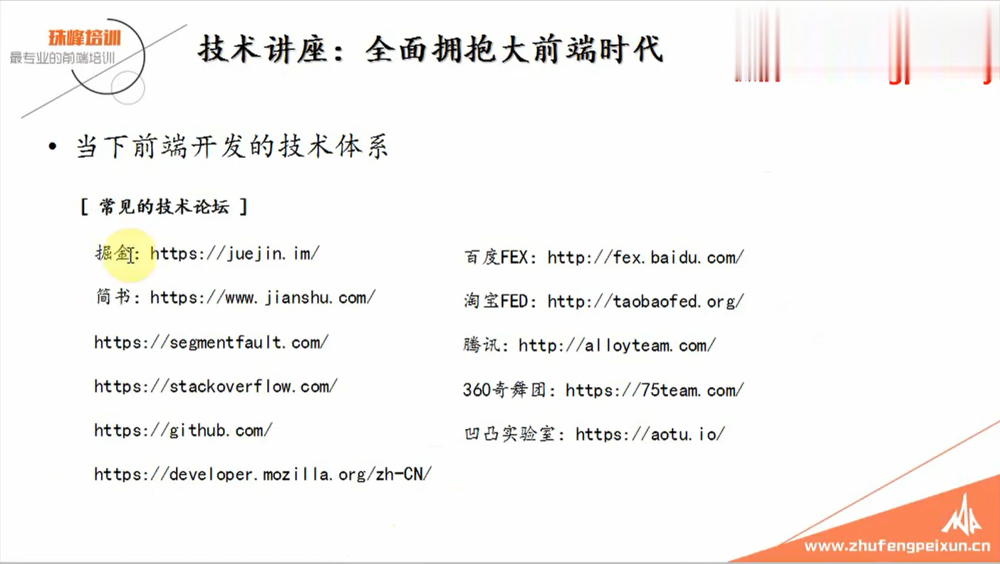

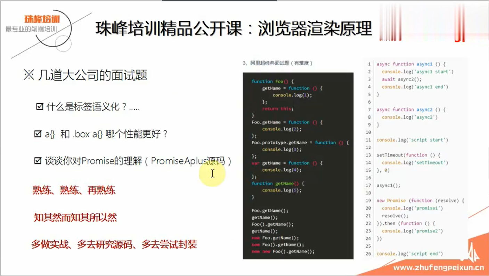

