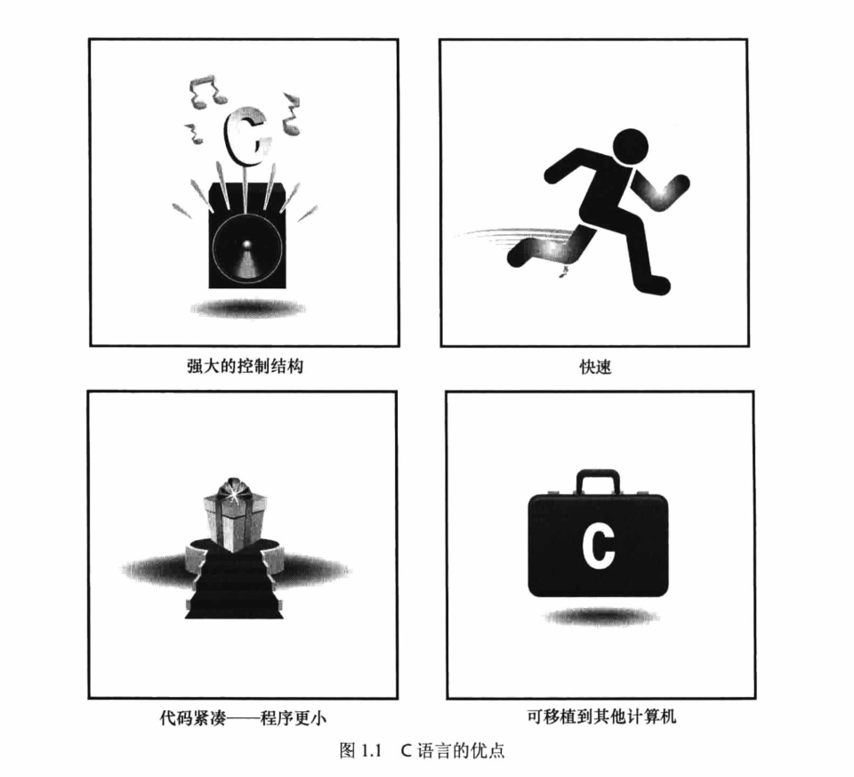
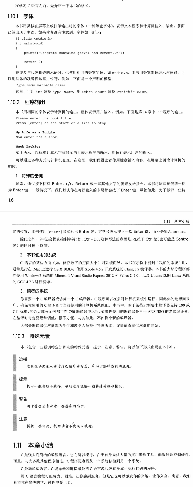
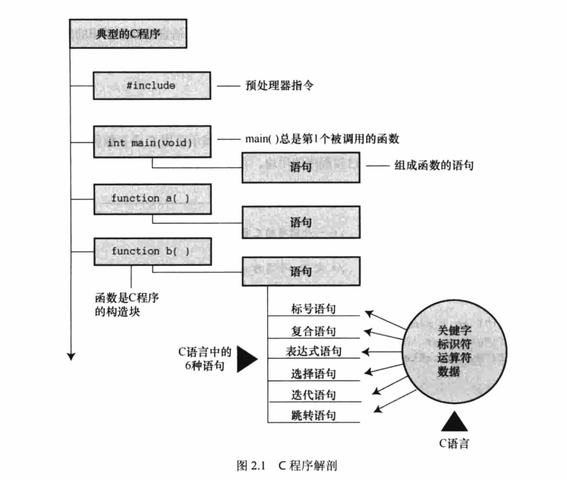

# 第1章：初识C语言

欢迎来到C语言的世界。C是一门功能强大的专业化编程语言，深受业余编程爱好者和专业程序员的喜爱。本章为读者学习这一强大而流行的语言打好基础，并介绍几种开发C程序最可能使用的环境。我们先来了解C语言的起源和一些特性，包括它的优缺点。然后，介绍编程的起源并探讨一些编程的基本原则。最后，讨论如何在一些常见系统中运行C程序。

## C语言的起源

1972年，贝尔实验室的丹尼斯·里奇（Dennis Ritch）和肯·汤普逊（Ken Thompson）在开发UNIX操作系统时设计了C语言。然而，C语言不完全是里奇突发奇想而来，他是在B语言（汤普逊发明）的基础上进行设计。至于B语言的起源，那是另一个故事。C语言设计的初衷是将其作为程序员使用的一种编程工具，因此，其主要目标是成为有用的语言。

虽然绝大多数语言都以实用为目标，但是通常也会考虑其他方面。例如，Pascal的主要目标是为更好地学习编程原理提供扎实的基础；而BASIC的主要目标是开发出类似英文的语言，让不熟悉计算机的学生轻松学习编程。这些目标固然很重要，但是随着计算机的迅猛发展，它们已经不是主流语言。然而，最初为程序员设计开发的C语言，现在已成为首选的编程语言之一。

## 选择C语言的理由

在过去40多年里，C语言已成为最重要、最流行的编程语言之一。它的成长归功于使用过的人都对它很满意。过去20多年里，虽然许多人都从C语言转而使用其他编程语言（如，C++、Objective C、Java等），但是C语言仍凭借自身实力在众多语言中脱颖而出。在学习C语言的过程中，会发现它的许多优点（见图1.1）。下面，我们来看看其中较为突出的几点。

### 设计特性

C是一门流行的语言，融合了计算机科学理论和实践的控制特性。C语言的设计理念让用户能轻松地完成自顶向下的规划、结构化编程和模块化设计。因此，用C语言编写的程序更易懂、更可靠。

### 高效性

C是高效的语言。在设计上，它充分利用了当前计算机的优势，因此C程序相对更紧凑，而且运行速度很快。实际上，C语言具有通常是汇编语言才具有的微调控制能力（汇编语言是为特殊的中央处理单元设计的一系列内部指令，使用助记符来表示；不同的CPU系列使用不同的汇编语言），可以根据具体情况微调程序以获得最大运行速度或最有效地使用内存。

### 可移植性

C是可移植的语言。这意味着，在一种系统中编写的C程序稍作修改或不修改就能在其他系统运行。
如需修改，也只需简单更改主程序头文件中的少许项即可。大部分语言都希望成为可移植语言，但是，如果经历过把IBMPCBASIC程序转换成苹果BASIC（两者是近亲），或者在UNIX系统中运行IBM大型机的FORTRAN程序的人都知道，移植是最麻烦的事。C语言是可移植方面的佼佼者。从8位微处理器到克雷超级计算机，许多计算机体系结构都可以使用C编译器（C编译器是把C代码转换成计算机内部指令的程序）。
但是要注意，程序中针对特殊硬件设备（如，显示监视器）或操作系统特殊功能（如，Windows8或OSX）编写的部分，通常是不可移植的。

由于C语言与UNIX关系密切，UNIX系统通常会将C编译器作为软件包的一部分。安装Linux时，通常也会安装C编译器。供个人计算机使用的C编译器很多，运行各种版本的Windows和Macintosh（即，Mac）的PC都能找到合适的C编译器。因此，无论是使用家庭计算机、专业工作站，还是大型机，都能找到针对特定系统的C编译器。

### 强大而灵活

C语言功能强大且灵活（计算机领域经常使用这两个词）。例如，功能强大且灵活的UNIX操作系统，大部分是用C语言写的；其他语言（如，FORTRAN、Perl、Python、Pascal、LISP、Logo、BASIC）的许多编译器和解释器都是用C语言编写的。因此，在UNIX机上使用FORTRAN时，最终是由C程序生成最后的可执行程序。C程序可以用于解决物理学和工程学的问题，甚至可用于制作电影的动画特效。

### 面向程序员

C语言是为了满足程序员的需求而设计的，程序员利用C可以访问硬件、操控内存中的位。C语言有丰富的运算符，能让程序员简洁地表达自己的意图。C没有Pascal严谨，但是却比C++的限制多。这样的灵活性既是优点也是缺点。优点是，许多任务用C来处理都非常简洁（如，转换数据的格式）；缺点是，你可能会犯一些莫名其妙的错误，这些错误不可能在其他语言中出现。C语言在提供更多自由的同时，也让使用者承担了更大的责任。

另外，大多数C实现都有一个大型的库，包含众多有用的C函数。这些函数用于处理程序员经常需要解决的问题。

### 缺点

人无完人，金无足赤。C语言也有一些缺点。例如，前面提到的，要享受用C语言自由编程的乐趣，就必须承担更多的责任。特别是，C语言使用指针，而涉及指针的编程错误往往难以察觉。有句话说的好：
想拥有自由就必须时刻保持警惕。

C语言紧凑简洁，结合了大量的运算符。正因如此，我们也可以编写出让人极其费解的代码。虽然没必要强迫自己编写晦涩的代码，但是有兴趣写写也无妨。试问，除C语言外还为哪种语言举办过年度混乱代码大赛？

> 国际C语言混乱代码大赛（IOCCC，The International Obfuscated CCode Contest）。这是一项国际编程赛事，从1984年开始，每年举办一次（1997、1999、2002、2003和2006年除外），目的是写出最有创意且最让人难以理解的C语言代码。——译者注

瑕不掩瑜，C语言的优点比缺点多很多。我们不想在这里多费笔墨，还是来聊聊C语言的其他话题。

## C语言的应用范围

早在20世纪80年代，C语言就已经成为小型计算机（UNIX系统）使用的主流语言。从那以后，C语言的应用范围扩展到微型机（个人计算机）和大型机（庞然大物）。如图1.2所示，许多软件公司都用C语言来开发文字处理程序、电子表格、编译器和其他产品，因为用C语言编写的程序紧凑而高效。更重要的是，C程序很方便修改，而且移植到新型号的计算机中也没什么问题。

无论是软件公司、经验丰富的C程序员，还是其他用户，都能从C语言中受益。越来越多的计算机用户已转而求助C语言解决一些安全问题。不一定非得是计算机专家也能使用C语言。

20世纪90年代，许多软件公司开始改用C++来开发大型的编程项目。C++在C语言的基础上嫁接了面向对象编程工具（面向对象编程是一门哲学，它通过对语言建模来适应问题，而不是对问题建模以适应语言）。C++几乎是C的超集，这意味着任何C程序差不多就是一个C++程序。学习C语言，也相当于学习了许多C++的知识。

虽然这些年来C++和JAVA非常流行，但是C语言仍是软件业中的核心技能。在最想具备的技能中，C语言通常位居前十。特别是，C语言已成为嵌入式系统编程的流行语言。也就是说，越来越多的汽车、照相机、DVD播放机和其他现代化设备的微处理器都用C语言进行编程。除此之外，C语言还从长期被FORTRAN独占的科学编程领域分得一杯羹。最终，作为开发操作系统的卓越语言，C在Linux开发中扮演着极其重要的角色。因此，在进入21世纪的第2个10年中，C语言仍然保持着强劲的势头。

简而言之，C语言是最重要的编程语言之一，将来也是如此。如果你想拿下一份编程的工作，被问到是否会C语言时，最好回答“是”。

## 计算机能做什么

在学习如何用C语言编程之前，最好先了解一下计算机的工作原理。这些知识有助于你理解用C语言编写程序和运行C程序时所发生的事情之间有什么联系。

现代的计算机由多种部件构成。中央处理单元（CPU）承担绝大部分的运算工作。随机存取内存（RAM）是存储程序和文件的工作区；而永久内存存储设备（过去一般指机械硬盘，现在还包括固态硬盘）即使在关闭计算机后，也不会丢失之前储存的程序和文件。另外，还有各种外围设备（如，键盘、鼠标、触摸屏、监视器）提供人与计算机之间的交互。CPU负责处理程序，接下来我们重点讨论它的工作原理。

CPU的工作非常简单，至少从以下简短的描述中看是这样。它从内存中获取并执行一条指令，然后再从内存中获取并执行下一条指令，诸如此类（一个吉赫兹的CPU一秒钟能重复这样的操作大约十亿次，因此，CPU能以惊人的速度从事枯燥的工作）。CPU有自己的小工作区——由若干个寄存器组成，每个寄存器都可以储存一个数字。一个寄存器储存下一条指令的内存地址，CPU使用该地址来获取和更新下一条指令。在获取指令后，CPU在另一个寄存器中储存该指令，并更新第1个寄存器储存下一条指令的地址。CPU能理解的指令有限（这些指令的集合叫作指令集）。而且，这些指令相当具体，其中的许多指令都是用于请求计算机把一个数字从一个位置移动到另一个位置。例如，从内存移动到寄存器。

下面介绍两个有趣的知识。其一，储存在计算机中的所有内容都是数字。计算机以数字形式储存数字和字符（如，在文本文档中使用的字母）。每个字符都有一个数字码。计算机载入寄存器的指令也以数字形式储存，指令集中的每条指令都有一个数字码。其二，计算机程序最终必须以数字指令码（即，机器语言）来表示。

简而言之，计算机的工作原理是：如果希望计算机做某些事，就必须为其提供特殊的指令列表（程序），确切地告诉计算机要做的事以及如何做。你必须用计算机能直接明白的语言（机器语言）创建程序。这是一项繁琐、乏味、费力的任务。计算机要完成诸如两数相加这样简单的事，就得分成类似以下几个步骤。

1.从内存位置2000上把一个数字拷贝到寄存器1。

2.从内存位置2004上把另一个数字拷贝到寄存器2。

3.把寄存器2中的内容与寄存器1中的内容相加，把结果储存在寄存器1中。

4.把寄存器1中的内容拷贝到内存位置2008。

而你要做的是，必须用数字码来表示以上的每个步骤！

如果以这种方式编写程序很合你的意，那不得不说抱歉，因为用机器语言编程的黄金时代已一去不复返。但是，如果你对有趣的事情比较感兴趣，不妨试试高级编程语言。

## 高级计算机语言和编译器

高级编程语言（如，C）以多种方式简化了编程工作。首先，不必用数字码表示指令；其次，使用的指令更贴近你如何想这个问题，而不是类似计算机那样繁琐的步骤。使用高级编程语言，可以在更抽象的层面表达你的想法，不用考虑CPU在完成任务时具体需要哪些步骤。例如，对于两数相加，可以这样写：

~~~c
total= mine + yours;
~~~

对我们而言，光看这行代码就知道要计算机做什么；而看用机器语言写成的等价指令（多条以数字码形式表现的指令）则费劲得多。但是，对计算机而言却恰恰相反。在计算机看来，高级指令就是一堆无法理解的无用数据。编译器在这里派上了用场。编译器是把高级语言程序翻译成计算机能理解的机器语言指令集的程序。程序员进行高级思维活动，而编译器则负责处理冗长乏味的细节工作。

编译器还有一个优势。一般而言，不同CPU制造商使用的指令系统和编码格式不同。例如，用Intel Corei7
（英特尔酷睿i7）CPU编写的机器语言程序对于ARM Cortex-A57CPU而言什么都不是。但是，可以找到与特定类型CPU匹配的编译器。因此，使用合适的编译器或编译器集，便可把一种高级语言程序转换成供各种不同类型CPU使用的机器语言程序。一旦解决了一个编程问题，便可让编译器集翻译成不同CPU使用的机器语言。

简而言之，高级语言（如C、Java、Pascal）以更抽象的方式描述行为，不受限于特定CPU或指令集。
而且，高级语言简单易学，用高级语言编程比用机器语言编程容易得多。

> 1964年，控制数据公司（Control Data Corporation）研制出了CDC6600计算机。这台庞然大物是世界上首台超级计算机，当时的售价是600万美元。它是高能核物理研究的首选。然而，现在的普通智能手机在计算能力和内存方面都超过它数百倍，而且能看视频，放音乐。
>
> 1964年，在工程和科学领域的主流编程语言是FORTRAN。虽然编程语言不如硬件发展那么突飞猛进，但是也发生了很大变化。为了应对越来越大型的编程项目，语言先后为结构化编程和面向对象编程提供了更多的支持。随着时间的推移，不仅新语言层出不穷，而且现有语言也会发生变化。

## 语言标准

目前，有许多C实现可用。在理想情况下，编写C程序时，假设该程序中未使用机器特定的编程技术，那么它的运行情况在任何实现中都应该相同。要在实践中做到这一点，不同的实现要遵循同一个标准。

C语言发展之初，并没有所谓的C标准。1987年，布莱恩·柯林汉（Brian Kernighan）和丹尼斯·里奇（Dennis Ritchie）合著的The CProgramming Language（《C语言程序设计》）第1版是公认的C标准，通常称之为K&RC或经典C。特别是，该书中的附录中的“C语言参考手册”已成为实现C的指导标准。例如，编译器都声称提供完整的K&R实现。虽然这本书中的附录定义了C语言，但却没有定义C库。与大多数语言不同的是，C语言比其他语言更依赖库，因此需要一个标准库。实际上，由于缺乏官方标准，UNIX实现提供的库已成为了标准库。

### 第1个ANSI/ISOC标准

随着C的不断发展，越来越广泛地应用于更多系统中，C社区意识到需要一个更全面、更新颖、更严格的标准。鉴于此，美国国家标准协会（ANSI）于1983年组建了一个委员会（X3J11），开发了一套新标准，并于1989年正式公布。该标准（ANSIC）定义了C语言和C标准库。国际标准化组织于1990年采用了这套C标准（ISOC）。ISOC和ANSIC是完全相同的标准。ANSI/ISO标准的最终版本通常叫作C89（因为ANSI于1989年批准该标准）或C90（因为ISO于1990年批准该标准）。另外，由于ANSI先公布C标准，因此业界人士通常使用ANSIC。

在该委员会制定的指导原则中，最有趣的可能是：保持C的精神。委员会在表述这一精神时列出了以下几点：

* 信任程序员；

* 不要妨碍程序员做需要做的事；

* 保持语言精练简单；

* 只提供一种方法执行一项操作；

* 让程序运行更快，即使不能保证其可移植性。

在最后一点上，标准委员会的用意是：作为实现，应该针对目标计算机来定义最合适的某特定操作，而不是强加一个抽象、统一的定义。在学习C语言过程中，许多方面都反映了这一哲学思想。

### C99标准

1994年，ANSI/ISO联合委员会（C9X委员会）开始修订C标准，最终发布了C99标准。该委员会遵循了最初C90标准的原则，包括保持语言的精练简单。委员会的用意不是在C语言中添加新特性，而是为了达到新的目标。第1个目标是，支持国际化编程。例如，提供多种方法处理国际字符集。第2个目标是，“调整现有实践致力于解决明显的缺陷”。因此，在遇到需要将C移至64位处理器时，委员会根据现实生活中处理问题的经验来添加标准。第3个目标是，为适应科学和工程项目中的关键数值计算，提高C的适应性，让C比FORTRAN更有竞争力。

这3点（国际化、弥补缺陷和提高计算的实用性）是主要的修订目标。在其他方面的改变则更为保守，例如，尽量与C90、C++兼容，让语言在概念上保持简单。用委员会的话说：“…委员会很满意让C++成为大型、功能强大的语言”。

C99的修订保留了C语言的精髓，C仍是一门简洁高效的语言。本书指出了许多C99修改的地方。虽然该标准已发布了很长时间，但并非所有的编译器都完全实现C99的所有改动。因此，你可能发现C99的一些改动在自己的系统中不可用，或者只有改变编译器的设置才可用。

### C11标准

维护标准任重道远。标准委员会在2007年承诺C标准的下一个版本是C1X，2011年终于发布了C11标准。此次，委员会提出了一些新的指导原则。出于对当前编程安全的担忧，不那么强调“信任程序员”
目标了。而且，供应商并未像对C90那样很好地接受和支持C99。这使得C99的一些特性成为C11的可选项。因为委员会认为，不应要求服务小型机市场的供应商支持其目标环境中用不到的特性。另外需要强调的是，修订标准的原因不是因为原标准不能用，而是需要跟进新的技术。例如，新标准添加了可选项支持当前使用多处理器的计算机。对于C11标准，我们浅尝辄止，深入分析这部分内容已超出本书讨论的范围。

> 注意:本书使用术语ANSIC、ISOC或ANSI/ISOC讲解C89/90和较新标准共有的特性，用C99或C11介绍新的特性。有时也使用C90（例如，讨论一个特性被首次加入C语言时）。

## 使用C语言的7个步骤

C是编译型语言。如果之前使用过编译型语言（如，Pascal或FORTRAN），就会很熟悉组建C程序的几个基本步骤。但是，如果以前使用的是解释型语言（如，BASIC）或面向图形界面语言（如，Visual Basic），或者甚至没接触过任何编程语言，就有必要学习如何编译。别担心，这并不复杂。首先，为了让读者对编程有大概的了解，我们把编写C程序的过程分解成7个步骤（见图1.3）。注意，这是理想状态。在实际的使用过程中，尤其是在较大型的项目中，可能要做一些重复的工作，根据下一个步骤的情况来调整或改进上一个步骤。

### 第1步：定义程序的目标

在动手写程序之前，要在脑中有清晰的思路。想要程序去做什么首先自己要明确自己想做什么，思考你的程序需要哪些信息，要进行哪些计算和控制，以及程序应该要报告什么信息。在这一步骤中，不涉及具体的计算机语言，应该用一般术语来描述问题。

### 第2步：设计程序

对程序应该完成什么任务有概念性的认识后，就应该考虑如何用程序来完成它。例如，用户界面应该是怎样的？如何组织程序？目标用户是谁？准备花多长时间来完成这个程序？

除此之外，还要决定在程序（还可能是辅助文件）中如何表示数据，以及用什么方法处理数据。学习C语言之初，遇到的问题都很简单，没什么可选的。但是，随着要处理的情况越来越复杂，需要决策和考虑的方面也越来越多。通常，选择一个合适的方式表示信息可以更容易地设计程序和处理数据。

再次强调，应该用一般术语来描述问题，而不是用具体的代码。但是，你的某些决策可能取决于语言的特性。例如，在数据表示方面，C的程序员就比Pascal的程序员有更多选择。

### 第3步：编写代码

设计好程序后，就可以编写代码来实现它。也就是说，把你设计的程序翻译成C语言。这里是真正需要使用C语言的地方。可以把思路写在纸上，但是最终还是要把代码输入计算机。这个过程的机制取决于编程环境，我们稍后会详细介绍一些常见的环境。一般而言，使用文本编辑器创建源代码文件。该文件中内容就是你翻译的C语言代码。程序清单1.1是一个C源代码的示例。

~~~c
#include <stdio.h>
int main(void)
{
    int dogs;

    printf("How many dogs do you have?\n");
    scanf("%d", &dogs);
    printf("So you have %d dog(s)!\n", dogs);

    return 0;
}
~~~

在这一步骤中，应该给自己编写的程序添加文字注释。最简单的方式是使用C的注释工具在源代码中加入对代码的解释。第2章将详细介绍如何在代码中添加注释。

### 第4步：编译

接下来的这一步是编译源代码。再次提醒读者注意，编译的细节取决于编程的环境，我们稍后马上介绍一些常见的编程环境。现在，先从概念的角度讲解编译发生了什么事情。

前面介绍过，编译器是把源代码转换成可执行代码的程序。可执行代码是用计算机的机器语言表示的代码。这种语言由数字码表示的指令组成。如前所述，不同的计算机使用不同的机器语言方案。C编译器负责把C代码翻译成特定的机器语言。此外，C编译器还将源代码与C库（库中包含大量的标准函数供用户使用，如printf（）和scanf（））的代码合并成最终的程序（更精确地说，应该是由一个被称为链接器的程序来链接库函数，但是在大多数系统中，编译器运行链接器）。其结果是，生成一个用户可以运行的可执行文件，其中包含着计算机能理解的代码。

编译器还会检查C语言程序是否有效。如果C编译器发现错误，就不生成可执行文件并报错。理解特定编译器报告的错误或警告信息是程序员要掌握的另一项技能。

### 第5步：运行程序

传统上，可执行文件是可运行的程序。在常见环境（包括Windows命令提示符模式、UNIX终端模式和Linux终端模式）中运行程序要输入可执行文件的文件名，而其他环境可能要运行命令（如，在VAX中的VMS）或一些其他机制。例如，在Windows和Macintosh提供的集成开发环境（IDE）中，用户可以在IDE中通过选择菜单中的选项或按下特殊键来编辑和执行C程序。最终生成的程序可通过单击或双击文件名或图标直接在操作系统中运行。

### 第6步：测试和调试程序

程序能运行是个好迹象，但有时也可能会出现运行错误。接下来，应该检查程序是否按照你所设计的思路运行。你会发现你的程序中有一些错误，计算机行话叫作bug。查找并修复程序错误的过程叫调试。学习的过程中不可避免会犯错，学习编程也是如此。因此，当你把所学的知识应用于编程时，最好为自己会犯错做好心理准备。随着你越来越老练，你所写的程序中的错误也会越来越不易察觉。
将来犯错的机会很多。你可能会犯基本的设计错误，可能错误地实现了一个好想法，可能忽视了输入检查导致程序瘫痪，可能会把圆括号放错地方，可能误用C语言或打错字，等等。把你将来犯错的地方列出来，这份错误列表应该会很长。
看到这里你可能会有些绝望，但是情况没那么糟。现在的编译器会捕获许多错误，而且自己也可以找到编译器未发现的错误。在学习本书的过程中，我们会给读者提供一些调试的建议。

### 第7步：维护和修改代码

创建完程序后，你发现程序有错，或者想扩展程序的用途，这时就要修改程序。例如，用户输入以Zz开头的姓名时程序出现错误、你想到了一个更好的解决方案、想添加一个更好的新特性，或者要修改程序使其能在不同的计算机系统中运行，等等。如果在编写程序时清楚地做了注释并采用了合理的设计方案，这些事情都很简单。

### 说明

编程并非像描述那样是一个线性的过程。有时，要在不同的步骤之间往复。例如，在写代码时发现之前的设计不切实际，或者想到了一个更好的解决方案，或者等程序运行后，想改变原来的设计思路。对程序做文字注释为今后的修改提供了方便。

许多初学者经常忽略第1步和第2步（定义程序目标和设计程序），直接跳到第3步（编写代码）。刚开始学习时，编写的程序非常简单，完全可以在脑中构思好整个过程。即使写错了，也很容易发现。但是，随着编写的程序越来越庞大、越来越复杂，动脑不动手可不行，而且程序中隐藏的错误也越来越难找。最终，那些跳过前两个步骤的人往往浪费了更多的时间，因为他们写出的程序难看、缺乏条理、让人难以理解。要编写的程序越大越复杂，事先定义和设计程序环节的工作量就越大。

磨刀不误砍柴工，应该养成先规划再动手编写代码的好习惯，用纸和笔记录下程序的目标和设计框架。
这样在编写代码的过程中会更加得心应手、条理清晰。

## 编程机制

生成程序的具体过程因计算机环境而异。C是可移植性语言，因此可以在许多环境中使用，包括UNIX、Linux、MS-DOS（一些人仍在使用）、Windows和Macintosh OS。有些产品会随着时间的推移发生演变或被取代，本书无法涵盖所有环境。

首先，来看看许多C环境（包括上面提到的5种环境）共有的一些方面。虽然不必详细了解计算机内部如何运行C程序，但是，了解一下编程机制不仅能丰富编程相关的背景知识，还有助于理解为何要经过一些特殊的步骤才能得到C程序。

用C语言编写程序时，编写的内容被储存在文本文件中，该文件被称为源代码文件（source codefile）。大部分C系统，包括之前提到的，都要求文件名以.c结尾（如，wordcount.c和budget.c）。在文件名中，点号（.）前面的部分称为基本名（basename），点号后面的部分称为扩展名（extension）。因此，budget是基本名，c是扩展名。基本名与扩展名的组合（budget.c）就是文件名。文件名应该满足特定计算机操作系统的特殊要求。例如，MS-DOS是IBMPC及其兼容机的操作系统，比较老旧，它要求基本名不能超过8个字符。因此，刚才提到的文件名wordcount.c就是无效的DOS文件名。有些UNIX系统限制整个文件名（包括扩展名）不超过14个字符，而有些UNIX系统则允许使用更长的文件名，最多255个字符。
Linux、Windows和MacintoshOS都允许使用长文件名。

接下来，我们来看一下具体的应用，假设有一个名为concrete.c的源文件，其中的C源代码如程序清单1.2所示。

~~~c
#include <stdio.h>
int main(void)
{
    printf("Concrete contains gravel and cement.\n");
    
    return 0;
}
~~~

如果看不懂程序清单1.2中的代码，不用担心，我们将在第2章学习相关知识。

### 目标代码文件、可执行文件和库

C编程的基本策略是，用程序把源代码文件转换为可执行文件（其中包含可直接运行的机器语言代码）。典型的C实现通过编译和链接两个步骤来完成这一过程。编译器把源代码转换成中间代码，链接器把中间代码和其他代码合并，生成可执行文件。C使用这种分而治之的方法方便对程序进行模块化，可以独立编译单独的模块，稍后再用链接器合并已编译的模块。通过这种方式，如果只更改某个模块，不必因此重新编译其他模块。另外，链接器还将你编写的程序和预编译的库代码合并。

中间文件有多种形式。我们在这里描述的是最普遍的一种形式，即把源代码转换为机器语言代码，并把结果放在目标代码文件（或简称目标文件）中（这里假设源代码只有一个文件）。虽然目标文件中包含机器语言代码，但是并不能直接运行该文件。因为目标文件中储存的是编译器翻译的源代码，这还不是一个完整的程序。

目标代码文件缺失启动代码（startup code）。启动代码充当着程序和操作系统之间的接口。例如，可以在MS Windows或Linux系统下运行IBMPC兼容机。这两种情况所使用的硬件相同，所以目标代码相同，但是Windows和Linux所需的启动代码不同，因为这些系统处理程序的方式不同。

目标代码还缺少库函数。几乎所有的C程序都要使用C标准库中的函数。例如，concrete.c中就使用了printf（）函数。目标代码文件并不包含该函数的代码，它只包含了使用printf（）函数的指令。
printf（）函数真正的代码储存在另一个被称为库的文件中。库文件中有许多函数的目标代码。

链接器的作用是，把你编写的目标代码、系统的标准启动代码和库代码这3部分合并成一个文件，即可执行文件。对于库代码，链接器只会把程序中要用到的库函数代码提取出来（见图1.4）。

简而言之，目标文件和可执行文件都由机器语言指令组成的。然而，目标文件中只包含编译器为你编写的代码翻译的机器语言代码，可执行文件中还包含你编写的程序中使用的库函数和启动代码的机器代码。

在有些系统中，必须分别运行编译程序和链接程序，而在另一些系统中，编译器会自动启动链接器，用户只需给出编译命令即可。

接下来，了解一些具体的系统。

### UNIX系统

由于C语言因UNIX系统而生，也因此而流行，所以我们从UNIX系统开始（注意：我们提到的UNIX还包含其他系统，如FreeBSD，它是UNIX的一个分支，但是由于法律原因不使用该名称）。

1. 在UNIX系统上编辑

   UNIXC没有自己的编辑器，但是可以使用通用的UNIX编辑器，如emacs、jove、vi或XWindow System文本编辑器。

   作为程序员，要负责输入正确的程序和为储存该程序的文件起一个合适的文件名。如前所述，文件名应该以.c结尾。注意，UNIX区分大小写。因此，budget.c、BUDGET.c和Budget.c是3个不同但都有效的C源文件名。但是BUDGET.C是无效文件名，因为该名称的扩展名使用了大写c而不是小写c。

   假设我们在vi编译器中编写了下面的程序，并将其储存在inform.c文件中：

   ~~~c
   #include <stdio.h>
   int main(void)
   {
       printf("A .c is used to end a C program filename.\n");
      
       return 0;
   }
   ~~~

   以上文本就是源代码，inform.c是源文件。注意，源文件是整个编译过程的开始，不是结束。

2. 在UNIX系统上编译

   虽然在我们看来，程序完美无缺，但是对计算机而言，这是一堆乱码。计算机不明白#include和printf是什么（也许你现在也不明白，但是学到后面就会明白，而计算机却不会）。如前所述，我们需要编译器将我们编写的代码（源代码）翻译成计算机能看懂的代码（机器代码）。最后生成的可执行文件中包含计算机要完成任务所需的所有机器代码。
   以前，UNIXC编译器要调用语言定义的cc命令。但是，它没有跟上标准发展的脚步，已经退出了历史舞台。但是，UNIX系统提供的C编译器通常来自一些其他源，然后以cc命令作为编译器的别名。因此，虽然在不同的系统中会调用不同的编译器，但用户仍可以继续使用相同的命令。

   编译inform.c，要输入以下命令：

   ~~~c
   cc inform.c
   ~~~

   几秒钟后，会返回UNIX的提示，告诉用户任务已完成。如果程序编写错误，你可能会看到警告或错误消息，但我们先假设编写的程序完全正确（如果编译器报告void的错误，说明你的系统未更新成ANSI C编译器，只需删除void即可）。如果使用1s命令列出文件，会发现有一个a.out文件（见图1.5）。该文件是包含已翻译（或已编译）程序的可执行文件。要运行该文件，只需输入：

   ~~~c
   a.out
   ~~~

   输出内容如下：

   ~~~c
   A .c is used to end a C program filename
   ~~~

   

   如果要储存可执行文件（a.out），应该把它重命名。否则，该文件会被下一次编译程序时生成的新a.out文件替换。

   如何处理目标代码？C编译器会创建一个与源代码基本名相同的目标代码文件，但是其扩展名是.o。
   在该例中，目标代码文件是inform.o。然而，却找不到这个文件，因为一旦链接器生成了完整的可执行程序，就会将其删除。如果原始程序有多个源代码文件，则保留目标代码文件。学到后面多文件程序时，你会明白到这样做的好处。

### GNU编译器集合和LLVM项目

GNU项目始于1987年，是一个开发大量免费UNIX软件的集合（GNU的意思是“GNU'S Not UNIX”，即GNU不是UNIX）。GNU编译器集合（也被称为GCC，其中包含GCCC编译器）是该项目的产品之一。
GCC在一个指导委员会的带领下，持续不断地开发，它的C编译器紧跟C标准的改动。GCC有各种版本以适应不同的硬件平台和操作系统，包括UNIX、Linux和Windows。用gcc命令便可调用GCCC编译器。
许多使用gcc的系统都用cc作为gcc的别名。

LLVM项目成为cc的另一个替代品。该项目是与编译器相关的开源软件集合，始于伊利诺伊大学的2000份研究项目。它的Clang编译器处理C代码，可以通过c1ang调用。有多种版本供不同的平台使用，包括Linux。2012年，Clang成为FreeBSD的默认C编译器。Clang也对最新的C标准支持得很好。

GNU和LLVM都可以使用-v选项来显示版本信息，因此各系统都使用cc别名来代替gcc或clang命令。以下组合：

~~~c
cc -v
~~~

显示你所使用的编译器及其版本。

gcc和clang命令都可以根据不同的版本选择运行时选项来调用不同C标准。

~~~c
gcc-std=c99 inform.c
gcc-std=c1x inform.c
gcc-std=c11 inform.c
~~~

第1行调用C99标准，第2行调用GCC接受C11之前的草案标准，第3行调用GCC接受的C11标准版本。Clang编译器在这一点上用法与GCC相同。

### Linux系统

Linux是一个开源、流行、类似于UNIX的操作系统，可在不同平台（包括PC和Mac）上运行。在Linux中准备C程序与在UNIX系统中几乎一样，不同的是要使用GNU提供的GCC公共域C编译器。编译命令类似于：

~~~c
gcc inform.c
~~~

注意，在安装Linux时，可选择是否安装GCC。如果之前没有安装GCC，则必须安装。通常，安装过程会将cc作为gcc的别名，因此可以在命令行中使用cc来代替gcc。

欲详细了解GCC和最新发布的版本，请访问http:/www.gnu.org/software/gcc/index.html。

### PC的命令行编译器

C编译器不是标准Windows软件包的一部分，因此需要从别处获取并安装C编译器。可以从互联网免费下载Cygwin和MinGW，这样便可在PC上通过命令行使用GCC编译器。Cygwin在自己的视窗运行，模仿Linux命令行环境，有一行命令提示。MinGW在Windows的命令提示模式中运行。这和GCC的最新版本一样，支持C99和C11最新的一些功能。Borland的C++编译器5.5也可以免费下载，支持C90。

源代码文件应该是文本文件，不是字处理器文件（字处理器文件包含许多额外的信息，如字体和格式等）。因此，要使用文本编辑器（如，Windows Notepad）来编辑源代码。如果使用字处理器，要以文本模式另存文件。源代码文件的扩展名应该是.c。一些字处理器会为文本文件自动添加.txt扩展名。如果出现这种情况，要更改文件名，把txt替换成c。

通常，C编译器生成的中间目标代码文件的扩展名是.obj（也可能是其他扩展名）。与UNIX编译器不同，这些编译器在完成编译后通常不会删除这些中间文件。有些编译器生成带.asm扩展名的汇编语言文件，而有些编译器则使用自己特有的格式。

一些编译器在编译后会自动运行链接器，另一些要求用户手动运行链接器。在可执行文件中链接的结果是，在原始的源代码基本名后面加上.exe扩展名。例如，编译和链接concrete.c源代码文件，生成的是concrete.exe文件。可以在命令行输入基本名来运行该程序：

~~~c
C > concrete
~~~

### 集成开发环境

许多供应商（包括微软、Embarcadero、Digital Mars）都提供Windows下的集成开发环境，或称为IDE（目前，大多数IDE都是C和C++结合的编译器）。可以免费下载的IDE有Microsoft Visual Studio Express和PellesC。
利用集成开发环境可以快速开发C程序。关键是，这些IDE都内置了用于编写C程序的编辑器。这类集成开发环境都提供了各种菜单（如，命名、保存源代码文件、编译程序、运行程序等），用户不用离开IDE就能顺利编写、编译和运行程序。如果编译器发现错误，会返回编辑器中，标出有错误的行号，并简单描述情况。

初次接触Windows IDE可能会望而生畏，因为它提供了多种目标（larget），即运行程序的多种环境。
例如，IDE提供了32位Windows程序、64位Windows程序、动态链接库文件（DLL）等。许多目标都涉及Windows图形界面。要管理这些（及其他）选择，通常要先创建一个项目（projiect），以便稍后在其中添加待使用的源代码文件名。不同的产品具体步骤不同。一般而言，首先使用【文件】菜单或【项目】菜单创建一个项目。选择正确的项目形式非常重要。本书中的例子都是一般示例，针对在简单的命令行环境中运行而设计。WindowsIDE提供多种选择以满足用户的不同需求。例如，Microsoft Visual Studio提供【Win32控制台应用程序】选项。对于其他系统，查找一个诸如【DOSEXE】、【Console】或【Character Mode】的可执行选项。选择这些模式后，将在一个类控制台窗口中运行可执行程序。选择好正确的项目类型后，使用IDE的菜单打开一个新的源代码文件。对于大多数产品而言，使用【文件】菜单就能完成。你可能需要其他步骤将源文件添加到项目中。

通常，Windows IDE既可处理C也可处理C++，因此要指定待处理的程序是C还是C++。有些产品用项目类型来区分两者，有些产品（如，Microsoft VisualC++）用.c文件扩展名来指明使用C而不是C++。
当然，大多数C程序也可以作为C++程序运行。欲了解C和C++的区别，请参阅参考资料IX。

你可能会遇到一个问题：在程序执行完毕后，执行程序的窗口立即消失。如果不希望出现这种情况，可以让程序暂停，直到按下Enter键，窗口才消失。要实现这种效果，可以在程序的最后（return这行代码之前）添加下面一行代码：

~~~c
getChar();
~~~

该行读取一次键的按下，所以程序在用户按下Enter键之前会暂停。有时根据程序的需要，可能还需要一个击键等待。这种情况下，必须用两次 getchar（）：

~~~c
getChar();
getChar();
~~~

例如，程序在最后提示用户输入体重。用户键入体重后，按下Enter键以输入数据。程序将读取体重，第1个getchar（）读取Enter键，第2个getchar（）会导致程序暂停，直至用户再次按下Enter键。如果你现在不知所云，没关系，在学完C输出后就会明白。到时，我们会提醒读者使用这种方法。

虽然许多IDE在使用上大体一致，但是细节上有所不同。就一个产品的系列而言，不同版本也是如此。
要经过一段时间的实践，才会熟悉编译器的工作方式。必要时，还需阅读使用手册或网上教程。

> Microsoft Visual Studio 和C标准
>
> 在Windows软件开发中，Microsoft Visual Studio及其免费版本Microsoft Visual Studio Express都久负盛名，它们与C标准的关系也很重要。然而，微软鼓励程序员从C转向C++和C#。虽然Visual Studio支持C89/90，但是到目前为止，它只选择性地支持那些在C++新特性中能找到的C标准（如，1ong1ong类型）。而且，自2012版本起，Visual Studio不再把C作为项目类型的选项。尽管如此，本书中的绝大多数程序仍可用Visual Studio来编译。在新建项目时，选择C++选项，然后选择【Win32控制台应用程序】，在应用设置中选择【空项目】。几乎所有的C程序都能与C++程序兼容。所以，本书中的绝大多数C程序都可作为C++程序运行。或者，在选择C++选项后，将默认的源文件扩展名.cpp替换成.c，编译器便会使用C语言的规则代替C++。

### Windows/Linux

许多Linux发行版都可以安装在Windows系统中，以创建双系统。一些存储器会为Linux系统预留空间，以便可以启动Windows或Linux。可以在Windows系统中运行Linux程序，或在Linux系统中运行Windows程序。不能通过Windows系统访问Linux文件，但是可以通过Linux系统访问Windows文档。

### Macintosh中的C

目前，苹果免费提供Xcode开发系统下载（过去，它有时免费，有时付费）。它允许用户选择不同的编程语言，包括C语言。

Xcode凭借可处理多种编程语言的能力，可用于多平台，开发超大型的项目。但是，首先要学会如何编写简单的C程序。在Xcode4.6中，通过【File】菜单选择【New Project】，然后选择【OSXApplication Command Line Tool】，接着输入产品名并选择C类型。Xcode使用Clang或GCCC编译器来编译C代码，它以前默认使用GCC，但是现在默认使用Clang。可以设置选择使用哪一个编译器和哪一套C标准（因为许可方面的事宜，Xcode中Clang的版本比GCC的版本要新）。

UNIX系统内置MacOSX，终端工具打开的窗口是让用户在UNIX命令行环境中运行程序。苹果在标准软件包中不提供命令行编译器，但是，如果下载了Xcode，还可以下载可选的命令行工具，这样就可以使用clang和gcc命令在命令行模式中编译。

## 本书的组织结构

本书采用多种方式编排内容，其中最直接的方法是介绍A主题的所有内容、介绍B主题的所有内容，等等。这对参考类书籍来说尤为重要，读者可以在同一处找到与主题相关的所有内容。但是，这通常不是学习的最佳顺序。例如，如果在开始学习英语时，先学完所有的名词，那你的表达能力一定很有限。虽然可以指着物品说出名称，但是，如果稍微学习一些名词、动词、形容词等，再学习一些造句规则，那么你的表达能力一定会大幅提高。

为了让读者更好地吸收知识，本书采用螺旋式方法，先在前几个章节中介绍一些主题，在后面章节再详细讨论相关内容。例如，对学习C语言而言，理解函数至关重要。因此，我们在前几个章节中安排一些与函数相关的内容，等读者学到第9章时，已对函数有所了解，学习使用函数会更加容易。与此类似，前几章还概述了一些字符串和循环的内容。这样，读者在完全弄懂这些内容之前，就可以在自己的程序中使用这些有用的工具。

## 本书的约定

# 第2章：C语言概述

C程序是什么样子的？浏览本书，能看到许多示例。初见C程序会觉得有些古怪，程序中有许多{、cp->tort和*ptr++这样的符号。然而，在学习C的过程中，对这些符号和C语言特有的其他符号会越来越熟悉，甚至会喜欢上它们。如果熟悉与C相关的其他语言，会对C语言有似曾相识的感觉。本章，我们从演示一个简单的程序示例开始，解释该程序的功能。同时，强调一些C语言的基本特性。

## 简单的C程序示例

我们来看一个简单的C程序，如程序清单2.1所示。该程序演示了用C语言编程的一些基本特性。请先通读程序清单2.1，看看自己是否能明白该程序的用途，再认真阅读后面的解释。

~~~c
#include <stdio.h>
int main(void)                /* 一个简单的C程序*/
{
    int num;                  /* 定义一个名为num的变量*/
    num = 1;                  /* 为num赋一个值 */

    printf("I am a simple "); /* 使用printf() 函数 */
    printf("computer.\n");
    printf("My favorite number is %d because it is first.\n",num);
   
    return 0;
}

~~~

如果你认为该程序会在屏幕上打印一些内容，那就对了！光看程序也许并不知道打印的具体内容，所以，运行该程序，并查看结果。首先，用你熟悉的编辑器（或者编译器提供的编辑器）创建一个包含程序清单2.1中所有内容的文件。给该文件命名，并以.c作为扩展名，以满足当前系统对文件名的要求。例如，可以使用first.c。
现在，编译并运行该程序（查看第1章，复习该步骤的具体内容）。如果一切运行正常，该程序的输出应该是：

~~~
I am a simple computer.
My favorite number is 1 because it is first.
~~~

总而言之，结果在意料之中，但是程序中的\n和d是什么？程序中有几行代码看起来有点奇怪。接下来，我们逐行解释这个程序。

> 程序调整
>
> 程序的输出是否在屏幕上一闪而过？某些窗口环境会在单独的窗口运行程序，然后在程序运行结束后自动关闭窗口。如果遇到这种情况，可以在程序中添加额外的代码，让窗口等待用户按下一个键后才关闭。一种方法是，在程序的return语句前添加一行代码：
>
> getchar（）；
>
> 这行代码会让程序等待击键，窗口会在用户按下一个键后才关闭。在第8章中会详细介绍 getchar（）的内容。

## 示例解释

我们会把程序清单2.1的程序分析两遍。第1遍（快速概要）概述程序中每行代码的作用，帮助读者初步了解程序。第2遍（程序细节）详细分析代码的具体含义，帮助读者深入理解程序。

图2.1总结了组成C程序的几个部分，图中包含的元素比第1个程序多。

### 第1遍：快速概要

本节简述程序中的每行代码的作用。下一节详细讨论代码的含义。

~~~
#include <stdio.h>    ←包含另一个文件
~~~

该行告诉编译器把stdio.h中的内容包含在当前程序中。stdio.h是C编译器软件包的标准部分，它提供键盘输入和屏幕输出的支持。

~~~
int main(void)		←函数名
~~~

C程序包含一个或多个函数，它们是C程序的基本模块。程序清单2.1的程序中有一个名为main（）的函数。圆括号表明main（）是一个函数名。int表明main（）函数返回一个整数，void表明main（）不带任何参数。这些内容我们稍后详述。现在，只需记住int和void是标准ANSIC定义main（）的一部分（如果使用ANSIC之前的编译器，请省略void；考虑到兼容的问题，请尽量使用较新的C编译器）。

~~~
/*一个简单的C程序*/   ←注释
~~~

注释在/*和*/两个符号之间，这些注释能提高程序的可读性。注意，注释只是为了帮助读者理解程序，编译器会忽略它们。

~~~
{			 ←函数体开始
~~~

左花括号表示函数定义开始，右花括号（ ｝）表示函数定义结束。

~~~
int num;	←声明
~~~

该声明表明，将使用一个名为num的变量，而且num是int（整数）类型。

~~~
num = 1；	←赋值表达式语句
~~~

语句num=1；把值1赋给名为num的变量。

~~~
printf（"I am a simple"）; 	←调用一个函数
~~~

该语句使用printf（）函数，在屏幕上显示I am a simple，光标停在同一行。printf（）是标准的C库函数。在程序中使用函数叫作调用函数。

~~~
 printf("computer.\n");      ←调用另一个函数
~~~

接下来调用的这个printf（）函数在上条语句打印出来的内容后面加上“computer”。代码\n告诉计算机另起一行，即把光标移至下一行。

~~~
printf("My favorite number is %d because it is first.\n",num);
~~~

最后调用的printf（）把num的值（1）内嵌在用双引号括起来的内容中一并打印。d告诉计算机以何种形式输出num的值，打印在何处。

~~~
 return 0;      ←return语句
~~~

C函数可以给调用方提供（或返回）一个数。目前，可暂时把该行看作是结束main（）函数的要求。

~~~
｝   			←结束
~~~

必须以右花括号表示程序结束。

### 第2遍：程序细节

浏览完程序清单2.1后，我们来仔细分析这个程序。再次强调，本节将逐行分析程序中的代码，以每行代码为出发点，深入分析代码背后的细节，为更全面地学习C语言编程的特性夯实基础。

1. #include指令和头文件

   ~~~
   #include<stdio.h>
   ~~~

   这是程序的第1行。#include<stdio.h>的作用相当于把stdio.h文件中的所有内容都输入该行所在的位置。实际上，这是一种“拷贝-粘贴”的操作。include文件提供了一种方便的途径共享许多程序共有的信息。

   #include这行代码是一条C预处理器指令（preprocessor directive）。通常，C编译器在编译前会对源代码做一些准备工作，即预处理（preprocessing）。

   所有的C编译器软件包都提供stdio.h文件。该文件中包含了供编译器使用的输入和输出函数（如，printf（））信息。该文件名的含义是标准输入/输出头文件。通常，在C程序顶部的信息集合被称为头文件（header）。

   在大多数情况下，头文件包含了编译器创建最终可执行程序要用到的信息。例如，头文件中可以定义一些常量，或者指明函数名以及如何使用它们。但是，函数的实际代码在一个预编译代码的库文件中。简而言之，头文件帮助编译器把你的程序正确地组合在一起。

   ANSI/ISOC规定了C编译器必须提供哪些头文件。有些程序要包含stdio.h，而有些不用。特定C实现的文档中应该包含对C库函数的说明。这些说明确定了使用哪些函数需要包含哪些头文件。例如，要使用printf（）函数，必须包含stdio.h头文件。省略必要的头文件可能不会影响某一特定程序，但是最好不要这样做。本书每次用到库函数，都会用#include指令包含ANSI/ISO标准指定的头文件。

   > 注意:为何不内置输入和输出
   >
   > 读者一定很好奇，为何不把输入和输出这些基本功能内置在语言中。原因之一是，并非所有的程序都会用到1/0（输入/输出）包。轻装上阵表现了C语言的哲学。正是这种经济使用资源的原则，使得C语言成为流行的嵌入式编程语言（例如，编写控制汽车自动燃油系统或蓝光播放机芯片的代码）。
   > #include中的#符号表明，C预处理器在编译器接手之前处理这条指令。本书后面章节中会介绍更多预处理器指令的示例，第16章将更详细地讨论相关内容。

2. main()函数

   ~~~
   int main(void)
   ~~~

   程序清单2.1中的第2行表明该函数名为main。的确，main是一个极其普通的名称，但是这是唯一的选择。C程序一定从main（）函数开始执行（目前不必考虑例外的情况）。除了main（）函数，你可以任意命名其他函数，而且main（）函数必须是开始的函数。圆括号有什么功能？用于识别main（）是一个函数。
   很快你将学到更多的函数。就目前而言，只需记住函数是C程序的基本模块。

   int是main（）函数的返回类型。这表明main（）函数返回的值是整数。返回到哪里？返回给操作系统。
   我们将在第6章中再来探讨这个问题。
   ]

   通常，函数名后面的圆括号中包含一些传入函数的信息。该例中没有传递任何信息。因此，圆括号内是单词void（第11章将介绍把信息从main（）函数传回操作系统的另一种形式）。

   如果浏览旧式的C代码，会发现程序以如下形式开始：

   main（）

   C90标准勉强接受这种形式，但是C99和C11标准不允许这样写。

   因此，即使你使用的编译器允许，也不要这样写。

   你还会看到下面这种形式：

   void main（）

   一些编译器允许这样写，但是所有的标准都未认可这种写法。因此，编译器不必接受这种形式，而且许多编译器都不能这样写。需要强调的是，只要坚持使用标准形式，把程序从一个编译器移至另一个编译器时就不会出什么问题。

3. 注释

   ~~~
   / *一个简单的程序 */
   ~~~

   在程序中，被/ * * /两个符号括起来的部分是程序的注释。写注释能让他人（包括自己）更容易明白你所写的程序。C语言注释的好处之一是，可将注释放在任意的地方，甚至是与要解释的内容在同一行。较长的注释可单独放一行或多行。在/ *和 * /之间的内容都会被编译器忽略。下面列出了一些有效和无效的注释形式：

   ~~~
   / *这是一条C注释。*/
   
   / *这也是一条注释，
   
   被分成两行。*/
   
   /* 
   也可以这样写注释。
   
   */
   
   /*这条注释无效，因为缺少了结束标记。
   ~~~

   C99新增了另一种风格的注释，普遍用于C++和Java。这种新风格使用//符号创建注释，仅限于单行。

   //这种注释只能写成一行。

   int rigue；//这种注释也可置于此。

   因为一行末尾就标志着注释的结束，所以这种风格的注释只需在注释开始处标明/符号即可。

   这种新形式的注释是为了解决旧形式注释存在的潜在问题。假设有下面的代码：

   ~~~
   /*
   	希望能运行
   */
   x = 100;
   y = 200;
   /* 其他内容已省略 */
   ~~~

   接下来，假设你决定删除第4行，但不小心删掉了第3行（*/）。代码如下所示：

   ~~~
   /*
   	希望能运行
   x = 100;
   y = 200;
   /* 其他内容已省略 */
   ~~~

   现在，编译器把第1行的* / 和第4行的* /配对，导致4行代码全都成了注释（包括应作为代码的那一行）。而//形式的注释只对单行有效，不会导致这种“消失代码”的问题。

   一些编译器可能不支持这一特性。还有一些编译器需要更改设置，才能支持C99或Cl1的特性。

   考虑到只用一种注释风格过于死板乏味，本书在示例中采用两种风格的注释。

4. 花括号、函数体和块

   ~~~
   ｛
    	. . .
    ｝
   ~~~

   程序清单2.1中，花括号把main（）函数括起来。一般而言，所有的C函数都使用花括号标记函数体的开始和结束。这是规定，不能省略。只有花括号（{}）能起这种作用，圆括号（（））和方括号（[]）都不行。

   花括号还可用于把函数中的多条语句合并为一个单元或块。如果读者熟悉Pascal、ADA、Modula-2或者Algol，就会明白花括号在C语言中的作用类似于这些语言中的begin和end。

5. 声明

   ~~~
   int num;
   ~~~

   程序清单2.1中，这行代码叫作声明（declaration）。声明是C语言最重要的特性之一。在该例中，声明完成了两件事。其一，在函数中有一个名为num的变量（variable）。其二，int表明num是一个整数（即，没有小数点或小数部分的数）。int是一种数据类型。编译器使用这些信息为num变量在内存中分配存储空间。分号在C语言中是大部分语句和声明的一部分，不像在Pascal中只是语句间的分隔符。

   int是C语言的一个关键字（keyword），表示一种基本的C语言数据类型。关键字是语言定义的单词，不能做其他用途。例如，不能用int作为函数名和变量名。但是，这些关键字在该语言以外不起作用，所以把一只猫或一个可爱的小孩叫int是可以的（尽管某些地方的当地习俗或法律可能不允许）。

   示例中的num是一个标识符（identifier），也就一个变量、函数或其他实体的名称。因此，声明把特定标识符与计算机内存中的特定位置联系起来，同时也确定了储存在某位置的信息类型或数据类型。

   在C语言中，所有变量都必须先声明才能使用。这意味着必须列出程序中用到的所有变量名及其类型。

   以前的C语言，还要求把变量声明在块的顶部，其他语句不能在任何声明的前面。也就是说，main（）函数体如下所示：

   ~~~c
   int main（）//旧规则
   {
       int doors；
       int dogs；
       doors = 5；
       dogs = 3；
   	//其他语句 
   } 
   ~~~

   C99和C11遵循C++的惯例，可以把声明放在块中的任何位置。尽管如此，首次使用变量之前一定要先声明它。因此，如果编译器支持这一新特性，可以这样编写上面的代码：

   ~~~c
   int main（）//目前的C规则
   {
       //一些语句
       int doors；
       doors = 5；	//第一次使用doors
           
       //其他语句
       int dogs；
       dogs = 3；	//第一次使用dogs
   	//其他语句 
   } 
   ~~~

   为了与旧系统更好地兼容，本书沿用最初的规则（即，把变量声明都写在块的顶部）。

   现在，读者可能有3个问题：什么是数据类型？如何命名？为何要声明变量？请往下看。

## 数据类型

C语言可以处理多种类型的数据，如整数、字符和浮点数。把变量声明为整型或字符类型，计算机才能正确地储存、读取和解释数据。下一章将详细介绍C语言中的各种数据类型。

