(注1：我觉得这本小册子是真的十分通俗，也就129页，也不厚，很实用。)

# 第1章：什么是JSON

在深入讨论JSON之前，先让我们对它有一个感性的认识。宏观上看，JSON是一种轻量的数据格式，在各种地方传递数据。如果单用眼睛看，JSON里的数据是被保存在花括号（（}）中的，而如果从用途上进一步分析，最终我们会得出结论：JSON是一种数据交换格式。

## JSON是一种数据交换格式

数据交换格式是一种在不同平台间传递数据的文本格式。除JSON外，你也可能听说过XML这种数据交换格式。像XML和JSON这样的数据交换格式非常重要，我们需要它们来实现不同系统间的数据交换。

举个例子，假如有这样一个世界，它由数百个散布在海洋中的小岛所组成。每个海岛都是相互独立的，并有自己独特的语言和习俗。这些岛上都有许多商人，他们需要在海岛间进行长途航行。这种对外贸易是所有海岛经济必需的组成部分，也有助于提高岛民的生活水平。而这一切的实现都要归功于那些训练有素的送信海鸥。

这些海鸥在岛间飞行，携带着需求量最大的货物的信息。商人根据这些信息来决定他们的下一站，以及在长途航行前应储备哪些货物。也正是凭借这些关键的数据，各个海岛间才可以互通有无，共同繁荣。

别忘了，每个海岛的语言都不同。如果这些信息用各种不同的语言编写，那么每个海岛都要花上一大笔钱来研究各种语言，并组建一支翻译团队。这既昂贵，又费时。不过岛民们十分聪明，他们决定统一使用一种语言，用一种标准的数据格式来传达贸易数据。这样，每个海岛都只需雇用一个懂得这一数据格式的翻译就好了，由他们来解读海鸥带来的贸易报告。

这个海岛的例子其实就映射出了我们在实际生活中所使用的技术。我们的生活中充满了各种系统，它们所使用的语言和架构都不尽相同。而对于使用这些系统的企业和组织来说，它们之间相互通信的能力又是不可或缺的。但如果每一个系统都必须有一个专门针对其他所有系统的数据组织形式的翻译组件，那么它们之间的交流便要消耗许多时间和资源，这显然是不合理的。所以，这些系统间也需要一种单一的数据格式，以及单一的翻译组件。

JSON就是这样一种被许多系统用于交换数据的数据交换格式。有人把它叫作“数据交换格式”，甚至直接叫“数据格式”。在本书中，我们把JSON看作一种数据交换格式，是因为“交换”往往意味着两个或多个实体之间的相互交流。

然而，不是所有的系统都支持使用JSON来交换数据。数据交换格式有很多，如前面提到的XML（extensible markup language，可扩展性标记语言），可能早在JSON被发明前就已经在应用了。毕竟现实世界不会像例子中的海岛世界那么简单。有许多系统可以并还在使用像XML这样的格式，或是用表格和分隔符来表示数据的格式，如逗号分隔值（CSV）。现实中的每个“海岛”所选择的数据交换格式，也通常会和数据格式与“海岛”的风俗、语言、建筑结构等因素间的联系相挂钩。

示例中的海岛世界里，每一个海岛都有它自己的语言。而海鸥所传送的报告上的数据所用的格式，是一种与语言无关的格式。这使得每个岛只需要雇用一个解释贸易报告的翻译即可。JSON也一样，只不过数据不是通过海鸥传送的，而是通过网络中的0和1这样的信号传送。翻译自然也不是人，而是系统的一个解析器，用于将数据转换为系统可以读取的形式。

## JSON独立于编程语言

JSON的全称是`JavaScript Object Notation`（**JavaScript对象表示法**）。这个名字可能会让人误以为要想理解和使用JSON，得先学习JavaScripto诚然，在学习JSON前学一点JavaScript肯定会有帮助，毕竟JSON源于JavaScript的一个子集。但如果你以后用不到JavaScript，那也没有必要去学习它，因为数据交换格式是独立于语言的。你仍可以在你自己的系统中使用你自己的语言。

JSON基于JavaScript对象字面量。关于“如何”使用JSON，更适合在关于句法（第2章）和数据类型（第3章）的章节讨论。这一章中最重要的还是讨论“为什么”。既然数据交换格式需要独立于语言，那么JSON不仅源于一门语言，还在名字中给这种语言打广告，这是否有些自相矛盾？为什么？

回到海岛的例子，想象一下众海岛代表开会决定数据格式时是怎样一种情形。当数以百计的海岛代表们前来参会，并尝试创造一种数据格式的时候，他们要做的第一件事就是寻找共同点。

每一个海岛的语言也许都是独一无二的，但是海岛居民们也会在其中发现共同点。绝大多数语言都由人来发声，并包含一种由某种字符组成的书面语言形式。此外，大多数语言还都有面部表情和手势。也许有一些海岛的居民使用其他的方式来沟通，如敲击木棒或是眨眼睛，不过大多数海岛都会在其语言的口语形式和书面形式中找出相同点。

现实世界中同样有着数以百计的编程语言。虽然有一些非常流行且广泛使用的语言，但是语言大家族整体是多样化的。当大学生们选择计算机科学专业，为编程生涯做准备时，他们不会学习所有的语言。他们一般会从一门语言开始学习，而且语言的选择并没有学习编程中通用的概念重要。一旦他们掌握了这些概念，学习另一门编程语言时就会轻松很多，因为他们已经有能力分辨那些共有的特征和功能。

再来看看JSON，如果我们将"JavaScript象表示法"中的"JavaScript"去掉，剩下的就是“对象表示法”。所以忘了JavaScript吧。可以说，我们使用的是一种基于对象表示法的数据交换格式。而“对象”在编程中，尤其是在面向对象编程（OOP）中，是很常见的概念。绝大多数计算机科学专业的学生都会在学习编程时接触到对象的概念。

我们不过多地解释对象，而是把重点放到“表示法”上。表示法是指一个可以表示诸如数字或单词等数据的字符系统。不管你是否理解什么是对象，都不难看出用某个符号去描述编程语言中共有概念的价值所在。

再回到海岛的例子，岛民们发现了一种出现在大多数语言中的表示法。举例来说，许多岛民都使用计数算筹来表示数字，具体用法也大多类似；同时，他们也都能理解一些表示生活中常见事物（如小麦或布）的符号。甚至那些用眨眼来交流的岛民都能接受这种格式。

尽管大部分海岛之间达成了共识，仍有一小部分海岛，比如那个通过敲击木棒来交流的海岛，发现他们不能理解这种格式。一种好的数据交换格式必然要适用于大多数系统，但也常常会有小部分不适用的系统。这时我们常会用到一个术语：可移植性。可移植性，或者说在平台和系统间传输信息的兼容性，是一种数据交换格式所追求的一个重要指标。

回到表示法这一概念上，虽说JSON这一表示法起源于JavaScript，但是真正重要的是表示法本身。JSON不仅独立于语言，而且使用了一种在许多编程语言中都能找到共同元素的表达方式。通过这种表达数据的方式，即便是那些不支持面向对象编程的语言，也会发现JSON这种格式是可以接受的。

## 专业术语和概念

本章涵盖了以下专业术语。

* JSON

  JavaScript对象表示法（JavaScript Object Notation）

* 表示法

  一个用于表示诸如数字或单词等数据的字符系统。

* 数据交换格式

  用于在不同的平台或系统间交换数据的文本。

* 可移植性

  以一种对双方系统都兼容的方式在平台间传递信息。

我们还讨论了以下重要概念。

* JSON是一种数据交换格式。
* JSON独立于编程语言（你不必先学习JavaScript）
* JSON基于JavaScript对象字面量表示法（重点在于“表示法”）。
* JSON表达数据的方式对通用的编程概念都很友好。

# 第2章：JSON语法

## JSON基于JavaScript对象字面量

在英语中，"literal"（字面上的）是一个形容词，用来表示所说的话所表达的是其字面意思，不是隐喻。比如你的朋友对你说：“她不知从哪儿突然冒了出来，吓得我三明治都掉了。”他所说的“三明治掉了”就是字面意思，而不是隐喻。

而编程语言中的literal（字面量）是一个名词。所谓字面量，是对数据值的具体表示。它的字面意思与其想要表达的意思是完全一致的。如果你对编程相关的概念不熟悉的话，可能会觉得有些奇怪。下面让我们快速了解字面量。

结账时你习惯用现金还是刷卡？假如我现在在三明治店准备结账，当我给收银员5美元现金时，我是眼睁睁看着钱从我的钱包“飞”走的；而当我刷卡结账时，虽然我没有亲眼看到，但是我也知道我的账户里少了5美元。

而在编程中，我们经常用变量来代表值。例如，我会在表达式中这样使用一个称为x的变量：

~~~javascript
x = 5;
~~~

然后，我可能想让x加5：

~~~javascript
x = x + 5;
~~~

现在，虽然我们没有看到10，但我们知道x的值变成10了。在这个示例中，x就是变量，5就是字面量。在前面举的三明治店的例子中，我们可以说5美元是字面量，信用卡是变量。我们看到的实际值，就是字面的值。

在"x=5"这个例子中，5是一个数字字面量。数字是一种数据类型。还有一些其他的数据类型，如字符串（由字符组成）、布尔值（真或假），null（空）、值的集合，以及对象。我们使用数字来直观地表示一个数值。同样，我们也会用true/false或0/1来直观地表示布尔值。如果你熟悉对象的概念，那么你会知道对象的表示并不是一件容易或简单的事。不过放心，即使你对这个概念不熟悉，也不影响接下来的阅读。

编程中对象的概念和现实生活中的对象（比如你的鞋子）很相似。你可以用一些特征或属性，比如颜色、风格、品牌等，来描述你的鞋子。有些属性值可能是一个数字，如鞋号，有些可能是布尔值（真/假），比如“有蕾丝花边”。详见示例2-1。

~~~json
[
"brand": "Crocs"，
"color": "pink"，
"size": 9,
"hasLaces": false
 ]
~~~

> 示例2-1：使用JSON描述我现在穿的鞋子

现在先不要关注鞋子示例的语法，本章稍后会详细说明。示例想表达的是，程序（甚至是人）可以从字面上读出我的鞋子的一些属性。如果将这个用JSON来描述鞋子的示例视为字面量，其数据类型就是对象。我们发现，这种对象的字面量将属性用一种我们直接可见（且可读）的方式展现出来。

我们将这一对象的特征或属性所采用的表示方法称为**名称-值**对。

JSON是基于JavaScript对象字面量的。注意是“基于”。在JavaScript（以及大多数包含对象概念的编程语言）中，对象里面常常包含函数。因此我不仅能直接使用JavasScript对象来表示鞋子的属性，还能创建一个叫"walk"的函数。

而且，数据交换格式的核心是数据，所以JSON中并不会涉及JavaScript对象字面量中的函数。JSON所基于的JavaScript对象字面量单纯指对象字面量及其属性的语法表示。这种属性表示方法也就是通过名称-值对来实现的。

## 名称-值对

在计算机界，名称一值对的概念非常流行。它们也有别的名字，像键-值对、属性-值对或字段-值对等。本书中，我们将使用名称-值对这个称呼。

如果你对名称-值对这一概念已经很熟悉了，那么JSON看上去也会很亲切。当然，不熟悉也没有关系。让我们来简单地了解一下名称-值对。

在名称-值对中，你首先要声明一个名称，例如"animal"。然后把它凑成一对：一个名称加一个值。我们来给这个名称（本例中的"animal"）一个值。为简单起见，我们给它一个字符串类型的值。在JSON中，名称-值对的值还可以是数字、布尔值、null、数组或对象。我们会在第3章对除字符串外的其他类型的值进行深入讨论。现在，我们给这个名称为"animal"的名称-值对加上一个字符串类型的值"cat"：

~~~json
"animal":"cat"
~~~

"animal"就是名称，"cat"就是值。分隔名称和值的方式有很多。比如，现在我给你一份公司的雇员名录，其中包含他们的头衔，那这个列表很可能看上去像下面这样：

* Bob Barker, CEO 
* Janet Jackson, COO 
* Mr. Ed, CFO

以上列表使用逗号来分隔员工头衔（名称）和姓名（值）。此外，我把值放在了左边，把名称放在了右边。

JSON中使用冒号(:)来分隔名称和值。名称始终在左侧，值始终在右侧。让我们再看一些例子：

~~~json
"animal":"horse"
"animal":"dog"
~~~

很简单吧？一个名称加一个值，这就是名称-值对。

## 正确的JSON语法

现在让我们来了解一下JSON的语法。名称，也就是我们示例中的"animal"，始终需要被双引号包裹。双引号中的名称可以是任何有效的字符串，所以你的名称即使看起来像下面这样，在JSON中也是完全合法的：

~~~json
"My animal": "cat"
~~~

你甚至可以在名称中使用单引号：

~~~json
"Lindsay's animal": "cat"
~~~

现在你知道这是合法的JSON了，但我还要再跟你多说一句：最好不要这么做。这是因为，JSON中的名称-值对是一种对许多系统都十分友好的数据结构，而使用空格和特殊字符（即a-z、0-9除外的其他字符）忽略了可移植性。我们在第1章中将这一专业术语定义为“以一种双方系统都兼容的方式在平台间传递信息”。如果我们这么做的话，会直接降低JSON数据的可移植性；因此我们说，**为了获得最大可移植性，应尽可能避免使用空格或特殊字符。**

JSON中的名称-值对的名称如果被系统作为对象装入内存的话，将会成为“属性”。在部分系统中，属性名可以包含下划线（_）或数字，但是**大多数情况下最好是使用英文字母A-Z或a-z**。所以，当我想在我的名称中使用多个单词时，我一般会这样写：

~~~json
'lindsaysAnimal": "cat"
~~~

或

~~~json
"myAnimal": "cat"
~~~

示例中的"cat"值是被双引号包裹的。不过，**不同于名称，值并不总是需要被双引号包裹。当值是字符串时，必须使用双引号。而在JSON中，还有数字、布尔值、数组、对象、null等其他数据类型，这些都不应被双引号包裹。**这些格式将在第3章讲解。

JSON的全称是JavaScript对象表示法。所以我们剩下的任务就是了解构建一个对象的语法。我们将花括号加在名称-值对的两边来使之成为一个对象。像下面这样，一个在前，一个在后：

~~~json
{ "animal":"cat" }
~~~

当你在格式化JSON时，不妨想象一下骑士的册封仪式，封主会用剑在受封者的左右肩各轻点一下，使他自此成为一名真正的骑土。而现在你就是这个封主，**你需要在两边点上花括号来使你的JSON成为一个对象**。"JSON先生，我在此封你为对象。”如果不在左右肩上用剑轻点，那么仪式便不是完整的。

> 哈哈哈，666。

在JSON中，**多个名称-值对使用逗号来分隔**。现在，让我们来扩充"animal/cat"示例，加入一种颜色：

~~~json
[ "animal" : "cat", "color" : "orange" }
~~~

我们也可以从读它的机器的角度去理解JSON的语法。和人不同，机器是严格遵守规则和指令的。当你在一个字符串类型的值外面使用下面这些字符时，实际上提供的是告诉机器如何读取数据的指令：

* {（左花括号）指“开始读取对象”
* }（右花括号）指“结束读取对象”
* [（左方括号）指“开始读取数组”
* ]（右方括号）指“结束读取数组”
* :（冒号）指“在名称-值对中分隔名称和值”
* ,（逗号）指“分隔对象中的名称-值对”或者“分隔数组中的值”；也可以认为是“一个新部分的开始”

如果你没有用右花括号来“结束读取对象”，那么你的对象将不会被解析成对象。如果你在名称-值对列表的结尾处加上一个逗号，你给机器的指令是“一个新部分的开始”，但是后面什么都没有。因此，时刻使用正确的语法十分重要。

## 语法验证

和机器不同，对我们这些敲键盘的人来说，只要少敲个字就能酿成错误。我们没有创造比想象中更多的错误，真的是很神奇。所以当你在工作中使用JSON时，很重要的一点就是验证。

你使用的集成开发环境（integrated development environment，IDE）也许会内置JSON的验证。如果内部没有集成，但是你的IDE支持插件的话，你应该也能找到相关的验证工具。如果你不使用IDE，甚至对我刚刚说的都一无所知，这也没有关系。

有许多在线工具可以帮助你格式化和验证JSON，在你常用的搜索引擎中搜索"JSON验证”就能得到许多结果。下面是一些值得一提的工具。

* JSON Formatter&Validator（https://jsonformatter.curiousconcept.com/）
  这是一个带有配置选项、能够高亮错误且UI很棒的格式化工具。经过处理的JSON会显示在两个窗口，一个用于展示JSON的树/节点结构，类似于可视化工具，另一个用于复制/粘贴格式化后的代码。
* JSON Editor Online（http://www.jsoneditoronline.org/）
  这是一个集验证、格式化和可视化工具于一身的JSON工具。错误提示
  会显示在出错的那一行。除了验证以外，还会显示解析错误的详情。右
  边的可视化工具使用树/节点的形式来展示
* JSON JSONLint（http://jsonlint.com/）
  这是一个毫不花哨的JSON验证工具。简单地复制、粘贴、验证即可。
  也可以友好地格式化你的JSON。

以上这些都是语法验证工具。我们会在第4章讨论另一种类型的验证致性验证。语法验证关注的是JSON的格式，而一致性验证关注的是其独特的数据结构。比如我们对示例2-5进行验证，语法验证会检测我们的JSON语法是否正确（是否被花括号包裹，名称-值对是否以逗号分隔），而一致性验证会检测我们的数据中是否包含name.breed和age等信息。它还会检测age的值是不是数字，name的值是不是字符串，等等。

## JSON文件

你可能会觉得在今后使用JSON时，仅能在代码中创建它并传输到一个仅可通过开发者工具来查看的不可见的世界。然而，JSON这种数据交换格式是可以作为独立的文件存在于文件系统中的。它的文件扩展名非常好记：`.json`。

因此，我可以将"animal/cat"保存到计算机中的一个JSON文件中，比如C:/animals.json。

## JSON的媒体类型

当你在传递数据时，需要提前告知接收方数据是什么类型，这就会涉及媒体类型。媒体类型也有一些你可能听过的其他称呼，如“互联网媒体类型”“内容类型”或"MIME类型”。它使用“类型/子类型”这种格式来表示，比如你可能见过的text/html。

JSON的MIME类型是application/json

互联网数字分配机构（Internet Assigned Numbers Authority，IANA）维护着一个包含全部媒体类型的列表（http://www.iana.org/assignments/media-types/media-types.xhtml）

## 专业术语和概念

本章涵盖了以下专业术语。

* 字面量

  指字面意思与其想要表达的意思是完全一致的值。

* 变量

  通过形如x的标识符来表示的、可以修改的一类值。

* 最大可移植性（数据交换中）

  通过保证数据本身对于平台和系统的兼容性来提供超越数据格式本身的可移植性。

* 名称一值对

  指拥有名称和对应的值的属性或特征（也叫键-值对）。

* 语法验证

  关注JSON格式的验证。

* 一致性验证

  关注独特数据结构的验证。

 我们还讨论了以下重要概念。

* JSON基于JavaScript对象字面量中表示属性的语法，但是并不包含与JavaScript对象字面量的函数相关的部分。
* 在JSON的名称-值对中，名称始终被双引号包裹。
* 在JSON的名称-值对中，值可以是字符串、数字、布尔值、null，对象或数组。
* JSON中的名称-值对列表被花括号包裹。在JSON中，多个名称-值对使用逗号分隔。
* JSON文件使用.json扩展名。
* JSON的媒体类型是application/json。

# 第3章：JSON的数据类型

如果你已经学过一两门编程语言的话，对数据类型肯定有所了解。当然，没学过也没有关系，让我们来简单介绍一下。

## 数据类型简介

想象一下，如果把一把锤子交给一个对工具一无所知的孩子，也不告诉他用途的话，会发生什么。这很可能会危害到他人的生命和财产安全。不过，如果这个孩子循规蹈矩、身体协调，我们可以就告诉他应该如何使用锤子。这样他就会用它来钉钉子和抠钉子，而不会拿着它四处乱跑破坏东西（毕竟这是个乖孩子）。而且，你跟他说“把锤子递给我”，他肯定不会给你螺丝刀。提前了解并学会使用一样事物是很有用的，无论是在计算世界中，还是在现实世界中。

在计算机中，我们需要知道正在处理什么类型的数据，因为不同类型的数据有着不同的操作途径。可以让两个数相乘，但是不能让一个单词和一个数相乘。如果我有一个单词表，可以按字母顺序给它们排序。但是数字5可没有字母顺序。所以在编程中，当一个方法（或函数）说“请给我传递一个数字”时，如果我们知道什么是数字的话，就不会错把单词"ketchup"传给它。

在计算机科学中，有一种数据类型被称为原始数据类型。“原始”这个词可能会让我们联想到石器时代的原始人围坐在篝火旁低语交流、磨木棒一类的场景。但是，这里所指的数据类型可不是像原始人那样粗陋的数据，确切地说，它们指的是数据中第一位的、最基本的一种类型。就像现代人进化自原始人一样，许多现在常用的数据类型都是基于以下这些原始数据类型的：

* 数字（如5或5.09）
  -整型
  -浮点数
  -定点数
* 字符和字符串（如"a"、“A"或"apple"）
* 布尔类型（即真或假）

在不同的编程语言中，这类“一成不变”的数据类型常被叫作原始数据类型或内置类型。这意味着它们的定义和操作都是不能修改的。比如，编程语言不会允许你重新定义两数相加的含义。另外，由于语言的不同，原始数据类型也有所不同，除了上面列举的以外，还可能有字节类型或引用类型（或指针、句柄）等。

除了原始数据类型，大多数编程语言中还有许多其他的类型。它们常常被称为复合数据类型，因为它们是由原始数据类型融合而成的。复合数据类型就像一个沙堡，是有自身结构的。如果我们把沙堡拆开，会发现它是由沙子、木棒和水构成的。如果我们拆开复合数据类型的数据结构，同样会发现它是由原始数据类型所构成的。

枚举数据类型是编程语言中常见的复合数据类型之一。之前我提到过按字符表顺序为单词表排序。单词表在不同的编程语言中有着不同的数据类型如列表或数组）。如果我们把这一数据结构拆开，会发现它可能是由字符或字符串这种原始数据类型构成的。枚举数据类型，就是一个可以枚举的数据结构。我可以把这一结构中的东西一个一个拿出来，并且可以算出它们的总数。见示例3-1。

你不需要理解示例中的数组字面量这种数据结构，就能发现我们可以挨个列举这些“优良品德”，并且它们的总数是四。

另一种复合数据类型是对象数据类型。我们在第2章已经讨论过它，因为JSON是基于JavaScript中的对象字面量表示法的。此外，我还用JSON描述了我的鞋子（见示例3-2）。

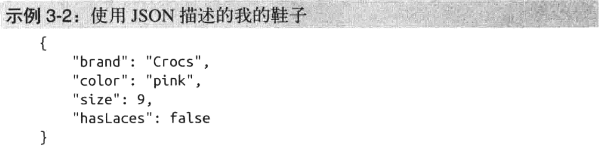

通过对象字面量，我们能够发现对象数据类型是由名称-值对所构成的。如果进一步对这一数据类型进行解构，我们会发现它所使用的原始数据类型：字符串、数字和布尔值。名称-值对中的这些名称("brand"、"color"、"size"和"hasLaces")都是由字符串构成的。"Crocs"和"pink"这两个值也都是字符串。"9"这个值是数字。"false"这个值是布尔类型。

## JSON中的数据类型

虽说对于复合数据类型，乃至于一小部分原始类型来说，它们的编程语言存在许多差异，但我最开始提到的原始类型，大多数语言中都是涵盖的：

* 数字（如5或5.09）
  - 整型
  - 浮点数

* 定点数
  *  字符和字符串（如"a""A"或"apple"）
  * 布尔类型（即真或假）

对象数据类型是在大多数编程语言中都很常见且流行的数据类型，如Java或C#，不过不是全部。由于JSON基于对象字面量表示法以及对象数据类型，你可能觉得让它作为数据交换格式有些不妥。毕竟数据交换格式是以让不同的两个系统间能够进行交流为目标的，这一格式所表达的必须是共有的部分。记住，复合数据类型对象的数据结构可以被解构为原始数据类型。即便是对那些不支持对象数据类型的语言来说，一旦这一数据结构被解构为那些原生的类型，就很好处理了。

JSON中的数据类型包括：

* 对象
* 字符串
* 数字
* 布尔值
* null
* 数组

## JSON中的对象数据类型

JSON中的对象类型非常简单。追根溯源，JSON本身就是对象，也就是一个被花括号包裹的名称-值对的列表。如果你希望在作为对象的JSON中创建一个名称-值对，那就需要用到嵌套。示例3-3向我们展示了如何用嵌套对象来描述一个人。

本例中，最高一级的名称-值对是person，其值是一个对象。这一对象中有三个名称-值对："name"、"heightInInches"和"head"."name"这个名称-值对的值是"Lindsay Bassett".。"heightInInches"的值是一个数字。

"head"的值又是一个对象。其中"hair"的值同样是一个对象。这一对象中包含了三个名称-值对："color"、"Length"以及"style"，"head"的对象中还有一个名称为"eyes"的名称-值对，其值为"green"。

## JSON中的字符串型

前面我们曾通过"animal/cat"这个示例简单讨论了JSON中的字符串类型：

~~~json
{"animal" : "cat" }
~~~

这里的"cat"就是一个字符串类型的值。实际应用中，我们不可能遇到这么简单的字符串类型的值，除非是宠物店的数据。甚至连宠物店也不可能在它的数据中仅仅使用"cat"这么简单的单词。比如，商店想要发布它的促销详情：

> 今天，如果你在Bob's Best Pets购买一只小狗，可免费获得一袋价值8盎司的Bill狗粮，你只需在结账时说"Bob's是最棒的！"即可

JSON中的字符串可以由任何Unicode字符构成，因此上面的促销详情中的所有字符都是可以使用的。字符串的两边必须被双引号包裹。

在第2章的“小故事：JSON的双引号”中，我提到过使用单引号来包裹字符串值是不合法的（示例3-4）

这一点确实容易让人犯迷糊，尤其是在你之前接触过JavaScript对象字面量的情况下。在JavaScript中，使用单引号或双引号没有任何区别。然而请记住，JSON不是JavaScript对象字面量，它只是基于JavaScript对象字面量。
而在JSON中，仅允许使用双引号来包裹字符串。

我们还提到过解析器是如何读JSON的。对解析器来说，当一个值以双引号（"）开始时，它希望接下来的字符串文本以另一个双引号结尾。这意味者如果这段字符串本身包含双引号可能会出错。

举个例子，假如我们就是那个正在进行促销的宠物店店主，我们希望顾客在结账时说出"Bob's是最棒的！”来获得一袋免费狗粮。如果我们使用下面示例3-5中的代码，会出现一个问题，因为这时不能仅用一对双引号来包裹促销数据。

由于在值里面有双引号，解析器在读取第一个双引号之后，会把"Bob"前面的双引号当成字符串结尾的双引号。然后解析器发现后面还有许多不属于任何一个名称-值对的文字，就会报错。为了处理这个问题，我们需要在字符串中的双引号前面加上一个反斜线字符来对其转义，详见示例3-6。

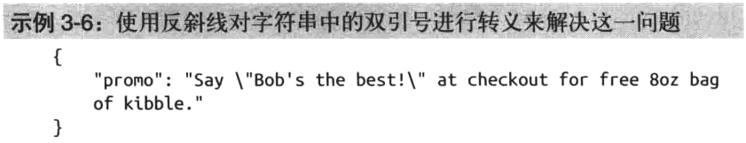

反斜线会告诉解析器这个双引号并不意味着字符串的结束。一旦解析器将字符串装入内存，每一个双引号前的反斜线都会被移除，文本也会按预期输出。

对于JSON的字符串来说，双引号也不是唯一一个需要转义的字符。因为反斜线用于转义字符，所以我们还需要转义反斜线。例如，示例3-7中的JSON内容为我的Program Files文件夹的路径，会报错。为了解决这个问题，我们需要给这个反斜线加上另外一个反斜线来进行转义，详见示例3-8。

除了双引号和反斜线，还需要转义以下字符：

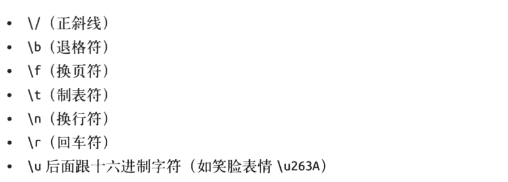

示例3-9中的JSON会由于没有对制表符和换行符进行转义而报错，示例3-10展示了如何解决这一问题。

## JSON中的数字类型

数字是一种常见的用于传递数据的信息片段。库存数目、金额、经度/纬度以及地球的质量等均可以用数字来表示，详见示例3-11。

JSON中的数字可以是整数、小数、负数或者指数。

商品库存数是289，库存是一个典型的整数。我肯定不会卖出半个商品，所以库存数不可能有小数点。

我可怜的账户里只有22.59美元。尽管在一些编程语言中有专门针对金额的数据类型，但在JSON中通常使用小数来表示金额，并省略单位。

如果你注意一下西雅图市的经度和纬度，会发现它们都是小数，且纬度是负数。负数只需在数字前面加上标准的负号字符即可。

此外，我用一个超大的数来表示地球的质量，单位为千克，并使用了指数表示法。指数表示法常常出现在科学数据中，而且也是JSON支持的数字。

## JSON中的布尔类型

在口语中，对问题最简单的回答莫过于肯定或否定。如果你问朋友“你的煎蛋要不要配上吐司面包"，他就会回答“要”或“不要”。

在计算机编程中，布尔类型是很简单的。它不是真就是假。如果你问你的电脑“你的煎蛋要不要配上吐司面包”，它就会回答“真”（true）或“假”（false）。

在一些编程语言中，true的字面值可能用1来表示，false用0来表示。

有时候字面值也可能是大写或小写的单词，比如true或TRUE，false或FALSE，在JSON中，该字面值仅使用小写形式：true或false，任何其他形式的写法都会报错。示例3-12中，我使用布尔值来描述对早餐和午餐喜好的数据。

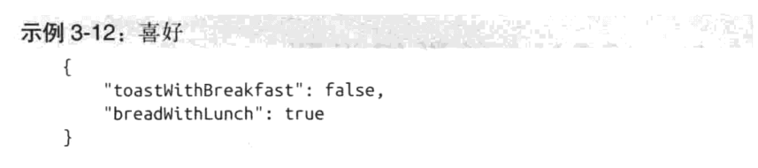

## JSON中的null类型

对于一无所有的东西，你可能觉得用0来描述比较合适。比如，我有0个手表。但事实是，0是一个数字。这意味着本质上是在计数。

如果用一种JSON的标准格式来描述一个人手腕的情况，会是怎样的呢？详见示例3-13及示例3-14。

因为我不戴手表，所以自然不会有手表颜色。而在编程中，null就用来表示0、一无所有、不存在等意思，而不用数字来表示。由于手表颜色的值也是不能被定义的，所以使用null来描述。

不要把null和undefined混淆，尤其是在使用JavaScript时。**undefined不是JSON中的数据类型**，而在JavaScript中，undefined是在尝试获取一些不存在的对象或变量时返回的结果。在JavaScript中，undefined与那些声明的名称和值都不存在的对象或变量有关，而null则仅与对象或变量的值有关。null是一个表示“没有值”的值。在JSON中，null必须使用小写形式。

## JSON中的数组类型

现在探讨一下数组数据类型。如果你对数组不熟悉也没关系，我们先来简单介绍一下。

想象一个装着一打鸡蛋的容器。容器里有12个位置用来放鸡蛋。我刚买下这些鸡蛋时，数量是12个。这就相当于有一个大小为12的数组，包含12个鸡蛋，见示例3-15。

注意，这是一个名称-值对。其名称是"eggCarton"，值是一个数组。数组始终应被方括号（[]）包裹。在数组中，可以看到一个列表，列表项之间用逗号隔开。这有点像处理名称-值对的方式，不过一个关键的区别是这个列表里只有值。这些值可以是任何合法的JSON数据类型(**字符串、数字、对象、布尔值、数组以及null**)。

现在，假如我拿出两个鸡蛋做成煎蛋来搭配早餐的吐司面包。鸡蛋盒里还是有12个位置，不过有两个鸡蛋被拿走了。详见示例3-16。

你可以看到，我拿走了两个位置上的鸡蛋，于是这两个位置就是空的了。

我们把它们用null来表示。

一个数组为每一个“位置”都赋予了一个索引。我们从0开始，那么第一个位置的序号便是0，第二个位置的序号是1，以此类推。最后一个位置的序号是11，所以，那两个被拿走鸡蛋的位置的序号是1和10。这是一个合法的数组。

如果在10的位置上放上数字5，那么在大多数编程语言中，这样的数组都是不合法的。详见示例3-17。

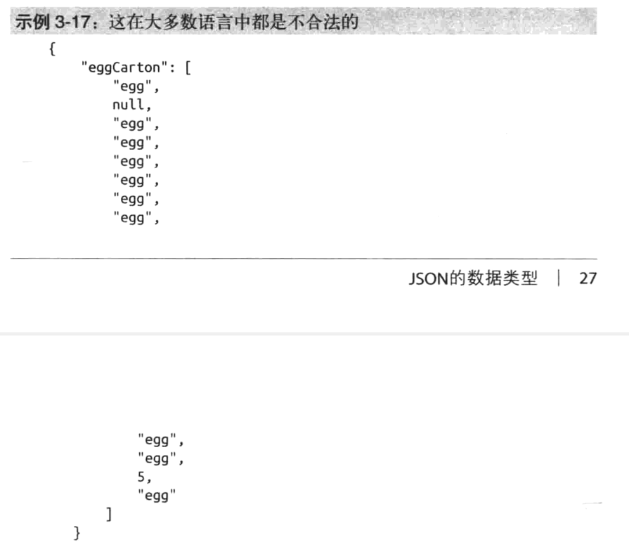

虽然在“大多数语言”中不合法，但在JSON中，这种混合使用数据类型的情况是合法的。接下来我会告诉你为什么合法，以及为什么应该避免这样做。

在JavaScript中，你定义了一个变量。例如，示例3-18中有一个名为something的变量，我们将其赋值为数字5。

使用var声明的变量something的值可以是数字、字符串、数组、null以及对象中的任意一种类型。不过大多数语言都不允许变量的类型随意改变。正常情况下，在声明变量时，也需要说明它们是整型、字符串还是对象。所以在声明something这个变量时，得用`int something =5`，`string something ="bob"`或是`Person something = new Person（"Bob"）`，所以在大多数语言中，当声明一个数组时，也要声明所有容器中所保存的数据都应是什么类型，且之后不能随意修改。

JSON是一种数据交换格式。如果将JSON数据传递给一个不使用JavaScript的系统，那么在解析时很可能会出错。

这就好比去参加一个奇石藏品展卖会。你出售一套含50块奇石的藏品，一个哥们过来从你这里买了这套藏品，但是到家一看，发现这一套藏品并不是50块奇石，而是20块奇石、20根木棒和10块口香糖（有些还被嚼过）。

下面仔细看一些各种数据类型的数组的例子。在JSON中，数组里可以包含任何支持的数据类型。所以可以有字符串构成的数组、数字构成的数组、布尔值构成的数组、对象构成的数组，甚至是数组构成的数组。数组构成的数组也被称为多维数组。下面是一些例子。

假如有一个学生上课的签到名单。这可以用字符串构成的数组表示（示例3-21）。

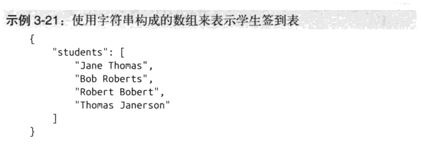

在学生们考完试以后，可以用数字构成的数组来表示他们的分数（示例3-22）。

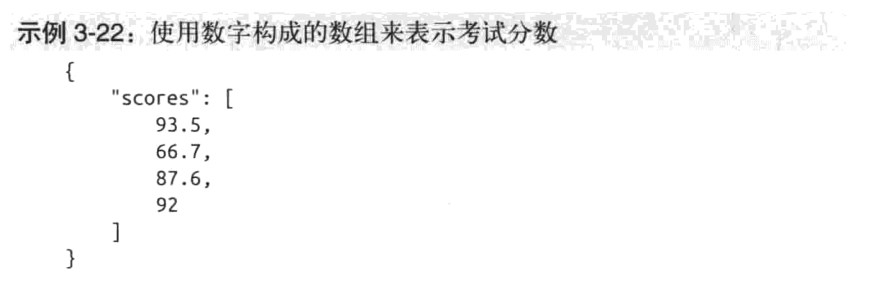

如果需要给只包含判断题的考试做一份答案，可以使用布尔值构成的数组（示例3-23）。

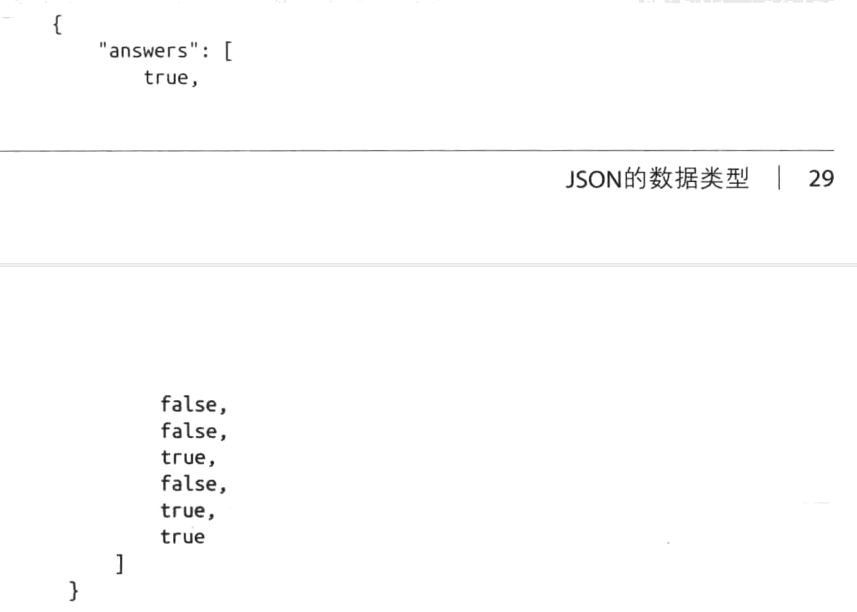

一个由对象构成的数组可以表示整个考试，既包括问题也包括答案（示例3-24）。

为了表示三场不同考试的答案，可以使用由数组构成的数组，也就是多维数组来解决（示例3-25）。

## 专业术语和概念

# 第4章：JSON Schema(模式)

[什么是JSON Schema?](https://zhuanlan.zhihu.com/p/65673098)

[什么是JSON Schema?](https://juejin.im/post/6844903848239169550)

[JSON Schema 参考书](https://imweb.io/topic/57b5f69373ac222929653f23)

第3章讲解了JSON的数据类型，并对其重要性和应用价值进行了探讨。是否提前了解事物的本质和用途（想想那个拿着锤子的孩子）会对事情的进展产生很大的影响。

在大多数情况下，数据交换格式中的数据通过互联网或其他网络传输到接收方。而接收方会对数据文件的格式，包括其结构和数据类型有一个预期。所以，接收方通常会提供一个文档来解释预期的格式并提供示例。

然而无论提供的文档多么详尽，数据都有可能会出错。要说明一点，我们在这里要探讨的不是语法错误，而是一些诸如“我寄了一个苹果，但你想要的是橘子”这类出于误解的错误。本书将这类验证称为一致性验证
（conformity validation），以此与语法验证区分开来。

在这里，这一验证过程通常分为以下几步。

（1）你创建好了数据并且信心十足。
（2）你通过互联网向接收方发送数据。今天网速很慢，你发送的数据文件又很大，所以这花了几分钟的时间。
（3）由于数据不符合接收方的要求，你只收到了错误响应。虽说信心备受打击，但幸运的是，错误响应告诉了你一些有价值的信息，比如错在哪里。
（4）你重新查阅文档，找到并修复你认为出错的地方，然后重回步骤（1）。

早在JSON出现以前，这样的情况就已经存在于数据交换之中。幸运的是，技术从业者都是擅长解决问题的人，Schema（意为模式）这一概念也随之诞生。

## 验证的魔力

在现实生活中，对于重要事项，常常需要双方签订合同。当签订一份要求完成某个项目的合同时，合同会对具体的细节进行概述。比如，我同意在8月31日前交付宇宙飞船，最终的产品将是一个功能健全的宇宙飞船，包含完整的生命支持系统、光照系统以及三个引擎。

想象我们现在生活在一个魔法世界。当公司将项目合同交给我时，在上面施了魔法。任何时候，只要我用魔杖轻点合同书，它就会告诉我是否完成了任务。这就避免了一些尴尬的情况，比如我在会上告诉大家“完工了”，结果有人说“你答应放在飞船上的第三个引擎去哪了？"。我随时都可以验证是否真的完成了任务，完成后就可以充满信心地去开会。

数据交换Schema和这个假想世界中的魔法很相似。在发送数据前，我们随时可以验证数据是否与Schema一致，以便知道会不会被接收方接受。当在交换数据的过程中使用Schema时，所经历的步骤和不使用Schema时有很大的差别，如下所示。

（1）通过验证数据与Schema的一致性，你轻松地定位和修复了错误。你从每个错误中都能得到许多有用的信息。

（2）创建好了数据并且信心十足。
（3）你从网上将数据发送过去，并收到了成功响应。任务完成。

此外，JSON Schema也可以被接收方用于传输的另一端。JSON Schema可以位于要接收的数据的第一行，以保证数据符合要求。它可以在数据被处理前回答下面的所有问题。

* 值的数据类型是否正确？
  可以具体规定一个值是数字、字符串等类型。
* 是否包含所需要的数据？
  可以具体规定哪些数据是需要的，哪些是不需要的。
* 值的形式是不是我需要的？
  可以指定范围、最小值和最大值。

## JSON Schema简介

尽管JSON已经相当成熟，但JSON Schema仍在开发之中。截至2015年4月，JSON Schema最新版是草拟版本4，当然这并不意味着你现在不可以使用它，这仅仅说明了它仍在成长，且将来会做得更好。

JSON Schema使用JSON来书写，所以仅需几步就能掌握它。首先，需要在JSON第一个名称-值对中，声明其为一个schema文件（示例4-1）

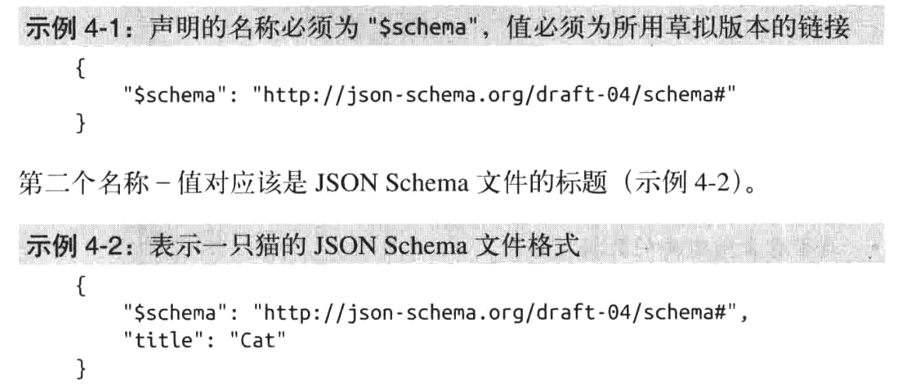

在JSON Schema文件的第三个名称值对中，要定义需要在JSON中包含的属性。`"properties”`的值实质上是我们想要的JSON的名称-值对的骨架。

我们没有使用字面量，而是使用了一个对象来定义数据类型，并有选择地进行描述（示例4-3）。

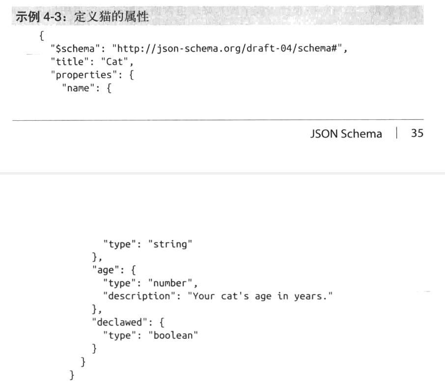

接下来就能验证JSON是否符合JSON Schema（示例4-4）。

前面提到过，JSON Schema可以帮助回答下列问题。

* 值的数据类型是否正确？
  可以具体规定一个值是数字、字符串等类型。
* 是否包含所需要的数据？
  可以具体规定哪些数据是需要的，哪些是不需要的。
* 值的形式是不是我需要的？
  可以指定范围、最小值和最大值。

在猫的示例中，我们解决了第一个问题。可以验证表示“Fluffy”这只猫的JSON中的name、age和declawed是否都有正确类型的值。接下来处理第二个问题：是否包含所需要的数据？

对于数据，总有一些属性（或字段）必须包含值，也有一些不用包含。例如，在一家购物网站上注册一个新账户，需要填写详细的收货地址，其中必填项是姓名、省、市、街道和邮政编码。还可以选填公司名、小区名、门牌号，等等。如果遗漏了必填字段，那么将无法进行后续步骤。

为了在JSONSchema中实现这一逻辑，需要在“$schema"、“title”和“properties“后面加上第四个名称-值对，它的名称是“required”，值为一个数组。数组中包含必填的字段。

在示例4-5中，先加入一个新的“description"字段。接下来加上第四个名称-值对“required”，先让它的值为一个空数组。由于“name"、“age”和“declawed“是必填字段，所以把它们加入数组。“description”不是必填字段，就不应加入数组中。

在将“required"字段加入JSONSchema后，合法的JSON如示例4-6所示。

这段JSON中包含了在Schema中定义的“name"、“age”和“declawed“三个字段，也包含了可选的“description”字段。

由于“description”不属于必填字段，所以也可以不填它。示例4-7也同样符合我们定义的关于猫的JSON Schema，它包含了必填字段“name"、"age"和“declawed"。

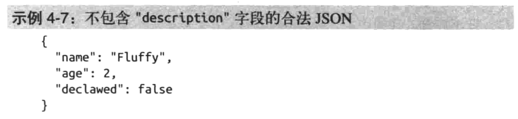

非常重要的一点是，如果你的JSON Schema中不包含“required“名称-值对，那么将不会有必填项。一个没有任何名称-值对的空JSON对象也被认为是合法的。如果没有“required”数组，那么示例4-8也会被认为是符合关于猫的JSON Schema。

我们可以利用JSON Schema回答的第三个，也是最后一个问题是：值的形式是不是我需要的？虽然前面解决了数据类型的问题，但我们常常需要对该类型的格式提出更具体的要求。比如，我需要一个用户名，但用户名的长度不能超过20个字符。另外，还有可能要求数字的范围是10~100。这些具体的要求也都可以在JSON Schema中体现。

在猫的JSON示例中，虽然提出了一些诸如名字应为字符串、年龄应为数字之类的要求，但我们肯定不希望有人给小猫起过长或过短的名字，也不希望把年龄填成负数。所以在JSONSchema中可以定义字符串长度的最小值和最大值，以及数字的最小值。

在示例4-9中，我们增加了新的验证项目来保证猫的名字长度不少于3个字符，也不多于20个字符。此外，还保证了小猫的年龄不为负数。

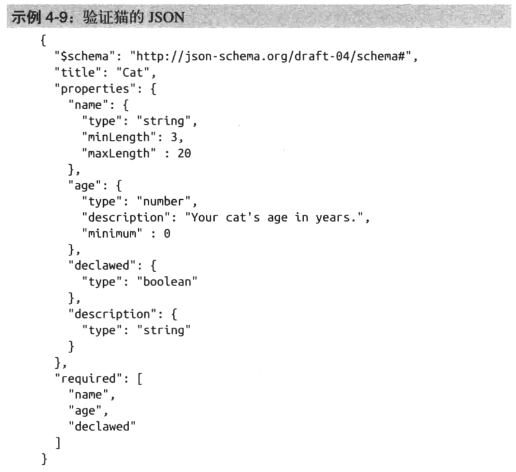

示例4-10中的JSON由于名称值长度超过了“maxLength“且年龄小于“minLength"，因而不会通过验证。

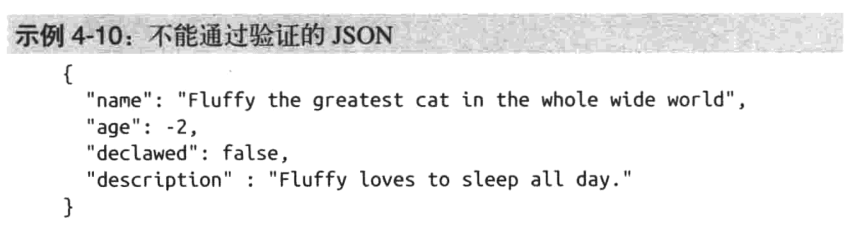

示例4-11向我们展示了一个符合猫的JSONSchema要求并符合对值的要求的合法JSON。

如果再回过头来比较Schema和合同，会发现合同中所规定的细节可以非常具体。本章提供的例子只是简介，是冰山一角。JSONSchema还支持正则表达式（一种字符形式，比如电子邮件地址的格式）以及枚举类型（一个包含所有可能值的列表）。如果你希望深入掌握JSONSchema，可以访问下面的链接，了解相关规范：

* JSON Schema 主页（http://json-schema.org/）
* JSON Schema 验证规范（http://json-schema.org/latest/json-schema-validation.html）

现在有许多针对具体编程语言和框架的JSONSchema库和项目，并且还在增加。如果你想在你的项目中使用JSON Schema，那么搜索“JSON Schema验证[在这里输入具体的编程语言名称]”会帮你找到你所需要的东西。此外，还有一些在线验证工具，它们都与编程语言无关，也是进行JSON Schema验证的好帮手：

* JSON Schema Lint (http://jsonschemalint. com/draft4/)
* JSON Schema Validator(http://www. jsonschemavalidator. net/)

JSON Schema Lint这个网站包含两个文本区域：一个用于输入JSON Schema，另一个用于输入待验证的JSON文件。现在我将示例4-9的schema和示例4-10的JSON分别粘贴到两个区域，会看到如下错误信息：

* Field: data. name, Error: has longer length than allowed. Value:"Fluffy the greatest cat in the whole wide world"
* Field: data. age, Error: is less than minimum, Value:-2

JSON Schema Validator这个网站也包含相同功能的两个区域。再一次将示例4-9和示例4-10输入，将看到如下的错误信息。此外，JSON中出错的那一行的行号也会变成红色，以告诉我们具体哪一行出了错误。

* Message:String Fluffy the greatest cat in the whole wide world exceeds maximum length of 20,Schema Path:#/properties/name/maxLength
*  Message:Integer-2 is less than minimum value of 0,Schema Path:#/properties/age/minimum

除了提示出错行以外，JSON Schema Validator还会告诉我们导致验证失败的相关规范的具体路径。这两个验证器虽然提示出错的方式稍有不同，但指出的错误是相同的。

## 专业术语和概念

本章涵盖了以下专业术语。

* JSON Schema

  数据交换中的一种虚拟的“合同”。

我们还讨论了以下重要概念。

* JSON验证器负责验证语法错误，JSON Schema负责提供一致性检验。·
* JSON Schema是数据接收方的第一道防线，也是数据发送方节约时间、保证数据正确的好工具。
* JSON Schema可以解决下列有关一致性验证的问题。
  * 值的数据类型是否正确？
    可以具体规定一个值是数字、字符串等类型。
  * 是否包含所需要的数据？
    可以具体规定哪些数据是需要的，哪些是不需要的。
  * 值的形式是不是我需要的？
    可以指定范围、最小值和最大值。

# 第5章：JSON中的安全问题

JSON本身不会构成什么威胁，毕竟它只是一种数据交换格式。它不过是种数据文件，或者说数据流。真正会产生安全问题的是JSON的使用。本章重点讨论在Web中使用JSON时最常见的两个安全问题：**跨站请求伪造(CSRF)**和**跨站脚本攻击(XSS)**。

在讨论安全问题和本书后面的内容前，有必要了解一下客户端和服务端的关系。如果你还不了解这些概念，那么请跟我简单了解一下。

## 客户端和服务端的关系

和往常一样，我又一次来到Pierre's Fine Dining餐厅享用晚餐。我坐在桌边，看着桌上被折叠成天鹅形状的餐巾，等待着服务员过来点餐。不一会儿，一个穿着T恤和长裤的帅小伙走过来说：“我叫托马斯，是这里的服务员。”很快，他认出了我，把声音压低了些说道：“顺便说一句，您可是我最棒的顾客之一。”他睫毛闪动，继续说：“这是我们的特供菜单。”

看完特供菜单后，我点了菜，托马斯很快就把菜上好了。我美美地用完餐，并为这些精美可口的餐点付了200美元。这是我在Pierre's Fine Dining餐厅度过的又一个美妙的晚上。在这里，托马斯是服务员，我是客户。

互联网浏览器和网站之间的关系就像我和餐厅的关系一样。这一关系包含了大量的请求和响应。我的请求是一份晚餐，厨房的响应则是将我点的菜做出来并送到我的面前。

举个例子，假如你正在喜欢的网站上看可爱小猫的图片，你电脑上的互联网浏览器就是客户端，而运行着可爱小猫图片的网站的电脑就是服务端。你的浏览器通过互联网将请求发送给小猫图片网站的服务器，服务器接着就会把对应的页面作为响应发送给你。接下来你的浏览器就会将页面在屏幕上渲染出来。

在这一关系中，我们称图片网站返回的即将被浏览器处理的响应为客户端代码。前面提到的饭店的例子中，响应就是送来的晚餐，而餐桌就像网络浏览器。晚餐放到桌子上，然后我就能享用了。

我们将页面响应传递过来之前所发生的事（主要是页面的创建）称为服务端代码。饭店的例子中，服务端代码就是在厨房中发生的事情。我不会到厨房去，也不会去看他们把饭做出来都经历了什么过程。这个例子和实际情况唯一的不同点是，服务器不是那个在餐桌和厨房间来回跑的服务员。厨房像是服务器，服务员则像是互联网。

网站不会把它在“厨房”中做的事公开。网站可能使用PHP，ASP.NET或其他编程语言。无论“厨房”里发生什么，对我的浏览器都不会产生什么影响，只要它交付正确的客户端代码即可。

具体来讲，我在客户端收到的响应就是HTML，CSS和JavaScript代码。就跟能看到餐桌上有什么菜一样，只需按下键盘上的F12，打开开发者工具，便可看到页面包含的所有的HTML，CSS和JavaScript代码。我甚至可以看到那些烦人的小猫跳舞的flash效果是怎么用JavaScript来实现的。

客户端就是发生在用户浏览器中的一切，而服务端则是发生在运行网站的服务器中的一切。当我们提起客户端代码时，通常指的是JavaScript、HTML或CSS，当我们提到服务端代码时，常常是指一些服务端语言，如ASP.NET、Ruby on Rails或Java。

现在可以讨论安全问题这个重要的话题了。

(剩下的内容略，以后再看)

# 第6章：JavaScript中的`XMLHttpRequest`与Web API

JavaScript 中的`XMLHttpRequest`与Web API等概念听上去好像很难，但实际上并没有想象中那么复杂。它仅仅是一种简单的客户端与服务端的关系。JavaScript中的`XMLHttpRequest`负责在客户端发起请求，而Web API负责在服务端返同响应。

在上一章中，我曾用餐厅的例子来说明客户端和服务端的关系。服务端就像是厨房，客户端就像是来用餐的人。而这一章关注的就是其中一类厨房，看看它是如何运作的。

毋庸置疑，不同餐厅的运作方式千差万别。在有些餐厅，你可以驱车到用餐窗口点餐。有些餐厅对公众开放，而有的则只是某个大公司的内部食堂。

我们平时接触最多的一种客户端一服务端关系就是上网。通常情况下，我们会认为自己是在网上不断地浏览和探索，而实际上一直都是坐在椅子上盯着电脑屏幕。浏览器哪都没有去。它就像是餐厅的桌子，老老实实待着，发送请求，接收响应。一且服务端回应了请求，便去着手回应其他的请求了。

互联网浏览器发送的是对某项资源的请求。上网时，要么点击一个指向某个URL的链接，要么直接在浏览器中输入URL，URL的全称是**统一资源定位符(**Uniform Resource Locator)。我们在浏览器中使用的URIL通常指向HTML资源，它能让我们看到我们的网站，比如前面提到的可爱小猫图片网站。在这种情况下，我们所请求的资源的内容类型为`text/html`。

另一种与我们并不直接相关的客户端一服务端关系是Web API，Web API的服务内容和普通网站差不多，但是它并不是用来拿给人看的。你可以把它想象成为代码服务的餐厅，毕竟大多数发往这类服务器的请求都是由代码发起的。

程序代码不会像我们一样请求小猫的图片来看。通常情况下，它所需要的是获取数据。在这一章，我们将着眼于一种请求JSON资源（一种内容类型为application/json的资源）的客户端，以及为这类顾客服务的餐厅：Web API。

现在看看什么是Web API，以及JSON在其中所扮演的角色。

## Web API

和人不同，代码没有一双能够读书或看图的眼睛。**它只能以一种它能读取（解析）的格式来查看“某样东西”**。这也就是数据交换格式（如JSON，见示例6-1）的用武之地。

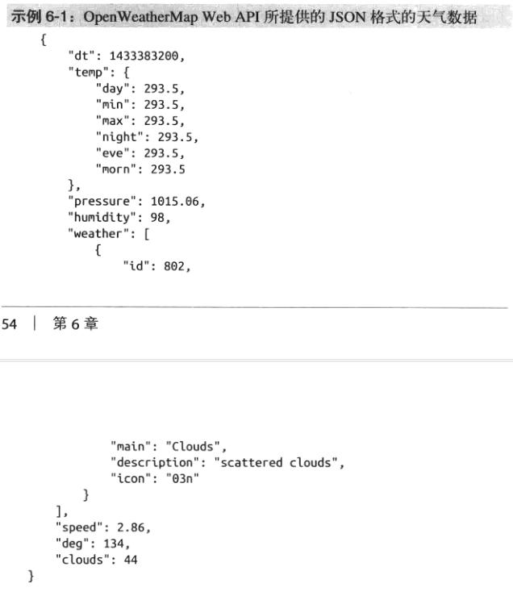

这段JSON格式的天气数据，可以被任何能够解析JSON的代码所使用。JSON资源可以通过一个URL来请求（上面的代码示例是一份完整JSON文档的一部分）：

~~~json
http://api.openweathermap.org/data/2.5/forecast/daily?lat-35&lon-139&cnt= 10&mode-json
~~~

尽管许多Web API就像Open WeatherMap一样只有“读”的功能，但也有许多诸如PayPal API这样的API还具有交互性。Web API是通过HTTP服务进行交互的一组指令和标准。这些交互可以包括创建、读取、更新、删除(CRUD)等操作，且Web API都会有一份说明，概述如何使用这些指令和标准。

例如，根据PayPal API的说明，我将通过向如下URL发送JSON数据的方式，使用PayPal API创建一张新的发票：

~~~json
https://api.sandbox.paypal.com/vl/invoicing/invoices
~~~

示例6-2中，我将把一段代表一张发票的JSON数据作为请求发送给PayPal API。