(注1：现在是2020年9月14日，我决定有时间的时候还是要把这本数据结构通俗读物看完，连带着还有一本算法通俗读物《算法图解》。)

(注2：等什么时候把这本书和《算法图解》看完了，我就去LeetCode上面找点题目做做了。)

(注3：这本书实在是太难写博文了，里面一大推的符号，一个一个手输实在是太费事了，我后面就截图了吧。)

# 第1章：数据结构绪论

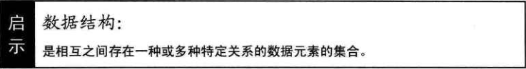

## 开场白

If you give someone a program，you will frustrate them for a day；if you teach them how to program，you will frustrate them for a lifetime.（如果你交给某人一个程序，你将折磨他一整天；如果你教某人如何编写程序，你将折磨他一辈子。）

而我可能就是要折磨你们一辈子的那个人。大家好！我是《数据结构》这门课的老师，我叫封清扬。同学私下里都叫我“疯子”，嘿嘿，疯子可是有思想的标志哦。

在座的大家给我面子，都来选修我的课，这点我很高兴。不过在上课前，有些话还是要先说一下。

数据结构是计算机专业的基础课程，但也是一门不太容易学好的课，它当中有很多费脑子的东西，之后在上课时，你若碰到了困惑或不解的地方，都是很正常的反应，就像你想乘飞机去旅行，在飞机场晚点几个钟头，上了飞机后又颠簸恐慌了一把一样，别大惊小怪，都很平常，只要能安全到达就是成功。

如果你的学习目的是为了将来要做一个优秀的程序员，向微软、Googe的工程师们看齐，那么你应该要努力学好它，不单是来听课、看看教科书，还需要课后做题和上机练习。不过话说回来，如果你真有这样的志向，课前就该开始研究了，这样来听我的课，就更加有主动性，收获也会更大。

如果你的目的是为了考计算机、软件方面的研究生，那么这门必考课，你现在就可以准备起来——很多时候，考研玩的不是智商，其实就是一个人投入的时间而已。

如果你只是为了混个学分，那么你至少应该要坚持来上课，在我的课堂上听懂了，学明白了，考前适当地复习，拿下这几个学分应该不在话下。

如果你只是来打酱油的，当然也可以，我的课不妨碍你打酱油，但你也不要妨碍其他同学坐到好位子，所以请靠后坐，并且保持安静，静心打酱油就好。

如果，我是说真的如果，你是一个对编程无比爱好的人，你学数据结构的目的，既不是为了工作为了钱，也不是为了学位和考试，而只是为了更好地去感受编程之美。啊，你应该得到我的欣赏，我想我非常愿意与你成为朋友——因为我自己也没有做到如此纯粹地去学习和应用它。

## 你数据结构怎么学的

早先我有一个学生叫蔡遥，绰号“小菜”。他前段时间一直通过E-mail 与我交流，其中说起了他工作的一些经历，感慨万干。我在这里就讲讲小菜的故事。

他告诉我，在做我学生时，其实根本就没好好学数据结构，时常逃课，考试也是临时突击后勉强及格。毕业后，他几经求职，算是找到了一份程序员的工作。

工作中，有一次他们需要开发一个客服电话系统，他们项目经理安排小菜完成客户排队模块的代码工作。

小菜觉得这个很容易，用数据库设计了一张客户排队表，并且用一个自动递增的整型数字作为客户的编号。只要来一个客户，就给这张表的末尾插入一条数据。等客服系统一有空闲，就从这张表中取出最小编号的客户提交，并且删除这条记录。花了两天时间，他完成开发并测试通过后，得意地提交了代码。谁知他们的项目经理，看完代码后，跑到他的桌前，拍着桌子对他说：“你数据结构怎么学的？这种实时的排队模块，用什么数据库呀，在内存中完成不就行了吗。赶快改，今天一定要完成，明天一早交给我。”

小菜吓得一身冷汗，这脸丢得有些大了，自己试用期都没结束，别因此失去工作。于是他当天加班加点，忙到晚上十一点，用数组变量重新实现了这个功能，因为考虑到怕数组不够大而溢出，于是他设计100作为数组的长度。

回到家中，他害怕这个代码有问题，于是就和他的表哥大鸟说起了这个事。他表哥笑嘻嘻地对他说：“你数据结构怎么学的？”小菜惊讶地张着大口，一句话也说不出来。然后他表哥告诉他，这种实时的排队系统，通常用数据结构中的“队列结构”是比较好的，用数组虽然也可以，但是又要考虑溢出，又要考虑新增和删除后的数据移动，总的说来很不方便。你只要这样……这样……就可以了。

小菜在大鸟的帮助下，忙到凌晨3点，重新用队列结构又写了一遍代码，上班时用U盘拷回公司，终于算是过了项目经理这一关。

之后，小莱开始重视数据结构，找回大学的课本重新学习。他还给我发了好些邮件，问了我不少他困惑的数据结构和算法的问题，我也一一给了他解答。终于有一天，他学完了整个课程的内容，并给我写了一封感谢信，信中是这么说的：

“封老师：您好！感谢您这段时间的帮助，在大学时没有好好上您的课真是我最大。的遗德。我现在已经学完了《数据结构》整本书的内容，收获还是很大的。可是我一直有这样的困惑想请教您，那就是我在工作中发现，我所需要的如栽、队列、链表、散列表等结构，以及查找、排序等算法，在编程语言的开发工具包中都有完美的实现，我只需要掌握如何使用它们就可以了，为什么还要去弄懂这里面的算法原理呢？”

我收到这封信时，立马跳了起来，马上拨通了他的手机，第一句话就是……你们猜猜看，我说了啥？

“你数据结构怎么学的？”（全场同学齐声大喊，大笑）

好了，我为什么这么讲，等你们学完我的课程就自然会明白。我只希望在将来，不要有某个人也对你们说出这句话，如果当真听到了这句话，就拜托你不要说你的数据结构老师是我封清扬，嘿嘿。

现在我们正式开始上课。

## 数据结构的起源

早期人们都把计算机理解为**数值计算工具**，就是感觉计算机当然是用来计算的，所以计算机**解决问题**，应该是**先从具体问题中抽象出一个适当的数据模型，设计出一个解此数据模型的算法，然后再编写程序，得到一个实际的软件**。

可现实中，我们更多的**不是解决数值计算的问题**，而是需要一些更科学有效的手段（比如表、树和图等数据结构）的帮助，才能更好地处理问题。所以**数据结构是一门研究非数值计算的程序设计问题中的操作对象，以及它们之间的关系和操作等相关问题的学科。**

1968年，美国的高德纳（Donald E.Knuth）教授在其所写的《计算机程序设计艺术》第一卷《基本算法》中，较系统地阐述了数据的逻辑结构和存储结构及其操作，开创了数据结构的课程体系。同年，数据结构作为一门独立的课程，在计算机科学的学位课程中开始出现。也就是说，那之后计算机相关专业的学生开始接受《数据结构》的“折磨”——其实应该是享受才对。

之后，70年代初，出现了大型程序，软件也开始相对独立，结构程序设计成为程序设计方法学的主要内容，人们越来越重视“数据结构”，认为**程序设计的实质是对确定的问题选择一种好的结构，加上设计一种好的算法**。可见，数据结构在程序设计当中占据了重要的地位。

~~~
程序设计 = 数据结构 + 算法
~~~

## 基本概念和术语

说到数据结构是什么，我们得先来谈谈**什么叫数据**。

正所谓“巧妇难为无米之炊”，再强大的计算机，也是要有“米”下锅才可以干活的，否则就是一堆破铜烂铁。**这个“米”就是数据**。

### 数据

**数据：是描述客观事物的符号，是计算机中可以操作的对象，是能被计算机识别，并输入给计算机处理的符号集合。**数据不仅仅包括整型、实型等数值类型，还包括字符及声音、图像、视频等**非数值类型**。

比如我们现在常用的搜索引擎，一般会有网页、MP3、图片、视频等分类。MP3就是声音数据，图片当然是图像数据，视频就不用说了，而网页其实指的就是全部数据的搜索，包括最重要的数字和字符等文字数据。

也就是说，我们这里说的**数据**，其实就是**符号**，而且这些符号必须具备两个前提：

* 可以输入到计算机中

* 能被计算机程序处理

对于整型、实型等数值类型，可以进行数值计算。

对于**字符数据类型**，就需要进行**非数值的处理**。而声音、图像、视频等其实是可以**通过编码的手段变成字符数据来处理**的。

### 数据元素

**数据元素**：是组成数据的、有一定意义的**基本单位**，在计算机中通常作为**整体处理**。也被称为**记录**。

比如，在人类中，什么是数据元素呀？当然是人了。

畜类呢？哈，牛、马、羊、鸡、猪、狗等动物当然就是禽类的数据元素。

### 数据项

**数据项：一个数据元素可以由若干个数据项组成。**

比如**人这样的数据元素**，可以有眼、耳、鼻、嘴、手、脚这些**数据项**，也可以有姓名、年龄、性别、出生地址、联系电话等数据项，**具体有哪些数据项，要视你做的系统来决定**。

> 数据项的集合就是数据元素。

**数据项是数据不可分割的最小单位。**在数据结构这门课程中，我们把数据项定义为最小单位，是有助于我们更好地解决问题。所以，记住了，**数据项是数据的最小单位**。但**真正讨论问题**时，**数据元素才是数据结构中建立数据模型的着眼点**。就像我们讨论一部电影时，是讨论这部**电影角色**这样的“数据元素”，而不是针对这个角色的姓名或者年龄这样的“数据项”去研究分析。

### 数据对象

**数据对象：是性质相同的数据元素的集合，是数据的子集。**

什么叫性质相同呢，是指**数据元素具有相同数量和类型的数据项**，比如，还是刚才的例子，人都有姓名、生日、性别等相同的数据项。

既然数据对象是数据的子集，在实际应用中，处理的数据元素通常具有相同性质，在不产生混淆的情况下，我们都将数据对象简称为数据。

好了，有了这些概念的铺垫，我们的主角登场了。

说了数据的定义，那么**数据结构中的结构又是什么呢**？

### 数据结构

**结构**，简单的理解就是**关系**，比如分子结构，就是说组成分子的原子之间的排列方式。**严格点说，结构是指各个组成部分相互搭配和排列的方式**。在现实世界中，**不同数据元素之间不是独立的，而是存在特定的关系**，**我们将这些关系称为结构**。那数据结构是什么？

~~~javascript
数据结构：是相互之间存在一种或多种特定关系的数据元素的集合。
~~~

在计算机中，数据元素并不是孤立、杂乱无序的，而是具有内在联系的数据集合。**数据元素之间存在的一种或多种特定关系，也就是数据的组织形式**。

为编写出一个“好”的程序，必须**分析待处理对象的特性及各处理对象之间存在的关系**。这也就是研究数据结构的意义所在。

定义中提到了一种或多种特定关系，具体是什么样的关系，这正是我们下面要讨论的问题。

## 逻辑结构与物理结构

按照视点的不同，我们把数据结构分为**逻辑结构**和**物理结构**。

### 逻辑结构

逻辑结构：是指数据对象中数据元素之间的相互关系。其实这也是我们今后最需要关注的问题。逻辑结构分为以下四种：

1. **集合结构**

   集合结构：集合结构中的数据元素除了同属于一个集合外，它们之间没有其他关系。**各个数据元素是“平等”的**，它们的共同属性是“同属于一个集合”。数据结构中的集合关系就类似于数学中的集合（如图1-5-1所示）。

   

2. **线性结构**

   线性结构：线性结构中的**数据元素之间是一对一的关系**（如图1-5-2所示）。

   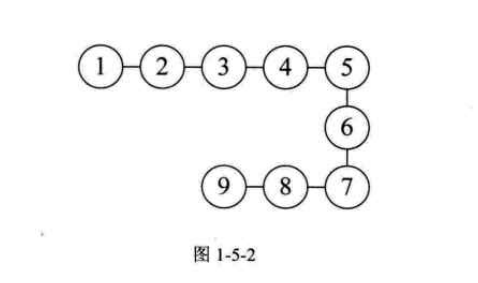

3. **树形结构**

   树形结构：树形结构中的数据元素之间**存在一种一对多的层次关系**（如图1-5-3所示）。

   

4. **图形结构**

   图形结构：图形结构的数据元素是**多对多的关系**（如图1-5-4所示）。

   

我们在用示意图表示数据的逻辑结构时，要注意两点：

* 将**每一个数据元素看做一个结点，用圆圈表示**。

* 元素之间的**逻辑关系**用结点之间的**连线**表示，如果这个关系是有**方向**的，那么用**带箭头的连线**表示。

从之前的例子也可以看出，逻辑结构是针对具体问题的，是为了解决某个问题，**在对问题理解的基础上，选择一个合适的数据结构表示数据元素之间的逻辑关系**。

### 物理结构

说完了逻辑结构，我们再来说说数据的**物理结构**（很多书中也叫做**存储结构**，你只要在理解上把它们当一回事就可以了）。

**物理结构：是指数据的逻辑结构在计算机中的存储形式。**

数据是数据元素的集合，那么根据物理结构的定义，实际上就是如何把数据元素存储到计算机的存储器中。**存储器主要是针对内存而言的**，像硬盘、软盘、光盘等**外部存储器**的数据组织通常用**文件结构**来描述。

数据的存储结构应正确反映数据元素之间的逻辑关系，这才是最为关键的，如何存储数据元素之间的逻辑关系，是实现物理结构的重点和难点。

数据元素的存储结构形式有两种：**顺序存储和链式存储**。

1. **顺序存储结构**

   顺序存储结构：是把数据元素存放在地址连续的存储单元里，其**数据间的逻辑关系和物理关系是一致的**（如图1-5-5所示）。

   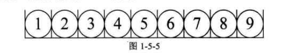

   这种存储结构其实很简单，说白了，就是**排队占位**。大家都按顺序排好，每个人占一小段空间，大家谁也别插谁的队。我们之前学计算机语言时，**数组就是这样的顺序存储结构**。当你告诉计算机，你要建立一个有9个整型数据的数组时，计算机就在内存中找了片空地，按照一个整型所占位置的大小乘以9，开辟一段连续的空间，于是第一个数组数据就放在第一个位置，第二个数据放在第二个，这样依次摆放。

2. 链式存储结构

   如果就是这么简单和有规律，一切就好办了。可实际上，总会有人插队，也会有人要上厕所、有人会放弃排队。所以**这个队伍当中会添加新成员，也有可能会去掉老元素，整个结构时刻都处于变化中**。显然，面对这样时常要变化的结构，顺序存储是不科学的。那怎么办呢？

   现在如银行、医院等地方，设置了排队系统，也就是每个人去了，先领一个号，等着叫号，叫到时去办理业务或看病。在等待的时候，你爱在哪在哪，可以坐着、站着或者走动，甚至出去逛一圈，只要及时回来就行。你关注的是前一个号有没有被叫到，叫到了，下一个就轮到了。

   **链式存储结构：是把数据元素存放在任意的存储单元里，这组存储单元可以是连续的，也可以是不连续的**。**数据元素的存储关系并不能反映其逻辑关系**，因此需要用一个**指针**存放数据元素的**地址**，这样通过地址就可以找到相关联数据元素的位置（如图1-5-6所示）。

   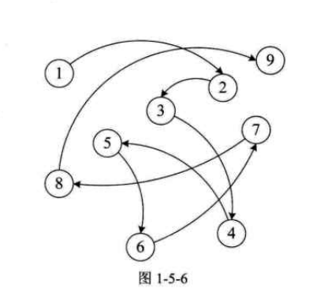

   显然，链式存储就灵活多了，数据存在哪里不重要，只要有一个**指针**存放了相应的地址就能找到它了。

   前几年香港有部电影叫《无间道》，大陆还有部电视剧叫《潜伏》，都很火，不知道大家有没有看过。大致说的是，某一方潜伏在敌人的内部，进行一些情报收集工作。为了不暴露每个潜伏人员的真实身份，往往都是单线联系，只有上线知道下线是谁，并且是通过暗号来联络。正常情况下，情报是可以顺利地上传下达的，但是如果某个链条中结点的同志牺牲了，那就麻烦了，因为其他人不知道上线或者下线是谁，后果就很严重。比如在《无间道》中，梁朝伟是警方在黑社会中的卧底，一直是与黄秋生扮演的警官联络，可当黄遇害后，梁就无法证明自己是一个警察。所以影片的结尾，当梁朝伟用枪指着刘德华的头说，“对不起，我是警察。”刘德华马上反问道：“谁知道呢？”是呀，当没有人可以证明你身份的时候，谁知道你是谁呢？影片看到这里，多少让人有些唏嘘感慨。这其实就是链式关系的一个现实样例。

   **逻辑结构是面向问题的，而物理结构就是面向计算机的**，其基本的目标就是**将数据及其逻辑关系存储到计算机的内存中**。

## 抽象数据类型

### 数据类型

**数据类型：是指一组性质相同的值的集合及定义在此集合上的一些操作的总称。**

**数据类型是按照值的不同进行划分的**。在**高级语言**中，每个**变量、常量和表达式**都有**各自的取值范围**。**类型**就用来说明**变量或表达式的取值范围和所能进行的操作**。

当年那些设计计算机语言的人，为什么会考虑到数据类型呢？

比如，大家都需要住房子，也都希望房子越大越好。但显然，没有钱，考虑房子是没啥意义的。于是商品房就出现了各种各样的房型，有别墅的，有错层的，有单间的；有一百多平米的，也有几十平米的，甚至在北京还出现了胶囊公寓——只有两平米的房间……这样就满足了不同人的需要。

同样，在计算机中，**内存也不是无限大的**，你要计算一个如1+1=2、3+5=8这样的整型数字的加减乘除运算，显然不需要开辟很大的适合小数甚至字符运算的内存空间。于是计算机的研究者们就考虑，**要对数据进行分类，分出来多种数据类型**。

在C语言中，按照取值的不同，数据类型可以分为两类：

* **原子类型**：是不可以再分解的基本类型，包括整型、实型、字符型等。

* **结构类型**：由若干个类型组合而成，是可以再分解的。例如，整型数组是由若干整型数据组成的。

比如，在C语言中变量声明int a，b，这就意味着，**在给变量a和b赋值时不能超出int的取值范围**，**变量a和b之间的运算只能是int类型所允许的运算**。

因为不同的计算机有不同的**硬件系统**，这就要求程序语言最终通过**编译器或解释器**转换成**底层语言**，如汇编语言甚至是通过机器语言的数据类型来实现的。可事实上，高级语言的编程者不管最终程序运行在什么计算机上，他的目的就是为了实现两个整型数字的运算，如a+b、a-b、axb和a/b等，他才不关心整数在计算机内部是如何表示的，也不想知道CPU为了实现1+2进行几次开关操作，这些操作是如何实现的，对高级语言开发者来讲根本不重要。于是我们就会考虑，**无论什么计算机、什么计算机语言，大都会面临着如整数运算、实数运算、字符运算等操作，我们可以考虑把它们都抽象出来。**

抽象是指抽取出事物具有的普遍性的本质。它是**抽出问题的特征而忽略非本质的细节**，是对具体事物的一个概括。抽象是一种思考问题的方式，**它隐藏了繁杂的细节，只保留实现目标所必需的信息**。

### 抽象数据类型

我们对**已有的数据类型进行抽象**，就有了抽象数据类型。

**抽象数据类型（Abstract Data Type，ADT）：是指一个数学模型及定义在该模型上的一组操作。**抽象数据类型的定义仅取决于它的一组逻辑特性，而与其在计算机内部如何表示和实现无关。

比如刚才的例子，各个计算机，不管是大型机、小型机、PC、平板电脑、PDA，甚至智能手机都拥有“整数”类型，也需要整数间的运算，那么**整型其实就是一个抽象数据类型**，尽管它在上面提到的这些在不同计算机中实现方法上可能不一样，但由于其定义的数学特性相同，在计算机编程者看来，它们都是相同的。因此，**“抽象”的意义在于数据类型的数学抽象特性。**

而且，抽象数据类型不仅仅指那些已经定义并实现的数据类型，还可以是计算机编程者在设计软件程序时自己定义的数据类型，比如我们编写关于计算机绘图或者地图类的软件系统，经常都会用到坐标。也就是说，总是有成对出现的x和y，在3D系统中还有z出现，既然这三个整型数字是始终在一起出现，我们就**定义一个叫point的抽象数据类型**，它有X、y、z三个整型变量，这样我们很方便地操作一个point数据变量就能知道这一点的坐标了。

根据抽象数据类型的定义，它还包括定义在该模型上的一组操作。就像“超级玛丽”这个经典的任天堂游戏，里面的游戏主角是马里奥（Mario）。我们给他定义了几种**基本操作**，走（前进、后退、上、下）、跳、打子弹等。一个抽象数据类型定义了：一个数据对象、数据对象中各数据元素之间的关系及对数据元素的操作。至于，一个抽象数据类型到底需要哪些操作，这就只能由设计者根据实际需要来定。像马里奥，可能开始只有两种操作，走和跳，后来发现应该要增加一种打子弹的操作，再后来发现有些玩家希望它可以走得快一点，就有了按住打子弹键后前进就会“跑”的操作。
这都是根据实际情况来设计的。

事实上，**抽象数据类型体现了程序设计中问题分解、抽象和信息隐藏的特性。**抽象数据类型把实际生活中的问题分解为多个规模小且容易处理的问题，然后建立一个计算机能处理的数据模型，并把每个功能模块的实现细节作为一个独立的单元，从而使具体实现过程隐藏起来。

为了便于在之后的讲解中对抽象数据类型进行规范的描述，我们给出了描述抽象数据类型的标准格式：

~~~
ADT抽象数据类型名

Data
	数据元素之间逻辑关系的定义
Operation
	操作1
		初始条件
		操作结果描述
	操作2
		...…
	操作n
		......
endADT
~~~

## 总结回顾

今天首先用我一个不争气的学生为例子，说明数据结构很重要。接着讲了数据结构的起源，说白了，就是一老外，觉得编程这玩意儿不弄得复杂点，不能证明他厉害，所以推出“数据结构”这一课程，让所有学编程的人“享受它带来的乐趣”或者
“体验被折磨后无尽的烦恼”。

接着，正式介绍了数据结构的一些相关概念，如图1-7-1所示。

由这些概念，给出了数据结构的定义：数据结构是相互之间存在一种或多种特定关系的数据元素的集合。同样是结构，从不同的角度来讨论，会有不同的分类，如图1-7-2所示。

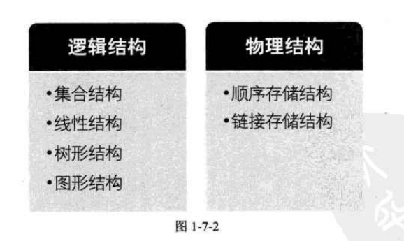

之后，我们还介绍了抽象数据类型及它的描述方法，为今后的课程打下基础。

## 结尾语

最后，我想对那些已经开始自学数据结构的同学说，可能你们会困惑、不懂、不理解、不会应用，甚至不知所云。可实际上，无论学什么，都是要努力才可以学到真东西。只有真正掌握技术的人，才有可能去享用它。如果你中途放弃了，之前所有的努力和付出都会变得没有价值。学会游泳难吗？掌握英语口语难吗？可能是难，但在掌握了的人眼里，这根本不算什么，“就那么回事呀”。只要你相信自己一定可以学得会、学得好，既然无数人已经掌握了，你凭什么不行。

最终的结果一定是，你对着别人很牛地说：“数据结构——就那么回事。”

哎，我如此口干舌燥地投众位所好，怎么还有人打瞌睡呢？罢了罢了，下课。

> 2020年8月4日，第1章又重看了一遍

# 第2章：算法

> 算法是解决特定问题求解步骤的描述，在计算机中表现为指令的有限序列，并且每条指令表示一个或多个操作。

## 开场白

各位同学大家好。
上次上完课后，有同学对我说，老师，我听了你的课，感觉数据结构没什么的，你也太夸大它的难度了。
是呀，我好像是强调了数据结构比较搞脑子，而上次课，其实还没拿出复杂的东西来说道。不是不想，是没必要，第一次课就把你们糊弄晕，那以后还玩什么，逃课的不就更多了吗？你们看，今天来的人数和第一次差不多，而且暂时还没有睡觉的。
今天我们介绍的内容在难度上就有所增加了，做好准备了吗？

## 数据结构与算法关系

我们这门课程叫数据结构，但很多时候我们会讲到算法，以及它们之间的关系。
市场上也有不少书叫“数据结构与算法分析”这样的名字。

有人可能就要问了，那你到底是只讲数据结构呢，还是和算法一起讲？它们之间是什么关系呢？干吗要放在一起？

这问题怎么回答。打个比方吧，今天是你女友生日，你打算请女友去看爱情音乐剧，到了戏院，抬头一看——《梁山伯》18：00开演。嗯，怎么会是这样？一问才知，今天饰演祝英台的演员生病，所以梁山伯唱独角戏。真是搞笑了，这还有什么看头。于是你们打算去看爱情电影。到了电影院，一看海报——《罗密欧》，是不是名字写错了，问了才知，原来饰演朱丽叶的演员因为嫌弃演出费用太低，中途退演了。制片方考虑到已经开拍，于是就把电影名字定为《罗密欧》，主要讲男主角的心路旅程。
哎，这电影还怎么看啊？

事实上，数据结构和算法也是类似的关系。只谈数据结构，当然是可以，我们可以在很短的时间就把几种重要的数据结构介绍完。听完后，很可能你没什么感觉，不知道这些数据结构有何用处。但如果我们再把相应的算法也拿来讲一讲，你就会发现，甚至开始感慨：哦，计算机界的前辈们，的确是一些很牛很牛的人，他们使得很多看似很难解决或者没法解决的问题，变得如此美妙和神奇。

也许从这以后，慢慢地你们中的一些人会开始把你们的崇拜对象，从帅哥美女、什么“哥”什么“姐”们，转移到这些大胡子或者秃顶的老头身上，那我就非常欣慰了。而且，这显然是一种成熟的表现，我期待你们中多一点这样的人，这样我们国家的软件行业，也许就有得救了。

不过话说回来，现在好多大学里，通常都是把“算法”分出一门课单独讲的，也就是说，在《数据结构》课程中，就算谈到算法，也是为了帮助理解好数据结构，并不会详细谈及算法的方方面面。我们的课程也是按这样的原则来展开的。

## 两种算法的比较

大家都已经学过一门计算机语言，不管学的是哪一种，学得好不好，好歹是可以写点小程序了。现在我要求你写一个求1+2+3+…+100结果的程序，你应该怎么写呢？

大多数人会马上写出下面的C语言代码（或者其他语言的代码）：

~~~c
int i,sum=0,n=100; 
for(i=1;i<=n;i++)
{
	sum=sum+i;
}
printf("%d",sum);
~~~

这是最简单的计算机程序之一，它就是一种算法，我不去解释这代码的含义了。问题在于，你的第一直觉是这样写的，但这样是不是真的很好？是不是最高效？

此时，我不得不把伟大数学家高斯的童年故事拿来说一遍，也许你们都早已经听过，但不妨再感受一下，天才当年是如何展现天分和才华的。

据说18世纪生于德国小村庄的高斯，上小学的一天，课堂很乱，就像我们现在下面那些窃窃私语或者拿着手机不停摆弄的同学一样，老师非常生气，后果自然也很严重。于是老师在放学时，就要求每个学生都计算1+2+…+100的结果，谁先算出来谁先回家。

天才当然不会被这样的问题难倒，高斯很快就得出了答案，是5050。老师非常惊讶，因为他自己想必也是通过1+2=3，3+3=6，6+4=10，…，4950+100=5050这样算出来的，也算了很久很久。说不定为了怕错，还算了两三遍。可眼前这个少年，为何可以这么快地得出结果？

## 算法定义

什么是算法呢？算法是描述解决问题的方法。算法（Algorithm）这个单词最早出现在波斯数学家阿勒·花刺子密在公元825年（相当于我们中国的唐朝时期）所写的《印度数字算术》中。如今普遍认可的对算法的定义是：

> **算法是解决特定问题求解步骤的描述**，在计算机中表现为指令的有限序列，并且每条指令表示一个或多个操作。

刚才的例子我们也看到，对于给定的问题，是可以有多种算法来解决的。

那我就要问问你们，**有没有通用的算法呀**？这个问题其实很弱智，就像问**有没有可以包治百病的药呀**！

**现实世界中的问题千奇百怪，算法当然也就千变万化**，**没有通用的算法可以解决所有的问题**。甚至解决一个小问题，很优秀的算法却不一定适合它。

算法定义中，提到了指令，指令能被人或机器等计算装置执行。它可以是计算机指令，也可以是我们平时的语言文字。

为了解决某个或某类问题，需要把指令表示成一定的操作序列，操作序列包括一组操作，每一个操作都完成特定的功能，这就是算法了。

## 算法的特性

算法具有五个基本特性：**输入**、**输出**、**有穷性**、**确定性**和**可行性**。

### 输入输出

输入和输出特性比较容易理解，**算法具有零个或多个输入**。尽管对于绝大多数算法来说，输入参数都是必要的，但对于个别情况，如打印“hello world！”这样的代码，不需要任何输入参数，因此算法的输入可以是零个。**算法至少有一个或多个输出**，算法是一定需要输出的，不需要输出，你用这个算法干吗？输出的形式可以是打印输出，也可以是返回一个或多个值等。

### 有穷性

**有穷性：指算法在执行有限的步骤之后，自动结束而不会出现无限循环，并且每一个步骤在可接受的时间内完成。**现实中经常会写出死循环的代码，这就是不满足有穷性。当然这里有穷的概念并不是纯数学意义的，而是在实际应用当中合理的、可以接受的“有边界”。你说你写一个算法，计算机需要算上个二十年，一定会结束，它在数学意义上是有穷了，可是媳妇都熬成婆了，算法的意义也不就大了。

### 确定性

**确定性：算法的每一步骤都具有确定的含义，不会出现二义性。**算法在一定条件下，只有一条执行路径，相同的输入只能有唯一的输出结果。算法的每个步骤被精确定义而无歧义。

### 可行性

**可行性：算法的每一步都必须是可行的，也就是说，每一步都能够通过执行有限次数完成。**可行性意味着算法可以转换为程序上机运行，并得到正确的结果。尽管在目前计算机界也存在那种没有实现的极为复杂的算法，不是说理论上不能实现，而是因为过于复杂，我们当前的编程方法、工具和大脑限制了这个工作，不过这都是理论研究领域的问题，不属于我们现在要考虑的范围。

## 算法设计的要求

刚才我们谈到了，算法不是唯一的。也就是说，同一个问题，可以有多种解决问题的算法。这可能让那些常年只做有标准答案题目的同学失望了，他们多么希望存在标准答案，只有一个是正确的，把它背下来，需要的时候套用就可以了。不过话说回来，尽管算法不唯一，相对好的算法还是存在的。掌握好的算法，对我们解决问题很有帮助，否则前人的智慧我们不能利用，就都得自己从头研究了。那么什么才叫好的算法呢？

嗯，没错，有同学说，好的算法，起码要是正确的，连正确都谈不上，还谈什么别的要求？

### 正确性

**正确性：算法的正确性是指算法至少应该具有输入、输出和加工处理无歧义性、能正确反映问题的需求、能够得到问题的正确答案。**

但是算法的“正确”通常在用法上有很大的差别，大体分为以下四个层次。

1. 算法程序没有语法错误。

2. 算法程序对于合法的输入数据能够产生满足要求的输出结果。

3. 算法程序对于非法的输入数据能够得出满足规格说明的结果。

4. 算法程序对于精心选择的，甚至刁难的测试数据都有满足要求的输出结果。

对于这四层含义，层次1要求最低，但是仅仅没有语法错误实在谈不上是好算法。这就如同仅仅解决温饱，不能算是生活幸福一样。而层次4是最困难的，我们几乎不可能逐一验证所有的输入都得到正确的结果。

因此算法的正确性在大部分情况下都不可能用程序来证明，而是用数学方法证明的。证明一个复杂算法在所有层次上都是正确的，代价非常昂贵。所以一般情况下，我们把层次3作为一个算法是否正确的标准。

好算法还有什么特征呢？

很好，我听到了说算法容易理解。没错，就是它。

### 可读性

**可读性：算法设计的另一目的是为了便于阅读、理解和交流。**

可读性高有助于人们理解算法，晦涩难懂的算法往往隐含错误，不易被发现，并且难于调试和修改。

我在很久以前曾经看到过一个网友写的代码，他号称这程序是“用史上最少代码实现俄罗斯方块”。因为我自己也写过类似的小游戏程序，所以想研究一下他是如何写的。由于他追求的是“最少代码”这样的极致，使得他的代码真的不好理解。也许除了计算机和他自己，绝大多数人是看不懂他的代码的。

我们写代码的目的，一方面是为了让计算机执行，但还有一个重要的目的是为了便于他人阅读，让人理解和交流，自己将来也可能阅读，如果可读性不好，时间长了自己都不知道写了些什么。可读性是算法（也包括实现它的代码）好坏很重要的标志。

### 健壮性

一个好的算法还应该能对输入数据不合法的情况做合适的处理。比如输入的时间或者距离不应该是负数等。

**健壮性：当输入数据不合法时，算法也能做出相关处理，而不是产生异常或莫名其妙的结果。**

### 时间效率高和存储量低

最后，好的算法还应该具备时间效率高和存储量低的特点。

时间效率指的是算法的执行时间，对于同一个问题，如果有多个算法能够解决，执行时间短的算法效率高，执行时间长的效率低。存储量需求指的是算法在执行过程中需要的最大存储空间，主要指算法程序运行时所占用的内存或外部硬盘存储空间。**设计算法应该尽量满足时间效率高和存储量低的需求**。在生活中，人们都希望花最少的钱，用最短的时间，办最大的事，算法也是一样的思想，最好用最少的存储空间，花最少的时间，办成同样的事就是好的算法。求100个人的高考成绩平均分，与求全省的所有考生的成绩平均分在占用时间和内存存储上是有非常大的差异的，我们自然是追求可以高效率和低存储量的算法来解决问题。

综上，好的算法，应该具有正确性、可读性、健壮性、高效率和低存储量的特

## 算法效率的衡量方法

刚才我们提到设计算法要提高效率。这里效率大都指算法的执行时间。那么我们如何度量一个算法的执行时间呢？
正所谓“是骡子是马，拉出来溜遭”。比较容易想到的方法就是，我们通过对算法的数据测试，利用计算机的计时功能，来计算不同算法的效率是高还是低。

### 事后统计方法

**事后统计方法：这种方法主要是通过设计好的测试程序和数据，利用计算机计时器对不同算法编制的程序的运行时间进行比较，从而确定算法效率的高低。**

但这种方法显然是有很大缺陷的：

* 必须依据算法事先编制好程序，这通常需要花费大量的时间和精力。如果编制出来发现它根本是很糟糕的算法，不是竹篮打水一场空吗？
* 时间的比较依赖计算机硬件和软件等环境因素，有时会掩盖算法本身的优劣。要知道，现在的一台四核处理器的计算机，跟当年286、386、486等老爷爷辈的机器相比，在处理算法的运算速度上，是不能相提并论的；而所用的操作系统、编译器、运行框架等软件的不同，也可以影响它们的结果；就算是同一台机器，CPU使用率和内存占用情况不一样，也会造成细微的差异。
* 算法的测试数据设计困难，并且程序的运行时间往往还与测试数据的规模有很大关系，效率高的算法在小的测试数据面前往往得不到体现。比如10个数字的排序，不管用什么算法，差异几乎是零。而如果有一百万个随机数字排序，那不同算法的差异就非常大了。那么我们为了比较算法，到底用多少数据来测试，这是很难判断的问题。

基于事后统计方法有这样那样的缺陷，我们考虑不予采纳。

### 事前分析估算方法

我们的计算机前辈们，为了对算法的评判更科学，研究出了一种叫做事前分析估算的方法。

**事前分析估算方法：在计算机程序编制前，依据统计方法对算法进行估算。**

经过分析，我们发现，一个用高级程序语言编写的程序在计算机上运行时所消耗的时间取决于下列因素：

1.算法采用的策略、方法。

2.编译产生的代码质量。

3.问题的输入规模。

4.机器执行指令的速度。

第1条当然是算法好坏的根本，第2条要由软件来支持，第4条要看硬件性能。
也就是说，抛开这些与计算机硬件、软件有关的因素，**一个程序的运行时间，依赖于算法的好坏和问题的输入规模。所谓问题输入规模是指输入量的多少。**

我们来看看今天刚上课时举的例子，两种求和的算法：

第一种算法：

~~~c
int i，sum=0，n =100；		/*执行1次*/
for（i=1；i<=n；i++）	   /*执行了n+1次*/
{
	sum=sum+i；			 /*执行n次*
}
printf（"%d"，sum）；	   /*执行1次*/
~~~

第二种算法：

~~~c
int sum=0，n=100；		/*执行一次*/
sum=（1+n）*n/2；		   /*执行一次*/
printf（"sd"，sum）；     /*执行一次*/
~~~

显然，第一种算法，执行了1+（n+1）+n+1次=2n+3次；而第二种算法，是1+1+1=3次。事实上两个算法的第一条和最后一条语句是一样的，所以我们关注的代码其实是中间的那部分，我们把循环看作一个整体，忽略头尾循环判断的开销，那么这两个算法其实就是n次与1次的差距。算法好坏显而易见。

我们再来延伸一下上面这个例子：

~~~c
int i，j，x=0，sum=0，n=100；	/*执行一次*/
for（i=1；i<=n；i++）
{
for（j=1；j<=n；j++）
{
	x++；					  /*执行n×n次*/
	sum=sum+x；					
}
printf（"td"，sum）；           /*执行一次*/
~~~

这个例子中，i从1到100，每次都要让j循环100次，而当中的x++和sum=
sum+x；其实就是1+2+3+…+10000，也就是1002次，所以这个算法当中，循环部分的代码整体需要执行n2（忽略循环体头尾的开销）次。显然这个算法的执行次数对于同样的输入规模n=100，要多于前面两种算法，这个算法的执行时间随着n的增加也将远远多于前面两个。

此时你会看到，**测定运行时间最可靠的方法就是计算对运行时间有消耗的基本操作的执行次数。运行时间与这个计数成正比。**

我们不关心编写程序所用的程序设计语言是什么，也不关心这些程序将跑在什么样的计算机中，我们只关心它所实现的算法。这样，不计那些循环索引的递增和循环终止条件、变量声明、打印结果等操作，**最终，在分析程序的运行时间时，最重要的是把程序看成是独立于程序设计语言的算法或一系列步骤。**

可以从问题描述中得到启示，同样问题的输入规模是n，求和算法的第一种，求1+2+…+n需要一段代码运行n次。那么这个问题的输入规模使得操作数量是f(n)
=n，显然运行100次的同一段代码规模是运算10次的10倍。而第二种，无论n为多少，运行次数都为1，即f(n)=1；第三种，运算100次是运算10次的100倍。因为它是f(n)=n^2^。

我们在分析一个算法的运行时间时，重要的是把基本操作的数量与输入规模关联起来，即基本操作的数量必须表示成输入规模的函数（如图2-7-1所示）。

我们可以这样认为，随着n值的越来越大，它们在时间效率上的差异也就越来越大。好比你们当中有些人每天都在学习，我指有用的学习，而不是只为考试的死读书，每天都在进步，而另一些人，打打游戏，睡睡大觉。入校时大家都一样，但毕业时结果可能就大不一样，前者名企争抢着要，后者求职无门。

## 函数的渐进增长

我们现在来判断一下，两个算法A和B哪个更好。假设两个算法的输入规模都是n，算法A要做2n+3次操作，你可以理解为先有一个n次的循环，执行完成后，再有一个n次循环，最后有三次赋值或运算，共2n+3次操作。算法B要做3n+1次操作。你觉得它们谁更快呢？

准确说来，答案是不一定的（如表2-8-1所示）。

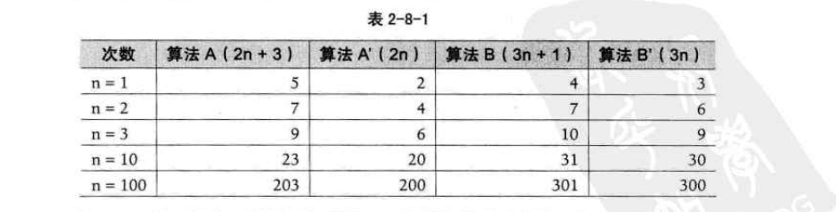

当n=1时，算法A效率不如算法B（次数比算法B要多一次）。而当n=2时，两者效率相同；当n>2时，算法A就开始优于算法B了，随着n的增加，算法A比算法B越来越好了（执行的次数比B要少）。于是我们可以得出结论，算法A总体上要好过算法B。

此时我们给出这样的定义，输入规模n在没有限制的情况下，只要超过一个数值N，这个函数就总是大于另一个函数，我们称函数是渐近增长的。

> 函数的渐近增长：给定两个函数f(n)和g(n)，如果存在一个整数N，使得对于所有的n>N，f(n)总是比g(n)大，那么，我们说f(n)
> 的增长渐近快于g(n)。

从中我们发现，随着n的增大，后面的+3还是+1其实是不影响最终的算法变化的，例如算法A'与算法B'，所以，**我们可以忽略这些加法常数**。后面的例子，这样的常数被忽略的意义可能会更加明显。

我们来看第二个例子，算法C是4n+8，算法D是2n^2^+1（如表2-8-2所示）。

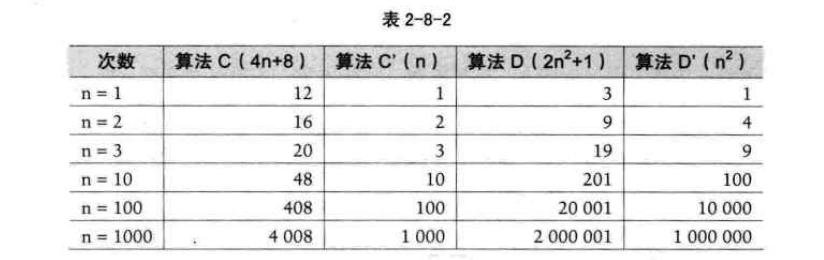

当n≤3的时候，算法C要差于算法D（因为算法C次数比较多），但当n>3后，算法C的优势就越来越优于算法D了，到后来更是远远胜过。而当后面的常数去掉后，我们发现其实结果没有发生改变。甚至我们再观察发现，哪怕去掉与n相乘的常数，这样的结果也没发生改变，算法C'的次数随着n的增长，还是远小于算法D'。也就是说，**与最高次项相乘的常数并不重要。**

我们再来看第三个例子。算法E是2n^2^+3n+1，算法F是2n^3^+3n+1（如表2-8-3所示）。

当n=1的时候，算法E与算法F结果相同，但当n>1后，算法E的优势就要开始优于算法F，随着n的增大，差异非常明显。通过观察发现，**最高次项的指数大的，函数随着n的增长，结果也会变得增长特别快。**

我们来看最后一个例子。算法G是2n^2^，算法H是3n+1，算法l是2n^2^+3n+1
（如表2-8-4所示）。

这组数据应该就看得很清楚。当n的值越来越大时，你会发现，3n+1已经没法和2n2的结果相比较，最终几乎可以忽略不计。也就是说，随着n值变得非常大以后，算法G其实已经很趋近于算法1。于是我们可以得到这样一个结论，**判断一个算法的效率时，函数中的常数和其他次要项常常可以忽略，而更应该关注主项（最高阶项）的阶数**。

判断一个算法好不好，我们只通过少量的数据是不能做出准确判断的。根据刚才的几个样例，我们发现，如果我们可以对比这几个算法的关键执行次数函数的渐近增长性，基本就可以分析出：**某个算法，随着n的增大，它会越来越优于另一算法**，或者越来越差于另一算法。这其实就是事前估算方法的理论依据，通过算法时间复杂度来估算算法时间效率。

## 算法时间复杂度

### 算法时间复杂度定义

> 在进行算法分析时，**语句总的执行次数T(n)是关于问题规模n的函数**，进而分析T(n)随n的变化情况并**确定T(n)的数量级**。算法的时间复杂度，也就是算法的时间量度，记作：`T(n)=O(f(n))`。它表示**随问题规模n**的增大，**算法执行时间**的**增长率**和f(n)的增长率相同，称作算法的渐近时间复杂度，**简称为时间复杂度**。其中f(n)是问题规模n的某个函数。

**这样用大写O()来体现算法时间复杂度的记法，我们称之为大O记法**。

**一般情况下，随着n的增大，T(n)增长最慢的算法为最优算法**。

显然，由此算法时间复杂度的定义可知，我们的三个求和算法的时间复杂度分别为O(n)，O(1)，O(n^2^)。我们分别给它们取了非官方的名称，O(1)叫常数阶、O(n)叫线性阶、O(n^2^)叫平方阶，当然，还有其他的一些阶，我们之后会介绍。

### 推导大O阶方法

那么如何分析一个算法的时间复杂度呢？即如何推导大O阶呢？我们给出了下面的推导方法，基本上，这也就是总结前面我们举的例子。

~~~
推导大O阶：
1.用常数1取代运行时间中的所有加法常数。
2.在修改后的运行次数函数中，只保留最高阶项。
3.如果最高阶项存在且不是1，则去除与这个项相乘的常数。
得到的结果就是大O阶。
~~~

哈，仿佛是得到了游戏攻略一样，我们好像已经得到了一个推导算法时间复杂度的万能公式。可事实上，分析一个算法的时间复杂度，没有这么简单，我们还需要多看几个例子。

### 常数阶

首先顺序结构的时间复杂度。下面这个算法，也就是刚才的第二种算法（高斯算法），为什么时间复杂度不是0（3），而是0(1)。

~~~c
int sum=0，n=100；		/*执行一次*/
sum=（1+n）*n/2；		   /*执行一次*/
printf（"%d"，sum）；     /*执行一次*/
~~~

这个算法的运行次数函数是f(n)=3。根据我们推导大0阶的方法，第一步就是把常数项3改为1。在保留最高阶项时发现，它根本没有最高阶项，所以这个算法的时间复杂度为0(1)。
另外，我们试想一下，如果这个算法当中的语句sum=（1+n）*m/2有10句，即：

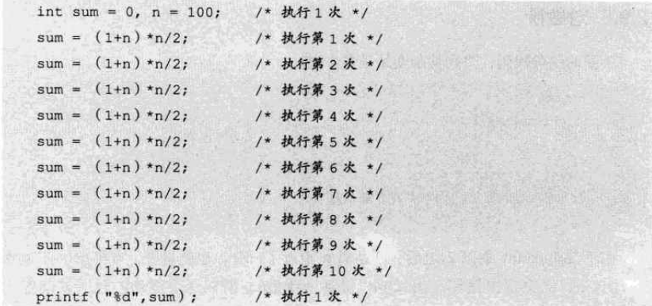

事实上无论n为多少，上面的两段代码就是3次和12次执行的差异。这种与问题的大小无关（n的多少），执行时间恒定的算法，我们称之为具有0(1)的时间复杂度，又叫常数阶。

注意：**不管这个常数是多少**，我们都记作O(1)，而不能是O(3)、O(12)等其他任何数字，这是初学者常常犯的错误。

对于分支结构而言，无论是真，还是假，执行的次数都是恒定的，不会随着n的变大而发生变化，所以单纯的分支结构（不包含在循环结构中），其时间复杂度也是0(1)。

### 线性阶

线性阶的循环结构会复杂很多。要确定某个算法的阶次，我们常常需要确定某个特定语句或某个语句集运行的次数。因此，我们要分析算法的复杂度，关键就是要分析循环结构的运行情况。
下面这段代码，它的循环的时间复杂度为O(n)，因为循环体中的代码须要执行n次。

~~~c
int i，j，x=0，sum=0，n=100；	/*执行一次*/
for（i=1；i<=n；i++）
{
	/*时间复杂度为O(1)的程序步骤序列*/
{
~~~

### 对数阶

下面的这段代码，时间复杂度又是多少呢？

~~~c
int count=1；
while（count<n）
{
	count=count*2；
	/*时间复杂度为0(1)的程序步骤序列*/
}

~~~

由于每次count乘以2之后，就距离n更近了一分。也就是说，有多少个2相乘后大于n，则会退出循环。由2^x^=n得到x=log~2~^n^。所以这个循环的时间复杂度为0（logn）。

### 平方阶

下面例子是一个循环嵌套，它的内循环刚才我们已经分析过，时间复杂度为O(n)。

~~~c
int i，j；
for（i=0；i<n；i++）
{
	for（j=0；j<n；j++）
	{
		/*时间复杂度为O(1)的程序步骤序列*/
	}

}
~~~

而对于外层的循环，不过是内部这个时间复杂度为O(n)的语句，再循环n次。所以这段代码的时间复杂度为0(n^2^)。

如果外循环的循环次数改为了m，时间复杂度就变为O（m×n）。

~~~c
int i，j；
for（i=0；i<m；i++）
{
	for（j=0；j<n；j++）
	{
		/*时间复杂度为O(1)的程序步骤序列*/
	}

}
~~~

所以我们可以总结得出，循环的时间复杂度等于循环体的复杂度乘以该循环运行的次数。

那么下面这个循环嵌套，它的时间复杂度是多少呢？

~~~c
int i，j；
for（i=0；i<n；i++）
{
	for（j=1；j<n；j++）	/*注意j=1而不是0*/
	{
		/*时间复杂度为O(1)的程序步骤序列*/
	}

}
~~~

由于当i=0时，内循环执行了n次，当i=1时，执行了n-1次,······当i=n-1时，执行了1次。所以总的执行次数为：
$$
n+(n-1)+(n-2)+…+1=\frac{n（n+1）}{2}=\frac{n^2}{2}+\frac{n}{2}
$$
用我们推导大0阶的方法，第一条，没有加法常数不予考虑；第二条，只保留最高阶项，因此保留n^2^/2；第三条，去除这个项相乘的常数，也就是去除1/2，最终这段代码的时间复杂度为0(n^2^)。

从这个例子，我们也可以得到一个经验，其实**理解大0推导不算难，难的是对数列的一些相关运算，这更多的是考察你的数学知识和能力**，所以想考研的朋友，要想在求算法时间复杂度这里不失分，可能需要强化你的数学，特别是数列方面的知识和解题能力。

我们继续看例子，对于方法调用的时间复杂度又如何分析。

~~~c
int i,j; 
for(i=0;i<n;i++)
{
   function(i);
}

~~~

上面这段代码调用一个函数function。

~~~c
void function(int count)
{
    print(count);
}
~~~

函数体是打印这个参数。其实这很好理解，function函数的时间复杂度是0(1)。
所以整体的时间复杂度为o(n)。

假如function是下面这样的：

~~~c
void function（int count）
{
	int j；
	for（j=count；j<n；j++）
	{
	/*时间复杂度为0(1)的程序步骤序列*/
	}
}
~~~

事实上，这和刚才举的例子是一样的，只不过把嵌套内循环放到了函数中，所以最终的时间复杂度为0(n^2^)。
下面这段相对复杂的语句：

~~~c
n++；						/*执行次数为1*/
function(n)；			   /*执行次数为n*/
int i,j；
for（i=0；i<n；i++）		  /*执行次数为n2*/
{
	function（i）；
}
for（i=0；i<n；i++）		  /*执行次教为n（n+1）/2*/
{
	for（j=i；j<n；j++）
	{
	/*时间复杂度为0(1)的程序步骤序列*/
	}
}
~~~

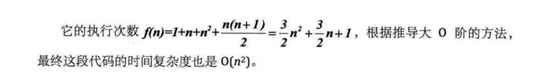

## 常见的时间复杂度

常见的时间复杂度如表2-10-1所示。

常用的时间复杂度所耗费的时间从小到大依次是：

## 最坏情况和平均情况

你早晨上班出门后突然想起来，手机忘记带了，这年头，钥匙、钱包、手机三大件，出门哪样也不能少呀。于是回家找。打开门一看，手机就在门口玄关的台子上，原来是出门穿鞋时忘记拿了。这当然是比较好，基本没花什么时间寻找。可如果不是放在那里，你就得进去到处找，找完客厅找卧室、找完卧室找厨房、找完厨房找卫生间，就是找不到，时间一分一秒的过去，你突然想起来，可以用家里座机打一下手机，听着手机铃声来找呀，真是笨。终于找到了，在床上枕头下面。你再去上班，迟到。见鬼，这一年的全勤奖，就因为找手机给黄了。

找东西有运气好的时候，也有怎么也找不到的情况。但在现实中，通常我们碰到的绝大多数既不是最好的也不是最坏的，所以算下来是平均情况居多。

算法的分析也是类似，我们查找一个有n个随机数字数组中的某个数字，最好的情况是第一个数字就是，那么算法的时间复杂度为0(1)，但也有可能这个数字就在最后一个位置上待着，那么算法的时间复杂度就是O(n)，这是最坏的一种情况了。

**最坏情况运行时间是一种保证，那就是运行时间将不会再坏了。在应用中，这是一种最重要的需求，通常，除非特别指定，我们提到的运行时间都是最坏情况的运行时间。**

而平均运行时间也就是从概率的角度看，这个数字在每一个位置的可能性是相同的，所以平均的查找时间为n/2次后发现这个目标元素。

**平均运行时间是所有情况中最有意义的，因为它是期望的运行时间。**也就是说，我们运行一段程序代码时，是希望看到平均运行时间的。可现实中，平均运行时间很难通过分析得到，一般都是通过运行一定数量的实验数据后估算出来的。

对算法的分析，一种方法是计算所有情况的平均值，这种时间复杂度的计算方法称为平均时间复杂度。另一种方法是计算最坏情况下的时间复杂度，这种方法称为最坏时间复杂度**。一般在没有特殊说明的情况下，都是指最坏时间复杂度。**

## 算法空间复杂度

我们在写代码时，完全可以**用空间来换取时间**，比如说，要判断某某年是不是闻年，你可能会花一点心思写了一个算法，而且由于是一个算法，也就意味着，每次给一个年份，都是要通过计算得到是否是闰年的结果。还有另一个办法就是，事先建立一个有2050个元素的数组（年数略比现实多一点），然后把所有的年份按下标的数字对应，如果是闰年，此数组项的值就是1，如果不是值为0。这样，所谓的判断某一年是否是闰年，就变成了查找这个数组的某一项的值是多少的问题。此时，我们的运算是最小化了，但是硬盘上或者内存中需要存储这2050个0和1。

这是通过一笔空间上的开销来换取计算时间的小技巧。到底哪一个好，其实要看你用在什么地方。

**算法的空间复杂度通过计算算法所需的存储空间实现，算法空间复杂度的计算公式记作：S(n)=O(f(n)），其中，n为问题的规模，f(n)为语句关于n所占存储空间的函数。**

一般情况下，一个程序在机器上执行时，除了需要存储程序本身的指令、常数、变量和输入数据外，还需要存储对数据操作的存储单元。若输入数据所占空间只取决于问题本身，和算法无关，这样只需要分析该算法在实现时所需的辅助单元即可。若算法执行时所需的辅助空间相对于输入数据量而言是个常数，则称此算法为原地工作，空间复杂度为0(1)。

通常，我们都使用“时间复杂度”来指运行时间的需求，使用“空间复杂度”指空间需求。当不用限定词地使用“复杂度”时，通常都是指时间复杂度。显然我们这本书重点要讲的还是算法的时间复杂度的问题。

## 总结回顾

不容易，终于又到了总结的时间。

我们这一章主要谈了算法的一些基本概念。谈到了数据结构与算法的关系是相互依赖不可分割的。

算法的定义：算法是解决特定问题求解步骤的描述，在计算机中为指令的有限序列，并且每条指令表示一个或多个操作。

算法的特性：有穷性、确定性、可行性、输入、输出。

算法的设计的要求：正确性、可读性、健壮性、高效率和低存储量需求。

算法特性与算法设计容易混，需要对比记忆。

算法的度量方法：事后统计方法（不科学、不准确）、事前分析估算方法。

在讲解如何用事前分析估算方法之前，我们先给出了函数渐近增长的定义。

函数的渐近增长：给定两个函数f(n)和g(n)，如果存在一个整数N，使得对于所有的n>N，f(n)总是比g(n)大，那么，我们说f(n)的增长渐近快于g(n)。于是我们可以得出一个结论，判断一个算法好不好，我们只通过少量的数据是不能做出准确判断的，如果我们可以对比算法的关键执行次数函数的渐近增长性，基本就可以分析出：某个算法，随着n的变大，它会越来越优于另一算法，或者越来越差于另一算法。、

然后给出了算法时间复杂度的定义和推导大0阶的步骤。

~~~
推导大O阶：
1.用常数1取代运行时间中的所有加法常数。
2.在修改后的运行次数函数中，只保留最高阶项。
3.如果最高阶项存在且不是1，则去除与这个项相乘的常数。
得到的结果就是大O阶。
~~~

得到的结果就是大O阶。

通过这个步骤，我们可以在得到算法的运行次数表达式后，很快得到它的时间复杂度，即大0阶。同时我也提醒了大家，其实推导大0阶很容易，但如何得到运行次数的表达式却是需要数学功底的。

接着我们给出了常见的时间复杂度所耗时间的大小排列：

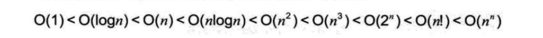

最后，我们给出了关于算法最坏情况和平均情况的概念，以及空间复杂度的概念。

## 结尾语

很多学生，学了四年计算机专业，很多程序员，做了很长时间的编程工作，却始终都弄不明白算法的时间复杂度的估算，这是很可悲的一件事。因为弄不清楚，所以也就从不深究自己写的代码是否效率低下，是不是可以通过优化让计算机更加快速高效。

他们通常的借口是，现在CPU越来越快，根本不用考虑算法的优劣，实现功能即可，用户感觉不到算法好坏造成的快慢。可事实真是这样吗？还是让我们用数据来说话吧。

假设CPU在短短几年间，速度提高了100倍，这其实已经很夸张了。而我们的某个算法本可以写出时间复杂度是0(n)的程序，却写出了0(n^2^)的程序，仅仅因为容易想到，也容易写。即在0（n^2^）的时间复杂度算法程序下，速度其实只提高了10倍（$ \sqrt{100} $=10），而对于0（n)时间复杂度的算法来说，那才是真的100倍。

也就是说，一台老式CPU的计算机运行O(n)的程序和一台速度提高100倍新式CPU运行0(n^2^)的程序。最终效率高的胜利方却是老式CPU的计算机，原因就在于算法的优劣直接决定了程序运行的效率。

也许你就可以深刻的感受到，**愚公移山固然可敬，但发明炸药和推土机，可能更加实在和聪明**（如图2-14-1所示）。

希望大家在今后的学习中，好好**利用算法分析的工具**，**改进自己的代码**，让计算机轻松一点，这样你就更加胜人一筹。

# 第3章：线性表

## 开场白

各位同学，大家好。

今天我们要开始学习数据结构中最常用和最简单的一种结构，在介绍它之前先讲个例子。

我经常下午去幼儿园接送儿子，每次都能在门口看到老师带着小朋友们，一个拉着另一个的衣服，依次从教室出来。而且我发现很有规律的是，每次他们的次序都是一样。比如我儿子排在第5个，每次他都是在第5个，前面同样是那个小女孩，后面一直是那个小男孩。这点让我很奇怪，为什么一定要这样？

有一天我就问老师原因。她告诉我，为了保障小朋友的安全，避免漏掉小朋友，所以给他们安排了出门的次序，事先规定好了，谁在谁的前面，谁在谁的后面。这样养成习惯后，如果有谁没有到位，他前面和后面的小朋友就会主动报告老师，某人不在。即使以后如果要外出到公园或博物馆等情况下，老师也可以很快地清点人数，万一有人走丢，也能在最快时间知道，及时去寻找。

我一想，还真是这样。小朋友们始终按照次序排队做事，出意外的情况就可能会少很多。毕竟，遵守秩序是文明的标志，应该从娃娃抓起。而且，真要有人丢失，小孩子反而是最认真负责的监督员。

再看看门外的这帮家长们，都挤在大门口，哪个分得清他们谁是谁呀。与小孩子们的井然有序形成了鲜明的对比。哎，有时大人的所作所为，其实还不如孩子。

这种排好队的组织方式，其实就是今天我们要介绍的数据结构：线性表。

## 线性表的定义

线性表，从名字上你就能感觉到，是具有像线一样的性质的表。在广场上，有很多人分散在各处，当中有些是小朋友，可也有很多大人，甚至还有不少宠物，这些小朋友的数据对于整个广场人群来说，不能算是线性表的结构。但像刚才提到的那样，一个班级的小朋友，一个跟着一个排着队，有一个打头，有一个收尾，当中的小朋友每一个都知道他前面一个是谁，他后面一个是谁，这样如同有一根线把他们串联起来了。就可以称之为线性表。

~~~
线性表（List）:零个或多个数据元素的有限序列。
~~~

这里需要强调几个关键的地方。

**首先**它是一个**序列**。也就是说，**元素之间是有顺序的**，**若元素存在多个，则第一个元素无前驱，最后一个元素无后继，其他每个元素都有且只有一个前驱和后继**。如果一个小朋友去拉两个小朋友后面的衣服，那就不可以排成一队了；同样，如果一个小朋友后面的衣服，被两个甚至多个小朋友拉扯，这其实是在打架，而不是有序排队。

然后，线性表强调是**有限**的，小朋友班级人数是有限的，元素个数当然也是有限的。事实上，在计算机中处理的对象都是有限的，那种无限的数列，只存在于数学的概念中。

如果用数学语言来进行定义。可如下：

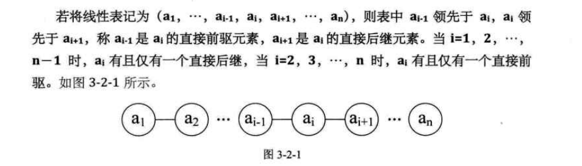

所以线性表元素的个数n（n>0）定义为线性表的长度，当n=0时，称为空表。

在非空表中的每个数据元素都有一个确定的位置，如a~1~是第一个数据元素，a~n~是最后一个数据元素，a~i~是第i个数据元素，称i为数据元素a~i~在线性表中的**位序**。

我现在说一些数据集，大家来判断一下是否是线性表。

先来一个大家最感兴趣的，一年里的星座列表，是不是线性表呢？如图3-2-2所示。

当然是，星座通常都是用白羊座打头，双鱼座收尾，当中的星座都有前驱和后继，而且一共也只有十二个，所以它完全符合线性表的定义。

公司的组织架构，总经理管理几个总监，每个总监管理几个经理，每个经理都有各自的下属和员工。这样的组织架构是不是线性关系呢？

不是，为什么不是呢？哦，因为每一个元素，都有不只一个后继，所以它不是线性表。那种让一个总经理只管一个总监，一个总监只管一个经理，一个经理只管一个员工的公司，俗称皮包公司，岗位设置等于就是在忽悠外人。

班级同学之间的友谊关系，是不是线性关系？哈哈，不是，因为每个人都可以和多个同学建立友谊，不满足线性的定义。嗯？有人说爱情关系就是了。胡扯，难道每个人都要有一个爱的人和一个被爱的人，而且他们还都不可以重复爱同一个人这样的情况出现，最终形成一个班级情感人物串联？这怎么可能，也许网络小说里可能出现，但现实中是不可能的。

班级同学的点名册，是不是线性表？是，这和刚才的友谊关系是完全不同了，因为它是有限序列，也满足类型相同的特点。这个点名册（如表3-2-1所示）中，每一个元素除学生的学号外，还可以有同学的姓名、性别、出生年月什么的，这其实就是我们之前讲的**数据项**。**在较复杂的线性表中，一个数据元素可以由若干个数据项组成**。

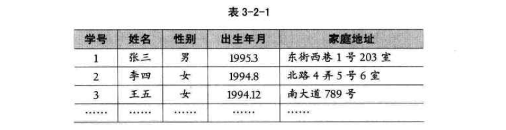

一群同学排队买演唱会门票，每人限购一张，此时排队的人群是不是线性表？
是，对的。此时来了三个同学要插当中一个同学A的队，说同学A之前拿着的三个书包就是用来占位的，书包也算是在排队。如果你是后面早已来排队的同学，你们愿不愿意？肯定不愿意，书包怎么能算排队的人呢，如果这也算，我浑身上下的衣服裤子都在排队了。于是不让这三个人进来。

这里用线性表的定义来说，是什么理由？嗯，因为**要相同类型的数据**，书包根本不算是人，当然排队无效，三个人想不劳而获，自然遭到大家的谴责。看来大家的线性表学得都不错。

## 线性表的抽象数据类型

前面我们已经给了线性表的定义，现在我们来分析一下，线性表应该有一些什么样的操作呢？

还是回到刚才幼儿园小朋友的例子，老师为了让小朋友有秩序地出入，所以就考虑给他们排一个队，并且是长期使用的顺序，这个考虑和安排的过程其实就是一个线性表的创建和初始化过程。

一开始没经验，把小朋友排好队后，发现有的高有的矮，队伍很难看，于是就让小朋友**解散重新排**—这是一个线性表重置为空表的操作。

排好了队，我们随时可以叫出队伍某一位置的小朋友名字及他的具体情况。比如有家长问，队伍里第五个孩子，怎么这么调皮，他叫什么名字呀，老师可以很快告诉这位家长，这就是封清扬的儿子，叫封云卡。我在旁就非常扭捏，看来是我给儿子的名字没取好，儿子让班级“风云突变”了。这种可以**根据位序得到数据元素也是一种很重要的线性表操作**。

还有什么呢，有时我们想知道，某个小朋友，比如麦兜是否是班里的小朋友，老师会告诉我说，不是，麦兜在春田花花幼儿园里，不在我们幼儿园。这种查找某个元素是否存在的操作很常用。

而后有家长问老师，班里现在到底有多少个小朋友呀，这种获得线性表长度的问题也很普遍。

显然，对于一个幼儿园来说，加入一个新的小朋友到队列中，或因某个小朋友生病，需要移除某个位置，都是很正常的情况。**对于一个线性表来说，插入数据和删除数据都是必须的操作**。

所以，线性表的抽象数据类型定义如下：

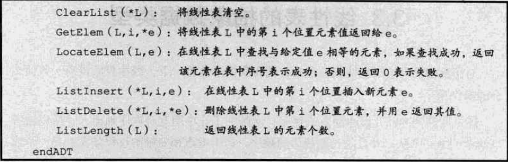

对于不同的应用，线性表的基本操作是不同的，上述操作是最基本的，对于实际问题中涉及的关于线性表的更复杂操作，完全可以用这些基本操作的组合来实现。

比如，要实现**两个线性表集合A和B的并集操作**。即要使得集合A=AUB。说白了，就是把存在集合B中但并不存在A中的数据元素插入到A中即可。

仔细分析一下这个操作，发现我们**只要循环集合B中的每个元素，判断当前元素是否存在A中，若不存在，则插入到A中即可**。思路应该是很容易想到的。

我们假设L~a~表示集合A，L~b~表示集合B，则实现的代码如下：

这里，我们对于union操作，用到了前面线性表基本操作ListLength、GetEem、LocateElem、Listlnsert等，可见，对于复杂的个性化的操作，其实就是把基本操作组合起来实现的。

## 线性表的顺序存储结构

### 顺序存储定义

说这么多的线性表，我们来看看**线性表的两种物理结构的第一种——顺序存储结构**。

> 线性表的顺序存储结构，指的是用一段**地址连续的存储单元**依次存储线性表的数据元素。

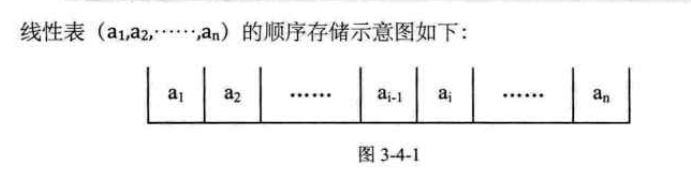

我们在第一课时已经讲过顺序存储结构。今天我再举一个例子。

记得大学时，我们同宿舍有一个同学，人特别老实、热心，我们时常会让他帮我们去图书馆占座，他总是答应，你想想，我们一个宿舍连他共有九个人，这其实明摆着是欺负人的事。他每次一吃完早饭就冲去图书馆，挑一个好地儿，把他书包里的书，一本一本地按座位放好，若书包里的书不够，他会把他的饭盒、水杯、水笔都用上，长长一排，九个座硬是被他占了，后来有一次因占座的事弄得差点都要打架。

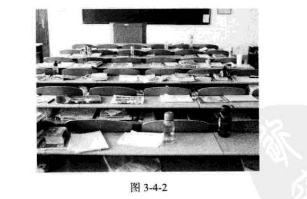

### 顺序存储方式

线性表的顺序存储结构，说白了，和刚才的例子一样，就是**在内存中找了块地儿，通过占位的形式，把一定内存空间给占了，然后把相同数据类型的数据元素依次存放在这块空地中**。既然**线性表的每个数据元素的类型都相同**，所以可以用C语言（其他语言也相同）的**一维数组来实现顺序存储结构**，即把第一个数据元素存到数组下标为0的位置中，接着把线性表相邻的元素存储在数组中相邻的位置。

我那同学占座时，如果图书馆里空座很多，他当然不必一定要选择第一排第一个位子，而是可以选择风水不错、美女较多的地儿。找到后，放一个书包在第一个位置，就表示从这开始，这地方暂时归我了。为了建立一个线性表，要在内存中找一块地，于是这块地的**第一个位置**就非常关键，它是存储空间的起始位置。

接着，因为我们一共九个人，所以他需要占九个座。线性表中，我们估算这个线性表的最大存储容量，建立一个数组，数组的长度就是这个最大存储容量。

可现实中，我们宿舍总有那么几个不是很好学的人，为了游戏，为了恋爱，就不去图书馆自习了。假设我们九个人，去了六个，真正被使用的座位也就只是六个，另三个是空的。同样的，我们已经有了起始的位置，也有了最大的容量，于是我们可以在里面增加数据了。随着数据的插入，我们线性表的长度开始变大，不过**线性表的当前长度不能超过存储容量，即数组的长度**。想想也是，如果我们有十个人，只占了九个座，自然是坐不下的。

来看线性表的顺序存储的结构代码。

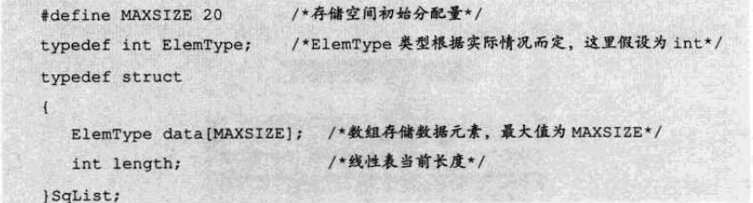

这里，我们就发现描述顺序存储结构需要三个属性：

* 存储空间的起始位置：数组data，它的存储位置就是存储空间的存储位置。

* 线性表的最大存储容量：数组长度MaxSize。

* 线性表的当前长度：length。

### 数据长度与线性表长度区别

[线性表和数组的区别](https://www.cnblogs.com/qinguoyi/p/10405527.html)

注意哦，这里有两个概念“数组的长度”和“线性表的长度”需要区分一下。

数组的长度是存放线性表的存储空间的长度，存储分配后这个量是**一般是不变的**。有个别同学可能会问，数组的大小一定不可以变吗？我怎么看到有书中谈到可以动态分配的一维数组。是的，一般高级语言，比如C、VB、C++都可以用编程手段实现动态分配数组，不过这会带来性能上的损耗。

**线性表的长度是线性表中数据元素的个数，随着线性表插入和删除操作的进行，这个量是变化的。**

**在任意时刻，线性表的长度应该小于等于数组的长度。**

### 地址计算方法

由于我们数数都是从1开始数的，线性表的定义也不能免俗，起始也是1，可C语言中的数组却是从0开始第一个下标的，于是线性表的第i个元素是要存储在数组下标为i-1的位置，即数据元素的序号和存放它的数组下标之间存在对应关系（如图3-4-3所示）。

用数组存储顺序表意味着要分配固定长度的数组空间，由于**线性表中可以进行插入和删除操作**，因此**分配的数组空间要大于等于当前线性表的长度**。(数组是母亲，线性表是孩子，孩子在母亲指定的范围内进行活动)

其实，内存中的地址，就和图书馆或电影院里的座位一样，都是有编号的。**存储器中的每个存储单元都有自己的编号，这个编号称为地址。**当我们占座后，占座的第一个位置确定后，后面的位置都是可以计算的。试想一下，我是班级成绩第五名，我后面的10名同学成绩名次是多少呢？当然是6，7，……15，因为5+1，5+2，…，5+10。由于**每个数据元素，不管它是整型、实型还是字符型，它都是需要占用一定的存储单元空间的**。假设占用的是c个存储单元，那么线性表中第i+1个数据元素的存储位置和第i个数据元素的存储位置满足下列关系（LOC表示获得存储位置的函数）。

通过这个公式，你可以随时算出线性表中任意位置的地址，不管它是第一个还是最后一个，都是相同的时间。那么我们对每个线性表位置的存入或者取出数据，对于计算机来说都是相等的时间，也就是一个常数，因此用我们算法中学到的时间复杂度的概念来说，它的存取时间性能为0（1]。我们通常把具有这一特点的存储结构称为**随机存取结构**。

## 顺序存储结构的插入与删除

### 获得元素操作

对于线性表的顺序存储结构来说，如果我们要实现GetElem操作，即将线性表L中的第1个位置元素值返回，其实是非常简单的。就程序而言，只要1的数值在数组下标范围内，就是把数组第i-1下标的值返回即可。来看代码：

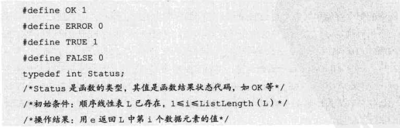

注意这里返回值类型Status是一个整型，返回OK代表1，ERROR代表0。之后代码中出现就不再详述。

### 插入操作

刚才我们也谈到，这里的时间复杂度为0(1)。我们现在来考虑，如果我们要实现ListInsert（*L,i,e），即在线性表L中的第1个位置插入新元素e，应该如何操作？

举个例子，本来我们在春运时去买火车票，大家都排队排的好好的。这时来了一个美女，对着队伍中排在第三位的你说，“大哥，求求你帮帮忙，我家母亲有病，我得急着回去看她，这队伍这么长，你可否让我排在你的前面？"你心一软，就同意了。这时，你必须得退后一步，否则她是没法进到队伍来的。这可不得了，后面的人像蠕虫一样，全部都得退一步。骂起四声。但后面的人也不清楚这加塞是怎么回事，没什么办法。

这个例子其实已经说明了线性表的顺序存储结构，在插入数据时的实现过程（如图3-5-1所示）。

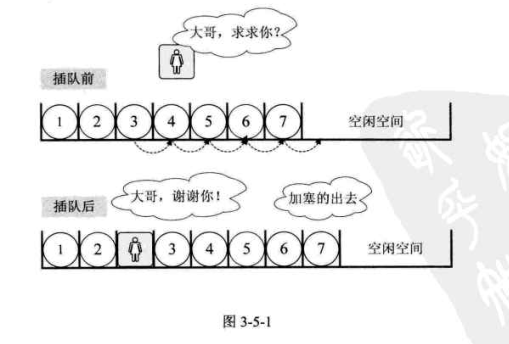

插入算法的思路：

* 如果插入位置不合理，抛出异常；
* 如果线性表长度大于等于数组长度，则抛出异常或动态增加容量；
* 从最后一个元素开始向前遍历到第i个位置，分别将它们都向后移动一个位置;
* 将要插入元素填入位置i处；
* 表长加1。

实现代码如下：

应该说这代码不难理解。如果是以前学习其他语言的同学，可以考虑把它转换成你熟悉的语言再实现一遍，只要思路相同就可以了。

### 删除操作

接着刚才的例子。此时后面排队的人群意见都很大，都说怎么可以这样，不管什么原因，插队就是不行，有本事，找火车站开后门去。就在这时，远处跑来一胖子，对着这美女喊，可找到你了，你这骗子，还我钱。只见这女子二话不说，突然就冲出了队伍，胖子追在其后，消失在人群中。哦，原来她是倒卖火车票的黄牛，刚才还装可怜。于是排队的人群，又像蠕虫一样，均向前移动了一步，骂声渐息，队伍又恢复了平静。

这就是线性表的顺序存储结构删除元素的过程（如图3-5-2所示）。

删除算法的思路：

* 如果删除位置不合理，抛出异常；
* 取出删除元素；
* 从删除元素位置开始遍历到最后一个元素位置，分别将它们都向前移动一个位置；
* 表长减1。

实现代码如下：

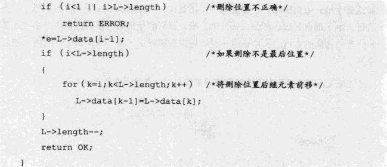

现在我们来分析一下，插入和删除的时间复杂度。

先来看最好的情况，如果元素要插入到最后一个位置，或者删除最后一个元素，此时时间复杂度为O(1)，因为不需要移动元素的，就如同来了一个新人要正常排队，当然是排在最后，如果此时他又不想排了，那么他一个人离开就好了，不影响任何人。

最坏的情况呢，如果元素要插入到第一个位置或者删除第一个元素，此时时间复杂度是多少呢？那就意味着要移动所有的元素向后或者向前，所以这个时间复杂度为O(n)。

至于平均的情况，由于元素插入到第i个位置，或删除第i个元素，需要移动n-1个元素。根据概率原理，每个位置插入或删除元素的可能性是相同的，也就说位置靠前，移动元素多，位置靠后，移动元素少。最终平均移动次数和最中间的那个元素的移动次数相等，为(n-1)/2。

我们前面讨论过时间复杂度的推导，可以得出，平均时间复杂度还是O(n)。

这说明什么？**线性表的顺序存储结构，在存、读数据时，不管是哪个位置，时间复杂度都是O(1)；而插入或删除时，时间复杂度都是O(n)。这就说明，它比较适合元素个数不太变化，而更多是存取数据的应用。**当然，它的优缺点还不只这些…….

### 线性表顺序存储结构的优缺点

线性表的顺序存储结构的优缺点如图3-5-3所示。

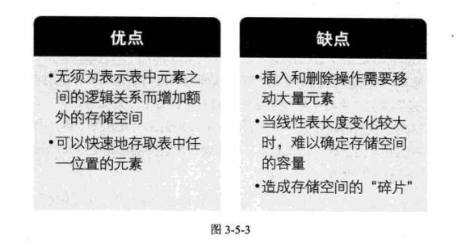

好了，大家休息一下，我们等会儿接着讲另一个存储结构。

## 线性表的链式存储结构

### 顺序存储结构不足的解决办法

前面我们讲的线性表的顺序存储结构。它是有缺点的，最大的缺点就是插入和删除时需要移动大量元素，这显然就需要耗费时间。能不能想办法解决呢？

要解决这个问题，我们就得考虑一下导致这个问题的原因。

为什么当插入和删除时，就要移动大量元素，仔细分析后，发现原因就在于相邻两元素的存储位置也具有邻居关系。它们编号是1，2，3，..，n，它们在内存中的位置也是挨着的，中间没有空隙，当然就无法快速介入，而删除后，当中就会留出空隙，自然需要弥补。问题就出在这里。

A同学思路：让当中每个元素之间都留有一个空位置，这样要插入时，就不至于移动。可一个空位置如何解决多个相同位置插入数据的问题呢？所以这个想法显然不行。

B同学思路：那就让当中每个元素之间都留足够多的位置，根据实际情况制定空隙大小，比如10个，这样插入时，就不需要移动了。万一10个空位用完了，再考虑移动使得每个位置之间都有10个空位置。如果删除，就直接删掉，把位置留空即可。这样似乎暂时解决了插入和删除的移动数据问题。可这对于超过10个同位置数据的插入，效率上还是存在问题。对于数据的遍历，也会因为空位置太多而造成判断时间上的浪费。而且显然这里空间复杂度还增加了，因为每个元素之间都有若干个空位置。

C同学思路：我们反正也是要让相邻元素间留有足够余地，那干脆所有的元素都不要考虑相邻位置了，哪有空位就到哪里，而只是让每个元素知道它下一个元素的位置在哪里，这样，我们可以在第一个元素时，就知道第二个元素的位置（内存地址），而找到它；在第二个元素时，再找到第三个元素的位置（内存地址），这样所有的元素我们就都可以通过遍历而找到。

好！太棒了，这个想法非常好！c同学，你可惜生晚了几十年，不然，你的想法对于数据结构来讲就是划时代的意义。我们要的就是这个思路。

### 线性表链式存储结构定义

在解释这个思路之前，我们先来谈另一个话题。前几年，有一本书风靡了全世界，它叫《达·芬奇密码》，成为世界上最畅销的小说之一，书的内容集合了侦探、惊煉和阴谋论等多种风格，很好看。

我由于看的时间太过于久远，情节都忘记得差不多了，不过这本书和绝大部分侦探小说一样，都是同一种处理办法。那就是，作者不会让你事先知道整个过程的全部，而是在一步一步地到达某个环节，才根据现场的信息，获得或推断出下一步是什么，也就是说，每一步除了对侦破的信息进一步确认外（之前信息也不一定都是对的，有时就是证明某个信息不正确），还有就是对下一步如何操作或行动的指引。

不过，这个例子也不完全与线性表相符合。

因为案件侦破的线索可能是错综复杂的，有点像我们之后要讲到的树和图的数据结构。今天我们要谈的是单线索，无分支的情况。即线性表的链式存储结构。

线性表的链式存储结构的特点是用一组任意的存储单元存储线性表的数据元素，这组存储单元可以是连续的，也可以是不连续的。这就意味着，这些数据元素可以存在内存未被占用的任意位置（如图3-6-1所示）。

以前在顺序结构中，每个数据元素只需要存数据元素信息就可以了。现在链式结构中，除了要存数据元素信息外，还要存储它的后继元素的存储地址。

有时，我们为了更加方便地对链表进行操作，会在单链表的第一个结点前附设一个结点，称为头结点。头结点的数据域可以不存储任何信息，谁叫它是第一个呢，有这个特权。也可以存储如线性表的长度等附加信息，头结点的指针域存储指向第一个结点的指针，如图3-6-4所示。

### 头指针和头结点的异同

头指针与头结点的异同点，如图3-6-5所示。

### 线性表链式存储结构代码描述

若线性表为空表，则头结点的指针域为“空”，如图3-6-6所示。

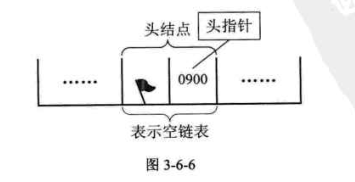

这里我们大概地用图示表达了内存中单链表的存储状态。看着满图的省略号"······"，你就知道是多么不方便。而我们真正关心的：它是在内存中的实际位置吗？

不是的，这只是它所表示的线性表中的数据元素及数据元素之间的逻辑关系。所以我们改用更方便的存储示意图来表示单链表，如图3-6-7所示。

单链表中，我们在C语言中可用结构指针来描述。

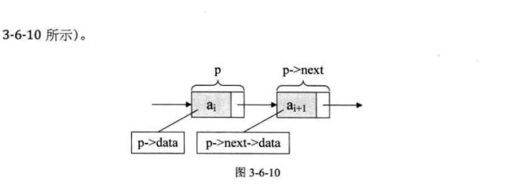

## 单链表的读取

在线性表的顺序存储结构中，我们要计算任意一个元素的存储位置是很容易的。但在单链表中，由于第1个元素到底在哪？没办法一开始就知道，必须得从头开始找。因此，对于单链表实现获取第1个元素的数据的操作GetElem，在算法上，相对要麻烦一些。

获得链表第1个数据的算法思路：

1.声明一个结点p指向链表第一个结点，初始化j从1开始；
2.当jsi时，就遍历链表，让p的指针向后移动，不断指向下一结点，i累加1；
3.若到链表末尾p为空，则说明第i个元素不存在；
4.否则查找成功，返回结点p的数据。
实现代码算法如下：

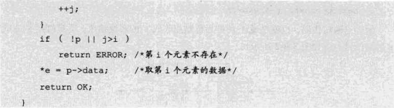

说白了，就是从头开始找，直到第1个元素为止。由于这个算法的时间复杂度取决于i的位置，当i-1时，则不需遍历，第一个就取出数据了，而当i=n时则遍历n-1次才可以。因此最坏情况的时间复杂度是O(n)。

由于单链表的结构中没有定义表长，所以不能事先知道要循环多少次，因此也就不方便使用for来控制循环。其主要核心思想就是“工作指针后移”，这其实也是很多算法的常用技术。

此时就有人说，这么麻烦，这数据结构有什么意思！还不如顺序存储结构呢。

哈，世间万物总是两面的，有好自然有不足，有差自然就有优势。下面我们来看一下在单链表中的如何实现“插入"和“删除"。

## 单链表的插入与删除

### 单链表的插入

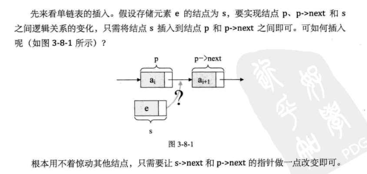

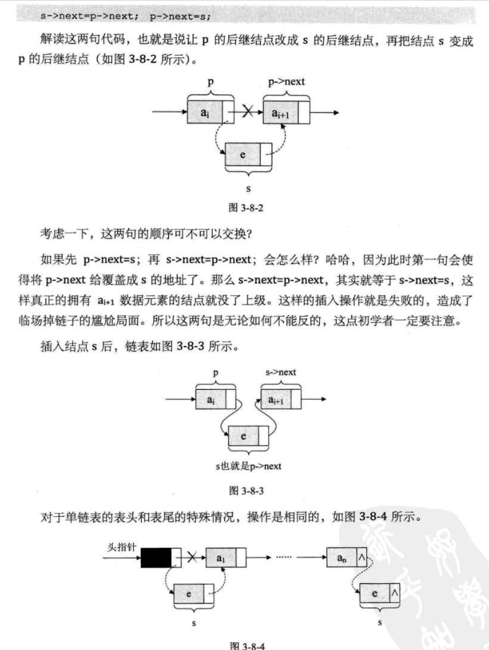

在这段算法代码中，我们用到了c语言的malbc标准函数，它的作用就是生成个新的结点，其类型与Node是一样的，其实质就是在内存中找了一小块空地，准备用来存放e数据s结点。

###  单链表的删除

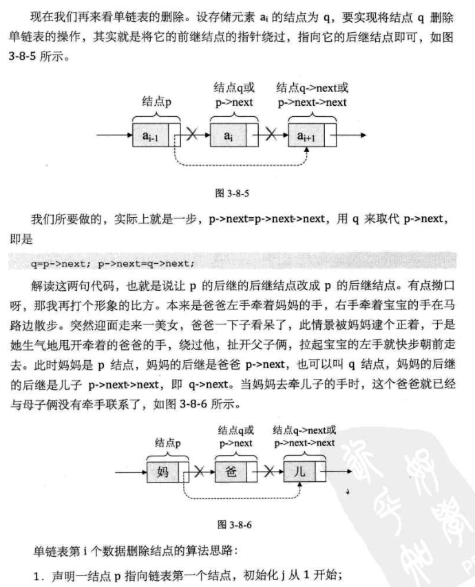

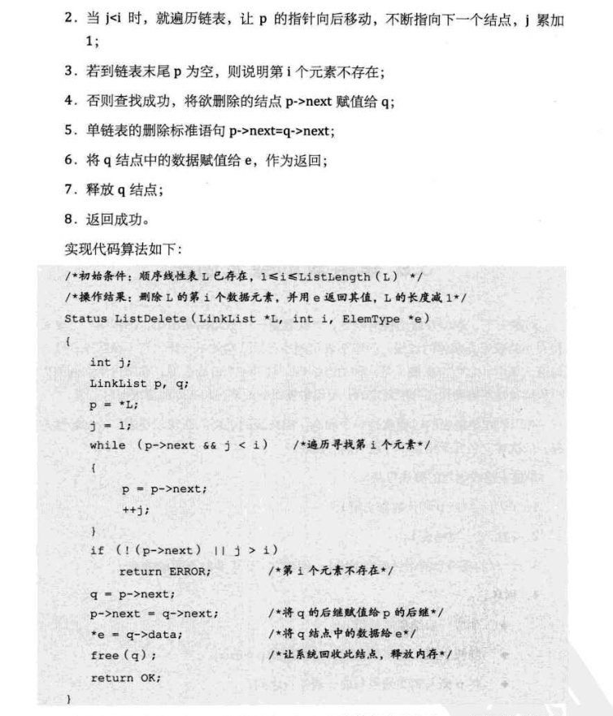

这段算法代码里，我们又用到了另一个c语言的标准函数free，它的作用就是让系统回收一个Node结点，释放内存。

分析一下刚才我们讲解的单链表插入和删除算法，我们发现，它们其实都是由两部分组成：第一部分就是遍历查找第i个元素；第二部分就是插入和删除元素。

从整个算法来说，我们很容易推导出：它们的时间复杂度都是O(n)。如果在我们不知道第1个元素的指针位置，单链表数据结构在插入和删除操作上，与线性表的顺序存储结构是没有太大优势的。但如果，我们希望从第1个位置，插入10个元素，对于顺序存储结构意味着，每一次插入都需要移动n-i个元素，每次都是O(n)。而单链表，我们只需要在第一次时，找到第1个位置的指针，此时为O(n)，接下来只是简单地通过赋值移动指针而已，时间复杂度都是O(1)。显然，对于插入或删除数据越频繁的操作，单链表的效率优势就越是明显。

## 单链表的整表创建

# 第6章：树

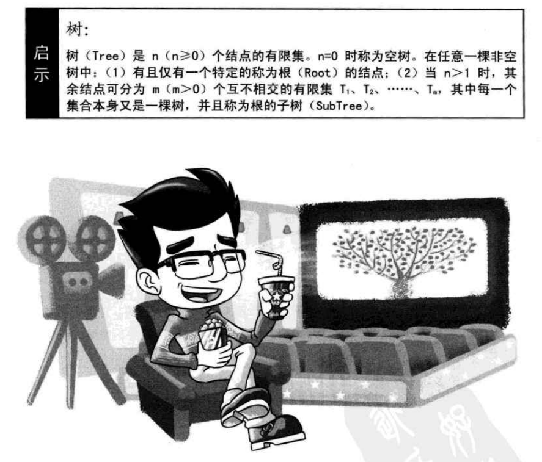

## 开场白

2010年一部电影创造了奇迹，它是全球第一部票房到达27亿美元、总票房历史排名第一的影片，那就是詹姆斯·卡梅隆执导的电影《阿凡达》（Avatar）。

电影里提到了一棵高达900英尺（约274 米）的参天巨树，是那个潘多拉星球的纳威人的家园，让人印象非常深刻。可惜那只是导演的梦想，地球上不存在这样的物种。

无论多高多大的树，那也是从小到大、由根到叶、一点点成长起来的。俗话说十年树木、百年树人，可一棵大树又何止是十年这样容易——哈哈，说到哪里去了，我们现在不是在上生物课，而是要讲一种新的数据结构——树。

## 树的定义

之前我们一直在谈的是一对一的线性结构，可现实中，还有很多一对多的情况需要处理，所以我们需要研究这种一对多的数据结构--“树"，考虑它的各种特性，来解决我们在编程中碰到的相关问题。

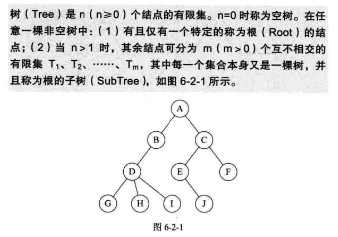

