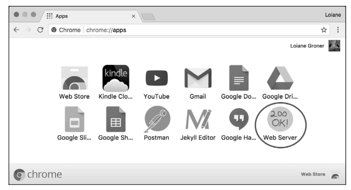
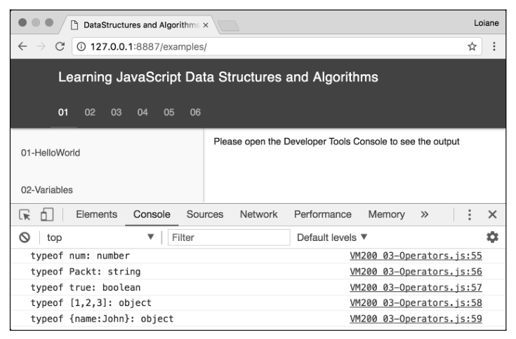
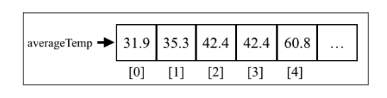

(注1：这本书还是很不错的，数据结构和算法绝大多数是用C语言来写的，而我主学JavaScript，为了学数据结构和算法再来去学C语言，现在时间和精力上也不大允许了，所以这本书真的比较适合前端来看啊。)

# 前言

Javascript是当下最流行的编程语言之一。由于浏览器的原生支持（无须安装任何插件），JavaScript也被称作“互联网语言"，JavaScript的应用非常广泛，不仅用于前端开发，也被用到服务器（Node.js）环境、数据库（MongoDB）环境和移动设备中，同样还被用在嵌入式设备和物联网（IOT）设备中。

对任何专业技术人员来说，理解数据结构都非常重要。作为软件开发者，我们要能够借助编程语言来解决问题，而数据结构是这些问题的解决方案中不可或缺的一部分。如果选择了不恰当的数据结构，可能会影响所写程序的性能。因此，了解不同数据结构和它们的适用范围十分重要。

算法在计算机科学中扮演着非常重要的角色。解决一个问题有很多种方法，但有些方法会比其他方法更好。因此，了解一下最著名的算法也很重要。

本书为数据结构和算法初学者所写，也为熟悉数据结构和算法并想在JavaScript语言中使用它们的人所写。

快乐地编码吧！

# 本书结构

第1章"JavaScript简介”，讲述了JavaScript的基础知识，可以帮助你更好地学习数据结构和算法，同时还介绍了如何搭建开发环境来运行书中的代码示例。

第2章"ECMAScript和Typescript概述”，介绍了2015年后新增的一些JavaScript功能，以及TypeScript的基本功能。TypeScript是JavaScript的一个超集。

第3章“数组”，介绍了如何使用数组这种最基础且最常用的数据结构。这一章演示了如何对数组声明、初始化、添加和删除其中的元素，还讲述了如何使用JavaScript语言本身支持的数组方法。

第4章“栈”，介绍了栈这种数据结构，演示了如何创建栈以及怎样添加和删除元素，还讨论了如何用栈解决计算机科学中的一些问题。

第5章“队列和双端队列”，详述了队列这种数据结构，演示了如何创建队列，以及如何添加和删除队列中的元素。此外，这一章也介绍了一种特殊的队列-双端队列数据结构。这一章还讨论了如何用队列解决计算机科学中的一些问题，以及栈和队列的主要区别。

第6章“链表”，讲解如何用对象和指针从头创建链表这种数据结构。这一章除了讨论如何声明、创建、添加和删除链表元素之外，还介绍了不同类型的链表，例如双向链表和循环链表。

第7章“集合”，介绍了集合这种数据结构，讨论了如何用集合存储非重复性的元素。此外，还详述了对集合的各种操作以及相应代码的实现。

第8章“字典和散列表”，深入讲解字典、散列表及它们之间的区别。这一章介绍了这两种数据结构是如何声明、创建和使用的，还探讨了如何解决散列冲突，以及如何创建更高效的散列函数。

第9章“递归”，介绍了递归的概念，描述了声明式和递归式算法之间的区别。

第10章“树”，讲解了树这种数据结构和它的相关术语，重点讨论了二叉搜索树，以及如何在树中搜索、遍历、添加和删除节点。这一章还介绍了自平衡树，包括AVL树和红黑树。

第11章“二叉堆和堆排序”，介绍了最小堆和最大堆数据结构，以及怎样使用堆作为一个优先队列，还讨论了著名的堆排序算法。

第12章“图”，介绍了图这种数据结构和它的适用范围。这一章讲述了图的常用术语和不同表示方式，探讨了如何使用深度优先搜索算法和广度优先搜索算法遍历图，以及它们的适用范围。

第13章“排序和搜索算法”，探讨了常用的排序算法，如冒泡排序（包括改进版）、选择排序、插入排序、归并排序和快速排序。这一章还介绍了计数排序和基数排序这两种分布式排序算法，搜索算法中的顺序搜索和二分搜索，以及怎样随机排列一个数组。

第14章“算法设计与技巧”，介绍了一些算法技巧和著名的算法，以及JavaScript函数式编程。

第15章“算法复杂度”，介绍了大0表示法的概念，以及本书实现算法的复杂度列表。这一章还介绍了NP完全问题和启发式算法。最后，讲解了提升算法能力的诀窍。

# 第1章：JavaScript 简介

avaScript是一门非常强大的编程语言。它是最流行的编程语言之一，也是互联网上最卓越的语言之一。在GitHub（世界上最大的代码托管站点）上，托管了400 000多个JavaScript代码仓库（用JavaScript开发的项目数量也是最多的，参看http://githut.info），使用JavaScript的项目数量还在逐年增长。

JavaScript不仅可用于前端开发，也适用于后端开发，而Node.js就是其背后的技术。Node包的数量也呈指数级增长。JavaScript同样可以用于移动开发领域，并且是Apache Cordova中最流行的语言之一。Apache Cordova是一个能让开发者使用HTML，CSS和JavaScript等语言的混合式框架，你可以通过它来搭建应用，并且生成供Android系统使用的APK文件和供IOS（苹果系统）使用的IPA文件。当然，也别忘了桌面端应用开发。我们可以使用一个名为Electron的lavaScript框架来编写同时兼容Linux，Mac OS和Windows的桌面端应用。JavaScript还可以用于嵌入式设备以及物联网（IoT）设备。正如你所看到的，到处都有JavaScript的身影!

要成为一名Web开发工程师，掌握JavaScript必不可少。

本章，你会学到Javascript的语法和一些必要的基础，这样就可以开始开发自己的数据结构和算法了。本章内容如下：

* 环境搭建和JavaScript基础
* 控制结构和函数
* JavaScript面向对象编程
* 调试工具

## JavaScript 数据结构与算法

在本书中，你将学习最常用的数据结构和算法。为什么用JavaScript来学习这些数据结构和算法呢？我们已经回答了这个问题。JavaScript非常受欢迎，作为函数式编程语言，它非常适合用来学习数据结构和算法。通过它来学习数据结构比C、Java或Python这些标准语言更简单，学习新东西也会变得很有趣。谁说数据结构和算法只为C、Java这样的语言而生？在前端开发当中，你可能也需要实现这些语言。

学习数据结构和算法十分重要。首要原因是数据结构和算法可以很高效地解决常见问题，这对你今后所写代码的质量至关重要（也包括性能；要是用了不恰当的数据结构或算法，很可能会产生性能问题），其次，对于计算机科学，算法是最基础的概念。最后，如果你想入职最好的IT公司（如谷歌、亚马逊、微软、eBay等），数据结构和算法是面试问题的重头戏。

让我们开始学习吧！

## 环境搭建

相比其他语言，JavaScript的优势之一在于不用安装或配置任何复杂的环境就可以开始学习。每台计算机上都已具备所需的环境，哪怕使用者从未写过一行代码。有浏览器足矣！

为了运行书中的示例代码，建议你做好如下准备：安装Chrome或Firefox浏览器（选择一个你最喜欢的即可），选择一个喜欢的编辑器（如Visual Studio Code），以及一个Web服务器（XAMPP或其他你喜欢的，这一步是可选的），Chrome，Firefox，VS Code和XAMPP在Windows，Linux和Mac Os上均可以使用。

### 最简单的环境搭建

浏览器是最简单的JavaScript开发环境。现代浏览器（Chrome，Firefox、Safari和Edge）都拥有一个叫作开发者工具的功能。如要使用Chrome中的开发者工具，可以点击右上角的菜单，选择More Tools | Developer Tools，如下图所示。

打开开发者工具，里面有一个Console标签页，可以在其中编写你的JavaScript代码，如下图所示（需要按下Enter键来执行源代码）

### 使用Web服务器

> 不用这个，用下面的Node。

你可能想要安装的第二个环境也很简单，但是需要安装一个Web服务器。如果一个HTML文件只包含简单的、不向服务器发送任何请求的JavaScript代码（Ajax调用），那么你可以右键点击它并选择在浏览器中直接打开。本书中需要编写的代码都很简单，可以通过这种方式执行。

但是，安装一个Web服务器总是有好处的。

有很多开源和免费的Web服务器可供选择。如果你熟悉PHP的话，XAMPP会是不错的选择，它可用于Linux、Windows和Mac OS。

由于我们会专注于服务端和浏览器上的JavaScript，可以在Chrome上安装一个简单的Web服务器，它是一个叫作Web Server for Chrome的扩展。安装好之后，可以在浏览器地址栏中输入chrome://apps来找到它。

打开Web Server扩展后，可以点击CHOOSEFOLDER来选择需要在哪个文件夹中开启服务器。你可以新建一个文件夹来执行要在本书中实现的代码，也可以下载本书的源代码并将其解压缩到你喜欢的目录下，然后就能通过设定的URL（默认是http://127.0.0.1:8887）来访问它了。

本书中的所有示例都可以通过访问http://127.0.0.1:8887/examples来执行。你会看到一个包含所有示例列表的index.html文件，如下图所示。

> 执行示例代码的时候，始终牢记打开开发者工具并切换到Console标签页来查看输出结果。Web Server for Chrome扩展也是用JavaScript开发的。为了获得更好的开发体验，建议使用该扩展来执行本书的示例代码，或者安装下一节将学习到的Node.js http-server。

### Node.js http-server

[http-server的安装、前端使用http-server启本地服务](https://juejin.im/post/6844903946444603400)

第三种选择就是100%的JavaScript！搭建这个环境需要安装Node.js。首先要到http://nodejs.org/下载和安装Node.js。然后，打开终端应用（如果你用的是Windows操作系统，打开Node.js的命令行，它随Node.js一同安装了），输入如下命令。

~~~
npm install http-server -g
~~~

最好手动输入这些命令，复制粘贴可能会出错。我们也可以用管理员身份执行上述命令。对于 Linux和 Mac OS，使用如下命令。

~~~
sudo npm install http-server -g
~~~

这条命令会在你的机器上安装一个 JavaScript服务器： http-server 。要启动服务器并在终端应用上运行本书中的示例代码，请将工作路径更改至示例代码文件夹，然后输入 http-server ，如下图所示。

为执行示例，打开浏览器，通过http-server命令指定的端口访问。

> 下载代码文件的具体步骤已经在前言中介绍过了，请翻回去看一看。本书的代码包在GitHub上的托管地址是https://github.com/PacktPublishing/Learning-Java-Script-Data-Structures-and-Algorithms-Third-Edition。其他图书或视频的代码包也可以到https://github.com/PacktPublishing/查阅。别错过！

### JavaScript 基础

> 以下内容略，不要重复学习了，没有这么多时间。

在深入学习各种数据结构和算法前，让我们先大概了解一下JavaScript。本节教大家一些相关的基础知识，有利于学习后面各章。

首先来看在HTML中编写JavaScript的两种方式。第一种方式如下面的代码所示。创建一个HTML文件（01-HelloWorld.html），把代码写进去。在这个例子里，我们在HTML文件中声明了`script`标签，然后把JavaScript代码都写进这个标签。

(以下内容略)

# 第2章：ECMAScript 和 TypeScript概述

(第2章内容略)

# 第3章：数组

几乎所有的编程语言都原生支持数组类型，因为**数组**是最简单的内存数据结构。JavaScript里也有数组类型，尽管它的第一个版本并没有支持数组。本章，我们将深入学习数组数据结构和它的能力。

数组存储一系列同一种数据类型的值。虽然在JavaScript里，也可以在数组中保存不同类型的值，但我们还是遵守最佳实践，**避免这么做**（大多数语言都没这个能力）。

## 为什么要用数组

假如有这样一个需求：保存所在城市每个月的平均温度。可以这么做：

~~~javascript
const averageTempJan = 31.9;
const averageTempFeb = 35.3;
const averageTempMar = 42.4;
const averageTempApr = 52.0; 
const averageTempMay = 60.8;
~~~

当然，这肯定不是最好的方案。按照这种方式，如果只存一年的数据，我们能管理12个变量。若要多存几年的平均温度呢？幸运的是，我们可以用数组来解决，更加简洁地呈现同样的信息。

~~~javascript
const averageTemp = [];
averageTemp [0] = 31.9; 
averageTemp [1] = 35.3;
averageTemp [2] = 42.4; 
averageTemp [3] = 52.0; 
averageTemp [4] = 60.8;
~~~

数组averageTemp里的内容如下图所示。

## 创建和初始化数组

用 JavaScript声明、创建和初始化数组很简单，就像下面这样。

~~~javascript
let daysOfWeek = new Array(); // {1}
daysOfWeek = new Array(7); // {2}
daysOfWeek = new Array('Sunday', 'Monday', 'Tuesday', 'Wednesday','Thursday', 'Friday', 'Saturday'); // {3}
~~~

使用 new 关键字，就能简单地声明并初始化一个数组（行 {1} ）。用这种方式，还可以创建一个指定长度的数组（行 {2} ）。另外，我们也可以直接将数组元素作为参数传递给它的构造器（行 {3} ）。

然而，用 new 创建数组并不是最好的方式。如果你想在 JavaScript中创建一个数组，只用中括号（ [] ）的形式就行了，如下所示。

~~~javascript
let daysOfWeek = [];
~~~

也可使用一些元素初始化数组，如下所示。

~~~javascript
let daysOfWeek = ['Sunday', 'Monday', 'Tuesday', 'Wednesday', 'Thursday','Friday', 'Saturday'];
~~~

如果想知道数组里已经存了多少个元素（它的大小），可以使用数组的 length 属性。以下代码的输出是 7 。

~~~javascript
console.log(daysOfWeek.length);
~~~

### 访问元素和迭代数组

要访问数组里特定位置的元素，可以用中括号传递数值位置，得到想知道的值或者赋新的值。假如我们想输出数组daysofweek里的所有元素，可以通过循环迭代数组、打印元素，如下所示。

~~~javascript
for (let i = 0; i < daysOfWeek.length; i++) {
	console.log(daysOfWeek[i]);
}
~~~

