# 第1章：算法简介

## 引言

算法是一组完成任务的指令。任何代码片段都可视为算法，但本书只介绍比较有趣的部分。本书介绍的算法要么速度快，要么能解决有趣的问题，要么兼而有之。下面是书中一些重要内容。

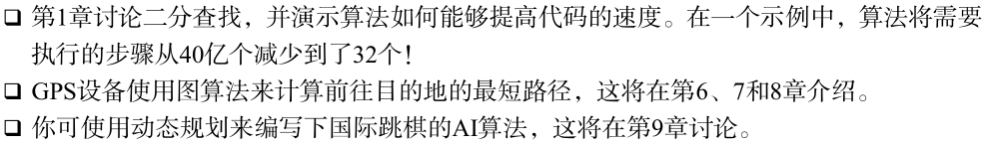

对于每种算法，本书都将首先进行描述并提供示例，再使用大O表示法讨论其运行时间，最后探索它可以解决的其他问题。

### 性能方面

好消息是，本书介绍的每种算法都很可能有使用你喜欢的语言编写的实现，因此你无需自己动手编写每种算法的代码！但如果你不明白其优缺点，这些实现将毫无用处。在本书中，你将学习比较不同算法的优缺点：该使用合并排序算法还是快速排序算法，或者该使用数组还是链表。仅仅改用不同的数据结构就可能让结果大不相同。

### 问题解决技巧

你将学习至今都没有掌握的问题解决技巧，例如：

总而言之，读完本书后，你将熟悉一些使用最为广泛的算法。利用这些新学到的知识，你可学习更具体的AI算法、数据库算法等，还可在工作中迎接更严峻的挑战。

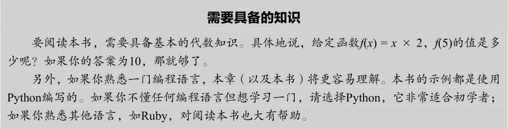

## 二分查找

假设要在电话簿中找一个名字以K打头的人，(现在谁还用电话簿！)可以从头开始翻页，直到进入以K打头的部分。但你很可能不这样做，而是从中间开始，因为你知道以K打头的名字在电话簿中间。

又假设要在字典中找一个以O打头的单词，你也将**从中间附近开始**。

现在假设你登录Facebook。当你这样做时，Facebook必须核实你是否有其网站的账户，因此必须在其**数据库中查找**你的用户名。如果你的用户名为karlmageddon，Facebook可从以A打头的部分开始查找，但更合乎逻辑的做法是从中间开始查找。

这是一个查找问题，在前述所有情况下，都可使用同一种算法来解决问题，这种算法就是**二分查找**。

二分查找是一种算法，其输入是一个**有序的元素列表**(**必须有序**的原因稍后解释)，如果要查找的元素包含在列表中，二分查找返回其位置；否则返回null。

下图是一个例子。

下面的示例说明了二分查找的工作原理。我随便想一个1~100的数字。

你的目标是以最少的次数猜到这个数字。你每次猜测后，我会说小了、大了或对了。

假设你从1开始依次往上猜，猜测过程会是这样。

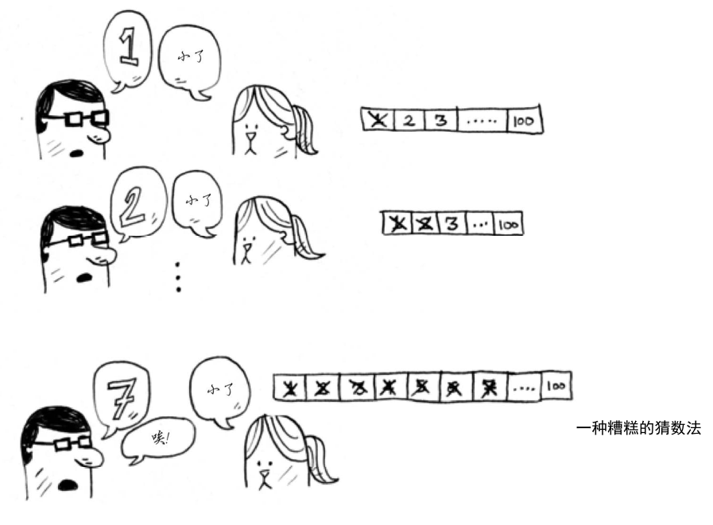

这是简单查找，更准确的说法是傻找。每次猜测都只能排除一个数字。如果我想的数字是99，你得猜99次才能猜到！

### 更佳的查找方式

下面是一种更佳的猜法。从50开始。

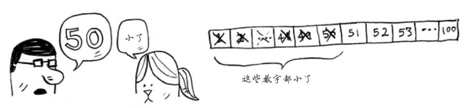

小了，但排除了一半的数字！至此，你知道1~50都小了。接下来，你猜75。

大了，那余下的数字又排除了一半！使用二分查找时，你猜测的是中间的数字，从而每次都将余下的数字排除一半。接下来，你猜63(50和75中间的数字)。

这就是二分查找，你学习了第一种算法！每次猜测排除的数字个数如下。

不管我心里想的是哪个数字，你在7次之内都能猜到，因为每次清测都将排除很多数字！

假设你要在字典中查找一个单词，而该字典包含240 000个单词，你认为每种查找最多需要多少步？

如果要查找的单词位于字典末尾，使用简单查找将需要240 000步。使用二分查找时，每次排除一半单词，直到最后只剩下一个单词。

假设你要在字典中查找一个单词，而该字典包含240 000个单词，你认为每种查找最多需要多少步？

因此，使用二分查找只需18步——少多了！一般而言，对于包含n个元素的列表，用二分查找**最多需要log~2~n步**，而简单查找**最多需要n步**。

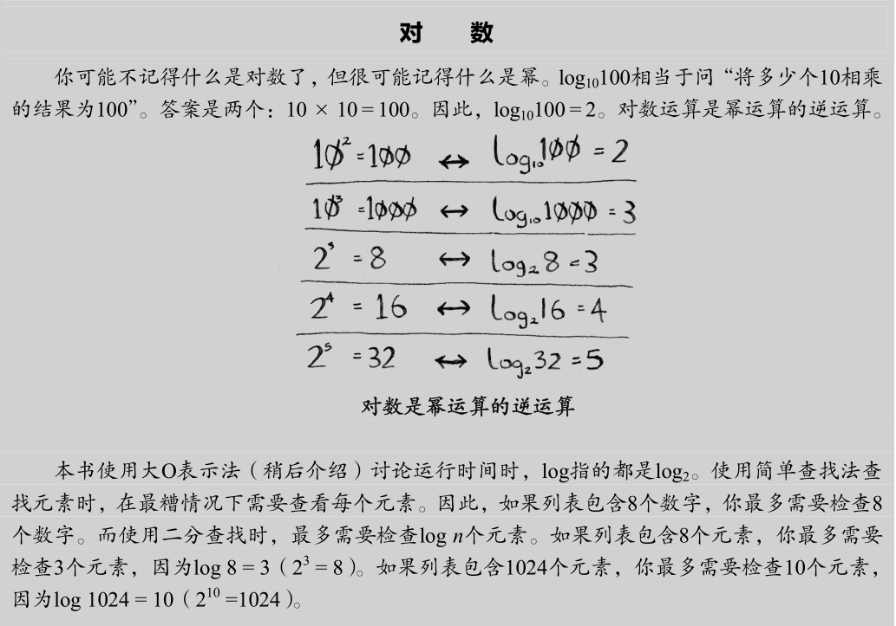

下面来看看如何编写执行二分查找的Python代码。这里的代码示例使用了**数组**。如果你不熟悉数组，也不用担心，下一章就会介绍。你只需知道，可将一系列元素存储在一系列相邻的桶(bucket)，即数组中。这些桶从0开始编号：第一个桶的位置为#0，第二个桶为#1，第三个桶为#2，以此类推。

函数binary_search接受一个**有序数组**和一个元素。如果指定的元素包含在数组中，这个函数将返回其位置。你将跟踪要在其中查找的数组部分——开始时为整个数组。

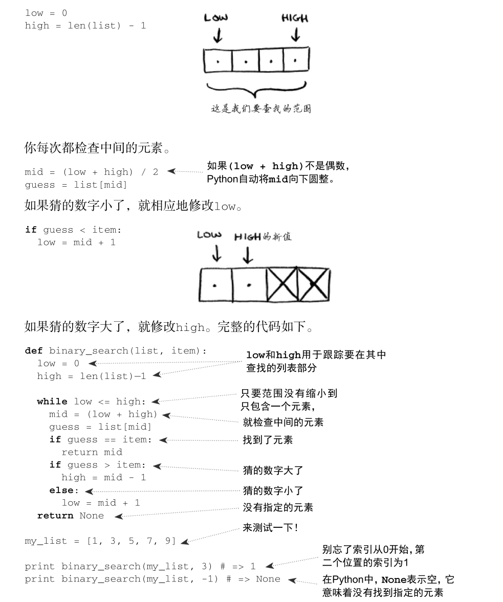

### 运行时间

每次介绍算法时，我都将讨论其运行时间。一般而言，应选择效率最高的算法，以最大限度地减少运行时间或占用空间。

回到前面的二分查找。使用它可节省多少时间呢？简单查找逐个地检查数字，如果列表包含100个数字，最多需要猜100次。如果列表包含40亿个数字，最多需要猜40亿次。换言之，最多需要猜测的次数与列表长度相同，这被称为**线性时间**(linear time)。

二分查找则不同。如果列表包含100个元素，最多要猜7次；如果列表包含40亿个数字，最多需猜32次。厉害吧？二分查找的运行时间为对数时间(或log时间)，下表总结了我们发现的情况。

## 大O表示法

**大O表示法是一种特殊的表示法，指出了算法的速度有多快**。谁在乎呢？实际上，你经常要使用别人编写的算法，在这种情况下，知道这些算法的速度大有裨益。本节将介绍大O表示法是什么，并使用它列出一些最常见的算法运行时间。

### 算法的运行时间以不同的速度增加

Bob要为NASA编写一个查找算法，这个算法在火箭即将登陆月球前开始执行，帮助计算着陆地点。

这个示例表明，两种算法的运行时间呈现不同的增速。Bob需要做出决定，是使用简单查找还是二分查找。使用的算法必须快速而准确。一方面，二分查找的速度更快。Bob必须在10秒钟内找出着陆地点，否则火箭将偏离方向。另一方面，简单查找算法编写起来更容易，因此出现bug的可能性更小。Bob可不希望引导火箭着陆的代码中有bug！为确保万无一失，Bob决定计算两种算法在列表包含100个元素的情况下需要的时间。

假设检查一个元素需要1毫秒。使用简单查找时，Bob必须检查100个元素，因此需要100毫秒才能查找完毕。而使用二分查找时，只需检查7个元素(log~2~100大约为7)，因此需要7毫秒就能查找完毕。然而，实际要查找的列表可能包含10亿个元素，在这种情况下，简单查找需要多长时间呢？二分查找又需要多长时间呢？请务必找出这两个问题的答案，再接着往下读。

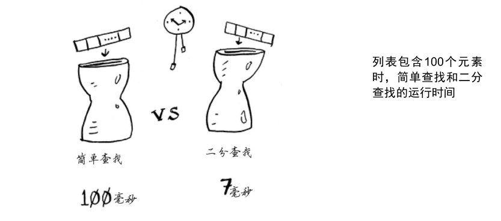

Bob使用包含10亿个元素的列表运行二分查找，运行时间为30毫秒(log~2~1 000 000 000大约为30)。他心里想，二分查找的速度大约为简单查找的15倍，因为列表包含100个元素时，简单查找需要100毫秒，而二分查找需要7毫秒。因此，列表包含10亿个元素时，简单查找需要30 x 15=450毫秒，完全符合在10秒内查找完毕的要求。Bob决定使用简单查找。这是正确的选择吗？

不是。实际上，Bob错了，而且错得离谱。列表包含10亿个元素时，简单查找需要10亿毫秒，相当于11天！为什么会这样呢？因为二分查找和简单查找的运行时间的增速不同。

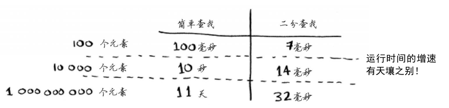

也就是说，随着元素数量的增加，二分查找需要的额外时间并不多，而简单查找需要的额外时间却很多。因此，随着列表的增长，二分查找的速度比简单查找快得多。Bob以为二分查找速度为简单查找的15倍，这不对：列表包含10亿个元素时，为3300万倍。有鉴于此，仅知道算法：需要多长时间才能运行完毕还不够，还需知道运行时间如何随列表增长而增加。这正是大O表示法的用武之地。

大O表示法指出了算法有多快。例如，假设列表包含n个元素。简单查找需要检查每个元素，因此需要执行n次操作。使用大0表示法，这个运行时间为O(n)。**单位秒呢？没有**——**大O表示法指的并非以秒为单位的速度。大O表示法让你能够比较操作数**，它指出了算法运行时间的**增速(加速度)**。

再来看一个例子。为检查长度为n的列表，二分查找需要执行log~n~次操作。使用大O表示法，这个运行时间怎么表示呢？O(log~n~)。一般而言，大O表示法像下面这样。

这指出了算法需要执行的操作数。之所以称为大O表示法，是因为操作数前有个大0。这听起来像笑话，但事实如此！

下面来看一些例子，看看你能否确定这些算法的运行时间。

### 理解不同的大O运行时间

下面的示例，你在家里使用纸和笔就能完成。假设你要画一个网格，它包含16个格子。

**算法1**

一种方法是以每次画一个的方式画16个格子。记住，大0表示法计算的是操作数。在这个示例中，画一个格子是一次操作，需要画16个格子。如果每次画一个格子，需要执行多少次操作呢？

画16个格子需要16步。这种算法的运行时间是多少？

**算法2**

请尝试这种算法将纸折起来。

在这个示例中，将纸对折一次就是一次操作。第一次对折相当于画了两个格子！
再折，再折，再折。

折4次后再打开，便得到了漂亮的网格！每折一次，格子数就翻倍，折4次就能得到16个格子！

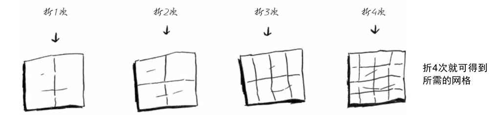

你每折一次，绘制出的格子数都翻倍，因此4步就能“绘制”出16个格子。这种算法的运行时间是多少呢？请搞清楚这两种算法的运行时间之后，再接着往下读。

答案如下：算法1的运行时间为O(n)，算法2的运行时间为O(logn)。

### 大O表示法指出了最糟情况下的运行时间

假设你使用简单查找在电话簿中找人。你知道，简单查找的运行时间为O(n)，这意味着在最糟情况下，必须查看电话簿中的每个条目。如果要查找的是Adit一电话簿中的第-一个人，一次就能找到，无需查看每个条目。考虑到--次 就找到了Adit，请问这种算法的运行时间是0(n)还是0(1)呢？

简单查找的运行时间总是为O(n)。查找Adit时，一次就找到了，这是最佳的情形，但大0表示法说的是最糟的情形。因此，你可以说，在最糟情况下，必须查看电话簿中的每个条目，对应的运行时间为O(n)。这是一个保证一你 知道简单查找的运行时间不可能超过O(n)。

### 一些常见的大O运行时间

下面按从快到慢的顺序列出了你经常会遇到的5种大O运行时间。

假设你要绘制一-个包含16格的网格，且有5种不同的算法可供选择，这些算法的运行时间如上所示。如果你选择第一种算法，绘制该网格所需的操作数将为4(log 16=4)。假设你每秒可执行10次操作，那么绘制该网格需要0.4秒。如果要绘制---个包含1024格的网格呢？这需要执行10(log 1024= 10)次操作，换言之，绘制这样的网格需要1秒。这是使用第一种算法的情况。

第二种算法更慢，其运行时间为O(n)。即要绘制16个格子，需要执行16次操作；要绘制1024个格子，需要执行1024次操作。执行这些操作需要多少秒呢？

下面按从快到慢的顺序列出了使用这些算法绘制网格所需的时间：

还有其他的运行时间，但这5种是最常见的。

这里做了简化，实际上，并不能如此干净利索地将大O运行时间转换为操作数，但就目前而言，这种准确度足够了。等你学习其他一些算法后，第4章将回过头来再次讨论大O表示法。当前，我们获得的主要启示如下。

* 算法的速度指的并非时间，而是操作数的增速。
* 谈论算法的速度时，我们说的是随着输人的增加，其运行时间将以什么样的速度增加。
* 算法的运行时间用大0表示法表示。
* O(log n)比O(n)快，当需要搜索的元素越多时，前者比后者快得越多。

### 旅行商

阅读前一节时，你可能认为根本就没有运行时间为O(n！)的算法。让我来证明你错了！下面就是一个运行时间极长的算法。这个算法要解决的是计算机科学领域非常著名的旅行商问题，其计算时间增加得非常快，而有些非常聪明的人都认为没有改进空间。

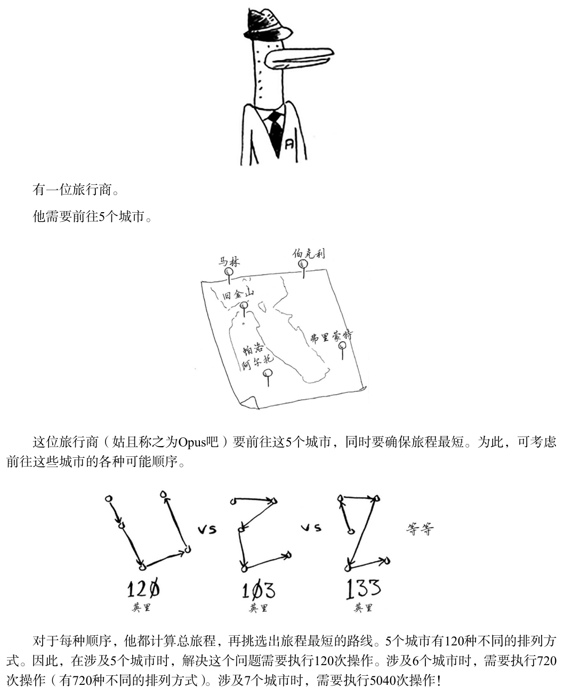

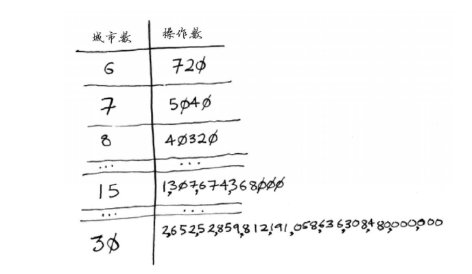

推而广之，涉及n个城市时，需要执行n!(n的阶乘)次操作才能计算出结果。因此运行时间为O(n！)，即阶乘时间。除非涉及的城市数很少，否则需要执行非常多的操作。如果涉及的城市数超过100，根本就不能在合理的时间内计算出结果-等你计算出结果，太阳都没了。

这种算法很糟糕！Opus应使用别的算法，可他别无选择。这是计算机科学领域待解的问题之一。对于这个问题，目前还没有找到更快的算法，有些很聪明的人认为这个问题根本就没有更巧妙的算法。面对这个问题，我们能做的只是去找出近似答案，更详细的信息请参阅第10章。

最后需要指出的一点是，高水平的读者可研究一下二叉树，这在最后一章做了简要的介绍。

## 小结

* 二分查找的速度比简单查找快得多。
* O(logn)比O(n)快。需要搜索的元素越多，前者比后者就快得越多。
* 算法运行时间并不以秒为单位。
* 算法运行时间是从其增速的角度度量的。
* 算法运行时间用大O表示法表示。

# 第2章：选择排序

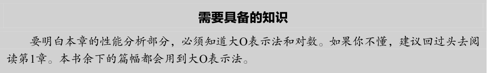

## 内存的工作原理

假设你去看演出，需要将东西寄存。寄存处有一个柜子，柜子有很多抽屉。

每个抽屉可放一样东西，你有两样东西要寄存，因此要了两个抽屉。

你将两样东西存放在这里。

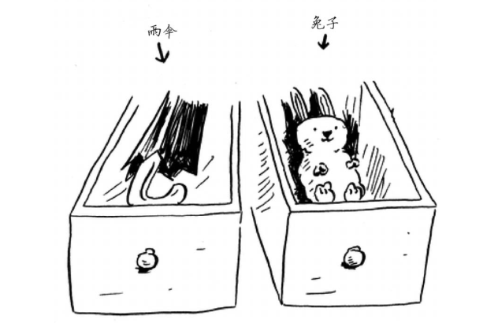

现在你可以去看演出了！这大致就是计算机内存的工作原理。计算机就像是很多抽屉的集合体，每个抽屉都有地址。

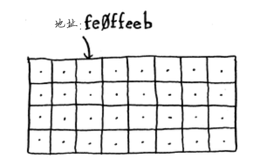

feoffeeb是一个内存单元的地址。

需要将数据存储到内存时，你请求计算机提供存储空间，计算机给你一个存储地址。需要存储多项数据时，有两种基本方式-数组和链表。但它们并非都适用于所有的情形，因此知道它们的差别很重要。接下来介绍数组和链表以及它们的优缺点。

## 数组和链表

有时候，需要在内存中存储一系列元素。假设你要编写一个管理待办事项的应用程序，为此需要将这些待办事项存储在内存中。

应使用数组还是链表呢？鉴于数组更容易掌握，我们先将待办事项存储在数组中。使用数组意味着所有待办事项在内存中都是相连的(紧靠在一起的)。

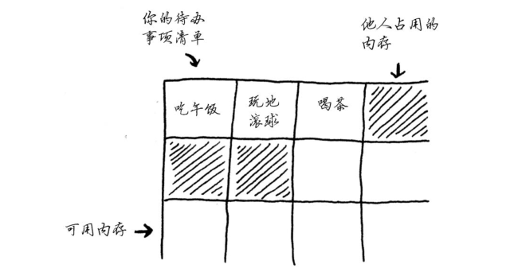

现在假设你要添加第四个待办事项，但后面的那个抽屉放着别人的东西！

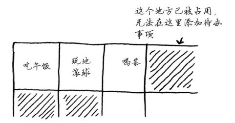

这就像你与朋友去看电影，找到地方就坐后又来了一位朋友，但原来坐的地方没有空位置，只得再找一个可坐下所有人的地方。在这种情况下，你需要请求计算机重新分配一块可容纳4个待办事项的内存，再将所有待办事项都移到那里。

如果又来了一位朋友，而当前坐的地方也没有空位，你们就得再次转移！真是太麻烦了。同样，在数组中添加新元素也可能很麻烦。如果没有了空间，就得移到内存的其他地方，因此添加新元素的速度会很慢。一种解决之道是“预留座位”：即便当前只有3个待办事项，也请计算机提供10个位置，以防需要添加待办事项。这样，只要待办事项不超过10个，就无需转移。这是一个不错的权变措施，但你应该明白，它存在如下两个缺点。

* 你额外请求的位置可能根本用不上，这将浪费内存。你没有使用，别人也用不了。
* 待办事项超过10个后，你还得转移。

因此，这种权宜措施虽然不错，但绝非完美的解决方案。对于这种问题，可使用链表来解决。

### 链表

链表中的元素可存储在内存的任何地方。

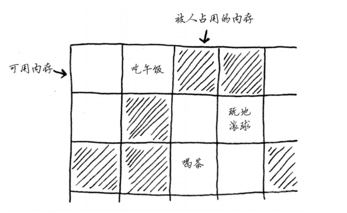

链表的每个元素都存储了下一个元素的**地址**，从而使一系列随机的内存地址串在一起。

这犹如寻宝游戏。你前往第一个地址，那里有一张纸条写着“下一个元素的地址为123"。因此，你前往地址123，那里又有一张纸条，写着“下一个元素的地址为847"，以此类推。在链表中添加元素很容易：只需将其放入内存，并将其地址存储到前一个元素中。

使用链表时，根本就不需要移动元素。这还可避免另一个问题。假设你与五位朋友去看一部很火的电影。你们六人想坐在一起，但看电影的人较多，没有六个在一起的座位。使用数组时有时就会遇到这样的情况。假设你要为数组分配10 000个位置，内存中有10 000个位置，但不都靠在一起。在这种情况下，你将无法为该数组分配内存！链表相当于说“我们分开来坐”，因此，只要有足够的内存空间，就能为链表分配内存。

链表的优势在插入元素方面，那数组的优势又是什么呢？

### 数组

排行榜网站使用卑鄙的手段来增加页面浏览量。它们不在一个页面中显示整个排行榜，而将排行榜的每项内容都放在一个页面中，并让你单击Next来查看下一项内容。例如，显示十大电视反派时，不在一个页面中显示整个排行榜，而是先显示第十大反派(Newman)，你必须在每个页面中单击Next，才能看到第一大反派(Gustavo Fring)，这让网站能够在10个页面中显示广告，但用户需要单击Next九次才能看到第一个，真的是很烦。如果整个排行榜都显示在一个页面中，将方便得多。这样，用户可单击排行榜中的人名来获得更详细的信息。

链表存在类似的问题。在需要读取链表的最后一个元素时，你不能直接读取，因为你不知道它所处的地址，必须先访问元素#1，从中获取元素#2的地址，再访问元素#2并从中获取元素#3的地址，以此类推，直到访问最后一个元素。需要同时读取所有元素时，链表的效率很高：你读取第一个元素，根据其中的地址再读取第二个元素，以此类推。但如果你需要跳跃，链表的效率真的很低。

数组与此不同：你知道其中每个元素的地址。例如，假设有一个数组，它包含五个元素，起始地址为00，那么元素#5的地址是多少呢？

只需执行简单的数学运算就知道：04，需要随机地读取元素时，数组的效率很高，因为可迅速找到数组的任何元素。在链表中，元素并非靠在一起的，你无法迅速计算出第五个元素的内存地址，而必须先访问第一个元素以获取第二个元素的地址，再访问第二个元素以获取第三个元素的地址，以此类推，直到访问第五个元素。

### 术语

数组的元素带编号，编号从0而不是1开始。例如，在下面的数组中，元素20的位置为1。

而元素10的位置为0。这通常会让新手晕头转向。从0开始让基于数组的代码编写起来更容易，因此程序员始终坚持这样做。几乎所有的编程语言都从0开始对数组元素进行编号。你很快就会习惯这种做法。

元素的位置称为索引。因此，不说“元素20的位置为1”，而说“元素20位于索引1处”。本书将使用索引来表示位置。

下面列出了常见的数组和链表操作的运行时间。

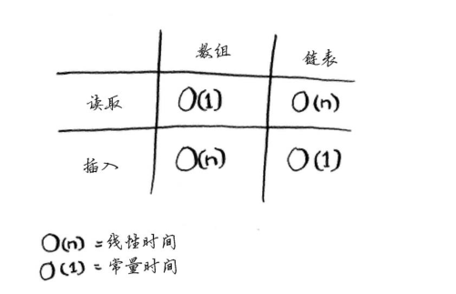

问题：在数组中插入元素时，为何运行时间为0(m)呢？假设要在数组开头插入一个元素，你将如何做？这需要多长时间？请阅读下一节，找出这些问题的答案！

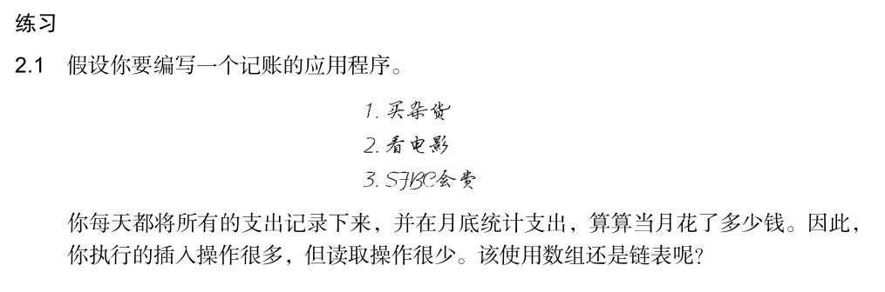

### 在中间插入

假设你要让待办事项按日期排列。之前，你在清单末尾添加了待办事项。
但现在你要根据新增待办事项的日期将其插入到正确的位置。

需要在中间插入元素时，数组和链表哪个更好呢？使用链表时，插入元素很简单，只需修改它前面的那个元素指向的地址。

而使用数组时，则必须将后面的元素都向后移。

如果没有足够的空间，可能还得将整个数组复制到其他地方！因此，当需要在中间插入元素时，链表是更好的选择。

### 删除

如果你要删除元素呢？链表也是更好的选择，因为只需修改前一个元素指向的地址即可。而使用数组时，删除元素后，必须将后面的元素都向前移。

不同于插入，删除元素总能成功。如果内存中没有足够的空间，插入操作可能失败，但在任何情况下都能够将元素删除。

下面是常见数组和链表操作的运行时间。

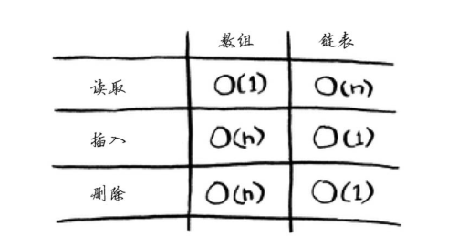

需要指出的是，仅当能够立即访问要删除的元素时，删除操作的运行时间才为O(1)，通常我们都记录了链表的第一个元素和最后一个元素，因此删除这些元素时运行时间为O(1)。

数组和链表哪个用得更多呢？显然要看情况。但**数组用得很多**，因为它支持随机访问。有两种访问方式：**随机访问和顺序访问**。顺序访问意味着从第一个元素开始逐个地读取元素。链表只能顺序访问：要读取链表的第十个元素，得先读取前九个元素，并沿链接找到第十个元素。随机访问意味着可直接跳到第十个元素。本书经常说数组的读取速度更快，这是因为它们支持随机访问。很多情况都要求能够随机访问，因此数组用得很多。数组和链表还被用来实现其他数据结构，这将在本书后面介绍。

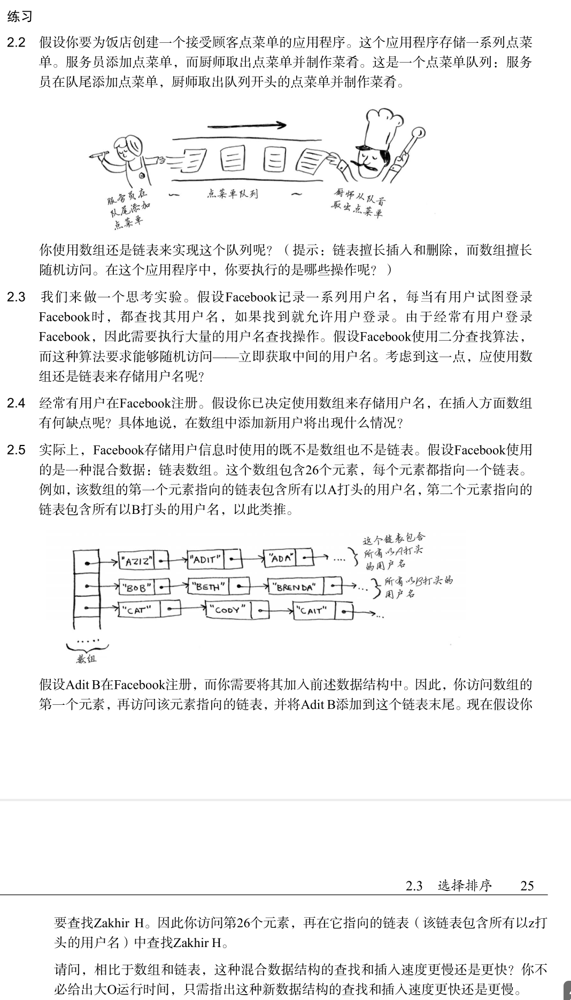

## 选择排序

有了前面的知识，你就可以学习第二种算法-选择排序了。要理解本节的内容，你必须熟悉数组、链表和大0表示法。

假设你的计算机存储了很多乐曲。对于每个乐队，你都记录了其作品被播放的次数。

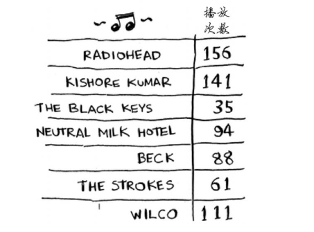

你要将这个列表按播放次数从多到少的顺序排列，从而将你喜欢的乐队排序。该如何做呢？一种办法是遍历这个列表，找出作品播放次数最多的乐队，并将该乐队添加到一个新列表中。

再次这样做，找出播放次数第二多的乐队。

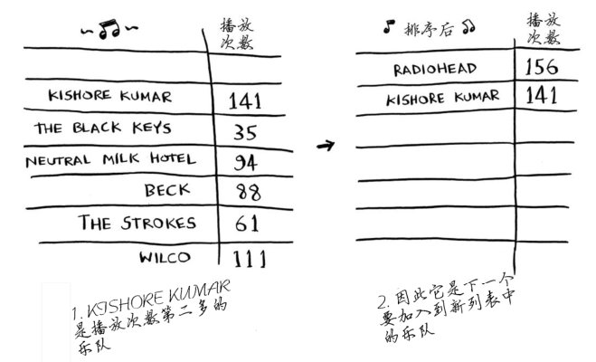

继续这样做，你将得到一个有序列表。

下面从计算机科学的角度出发，看看这需要多长时间。别忘了，O(n)时间意味着查看列表中的每个元素一次。例如，对乐队列表进行简单查找时，意味着每个乐队都要查看一次。

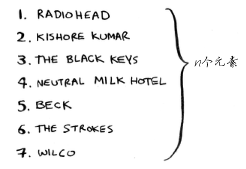

要找出播放次数最多的乐队，必须检查列表中的每个元素。正如你刚才看到的，这需要的时间为O(n)。因此对于这种时间为O(n)的操作，你需要执行n次。

需要的总时间为O(n×n)，即O(n^2^)。

排序算法很有用。你现在可以对如下内容进行排序：

* 电话簿中的人名
* 旅行日期
* 电子邮件(从新到旧)

选择排序是一种灵巧的算法，但其速度不是很快。快速排序是一种更快的排序算法，其运行时间为O(nlogn)，这将在下一章介绍。

## 小结

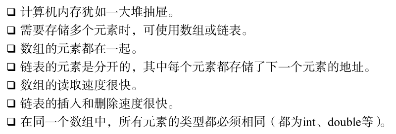

# 第3章：递归

[JS 中的递归](https://juejin.im/entry/6844903482164527111)

我怀着激动的心情编写本章，因为它介绍的是递归--一种优雅的问题解决方法。递归是我最喜欢的主题之一，它将人分成三个截然不同的阵营：恨它的、爱它的以及恨了几年后又爱上它的。我本人属于第三个阵营。为帮助你理解，现有以下建议。

* 本章包含很多示例代码，请运行它们，以便搞清楚其中的工作原理。
* 请用纸和笔逐步执行至少一个递归函数，就像这样：我使用5来调用factorial，这将使用4调用factorial，并将返回结果乘以5，以此类推。这样逐步执行递归函数可搞明白递归函数的工作原理。

本章还包含大量伪代码。伪代码是对手头问题的简要描述，看着像代码，但其实更接近自然语言。

## 递归

假设你在祖母的阁楼中翻箱倒柜，发现了一个上锁的神秘手提箱。

这个盒子里有盒子，而盒子里的盒子又有盒子。钥匙就在某个盒子中。为找到钥匙，你将使用什么算法？先想想这个问题，再接着往下看。

下面是一种方法。

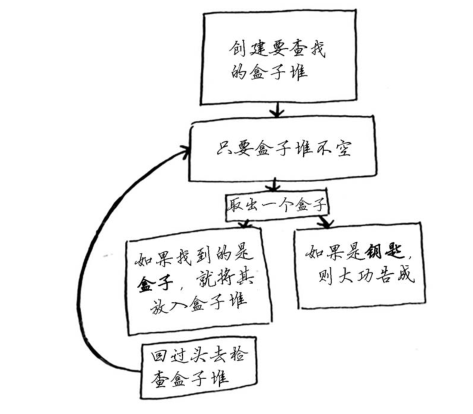

(1)创建一个要查找的盒子堆。

(2)从盒子堆取出一个盒子，在里面找。

(3)如果找到的是盒子，就将其加入盒子堆中，以便以后再查找。

(4)如果找到钥匙，则大功告成！

(5)回到第二步。

下面是另一种方法。

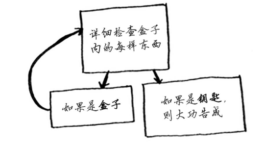

(1)检查盒子中的每样东西。

(2)如果是盒子，就回到第一步。

(3)如果是钥匙，就大功告成！

在你看来，哪种方法更容易呢？第一种方法使用的是while循环：只要盒子堆不空，就从中取一个盒子，并在其中仔细查找。

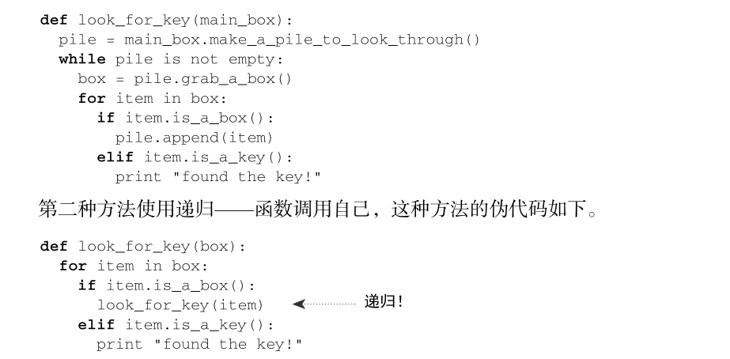

这两种方法的作用相同，但在我看来，第二种方法更清晰。递归只是让解决方案更清晰，并没有性能上的优势。实际上，在有些情况下，使用循环的性能更好。我很喜欢Leigh Caldwell在Stack Overflow上说的一句话：“**如果使用循环，程序的性能可能更高；如果使用递归，程序可能更容易理解**。如何选择要看什么对你来说更重要。”

很多算法都使用了递归，因此理解这种概念很重要。

## 基线条件和递归条件

由于递归函数调用自己，因此编写这样的函数时很容易出错，进而导致无限循环。例如，假设你要编写一个像下面这样倒计时的函数。

编写递归函数时，必须告诉它何时停止递归。正因为如此，每个递归函数都有两部分：**基线条件(base case)和递归条件(recursive case)**。递归条件指的是函数调用自己，而基线条件则指的是函数不再调用自己，从而避免形成无限循环。

我们来给函数countdown添加基线条件。

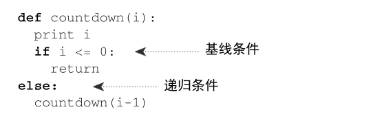

现在，这个函数将像预期的那样运行，如下所示。

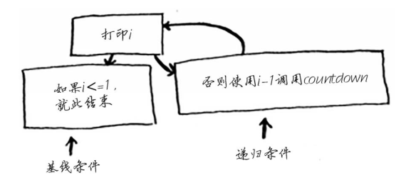

## 栈

本节将介绍一个重要的编程概念-调用栈(call stack)。调用栈不仅对编程来说很重要，使用递归时也必须理解这个概念。

假设你去野外烧烤，并为此创建了一个待办事项清单：一叠便条。

本书之前讨论数组和链表时，也有一个待办事项清单。你可将待办事项添加到该清单的任何地方，还可删除任何一个待办事项。一叠便条要简单得多：插入的待办事项放在清单的最前面；读取待办事项时，你只读取最上面的那个，并将其删除。因此这个待办事项清单只有两种操作：压入(插入)和弹出(删除并读取)。

下面来看看如何使用这个待办事项清单。

这种数据结构称为栈。栈是一种简单的数据结构，刚才我们一直在使用它，却没有意识到！

### 调用栈

计算机在内部使用被称为调用栈的栈。我们来看看计算机是如何使用调用栈的。下面是一个简单的函数。

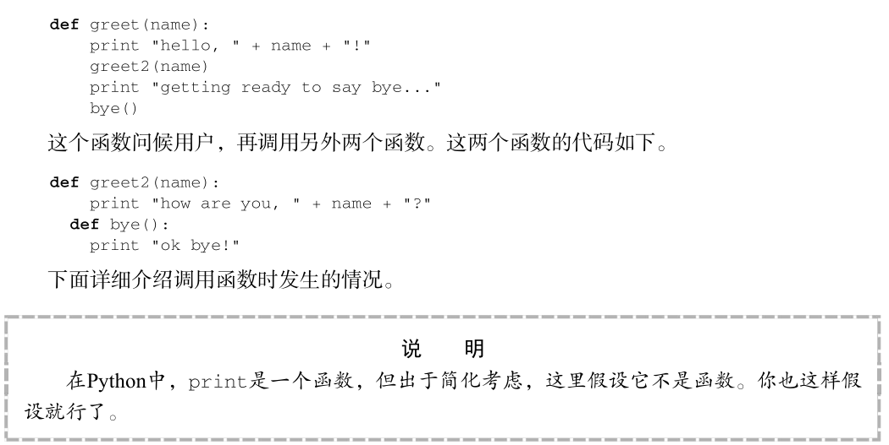

假设你调用greet("maggie")，计算机将首先为该函数调用分配一块内存。

我们来使用这些内存。变量name被设置为maggie，这需要存储到内存中。

每当你调用函数时，计算机都像这样将函数调用涉及的所有变量的值存储到内存中。接下来，你打印`hello,maggie!`，再调用`greet2("maggie")`。同样，计算机也为这个函数调用分配一块内存。

计算机使用一个栈来表示这些内存块，其中第二个内存块位于第一个内存块上面。你打印`how are you，maggie？`，然后从函数调用返回。此时，栈顶的内存块被弹出。

现在，栈顶的内存块是函数greet的，这意味着你返回到了函数greet。当你调用函数greet2时，函数greet只执行了一部分。这是本节的一个重要概念：调用另一个函数时，当前函数暂停并处于未完成状态。该函数的所有变量的值都还在内存中。执行完函数greet2后，你回到函数greet，并从离开的地方开始接着往下执行：首先打印`getting ready to say bye...`，再调用函数bye。

在栈顶添加了函数bye的内存块。然后，你打印ok bye！，并从这个函数返回。

现在你又回到了函数greet。由于没有别的事情要做，你就从函数greet返回。这个栈用于存储多个函数的变量，被称为调用栈。

### 递归调用栈

递归函数也使用调用栈！来看看递归函数factorial的调用栈。factorial(5)写作5!，其定义如下：5!=5\*4\*3\*2\*1，同理，factorial(3)为3\*2\*1。下面是计算阶乘的递归函数。

下面来详细分析调用fact(3)时调用栈是如何变化的。别忘了，栈顶的方框指出了当前执行到了什么地方。

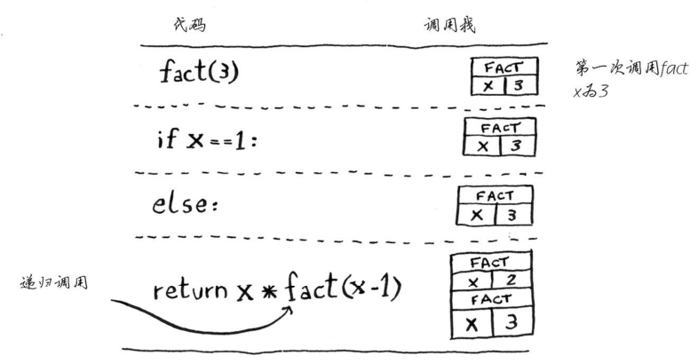

注意，每个fact调用都有自己的x变量。在一个函数调用中不能访问另一个的x变量。栈在递归中扮演着重要角色。在本章开头的示例中，有两种寻找钥匙的方法。下面再次列出了第一种方法。

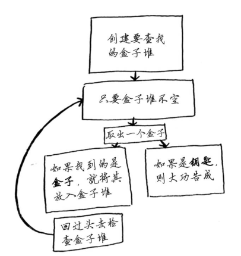

使用这种方法时，你创建一个待查找的盒子堆，因此你始终知道还有哪些盒子需要查找。

但使用递归方法时，没有盒子堆。

既然没有盒子堆，那算法怎么知道还有哪些盒子需要查找呢？下面是一个例子。

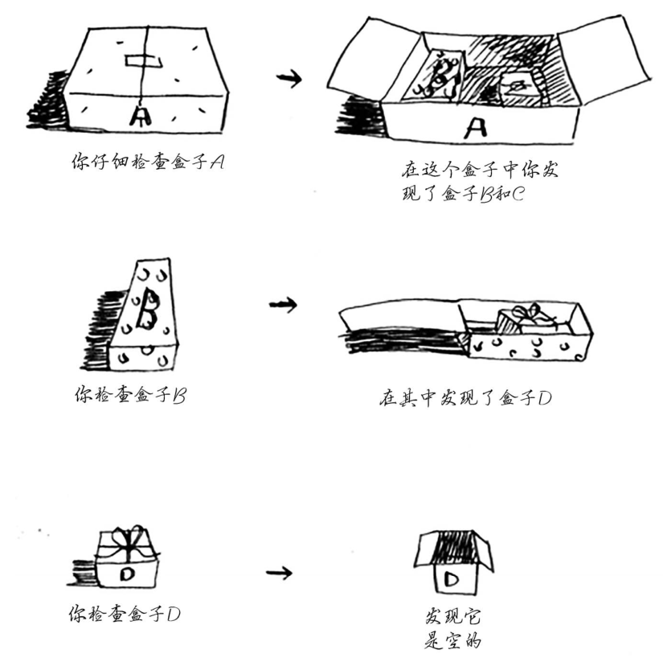

此时，调用栈类似于下面这样。

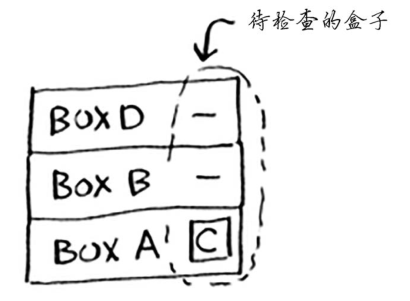

原来“盒子堆”存储在了栈中！这个栈包含未完成的函数调用，每个函数调用都包含还未检查完的盒子。使用栈很方便，因为你无需自己跟踪盒子堆-栈替你这样做了。

使用栈虽然很方便，但是也要付出代价：存储详尽的信息可能占用大量的内存。每个函数调用都要占用一定的内存，如果栈很高，就意味着计算机存储了大量函数调用的信息。在这种情况下，你有两种选择。

* 重新编写代码，转而使用循环。
* 使用尾递归。这是一个高级递归主题，不在本书的讨论范围内。另外，并非所有的语言都支持尾递归。

### 小结

# 第4章：快速排序

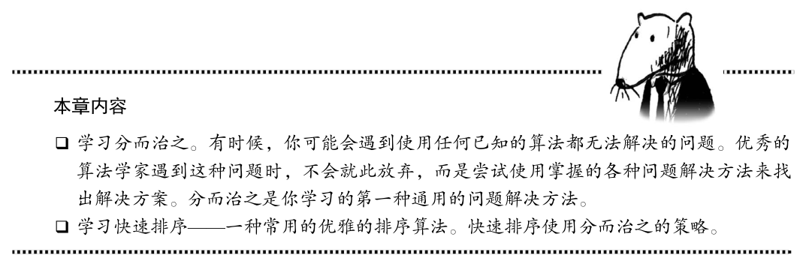

前一章深入介绍了递归，本章的重点是使用学到的新技能来解决问题。我们将探索**分而治之**(divide and conquer，D&C)—一种著名的递归式问题解决方法。

本书将深入算法的核心。只能解决一种问题的算法毕竟用处有限，而D&C提供了解决问题的思路，是另一个可供你使用的工具。面对新问题时，你不再束手无策，而是自问：“使用分而治之能解决吗？”

在本章末尾，你将学习第一个重要的D&C算法——快速排序。快速排序是一种排序算法，速度比第2章介绍的选择排序快得多，实属优雅代码的典范。

## 分而治之

D&C并不那么容易掌握，我将通过三个示例来介绍。首先，介绍一个直观的示例；然后，介绍一个代码示例，它不那么好看，但可能更容易理解；最后，详细介绍快速排序—一种使用D&C的排序算法。

假设你是农场主，有一小块土地。

你要将这块地均匀地分成方块，且分出的方块要尽可能大。显然，下面的分法都不符合要求。

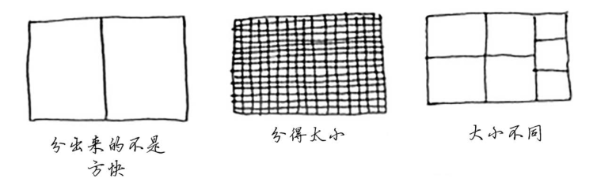

如何将一块地均匀地分成方块，并确保分出的方块是最大的呢？使用D&C策略！D&C算法是递归的。使用D&C解决问题的过程包括两个步骤。

(1)找出基线条件，这种条件必须尽可能简单。

(2)不断将问题分解(或者说缩小规模)，直到符合基线条件。

下面就来使用D&C找出前述问题的解决方案。可你能使用的最大方块有多大呢？

首先，找出基线条件。最容易处理的情况是，一条边的长度是另一条边的整数倍。

如果一边长25m，另一边长50m，那么可使用的最大方块为25m×25m。换言之，可以将这块地分成两个这样的方块。

现在需要找出递归条件，这正是D&C的用武之地。根据D&C的定义，每次递归调用都必须缩小问题的规模。如何缩小前述问题的规模呢？我们首先找出这块地可容纳的最大方块。

你可以从这块地中划出两个640m×640m的方块，同时余下一小块地。现在是顿悟时刻：何不对余下的那一小块地使用相同的算法呢？

最初要划分的土地尺寸为1680m×640m，而现在要划分的土地更小，为640m×400m。适用于这小块地的最大方块，也是适用于整块地的最大方块。换言之，你将均匀划分1680m×640m土地的问题，简化成了均匀划分640m×400m土地的问题！

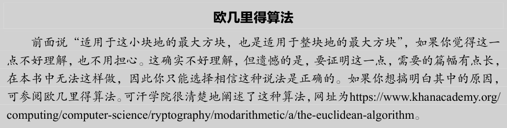

[欧几里得算法](https://baike.baidu.com/item/%E6%AC%A7%E5%87%A0%E9%87%8C%E5%BE%97%E7%AE%97%E6%B3%95)

下面再次使用同样的算法。对于640m×400m的土地，可从中划出的最大方块为400m×400m。

这将余下一块更小的土地，其尺寸为400m×240m。

你可从这块土地中划出最大的方块，余下一块更小的土地，其尺寸为240m×160m。

接下来，从这块土地中划出最大的方块，余下一块更小的土地。

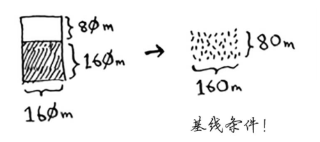

余下的这块土地满足基线条件，因为160是80的整数倍。将这块土地分成两个方块后，将不会余下任何土地！

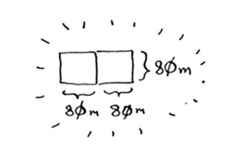

因此，对于最初的那片土地，适用的最大方块为80m×80m。

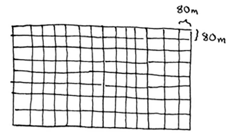

这里重申一下D&C的工作原理：

(1)找出简单的基线条件；

(2)确定如何缩小问题的规模，使其符合基线条件。

D&C并非可用于解决问题的算法，而是一种解决问题的思路。我们再来看一个例子。

给定一个数字数组。

你需要将这些数字相加，并返回结果。使用循环很容易完成这种任务。

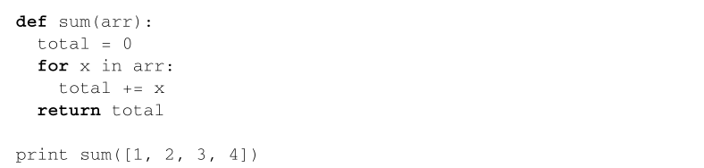

但如何使用递归函数来完成这种任务呢？

第一步：找出基线条件。最简单的数组什么样呢？请想想这个问题，再接着往下读。如果数组不包含任何元素或只包含一个元素，计算总和将非常容易。

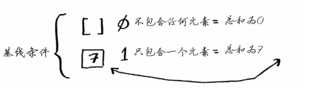

因此这就是基线条件。

第二步：每次递归调用都必须离空数组更近一步。如何缩小问题的规模呢？下面是一种办法。

这与下面的版本等效。

这两个版本的结果都为12，但在第二个版本中，给函数sum传递的数组更短。换言之，这缩小了问题的规模！

函数sum的工作原理类似于下面这样。

这个函数的运行过程如下。

别忘了，递归记录了状态。

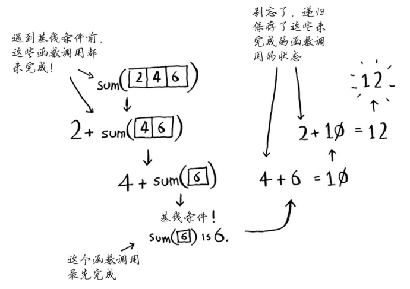

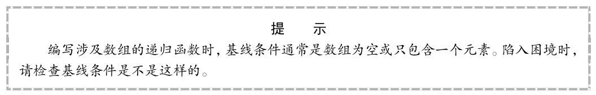

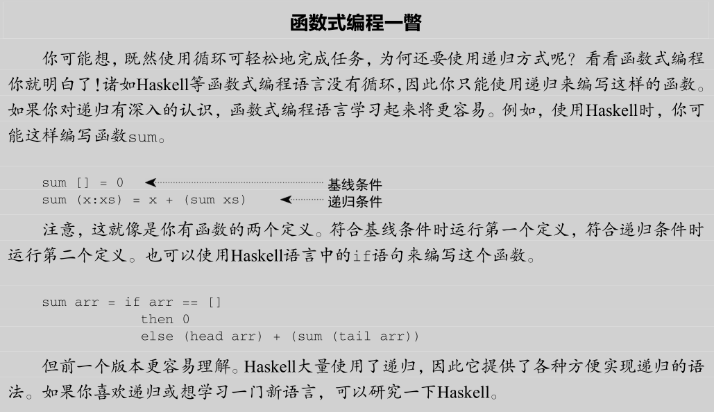

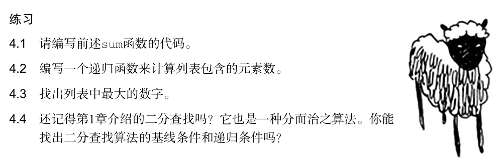

## 快速排序

快速排序是一种常用的排序算法，比选择排序快得多。例如，C语言标准库中的函数qsort实现的就是快速排序。快速排序也使用了D&C。

下面来使用快速排序对数组进行排序。对排序算法来说，最简单的数组什么样呢？还记得前一节的“提示”吗？就是根本不需要排序的数组。

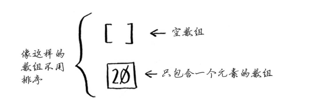

因此，基线条件为数组为空或只包含一个元素。在这种情况下，只需原样返回数组——根本就不用排序。

我们来看看更长的数组。对包含两个元素的数组进行排序也很容易。

包含三个元素的数组呢？

别忘了，你要使用D&C，因此需要将数组分解，直到满足基线条件。下面介绍快速排序的工作原理。首先，从数组中选择一个元素，这个元素被称为基准值(pivot)。

稍后再介绍如何选择合适的基准值。我们暂时将数组的第一个元素用作基准值。

接下来，找出比基准值小的元素以及比基准值大的元素。

这被称为分区(partitioning)。现在你有：

* 一个由所有小于基准值的数字组成的子数组；
* 基准值；
* 一个由所有大于基准值的数组组成的子数组。

这里只是进行了分区，得到的两个子数组是无序的。但如果这两个数组是有序的，对整个数组进行排序将非常容易。

如果子数组是有序的，就可以像下面这样合并得到一个有序的数组：左边的数组+基准值+右边的数组。在这里，就是[10，15]+[33]+[]，结果为有序数组[10，15，33]。

如何对子数组进行排序呢？对于包含两个元素的数组(左边的子数组)以及空数组(右边的子数组)，快速排序知道如何将它们排序，因此只要对这两个子数组进行快速排序，再合并结果，就能得到一个有序数组！

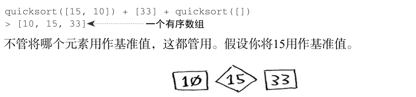

这个子数组都只有一个元素，而你知道如何对这些数组进行排序。现在你就知道如何对包含三个元素的数组进行排序了，步骤如下。

(1)选择基准值。

(2)将数组分成两个子数组：小于基准值的元素和大于基准值的元素。

(3)对这两个子数组进行快速排序。

包含四个元素的数组呢？

假设你也将33用作基准值。

左边的子数组包含三个元素，而你知道如何对包含三个元素的数组进行排序：对其递归地调用快速排序。

因此你能够对包含四个元素的数组进行排序。如果能够对包含四个元素的数组进行排序，就能对包含五个元素的数组进行排序。为什么呢？假设有下面这样一个包含五个元素的数组。

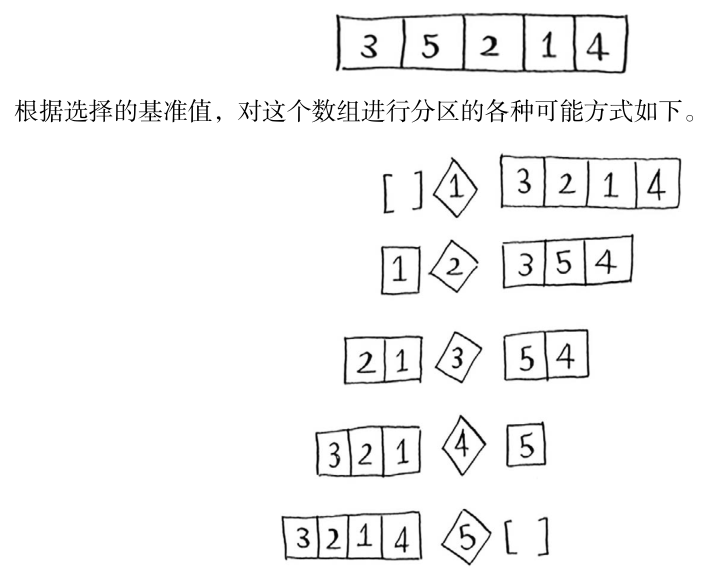

注意，这些子数组包含的元素数都在0～4内，而你已经知道如何使用快速排序对包含0～4个元素的数组进行排序！因此，不管如何选择基准值，你都可对划分得到的两个子数组递归地进行快速排序。

例如，假设你将3用作基准值，可对得到的子数组进行快速排序。

将子数组排序后，将它们合并，得到一个有序数组。即便你将5用作基准值，这也可行。

将任何元素用作基准值都可行，因此你能够对包含五个元素的数组进行排序。同理，你能够对包含六个元素的数组进行排序，以此类推。

下面是快速排序的代码。

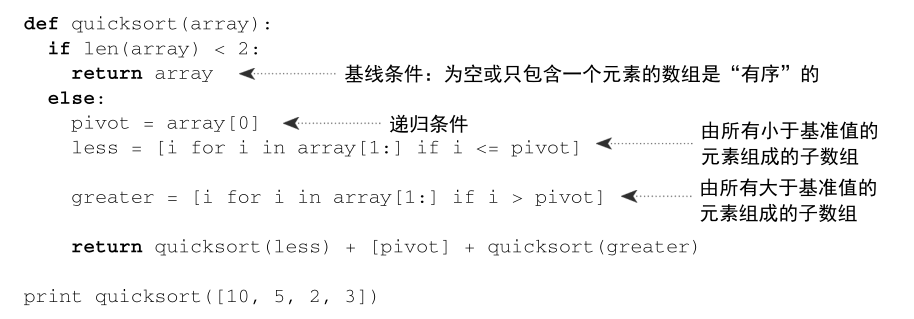

## 再谈大O表示法

快速排序的独特之处在于，其速度取决于选择的基准值。在讨论快速排序的运行时间前，我们再来看看最常见的大O运行时间。

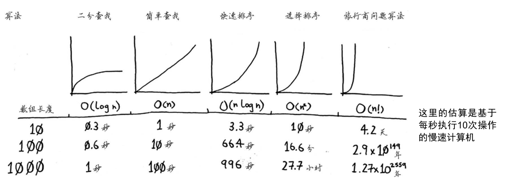

上述图表中的时间是基于每秒执行10次操作计算得到的。这些数据并不准确，这里提供它们只是想让你对这些运行时间的差别有大致认识。实际上，计算机每秒执行的操作远不止10次。

对于每种运行时间，本书还列出了相关的算法。来看看第2章介绍的选择排序，其运行时间为0(n^2^)，速度非常慢。

还有一种名为合并排序(merge sort)的排序算法，其运行时间为O(nlogn)，比选择排序快得多！快速排序的情况比较棘手，在最糟情况下，其运行时间为0(n^2^)。

与选择排序一样慢！但这是最糟情况。在平均情况下，快速排序的运行时间为O(nlogn)。你可能会有如下疑问。

* 这里说的最糟情况和平均情况是什么意思呢？
* 若快速排序在平均情况下的运行时间为O(nlogn)，而合并排序的运行时间总是O(nlogn)，为何不使用合并排序？它不是更快吗？

### 比较合并排序和快速排序

假设有下面这样打印列表中每个元素的简单函数。

这个函数遍历列表中的每个元素并将其打印出来。它迭代整个列表一次，因此运行时间为O(n)。现在假设你对这个函数进行修改，使其在打印每个元素前都休眠1秒钟。

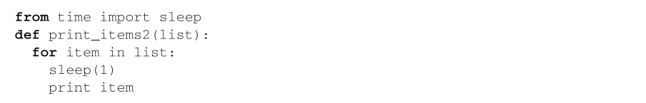

它在打印每个元素前都暂停1秒钟。假设你使用这两个函数来打印一个包含5个元素的列表。

这两个函数都迭代整个列表一次，因此它们的运行时间都为O(n)。你认为哪个函数的速度更快呢？我认为`print_items`要快得多，因为它没有在每次打印元素前都暂停1秒钟。因此，虽然使用大0表示法表示时，这两个函数的速度相同，但实际上`print_items`的速度更快。在大O表示法O(n)中，n实际上指的是这样的。

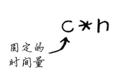

c是算法所需的固定时间量，被称为常量。例如，`print_items`所需的时间可能是10毫秒 * n，而`print_items2`所需的时间为1秒 * n。

通常不考虑这个常量，因为如果两种算法的大O运行时间不同，这种常量将无关紧要。就拿二分查找和简单查找来举例说明。假设这两种算法的运行时间包含如下常量。

你可能认为，简单查找的常量为10毫秒，而二分查找的常量为1秒，因此简单查找的速度要快得多。现在假设你要在包含40亿个元素的列表中查找，所需时间将如下。

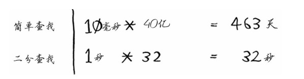

正如你看到的，二分查找的速度还是快得多，常量根本没有什么影响。

但有时候，常量的影响可能很大，对快速查找和合并查找来说就是如此。快速查找的常量比合并查找小，因此如果它们的运行时间都为O(nlogn)，快速查找的速度将更快。实际上，快速查找的速度确实更快，因为相对于遇上最糟情况，它遇上平均情况的可能性要大得多。

此时你可能会问，何为平均情况，何为最糟情况呢？

### 平均情况和最糟情况

快速排序的性能高度依赖于你选择的基准值。假设你总是将第一个元素用作基准值，且要处理的数组是有序的。由于快速排序算法不检查输入数组是否有序，因此它依然尝试对其进行排序。

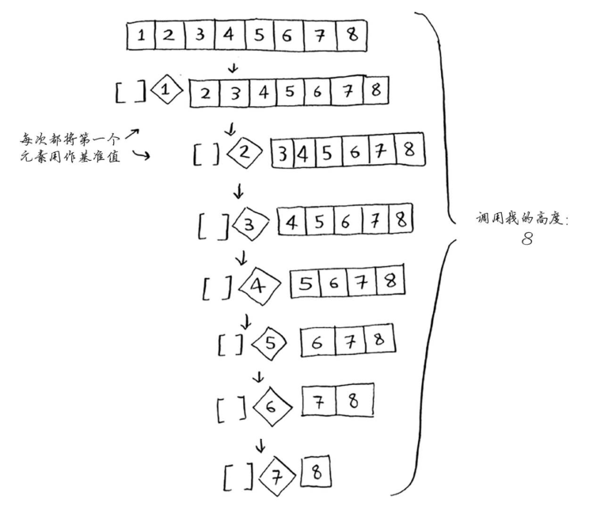

注意，数组并没有被分成两半，相反，其中一个子数组始终为空，这导致调用栈非常长。现在假设你总是将中间的元素用作基准值，在这种情况下，调用栈如下。

调用栈短得多！因为你每次都将数组分成两半，所以不需要那么多递归调用。你很快就到达了基线条件，因此调用栈短得多。

第一个示例展示的是最糟情况，而第二个示例展示的是最佳情况。在最糟情况下，栈长为O(n)，而在最佳情况下，栈长为O(log n)。

现在来看看栈的第一层。你将一个元素用作基准值，并将其他的元素划分到两个子数组中。

这涉及数组中的全部8个元素，因此该操作的时间为O(n)。在调用栈的第一层，涉及全部8个元素，但实际上，在调用栈的每层都涉及O(n)个元素。

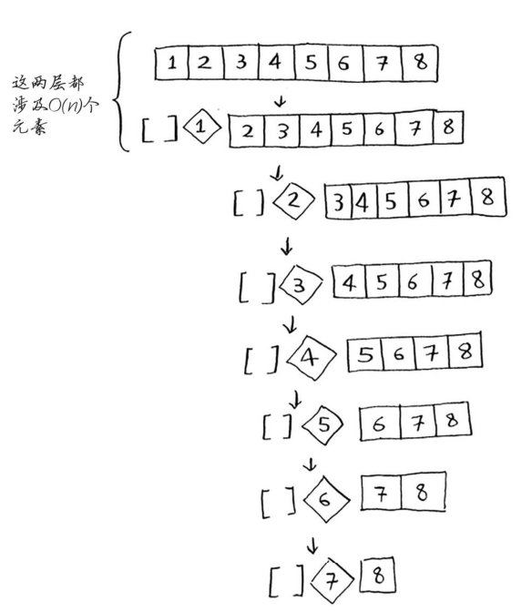

即便以不同的方式划分数组，每次也将涉及O(n)个元素。

因此，完成每层所需的时间都为O(n)。

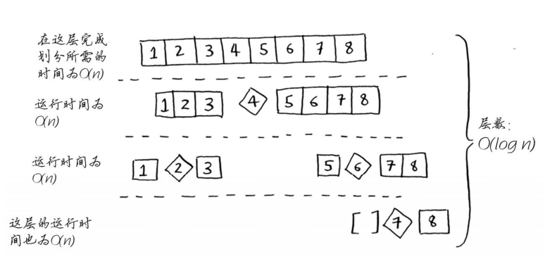

在这个示例中，层数为O(log n)(用技术术语说，调用栈的高度为O(log n))，而每层需要的时间为O(n)。因此整个算法需要的时间为O(n)\*O(logn)=O(nlog n)。这就是最佳情况。

在最糟情况下，有O(n)层，因此该算法的运行时间为O(n)*O(n)=O(n^2^)。

知道吗？这里要告诉你的是，最佳情况也是平均情况。只要你每次都随机地选择一个数组元素作为基准值，快速排序的平均运行时间就将为O(nlogn)。快速排序是最快的排序算法之一，也是D&C典范。

# 第5章：散列表

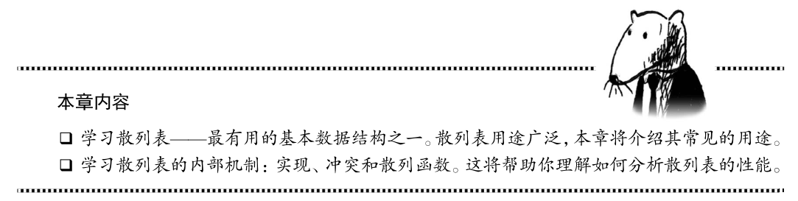

假设你在一家杂货店上班。有顾客来买东西时，你得在一个本子中查找价格。如果本子的内容不是按字母顺序排列的，你可能为查找苹果（apple）的价格而浏览每一行，这需要很长的时间。此时你使用的是第1章介绍的简单查找，需要浏览每一行。还记得这需要多长时间吗？O(n)。如果本子的内容是按字母顺序排列的，可使用二分查找来找出苹果的价格，这需要的时间更短，为O(log n)。

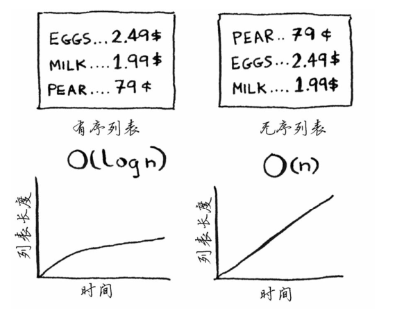

需要提醒你的是，运行时间O（m）和O（log n）之间有天壤之别！假设你每秒能够看10行，使用简单查找和二分查找所需的时间将如下。

你知道，二分查找的速度非常快。但作为收银员，在本子中查找价格是件很痛苦的事情，哪怕本子的内容是有序的。在查找价格时，你都能感觉到顾客的怒气。看来真的需要一名能够记住所有商品价格的雇员，这样你就不用查找了：问她就能马上知道答案。

不管商品有多少，这位雇员（假设她的名字为Maggie）报出任何商品的价格的时间都为0（1），速度比二分查找都快。

真是太厉害了！如何聘到这样的雇员呢？

下面从数据结构的角度来看看。前面介绍了两种数据结构：数组和链表（其实还有栈，但栈并不能用于查找），你可使用数组来实现记录商品价格的本子。

这种数组的每个元素包含两项内容：商品名和价格。如果将这个数组按商品名排序，就可使用二分查找在其中查找商品的价格。这样查找价格的时间将为O(log n)。然而，你希望查找商品价格的时间为0（1），即你希望查找速度像Maggie那么快，这是散列函数的用武之地。

## 散列函数

散列函数是这样的函数，即无论你给它什么数据，它都还你一个数字。

如果用专业术语来表达的话，我们会说，散列函数“将输入映射到数字”。你可能认为散列函数输出的数字没什么规律，但其实散列函数必须满足一些要求。

* 它必须是一致的。例如，假设你输入apple时得到的是4，那么每次输入apple时，得到的都必须为4，如果不是这样，散列表将毫无用处。
* 它应将不同的输入映射到不同的数字。例如，如果一个散列函数不管输入是什么都返回1，它就不是好的散列函数。最理想的情况是，将不同的输入映射到不同的数字。

散列函数将输入映射为数字，这有何用途呢？你可使用它来打造你的"Maggie"！

为此，首先创建一个空数组。

你将在这个数组中存储商品的价格。下面来将苹果的价格加入到这个数组中。为此，将apple作为输入交给散列函数。

散列函数的输出为3，因此我们将苹果的价格存储到数组的索引3处。

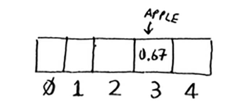

下面将牛奶（milk）的价格存储到数组中。为此，将milk作为散列函数的输入。

散列函数的输出为0，因此我们将牛奶的价格存储在索引0处。

不断地重复这个过程，最终整个数组将填满价格。

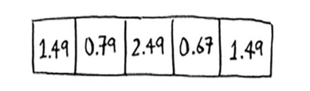

现在假设需要知道鳄梨（avocado）的价格。你无需在数组中查找，只需将avocado作为输入交给散列函数。

它将告诉你鳄梨的价格存储在索引4处。果然，你在那里找到了。

散列函数准确地指出了价格的存储位置，你根本不用查找！之所以能够这样，具体原因如下。

* 散列函数总是将同样的输入映射到相同的索引。每次你输入avocado，得到的都是同一个数字。因此，你可首先使用它来确定将鳄梨的价格存储在什么地方，并在以后使用它来确定鳄梨的价格存储在什么地方。
* 散列函数将不同的输入映射到不同的索引。avocado映射到索引14，milk映射到索引0。每种商品都映射到数组的不同位置，让你能够将其价格存储到这里。
* 散列函数知道数组有多大，只返回有效的索引。如果数组包含5个元素，散列函数就不会返回无效索引100

刚才你就打造了一个"Maggie"！你结合使用散列函数和数组创建了一种被称为散列表（hash table）的数据结构。散列表是你学习的第一种包含额外逻辑的数据结构。数组和链表都被直接映射到内存，但散列表更复杂，它使用散列函数来确定元素的存储位置。

在你将学习的复杂数据结构中，散列表可能是最有用的，也被称为散列映射、映射、字典和关联数组。散列表的速度很快！还记得第2章关于数组和链表的讨论吗？你可以立即获取数组中的元素，而散列表也使用数组来存储数据，因此其获取元素的速度与数组一样快。

你可能根本不需要自己去实现散列表，任一优秀的语言都提供了散列表实现。Python提供的散列表实现为字典，你可使用函数aict来创建散列表。

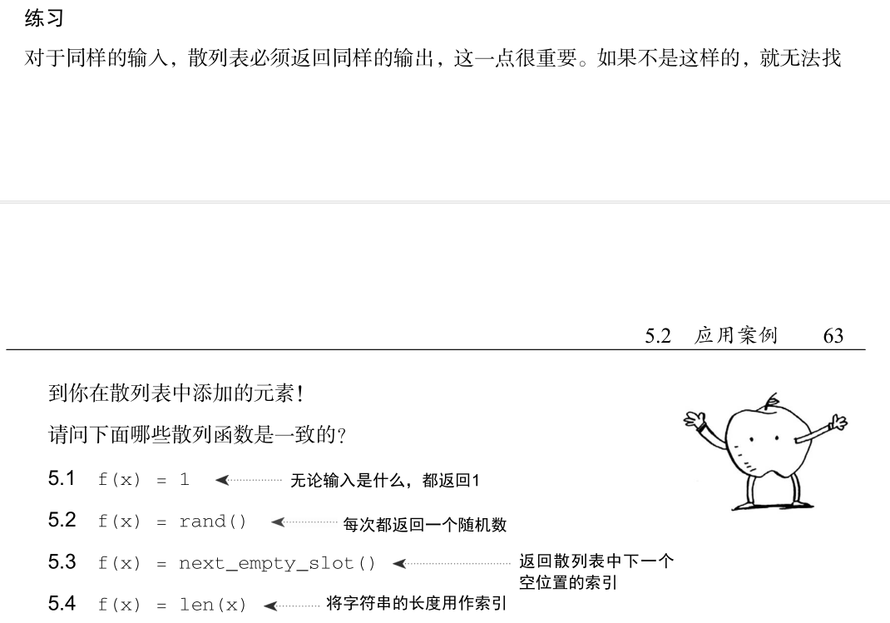

## 应用案例

