（注1：死活找不到第3版的，只能看第二版的了，书上jQuery的版本是v1.7.1,现在[2019-12-27]的版本是v3.4.1）

（注2：我怕时间来不及，还是先学Vue.js吧--2019.12.30）

（注3：现在是2020年7月9日，我又搜了一下，居然找到了第三版的了。有啥来得及来不及的，先学JQuery！！！）

（注4：新下载的好像不是第3版的，好像比我之前下载的版本还老。算了，还是看原来的第二版吧）

# 第1章：认识jQuery

随着Web2.0的兴起，JavaScript越来越受到重视，一系列JavaScript程序库也蓬勃发展起来。从早期Prototype、Dojo到2006年的jQuery，再到2007年的ExtJS，互联网正在掀起一场JavaScript风暴。jQuery以其独特优雅的姿态，始终处于这场风暴的中心，受到越来越多的人的追捧。

## JavaScript和JavaScript库

### JavaScript简介

在正式介绍jQuery之前，有必要先了解一下JavaScript。

JavaScript是Netscape公司开发的一种**脚本语言**（scripting language）。JavaScript的出现使得网页和用户之间实现了一种实时的、动态的和交互的关系，使网页可以包含更多活跃的元素和更加精彩的内容。JavaScript自身存在**3个弊端**，即**复杂的文档对象模型（DOM）**、**不一致的浏览器实现**和**便捷的开发、调试工具的缺乏**。

正当JavaScript 从开发者的视线中渐渐隐去时，一种新型的基于JavaScript的Web技术——**Ajax**
（Asynchronous JavaScript AndXML，异步的JavaScript和XML）诞生了。而使人们真正认识到Ajax技术的强大的导火索是Google公司推出的一系列**新型Web应用**，例如Gmail、Google Suggest和Google Map等。如今，浩瀚的互联网中基于JavaScript的应用越来越多，**JavaScript不再是一种仅仅用于制作Web页面的简单脚本**。

### JavaScript库作用及对比

为了简化JavaScript的开发，一些JavaScript程序库诞生了。JavaScript程序库封装了很多预定义的对象和实用函数，能帮助使用者轻松地建立有高难度交互的Web2.0特性的富客户端页面，并且兼容各大浏览器。下面是目前几种流行的JavaScript程序库的介绍和对比。

**Prototype**（http://www.prototypejs.org/），Logo如图1-1所示。

Prototype是最早成型的JavaScript库之一，对JavaScript的内置对象（例如String对象、Array对象等）做了大量的扩展。现在还有很多项目使用Prototype。Prototype可以看做是把很多好的、有用的JavaScript的方法组合在一起而形成的JavaScript库。使用者可以在需要的时候随时将其中的几段代码抽出来放进自己的脚本里。但是由于Prototype成型年代较早，从整体上对面向对象的编程思想把握得不是很到位，导致了其结构的松散。不过现在Prototype也在慢慢改进。

**Dojo**（http:/dojotoolkit.org/），Logo如图1-2所示。

Dojo的强大之处在于Dojo提供了很多其他JavaScript库所没有提供的功能。例如离线存储的API、生成图标的组件、基于SVG/VML的矢量图形库和Comet支持等。Dojo是一款非常适合企业级应用的JavaScript库，并且得到了IBM、SUN和BEA等一些大公司的支持。但是Dojo的缺点也是很明显的：学习曲线陡，文档不齐全，最严重的就是API不稳定，每次升级都可能导致已有的程序失效。但是自从Dojo的1.0.0版出现以后，情况有所好转，Dojo还是一个很有发展潜力的库。

**YUI**（http:/developer.yahoo.com/yui/），Logo如图1-3所示。

YUI（Yahoo！UI，The Yahoo！User Interface Library），是由Yahoo公司开发的一套完备的、扩展性良好的富交互网页程序工具集。YUI封装了一系列比较丰富的功能，例如DOM操作和Ajax应用等，同时还包括了几个核心的CSS文件。该库本身文档极其完备，代码编写得也非常规范。

**ExtJS**（http://www.extjs.com/），Logo 如图1-4所示。

ExtJS常简称为Ext，原本是对YUI的一个扩展，主要用于创建前端用户界面，如今已经发展到可以利用包括jQuery在内的多种JavaScript框架作为基础库，而Ext作为界面的扩展库来使用。
Ext可以用来开发富有华丽外观的富客户端应用，能使B/S应用更加具有活力。但是由于Ext侧重于界面，本身比较腌肿，所以使用之前请先权衡利弊。另外，需要注意的是，Ext并非完全免费，如果用于商业用途，需要付费获得授权许可。

**Moo Tools**（http://mootools.net/），Logo 如图1-5所示。
MooTools是一套轻量、简洁、模块化和面向对象的JavaScript框架。MooTools的语法几乎跟Prototype 一样，但却提供了更为强大的功能、更好的扩展性和兼容性。其模块化思想非常优秀，核心代码大小只有8KB。无论用到哪个模块都可即时导入，即使是完整版大小也不超过160KB。MooTools完全彻底的贯彻了面向对象的编程思想，语法简洁直观，文档完善，是一个非常不错的JavaScript库。

**jQuery**（http:/jquery.com），Logo如图1-6所示。

本书的重点jQuery同样是一个轻量级的库，**拥有强大的选择器、出色的DOM操作、可靠的事件处理、完善的兼容性和链式操作等功能**。这些优点吸引了一批批的JavaScript开发者去学习它、研究它。

总之，每个JavaScript库都有各自的优点和缺点，同时也有各自的支持者和反对者，目前几个最流行的JavaScript库的Google 访问量趋势图，如图1-7所示。很明显，自从iOuery诞生那天起，其关注度就一直在稳步上升，jQuery 已经逐渐从其他JavaScript库中脱颖而出，成为Web开发人员的最佳选择。

## 加入jQuery

### jQuery简介

jQuery 是继Prototype之后又一个优秀的JavaScript**库**，是一个由John Resig创建于2006年1月的开源项目。现在的jQuery团队主要包括核心库、UI、插件和jQuery Mobile等开发人员以及推广和网站设计、维护人员。

jQuery 凭借简洁的语法和跨平台的兼容性，极大地**简化了JavaScript开发人员遍历HTML文档、操作DOM、处理事件、执行动画和开发Ajax的操作**。其独特而又优雅的代码风格改变了JavaScript程序员的设计思路和编写程序的方式。总之，无论是网页设计师、后台开发者、业余爱好者还是项目管理者，也无论是JavaScript初学者还是JavaScript高手，都有足够多的理由去学习jQuery。

### jQuery的优势

jQuery强调的理念是写得少，做得多（write less，do more）。jQuery独特的选择器、链式操作、事件处理机制和封装完善的Ajax都是其他JavaScript库望尘莫及的。概括起来，jQuery有以下优势。

（1）**轻量级**

jQuery非常轻巧，采用Dean Edwards编写的Packer（http://dean.edwards.name/packer/）压缩后，大小不到30KB，如果使用Min版并且在服务器端启用Gzip压缩后，大小只有18KB。

（2）**强大的选择器**

jQuery允许开发者使用从CSS1到CSS3几乎所有的选择器，以及jQuery独创的高级而复杂的选择器。另外还可以加入插件使其支持XPath选择器，甚至开发者可以编写属于自己的选择器。由于jQuery支持选择器这一特性，因此有一定CSS经验的开发人员可以很容易地切入到jQuery的学习中来。第2章将详细讲解jQuery中强大的选择器。

（3）**出色的DOM操作的封装**

jQuery封装了大量常用的DOM操作，使开发者在编写DOM操作相关程序的时候能够得心应手。jQuery轻松地完成各种原本非常复杂的操作，让JavaScript新手也能写出出色的程序。第3章将重点介绍jQuery中的DOM操作。

（4）**可靠的事件处理机制**

jQuery的事件处理机制吸收了JavaScript 专家Dean Edwards编写的事件处理函数的精华，使得jQuery在处理事件绑定的时候相当可靠。在预留退路（graceful degradation）、循序渐进以及非入侵式（Unobtrusive）编程思想方面，jQuery也做得非常不错。第4章将重点介绍jQuery中的事件处理。

（5）**完善的Ajax**

jQuery 将所有的Ajax 操作封装到一个函数$.ajax()里，使得开发者处理Ajax的时候能够专心处理业务逻辑而无需关心复杂的浏览器兼容性和XMLHttpRequest对象的创建和使用的问题。第6章将重点介绍jQuery中的Ajax处理。

（6）**不污染顶级变量**

jQuery**只建立一个名为jQuery的对象，其所有的函数方法都在这个对象之下**。其别名$也可以随时交出控制权，绝对不会污染其他的对象。该特性使jQuery可以与其他JavaScript库共存，在项目中放心地引用而不需要考虑到后期可能的冲突。

（7）**出色的浏览器兼容性**

作为一个流行的JavaScript库，浏览器的兼容性是必须具备的条件之一。jQuery能够在IE6.0+、FF3.6+、Safari 5.0+、Opera和Chrome等浏览器下正常运行。jQuery同时修复了一些浏览器之间的差异，**使开发者不必在开展项目前建立浏览器兼容库。**

（8）**链式操作方式**

jQuery中最有特色的莫过于它的**链式操作**方式——即对发生在同一个jQuery对象上的一组动作，可以**直接连写而无需重复获取对象**。这一特点使jQuery的代码无比优雅。在第1.3.3小节中，将要讨论代码风格的问题，从最开始就培养良好的编程习惯，将受益无穷。

（9）**隐式迭代**

当用jQuery 找到带有“.myClass”类的全部元素，然后隐藏它们时，无需循环遍历每一个返回的元素。相反，jQuery里的方法都被设计成自动操作对象集合，而不是单独的对象，**这使得大量的循环结构变得不再必要，从而大幅地减少了代码量**。

（10）**行为层与结构层的分离**

开发者可以使用jQuery选择器选中元素，然后直接给元素添加事件。这种将行为层与结构层完全分离的思想，可以使jQuery开发人员和HTML或其他页面开发人员各司其职，摆脱过去开发冲突或个人单干的开发模式。同时，后期维护也非常方便，不需要在HTML代码中寻找某些函数和重复修改HTML代码。

（11）**丰富的插件支持**

jQuery的易扩展性，吸引了来自全球的开发者来编写jQuery的扩展插件。目前已经有成百上千的官方插件支持，而且还不断有新插件面世。第7章将介绍目前流行的几款插件并指导大家编写自己的插件。

（12）**完善的文档**

jQuery的文档非常丰富，不管是英文文档，还是中文文档。我们也在长期更新着jQuery的中文文档。

（13）**开源**

jQuery是一个开源的产品，任何人都可以自由地使用并提出改进意见。

下面就一起开始我们的jQuery之旅吧。

## jQuery代码的编写

### 配置jQuery环境

1. 获取jQuery最新版本

   进入jQuery的官方网站http://query.com/，在图1-8所示右边的GRAB THE LATEST VERSION区域，下载最新的jQuery库（目前是1.3.1版本）文件，本书所有的jQuery实例都是基于1.2.6版本进行编写的。

   > 现在版本都是3.5.1了，原来第三版也没有很新啊。不知道版本差距大不大，先这样学吧。

   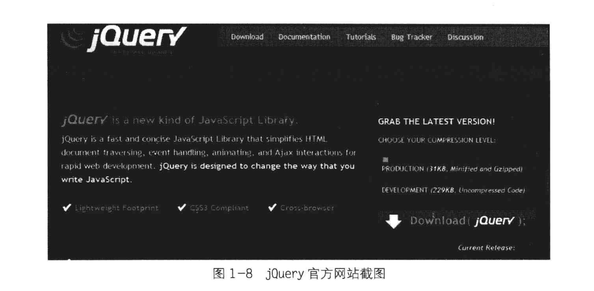

2. jQuery 库类型说明

   jQuery库的类型分为两种，分别是生产版（最小化和压缩版）和开发版（未压缩版），它们的区别如表1-1所示。

   

   为统一本书的讲解，建议选择下载jQuery最新版本。

3. jQuery环境配置

   jQuery**不需要安装**，把下载的jquery.js放到网站上的一个**公共的位置**，想要在某个页面上使用jQuery时，只需要在相关的HTML文档中**引入**该库文件的位置即可。

4. 在页面中引入jQuery

   本书将jquery.js放在**目录scripts下**，在所提供的jQuery例子中为了方便调试，引用时使用的是相对路径。在实际项目中，读者可以根据实际需要调整jQuery库的路径。

   在编写的页面代码中< head>标签内引入jQuery库后，就可以使用jQuery库了，程序如下：

   

   > 在本书的所有章节中，如果没有特别说明，jQuery库都是默认导入的。

### 编写简单的jQuery代码

在开始编写第1个jQuery 程序之前，首先应该明确一点，在jQuery库中，**\$就是jQuery的一个简写形式**，例如\$（“#foo”）和jQuery（"#foo”）是等价的，$.ajax和jQuery.ajax是等价的。如果没有特别说明，**程序中的\$符号都是jQuery的一个简写形式**。

下面开始编写第1个jQuery程序。

~~~javascript
//...省略其他代码
<!-- 引入 jQuery -->

//...省略其他代码
~~~

运行结果如图1-9所示。

在上面的代码中有一个陌生的代码片段，如下：

~~~javascript
$(document).ready(function(){
//...
});
~~~

这段代码的作用类似于传统JavaScript中的window.onload方法，不过与window.onload还是有些区别。表格1-2对它们进行了简单对比。

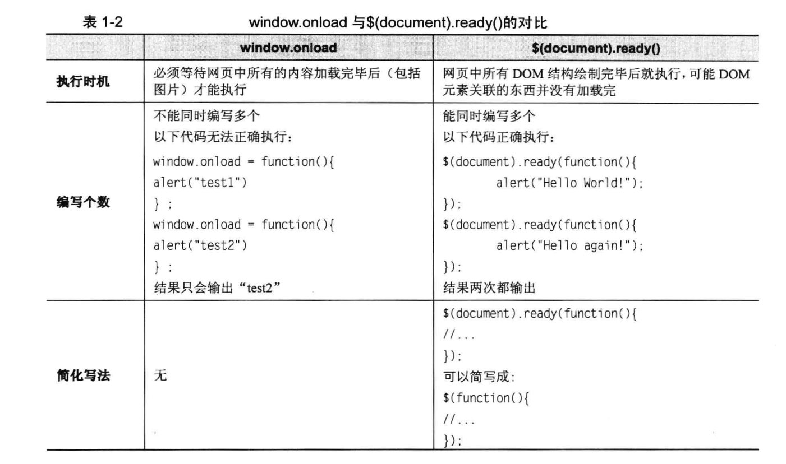

> 注意：关于\$（document）.ready()的详细说明可以参考附录A；关于$（document）.ready()和 window.onload的详细对比，可以参考第4章4.1.1小节。

### jQuery代码风格

代码风格即程序开发人员所编写源代码的书写风格。良好代码风格的特点是使代码易读。如果能统一jQuery代码编码风格，对日后代码的维护是非常有利的。

1. **链式操作风格**

   以一个实际项目中的代码为例，这是一个导航栏，HTML代码如下：

~~~javascript
   <!DOCTYPE html>
   <html lang="en">
   <head>
   	<meta charset="UTF-8">
   	<title>Document</title>
   </head>
   <body>
   	

   		<ul class="menu">
   			<li class="level1">
   				<a href="#none">衬衫</a>
   				<ul class="level2">
   					<li><a href="#none">短袖衬衫</a></li>
   					<li><a href="#none">长袖衬衫</a></li>
   					<li><a href="#none">短袖T恤</a></li>
   					<li><a href="#none">长袖T恤</a></li>
   				</ul>
   			</li>
   
   			<li class="level1">
   				<a href="#none">卫衣</a>
   				<ul class="level2">
   					<li><a href="#none">开襟卫衣</a></li>
   					<li><a href="#none">套头卫衣</a></li>
   					<li><a href="#none">运动卫衣</a></li>
   					<li><a href="#none">童装卫衣</a></li>
   				</ul>
   			</li>
   
   			<li class="level1">
   				<a href="#none">裤子</a>
   				<ul class="level2">
   					<li><a href="#none">短裤</a></li>
   					<li><a href="#none">休闲裤</a></li>
   					<li><a href="#none">牛仔裤</a></li>
   					<li><a href="#none">卡其裤</a></li>
   				</ul>
   			</li>
   		</ul>
   	

   </body>
   </html>
~~~

代码执行效果如下：

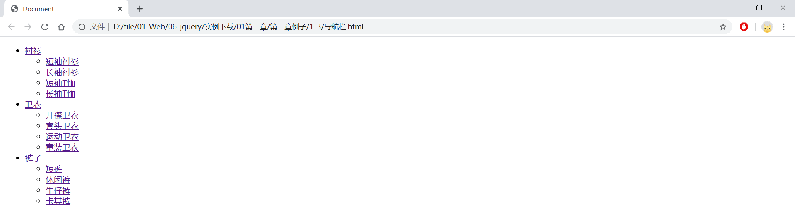

项目需求是做一个导航栏，单击不同的商品名称链接，显示相应的内容，同时高亮显示当前选择的商品。
选择jQuery来实现这个导航栏效果，编写的代码片段如下：

~~~javascript
$(".level1>a").click(function(){
  		$(this).addClass("current").next().show().parent().siblings().children("a").
  	removeClass("current").next().hide();
  		return flase;
});
~~~

这段代码的作用是，当鼠标单击到a元素（它是class含有level1的子元素）的时候，给其添加一个名为current的class，然后将紧邻其后面的元素显示出来，同时将它的父辈的同辈元素内部的子元素< a>都去掉一个名为current的class，并且将紧邻它们后面的元素都隐藏。

单击导航栏，效果如图1-11和图1-12所示。

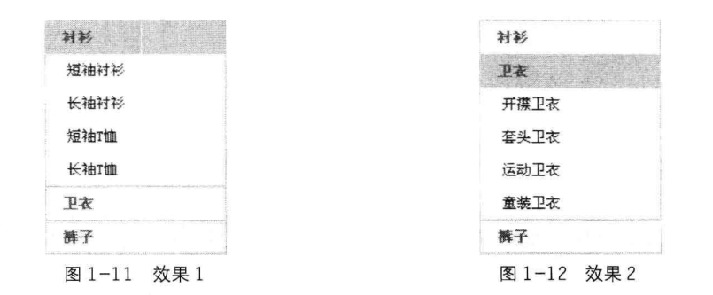

这就是jQuery**强大的链式操作**，一行代码就完成了导航栏的功能。

虽然jQuery做到了行为和内容的分离，但jQuery代码本身也应该拥有良好的层次结构及规范，这样才能进一步改善代码的可读性和可维护性。因此，推荐一种带有适当的格式的代码风格。
上面的代码改成如下格式：

~~~javascript
$(".level1>a").click(function(){
  	$(this).addClass("current")		//给当前元素添加"current"样式
    .next().show()					//下一个元素显示
    .parent().siblings().children("a").removeClass("current")
  									//父元素的同辈元素的子元素<a>移除"current"样式
    .next().hide();							//它们的下一个元素隐藏
  	return flase;
});
~~~

代码格式调整后，易读性好了很多。

也许读者看了上面的代码还是不明白其中的要领，这里总结3种情况。

（1）对于**同一个对象不超过3个操作的**，可以直接写成一行。代码如下：

~~~javascript
$("1i").show().unbind("click");
~~~

（2）对于**同一个对象的较多操作，建议每行写一个操作**。代码如下：

~~~javascript
$(this).removeClass ("mouseout")
	.addClass ("mouseover")
  	.stop()
  	.fadeTo("fast".0.6)
  	.fadeTo("fast".1)
  	.unbind("click")
	.click(function(){
  		//do something ..
	});
~~~

（3）对于**多个对象的少量操作**，可以**每个对象写一行**，如果涉及子元素，可以考虑适当地**缩进**。例如上面提到的代码：

~~~javascript
$(this).addClass("highlight")
		.children("1i"). show().end()
.siblings (). removeClass ("highlight")
		.children("1i"). hide();
~~~

> 注意：程序块严格采用缩进风格书写，能保证代码清晰易读，风格一致。

2. **为代码添加注释**

jQuery以其强大的选择器著称，有时候很复杂的问题用一行选择器就可以轻松解决。但是使用jQuery进行代码编写时应该注意一个问题，就是必要的注释。请看下面的例子，代码如下：

~~~javascript
$("#table>tbody>tr: has(td:has(:checkbox:enabled))").css("background","red");
~~~

这行代码即使是经验丰富的jQuery开发者也不能立刻看懂。

这行代码的作用是，在一个id为table的表格的tbody元素中，如果每行的一列中的checkbox没有被禁用，则把这一行的背景色设为红色。

jQuery的选择器很强大，能够省去使用普通的JavaScript必须编写的很多行代码。但是，在编写一个优秀的选择器的时候，千万不要忘记给这一段代码加上注释，这很重要。无论是自己日后阅读还是与他人分享、合作开发，注释都能起到良好的效果。在上段代码片段中加上注释就能提高其易读性，如下所示：

~~~javascript
//在一个id为table的表格的tbody元素中，如果每行的一列中的checkbox没有被禁用，则把这一行的背景色设为红色。
$("#table>tbody>tr: has(td:has(:checkbox:enabled))").css("background","red");
~~~

通过类似有意义的注释，能够培养良好的编码习惯和风格，提高开发效率。

## jQuery对象和DOM对象

### DOM对象和JQuery对象简介

第一次学习jQuery，**经常分辨不清哪些是jQuery对象、哪些是DOM对象**，因此需要重点了解jQuery对象和DOM对象以及它们之间的关系。

#### DOM对象

DOM（Document Object Model，文档对象模型），每一份DOM都可以表示成一棵树。下面来构建一个非常基本的网页，网页代码如下：

初始化效果图如图1-13所示。

可以把上面的HTML结构描述为一棵DOM树，如图1-14所示。

在这棵DOM树中，< h3>、< p>、< u>以及< ul>的3个< li>子节点都是DOM元素节点。可以通过JavaScript中的getElementsByTagName或者getElementByld来获取元素节点。像这样得到的DOM元素就是DOM对象。DOM对象可以使用JavaScript中的方法，示例如下：

~~~javascript
var domObj  =  documnet.getElementById("id");		//获取DOM对象
var ObjHTML =  domObj.innerHTML;					//使用JavaScript中的属性——innerHTML
~~~

#### JQuery对象

jQuery对象就是通过jQuery包装DOM对象后产生的对象。

**jQuery对象是jQuery独有的**。如果一个对象是jQuery对象，那么就可以使用jQuery里的方法。例如：

~~~javascript
$（"#foo"）.html();				//获取id为foo的元素内的html代码。.html（）是jQuery里的方法
~~~

这段代码等同于：

~~~javascript
document.getElementById("foo").inerHTML:
~~~

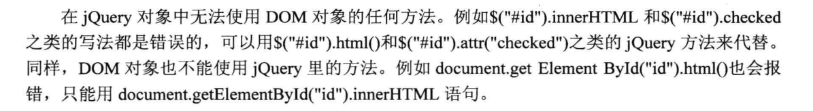

> 注意：用#id作为选择符取得的是jQuery对象而并非document.getElementByld（"id"）所得到的DOM对象，两者并不等价。关于“#”选择符的运用，将在下一章进行讲解。从学习jQuery开始就应当树立正确的观念，**分清jQuery对象和DOM对象之间的区别**，之后学习jQuery就会轻松很多。

### jQurey对象和DOM对象的相互转换

在讨论jQurey对象和DOM对象的相互转换之前，先**约定好定义变量的风格**。如果获取的对象是jQuery对象，那么在**变量前面加上$**，例如：

~~~javascript
var $variable = jQuery对象;
~~~

如果获取的是DOM对象，则定义如下：

~~~javascript
var variable = DOM对象
~~~

本书中的例子均会以这种方式呈现，以方便读者阅读。

#### jQuery对象转成DOM对象

jQuery对象不能使用DOM中的方法，但如果对jQuery对象所提供的方法不熟悉，或者jQuery没有封装想要的方法，不得不使用DOM对象的时候，有以下两种处理方法。

Query提供了两种方法将一个jQuery对象转换成DOM对象，即**[index]**和**get（index）**。

（1）jQuery 对象是一个**类似数组**的对象，**可以通过[index]方法得到相应的DOM对象。**

jQuery代码如下：

~~~javascript
var $cr = $("#cr");					//jQuery对象
var cr = $cr[0];					//DOM对象
alert(cr.checked);					//检测这个checkbox是否被选中了
~~~

（2）另一种方法是jQuery本身提供的，通过getindex）方法得到相应的DOM对象。

jQuery代码如下：

~~~javascript
var $cr = $("#cr");						//jQuery对象
var cr = $cr.get(0);					//DOM对象
alert(cr.checked);						//检测这个checkbox是否被选中了
~~~

#### DOM对象转成jQuery对象

对于一个DOM对象，只需要用SO把DOM对象包装起来，就可以获得一个jQuery对象了。方式为$(DOM对象)。

jQuery代码如下：

~~~javascript
var cr  = document.getElementById("cr");			//DOM对象
var $cr = $(cr);									//jQuery对象
~~~

转换后，可以任意使用jQuery中的方法。

通过以上方法，可以任意地相互转换jQuery对象和DOM对象。

最后再次强调，DOM对象才能使用DOM中的方法，jQuery对象不可以使用DOM中的方法，但jQuery对象提供了一套更加完善的工具用于操作DOM，关于jQuery的DOM操作将在第3章进行详细讲解。

> 注意：平时用到的JQuery对象都是通过\$()函数制造出来的，$()函数就是一个jQuery对象的制造工厂。

### 实例研究

下面举个简单的例子，来加深对jQuery对象和DOM对象的理解。

有些论坛在用户注册的时候，必须先要同意论坛的规章制度，才可以进行下一步操作。如图1-15是某个论坛的注册页面，用户必须选中页面下方的“同意并接受注册协议”复选框，否则不能提交。

编写一段简单的代码来实现这个功能。新建一个空白的页面，然后添加以下HTML代码:

~~~html
<input type='checkbox' id='cr'/><label for='cr'>我已经阅读了上面制度</label>
~~~

HTML代码初始效果如图1-16所示。

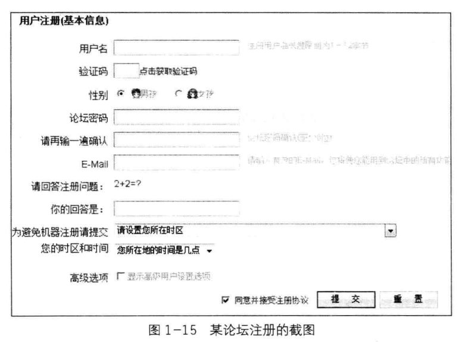

换一种方式，使用jQuery中的方法来判断选项是否被选中，代码如下：

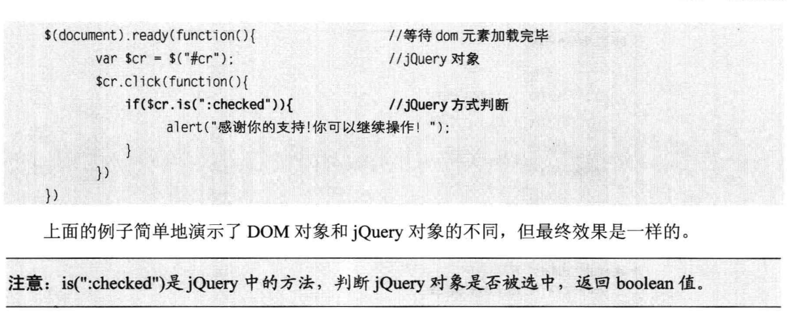

## 解决jQuery和其他库的冲突

在jQuery库中，几乎所有的插件都被限制在它的命名空间里。通常，全局对象都被很好地存储在jQuery命名空间里，因此当把jQuery和其他JavaScript库（例如Prototype，MooTools或YU）一起使用时，不会引起冲突。

> 注意：默认情况下，jQuery用$作为自身的快捷方式。

### jQuery库在其他库之后导入

在其他库和jQuery库都被加载完毕后，可以在任何时候调用jQuery.noConflict）函数来将变量S的控制权移交给其他JavaScript库。示例如下：

然后，就可以在程序里将jQuery（）函数作为jQuery对象的制造工厂。

此外，还有另一种选择。如果想确保jQuery不会与其他库冲突，但又想自定义一个快捷方式，可以进行如下操作：

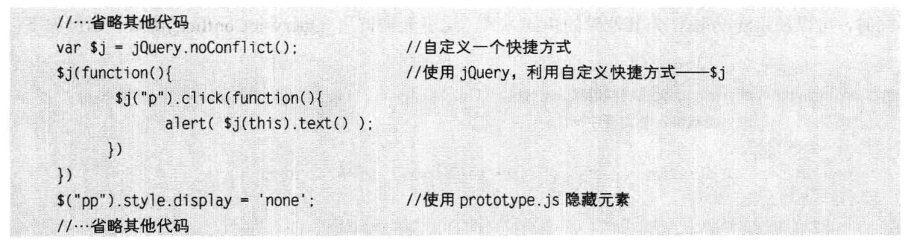

可以自定义备用名称，例如jq、\$J、awesomequery等。

如果不想给jQuery自定义这些备用名称，还想使用$而不管其他库的\$()方法，同时又不想与其他库相冲突，那么可以使用以下两种解决方法。

### jQuery库在其他库之前导入

如果jQuery库在其他库之前就导入了，那么可以直接使用"jQuery"来做一些jQuery的工作。同时，可以使用SO方法作为其他库的快捷方式。这里无需调用jQuery.noConfict）函数。示例如下：

有了这些方法来解决冲突，就可以在项目中放心地引用jQuery了。

## jQuery开发工具和插件

1.Dreamweaver(内容略，不写了)

2.Aptana(内容略，不写了)

3.jQueryWTP和Spket插件

4.Visual Studio 2008

5.其他工具

## 小结

本章前半部分简单介绍了Javascript，同时也对目前流行的几个JavaScript库进行了介绍和对比。然后介绍了jQuery的由来和优势，接下来编写了一个最简单的jQuery程序。在程序中，接触到了$（document）.ready），此外还约定了jQuery的代码风格和变量风格。

后半部分重点介绍了jQuery对象和DOM对象的区别以及它们之间的相互转换，中间插入了一个简单的实例用来加强对jQuery对象和DOM对象的理解。然后讲解了如何解决jQuery和其他JavaScript库冲突的问题，帮助那些项目上已经使用了其他JavaScript库的使用者。最后介绍了几个jQuery的自动提示代码功能的插件。

第1章特意强调了代码风格和变量风格，jQuery对象和DOM对象，希望能引起初学者的注意。

# 第2章：jQuery选择器

选择器是jQuery的根基，在jQuery中，对事件处理、遍历DOM和Ajax操作都依赖于选择器。如果能熟练地使用选择器，不仅能简化代码，而且可以达到事半功倍的效果。

## jQuery选择器是什么

**1.CSS选择器**

在开始学习jQuery选择器之前，有必要简单了解前几年流行起来的css（Cascading Style Shees，层叠样式表）技术。Css是一项出色的技术，它使得网页的结构和表现样式完全分离。利用CSS选择器能轻松地对某个元素添加样式而不改动HTML结构，只需通过添加不同的CSS规则，就可以得到各种不同样式的网页。

(以下略，CSS学过就不重复学了)

**2.jQuery选择器**

jQuery中的选择器完全继承了CSS的风格。利用jQuery选择器，可以非常便捷和快速地找出特定的DOM元素，然后为它们添加相应的行为，而无需担心浏览器是否支持这一选择器。学会使用选择器是学习jQuery的基础，jQuery的行为规则都必须在获取到元素后才能生效。

下面来看一个简单的例子，代码如下：

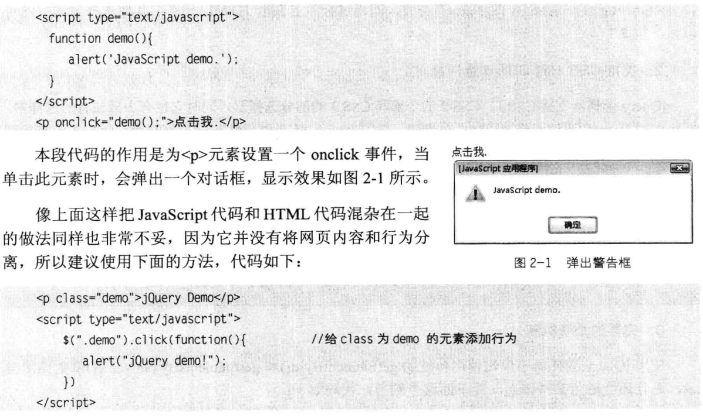

此时，可以对Css的写法和jQuery的写法进行比较。
CSS获取到元素的代码如下：

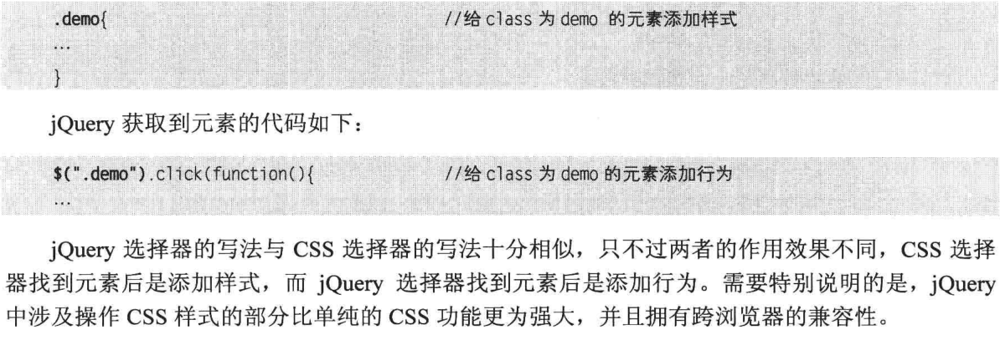

## jQuery选择器的优势

**1.简洁的写法**

$()函数在很多JavaScript类库中都被作为一个选择器函数来使用，在jQuery中也不例外。其中,\$("#ID")用来代替document.getElementByld()函数，即通过ID获取元素；\$("tagName")用来代替document.getElementsByTagName()函数，即通过标签名获取HTML元素；其他选择器的写法可以参见第2.3节。

**2.支持CSS1到CSS3选择器**

jQuery选择器支持CSS1、CSS2的全部和CSS3的部分选择器，同时它也有少量独有的选择器，因此对拥有一定CSS基础的开发人员来说，学习jQuery选择器是件非常容易的事，而对于没有接触过CSS技术的开发人员来说，在学习jQuery选择器的同时也可以掌握Css选择器的基本规则。

使用CSS选择器时，开发人员需要考虑主流浏览器是否支持某些选择器。而在jQuery中，开发人员则可以放心地使用jQuery选择器而无需考虑浏览器是否支持这些选择器。

**3.完善的处理机制**

使用jQuery 选择器不仅比使用传统的getElementByld()和getElementsByTagName()函数简洁得多，而且还能避免某些错误。看下面这个例子，代码如下：

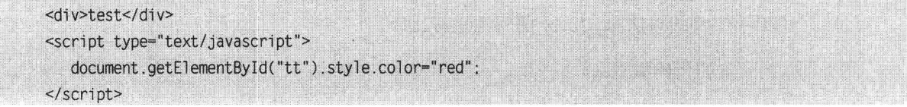

运行上面的代码，浏览器就会报错，原因是网页中没有id为"tt"的元素。
改进后的代码如下：

这样就可以避免浏览器报错，但如果要操作的元素很多，可能对每个元素都要进行一次判断，大量重复的工作会使开发人员感到厌倦，而jQuery在这方面问题上的处理是非常不错的，即使用jQuery获取网页中不存在的元素也不会报错，看下面的例子，代码如下：

有了这个预防措施，即使以后因为某种原因删除网页上某个以前使用过的元素，也不用担心这个网页的Javascript代码会报错。

需要注意的是，$("#tt")获取的永远是对象，即使网页上没有此元素。因此当要用jQuery检查某个元素在网页上是否存在时，不能使用以下代码：

而应该根据获取到元素的长度来判断，代码如下：

或者转化成DOM对象来判断，代码如下：

## jQuery选择器

在正式学习jQuery选择器之前，先看几组用传统的JavaScript方法获取页面中的元素，然后给元素添加行为事件的例子。

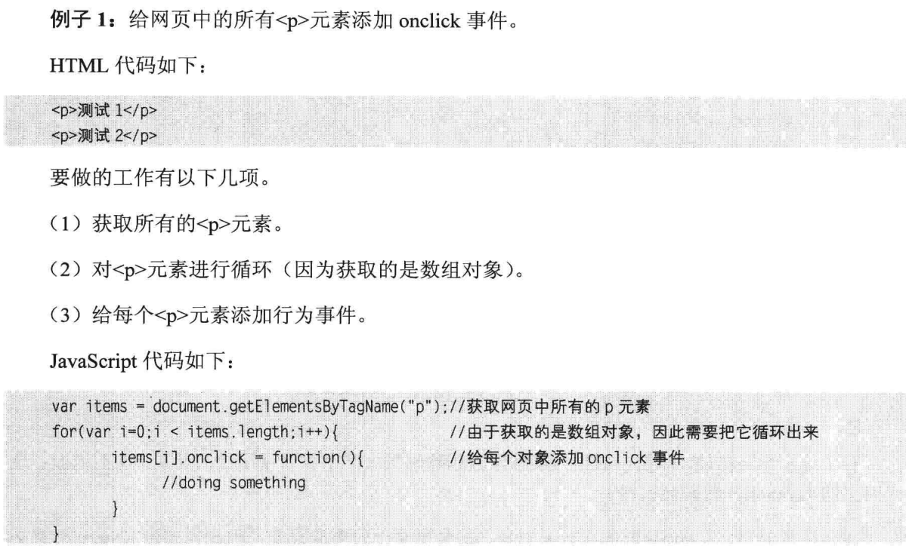

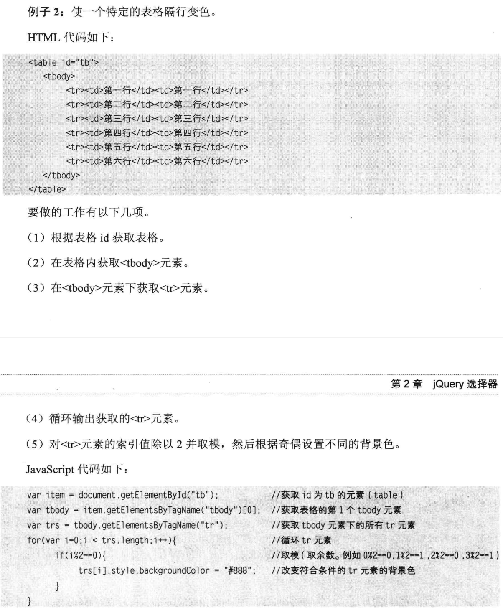

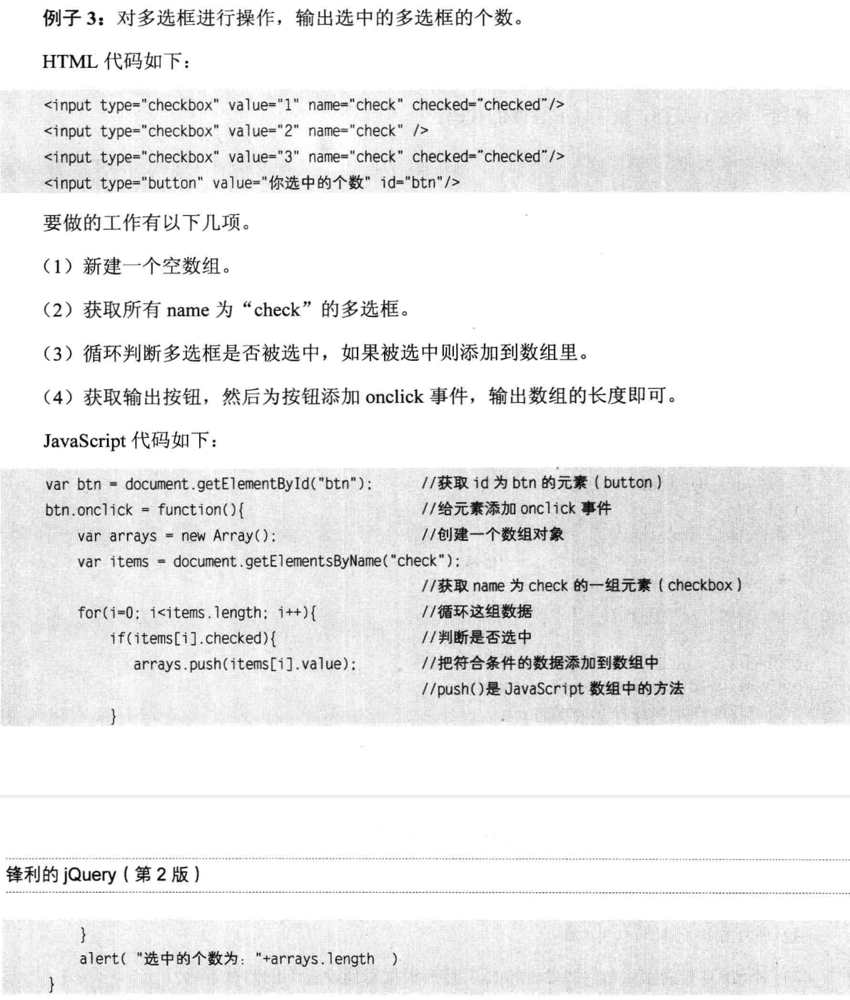

上面的几个例子都是用传统的JavaScript方法进行操作，中间使用了getElement Byld()、getElementsByTagName()和getElementsByName()等方法，然后动态地给元素添加行为或者样式。这些虽然都是JavaScript中最简单的操作，但不断重复使用getElementByld()和getElementsByTagName()等冗长而难记的名称，使越来越多的开发人员开始厌倦这种枯燥的写法，并且有时候为了获取网页中的某个元素，需要编写很多的getElementByld()和getElementsByTagName()方法。然而在jQuery中，类似的这些操作则非常简洁。

下面学习如何使用jQuery获取这些元素。

jQuery选择器分为基本选择器、层次选择器、过滤选择器和表单选择器。在下面的章节中将分别用不同的选择器来查找HTML代码中的元素并对其进行简单的操作。为了能更清晰、直观地讲解选择器，首先需要设计一个简单的页面，里面包含各种<div元素和< span>元素，然后使用jQuery选择器来匹配元素并调整它们的样式。

新建一个空白页面，输入以下HTML代码：

然后用CSS对这些元素进行初始化大小和背景颜色的设置，CSS代码如下：

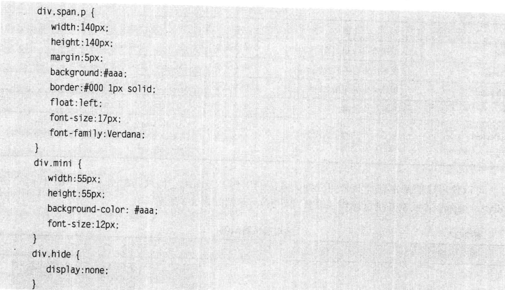

### 基本选择器

### 层次选择器

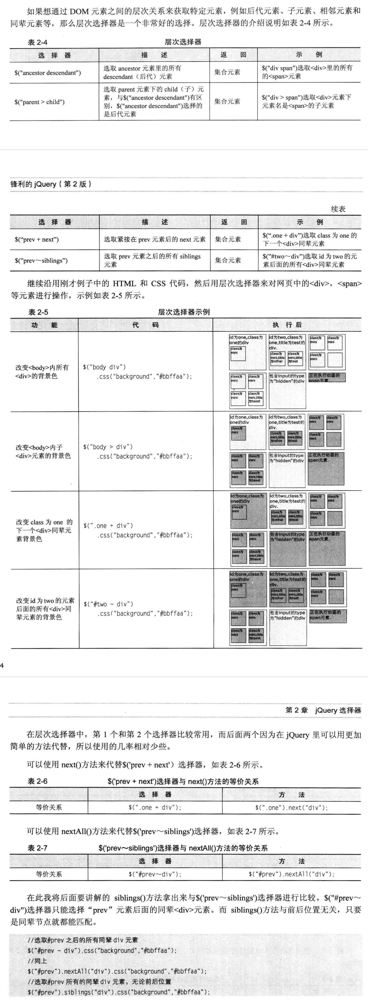

### 过滤选择器

### 表单选择器

